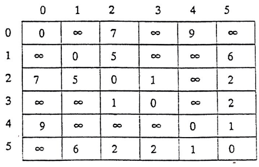

# DS-2005-32

## 1. 原题

若一个带权无向图的邻接矩阵如下图所示，画出该图，并按 $prim$ 算法构造出该图的一棵最小生成树（要有其构造步骤）。



题图（邻接矩阵）转录为文本（$\infty$ 表示两顶点间无弧/边，行、列下标均为 $0..5$）：

|   | 0 | 1 | 2 | 3 | 4 | 5 |
|---|---|---|---|---|---|---|
| **0** | 0 | $\infty$ | 7 | $\infty$ | 9 | $\infty$ |
| **1** | $\infty$ | 0 | 5 | $\infty$ | $\infty$ | 6 |
| **2** | 7 | 5 | 0 | 1 | $\infty$ | 2 |
| **3** | $\infty$ | $\infty$ | 1 | 0 | $\infty$ | 2 |
| **4** | 9 | $\infty$ | $\infty$ | $\infty$ | 0 | 1 |
| **5** | $\infty$ | 6 | 2 | 2 | 1 | 0 |

> 原题此处存在读图不确定性：矩阵为回忆版重绘图像，本解析逐格读取后**已验证 $A[i][j]=A[j][i]$（对称）且对角线全为 0**，与"带权无向图"的题设一致，故采用该读法。

## 2. 答案

**(1) 该图**：$V=\{0,1,2,3,4,5\}$，边集（共 8 条）：

$$(0,2)=7,\ (0,4)=9,\ (1,2)=5,\ (1,5)=6,\ (2,3)=1,\ (2,5)=2,\ (3,5)=2,\ (4,5)=1$$

**(2) Prim 最小生成树（起点取 0）**：依次选边

$$(0,2)=7\ \to\ (2,3)=1\ \to\ (2,5)=2\ \to\ (5,4)=1\ \to\ (2,1)=5$$

树形与权值和：

```
                 0
                 │7
                 2
     ┌───────────┼───────────┐
   5 │         1 │         2 │
     1           3           5
                             │1
                             4
```

$$\text{MST 权值之和}=7+1+2+1+5=\boxed{16}$$

## 3. 题目分析

- 已知：带权无向图的**邻接矩阵**（$\infty$ 表示无边）；
- 目标：① 由矩阵还原图；② 用 **Prim 算法**给出**构造步骤**（逐趟选边），得一棵最小生成树；
- 约束：Prim 每步必须在"已选顶点集 $U$ 与 $V-U$"之间的横截边中取**权值最小**者（割性质），共选 $|V|-1=5$ 条边；
- 命题意图：考"邻接矩阵 → 图"的读图能力 + Prim 算法的**逐趟执行过程**（不是只写结果），并隐含"平局时生成树不唯一、权值和唯一"。

## 4. 核心考点

核心考点：
DS04.04.01 最小（代价）生成树（Prim 算法的选边规则与过程记录）

辅助考点：
DS04.02.01 邻接矩阵法（$A[i][j]$ 存边权、$\infty$ 表示无边、无向图矩阵对称）；DS04.01 图的基本概念（$n$ 个顶点的生成树恰有 $n-1$ 条边）

解释：第 (1) 问完全落在邻接矩阵的存储约定上；第 (2) 问的"要有构造步骤"即 Prim 的横截边逐步选取，边数核对 $n-1=5$ 属图的基本性质。

## 5. 解题思路

1. **读矩阵**：只扫上三角（$i<j$），把非 $0$ 非 $\infty$ 的格写成带权边 → 8 条边（顺手核对对称性，防读图错漏）；
2. **画图**：任选布局，把 6 个顶点与 8 条边画出（顶点度数可作核对：$\deg(2)=4$、$\deg(5)=4$、$\deg(0)=2$、$\deg(1)=2$、$\deg(3)=2$、$\deg(4)=2$，度之和 $16=2\times 8$ ✓）；
3. **Prim**：令 $U=\{0\}$；每趟列出 $U$ 到 $V-U$ 的全部横截边，取最小者加入 $U$；重复 5 次；
4. **自检**：用 Kruskal（全局按边权升序、不成环则取）再算一次，两法权值和应同为 16。

## 6. 详细解答

### (1) 由邻接矩阵得边表

上三角非零非 $\infty$ 元素：$A[0][2]=7$、$A[0][4]=9$、$A[1][2]=5$、$A[1][5]=6$、$A[2][3]=1$、$A[2][5]=2$、$A[3][5]=2$、$A[4][5]=1$，共 8 条边。度序列核对：$\deg(0)=2,\deg(1)=2,\deg(2)=4,\deg(3)=2,\deg(4)=2,\deg(5)=4$，和为 $16=2|E|$ ✓，图连通（从 0 可到 2、4，经 2 到 1、3、5）→ 存在生成树。

### (2) Prim 构造步骤（$U$ 为已并入生成树的顶点集）

| 步 | $U$（选边前） | 横截边集 $E(U,V-U)$ | 选取的最小横截边 | $U$（选边后） |
|---|---|---|---|---|
| 1 | $\{0\}$ | $(0,2)=7$、$(0,4)=9$ | **$(0,2)=7$** | $\{0,2\}$ |
| 2 | $\{0,2\}$ | $(0,4)=9$、$(2,1)=5$、$(2,3)=1$、$(2,5)=2$ | **$(2,3)=1$** | $\{0,2,3\}$ |
| 3 | $\{0,2,3\}$ | $(0,4)=9$、$(2,1)=5$、$(2,5)=2$、$(3,5)=2$ | **$(2,5)=2$**（与 $(3,5)=2$ 平局） | $\{0,2,3,5\}$ |
| 4 | $\{0,2,3,5\}$ | $(0,4)=9$、$(2,1)=5$、$(5,1)=6$、$(5,4)=1$ | **$(5,4)=1$** | $\{0,2,3,4,5\}$ |
| 5 | $\{0,2,3,4,5\}$ | $(2,1)=5$、$(5,1)=6$ | **$(2,1)=5$** | $V$（全部 6 个顶点） |

选边数 $5=|V|-1$ ✓，无回路 ✓ → 是一棵生成树。

$$\mathrm{W}(T)=7+1+2+1+5=16$$

**平局说明**：第 3 步 $(2,5)$ 与 $(3,5)$ 权值同为 2。若改选 $(3,5)=2$，则第 4 步横截边为 $(0,4)=9$、$(2,1)=5$、$(5,1)=6$、$(5,4)=1$，仍选 $(5,4)=1$，第 5 步选 $(2,1)=5$，得边集 $\{(0,2),(2,3),(3,5),(5,4),(2,1)\}$，权值和仍是 16。即**最小生成树不唯一，但权值和唯一**（与 DS-2005-25 的结论呼应）。

### (3) Kruskal 交叉验证

边按权升序：$(2,3)=1,\ (4,5)=1,\ (2,5)=2,\ (3,5)=2,\ (1,2)=5,\ (1,5)=6,\ (0,2)=7,\ (0,4)=9$。

- 取 $(2,3)$；取 $(4,5)$；取 $(2,5)$（连通 $\{2,3\}$ 与 $\{4,5\}$）；
- $(3,5)$ 的两端已在同一分量（$3-2-5$）→ 舍去（避免回路）；
- 取 $(1,2)$；$(1,5)$ 成环舍去；取 $(0,2)$ → 已集齐 6 个顶点，结束。

边集 $\{(2,3),(4,5),(2,5),(1,2),(0,2)\}$，权值和 $1+1+2+5+7=16$ ✓ 与 Prim 结果完全相同（本例中两法选出的边集一致）。

## 7. 选项分析

不适用（问答题）。

## 8. 考场标准答案

(1) 图 $G$：6 个顶点 $0\sim5$，8 条带权边 $(0,2)7$、$(0,4)9$、$(1,2)5$、$(1,5)6$、$(2,3)1$、$(2,5)2$、$(3,5)2$、$(4,5)1$（按邻接矩阵上三角逐格连线）。

(2) Prim（起点 0），每步取"已选顶点集与未选顶点集之间"权最小的边：

| 步 | 选中边 | 权 | $U$ |
|---|---|---|---|
| 初 | — | — | $\{0\}$ |
| 1 | $(0,2)$ | 7 | $\{0,2\}$ |
| 2 | $(2,3)$ | 1 | $\{0,2,3\}$ |
| 3 | $(2,5)$ | 2 | $\{0,2,3,5\}$ |
| 4 | $(5,4)$ | 1 | $\{0,2,3,4,5\}$ |
| 5 | $(2,1)$ | 5 | $V$ |

最小生成树权值之和 $=7+1+2+1+5=16$。（第 3 步若取 $(3,5)$ 亦得权值和 16 的另一棵 MST。）

## 9. 易错点

1. **把 Prim 写成 Kruskal**：Prim 的候选边必须"一端已在 $U$ 内"，Kruskal 才是在全图边中按权排序取不成环者——本题明确要求 Prim 的步骤，写成全局排序不给分；
2. 读矩阵时下三角/上三角漏读，或把 $\infty$ 当成 0（得无边 vs 零权边）；
3. 忘记生成树必须含**全部** 6 个顶点、恰 5 条边（少选一条往往说明横截边集列不全）；
4. 起点未指定时随意写却不声明——应先写明"设从顶点 0 出发"，并说明 Prim 的权值和与起点无关；
5. 遇到平局（第 3 步的两个权值 2）误以为出错：平局合法，只需说明结果不唯一。

## 10. 一句话规律

Prim 与 Kruskal 的分工记忆法：**Prim 看"点集边界"（适合稠密图/邻接矩阵），Kruskal 看"全局边序"（适合稀疏图/边表）**；两法算出的权值和必相等，可互为检查。

## 11. 关联知识

- 邻接矩阵存带权无向图：对称存储可压缩到下三角一维数组（DS02.05 同型技巧），$\infty$ 与 0 的语义要分清（DS04.02.01）；
- 本题图的边数 8、顶点 6，若改用邻接表存储则各表结点总数 $=2\times8=16$（与 DS-2005-07 的结论"邻接表结点数 $=2e$"一致）；
- 最小生成树的个数问题见 DS-2005-25（答案"有一棵或多棵"），本题正是"有多棵"的一个实例。

## 12. 来源与可信度

- 原题来源：2005 回忆版题面文本 + 题图 `真题/2005/imgs/fig3.png`（邻接矩阵为回忆版重绘）；该年**题面篇原始 URL 未单独存档**（见 `reports/source_inventory.md` §3），`source_url` 统一记录为专栏入口 https://zhuanlan.zhihu.com/p/1928578058761270163；
- 答案来源：独立推导（Prim 逐步选边；Kruskal 独立复算，权值和同为 16；另用度之和 $=2|E|$ 核对读图）；
- 教材依据：严蔚敏《数据结构（C 语言版）》第 7 章 图（图的存储结构：邻接矩阵/邻接表；图的连通性问题：最小生成树 Prim、Kruskal）；
- 多来源冲突：无；争议：无。缺陷在于题面未指定 Prim 起点、且存在等权边导致 MST 边集不唯一，已在第 6 节按标准口径处理并声明；
- 最终可信度：权值和 16 为 high；具体边集为"其中一棵"（依赖起点与平局处理）medium-high。
