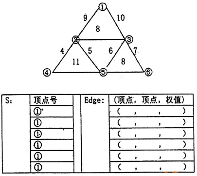

# DS-2006-38

## 1. 原题

对下面的带权无向图采用 $prim$ 算法从顶点 $①$ 开始构造最小生成树，写出生成树顶点集合 $S$ 和选择边 $Edge$ 的顺序。



题图转录为边表（顶点为带圈数字 $①\sim⑥$，权值按其在对应边旁的位置读取）：

| 边 | ①—② | ①—③ | ②—③ | ②—④ | ②—⑤ | ③—⑤ | ③—⑥ | ④—⑤ | ⑤—⑥ |
|---|---|---|---|---|---|---|---|---|---|
| 权 | 9 | 10 | 8 | 4 | 5 | 6 | 7 | 11 | 8 |

题图下方另附一张待填表：左栏 $S$（顶点号）首格印 $①^*$（表示起点已并入），其余格留空；右栏 $Edge$ 为若干行 $(\ ,\ ,\ )$ 三元组，供逐趟填写"（起点，终点，权值）"。

> 原题此处存在图像读取不确定性：本题图为回忆版扫描件，顶点为带圈数字、权值手写在边旁。本解析按"三角形三层布局"逐条读取 $9$ 条边，并核对：各顶点度数 $\deg(①)=2,\deg(②)=4,\deg(③)=4,\deg(④)=2,\deg(⑤)=4,\deg(⑥)=2$，度之和 $18=2\times 9$ ✓；图连通 ✓。读图结果自洽，故采用该读法。附表中 $Edge$ 行数多于所需的 $5$ 行（$6$ 个顶点的生成树只需 $5$ 条边），多余行按空行处理，不影响作答。

## 2. 答案

从 $①$ 出发的 Prim 过程（$S$ 为已并入生成树的顶点集）：

| 趟 | 选边前 $S$ | 最小横截边 $Edge$ | 选边后 $S$ |
|---|---|---|---|
| 初 | $\{①\}$ | — | $①$（起点，图中印作 $①^*$） |
| 1 | $\{①\}$ | $(①,②,9)$ | $\{①,②\}$ |
| 2 | $\{①,②\}$ | $(②,④,4)$ | $\{①,②,④\}$ |
| 3 | $\{①,②,④\}$ | $(②,⑤,5)$ | $\{①,②,④,⑤\}$ |
| 4 | $\{①,②,④,⑤\}$ | $(⑤,③,6)$ | $\{①,②,③,④,⑤\}$ |
| 5 | $\{①,②,③,④,⑤\}$ | $(③,⑥,7)$ | $\{①,②,③,④,⑤,⑥\}$ |

即 $S$ 的增长顺序为 $①\to②\to④\to⑤\to③\to⑥$；$Edge$ 的选择顺序为

$$(①,②,9)\to(②,④,4)\to(②,⑤,5)\to(⑤,③,6)\to(③,⑥,7)$$

$$\text{最小生成树权值之和}=9+4+5+6+7=\boxed{31}$$

生成的树：

```
        ①
        │9
        ②
   ┌────┼────┐
 4 │    │5    │(经⑤)
   ④    ⑤────6────③────7────⑥
```

（即边集 $\{(①,②),(②,④),(②,⑤),(⑤,③),(③,⑥)\}$。）

## 3. 题目分析

- 已知：$6$ 个顶点、$9$ 条边的连通带权无向图（题图），起点指定为 $①$；
- 目标：按 **Prim 算法**逐趟写出顶点集 $S$ 的变化与所选边 $Edge$ 的顺序（要过程，不只是结果）；
- 约束：Prim 每一趟只能在"横截边"（一端在 $S$ 内、另一端在 $S$ 外）中选**权值最小**者；共选 $|V|-1=5$ 条边；
- 命题意图：考 Prim 的机械执行能力——每趟必须把当前横截边集**列全**再取最小，同时检验"生成树 $n-1$ 条边、覆盖全部顶点"的基本性质。

## 4. 核心考点

核心考点：
DS04.04.01 最小（代价）生成树（Prim 的割性质与逐趟选边过程）

辅助考点：
DS04.01 图的基本概念（$n$ 个顶点的生成树恰有 $n-1$ 条边、无回路、连通）；DS04.02.01 邻接矩阵法（Prim 在邻接矩阵上按行扫描 $closedge$，本题以图形式给出，读图等价于还原邻接关系）

解释：本题得分点在"每趟候选边集合是否列全、是否真取了最小者"，属 DS04.04.01 的过程性要求；边数 $5$、无回路的自检属 DS04.01。

## 5. 解题思路

1. 先把图读成**边表**（顺手核对度数和 $=2|E|$，防漏读边）；
2. 令 $S=\{①\}$；每趟枚举所有"一端在 $S$、一端不在 $S$"的边，取权最小者加入，并把新顶点并入 $S$；
3. 重复直到 $|S|=6$（共 $5$ 趟），把每趟的 $S$ 与所选边按题图表格格式记录；
4. 自检两件事：边数是否 $5$、有无回路；
5. 交叉验证：改用 Kruskal（全局按权升序、不成环则取）再算一次，权值和必须相同。

## 6. 详细解答

### (1) Prim 逐趟过程（横截边集全列）

**初始**：$S=\{①\}$。

**第 1 趟**：横截边 $E(S,V-S)=\{(①,②)=9,\ (①,③)=10\}$ → 最小 $(①,②)=9$。并入 $②$，$S=\{①,②\}$。

**第 2 趟**：横截边 $=\{(①,③)=10,\ (②,③)=8,\ (②,④)=4,\ (②,⑤)=5\}$ → 最小 $(②,④)=4$。$S=\{①,②,④\}$。

**第 3 趟**：横截边 $=\{(①,③)=10,\ (②,③)=8,\ (②,⑤)=5,\ (④,⑤)=11\}$ → 最小 $(②,⑤)=5$。$S=\{①,②,④,⑤\}$。

**第 4 趟**：横截边 $=\{(①,③)=10,\ (②,③)=8,\ (⑤,③)=6,\ (⑤,⑥)=8\}$ → 最小 $(⑤,③)=6$。$S=\{①,②,③,④,⑤\}$。

**第 5 趟**：横截边 $=\{(①,③)\text{两端同在}S\text{，舍},\ (③,⑥)=7,\ (⑤,⑥)=8\}$，即 $\{(③,⑥)=7,\ (⑤,⑥)=8\}$ → 最小 $(③,⑥)=7$。$S=V$，结束。

选边数 $5=6-1$ ✓，各边依次引入新顶点 $②,④,⑤,③,⑥$ 故无回路 ✓ → 是一棵生成树。

$$W(T)=9+4+5+6+7=31$$

**说明**：$⑤,③$ 这条边按"从 $S$ 内的点指向新点"写成 $(⑤,③)$；若统一按顶点号升序写作 $(③,⑤,6)$、$(③,⑥,7)$ 亦可，边的集合不变。

### (2) Kruskal 交叉验证

边按权升序：$(②,④)4,\ (②,⑤)5,\ (③,⑤)6,\ (③,⑥)7,\ (②,③)8,\ (⑤,⑥)8,\ (①,②)9,\ (①,③)10,\ (④,⑤)11$。

- 取 $(②,④)$、$(②,⑤)$、$(③,⑤)$、$(③,⑥)$ —— 此时 $\{②,③,④,⑤,⑥\}$ 已连通；
- $(②,③)=8$：两端同分量 → 舍（会成回路 $②$–$⑤$–$③$–$②$）；
- $(⑤,⑥)=8$：两端同分量 → 舍；
- 取 $(①,②)=9$ → 已集齐 $6$ 个顶点，结束。

边集 $\{(②,④),(②,⑤),(③,⑤),(③,⑥),(①,②)\}$，权和 $4+5+6+7+9=31$ ✓ 与 Prim **完全相同的边集**。

### (3) 唯一性

两条等权边 $(②,③)=8$ 与 $(⑤,⑥)=8$ 在 Kruskal 中均因成环被舍，Prim 各趟的最小横截边也没有平局，故本题的**最小生成树唯一**（不存在"另一棵权值和也是 31 但边集不同"的树）。

## 7. 选项分析

不适用（问答题）。

## 8. 考场标准答案

按题图附表格式填写（$S$ 列为每趟新并入的顶点，$Edge$ 列为该趟所选的（顶点，顶点，权值））：

| 趟 | $S$（顶点号，累计） | $Edge$ |
|---|---|---|
| 初 | $①^*$ | — |
| 1 | $①②$ | $(①,②,9)$ |
| 2 | $①②④$ | $(②,④,4)$ |
| 3 | $①②④⑤$ | $(②,⑤,5)$ |
| 4 | $①②③④⑤$ | $(⑤,③,6)$ |
| 5 | $①②③④⑤⑥$ | $(③,⑥,7)$ |

最小生成树权值之和 $=9+4+5+6+7=31$。

## 9. 易错点

1. **把 Prim 写成 Kruskal**：Prim 的候选边必须"至少一端已在 $S$ 中"，本题明确要求 Prim 的顺序，按全局边权排序作答不符题意；
2. 某趟漏列横截边（如第 2 趟漏 $(①,③)=10$、第 4 趟漏 $(⑤,⑥)=8$），导致候选边集不全而选错；
3. 第 4、5 趟把已在 $S$ 内的边（如 $(②,③)$、$(①,③)$）当候选，可能选出回路；
4. 忘记生成树要含**全部** $6$ 个顶点、恰 $5$ 条边；
5. 读图错边：$⑤$ 与 $②$、$③$、$④$、$⑥$ 都相邻（$\deg(⑤)=4$），把 $(②,⑤)=5$ 与 $(④,⑤)=11$ 的位置看反会直接改变选边顺序。

## 10. 一句话规律

Prim 的考场写法只有一句：**每趟把"$S$ 与 $V-S$ 之间"的所有边列出来，取最小的一条并把新点并入 $S$**；列全候选边是得分点，也是不出错的唯一保障。

## 11. 关联知识

- Prim 适合稠密图/邻接矩阵存储，时间 $O(|V|^2)$；Kruskal 适合稀疏图/边表存储，时间 $O(|E|\log|E|)$，两法权值和必相等（本题第 6 节已互为验证）；
- 等权边是"最小生成树不唯一"的唯一来源（本题恰为唯一情形），与本知识库 DS-2005-32（邻接矩阵给图、Prim 构造，存在等权边导致两棵 MST）形成对照：那一题权值和同为 16 但边集可选两种；
- 图论基本量核对：$|V|=6$、$|E|=9$，生成树取 $5$ 条边，剩余 $4$ 条为回边（$(①,③)$、$(②,③)$、$(⑤,⑥)$、$(④,⑤)$）。

## 12. 来源与可信度

- 原题来源：2006 回忆版题面篇 + 题图 `真题/2006/imgs/fig1.png`（含待填的 $S$/$Edge$ 表格）；题面无订正说明；
- 答案来源：独立推导（Prim 逐趟列横截边；Kruskal 独立复算得同一边集与同一权值和 31；用度之和 $=2|E|$ 核对读图完整性）；
- 教材依据：严蔚敏《数据结构（C 语言版）》第 7 章 图（7.5 最小生成树：Prim 算法与 $closedge$ 数组、Kruskal 算法）；
- 多来源冲突：无；争议：无。缺陷为题图为回忆版扫描图、边权依赖读图，已在第 1 节声明读图依据与自洽核对；
- 最终可信度：high（读图正确的前提下，Prim 与 Kruskal 双向验证一致，且 MST 唯一）。
