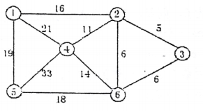

# DS-2007-20

## 1. 原题

用 $Dijkstra$ 算法（单源最短路径）求 $1$ 号顶点到 $3$ 号顶点的最短路径，最先求出的最短路径是（）。

A. $1$ 号顶点到 $5$ 号顶点

B. $1$ 号顶点到 $4$ 号顶点

C. $1$ 号顶点到 $3$ 号顶点

D. $1$ 号顶点到 $2$ 号顶点

> 读图说明：题图为回忆版扫描件，已放大判读。图中各边**未见箭头**，故按**无向带权图**处理；顶点为 $1\sim 6$，可辨认的边与权值为
> $(1,2)=16$、$(1,4)=21$、$(1,5)=19$、$(2,4)=11$、$(2,3)=5$、$(2,6)=6$、$(4,5)=33$、$(4,6)=14$、$(5,6)=18$、$(3,6)=6$。
> 若原卷实为有向图且 $1\text{—}2$ 之间为 $2\to1$，则本题需重算（见第 12 节）。

## 2. 答案

**D**（最先求出的是 $1$ 号顶点到 $2$ 号顶点的最短路径，长度 $16$）。

## 3. 题目分析

- 已知：带权无向图（权值均为正），源点为 $1$；
- 目标：按 Dijkstra 算法的执行顺序，判断选项中哪一条最短路径**最先**被确定；
- 关键约束：Dijkstra 每轮从"尚未确定的顶点"中选出当前 $D$ 值最小者并入集合 $S$，该顶点的最短路径即被**最终确定**；因此"最先求出" $=$ 第一轮被选中的顶点；
- 命题意图：考 Dijkstra 的**执行次序机理**（按最短路径长度单调递增求出各顶点），而不是考最终答案数值——题干"求 1 到 3 的最短路径"是干扰信息，真正问的是过程。

## 4. 核心考点

核心考点：
DS04.04.02 最短路径（Dijkstra 的贪心框架：选最小 $D$ 值入 $S$、随后松弛其邻接点；确定次序按路径长度递增）

辅助考点：
DS04.02.01 邻接矩阵法（松弛时按 $\mathit{arcs}[u][v]$ 取边权，本题边权即邻接矩阵的非零元素）

解释：解题必须先正确读出图的边与权（第一手信息），再机械执行算法；核心判据只有一条——"每轮定一个离源点最近者"。

## 5. 解题思路

1. 列出源点 $1$ 的三条关联边：$(1,2)=16$、$(1,5)=19$、$(1,4)=21$，其余顶点 $3,6$ 与 $1$ 不相邻，初值为 $\infty$；
2. 第一轮直接取三者最小 $D_2=16$ ⟹ 候选答案 D；但必须验证"没有别的顶点能在第一轮被选中"——$3,6$ 的 $D$ 值为 $\infty$，$4,5$ 为 $21,19$，均大于 $16$，故第一轮唯一确定 $2$；
3. 用正权下界论证（不依赖算法细节的第二方法）：所有边权 $\ge 5>0$，从 $1$ 出发的任何路径第一段至少花 $16$，故任一顶点的最短距离 $\ge 16$；等号只能由边 $(1,2)$ 取到 ⟹ 到 $2$ 的最短路径全局唯一最小，必最先求出；
4. 为完整起见把整张 Dijkstra 表算完，确认到目标 $3$ 的最短路径 $21$ 是在**第三轮**才确定的（顺带得到 $1\to3$ 的答案，便于自检）。

## 6. 详细解答

**记号**：$S$ 为已确定最短路径的顶点集；$D_v$ 为源点 $1$ 到 $v$ 的当前最短距离估计；$\mathit{path}_v$ 为该路径上 $v$ 的前驱。

**初始**：$S=\{1\}$，$D_1=0$；与 $1$ 相邻者 $D_2=16(\mathit{path}=1)$、$D_5=19(\mathit{path}=1)$、$D_4=21(\mathit{path}=1)$；$D_3=D_6=\infty$。

| 轮 | 选出的 $u$（$\min D$） | $D_2$ | $D_3$ | $D_4$ | $D_5$ | $D_6$ | 本轮松弛结果 |
|---|---|---|---|---|---|---|---|
| 初 | — | $16_{(1)}$ | $\infty$ | $21_{(1)}$ | $19_{(1)}$ | $\infty$ | — |
| 1 | $u=2$，$D=16$ ✓定 | — | $21_{(2)}$ | $21_{(1)}$ | $19_{(1)}$ | $22_{(2)}$ | $16+5=21<D_3$；$16+6=22<D_6$；$16+11=27>D_4$ 不改 |
| 2 | $u=5$，$D=19$ ✓定 | — | $21_{(2)}$ | $21_{(1)}$ | — | $22_{(2)}$ | $19+33=52>D_4$；$19+18=37>D_6$ 均不改 |
| 3 | $u=3$，$D=21$ ✓定（与 $D_4$ 并列，按编号小者优先） | — | — | $21_{(1)}$ | — | $22_{(2)}$ | $3$ 只与 $2,6$ 相邻：$21+5>D_2$（已定）、$21+6=27>D_6$ 不改 |
| 4 | $u=4$，$D=21$ ✓定 | — | — | — | — | $22_{(2)}$ | $21+14=35>D_6$ 不改 |
| 5 | $u=6$，$D=22$ ✓定 | — | — | — | — | — | — |

**确定次序**：$2\,(16)\to 5\,(19)\to 3\,(21)\to 4\,(21)\to 6\,(22)$。

- 第 1 轮最先确定的是顶点 $2$，最短路径 $1\to2$，长度 $16$ ⟹ 选 **D**；
- 题干所求的 $1\to3$ 最短路径在第 3 轮才确定，长度 $21$，路径沿 $\mathit{path}$ 回溯：$3\leftarrow2\leftarrow1$，即 $1\to2\to3$；
- 注意第 3、4 轮 $D_3=D_4=21$ 并列，取谁不影响"最先求出的是 $2$"这一结论。

**第二方法（性质论证，不依赖表格）**

Dijkstra 的贪心正确性同时给出一个单调性结论：**各顶点被确定的顺序，就是其最短路径长度从小到大的顺序**。因此"最先求出的最短路径" $=$ 全图中最短的那条源点最短路径。

由于所有边权为正，从 $1$ 到任何 $v\neq1$ 的路径至少要经过一条与 $1$ 关联的边，其权 $\ge\min(16,19,21)=16$；故 $d(1,v)\ge16$ 对所有 $v$ 成立，而 $d(1,2)=16$ 恰取等号（且 $1\to2$ 无更短的替代路径，因为任何其他路径第一段就 $\ge16$ 还要再加正数）。于是 $d(1,2)=16$ 是唯一的全局最小 ⟹ 必最先求出。

对照选项：A（$5$，$d=19$）第二求出；B（$4$，$d=21$）第四求出；C（$3$，$d=21$）第三求出；D（$2$，$d=16$）最先 ⟹ **D**。

**答案**：D。

## 7. 选项分析

- A. $1$ 号顶点到 $5$ 号顶点：错。$d(1,5)=19>16$，在第 2 轮才被确定，是第二个求出的最短路径；
- B. $1$ 号顶点到 $4$ 号顶点：错。$d(1,4)=21$（走直接边 $(1,4)$，比 $1\to2\to4=27$ 短），在第 4 轮才确定；
- C. $1$ 号顶点到 $3$ 号顶点：错。$d(1,3)=21$（路径 $1\to2\to3$），在第 3 轮确定；题干"求 1 到 3"只是设定源点与目标，问的是**过程次序**，误选此项是典型的"答非所问"；
- D. $1$ 号顶点到 $2$ 号顶点：正确。$d(1,2)=16$ 是源点各邻接边中最小者，且正权图中任何路径不短于其首边，故第 1 轮即确定。

## 8. 考场标准答案

选 **D**。

以 $1$ 为源点执行 Dijkstra，初值 $D_2=16$、$D_5=19$、$D_4=21$、$D_3=D_6=\infty$；第 1 轮取最小者 $D_2=16$ 并入 $S$，即**最先求出 $1\to2$ 的最短路径（长度 16）**。其后依次为 $5\,(19)$、$3\,(21)$、$4\,(21)$、$6\,(22)$，题干所求的 $1\to3$ 最短路径 $1\to2\to3$（长 $21$）要到第 3 轮才确定。

依据：Dijkstra 按最短路径长度**单调递增**的次序确定各顶点；因边权全为正，任何顶点的最短距离都不小于源点最小关联边权 $16$，而该下界恰由顶点 $2$ 取到。

## 9. 易错点

1. 被题干"求 1 号顶点到 3 号顶点的最短路径"带偏，直接选 C——本题问的是"最先求出"的是哪一条，不是最终目标；
2. 只比较"与 1 直接相连的边"却忘了检查 $3,6$ 的初值为 $\infty$：若误把 $D_3$ 的初值写成 $5$（那是边 $(2,3)$ 的权，不是从源点出发的距离），就会错选 C；
3. 松弛时"改了 $D$ 却忘了改 $\mathit{path}$"，导致最后回溯 $1\to3$ 的路径出错（正确路径 $1\to2\to3$ 依赖 $\mathit{path}_3=2$）；
4. 读图错误：$(1,4)=21$ 与 $(2,4)=11$、$(2,6)=6$ 与 $(3,6)=6$ 位置接近，抄错任一权值都会改变第 3、4 轮的先后，但不影响本题答案（$16$ 的最小性由 $(1,2)$ 单独决定）；
5. 把 Dijkstra 用于带负权边的图（本算法不适用，须用 Bellman-Ford 类算法）。

## 10. 一句话规律

Dijkstra 的"求出次序"就是"最短路径长度从小到大的次序"：问"最先/第 $k$ 个确定哪个顶点"，不必算完全表，只要比较各顶点的最终最短距离（或先用"源点最小关联边权"定出第一个）；问"最终结果"才需要把松弛表做完。

## 11. 关联知识

- 本年度 DS-2007-34（一次 BFS 能访问所有顶点 ⟹ 连通图）与本题同属"图的遍历与路径"章节，但 BFS 求的是**跳数最少**（无权图最短路径），Dijkstra 求的是**边权和最小**，二者不可混用；
- DS04.04.02 的另一半是 Floyd（所有点对最短路径，按中转点逐轮更新矩阵），见 2022 年第 30 题、2024 年第 18 题；
- 表格化执行 Dijkstra 的完整格式（行 $V_1\sim V_n$ 与 $S$、列"初始、$i=1..n-1$"）见 2026 年第 19 题的解答，本库 DS-2026-19 已给出该表格式范例；
- 同型过程题：2015 年第 45 题、2016 年第 41 题、2020 年第 34 题、2023 年第 17 题（均要求写出逐轮计算过程），本题是它们的"只问第一步"的选择题版本；
- 存储结构影响效率：稠密图（如本题 $10$ 条边 / $6$ 个顶点，接近完全图的 $15$ 条）用邻接矩阵 DS04.02.01，$O(|V|^2)$；稀疏图用邻接表 DS04.02.02 配合优先队列可降至 $O(|E|\log|V|)$。

## 12. 来源与可信度

- 原题来源：2007 回忆版题面篇第 20 题，题面文字完整，配图 `真题/2007/imgs/fig1.png`（扫描图）；
- 读图声明：图中边线**未见箭头标记**，按无向带权图判读，$10$ 条边的权值已在第 1 节列出；数字 $21$ 与 $11$、两处 $6$ 的字形在放大后仍可区分，判读把握较高，但回忆版扫描图本身存在不确定性，故 `ocr_confidence: medium`；
- 答案来源：独立推导——逐轮 Dijkstra 表（每轮"选最小、松弛邻点"均写出算式）+ 正权下界的第二方法论证，两条路径结论一致；
- 教材依据：严蔚敏、吴伟民《数据结构（C 语言版）》第 7 章 7.5.3 最短路径（Dijkstra 算法、$D$/$path$/$final$ 三数组的表格演算，教材表 7-2 同格式）；
- 多来源是否一致：本地无其他答案来源，解析篇仅登记为对照、未逐题核对，无冲突记录；
- 争议：无（答案 $D$ 只依赖"$(1,2)=16$ 是源点最小关联边权"，对图中其他边权的读图误差不敏感）；若原卷该图为**有向图**且弧 $2\to1$ 单向，则 $1$ 无法一步到 $2$，需按有向图重算，届时本题结论可能改变——此点已在第 1 节声明；
- 最终可信度：high（在无向图读法下）。
