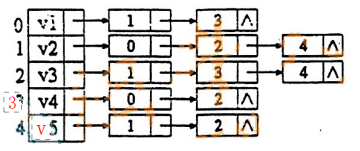

# DS-2007-39

## 1. 原题

已知图的邻接表存储结构，从 $v_5$ 顶点出发得到的深度优先遍历序列和广度优先遍历序列是什么？ $v_3$ 的度是多少？



题图（邻接表）转录为文本（左侧行号 $0\sim4$ 依次对应顶点 $v_1\sim v_5$，链表中存的是**邻接点的数组下标**）：

| 行号 | 顶点 | 邻接点下标链 | 对应邻接顶点 |
|---|---|---|---|
| 0 | $v_1$ | 1 → 3 | $v_2,\ v_4$ |
| 1 | $v_2$ | 0 → 2 → 4 | $v_1,\ v_3,\ v_5$ |
| 2 | $v_3$ | 1 → 3 → 4 | $v_2,\ v_4,\ v_5$ |
| 3 | $v_4$ | 0 → 2 | $v_1,\ v_3$ |
| 4 | $v_5$ | 1 → 2 | $v_2,\ v_3$ |

> 原题此处存在读图不确定性：图 3 为回忆版重绘图像，链表中的数字按上表逐格读取。本解析采用该读法，并给出可自校验的证据——把读出的边集逐条检查"无向图邻接表必关于边对称"，5 行共 12 个边结点恰好配成 6 条边、每条边在两端各出现一次、无自环无多余项，说明读图内部自洽（若任一格读错，对称性即被破坏）。

## 2. 答案

- 深度优先遍历序列（从 $v_5$ 出发，按邻接表存储次序访问）：$v_5\to v_2\to v_1\to v_4\to v_3$，即 **v5 v2 v1 v4 v3**；
- 广度优先遍历序列（从 $v_5$ 出发）：$v_5\to v_2\to v_3\to v_1\to v_4$，即 **v5 v2 v3 v1 v4**；
- $v_3$ 的度 $=3$（邻接点为 $v_2,v_4,v_5$）。

## 3. 题目分析

- 已知：无向图的**邻接表**存储（表头向量下标 $0\sim4$ 对应 $v_1\sim v_5$，边结点存邻接点下标），遍历起点 $v_5$；
- 目标：① DFS 序列；② BFS 序列；③ $v_3$ 的度；
- 关键约束：
  1. 遍历序列**不唯一**，它由"访问某顶点时沿其邻接链的扫描次序"决定；邻接表题的默认口径是**按链表中的链接次序**取邻接点（不是按编号重排），本题恰好每行链表中下标都是升序，两种口径结果相同，序列因此不受该歧义影响；
  2. 每个顶点只访问一次（需 visited 标记），已访问的邻接点直接跳过；
  3. 无向图邻接表中，某顶点的度 = 该顶点邻接链的**边结点个数**；
- 命题意图：考"由存储结构现场还原图并模拟两种遍历"，同时用"度"这一小问检验是否理解邻接表下度的读法（链表长度，而非表头向量位置）。

## 4. 核心考点

核心考点：
DS04.02.02 邻接表法——由邻接表读图（下标 ↔ 顶点对应、边结点含义）、由链表长度读度。

辅助考点：
DS04.03.01 深度优先搜索（回溯式访问序列）、DS04.03.02 广度优先搜索（逐层扩展、队列控制次序）、DS04.01 图的基本概念（无向图的度与 $\sum \deg(v)=2e$）。

解释：三种问法共用同一份边集，遍历是"在给定存储结构上跑算法"（`TRACE`），度是"读存储结构本身"（`CALCULATION`），而第一步"由邻接表还原边集"是一次构图（`CONSTRUCTION`），因此主节点落在邻接表，遍历作为方法性辅助节点。本题不要求写代码，故不打 `CODE_READING`/`ALGORITHM_IMPLEMENTATION` 标签。

## 5. 解题思路

1. **先把邻接表翻译成边集**（这是所有三问的公共前提）：逐行读链表，只保留"下标较大"的方向以免重复计边，得 6 条边；
2. 校验：$\sum\deg=2+3+3+2+2=12=2\times 6$ ✓，说明边集读全、读对；
3. **DFS**：抓住"能走就走、走不动就回退一步"，用递归栈视角逐步展开，每一步都在当前顶点的邻接链里从链头开始找第一个未访问的邻接点；
4. **BFS**：用队列，"先被发现的顶点先扩展"，把每个顶点的未访问邻接点**按链表次序**一次性全部入队；
5. **度**：直接数 $v_3$ 那条链的结点数（3 个），不必回到图形；
6. 自查：两个序列都必须是 5 个顶点、无重复无遗漏（图连通，一次遍历即可访问全部）。

## 6. 详细解答

### (1) 由邻接表还原图

边集（去重后）：
$$E=\{(v_1,v_2),\ (v_1,v_4),\ (v_2,v_3),\ (v_2,v_5),\ (v_3,v_4),\ (v_3,v_5)\}$$

各顶点度：$\deg(v_1)=2,\ \deg(v_2)=3,\ \deg(v_3)=3,\ \deg(v_4)=2,\ \deg(v_5)=2$，合计 $12=2\times 6$ ✓（与 DS-2005-07 的结论"无向图邻接表边结点总数为 $2e$"一致）。

图形（便于手算）：

```
   v1 ───── v2
   |        |  ╲
   v4 ──── v3 ─── v5

（图中 6 条边依次为 v1-v2、v1-v4、v2-v3、v2-v5、v4-v3、v3-v5，与上面的边集完全对应）
```

### (2) 深度优先遍历（起点 $v_5$，邻接点按链表次序取）

| 步 | 当前顶点 | 其邻接链扫描 | 动作 | 已访问集合 |
|---|---|---|---|---|
| 1 | $v_5$ | $v_2$（未访问） | 访问 $v_2$，深入 | $\{v_5,v_2\}$ |
| 2 | $v_2$ | $v_1$（未访问） | 访问 $v_1$，深入 | $\{v_5,v_2,v_1\}$ |
| 3 | $v_1$ | $v_2$（已访问）→ $v_4$（未访问） | 访问 $v_4$，深入 | $\{v_5,v_2,v_1,v_4\}$ |
| 4 | $v_4$ | $v_1$（已访问）→ $v_3$（未访问） | 访问 $v_3$，深入 | 全部 5 个 |
| 5 | $v_3$ | $v_2,v_4,v_5$ 均已访问 | 回退到 $v_4$ | — |
| 6 | 回退 $v_4\to v_1\to v_2$ | $v_2$ 余下 $v_3,v_5$ 已访问 | 继续回退到 $v_5$ | — |
| 7 | $v_5$ | 余下 $v_3$ 已访问 | 结束 | — |

$$\text{DFS 序列： } v_5,\ v_2,\ v_1,\ v_4,\ v_3$$

对应的 DFS 生成树边集：$\{(v_5,v_2),(v_2,v_1),(v_1,v_4),(v_4,v_3)\}$（4 条树边 = 5 个顶点 − 1 ✓，可作一次结构自检）。

### (3) 广度优先遍历（起点 $v_5$）

| 步 | 出队扩展 | 新访问并入队的邻接点（按链表次序） | 队列状态 | 访问次序 |
|---|---|---|---|---|
| 1 | $v_5$ | $v_2,\ v_3$ | $[v_2,v_3]$ | $v_5$ |
| 2 | $v_2$ | $v_1$（$v_3$ 已访问、$v_5$ 已访问） | $[v_3,v_1]$ | $v_5,v_2$ |
| 3 | $v_3$ | $v_4$（$v_2,v_5$ 已访问） | $[v_1,v_4]$ | $v_5,v_2,v_3$ |
| 4 | $v_1$ | 无新顶点（$v_2,v_4$ 已访问） | $[v_4]$ | $v_5,v_2,v_3,v_1$ |
| 5 | $v_4$ | 无新顶点 | $[]$ | $v_5,v_2,v_3,v_1,v_4$ |

$$\text{BFS 序列： } v_5,\ v_2,\ v_3,\ v_1,\ v_4$$

分层结果（BFS 最短路径树含义）：第 0 层 $\{v_5\}$；第 1 层 $\{v_2,v_3\}$（距 $v_5$ 一跳）；第 2 层 $\{v_1,v_4\}$（距 $v_5$ 两跳）。核对：$v_1$ 确与 $v_2$ 相邻、$v_4$ 确与 $v_3$ 相邻，且二者均不与 $v_5$ 直接相邻 ✓。

### (4) $v_3$ 的度

无向图邻接表中，顶点的度等于其邻接链的边结点个数。$v_3$ 的链为 $1\to3\to4$，共 3 个结点，故
$$\deg(v_3)=3\quad(\text{邻接点 } v_2,v_4,v_5)$$

第二重验证（用边集统计）：含 $v_3$ 的边有 $(v_2,v_3),(v_3,v_4),(v_3,v_5)$ 三条 ⟹ $\deg(v_3)=3$ ✓。

## 7. 选项分析

不适用（问答题）。

## 8. 考场标准答案

由邻接表读出边集：$v_1v_2,\ v_1v_4,\ v_2v_3,\ v_2v_5,\ v_3v_4,\ v_3v_5$（6 条边，5 个顶点）。

- **DFS（自 $v_5$，按邻接链次序）**：$v_5\to v_2\to v_1\to v_4\to v_3$
  （$v_5$ 的邻接点 $v_2$ 先入 → $v_2$ 的 $v_1$ → $v_1$ 跳过已访问的 $v_2$ 取 $v_4$ → $v_4$ 跳过 $v_1$ 取 $v_3$ → 全访问完，逐层回退结束）
- **BFS（自 $v_5$）**：$v_5\to v_2\to v_3\to v_1\to v_4$
  （第一层 $v_2,v_3$；由 $v_2$ 得 $v_1$，由 $v_3$ 得 $v_4$）
- $\deg(v_3)=$ $v_3$ 邻接链的结点数 $=\mathbf{3}$

## 9. 易错点

1. **下标与顶点号混淆**：链表里存的是数组下标（$0\sim4$），$v_i$ 对应下标 $i-1$；把 $v_1$ 行读成"邻接 $v_1,v_3$"（当成 1 基编号）会得到自环的荒谬结论，可用"无自环 + 必对称"快速识破；
2. **起点看错**：本题从 $v_5$ 出发，若按习惯从 $v_1$ 出发，两个序列全错（DFS 为 $v_1,v_2,v_3,v_4,v_5$ 一类）；
3. DFS 与 BFS 混用：DFS 是"一条路走到底再回退"，BFS 是"层层推进"；本题两序列**前两个元素相同**（$v_5,v_2$），从第 3 个元素起分叉（DFS 取 $v_1$，BFS 取 $v_3$），粗算容易撞车而不察；
4. **BFS 同层次序**：同一层内的先后由"父顶点被扩展的先后 + 邻接链次序"共同决定，不能只按编号排（$v_1$ 由 $v_2$ 发现、$v_4$ 由 $v_3$ 发现，故 $v_1$ 在 $v_4$ 前）；
5. 把"度"答成"链表中出现的下标值"（如答 1、3、4）或答成"表头向量中的位置"；
6. 忘记标记已访问，导致在 $v_2\leftrightarrow v_5$ 这类双向边上无限往复、序列出现重复顶点。

## 10. 一句话规律

邻接表题一律先做三件事：**把下标换成顶点名、写出无向边集、用 $\sum\deg=2e$ 校验读图无误**；然后 DFS 按"链头优先 + 回溯"、BFS 按"队列 + 一次全扩展"逐格列表模拟，度直接数链长。

## 11. 关联知识

- DS-2005-07（无向图邻接表边结点总数 $=2e$）正是本题读图校验所用的结论；
- DS-2005-17、DS-2006-10、DS-2026-01 考查 DFS 的访问序列/连通分量应用，与本题第 (2) 问同一机制；BFS 的"分层即最短跳数"含义见 DS-2026-01（BFS 求最少步数）；
- 本年度 DS-2007-33（邻接表存储下 DFS 的时间复杂度）与本题共用同一存储结构口径：邻接表 DFS 为 $O(|V|+|E|)$，本题 $|V|=5,|E|=6$；若为邻接矩阵则为 $O(|V|^2)$（参见 DS-2005-16、DS-2006-09 的邻接矩阵读法对比）；
- 本题图是连通的，故一次 DFS/BFS 即访问全部顶点；若不连通，需对外层再加"扫描表头向量补遍历"的循环（连通分量计数见 DS-2005-17）。

## 12. 来源与可信度

- 原题来源：2007 回忆版题面篇（`真题/2007/2007重庆邮电大学802数据结构真题.md` 第 39 题），本题无订正说明，题图为 `真题/2007/imgs/fig3.png`；
- 答案来源：独立推导——读图→还原边集→DFS/BFS 逐步列表模拟→度用链长与边集两种方式各算一次；另用 DFS 生成树边数（$4=5-1$）与 $\sum\deg=2e$（$12=2\times6$）作结构性校验；
- 教材依据：严蔚敏《数据结构（C 语言版）》7.1 图的存储结构（邻接表，无向图边结点成对出现）、7.5 图的遍历（DFS 递归与 BFS 队列过程）；
- 多来源冲突：无；争议：无。**需声明的口径**：① 邻接表内容来自回忆版图像，按第 1 节表格逐格读取，读法由"无向图邻接表必对称、无自环"自校验支持；② 遍历中邻接点的取用次序按链表链接次序，本题每行下标恰为升序，故与"按顶点编号升序"口径结果一致，序列不因该歧义而改变；
- 最终可信度：high（在所述读图与取序口径下结论唯一）。
