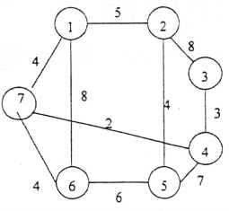

# DS-2007-43

## 1. 原题

从顶点 $1$ 出发，按照 $Prim$ 算法找出下图中的最小生成树。给出处理步骤。



题图（带权无向图）转录为边表（7 个顶点、10 条边）：

| 边 | 权 | 边 | 权 |
|---|---|---|---|
| $(1,2)$ | $5$ | $(3,4)$ | $3$ |
| $(1,6)$ | $8$ | $(4,5)$ | $7$ |
| $(1,7)$ | $4$ | $(4,7)$ | $2$ |
| $(2,3)$ | $8$ | $(5,6)$ | $6$ |
| $(2,5)$ | $4$ | $(6,7)$ | $4$ |

各顶点度数：$\deg(1)=3,\ \deg(2)=3,\ \deg(3)=2,\ \deg(4)=3,\ \deg(5)=3,\ \deg(6)=3,\ \deg(7)=3$，合计 $20=2\times10$ ✓。

> 原题此处存在读图不确定性：图 4 为回忆版重绘，顶点按"1、2 在上，3、4 在右，5、6 在下，7 在左"的环形位置摆放。读图时须注意线段 **$(7,4)$ 与 $(1,6)$ 在图面交叉但交叉处不是顶点**；权值 $8$ 标在竖线 $(1,6)$ 上、权值 $4$（中部）标在竖线 $(2,5)$ 上、权值 $2$ 标在斜线 $(7,4)$ 上。本解析按上表边表作答；该读法可通过"每个顶点的度与图上引出的线段数一致、共 10 条边"这一结构性核对，若任一条边或权值读错，交叉验证（第 6 节 (3)）与 Prim/Kruskal 双法结果将不再自洽。

## 2. 答案

**Prim 处理步骤（从顶点 1 出发）**：

| 步 | 新加入顶点 | 选中的边 | 边权 | 顶点集 $S$ |
|---|---|---|---|---|
| 初 | $1$ | — | — | $\{1\}$ |
| 1 | $7$ | $(1,7)$ | $4$ | $\{1,7\}$ |
| 2 | $4$ | $(7,4)$ | $2$ | $\{1,7,4\}$ |
| 3 | $3$ | $(4,3)$ | $3$ | $\{1,7,4,3\}$ |
| 4 | $6$ | $(7,6)$ | $4$ | $\{1,7,4,3,6\}$ |
| 5 | $2$ | $(1,2)$ | $5$ | $\{1,7,4,3,6,2\}$ |
| 6 | $5$ | $(2,5)$ | $4$ | 全部 7 个顶点 |

**最小生成树**：边集 $\{(1,7),(7,4),(4,3),(7,6),(1,2),(2,5)\}$，

$$\text{总代价}=4+2+3+4+5+4=\boxed{22}$$

生成树的括号表示（结点间括号内为边权）：

```
1 ─┬─(5)─ 2 ─(4)─ 5
   └─(4)─ 7 ─┬─(4)─ 6
             └─(2)─ 4 ─(3)─ 3
```

## 3. 题目分析

- 已知：无向连通带权图，$|V|=7$、$|E|=10$，边权见第 1 节边表；起点顶点 $1$；
- 目标：按 **Prim 算法**给出最小生成树的**处理步骤**（即每步"候选跨割边—选最小—并入顶点"的过程），并给出最终生成树；
- 关键约束：
  1. Prim 是**扩点**式贪心：已并入集合 $S$ 每次只加一个顶点，加入的边必须是"一端在 $S$ 内、一端在 $S$ 外"的**最小**边（不是全图最小边——那是 Kruskal 的口径）；
  2. 每步的候选边集必须**随新顶点并入而更新**（新顶点带来的边要补进候选，两端都在 $S$ 内的边要剔除）；
  3. 生成树恰有 $|V|-1=6$ 条边、$7$ 个顶点，且无回路；
- 命题意图：考 Prim 的执行细节（维护"到 $S$ 的最短跨边"），图中故意给了 $(7,4)=2$ 这条"远离起点、权值最小"的长边和 $(1,6)=8$ 这条"从起点出发但很贵"的边，用来区分"真会 Prim"与"每步挑全局最小边"的错误做法。

## 4. 核心考点

核心考点：
DS04.04.01 最小（代价）生成树——Prim 算法的逐步执行（顶点集扩张、跨割边选取）与生成树代价和。

辅助考点：
DS04.01 图的基本概念——生成树的边数 $=|V|-1$、无回路、连通性等结构性校验；以及"读图得边表/度"的基本功。

解释：本题不要求写代码，只要求"处理步骤"，因此核心是把每一步的 $S$ 与候选边集列清楚；交叉验证借用同节点的 Kruskal 算法（边排序 + 并查判环），两法结果必须一致。

## 5. 解题思路

1. 先把图抄成**边表**（第 1 节），并核对 $\sum\deg=2|E|$，确保没有漏读边——Prim 一旦漏边，后面全错；
2. 令 $S=\{1\}$，列出从 $S$ 出发的所有边：$(1,2)5,(1,7)4,(1,6)8$；
3. 每步做三件事：**取候选中权最小者 → 记录该边并把另一端并入 $S$ → 用新顶点扩充候选、删除两端都在 $S$ 内的边**；
4. 重复 $|V|-1=6$ 次即得生成树（本题图连通，不会出现"无候选边"的失败情形）；
5. 收尾用 **Kruskal 独立再算一遍**：把 10 条边按权升序，依次取不构成回路的边，若也得到 6 条边、总权 22，则两法互证；
6. 结构校验：$6=7-1$ 条边、7 个顶点全出现、无回路。

## 6. 详细解答

### (1) 边表（按顶点整理，便于取候选边）

| 顶点 | 关联边（邻点:权） |
|---|---|
| $1$ | $2\!:\!5,\ 6\!:\!8,\ 7\!:\!4$ |
| $2$ | $1\!:\!5,\ 3\!:\!8,\ 5\!:\!4$ |
| $3$ | $2\!:\!8,\ 4\!:\!3$ |
| $4$ | $3\!:\!3,\ 5\!:\!7,\ 7\!:\!2$ |
| $5$ | $2\!:\!4,\ 4\!:\!7,\ 6\!:\!6$ |
| $6$ | $1\!:\!8,\ 5\!:\!6,\ 7\!:\!4$ |
| $7$ | $1\!:\!4,\ 4\!:\!2,\ 6\!:\!4$ |

### (2) Prim 逐步执行（$S$ = 已并入顶点集，候选 = 跨 $S$ 与 $V\!-\!S$ 的边）

**初始**：$S=\{1\}$。

| 步 | $S$ | 候选跨边（邻点:权，加粗为本步选中） | 最小跨边 | 并入 |
|---|---|---|---|---|
| 1 | $\{1\}$ | **$(1,7):4$**、$(1,2):5$、$(1,6):8$ | $4$ | $7$ |
| 2 | $\{1,7\}$ | $(1,2):5$、$(1,6):8$、**$(7,4):2$**、$(7,6):4$ | $2$ | $4$ |
| 3 | $\{1,7,4\}$ | $(1,2):5$、$(1,6):8$、$(7,6):4$、**$(4,3):3$**、$(4,5):7$ | $3$ | $3$ |
| 4 | $\{1,7,4,3\}$ | $(1,2):5$、$(1,6):8$、**$(7,6):4$**、$(4,5):7$、$(3,2):8$ | $4$ | $6$ |
| 5 | $\{1,7,4,3,6\}$ | **$(1,2):5$**、$(4,5):7$、$(3,2):8$、$(6,5):6$ | $5$ | $2$ |
| 6 | $\{1,7,4,3,6,2\}$ | $(4,5):7$、$(6,5):6$、**$(2,5):4$** | $4$ | $5$ |

说明：

- 第 1 步：从 $1$ 出发的三条边中 $(1,7)=4$ 最小（$(1,2)=5$、$(1,6)=8$ 落选）；
- 第 2 步：并入 $7$ 后候选新增 $(7,4)=2$ 与 $(7,6)=4$，全表最小是 $2$ ⟹ 走"远离起点"的长边把 $4$ 拉进来，这正是 Prim 的贪心特征；
- 第 4 步：$(1,6)=8$、$(3,2)=8$、$(7,6)=4$ 同时竞争，$(7,6)=4$ 胜出（注意此时 $(1,7)$、$(7,4)$、$(4,3)$ 两端都已在 $S$ 内，必须从候选中剔除，否则会成环）；
- 第 5 步：候选中 $(6,5)=6$ 与 $(1,2)=5$ 竞争，取 $5$ 并入 $2$；
- 第 6 步：$2$ 并入后带来 $(2,5)=4$，比 $(6,5)=6$、$(4,5)=7$ 都小 ⟹ 最后并入 $5$。

**顶点加入次序**：$1,7,4,3,6,2,5$；**选中边次序**：$(1,7)4,\ (7,4)2,\ (4,3)3,\ (7,6)4,\ (1,2)5,\ (2,5)4$。

$$W(T)=4+2+3+4+5+4=22$$

### (3) 交叉验证：Kruskal 算法独立求解

把 10 条边按权升序，依次接受"两端分属不同连通分量"的边：

| 边 | 权 | 判定 | 结果 |
|---|---|---|---|
| $(4,7)$ | $2$ | 分量 $\{4\},\{7\}$ 不同 | 接受 |
| $(3,4)$ | $3$ | $\{3\}$ 与 $\{4,7\}$ | 接受 → $\{3,4,7\}$ |
| $(1,7)$ | $4$ | $\{1\}$ 与 $\{3,4,7\}$ | 接受 → $\{1,3,4,7\}$ |
| $(6,7)$ | $4$ | $\{6\}$ 与该分量 | 接受 → $\{1,3,4,6,7\}$ |
| $(2,5)$ | $4$ | $\{2\},\{5\}$ 独立 | 接受 → $\{2,5\}$ |
| $(1,2)$ | $5$ | 两个分量合并 | 接受 → 7 个顶点全连通，已得 $6$ 条边，结束 |
| $(5,6)$ | $6$ | （已可停，列出以示校验）$5,6$ 已同分量 | 拒绝（成环 $5\!-\!2\!-\!1\!-\!7\!-\!6\!-\!5$）|
| $(4,5)$ | $7$ | 同分量 | 拒绝 |
| $(1,6)$ | $8$ | 同分量 | 拒绝 |
| $(2,3)$ | $8$ | 同分量 | 拒绝 |

Kruskal 得到**完全相同的 6 条边**，总权 $2+3+4+4+4+5=22$ ✓ 与 Prim 结果一致。

**唯一性说明**：权值 $\le 5$ 的边恰有 6 条且互不成环（构成 7 点 6 边的无回路图），故它们必须全部属于任何一棵最小生成树 ⟹ 本题 MST **唯一**，不存在"平局导致答案不同"的争议。

### (4) 结果图形与结构校验

生成树（括号内为边权）：

```
1 ─┬─(5)─ 2 ─(4)─ 5
   └─(4)─ 7 ─┬─(4)─ 6
             └─(2)─ 4 ─(3)─ 3
```

校验：① 边数 $6=|V|-1$ ✓；② 顶点 $1\sim7$ 全部出现、无孤立点 ✓；③ 从根 $1$ 出发每条边都指向更深一层，无回路 ✓；④ 总权 $5+4+4+4+2+3=22$ ✓（与第 6 节 (2)(3) 两法一致）。

### (5) 复杂度（附述）

Prim 用邻接矩阵实现时为 $O(|V|^2)=O(49)$（本题 $|V|=7$）：每步扫描 $|V|$ 个顶点找最小跨边，共 $|V|-1$ 步；若配最小堆可降至 $O(|E|\log|V|)$。Kruskal 为 $O(|E|\log|E|)$，边稀疏时更优。本题 $|E|=10$ 相对 $|V|=7$ 属稠密小图，Prim 的手工计算量更小，这也是题面指定 Prim 的原因。

## 7. 选项分析

不适用（问答题）。

## 8. 考场标准答案

从 $S=\{1\}$ 出发，每步取"一端在 $S$、另一端不在 $S$"的权最小边：

| 步 | 选中边（权） | 并入顶点 | $S$ |
|---|---|---|---|
| 1 | $(1,7)$，4 | 7 | $\{1,7\}$ |
| 2 | $(7,4)$，2 | 4 | $\{1,7,4\}$ |
| 3 | $(4,3)$，3 | 3 | $\{1,7,4,3\}$ |
| 4 | $(7,6)$，4 | 6 | $\{1,7,4,3,6\}$ |
| 5 | $(1,2)$，5 | 2 | $\{1,7,4,3,6,2\}$ |
| 6 | $(2,5)$，4 | 5 | 全部 7 个顶点 |

最小生成树边集 $\{(1,7),(7,4),(4,3),(7,6),(1,2),(2,5)\}$，总代价 $4+2+3+4+5+4=22$。

（树形见第 6 节 (4)；可用 Kruskal 校得同一结果。）

## 9. 易错点

1. **把 Prim 做成 Kruskal**：每步挑"全图最小边"。本题第 1 步就会错——全图最小边是 $(4,7)=2$，但它不与起点 $1$ 相连，Prim 第一步只能从 $1$ 的三条关联边里选，得 $(1,7)=4$；
2. **候选边不更新**：并入新顶点后忘记加入它的关联边（如第 2 步忘记 $(7,4)$、$(7,6)$），或忘记剔除两端都已并入的边（如第 4 步仍留着 $(1,7)$），后者会立刻造成回路；
3. 忘记 $(1,6)=8$ 这条"从起点出发却很贵"的边：$6$ 最终是通过 $(7,6)=4$ 进来的，而不是 $(1,6)$；若答成 $(1,6)$ 则总权变 $26$；
4. 平局处理不当：本题有 3 条权为 $4$ 的边 $(1,7),(7,6),(2,5)$，它们互不冲突、全部入选，若因"先选谁"犹豫而漏掉某条，边数就不够 $6$ 条；
5. 把 $(7,4)$ 与 $(1,6)$ 的图面交叉点误当成一个顶点（会凭空多出顶点与边，导致 $|V|=8$、边数要求变 7 条）；
6. 边数写错：$n$ 个顶点的生成树必须恰有 $n-1$ 条边，多一条必有回路、少一条必有孤立顶点。

## 10. 一句话规律

Prim 与 Kruskal 的分工要背死：**Prim 扩点（每步一条"跨割最小边"，候选集随并入而增删），Kruskal 扩边（全局排序后"不成环就收"）**；两法对同一张图必须给出同一总权，做完互相验一遍，比反复检查图形快得多。

## 11. 关联知识

- DS-2006-38（同一教材风格的 Prim 题，要求写出顶点集 $S$ 与选边顺序）与本题解法完全同构，可对照其步骤表；DS-2005-25、DS-2005-32 是最小生成树的概念/选择型考查；
- Kruskal 在本解析中用作交叉验证，它本身也是 DS04.04.01 的考查对象（边集合过程），两法的复杂度对比见第 6 节 (5)；
- 生成树与遍历的关系：Prim/Kruskal 处理带权图，DFS/BFS 处理无权图也能得到生成树（本题第 39 题的 DFS 生成树即是一例，但那不是最小生成树）；
- 若把边权全部置 1，Prim 退化为"逐层扩边"，与 BFS 生成树一致（参见 DS-2026-01 的 BFS 分层）。

## 12. 来源与可信度

- 原题来源：2007 回忆版题面篇（`真题/2007/2007重庆邮电大学802数据结构真题.md` 第 43 题），本题无订正说明，题图为 `真题/2007/imgs/fig4.png`；
- 答案来源：独立推导——Prim 逐步列表（每步给出 $S$ 与候选跨边集），并用 Kruskal 独立求解交叉验证，两法得同一边集与同一总权 $22$；另以"边数 $=6=|V|-1$、7 顶点全覆盖、无回路、$\sum\deg=2|E|$"四项结构校验；
- 教材依据：严蔚敏《数据结构（C 语言版）》7.6.2 最小生成树（Prim 与 Kruskal 的算法步骤与示例）；
- 多来源冲突：无；争议：无。**需声明的口径**：图 4 为回忆版重绘，边表按第 1 节转录（含"线段交叉处不是顶点"的判断），在此边表下答案唯一且 MST 无平局歧义；若原图另有边或权值与此不同，则需按同一方法重算；
- 最终可信度：high（在所述读图口径下，双法互证一致）。
