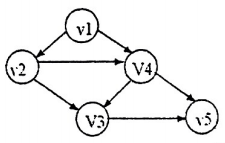

# DS-2012-33

## 1. 原题

下图的拓扑排序序列是____________________ 。

**读图声明（作答前提）**：原图为回忆版扫描件，已放大 4 倍逐条边判读箭头方向。图中 $5$ 个顶点（标注大小写混排，本解析统一记作 $v_1\sim v_5$）之间的弧集为

$$v_1\!\to\!v_2,\quad v_1\!\to\!v_4,\quad v_2\!\to\!v_4,\quad v_2\!\to\!v_3,\quad v_4\!\to\!v_3,\quad v_4\!\to\!v_5,\quad v_3\!\to\!v_5$$

共 $7$ 条弧，无自环、无回路（$v_1$ 为唯一源点、$v_5$ 为唯一汇点，箭头整体自左上向右下推进）。以下解答针对这一弧集；判读依据是每条线段的箭头端清晰可辨（$v_2\!\to\!v_4$ 的箭头在 $V_4$ 侧、$v_4\!\to\!v_3$ 的箭头在 $V_3$ 侧、$v_3\!\to\!v_5$ 的箭头在 $v_5$ 侧）。

## 2. 答案

$$v_1\ \ v_2\ \ v_4\ \ v_3\ \ v_5$$

且该 AOV 网的拓扑序列**唯一**（每一轮入度为 $0$ 的顶点恰只有一个，无需附加"编号小者优先"之类的约定）。

## 3. 题目分析

- 已知：一个含 $5$ 个顶点、$7$ 条弧的有向图（题图），经核对为有向无环图（DAG），即一张 AOV 网；
- 目标：写出它的一个（此处即唯一）拓扑序列——把所有顶点排成线性序列，使每条弧 $u\to v$ 中 $u$ 都排在 $v$ 之前；
- 关键约束：① 只有无环有向图才能拓扑排序完成（若中途零入度顶点集为空而未输出全部顶点，则有环）；② 输出一个顶点必须同步把它的所有出弧删去（弧头顶点入度减 $1$）；
- 命题意图：考拓扑排序的机械执行（入度表 + 逐轮删点删弧），并用一个"每步无分支"的小图检验过程是否真正执行到位（而非背结论）。

## 4. 核心考点

核心考点：
DS04.04.03 拓扑排序（AOV 网、入度为 $0$ 顶点的选取、删弧更新入度、拓扑序列的存在性与求解过程）

辅助考点：
DS04.01 图的基本概念（有向图的弧、顶点的入度/出度、$\sum$ 入度 $=\sum$ 出度 $=$ 弧数）

解释：作答完全由拓扑排序的过程定义决定；而入度表的建立与"$\sum$ 入度 $=$ 弧数"的自检属图的基本概念，用它核对读图是否漏项。

## 5. 解题思路

1. 读图列弧表，逐顶点统计入度与出度，用"$\sum$ 入度 $=\sum$ 出度 = 弧数 $=7$"自检读图无漏；
2. 循环执行：输出当前入度为 $0$ 的顶点 → 删去它的所有出弧（弧头入度减 $1$）→ 重复；
3. 每轮检查零入度顶点集合的大小：若恰好为 $1$，说明本题无分支、拓扑序列唯一（这是"唯一性"的正规论证方式）；
4. 输出满 $5$ 个顶点 ⟹ 图确无回路；
5. 逐条弧回代验证"起点在终点之前"，全部满足才算完成。

## 6. 详细解答

**第一步：弧表与入度/出度表**

| 顶点 | 出弧 | 入弧 | 出度 | 入度 |
|---|---|---|---|---|
| $v_1$ | $\to v_2,\to v_4$ | 无 | $2$ | $0$ |
| $v_2$ | $\to v_4,\to v_3$ | $v_1$ | $2$ | $1$ |
| $v_3$ | $\to v_5$ | $v_2,v_4$ | $1$ | $2$ |
| $v_4$ | $\to v_3,\to v_5$ | $v_1,v_2$ | $2$ | $2$ |
| $v_5$ | 无 | $v_4,v_3$ | $0$ | $2$ |

自检：$\sum$ 出度 $=2+2+1+2+0=7$，$\sum$ 入度 $=0+1+2+2+2=7$，均等于弧数 $7$ ✓；只有 $v_1$ 入度为 $0$（唯一源点）、只有 $v_5$ 出度为 $0$（唯一汇点），与图形走向一致。

**第二步：逐轮执行拓扑排序**

| 轮 | 当前入度为 $0$ 且未输出的顶点集 | 选取 | 删其出弧后的入度变化 | 已输出序列 |
|---|---|---|---|---|
| 1 | $\{v_1\}$ | $v_1$ | $v_2:1\to0$；$v_4:2\to1$ | $v_1$ |
| 2 | $\{v_2\}$ | $v_2$ | $v_4:1\to0$；$v_3:2\to1$ | $v_1,v_2$ |
| 3 | $\{v_4\}$ | $v_4$ | $v_3:1\to0$；$v_5:2\to1$ | $v_1,v_2,v_4$ |
| 4 | $\{v_3\}$ | $v_3$ | $v_5:1\to0$ | $v_1,v_2,v_4,v_3$ |
| 5 | $\{v_5\}$ | $v_5$ | — | $v_1,v_2,v_4,v_3,v_5$ |

$5$ 个顶点全部输出 ✓（故该图无环，拓扑排序成功）；且**每一轮候选集都只有 $1$ 个顶点**，全程无分支 ⟹ 拓扑序列唯一。

注意第 $3$、$4$ 轮的顺序：$v_3$ 有两条入弧（来自 $v_2$ 与 $v_4$），必须等 $v_4$ 输出并入度归零后才能输出，因此 $v_4$ 一定排在 $v_3$ 之前——这正是本题的设卡处。

**第三步：逐条弧回代验证**

所得序列中各顶点位置：$v_1(1),v_2(2),v_4(3),v_3(4),v_5(5)$。

| 弧 | 前后位置 | 起点在终点之前 |
|---|---|---|
| $v_1\to v_2$ | $1<2$ | ✓ |
| $v_1\to v_4$ | $1<3$ | ✓ |
| $v_2\to v_4$ | $2<3$ | ✓ |
| $v_2\to v_3$ | $2<4$ | ✓ |
| $v_4\to v_3$ | $3<4$ | ✓ |
| $v_4\to v_5$ | $3<5$ | ✓ |
| $v_3\to v_5$ | $4<5$ | ✓ |

$7$ 条弧全部满足 ⟹ 该序列是图的一个拓扑序列。

**第四步：反证常见错序（说明为何不能是 $v_1,v_2,v_3,v_4,v_5$）**

若把 $v_3$ 提到 $v_4$ 之前（很多人凭"编号递增"的直觉这么写），则违反弧 $v_4\to v_3$（$v_4$ 必须排在 $v_3$ 前）⟹ 不是拓扑序列。同理 $v_1,v_2,v_4,v_5,v_3$ 违反 $v_3\to v_5$。故唯一合法答案即 $v_1,v_2,v_4,v_3,v_5$。

**答案**：$v_1\ v_2\ v_4\ v_3\ v_5$。

## 7. 选项分析

不适用（填空题）。

## 8. 考场标准答案

列入度表后逐轮取零入度顶点、删其出弧：

$$v_1(\text{入度}0)\to v_2\to v_4\to v_3\to v_5$$

拓扑序列为 $\boxed{v_1\ v_2\ v_4\ v_3\ v_5}$（每轮零入度顶点唯一，故拓扑序列唯一）。

## 9. 易错点

1. 把 $v_4\to v_3$ 的弧方向读反（图中 $V_4$ 在右上、$V_3$ 在下方，箭头在 $V_3$ 侧）：一旦读成 $v_3\to v_4$，就会输出 $v_1,v_2,v_3,v_4,v_5$ 这一"看似自然"的错序；
2. 删点时忘记同步删弧（把入度表当静态数据），会导致 $v_4,v_3,v_5$ 永远入度不为 $0$，误判"图有环、无法拓扑排序"；
3. 把拓扑序列与 DFS/BFS 遍历序列混为一谈：拓扑序列只受弧的前后约束，与"访问邻接点的先后"规则无关（对比本年度第 43 题的 DFS/BFS 序列）；
4. 以为"拓扑序列就是把顶点按编号排好"：编号顺序合法纯属巧合，本题 $v_3,v_4$ 就必须颠倒；
5. 未论证唯一性就交答案：本题恰因每轮候选唯一才可用"拓扑排序序列"这一单数问法，若某轮出现 $\ge2$ 个零入度顶点则答案不唯一（如 2007 年第 30 题）。

## 10. 一句话规律

拓扑排序手算三步：**列入度表（用 $\sum$ 入度 $=$ 弧数自检读图）→ 每轮挑零入度顶点输出并删其全部出弧 → 逐条弧回代验证**；"是否唯一"看每轮零入度顶点是否恰好只有一个。

## 11. 关联知识

- 2006 年第 24 题（判断题：任何有向图的结点都可以排成拓扑排序且拓扑序列不唯一）与本题互为印证——只有**无环**有向图才可拓扑排序，且拓扑序列一般不唯一；
- 2007 年第 30 题（$8$ 顶点 AOV 图写"唯一的拓扑序列"）是本题的对照案例：那题图存在多个零入度顶点并存的轮次，"唯一"表述有误，而本题每轮候选唯一，"唯一"成立；
- 2023 年第 15 题（给定顶点集与边集写出**所有**拓扑序列）是本题的推广，可用本题的"逐轮候选集分支计数"系统枚举；
- 拓扑排序的实现口径（栈 vs 队列 vs 优先队列）会改变多解时的输出：本题因每轮唯一候选而与实现方式无关；2024 年第 4 题（补全拓扑排序代码、复杂度 $O(|V|+|E|)$）给出本题手算过程的程序实现；
- AOV 网拓扑排序也是判“工程有无循环依赖”的方法；本年度第 43 题为无向图的 DFS/BFS 遍历与 Prim 最小生成树，与本题同属 DS04 的“给图写出序列”类题型，但需区分拓扑序列只受弧方向约束、与遍历起点和邻接点排序无关。

## 12. 来源与可信度

- 原题来源：2012 回忆版题面篇 `真题/2012/2012重庆邮电大学802数据结构真题.md` 二、填空题第 33 题，题面无订正说明，题图为 `真题/2012/imgs/fig1.png`；
- 读图声明：图已放大 $4$ 倍判读，$5$ 个顶点标注（$v_1,v_2,V_4,V_3,v_5$，大小写为原图书写差异）与 $7$ 条弧的箭头端均可辨认；弧数与 $\sum$ 入度、$\sum$ 出度三者互校一致，源图无孤立顶点、无未读出的线段，故读图把握较高；因属扫描回忆版图形，`ocr_confidence` 仍保守定为 `medium`；
- 答案来源：独立推导（入度表逐轮执行 + 逐弧回代验证 + 每轮候选唯一性论证 + 错序反证）；未实际抓取解析篇网页，仅登记其地址备查；
- 教材依据：严蔚敏、吴伟民《数据结构（C 语言版）》7.5.6 拓扑排序（AOV 网、入度数组、每次选入度为 $0$ 的顶点并删去其出弧、拓扑序列不一定唯一）；
- 多来源冲突：无；争议：无（在所述弧集下拓扑序列唯一，已给出完整验证；若原图弧向与判读不符，则需按补全后的入度表重算，此点已在第 1 节声明）；
- 最终可信度：推导过程 high；作为"原卷标准答案" high（图清晰、解唯一）。
