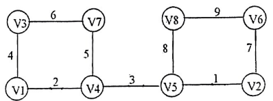

# DS-2012-43

## 1. 原题

设一个无向图 $G$ 如下：

（1）请写出图 $G$ 的邻接矩阵 $A$ ；

（2）如果对某个顶点的邻接点的访问顺序按序号从小到大排序，请写出从顶点 $V_1$ 出发，按深度优先和广度优先搜索方法遍历网 $G$ 所得到的顶点序列；

（3）从顶点 $V_1$ 出发，按照最小生成树的 $Prim$ 算法，画出网 $G$ 的一棵最小生成树。



> 图读法转录：$V_1\!-\!V_3(4)$、$V_1\!-\!V_4(2)$、$V_3\!-\!V_7(6)$、$V_4\!-\!V_7(5)$、$V_4\!-\!V_5(3)$、$V_5\!-\!V_2(1)$、$V_5\!-\!V_8(8)$、$V_2\!-\!V_6(7)$、$V_6\!-\!V_8(9)$，共 $8$ 个顶点、$9$ 条带权边（无向边）。图呈"左方 $V_1V_3V_7V_4$ + 右方 $V_5V_8V_6V_2$，两方由 $V_4\!-\!V_5$ 相连"的形状。

## 2. 答案

**(1) 邻接矩阵**（$\infty$ 表示无直接边，主对角线为 $0$）：

| $A$ | $V_1$ | $V_2$ | $V_3$ | $V_4$ | $V_5$ | $V_6$ | $V_7$ | $V_8$ |
|---|---|---|---|---|---|---|---|---|
| $V_1$ | 0 | $\infty$ | 4 | 2 | $\infty$ | $\infty$ | $\infty$ | $\infty$ |
| $V_2$ | $\infty$ | 0 | $\infty$ | $\infty$ | 1 | 7 | $\infty$ | $\infty$ |
| $V_3$ | 4 | $\infty$ | 0 | $\infty$ | $\infty$ | $\infty$ | 6 | $\infty$ |
| $V_4$ | 2 | $\infty$ | $\infty$ | 0 | 3 | $\infty$ | 5 | $\infty$ |
| $V_5$ | $\infty$ | 1 | $\infty$ | 3 | 0 | $\infty$ | $\infty$ | 8 |
| $V_6$ | $\infty$ | 7 | $\infty$ | $\infty$ | $\infty$ | 0 | $\infty$ | 9 |
| $V_7$ | $\infty$ | $\infty$ | 6 | 5 | $\infty$ | $\infty$ | 0 | $\infty$ |
| $V_8$ | $\infty$ | $\infty$ | $\infty$ | $\infty$ | 8 | 9 | $\infty$ | 0 |

矩阵关于主对角线对称（无向图），非 $\infty$ 的非对角元素共 $18=2\times 9$ 个。

**(2)** 从 $V_1$ 出发、邻接点按序号从小到大访问：

- **DFS**：$V_1\to V_3\to V_7\to V_4\to V_5\to V_2\to V_6\to V_8$，即 **V1 V3 V7 V4 V5 V2 V6 V8**
- **BFS**：$V_1\to(V_3,V_4)\to V_7\to V_5\to(V_2,V_8)\to V_6$，即 **V1 V3 V4 V7 V5 V2 V8 V6**

**(3)** Prim 从 $V_1$ 出发依次选入的边：

| 次序 | 选中的边 | 权 | 新并入顶点 |
|---|---|---|---|
| 1 | $(V_1,V_4)$ | 2 | V4 |
| 2 | $(V_4,V_5)$ | 3 | V5 |
| 3 | $(V_5,V_2)$ | 1 | V2 |
| 4 | $(V_1,V_3)$ | 4 | V3 |
| 5 | $(V_4,V_7)$ | 5 | V7 |
| 6 | $(V_2,V_6)$ | 7 | V6 |
| 7 | $(V_5,V_8)$ | 8 | V8 |

最小生成树（以 $V_1$ 为根的并入形状，$7$ 条边）：

```
           V1
         /    \
      V3       V4 —— V7
               |
               V5 —— V8
               |
               V2 —— V6
```

权 $6$ 的 $(V_3,V_7)$ 与权 $9$ 的 $(V_6,V_8)$ 未被选中。

边集 $\{(V_1,V_4),(V_1,V_3),(V_4,V_5),(V_4,V_7),(V_5,V_2),(V_5,V_8),(V_2,V_6)\}$，$7$ 条边，**总代价 $T=2+3+1+4+5+7+8=30$**。

## 3. 题目分析

- 已知：$8$ 顶点 $9$ 边的带权连通无向图（网），权值均为正且互不相同；
- 目标：① 建立邻接矩阵；② 在"邻接点按序号升序"这一**确定性约定**下给出 DFS/BFS 序列；③ 以 $V_1$ 为起点做 Prim 并给出生成树；
- 约束：$n=8$、$e=9$，生成树必须恰有 $n-1=7$ 条边且连通无圈；DFS 用栈/递归、BFS 用队列，两者都需 `visited` 数组防止重复访问；
- 命题意图：一题串起 DS04 的"存储 → 遍历 → 应用"三环节；"邻接点按序号从小到大"是为了让遍历序列**唯一**（否则同一图可有多个合法序列），也提示用邻接矩阵/有序邻接表模拟；由于本题权值互异，最小生成树唯一，Prim 与 Kruskal 结果必相同，可互为验算。

## 4. 核心考点

核心考点：
DS04.02.01 邻接矩阵法（带权图的矩阵表示：有边取权、无边取 $\infty$、对角取 $0$；对称性；由矩阵第 $i$ 行读取 $V_i$ 的邻接点）

辅助考点：
DS04.03.01 DFS（"能进则进、进不动则退"，序列由递归顺序决定）；DS04.03.02 BFS（"逐层扩展 + 队列"，先入队者先扩展）；DS04.04.01 最小生成树（Prim：从已选顶点集 $U$ 出发，每轮取横跨 $U$ 与 $V\setminus U$ 的最小权边）

解释：三问分别落在存储、遍历、生成树上，主考点取"邻接矩阵"是因为后两问都以第 (1) 问建立的表示为输入；权值互异使 Prim 每轮选择唯一，从而 (3) 的答案可判对错。

## 5. 解题思路

1. **读图建表**：先把 9 条边抄成"顶点对 + 权"的清单（第 1 节图读法），再按清单填矩阵——每填一条无向边就同时填对称的两个元素，填完数一数非 $\infty$ 元素是否为 $2e=18$；
2. **DFS**：递归规则"访问当前顶点 → 按序号升序找第一个未访问邻接点并立刻进入"；关键是**回溯时从该顶点自己的邻接表头重新扫**（不是从刚才的位置继续），所以要用栈的思想跟踪；
3. **BFS**：维护队列，"出队一个 → 把它的**全部**未访问邻接点按升序一次性入队"；序列 = 首次访问（入队）的先后；
4. **Prim**：$U=\{V_1\}$，每轮在"一端在 $U$、另一端不在 $U$"的所有边中取最小权者，把对应顶点并入 $U$，共做 $n-1=7$ 轮；
5. **验算**：① DFS/BFS 序列都必须含 $8$ 个互不重复的顶点（图连通）；② 生成树边数 $=7$、无圈；③ 用 Kruskal（全局按权升序选边，不成圈即取）独立算一遍，两法总权必须相等；④ 用"圈性质"复核：图中两个圈 $V_1V_3V_7V_4$ 与 $V_5V_2V_6V_8$ 上权最大的边（$6$ 与 $9$）必定不在最小生成树中，$45-6-9=30$ 与 Prim 结果一致。

## 6. 详细解答

### (1) 邻接矩阵

由第 1 节的边清单填表，得第 2 节所示的 $8\times8$ 对称矩阵 $A$。约定：$A[i][j]=w(V_i,V_j)$（有边时）、$\infty$（无边且 $i\ne j$）、$0$（$i=j$）。

核对：第 $i$ 行的非 $\infty$ 非对角元素个数 $=\deg(V_i)$：$\deg(V_1)=2$、$\deg(V_2)=2$、$\deg(V_3)=2$、$\deg(V_4)=3$、$\deg(V_5)=3$、$\deg(V_6)=2$、$\deg(V_7)=2$、$\deg(V_8)=2$，和为 $16=2e$ ✓（握手定理）。

### (2) 遍历序列

先由矩阵写出**升序邻接表**（DFS/BFS 的唯一输入依据）：

| 顶点 | 邻接点（升序） |
|---|---|
| V1 | V3, V4 |
| V2 | V5, V6 |
| V3 | V1, V7 |
| V4 | V1, V5, V7 |
| V5 | V2, V4, V8 |
| V6 | V2, V8 |
| V7 | V3, V4 |
| V8 | V5, V6 |

**DFS（递归 + visited）**：

| 步 | 当前顶点 | 动作 | 已访问序列 |
|---|---|---|---|
| 1 | V1 | 访问 V1，第一个邻接点 V3 未访问 → 深入 | V1 |
| 2 | V3 | 邻接点 V1 已访问，V7 未访问 → 深入 | V1 V3 |
| 3 | V7 | 邻接点 V3 已访问，V4 未访问 → 深入 | V1 V3 V7 |
| 4 | V4 | V1、V7 已访问，V5 未访问 → 深入 | V1 V3 V7 V4 |
| 5 | V5 | V2 未访问 → 深入 | … V5 |
| 6 | V2 | V5 已访问，V6 未访问 → 深入 | … V2 |
| 7 | V6 | V2 已访问，V8 未访问 → 深入 | … V6 |
| 8 | V8 | V5、V6 均已访问 → 回溯 | … V8 |
| — | （回溯 V6→V2→V5→V4→V7→V3→V1，各顶点均无未访问邻接点） | 结束 | 8 个顶点 |

$$\text{DFS}: V_1\,V_3\,V_7\,V_4\,V_5\,V_2\,V_6\,V_8$$

注意第 3~4 步：$V_7$ 的邻接点是 $V_3,V_4$，$V_3$ 已访问故取 $V_4$，于是 $V_4$ 排在 $V_5$ 之前——DFS 序列"一条道走到黑"，与"邻接点升序"共同决定唯一结果。

**BFS（队列 + visited）**：

| 轮 | 出队并扩展 | 本轮新访问（按升序入队） | 队列状态 | 访问序列 |
|---|---|---|---|---|
| 0 | — | V1（起点） | [V1] | V1 |
| 1 | V1 | V3, V4 | [V3,V4] | V1 V3 V4 |
| 2 | V3 | V7（V1 已访问） | [V4,V7] | … V7 |
| 3 | V4 | V5（V1、V7 已访问） | [V7,V5] | … V5 |
| 4 | V7 | 无（V3、V4 已访问） | [V5] | — |
| 5 | V5 | V2, V8（V4 已访问） | [V2,V8] | … V2 V8 |
| 6 | V2 | V6（V5 已访问） | [V8,V6] | … V6 |
| 7 | V8 | 无（V5、V6 已访问） | [V6] | — |
| 8 | V6 | 无 | [] | 结束 |

$$\text{BFS}: V_1\,V_3\,V_4\,V_7\,V_5\,V_2\,V_8\,V_6$$

层次划分（BFS 的正确性判据）：第 $0$ 层 $\{V_1\}$；第 $1$ 层 $\{V_3,V_4\}$；第 $2$ 层 $\{V_7,V_5\}$；第 $3$ 层 $\{V_2,V_8\}$；第 $4$ 层 $\{V_6\}$ —— 序列严格按层递增 ✓，且每层内部按序号升序 ✓。

（DFS 与 BFS 序列不同是必然的：$V_4$ 在 BFS 中属第 1 层，在 DFS 中却被 $V_7$ "抢先"引到，故排第 4。）

### (3) Prim 算法

$U$ 为已并入生成树的顶点集，每轮取"横跨 $(U,V\setminus U)$"的最小权边。权值互异 ⟹ 每轮选择唯一。

| 轮 | $U$ | 候选横跨边（权） | 最小者 | 并入 |
|---|---|---|---|---|
| 1 | {V1} | (V1,V3)4、(V1,V4)2 | 2 | V4 |
| 2 | {V1,V4} | (V1,V3)4、(V4,V7)5、(V4,V5)3 | 3 | V5 |
| 3 | {V1,V4,V5} | (V1,V3)4、(V4,V7)5、(V5,V2)1、(V5,V8)8 | 1 | V2 |
| 4 | {V1,V4,V5,V2} | (V1,V3)4、(V4,V7)5、(V5,V8)8、(V2,V6)7 | 4 | V3 |
| 5 | …+V3 | (V4,V7)5、(V3,V7)6、(V5,V8)8、(V2,V6)7 | 5 | V7 |
| 6 | …+V7 | (V5,V8)8、(V2,V6)7（(V3,V7) 已在 $U$ 内） | 7 | V6 |
| 7 | …+V6 | (V5,V8)8、(V6,V8)9 | 8 | V8 |

$|U|=8$ 结束，选中 $7$ 条边，$T=2+3+1+4+5+7+8=30$。

生成树（把 $U$ 的并入过程画成树，$V_1$ 为根）：

```
              V1
         /     |
      V3       V4 ——— V7
               |
               V5 ——— V8
               |
               V2 ——— V6
```

**独立验算一（Kruskal）**：全部边按权升序 $1,2,3,4,5,6,7,8,9$：
$(V_5,V_2)1$ 取；$(V_1,V_4)2$ 取；$(V_4,V_5)3$ 取；$(V_1,V_3)4$ 取；$(V_4,V_7)5$ 取；$(V_3,V_7)6$ —— $V_3,V_7$ 已同属一个连通分量（$V_3\!-\!V_1\!-\!V_4\!-\!V_7$），成圈 ⟹ **舍**；$(V_2,V_6)7$ 取；$(V_5,V_8)8$ 取（此时已有 $7$ 条边，$8$ 个顶点全连通，结束）；$(V_6,V_8)9$ 舍。
得边集与 Prim 完全相同，$T=30$ ✓。

**独立验算二（圈性质）**：图恰含两个简单圈：$C_1=V_1V_3V_7V_4V_1$（边权 $4,6,5,2$）与 $C_2=V_5V_2V_6V_8V_5$（边权 $1,7,9,8$）。最小生成树必不含各圈上的最大权边（若含，用该圈上另一条边替换可得更小代价）：$C_1$ 的最大边 $6\,(V_3,V_7)$、$C_2$ 的最大边 $9\,(V_6,V_8)$ 被排除，恰好剩下 $9-2=7$ 条边且连通无圈 ⟹ 它就是唯一的最小生成树，$T=\sum_{e}w(e)-6-9=45-15=30$ ✓。

三法（Prim、Kruskal、圈性质）结论一致，答案可信。

## 7. 选项分析

不适用（算法应用分析题）。

## 8. 考场标准答案

(1) 邻接矩阵按第 2 节填写：$A[i][j]=$ 边权（有边）、$\infty$（无边）、$0$（对角），矩阵对称。

(2) 升序邻接表：$V_1\{V_3,V_4\}$、$V_2\{V_5,V_6\}$、$V_3\{V_1,V_7\}$、$V_4\{V_1,V_5,V_7\}$、$V_5\{V_2,V_4,V_8\}$、$V_6\{V_2,V_8\}$、$V_7\{V_3,V_4\}$、$V_8\{V_5,V_6\}$。

$$\text{DFS}: V_1,V_3,V_7,V_4,V_5,V_2,V_6,V_8\qquad \text{BFS}: V_1,V_3,V_4,V_7,V_5,V_2,V_8,V_6$$

(3) Prim 选边顺序：$(V_1,V_4)2\to(V_4,V_5)3\to(V_5,V_2)1\to(V_1,V_3)4\to(V_4,V_7)5\to(V_2,V_6)7\to(V_5,V_8)8$，共 $7$ 条边，$T=30$；未选边为 $(V_3,V_7)6$ 与 $(V_6,V_8)9$。生成树见第 6 节图。

## 9. 易错点

1. **邻接矩阵方向填反或漏对称元素**：无向图必须 $A[i][j]=A[j][i]$，只填一半会得到有向图的矩阵（可用"非 $\infty$ 元素个数 $=2e=18$"自检）；
2. DFS 中把 $V_4$ 排在 $V_5$ 之后（误当成 BFS 的层次行为）：$V_1\to V_3\to V_7$ 后，$V_7$ 的未访问邻接点是 $V_4$，DFS 必须**立刻**深入 $V_4$，不能回头去访问 $V_1$ 的另一个邻接点；
3. BFS 中把 $V_5$ 排在 $V_7$ 之前：$V_7$ 由 $V_3$（队列中先于 $V_4$）发现，故 $V_7$ 先入队；同理 $V_6$ 由 $V_2$ 发现，排在 $V_8$（由 $V_5$ 发现）之后；
4. 忘记 `visited` 标记导致重复访问（如 $V_4$ 既被 $V_1$ 又被 $V_7$ 引到），序列出现重复顶点或长度超过 $8$；
5. Prim 写成"全局最小边"（那是 Kruskal）：Prim 的候选边**必须一端已在 $U$ 中**，例如第 3 轮 $(V_5,V_2)1$ 恰也是全局最小，容易让人误以为两法相同，但第 4 轮起 $(V_3,V_7)6$ 在 Kruskal 中被舍、在 Prim 中因 $V_7$ 未入 $U$ 而始终不是候选；
6. 生成树漏边或多边：$n=8$ 必须恰好 $7$ 条边，画成 $8$ 条即含圈（错），$6$ 条即不连通（错）。

## 10. 一句话规律

图的三问一律"先抄边清单、再建升序邻接表/矩阵"：DFS 是"一条道走到黑 + 回溯时从头扫邻接点"，BFS 是"出队一个、把它全部未访问邻接点按序入队"（序列按层递增可自检），Prim 是"每轮只准从已选集合跨出去取最小边"（用 Kruskal 或圈性质再算一遍总权即可验错）。

## 11. 关联知识

- DS04.02.02 邻接表法：本题 (2) 的"升序邻接点"在邻接表中是天然结构；若邻接表按逆序建表，DFS/BFS 序列会不同——这正是"遍历序列不唯一"的根源，题目用"按序号从小到大"消除歧义；
- DS04.04.01 中 Kruskal 按"边"选、Prim 按"顶点"选：稠密图宜 Prim（$O(n^2)$）、稀疏图宜 Kruskal（$O(e\log e)$），本题 $e=9$ 接近 $n$ 属稀疏，两法都简便；
- DS04.03.01/DS04.03.02 的生成树概念：DFS 生成树与 BFS 生成树都与本题 (3) 的最小生成树不同（后者只保证权值和最小，不保证层数最少）；
- 本库 DS-2012-13（连通图 28 条边至少几个顶点）、DS-2012-14（$n$ 顶点 $k$ 边的森林有 $n-k$ 棵树）与本题同属 DS04.01/DS04.04.01 的计数与结构性质：本题生成树 $8$ 顶点 $7$ 边正符合 $n-k=1$ 的"一棵树"情形。

## 12. 来源与可信度

- 原题来源：2012 回忆版题面篇 `真题/2012/2012重庆邮电大学802数据结构真题.md` 四、算法应用分析题第 43 题，题面引用 `真题/2012/imgs/fig2.png`；该图已放大 4 倍复核，$8$ 个顶点标号与 $9$ 条边的权值均可辨认，读法已在第 1 节以"图读法转录"列出；
- 答案来源：独立推导（邻接矩阵/升序邻接表 → DFS 逐步表 + BFS 分层表 → Prim 逐轮候选边表 → 再用 Kruskal 与"圈上最大边必不在最小生成树中"两种独立方法验算 $T=30$），未实际抓取解析篇网页，仅登记其地址备查；
- 教材依据：严蔚敏、吴伟民《数据结构（C 语言版）》第 7 章“图”（图的存储结构：邻接矩阵 `MGraph`；图的遍历 `DFS`/`BFS`；最小生成树 `MiniSpanTree_PRIM`）；
- 多来源冲突：无；争议：无（权值互异 ⟹ 最小生成树唯一；DFS/BFS 序列在"邻接点升序"约定下唯一）；
- 最终可信度：high。
