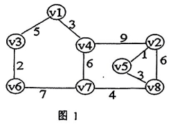

# DS-2013-33

## 1. 原题

应用 $Dijkstra$ 算法（单源最短路径）求图 $1$ 顶点 $v_6$ 到其他顶点的最短路径，最先求出的是顶点 $v_6$ 到顶点____________________ 的最短路径。

> 图 1 读图转录（无向带权图，$8$ 个顶点、$10$ 条边）：$(v_1,v_3)=5$、$(v_1,v_4)=3$、$(v_2,v_4)=9$、$(v_2,v_5)=1$、$(v_2,v_8)=6$、$(v_3,v_6)=2$、$(v_4,v_7)=6$、$(v_5,v_8)=3$、$(v_6,v_7)=7$、$(v_7,v_8)=4$。图中无箭头，按无向图（网）处理；本题结论只依赖与 $v_6$ 关联的两条边 $(v_6,v_3)=2$、$(v_6,v_7)=7$，读图风险已降至最低（其余边的读值见第 12 节说明）。

## 2. 答案

顶点 $v_3$（最短路径 $v_6\to v_3$，路径长度 $2$）。

## 3. 题目分析

- 已知：无向带权连通图（$8$ 个顶点、$10$ 条边，权值均为正），源点为 $v_6$；
- 目标：按 Dijkstra 算法的**执行顺序**，指出第一个被"定标"（求出最短路径，即进入集合 $S$/`final`）的顶点；
- 关键约束：Dijkstra 每轮从**尚未定标**的顶点中选取 $D$ 值最小者入 $S$，一旦入 $S$ 其最短路径即被确定（因所有边权为正，后续不可能更短）；
- 命题意图：考的不是一张完整的表格，而是对算法"**贪心选择顺序**"的理解——首轮可选者只有源点的邻点，故第一个定标者必是与源点相连且边权最小的那个邻点。

## 4. 核心考点

核心考点：
DS04.04.02 最短路径（Dijkstra 单源最短路径：$D$/$path$/`final` 三数组的逐轮更新与定标顺序）

辅助考点：
DS04.01 图的基本概念（带权无向图/网、路径与路径长度的概念）

解释：题目问"最先求出"，即算法第 $1$ 轮选出的顶点，属 Dijkstra 执行过程的模拟（TRACE）；要判断"是否真的最短"还需路径与权的概念，故以 DS04.01 为辅。

## 5. 解题思路

1. 写出源点 $v_6$ 的初始距离向量：$D(v_6)=0$，邻点 $v_3=2$、$v_7=7$，其余 $+\infty$；
2. 第 $1$ 轮在 $V\setminus S$ 中取 $D$ 最小者：$\min\{2,7,\infty,\dots\}=2$ 对应 $v_3$ ⟹ 最先求出 $v_6\to v_3$；
3. 用性质解释为何无需算完全图：$S$ 外任何顶点若要成为第一个定标者，其 $D$ 值必须小于 $2$，而未定标顶点的 $D$ 只能来自源点邻边的松弛，源点邻边最小权即 $2$，故不可能有更早者；
4. 为排除"另有更短路径"的疑虑，把 $v_6$ 到 $v_3$ 的**所有**简单路径枚举一遍，确认 $2$ 是最小值；
5. 再把整张 Dijkstra 表格算完（第 $2\sim7$ 轮），既核对答案，也确认后续轮次不会推翻 $v_3$ 的结论（Dijkstra 定标后不再改变）。

## 6. 详细解答

**步骤 1：逐轮执行 Dijkstra**（$S$ 为已定标集合，括号内为 $path$ 前驱）

| 轮次 | 本轮选定 $u$（$D$ 最小） | $D(v_1)$ | $D(v_2)$ | $D(v_3)$ | $D(v_4)$ | $D(v_5)$ | $D(v_6)$ | $D(v_7)$ | $D(v_8)$ |
|---|---|---|---|---|---|---|---|---|---|
| 初始 | $S=\{v_6\}$ | ∞ | ∞ | 2 (v6) | ∞ | ∞ | 0 | 7 (v6) | ∞ |
| 1 | **v3 (2)** | 7 (v3) | ∞ | **2✓** | ∞ | ∞ | 0 | 7 (v6) | ∞ |
| 2 | v1 (7) | **7✓** | ∞ | 2 | 10 (v1) | ∞ | 0 | 7 (v6) | ∞ |
| 3 | v7 (7) | 7 | ∞ | 2 | 10 (v1) | ∞ | 0 | **7✓** | 11 (v7) |
| 4 | v4 (10) | 7 | 19 (v4) | 2 | **10✓** | ∞ | 0 | 7 | 11 (v7) |
| 5 | v8 (11) | 7 | 17 (v8) | 2 | 10 | 14 (v8) | 0 | 7 | **11✓** |
| 6 | v5 (14) | 7 | 15 (v5) | 2 | 10 | **14✓** | 0 | 7 | 11 |
| 7 | v2 (15) | 7 | **15✓** | 2 | 10 | 14 | 0 | 7 | 11 |

各轮松弛要点：
- **第 1 轮**：$V\setminus S$ 中 $D$ 最小者为 $v_3(2)$，入 $S$；由 $v_3$ 松弛 $v_3\!-\!v_1$：$D(v_1)=2+5=7$；
- 第 2 轮：$v_1(7)$ 与 $v_7(7)$ 并列最小，按顶点编号取 $v_1$；松弛 $v_1\!-\!v_4$：$D(v_4)=7+3=10$；
- 第 3 轮：$v_7(7)$；松弛 $v_7\!-\!v_4$：$7+6=13>10$ 不改，$v_7\!-\!v_8$：$D(v_8)=11$；
- 第 4 轮：$v_4(10)$；松弛 $v_4\!-\!v_2$：$D(v_2)=19$；
- 第 5 轮：$v_8(11)$；松弛 $v_8\!-\!v_5$：$D(v_5)=14$，$v_8\!-\!v_2$：$11+6=17<19$ 改；
- 第 6 轮：$v_5(14)$；松弛 $v_5\!-\!v_2$：$14+1=15<17$ 改；
- 第 7 轮：$v_2(15)$，结束。

最终各点最短距离：$v_3:2$、$v_1:7$、$v_7:7$、$v_4:10$、$v_8:11$、$v_5:14$、$v_2:15$。定标顺序为 $v_3,v_1,v_7,v_4,v_8,v_5,v_2$（$v_1,v_7$ 因并列可互换，不影响 $v_3$ 居首）。

**步骤 2：直接理由（不必算完全图）**

初始只有源点 $v_6$ 在 $S$ 中，$D$ 的非 $\infty$ 值仅来自 $v_6$ 的两条关联边：$D(v_3)=2$、$D(v_7)=7$。第一轮取最小者 ⟹ $v_3$ 最先定标。

**步骤 3：枚举 $v_6$ 到 $v_3$ 的全部简单路径复核**

- $v_6\to v_3$：$2$；
- $v_6\to v_7\to v_8\to v_5\to v_2\to v_4\to v_1\to v_3$：$7+4+3+1+9+3+5=32$；
- $v_6\to v_7\to v_4\to v_1\to v_3$：$7+6+3+5=21$；
- $v_6\to v_7\to v_8\to v_2\to v_4\to v_1\to v_3$：$7+4+6+9+3+5=34$。

除直接边外，任何绕回 $v_3$ 的路径都要先经 $v_1$（$v_3$ 只有 $v_1$、$v_6$ 两个邻点），而 $v_6$ 到 $v_1$ 最短为 $7$，再加 $5$ 得 $12>2$ ⟹ $2$ 确为最短 ✓。

**答案**：$v_3$（最短路径 $v_6\to v_3$，长度 $2$）。

## 7. 选项分析

不适用（填空题）。

## 8. 考场标准答案

初始 $S=\{v_6\}$，$D(v_3)=2$、$D(v_7)=7$、其余为 $+\infty$。

第一轮取 $V\setminus S$ 中 $D$ 最小者 $\min\{2,7,\infty\}=2$，即 $v_3$ 入 $S$，其最短路径同时确定。

$$\boxed{\text{最先求出的是 }v_6\to v_3\text{ 的最短路径，长度 }2}$$

（完整定标顺序：$v_3(2)\to v_1(7)\to v_7(7)\to v_4(10)\to v_8(11)\to v_5(14)\to v_2(15)$。）

## 9. 易错点

1. 把"最先求出"理解成"距离源点最远/最近被访问"：Dijkstra 的"求出"指**定标（入 $S$）**，顺序由 $D$ 值从小到大决定，与 DFS/BFS 的访问顺序不同；
2. 误答 $v_7$ 或图中"看起来近"的点：$v_7$ 虽与 $v_6$ 直接相连但边权 $7>2$；图上位置远近不等于权值大小；
3. 忘记 $v_5\!-\!v_2$ 这条边权为 $1$ 是全图最小边：它虽最小，但 $v_5$、$v_2$ 都不是源点邻点，首轮 $D$ 值为 $\infty$，不可能最先定标——"最小边"不等于"最先求出"；
4. 松弛时只改 $D$ 不改 $path$，或漏掉某条无向边的**反向**松弛（如无向边 $(v_8,v_2)$ 在 $v_8$ 定标后要把 $D(v_2)$ 从 $19$ 改成 $17$）；
5. 并列时（$v_1$ 与 $v_7$ 同为 $7$）误以为影响答案：并列只影响第 $2$ 轮之后的顺序，第 $1$ 轮的 $v_3$ 是唯一最小值。

## 10. 一句话规律

Dijkstra"最先/最后求出哪个顶点"类题：最先求出者 $=$ 与源点直接相邻且边权最小的那个邻点（首轮 $D$ 值只可能来自源点邻边）；最后求出者 $=$ 定标顺序的末位，通常是最短距离最大的顶点。

## 11. 关联知识

- DS-2026-19（以 $V_1$ 为源点的 Dijkstra 表格题）与本题同型但要求完整列表，其"每轮一选二松弛三入 $S$"的表格格式可直接套用于本题；
- 本年度第 $40$ 题（从 $F$ 出发用 Prim 算法求最小生成树）与 Dijkstra 同为"逐步扩集合"的贪心算法，但 Prim 比较的是"集合到外部点的最小边"、Dijkstra 比较的是"源点到外部点的最小距离"，两者判据不可混用；
- Floyd 算法求的是**所有点对**之间的最短路径，不适用于本题这种单源情形（两者的表格形式与递推式完全不同，勿混用）；
- Dijkstra 要求边权非负，若出现负权边则"定标即最终"的前提不成立（本图权值均为正，满足条件）。

## 12. 来源与可信度

- 原题来源：2013 回忆版题面篇 `真题/2013/2013重庆邮电大学802数据结构真题.md` 二、填空题第 33 题，题面文字无订正说明；**含图 1**（`真题/2013/imgs/fig1.png`），本解析已把读到的 $10$ 条边与权值全部列于第 1 节备核；因权值取自回忆版扫描图（原图 $247\times187$ 像素，已放大辨认），`ocr_confidence` 记为 medium；
- 答案来源：独立推导（首轮 $D$ 值最小者 $v_3=2$ + 完整 $7$ 轮表格 + $v_6$ 到 $v_3$ 全部简单路径枚举复核）。本题答案只依赖与 $v_6$ 关联的两条边 $(v_6,v_3)=2$、$(v_6,v_7)=7$ 的读值，这两处图像清晰、歧义风险低；其余边的读值只影响第 6 节表格中的后续轮次，不影响填空结论；
- 教材依据：严蔚敏、吴伟民《数据结构（C 语言版）》第 7 章 图（7.5.3 最短路径：Dijkstra 算法，$D$、$path$、$final$ 三数组的逐轮表格演算）；
- 多来源冲突：无；争议：无（结论 $v_3$ 由源点邻边最小权唯一决定；第 2 轮 $v_1$、$v_7$ 的并列选取顺序不影响本题答案，已在第 6、9 节声明）；
- 最终可信度：答案 high；第 6 节完整表格中的后续数值为 medium（依赖读图，若个别边权读错需以题面转录清单为准复核）。
