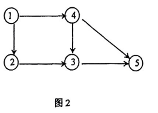

# DS-2013-37

## 1. 原题

给出图 $2$ 的一个拓扑序列____________________ 。

## 2. 答案

一个拓扑序列：**$1,\ 4,\ 2,\ 3,\ 5$**。

（填 $1,\ 2,\ 4,\ 3,\ 5$ 同样正确；本有向图的拓扑序列共有且仅有这两个。）

## 3. 题目分析

- 已知：含 $5$ 个顶点、$6$ 条弧的有向图（图 2），弧集为 $\{1\to4,\ 1\to2,\ 4\to3,\ 4\to5,\ 2\to3,\ 3\to5\}$；
- 目标：给出一个把全部顶点排成线性序列的结果，使图中**每条弧 $u\to v$ 的起点 $u$ 都排在终点 $v$ 之前**（拓扑有序）；
- 约束：拓扑序列一般不唯一，本题"给出一个"即可，但填写的序列必须**自身完整**（含 5 个顶点、不重不漏）且满足全部 6 条弧的前后关系；
- 命题意图：考 AOV 网/拓扑排序的形式定义与手工执行"反复删除入度为 $0$ 的顶点"这一过程的能力；图 2 特意安排了两处"同时可选"的分支（顶点 $2$ 与 $4$），用来检验考生是否理解"拓扑序列不唯一"。

## 4. 核心考点

核心考点：
DS04.04.03 拓扑排序（AOV 网：用有向边表示优先关系；拓扑序列的定义；按"入度为 $0$"逐步选取顶点）

辅助考点：
DS04.01 图的基本概念（有向图中弧的方向决定入度/出度：本题 $d^-(1)=0$、$d^-(2)=1$、$d^-(4)=1$、$d^-(3)=2$、$d^-(5)=2$，入度表是执行拓扑排序的唯一输入）

解释：本题不需要存储结构代码，只需要"方向 ⟹ 先后约束"这一概念，再按拓扑排序的选取规则走一遍；因此主考点是 DS04.04.03，读图求入度属 DS04.01 的基础内容。

## 5. 解题思路

1. 先把图的**弧集**逐条抄下来（读图时沿箭头方向抄，避免把 $1\to4$ 看成 $4\to1$）；
2. 统计每个顶点的**入度**：谁被箭头指，谁的入度加 $1$；入度为 $0$ 的顶点就是"没有任何前驱"的起点，只能排在最前；
3. 执行拓扑排序的贪心过程：输出一个入度为 $0$ 的顶点，删去它发出的所有弧（即把它指向的顶点入度减 $1$），再看谁的新入度变成 $0$；
4. 每一步若同时有多个入度为 $0$ 的顶点，任选其一——**这正是答案不唯一的来源**，也给出自检办法：把两个分支都走一遍，看是否都能覆盖 5 个顶点；
5. 若某步找不到入度为 $0$ 的顶点而顶点未输出完，说明图中有环、不存在拓扑序列（本题不会发生，因为已能写出合法序列）；
6. 写完答案后**逐条弧反向校验**：$6$ 条弧的起点是否都在终点左侧。

## 6. 详细解答

**第一步：读图得弧集与入度**

| 顶点 | 入边（谁指向我） | 入度 $d^-$ | 出边（我指向谁） | 出度 $d^+$ |
|---|---|---|---|---|
| $1$ | 无 | $0$ | $4,\ 2$ | $2$ |
| $2$ | $1$ | $1$ | $3$ | $1$ |
| $3$ | $4,\ 2$ | $2$ | $5$ | $1$ |
| $4$ | $1$ | $1$ | $3,\ 5$ | $2$ |
| $5$ | $4,\ 3$ | $2$ | 无 | $0$ |

核对：$\sum d^- = \sum d^+ = 6$，等于弧数 ✓（说明读图没有漏边、没有把方向看反）。

**第二步：Kahn 过程（消源点法）**

| 步 | 当前入度 $(1,2,3,4,5)$ | 入度为 $0$ 的可选顶点 | 输出 | 输出后各顶点入度变化 |
|---|---|---|---|---|
| 1 | $(0,1,2,1,2)$ | 只有 $1$ | $1$ | $d^-(2)\to0$，$d^-(4)\to0$ |
| 2 | $(-,0,2,0,2)$ | $2$ 或 $4$（分叉） | 取 $4$ | $d^-(3)\to1$，$d^-(5)\to1$ |
| 3 | $(-,0,1,-,1)$ | 只有 $2$ | $2$ | $d^-(3)\to0$ |
| 4 | $(-,-,0,-,1)$ | 只有 $3$ | $3$ | $d^-(5)\to0$ |
| 5 | $(-,-,-,-,0)$ | 只有 $5$ | $5$ | 结束 |

得拓扑序列 $1,\ 4,\ 2,\ 3,\ 5$。

**第三步：另一分支**

第 2 步若先取 $2$：$d^-(3)$ 由 $2$ 变 $1$，此时只有 $4$ 入度为 $0$ → 输出 $4$（$d^-(3)\to0$、$d^-(5)\to1$）→ 输出 $3$（$d^-(5)\to0$）→ 输出 $5$，得 $1,\ 2,\ 4,\ 3,\ 5$。

**第四步：穷举确认"只有这两个"**

顶点 $1$ 必须第 $1$ 个输出（唯一入度 $0$）；顶点 $5$ 必须最后输出（$d^+(5)=0$，且被 $4$、$3$ 指向）。中间三个位置由 $\{2,3,4\}$ 填充，受约束 $2\to3$、$4\to3$ 限制，故 $3$ 必须在 $2$、$4$ 之后，即 $3$ 占第 $4$ 位——于是第 $2,3$ 位是 $2,4$ 或 $4,2$ 两种排法，第 $5$ 位为 $5$。共 $2$ 个拓扑序列，与上面两条分支完全吻合 ✓。

**第五步：逐弧校验答案 $1,4,2,3,5$**

| 弧 | 序列中位置 | 起点在终点之前？ |
|---|---|---|
| $1\to4$ | 第 1、2 位（起点 $1$，终点 $4$） | ✓ |
| $1\to2$ | 第 1、3 位 | ✓ |
| $4\to3$ | 第 2、4 位 | ✓ |
| $4\to5$ | 第 2、5 位 | ✓ |
| $2\to3$ | 第 3、4 位 | ✓ |
| $3\to5$ | 第 4、5 位 | ✓ |

$6$ 条弧全部满足，答案合法。

## 7. 选项分析

不适用（填空题）。

## 8. 考场标准答案

由图 2 得弧集 $\{1\to2,\ 1\to4,\ 2\to3,\ 4\to3,\ 4\to5,\ 3\to5\}$，入度依次为 $d^-(1)=0,\ d^-(2)=d^-(4)=1,\ d^-(3)=d^-(5)=2$。

反复选取入度为 $0$ 的顶点并删去其发出的弧：$1 \to$（$2,4$ 同时可选）$\to 4 \to 2 \to 3 \to 5$。

**拓扑序列：$1,\ 4,\ 2,\ 3,\ 5$**（或 $1,\ 2,\ 4,\ 3,\ 5$）。

## 9. 易错点

1. **把弧的方向读反**（如看成 $4\to1$）：入度表整体错乱，可能写出 $1$ 不在最前的"序列"；判据是"源点 $1$ 无入边，必须排第 1 位"；
2. 写成 $1,2,3,4,5$（按编号顺序顺手填）：违反弧 $4\to3$，$3$ 排在 $4$ 之前即错；
3. 只写部分顶点（漏写 $5$ 或漏写 $2$）：拓扑序列必须是**全部**顶点的排列，$5$ 个顶点不重不漏；
4. 误以为拓扑序列唯一而怀疑自己的答案：本题第 2 步存在 $2$、$4$ 两个入度 $0$ 的顶点，两个答案都正确；
5. 与"关键路径/DFS 序列"混淆：拓扑序列只关心先后约束，与遍历访问顺序不是同一概念。

## 10. 一句话规律

给图写拓扑序列只需两笔：先列**入度表**找出所有入度为 $0$ 的顶点，再"输出一个、削掉它发出的弧、更新入度"逐步推进；每步遇到多个入度 $0$ 顶点就是答案不唯一之处，最后用"每条弧的起点都在终点左侧"逐弧回验。

## 11. 关联知识

- DS-2012-33（2012 年同型填空题：给出 AOV 网的拓扑序列，该图约束紧、拓扑序列唯一，可与本题"两个拓扑序列"对照理解唯一性何时成立）；
- DS-2006-24（判断题：涉及"有向图/拓扑排序"存在性条件——有环则无拓扑序列，可用本题第 4 步的穷举思路反证）；
- DS04.04.03 拓扑排序与 DS04.04.04 关键路径同建于 AOV/AOE 网之上：拓扑序也是求 ve/vl 值的前序步骤（见 DS-2007-30 的拓扑序列过程）；
- 拓扑排序的程序实现（用栈/队列存零入度顶点）见教材 7.5 节，与本知识库 DS-2012-43（邻接矩阵 + DFS/BFS/Prim 综合题）共用"按图手工执行算法"的答题格式。

## 12. 来源与可信度

- 原题来源：2013 回忆版题面篇 `真题/2013/2013重庆邮电大学802数据结构真题.md` 二、填空题第 37 题；本题无订正说明，图 2 由 `真题/2013/imgs/fig2.png` 提供，已放大（4 倍）逐条核对 $6$ 条弧及其箭头方向，识图结果明确（$\sum d^-=\sum d^+=6$ 自洽）；
- 答案来源：独立推导——Kahn 消源点过程逐步执行、穷举证明拓扑序列恰为 $2$ 个、并对答案逐弧反向校验；未实际抓取解析篇网页，仅按要求登记其地址备查；
- 教材依据：严蔚敏、吴伟民《数据结构（C 语言版）》第 7 章 7.5 图（AOV 网、拓扑排序的定义与算法：每次选入度为 $0$ 的顶点输出，删去其发出的有向边）；
- 多来源冲突：无；争议：无（题干要求"一个"拓扑序列，两个合法答案均满足，不存在唯一性争议）；
- 最终可信度：high。
