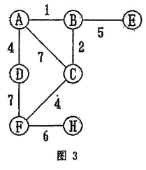

# DS-2013-41

## 1. 原题

现有无向图如图 $3$ 所示，完成下面任务：

> 订正说明转录：源文作"现有无向图 $3$ 所示"，据题意补"如图"二字。

（1）画出图的邻接矩阵图示；

（2）从顶点 $H$ 开始对图进行广度优先遍历，写成遍历结果。



（说明：源文件中本题配图为 `imgs/fig4.png`，图片下方标注为"图 3"，与第 40 题所用图为同一张无向图，题面文字"图 $3$"即指该图。）

## 2. 答案

**（1）邻接矩阵**（顶点次序取 $A,B,C,D,E,F,H$，无边用 $\infty$ 表示）：

$$
\begin{pmatrix}
 & A & B & C & D & E & F & H \\
A & 0 & 1 & 7 & 4 & \infty & \infty & \infty \\
B & 1 & 0 & 2 & \infty & 5 & \infty & \infty \\
C & 7 & 2 & 0 & \infty & \infty & 4 & \infty \\
D & 4 & \infty & \infty & 0 & \infty & 7 & \infty \\
E & \infty & 5 & \infty & \infty & 0 & \infty & \infty \\
F & \infty & \infty & 4 & 7 & \infty & 0 & 6 \\
H & \infty & \infty & \infty & \infty & \infty & 6 & 0
\end{pmatrix}
$$

**（2）从 $H$ 出发的 BFS 序列**：$H \to F \to C \to D \to A \to B \to E$，写作 $H,\ F,\ C,\ D,\ A,\ B,\ E$。

## 3. 题目分析

- 已知：无向带权图（图 3），$V=\{A,B,C,D,E,F,H\}$（$7$ 个顶点，注意**没有** $G$），$E=\{AB\,1,\ BC\,2,\ AD\,4,\ CF\,4,\ BE\,5,\ FH\,6,\ AC\,7,\ DF\,7\}$（$8$ 条边）；
- 目标：(1) 用邻接矩阵把这张图"画"出来；(2) 从 $H$ 出发做广度优先遍历并写出序列；
- 约束：邻接矩阵必须是**对称**的（无向图），对角线为 $0$（或 $\infty$，按约定；本题采用 $0$）；带权图的矩阵元素填**边的权值**而非 $1$；BFS 是"先访问完距离 $1$ 的、再距离 $2$ 的……"的层次访问，需借助队列，且**同一层内邻接点的检查次序可任选**，故遍历序列不唯一；
- 命题意图：考"图形 ⟶ 矩阵"的规范化转写（含 $\infty$ 与 $0$ 的约定、对称性自检）与 BFS 的层次队列模拟；两问共用一张图，也与第 40 题（$Prim$）构成"同一图、三种算法"的对照。

## 4. 核心考点

核心考点：
DS04.02.01 邻接矩阵法（$A[i][j]=$ 权值 / $\infty$ / 对角 $0$；无向图矩阵对称；第 $i$ 行非零非 $\infty$ 元素个数 $=$ 顶点 $v_i$ 的度）

辅助考点：
DS04.03.02 广度优先搜索（队列驱动的层次访问、访问标记 `visited`、序列不唯一的原因）

解释：第 (1) 问是纯粹的存储结构转写（DS04.02.01）；第 (2) 问的 BFS 在邻接矩阵上的实现是"扫描第 $i$ 行的各列找邻接点"，其检查次序即列的先后（$A,B,C,D,E,F,H$），因此本解析的序列由矩阵行序自然决定——两问之间是"存储结构决定遍历序列写法"的直接联系。

## 5. 解题思路

1. **先抄边表再填矩阵**：把图上 $8$ 条边逐条抄成"端点对 + 权值"，逐条填入 $A[i][j]$ 与 $A[j][i]$（无向图必须同时填两格），比"看着图逐行想"更不容易漏；
2. **两处自检**：① 对称性（$A=A^{\mathsf T}$）；② 每行的非 $0$ 非 $\infty$ 元素个数应等于该顶点的度：$d(A)=3,d(B)=3,d(C)=3,d(D)=2,d(E)=1,d(F)=3,d(H)=1$，和为 $16=2\times8$ ✓；
3. **BFS 用队列手工模拟**：起始顶点入队并标记；每次出队一个顶点，**按矩阵该行从左到右**扫描，把未访问的邻接点依次访问并入队（"先进先出"保证层次）；
4. 记录"出队顺序"与"入队（访问）顺序"——遍历序列写的是**访问（首次标记）顺序**；
5. 结果检查：序列长度必须等于顶点数 $7$，不重不漏；且相邻层的顶点距 $H$ 的最短路径长度单调不减（本题 $H$ 距离 $0$；$F$ 距离 $1$；$C,D$ 距离 $2$；$A,B,E$ 距离 $3$）；
6. 说明不唯一性：第 2 层 $\{C,D\}$ 的先后取决于 $F$ 行中列的检查次序，故 $H,F,D,C,A,B,E$ 同样是合法的 BFS 序列。

## 6. 详细解答

### 6.1 边表（读图整理）

| 边 | $AB$ | $BC$ | $AD$ | $CF$ | $BE$ | $FH$ | $AC$ | $DF$ |
|---|---|---|---|---|---|---|---|---|
| 权 | $1$ | $2$ | $4$ | $4$ | $5$ | $6$ | $7$ | $7$ |

各顶点的邻接点集（按字母升序）：

$$A:\{B,C,D\},\quad B:\{A,C,E\},\quad C:\{A,B,F\},\quad D:\{A,F\},\quad E:\{B\},\quad F:\{C,D,H\},\quad H:\{F\}$$

### 6.2 第（1）问：邻接矩阵

按顶点次序 $A,B,C,D,E,F,H$ 建立 $7\times7$ 矩阵，$M[i][j]=$ 边 $v_iv_j$ 的权值，无边记 $\infty$，自身记 $0$：

```
        A    B    C    D    E    F    H
   A [  0    1    7    4    ∞    ∞    ∞ ]
   B [  1    0    2    ∞    5    ∞    ∞ ]
   C [  7    2    0    ∞    ∞    4    ∞ ]
   D [  4    ∞    ∞    0    ∞    7    ∞ ]
   E [  ∞    5    ∞    ∞    0    ∞    ∞ ]
   F [  ∞    ∞    4    7    ∞    0    6 ]
   H [  ∞    ∞    ∞    ∞    ∞    6    0 ]
```

**校验**：

- 对称性：$M[i][j]=M[j][i]$ 对全部格子成立 ✓（无向图的必要条件）；
- 行非 $\infty$ 非 $0$ 计数 $=3,3,3,2,1,3,1$，与 $d(A),\dots,d(H)$ 逐一相符，总和 $16=2|E|$ ✓；
- 权值出现次数：$1,2,4,4,5,6,7,7$ 各在矩阵中出现 $2$ 次（对称），共 $16$ 个非零非 $\infty$ 元素 ✓。

### 6.3 第（2）问：从 $H$ 出发的 BFS 过程

用队列 $Q$（左端出、右端入），$\mathit{visited}$ 记录已访问：

| 步 | 出队顶点 | 该行扫描到的未访问邻接点 | 访问并入队 | 队列状态（队头在左） | 已访问序列 |
|---|---|---|---|---|---|
| 0 | — | — | $H$（起点） | $[H]$ | $H$ |
| 1 | $H$ | $F$（$H$ 行只有 $F$） | $F$ | $[F]$ | $H,F$ |
| 2 | $F$ | $C$（列 3）、$D$（列 4）；$H$ 已访问 | $C,D$ | $[C,D]$ | $H,F,C,D$ |
| 3 | $C$ | $A$（列 1）、$B$（列 2）；$F$ 已访问 | $A,B$ | $[D,A,B]$ | $H,F,C,D,A,B$ |
| 4 | $D$ | $A$（已访问）、$F$（已访问） | 无 | $[A,B]$ | $H,F,C,D,A,B$ |
| 5 | $A$ | $B,C,D$ 均已访问 | 无 | $[B]$ | $H,F,C,D,A,B$ |
| 6 | $B$ | $E$（列 5）；$A,C$ 已访问 | $E$ | $[E]$ | $H,F,C,D,A,B,E$ |
| 7 | $E$ | $B$ 已访问 | 无 | $[]$ 队列空，结束 | $H,F,C,D,A,B,E$ |

**遍历结果：$H,\ F,\ C,\ D,\ A,\ B,\ E$。**

层次视图（BFS 生成的是"以 $H$ 为根的最短路径树"形状）：

```
第0层:  H
第1层:  F                 （H 的唯一邻接点）
第2层:    C  D            （F 的其余额外邻接点）
第3层:      A  B          （C 的邻接点 A、B；D 无新点）
第4层:          E         （B 的邻接点 E）
```

按“到 $H$ 的最少边数”复核：$d(H,F)=1$；$d(H,C)=d(H,D)=2$；$d(H,A)=d(H,B)=3$；$d(H,E)=4$（唯一路径 $H\!-\!F\!-\!C\!-\!B\!-\!E$）——序列 $H,F,C,D,A,B,E$ 的层号依次为 $0,1,2,2,3,3,4$，单调不减 ✓ 符合 BFS 的层次性质。

### 6.4 序列不唯一的说明

BFS 的合法序列不止一个，差别只在"同一顶点的多个邻接点谁先入队"：

- 本解析按**矩阵列序（字母升序）**检查，得 $H,F,C,D,A,B,E$；
- 若在第 2 步先检查 $D$ 再检查 $C$，则得 $H,F,D,C,A,B,E$（第 3 层 $A,B$ 由 $C$ 带出，次序不变）；
- 两种写法都正确，但**不能**写成 $H,F,C,D,A,E,B$ 之类把 $E$ 提到 $B$ 之前——$E$ 只能由 $B$ 带出，必须在 $B$ 之后；同理 $A,B$ 必须在 $C$ 之后（它们与 $H$ 之间只经过 $C$ 这条路）。判据：每个顶点必须排在其"层次前驱"之后、且同层内部按入队次序。

## 7. 选项分析

不适用（问答题）。

## 8. 考场标准答案

**(1)** 顶点次序 $A,B,C,D,E,F,H$，无边记 $\infty$：

```
        A  B  C  D  E  F  H
   A [  0  1  7  4  ∞  ∞  ∞ ]
   B [  1  0  2  ∞  5  ∞  ∞ ]
   C [  7  2  0  ∞  ∞  4  ∞ ]
   D [  4  ∞  ∞  0  ∞  7  ∞ ]
   E [  ∞  5  ∞  ∞  0  ∞  ∞ ]
   F [  ∞  ∞  4  7  ∞  0  6 ]
   H [  ∞  ∞  ∞  ∞  ∞  6  0 ]
```

（对称阵；对角线为 $0$；每行非零非 $\infty$ 个数即该顶点的度。）

**(2)** 从 $H$ 出发的 $BFS$：$H$ 入队 → 出 $H$ 访问 $F$ → 出 $F$ 访问 $C,D$ → 出 $C$ 访问 $A,B$ → 出 $D$（无新点）→ 出 $A$（无新点）→ 出 $B$ 访问 $E$ → 队列空。

**遍历序列：$H \rightarrow F \rightarrow C \rightarrow D \rightarrow A \rightarrow B \rightarrow E$。**

## 9. 易错点

1. **漏顶点**：图中没有 $G$，按 $A\sim H$ 八个字母建 $8\times8$ 矩阵是常见错误——必须 $7\times7$；
2. **矩阵不对称或漏填 $\infty$**：无向图只填上三角/下三角的一半、或把"无边"写成 $0$（与对角线的"自身距离 $0$"混淆），都会破坏存储语义；
3. 带权图的矩阵元素填成 $1/0$（那是**邻接矩阵的布尔版本**，适用于无权图或 DFS 遍历题）——本题有 8 条带权边，第 (1) 问要求填权值；
4. BFS 写成 DFS：同一张图从 $H$ 出发的深度优先序列是 $H,F,C,A,B,E,D$（“一条路走到底再回溯”），而 $BFS$ 必须**逐层**（第 2 层的 $D$ 一定在第 3 层的 $A$ 之前）；
5. 把 $E$ 排在 $B$ 之前、或把 $A,B$ 排在 $C,D$ 之前：违反"邻接点由谁带出"的依赖关系；
6. 忘记 $F$ 行中 $H$ 已访问、$D$ 行中 $A,F$ 已访问这类"回头边"的处理，导致重复访问同一顶点。

## 10. 一句话规律

邻接矩阵三步自检：**对称、对角为 $0$、每行有效元素数等于对应顶点的度（总和 $=2|E|$）**；BFS 序列的可靠性靠"层次"检查——先数出每个顶点到起点的边数，层号小的必须排在层号大的之前，同层再按入队次序。

## 11. 关联知识

- DS-2013-40（同卷同一张图：从 $F$ 出发的 $Prim$ 最小生成树，总权值 $22$）——本题的边表与那一题的候选边表完全一致，可互相核对读图；
- DS-2012-43（同一图中给出 DFS、BFS 与 Prim 三种过程，BFS 序列 $V_1\,V_3\,V_4\,V_7\,V_5\,V_2\,V_8\,V_6$）：可对照"邻接矩阵列序决定 BFS 同层次序"这一约定；
- DS-2006-09、DS-2006-29、DS-2012-32（邻接矩阵的存储与度的计算类题目）：与第 (1) 问同属 DS04.02.01 的基本功；
- DS-2013-16（同卷选择题：邻接表存储下 DFS 的时间复杂度 $O(n+e)$）与本题互补——本题用邻接矩阵遍历的代价是 $O(|V|^2)$（每个顶点扫完一行），可作 $Prim/BFS$ 复杂度对照；
- 本题 BFS 得到的层次关系即“以 $H$ 为源的单源最短路径（无权图）”，可用来校验序列：任何顶点的层号等于它到 $H$ 的最少边数，与 2026 年 DS-2026-19（Dijkstra 最短路径）属同一思想族。

## 12. 来源与可信度

- 原题来源：2013 回忆版题面篇 `真题/2013/2013重庆邮电大学802数据结构真题.md` 三、问答题第 41 题，含订正说明（补"如图"二字，已转录）；配图为 `真题/2013/imgs/fig4.png`，其内容与第 40 题的 `fig3.png` 相同（图下标注均为"图 3"，$7$ 个顶点、$8$ 条边、权值 $1,2,4,4,5,6,7,7$），已放大 $4$ 倍核对，其中 $D\!-\!F$ 边权按 $7$ 识读（该值只影响矩阵中 $M[D][F]$ 一格与 BFS 无影响，因为 BFS 不看权值）；
- 答案来源：独立推导——先由读图得边表，再按"填两格 + 对称性 + 行数=度"三重校验构造矩阵；BFS 用队列逐层模拟并给出层次复核与不唯一性分析（程序后台模拟亦输出同一序列 $H,F,C,D,A,B,E$）；未实际抓取解析篇网页，仅按要求登记其地址备查；
- 教材依据：严蔚敏、吴伟民《数据结构（C 语言版）》第 7 章 7.4.1 数组表示（邻接）法（$A[i][j]=1$ 或权值、$A[i][i]=0$、无向图矩阵对称、网与图的邻接矩阵区别）、7.4.2 广度优先搜索（$\mathit{visited}$ 数组 + 队列，类似树的层序遍历）；
- 多来源冲突：无；争议：无（BFS 序列本身不唯一，本解析已声明所采用的邻接点检查次序约定，并给出另一种合法写法）；
- 最终可信度：high（矩阵由 $\sum d(v)=2|E|=16$ 与对称性双重锁定；BFS 序列在"按列序检查"约定下唯一）。
