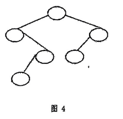

# DS-2013-42

## 1. 原题

已知一棵二叉排序树结构如图 $4$ 所示，各结点的数据从小到大依次为 $15,25,37,49,51,66$，请重建出完整的原二叉树。



## 2. 答案

二叉排序树的中序遍历必为递增序列，故**树形固定时结点关键字的填法唯一**：按中序遍历该形状的次序，把 $15,25,37,49,51,66$ 依次填入即可。

重建结果：

```
              49
            /    \
         15        66
            \      /
            37    51
            /
          25
```

即：根为 $49$；$49$ 的左孩子是 $15$、右孩子是 $66$；$15$ 无左孩子、右孩子是 $37$；$37$ 的左孩子是 $25$（无右孩子）；$66$ 的左孩子是 $51$（无右孩子）；$25$、$51$ 为叶子。

## 3. 题目分析

- 已知：一棵二叉树的**形状**（图 4：$6$ 个空结点，父子关系与左右位置均已画出）与 $6$ 个关键字 $15<25<37<49<51<66$；该树是**二叉排序树**；
- 目标：把 $6$ 个关键字一一填到 $6$ 个结点上，使填完的树既保持图 4 的形状、又满足二叉排序树定义；
- 关键性质：BST $\iff$ 中序遍历序列严格递增。形状固定 ⟹ 中序遍历访问结点的**先后次序**固定 ⟹ 第 $k$ 个被访问的结点必须填第 $k$ 小的关键字。于是"填法存在且唯一"；
- 命题意图：考 BST 的"中序有序性"这一**刻画性**质的反向使用——通常的题是"给关键字序列建树、再求中序"，本题把方向倒过来（给形状、给有序关键字，还原结点内容），检验是否理解"BST 的形状与关键字集合相互确定"；
- 注意：本题**不是**"由中序序列确定二叉树"（那需要两个序列），这里第二个信息是"BST 性质"而非另一个遍历序列。

## 4. 核心考点

核心考点：
DS05.07.01 二叉搜索（排序）树（定义：左子树所有关键字 < 根 < 右子树所有关键字，且递归成立；性质：中序遍历得递增有序序列）

辅助考点：
DS03.02.03.02 中序遍历（对固定形状求"访问次序表"，是本题的翻译工具）；DS03.02.02 二叉树的存储结构（二叉链表中"左孩子为空/右孩子为空"由图 4 的画法直接给出，决定哪些位置不能填更小的数——即形状的左右约束）

解释：先用 DS03.02.03.02 把图 4 翻译成中序位置表，再用 DS05.07.01 的有序性把递增关键字逐位对上；最后仍用 DS05.07.01 的定义（区间法）验证每个结点合法。

## 5. 解题思路

1. 先给图 4 的每个结点**编号位置**（沿树画一遍中序：左 → 根 → 右），得到"中序访问次序表"；
2. 把已排序的关键字序列 $15,25,37,49,51,66$ 按序号一一对应填进访问次序表——第 $1$ 个被访问的结点填最小值，依此类推；
3. **为什么这样填一定对**：BST 要求中序递增，而递增序列与给定关键字集合之间只有"升序"这一种对应，故填法唯一；反过来，只要中序递增，由"二叉树 + 中序递增"即可推出 BST 定义成立（第 6.3 节给出区间验证）；
4. 验证（必做）：对每个结点检查"左子树全部 $<$ 本结点 $<$ 右子树全部"，用**区间法**（根允许区间 $(-\infty,+\infty)$，往左孩子收紧上界、往右孩子收紧下界）逐个核对 $6$ 个结点；
5. 再验证：对填好的树做一次中序遍历，读回 $15,25,37,49,51,66$ ✓；
6. 顺手观察：图 4 中"只有右子树的链"（$15\to37\to25$ 这一支）对应 BST 中连续的几个相邻关键字，可作为快速自检的直觉。

## 6. 详细解答

### 6.1 读图 4：确定形状

图 4 的 $6$ 个结点位置（按层）与父子/左右关系：

| 结点位置 | 层 | 父结点 | 是父的 | 左孩子 | 右孩子 |
|---|---|---|---|---|---|
| $R$（顶层） | $1$ | — | — | $L$ | $R_r$ |
| $L$（第 2 层左） | $2$ | $R$ | 左孩子 | 无 | $M_1$ |
| $R_r$（第 2 层右） | $2$ | $R$ | 右孩子 | $M_2$ | 无 |
| $M_1$（第 3 层偏左） | $3$ | $L$ | 右孩子 | $B_1$ | 无 |
| $M_2$（第 3 层偏右） | $3$ | $R_r$ | 左孩子 | 无 | 无 |
| $B_1$（第 4 层左） | $4$ | $M_1$ | 左孩子 | 无 | 无 |

```
        R
       / \
      L   Rr            L 只有右孩子 M1；Rr 只有左孩子 M2
       \ / \
       M1  M2
       /
      B1                M1 只有左孩子 B1
```

### 6.2 中序遍历该形状，得"填数次序表"

按 $L \to$ 根 $\to R$ 递归展开：

$$\text{InOrder}(R)=\text{InOrder}(L),\ R,\ \text{InOrder}(R_r)$$
$$\text{InOrder}(L)=\underbrace{\text{InOrder}(\text{空})}_{\text{无}},\ L,\ \text{InOrder}(M_1)=L,\ B_1,\ M_1$$
$$\text{InOrder}(R_r)=\text{InOrder}(M_2),\ R_r=M_2,\ R_r$$

合并得中序访问次序：

| 中序位次 | $1$ | $2$ | $3$ | $4$ | $5$ | $6$ |
|---|---|---|---|---|---|---|
| 结点位置 | $L$ | $B_1$ | $M_1$ | $R$ | $M_2$ | $R_r$ |
| 应填关键字 | $15$ | $25$ | $37$ | $49$ | $51$ | $66$ |

（关键字序列 $15,25,37,49,51,66$ 已按升序给出，第 $k$ 位即第 $k$ 小。）

### 6.3 填数结果与区间法验证

填数后：$R=49$、$L=15$、$B_1=25$、$M_1=37$、$M_2=51$、$R_r=66$。

用 BST 定义（每个结点的关键字必须落在其允许区间内）逐点核对，区间随下降方向收紧：

| 结点 | 关键字 | 允许区间 | 左子树全部 $<$ 它？ | 右子树全部 $>$ 它？ | 结论 |
|---|---|---|---|---|---|
| $R$ | $49$ | $(-\infty,+\infty)$ | 左子树 $\{15,25,37\}$ 均 $<49$ ✓ | 右子树 $\{51,66\}$ 均 $>49$ ✓ | ✓ |
| $L$ | $15$ | $(-\infty,49)$ | 无左子树 ✓ | 右子树 $\{37,25\}$ 均 $>15$ ✓ | ✓ |
| $M_1$ | $37$ | $(15,49)$ | 左子树 $\{25\}$：$25<37$ ✓ | 无右子树 ✓ | ✓ |
| $B_1$ | $25$ | $(15,37)$ | 叶 ✓ | 叶 ✓ | ✓ |
| $R_r$ | $66$ | $(49,+\infty)$ | 左子树 $\{51\}$：$51>49$ ✓ | 无右子树 ✓ | ✓ |
| $M_2$ | $51$ | $(49,66)$ | 叶 ✓ | 叶 ✓ | ✓ |

全部满足 ⟹ 所得树确为二叉排序树，且形状与图 4 一致。

### 6.4 反向校验：中序回读

对填好的树做中序遍历：

$$15 \rightarrow 25 \rightarrow 37 \rightarrow 49 \rightarrow 51 \rightarrow 66$$

逐步：到 $L=15$（无左孩子）访问 $15$ → 进其右孩子 $M_1=37$ → 进 $37$ 的左孩子 $B_1=25$（叶）访问 $25$ → 回 $37$ 访问 → 回根 $49$ 访问 → 进 $R_r=66$ → 先访问其左孩子 $M_2=51$ → 回 $66$ 访问。

读回 $15,25,37,49,51,66$，与题给递增序列完全一致 ✓。

### 6.5 唯一性说明

设另有填法也满足"形状为图 4 且是 BST"。则两棵树的中序遍历都必须等于给定的升序序列（BST 中序唯一确定为关键字的升序排列），而图 4 的中序访问次序表（6.2 节）是固定的 $6$ 个位置，第 $k$ 个位置必须填第 $k$ 小的关键字 ⟹ 两填法逐位置相同。**故本题答案唯一。**

（对照：若题给的不是"升序关键字 + 形状"而是"先序 + 中序"，则同样能唯一确定二叉树；但若只给形状与关键字集合、不要求 BST 性质，则有 $6!$ 种填法。本题的"BST"条件正是把 $6!$ 压缩成 $1$ 的那道约束。）

## 7. 选项分析

不适用（问答题/作图题）。

## 8. 考场标准答案

二叉排序树的中序遍历是递增序列；图 4 的形状固定，其余结点的中序访问次序为

$$L\ (\text{第 2 层左}),\ B_1\ (\text{第 4 层}),\ M_1\ (\text{第 3 层左}),\ R\ (\text{根}),\ M_2\ (\text{第 3 层右}),\ R_r\ (\text{第 2 层右})$$

把 $15,25,37,49,51,66$ 依次填入这 $6$ 个位置，得重建的二叉排序树：

```
              49
            /    \
         15        66
            \      /
            37    51
            /
          25
```

验证：中序遍历为 $15,25,37,49,51,66$（递增）✓；且每个结点均满足"左子树 $<$ 根 $<$ 右子树"（$15<37<49$、$25<37$、$49<51<66$）✓，形状与图 4 一致，故为所求。

## 9. 易错点

1. **把最小值填在根**（照搬"插入序列建树"的直觉）：根必须是中序第 $4$ 个位置的关键字 $49$，因为图 4 的左子树有 $3$ 个结点、右子树有 $2$ 个结点 ⟹ 根是第 $4$ 小的数；
2. 读图 4 时把 $L$ 的**右**孩子看成左孩子（或反之）：$L$ 位于父结点左侧但它只有右子树，$R_r$ 只有左子树——左右搞反会改变中序次序表，从而把 $37$ 与 $25$、$51$ 与 $66$ 的关系填错；
3. 只保证“每个结点的左孩子 $<$ 它 $<$ 右孩子”而忽略**整棵子树**的区间约束：例如把 $L$ 填 $25$、$B_1$ 填 $15$、$M_1$ 填 $37$，局部逐结点都过关（$25$ 的右孩子 $37>25$；$37$ 的左孩子 $15<37$），但 $B_1=15$ 位于 $L=25$ 的**右子树**内，违反“右子树全部关键字 $>$ 根”，整体不是 BST。必须用区间法或中序回读校验；
4. 忘记第 $4$ 层的 $B_1$ 只有"左孩子位"这一事实，把树画成 $37$ 的右孩子是 $25$——形状必须与图 4 **完全一致**（题目要求"重建原二叉树"）；
5. 误以为答案不唯一：形状 + 升序关键字 + BST 性质三者已锁定唯一填法（见 6.5 节）。

## 10. 一句话规律

"给形状 + 给有序关键字 + 说明是 BST"的还原题只有一步：**中序遍历那个形状，把关键字按升序逐位对上**；再用区间法（往左收紧上界、往右收紧下界）验证每个结点，即可确保不是只满足局部有序。

## 11. 关联知识

- DS-2006-37（BST 中"有两孩子的结点，其中序后继无左孩子、前驱无右孩子"的证明）：与本题共用"BST 中序递增 + 中序后继/前驱的结构定位"这一套语言；
- DS-2005-14、DS-2005-23、DS-2006-06、DS-2006-20、DS-2007-45、DS-2012-15、DS-2012-39（二叉排序树的构造、插入与删除）：那些题是"给插入次序 ⟹ 定形状"，本题反过来"给形状 ⟹ 定关键字位置"，两方向合起来构成 BST 的完整理解；
- DS-2013-25（同卷填空：由先序 $ABCDEGF$ 与中序 $CBEGDFA$ 确定二叉树并求后序）：同为"由序列/形状反推二叉树"的题型，方法一致——**先定中序位次表**；
- DS-2013-45（同卷算法设计题：把 BST 变换为使中序递减的树）：与本题相互呼应，都建立在"BST 的中序遍历就是关键字有序序列"这一条性质上；
- DS-2013-11（同卷：高度为 3 的 AVL 树最少结点数）——若把本题的树继续插入关键字，其形态会因不平衡而需要旋转，属 DS05.07.02 的延伸。

## 12. 来源与可信度

- 原题来源：2013 回忆版题面篇 `真题/2013/2013重庆邮电大学802数据结构真题.md` 三、问答题第 42 题；本题无订正说明；配图 `真题/2013/imgs/fig5.png`（图下标注"图 4"，与题面"如图 4 所示"一致），已放大 $4$ 倍核对：$6$ 个空结点的层次与左右归属清晰（$R$ 有两个孩子；第 2 层左结点只有右孩子、第 2 层右结点只有左孩子；第 3 层左结点只有左孩子；其余为叶），无识图歧义；
- 答案来源：独立推导——先列图 4 的中序访问次序表，再按 BST 中序必递增逐位填数；用区间法对 $6$ 个结点逐一验证 BST 定义，并用中序回读与唯一性论证作二次校验（程序后台核对：该形状中序为 $[15,25,37,49,51,66]$、BST 性质判定为真）；未实际抓取解析篇网页，仅按要求登记其地址备查；
- 教材依据：严蔚敏、吴伟民《数据结构（C 语言版）》第 9 章 查找（9.4 二叉排序树：定义——若左子树不空则左子树上所有结点的关键字均小于根结点的关键字，若右子树不空则均大于，左右子树又各为一棵二叉排序树；及其"中序遍历得递增有序序列"的性质）、第 6 章 6.3 二叉树的遍历（中序遍历的递归定义）；
- 多来源冲突：无；争议：无（答案由形状与有序关键字唯一确定，见 6.5 节）；
- 最终可信度：high。
