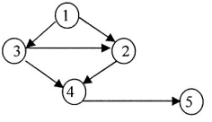

# DS-2014-19

## 1. 原题

已给下图，（）是该图的拓扑排序？

A. $1,2,3,4,5$

B. $1,2,4,3,5$

C. $1,3,2,4,5$

D. $1,2,3,5,4$

> 读图说明（原图放大 4 倍后逐条核对箭头端）：图中 $5$ 个顶点，$6$ 条弧为 $1\to3$、$1\to2$、$3\to2$、$3\to4$、$2\to4$、$4\to5$；布局上 $1$ 在上方、$3$ 在左、$2$ 在右、$4$ 在下方、$5$ 在最右下，$3$ 与 $2$ 之间的水平弧箭头指向 $2$，$4\to5$ 箭头指向 $5$，其余各弧（$1\to3$、$1\to2$、$3\to4$、$2\to4$）的箭头端分别落在 $3$、$2$、$4$、$4$ 上；无双向弧、无自环。

## 2. 答案

**C**（$1,3,2,4,5$）。该图的拓扑序列**唯一**。

## 3. 题目分析

- 已知：一个 $5$ 顶点 $6$ 弧的有向图（按读图所得弧集），要求判断四个候选顶点序列中哪一个是它的拓扑序列；
- 目标：拓扑排序——把所有顶点排进一个线性序列，使**每条弧 $(u,v)$ 都满足 $u$ 排在 $v$ 之前**；
- 关键约束：
  1. 拓扑序列存在的充要条件是图为**有向无环图（DAG）**；本题 $6$ 条弧的终点编号总体递增（$1\to\{3,2\}$、$3\to\{2,4\}$、$2\to4$、$4\to5$），沿任一方向走编号不会回到自身（唯一"编号倒退"的弧是 $3\to2$，而 $2$ 无任何通向 $3$ 的出弧），故无环；
  2. 弧集给出 $6$ 条前后约束：$1\prec3$、$1\prec2$、$3\prec2$、$3\prec4$、$2\prec4$、$4\prec5$；其中 $1\prec2$ 被 $1\prec3\prec2$ 蕴含（冗余约束），$3\prec4$ 被 $3\prec2\prec4$ 蕴含（冗余约束），**独立约束链**为
     $$1\prec3\prec2\prec4\prec5$$
     这是一条全序，故拓扑序列唯一；
  3. 入度视角：$\text{in}(1)=0$、$\text{in}(2)=2$（来自 $1,3$）、$\text{in}(3)=1$（来自 $1$）、$\text{in}(4)=2$（来自 $3,2$）、$\text{in}(5)=1$（来自 $4$）——**每一轮入度为 $0$ 的顶点都只有一个**，这正是"序列唯一"的算法侧解释；
  4. 本题不是"写出拓扑序列"而是"四选一"，故除正向求解外还可逐选项找违反的弧，两条路必须给出同一答案；
- 命题意图：考"拓扑排序 $=$ 有向图的偏序扩展为全序"这一本质，并检验能否从图中正确读出弧的方向（本题 $3\to2$ 与 $1\to3$ 构成的"编号倒退"弧是关键，若误读成 $2\to3$ 就会选 A）。

## 4. 核心考点

核心考点：
DS04.04.03 拓扑排序（拓扑序列的定义：任一弧 $(u,v)$ 中 $u$ 先于 $v$；拓扑排序的入度消去过程；AOV 网中弧表示优先关系）

辅助考点：
DS04.01 图的基本概念（有向图中弧的起点/终点与出度/入度：本题分析中的 $\text{in}(v)$ 与"弧的方向"直接依赖这一读图口径）

解释：题目所问即拓扑序列的判定，主标签 DS04.04.03；解全过程的每一步都在算入度、判弧方向，属 DS04.01 的基本概念应用，故列一项辅助。同一考点在本库中反复出现：DS-2013-37（给出图的一个拓扑序列，答案 $1,4,2,3,5$，并指出该图恰有 $2$ 个拓扑序列）、DS-2012-33（拓扑序列唯一，答案 $v_1v_2v_4v_3v_5$）、DS-2007-30（求唯一拓扑序列）、DS-2006-24（判断"任何有向图的结点都可以排成拓扑排序"——错，须无环）。本题与 DS-2012-33 同为"序列唯一"的情形，与 DS-2013-37 的"多解"情形正好对照。

## 5. 解题思路

1. **读图列弧**：把图中每条弧写成有序对，并标出箭头端（第 1 节读图说明）；
2. **算入度**：对每个顶点统计指向它的弧数，得 $\text{in}=[0,2,1,2,1]$（顶点 $1..5$）；
3. **入度消去法正向求解**：每轮在入度为 $0$ 的顶点中取一个输出，并把它的所有出弧删去（终点入度减 $1$）；本题每轮候选**恰好一个**，故序列唯一，得 $1,3,2,4,5$；
4. **逐选项排除（独立第二法）**：把四个序列各自与 $6$ 条弧比对，只要有一条弧的起点排在终点之后即判否，并记下违反的是哪条弧；
5. **交叉核对**：正向所得唯一序列恰为选项 C，且 A、B、D 各有明确违反项 ⟹ 两法一致，答案 C；
6. 顺手验证"无环"：$5$ 个顶点全部被输出（若存在环，则环上顶点入度永不为 $0$，算法提前终止、输出不足 $5$ 个），这同时是拓扑排序算法的正确性自检。

## 6. 详细解答

**（1）弧集与入度表**

| 顶点 | 出弧 | 入弧来源 | 入度 |
|---|---|---|---|
| 1 | $1\to3$、$1\to2$ | —— | $0$ |
| 2 | $2\to4$ | $1$、$3$ | $2$ |
| 3 | $3\to2$、$3\to4$ | $1$ | $1$ |
| 4 | $4\to5$ | $3$、$2$ | $2$ |
| 5 | —— | $4$ | $1$ |

入度总和 $0+2+1+2+1=6$ 等于弧数 ✓（每条弧恰贡献一个入度，可作读图后的自检：若和与弧数不等，说明漏读或多读了弧）。

**（2）入度消去法逐轮执行**

| 轮次 | 当前入度（顶点 1..5） | 入度为 0 的候选 | 输出 | 删弧后效果 |
|---|---|---|---|---|
| 1 | $[0,2,1,2,1]$ | 仅 $1$ | $1$ | $\text{in}(3):1\to0$，$\text{in}(2):2\to1$ |
| 2 | $[-,1,0,2,1]$ | 仅 $3$ | $3$ | $\text{in}(2):1\to0$，$\text{in}(4):2\to1$ |
| 3 | $[-,0,-,1,1]$ | 仅 $2$ | $2$ | $\text{in}(4):1\to0$ |
| 4 | $[-,-,-,0,1]$ | 仅 $4$ | $4$ | $\text{in}(5):1\to0$ |
| 5 | $[-,-,-,-,0]$ | 仅 $5$ | $5$ | 结束 |

得拓扑序列 $1,3,2,4,5$；$5$ 个顶点全部输出 ⟹ 图中无环 ✓；且**每轮候选唯一** ⟹ 该图的拓扑序列只有一个，四个选项中至多一个正确。

**（3）独立约束链（第三种看法）**

把 $6$ 条弧写成偏序关系并取传递闭包：

$$1\prec3,\quad 1\prec2,\quad 3\prec2,\quad 3\prec4,\quad 2\prec4,\quad 4\prec5$$

其中 $1\prec2$ 由 $1\prec3\prec2$ 推出、$3\prec4$ 由 $3\prec2\prec4$ 推出，都是冗余约束。去掉冗余后剩下链

$$1\prec3\prec2\prec4\prec5$$

它已把 $5$ 个顶点串成一条**全序链**（相邻元素都被约束），故拓扑序列只能是 $1,3,2,4,5$。这也解释了为什么本题不像 DS-2013-37 那样出现"另一个合法答案"——那道题的偏序链上有并列可交换的元素，本题没有。

**（4）逐选项按弧排除（第二法）**

| 选项 | 违反的弧 | 说明 |
|---|---|---|
| A. $1,2,3,4,5$ | $3\to2$ | 序列中 $2$ 排在 $3$ 之前，与弧 $3\to2$ 要求的"$3$ 先于 $2$"矛盾 |
| B. $1,2,4,3,5$ | $3\to2$、$3\to4$ | $2$、$4$ 都排在 $3$ 之前，两条以 $3$ 为起点的弧全被违反 |
| C. $1,3,2,4,5$ | 无 | 逐条核对：$1$ 先于 $3,2$ ✓；$3$ 先于 $2,4$ ✓；$2$ 先于 $4$ ✓；$4$ 先于 $5$ ✓ —— 全部满足 |
| D. $1,2,3,5,4$ | $3\to2$、$4\to5$ | $2$ 在 $3$ 前违反 $3\to2$；$5$ 在 $4$ 前违反 $4\to5$ |

排除法与第（2）条正向构造给出同一结论。

**（5）误读方向的后果核对（读图自检）**

若把 $3\to2$ 误读为 $2\to3$，约束链变为 $1\prec2\prec3\prec4$、$4\prec5$，拓扑序列成为 $1,2,3,4,5$，正好是选项 A——可见本题的区分点全在这条弧的方向上。放大图中该弧的箭头端明确落在顶点 $2$ 的圆周上（起点侧为 $3$ 的圆周、无箭头），故取 $3\to2$，A 不成立。

**答案**：C。

## 7. 选项分析

- A. $1,2,3,4,5$：错。违反弧 $3\to2$（$2$ 被排在 $3$ 前）。这是"按编号自然排序"的直觉陷阱，恰是本题设置的头号干扰项；只有把 $3\to2$ 读反才成立（见第（5）条）；
- B. $1,2,4,3,5$：错。同时违反 $3\to2$ 与 $3\to4$ 两条弧——顶点 $3$ 被排到了它的两个后继之后，错得更明显；
- C. $1,3,2,4,5$：正确。满足全部 $6$ 条弧的前后要求，且与入度消去法逐轮所得的唯一序列一致；
- D. $1,2,3,5,4$：错。除违反 $3\to2$ 外，还把 $5$ 排在 $4$ 之前，违反弧 $4\to5$（$5$ 是汇点，只能出现在最后）。

## 8. 考场标准答案

由图读出 $6$ 条弧 $1\to3,1\to2,3\to2,3\to4,2\to4,4\to5$，各顶点入度为

$$\text{in}(1)=0,\ \text{in}(2)=2,\ \text{in}(3)=1,\ \text{in}(4)=2,\ \text{in}(5)=1$$

拓扑排序（每次取入度为 $0$ 的顶点并删去其出弧）：

$$1\ (\text{in}(3)\to0)\to 3\ (\text{in}(2)\to0)\to 2\ (\text{in}(4)\to0)\to 4\ (\text{in}(5)\to0)\to 5$$

每轮候选唯一，故拓扑序列唯一为 $1,3,2,4,5$。其余选项均违反弧 $3\to2$（D 还违反 $4\to5$）。选 **C**。

## 9. 易错点

1. **把有向图的弧读成无向边**：一旦按"邻接关系"而非"优先关系"读图，$3\to2$ 就变成 $2\to3$，直接落入 A；判据是箭头端——箭头指向的是后继（被约束在后）的顶点；
2. **以为"拓扑序列不唯一"而不敢确认 C 唯一**：序列是否唯一取决于每一轮入度为 $0$ 的顶点是否只有一个；本题恰为"每轮唯一"，故答案唯一（对照 DS-2013-37 该图恰有 $2$ 个拓扑序列、DS-2012-33 唯一）；
3. **只看相邻对、漏检跨位约束**：如选项 D 中 $1,2,3$ 相邻看似合理，但 $5$ 与 $4$ 的先后被颠倒；正确做法是对**每条弧**逐一在序列中定位起点与终点；
4. **把"拓扑排序"与"关键路径"的编号混用**：拓扑排序只要求弧的先后关系，不涉及时间/权值；本题图无权，若加上活动权值就是 AOE 网（DS04.04.04），其"关键活动"与拓扑序列是两回事；
5. **忽略"存在环则无拓扑序列"这一前提**：本题无环（$5$ 个顶点全部输出）；若图中出现如 $2\to3\to2$ 的环，四个选项都将不成立，此时应回答"该图不存在拓扑序列"（DS-2006-24 即考此点：并非任何有向图都能排成拓扑序列，必须是 DAG）。

## 10. 一句话规律

拓扑序列题的通法只有两条且必须互验：**正向**——算入度、逐轮取入度为 $0$ 者输出并删弧（每轮候选唯一则序列唯一）；**反向**——把每条弧翻译成"起点必须先于终点"，对候选序列逐条比对，违反一条即判否；两条路的分歧点永远来自弧的方向读错。

## 11. 关联知识

- DS-2013-37（给出图的一个拓扑序列，答案 $1,4,2,3,5$，并注明"另一合法答案 $1,2,4,3,5$，本图恰有 $2$ 个拓扑序列"）：与本题构成"多解 ↔ 唯一解"的对照，可体会"每轮入度为 $0$ 的顶点个数"决定解的个数；
- DS-2012-33（下图的拓扑排序序列，答案 $v_1v_2v_4v_3v_5$，唯一）：同为"唯一拓扑序列"的填空题形式，解法与第（2）条逐轮表格一致；
- DS-2007-30（"请给出下图唯一的拓扑序列"，源图缺顶点、答案无法复现，已登记争议）：本题读图自检的反面教材——弧与顶点读不全时拓扑序列无从谈起，故第 1 节把 $6$ 条弧逐条列出；
- DS-2006-24（判断题"任何有向图的结点都可以排成拓扑排序，而且拓扑序列不唯一"，答案：错）：本题第 9 节第 5 条的概念依据——须为 DAG，且序列可能唯一；
- 本卷 DS-2014-31（填空：$n$ 个顶点的无向连通图至少 $n-1$ 条边）：与本题"有向图弧与入度"的计数口径对照，无向图看边数、有向图看入度和 $=$ 弧数；
- DS-2014-18（邻接表上 DFS 为 $O(n+e)$）：拓扑排序的常规实现同样在邻接表上完成，每个顶点与每条弧各处理一次，故时间复杂度亦为 $O(n+e)$；
- DS04.04.04 关键路径（AOE 网）：拓扑排序是关键路径计算的前置步骤（先拓扑排序求事件最早发生时间 $\text{ve}$，再按逆拓扑序求最晚发生时间 $\text{vl}$）——同一“弧表示先后约束”的思想，但本库现阶段尚未收录 AOE 网计算题，仅作知识链说明。

## 12. 来源与可信度

- 原题来源：2014 回忆版题面篇 `真题/2014/2014重庆邮电大学802数据结构真题.md` 一、选择题第 19 题，本题无订正说明；图 `真题/2014/imgs/fig1.png` 按知识库相对路径 `../../真题/2014/imgs/fig1.png` 引用；
- 读图与答案来源：将原图放大 $4$ 倍后逐条核对 $6$ 条弧的箭头端（结果记于第 1 节读图说明），再以入度消去法逐轮表格求解、以逐选项违反弧排除法复核，两法一致；第 6 节第（5）条额外核对了"若读反 $3\to2$ 会得到选项 A"，说明本题对读图方向的敏感性并给出排除依据；
- 教材依据：严蔚敏、吴伟民《数据结构（C 语言版）》7.5.6 有向图的拓扑排序（拓扑排序的定义：若 $<v_i,v_j>$ 为弧则 $v_i$ 先于 $v_j$；拓扑排序过程：每次选一个入度为 $0$ 的顶点并删去其出弧；"AOV 网中不可能存在环，否则无法排出拓扑序列"）；7.1 图的逻辑结构（有向图、弧的起点与终点、入度与出度）；
- 多来源冲突：无；争议：无。图清晰、$6$ 条弧与 $5$ 个顶点均可辨认，入度总和与弧数相符（$=6$），拓扑序列唯一，选项与结论一一对应；
- 最终可信度：high。
