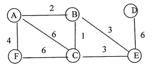

# DS-2014-35

## 1. 原题

应用 $Dijkstra$ 算法（单源最短路径）求下图顶点 $A$ 到 $D$ 的最短路径，第 $1$ 步、第 $2$ 步求出的是顶点 $A$ 到顶点____________________ ， $A$ 到顶点____________________ 的最短路径。

> 图 2 读图转录（无向带权连通图，$6$ 个顶点 $A,B,C,D,E,F$、$8$ 条边，图中无箭头，按网/无向图处理）：
> $(A,B)=2$、$(A,F)=4$、$(A,C)=6$、$(B,C)=1$、$(B,E)=3$、$(F,C)=6$、$(C,E)=3$、$(D,E)=6$。
> 顶点 $D$ 只与 $E$ 相连（度为 $1$）；顶点 $A$ 的邻点为 $B,F,C$；顶点 $E$ 的邻点为 $B,C,D$；顶点 $C$ 的邻点为 $A,B,F,E$。
> 原图为回忆版扫描件（$328\times132$ 像素），已放大逐处辨认；其中"权 $1$ 标在竖直边 $B\!-\!C$ 上、权 $3$ 标在斜边 $B\!-\!E$ 上"这一对应关系是本题结论的关键，已在放大图上按"标号到线段中点的距离"确认（详见第 12 节）。

## 2. 答案

第 $1$ 步求出 $A$ 到顶点 $\boxed{B}$ 的最短路径（长度 $2$）；第 $2$ 步求出 $A$ 到顶点 $\boxed{C}$ 的最短路径（长度 $3$，路径 $A\to B\to C$）。

约定：源点 $A$ 在算法初始化时即已定标（$S=\{A\}$、$D(A)=0$），"第 $k$ 步求出"指第 $k$ 轮从**未定标**集合中选出的那个顶点。完整定标顺序为 $B(2)\to C(3)\to F(4)\to E(5)\to D(11)$，最终 $A\to D$ 的最短路径为 $A\to B\to E\to D$，长度 $11$。

## 3. 题目分析

- 已知：$6$ 个顶点的无向带权连通图（权值均为正），源点 $A$，终点 $D$；
- 目标：按 Dijkstra 的**执行顺序**指出第 $1$、第 $2$ 轮被"求出"（定标、并入 $S$/`final`）的顶点；
- 关键约束：
  1. Dijkstra 每轮取 $V\setminus S$ 中 $D$ 值最小者入 $S$；因所有边权为正，一旦入 $S$ 其最短路径即被最终确定，之后不再改变；
  2. **第 1 轮**的候选只有源点的邻点（其余顶点 $D$ 值仍为 $+\infty$），故第 1 步必为"与 $A$ 直接相连且边权最小"的那个邻点 —— 本题即 $B(2)$，不必算完全图；
  3. **第 2 轮**的 $D$ 值已经过 $B$ 的松弛，可能来自"非直接边"：$D(C)=\min\{6,\;2+1\}=3$ 被改小，于是第 2 步入选的是 $C(3)$ 而不是"看起来更近"的 $F(4)$ —— 这正是本题的落点；
  4. 图上位置的远近、边的条数都不作数，只比 $D$ 值（权值和）；
- 命题意图：考"贪心定标顺序"与"松弛会改写后续入选者"两件事。只背"最先求出的是最小权邻点"做得对第 1 空；第 2 空必须真的动手松弛一次，否则会误填 $F$。

## 4. 核心考点

核心考点：
DS04.04.02 最短路径（Dijkstra 单源最短路径：$D$/$path$/`final` 三数组的逐轮更新与定标顺序）

辅助考点：
DS04.01 图的基本概念（带权无向图/网、邻接点、路径与路径长度）
DS04.02.01 邻接矩阵表示法（读图后写出各顶点邻接关系是松弛不重不漏的前提）

解释：题目问"第 1 步、第 2 步求出哪个顶点"，是对 Dijkstra 执行过程的逐步模拟（TRACE），需要算 $D$ 值（CALCULATION）；判断"是否真的最短"依赖路径长度的概念（DS04.01）；而每轮松弛要枚举 $u$ 的所有邻点，先把图读成邻接矩阵/邻接表是基本功（DS04.02.01）。

## 5. 解题思路

1. **读图列表**：把 $8$ 条边及权值抄成表，写出 $A$ 的邻点 $\{B(2),F(4),C(6)\}$；
2. **初始化**：$S=\{A\}$，$D(A)=0$、$D(B)=2$、$D(F)=4$、$D(C)=6$、$D(D)=D(E)=+\infty$；
3. **第 1 轮**：取 $\min\{2,4,6,\infty,\infty\}=2$ ⟹ 定标 $B$；由 $B$ 松弛：$D(C)=\min(6,2+1)=3$（改）、$D(E)=2+3=5$（新）；
4. **第 2 轮**：取 $\min\{3,4,5,\infty\}=3$ ⟹ 定标 $C$；由 $C$ 松弛：$D(F)=\min(4,3+6)=4$（不改）、$D(E)=\min(5,3+3)=5$（不改）；
5. **算完全表核对**：继续 $F(4)\to E(5)\to D(11)$，确认 $A\to D$ 长度 $11$，与前两轮的定标顺序自洽；
6. **换方法验证**：$D$ 只与 $E$ 相邻，故 $A\to D$ 的一切路径形如"$A\leadsto E$ 再走 $6$"，枚举 $A$ 到 $E$ 的几条路径取最小 $5$，得 $11$，与表格一致。

## 6. 详细解答

**步骤 1：邻接关系（由第 1 节转录整理）**

| 顶点 | 邻接点（边权） |
|---|---|
| $A$ | $B(2),\;F(4),\;C(6)$ |
| $B$ | $A(2),\;C(1),\;E(3)$ |
| $C$ | $A(6),\;B(1),\;F(6),\;E(3)$ |
| $D$ | $E(6)$ |
| $E$ | $B(3),\;C(3),\;D(6)$ |
| $F$ | $A(4),\;C(6)$ |

**步骤 2：逐轮执行 Dijkstra**（$S$ 为已定标集合，括号内为 $path$ 前驱，加粗✓为本轮定标）

| 轮次 | 本轮选定 $u$（$D$ 最小） | $D(A)$ | $D(B)$ | $D(C)$ | $D(D)$ | $D(E)$ | $D(F)$ |
|---|---|---|---|---|---|---|---|
| 初始 | $S=\{A\}$ | **0✓** | 2 (A) | 6 (A) | ∞ | ∞ | 4 (A) |
| 1 | **B (2)** | 0 | **2✓** | 3 (B) | ∞ | 5 (B) | 4 (A) |
| 2 | **C (3)** | 0 | 2 | **3✓** | ∞ | 5 (B) | 4 (A) |
| 3 | F (4) | 0 | 2 | 3 | ∞ | 5 (B) | **4✓** |
| 4 | E (5) | 0 | 2 | 3 | 11 (E) | **5✓** | 4 |
| 5 | D (11) | 0 | 2 | 3 | **11✓** | 5 | 4 |

各轮松弛明细：

- **第 1 轮**：$V\setminus S$ 中 $\min\{D(B)=2,\,D(F)=4,\,D(C)=6,\,\infty,\,\infty\}=2$ ⟹ 选 $B$；
  经 $B$ 松弛：$C$：$2+1=3<6$ ⟹ $D(C)=3,\;path(C)=B$；$E$：$2+3=5<\infty$ ⟹ $D(E)=5,\;path(E)=B$；$A$ 已定标跳过。
- **第 2 轮**：$\min\{D(C)=3,\,D(F)=4,\,D(E)=5,\,\infty\}=3$ ⟹ 选 $C$；
  经 $C$ 松弛：$F$：$3+6=9>4$ 不改；$E$：$3+3=6>5$ 不改；$A,B$ 已定标。⟹ 本轮无更新，但 $C$ 的最短路径 $A\to B\to C=3$ 被确定。
- 第 3 轮：选 $F(4)$；$F$ 的未定标邻点只有 $C$（已定标），无更新。
- 第 4 轮：选 $E(5)$；松弛 $D$：$5+6=11<\infty$ ⟹ $D(D)=11,\;path(D)=E$。
- 第 5 轮：选 $D(11)$，$S=V$，算法结束。

**定标顺序**：$B(2)\to C(3)\to F(4)\to E(5)\to D(11)$。故第 $1$ 步求出 $A\to B$，第 $2$ 步求出 $A\to C$。

**步骤 3：第 1 步的直接理由（不必算完全图）**

初始化后只有源点 $A$ 在 $S$ 中，$D$ 的非 $\infty$ 值仅来自 $A$ 的三条关联边：$2,4,6$。第 $1$ 轮取最小者 $2$ ⟹ $B$ 最先定标。未定标顶点的 $D$ 值在第 $1$ 轮之前不可能小于 $\min$ 源点邻边权 $=2$，故不存在更早者。

**步骤 4：第 2 步的理由（关键在松弛）**

第 $1$ 轮结束后未定标者 $D$ 值为 $C=3$、$F=4$、$E=5$、$D=\infty$。$C$ 之所以从 $6$ 降到 $3$，是因为 $A\to B\to C$ 用了全图最小的边 $(B,C)=1$。若漏掉这一步松弛，就会按初始值取 $F(4)$ 而答错第 $2$ 空。$3<4$ 且 $3<5$，唯一最小 ⟹ 第 $2$ 步为 $C$。

**步骤 5：枚举 $A\to D$ 的全部简单路径复核最终结果**

$D$ 只与 $E$ 相连，故所有 $A\to D$ 路径都以 $\cdots\to E\to D$（最后一段权 $6$）结尾：

| 路径 | 长度 |
|---|---|
| $A\to B\to E\to D$ | $2+3+6=11$ |
| $A\to B\to C\to E\to D$ | $2+1+3+6=12$ |
| $A\to C\to E\to D$ | $6+3+6=15$ |
| $A\to F\to C\to E\to D$ | $4+6+3+6=19$ |
| $A\to C\to B\to E\to D$ | $6+1+3+6=16$ |
| $A\to F\to C\to B\to E\to D$ | $4+6+1+3+6=20$ |

最小为 $11$，与表格中 $D(D)=11$、$path$ 回溯 $D\Leftarrow E\Leftarrow B\Leftarrow A$ 完全一致 ✓（同时可见 $A\to C$ 最短为 $3$、$A\to B$ 最短为 $2$，前两空的路径长度也与表格吻合）。

**答案**：第 $1$ 步顶点 $B$，第 $2$ 步顶点 $C$。

## 7. 选项分析

不适用（填空题）。

## 8. 考场标准答案

初始 $S=\{A\}$，$D(B)=2$、$D(F)=4$、$D(C)=6$、$D(D)=D(E)=+\infty$。

第 $1$ 轮：$\min=2$ ⟹ 定标 $\boxed{B}$；松弛得 $D(C)=2+1=3$、$D(E)=2+3=5$。

第 $2$ 轮：$\min\{3,4,5,\infty\}=3$ ⟹ 定标 $\boxed{C}$（经 $C$ 松弛 $F,E$ 均不改）。

（后续 $F(4)\to E(5)\to D(11)$，$A\to D$ 最短路径 $A\to B\to E\to D$，长度 $11$。）

## 9. 易错点

1. **第 2 空误填 $F$**：只看初始值 $D(F)=4<D(C)=6$ 就下结论，忘了第 $1$ 轮定标 $B$ 后要用 $B$ 的边松弛，$D(C)$ 已被改成 $3$。这是本题最主要的失分点；
2. **"第 1 步"的计数约定**：本解析按教材实现（源点在初始化时入 $S$，$D(A)=0$）把第 $1$ 轮选出的 $B$ 作为"第 $1$ 步求出"。若采用"第 $1$ 步 $=$ 选定源点 $A$"的口径，两空会整体后移为 $A$、$B$；但题面写作"$A$ 到顶点__、$A$ 到顶点__的最短路径"，源点到自身长度为 $0$ 无须"求"，且两空并列，故取 $B$、$C$ 为当题意（作答时把这一句约定写出来最稳妥）；
3. **把"图上位置近"当"距离短"**：$F$ 在图上紧挨 $A$ 下方，$C$ 在中间，视觉上"$A$ 到 $F$ 更近"，但 Dijkstra 只比权值和；
4. **误以为边 $(B,C)=1$ 是全图最小边就该最先求出 $C$**：最小边不等于最小 $D$ 值——第 $1$ 轮 $C$ 的 $D$ 值还是 $6$（须经 $B$ 才降到 $3$），而定标只看当前 $D$ 值；
5. **无向边只做单向松弛**：如忘记 $C\to E$、$E\to C$ 两个方向都要检查（本题第 $2$ 轮 $3+3=6>5$ 不改，但流程上必须查）；
6. **$D$ 的初值处理**：$D$ 不与 $A$ 相邻，初值必须是 $+\infty$ 而不是"随便一个数"，否则第 $1$ 轮可能误选 $D$；
7. **与 BFS/Prim 的判据混用**：按广度优先的"边数"分层，$B,F,C$ 同在第 $1$ 层（$A$ 的邻点），根本谈不到"谁先被求出"，故不可用 BFS 答本题；Prim 求最小生成树时从 $A$ 出发的选边顺序是 $(A,B)=2\to(B,C)=1\to(B,E)=3$，前两步恰好也带来点 $B$、$C$，但第 $3$ 步 Prim 收 $E$（边权 $3$）而 Dijkstra 第 $3$ 轮定标的是 $F$（$D$ 值 $4$）——两算法从第 $3$ 步起分叉，判据（"集合到外部的最小边" vs "源点到外部点的最小距离"）不可互相套用。

## 10. 一句话规律

Dijkstra 的"第 $k$ 步求出哪个顶点"就一句话：**每轮只比 $D$ 值、取最小者入 $S$，入 $S$ 前必须先用上一轮新定标的点把所有邻边松弛一遍**；第 $1$ 个入选者永远是"源点的最小权邻点"，第 $2$ 个则要看第一轮松弛有没有把某个次近点的 $D$ 值改得更小。

## 11. 关联知识

- DS-2013-33（2013 年第 33 题：以 $v_6$ 为源点问"最先求出哪个顶点"）：完全同型，只用到了"首轮 $D$ 值只来自源点邻边"这一半；本题多出"第 $2$ 轮要看松弛结果"的一半，难度略高，两题对照可看清定标顺序的前两轮由不同依据决定；
- DS-2026-19（以 $V_1$ 为源点的 Dijkstra 表格题）：要求列出完整表格，其"每轮一选二松弛三入 $S$"的表格格式可直接套用于本题第 6 节；
- 本年度第 42 题（同一卷的问答题：$6$ 顶点图的邻接矩阵 $+$ 从 $A$ 出发的广度优先遍历）：BFS 按**边数**分层、Dijkstra 按**权值和**定序，在无权图（所有边权为 $1$）上两者退化一致，在带权图上则可能给出完全不同的顺序——本题 $C$ 在 BFS 中是第 $1$ 层（$A$ 的邻点），在 Dijkstra 中却第 $2$ 轮才定标，正是这一差别的实例；
- 本年度第 43 题（Kruskal 算法求最小生成树，图为 fig5，与本题 fig2 是两张不同的图）：与 Dijkstra 同属"逐步扩集合"的贪心算法，但 Kruskal 全局按**边权**排序选边、Prim 按"生成树到外部的最小边"，都不等于"源点到该点的最小距离"；如第 9 节第 7 条所示，本题若换成 Prim，前两步的点序相同而第三步起分叉，判据不可混用；
- DS04.01 带权图/网的定义与"路径长度 $=$ 各边权之和"：本题步骤 5 的路径枚举复核正是这一定义的直用；
- Dijkstra 要求边权非负：本图权值全为正（$1\sim6$），"定标即最终"成立；若出现负权边，第 $2$ 轮之后仍可能被更短路径改写，本题的解法即不再适用（教材另无 Bellman-Ford，考研范围内只需知道该前提）。

## 12. 来源与可信度

- 原题来源：2014 回忆版题面篇 `真题/2014/2014重庆邮电大学802数据结构真题.md` 二、填空题第 35 题；题面文字无订正说明；**含图 2**（`真题/2014/imgs/fig2.png`，$328\times132$ 像素），本解析已把读到的 $6$ 个顶点、$8$ 条边及其权值全部列于第 1 节备核；
- 读图不确定性的声明：原图较小，两处需要辨认——① 标在竖直边 $B\!-\!C$ 右侧的"1"与标在斜边 $B\!-\!E$ 上方的"3"的归属（已按"标号到所标线段中点的距离"逐处比对：$1$ 距 $B\!-\!C$ 线段约 $80$ 像素、距 $B\!-\!E$ 约 $240$ 像素，且其纵向位置恰在 $B\!-\!C$ 中点，故判为 $(B,C)=1$）；② 标在 $C\!-\!E$ 上方的"3"与 $B\!-\!E$ 上方的"3"（两条边的读值同为 $3$，该处即使互换归属也不影响任何结论）。`ocr_confidence` 因此记为 medium；
- 答案来源：独立推导（完整 $5$ 轮 Dijkstra 表格 $+$ 首轮"源点最小权邻点"性质 $+$ 第 $2$ 轮松弛逐项核对 $+$ $A\to D$ 全部 $6$ 条简单路径枚举复核 $D(D)=11$）；未实际抓取解析篇网页，仅按要求登记其地址备查；
- 稳健性检查：本题两个空只依赖 $D(B)=2$ 与 $D(C)=2+1=3$ 两条边的读值（$(A,B)$、$(B,C)$）以及 $D(F)=4$、$D(C)$ 的初始值 $6$；即使 $(C,E)$、$(B,E)$、$(F,C)$、$(D,E)$ 四条边的读值有误，也不改变"$B$、$C$"这一答案，受读图影响的只是第 $3\sim5$ 轮与 $A\to D$ 的长度 $11$；
- 教材依据：严蔚敏、吴伟民《数据结构（C 语言版）》第 7 章 图（7.5.3 最短路径：Dijkstra 算法，$D$、$path$、$final$ 三数组的逐轮表格演算）；
- 多来源冲突：无；争议：无（"$1$ 属 $B\!-\!C$"已按读图规则判定并在第 1、12 节声明；"第 $1$ 步"的计数约定已在第 2、9 节声明，采当卷面语境的 $B$、$C$）；
- 最终可信度：答案（$B$、$C$）high；第 6 节表格中第 $3\sim5$ 轮数值与 $A\to D=11$ 为 medium（依赖其余四条边的读值）。
