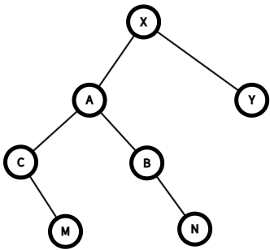

# DS-2014-39

## 1. 原题

设下图为某树的二叉树表示，请画出该树。

> 订正说明转录：图中根结点带有右子树，与"某树的二叉树表示"矛盾（树的二叉树表示中根结点无右兄弟，右指针应为空），该结构实际对应一棵森林；疑图中右子树应挂在某结点的右孩子链上，无法核实原图，保留题面与图，请按森林含义自行判断。



## 2. 答案

**按"森林"口径作答**（题面"某树"与图不符，依订正说明取森林含义）。

图 3 的二叉树结构（左/右孩子）为：$X\!→\!(A,Y)$、$A\!→\!(C,B)$、$C\!→\!(\text{无},M)$、$B\!→\!(\text{无},N)$，$M,N,Y$ 为叶，共 $7$ 个结点。

按"**左链 = 第一个孩子，右链 = 下一个兄弟**"翻译，还原出由 **2 棵树**组成的森林：

| 树 | 根 | 结构 | 结点数 |
|---|---|---|---|
| $T_1$ | $X$ | $X$ 有 $3$ 个孩子 $A,B,N$；$A$ 有 $2$ 个孩子 $C,M$；$B,C,M,N$ 均为叶 | $6$ |
| $T_2$ | $Y$ | 只有根 $Y$（单结点树） | $1$ |

```
    森林 F = { T1, T2 }

        T1:            X                    T2:   Y
                     / | \
                    A  B  N
                   / \
                  C   M

    （X 的孩子从左到右为 A、B、N；A 的孩子从左到右为 C、M）
```

合计 $6+1=7$ 个结点 ✓。

## 3. 题目分析

- 已知：一棵以"左孩子—右兄弟"（LCS，孩子兄弟表示法）形式存储的二叉树（图 3），$7$ 个结点 $X,A,B,C,M,N,Y$；
- 目标：逆向翻译，画出原来的树（或森林）；
- 关键约束：① LCS 的语义是**双射**——每个结点的左孩子是唯一确定的"长子"，右链是"兄弟链"，因此还原结果在同层孩子有序的意义下唯一；② **二叉树的根若有右孩子，则该右孩子是它的兄弟**，在树/森林的意义下就是"另一棵树的根"——这正是本题题面说"某树"而图画成带右子树的矛盾来源；③ 判定"是树还是森林"的**唯一依据**就是根结点右链的长度：右链只有根自己 ⟹ 一棵树；右链更长 ⟹ 森林；
- 命题意图：考"树/森林 ⟷ 二叉树"转换的**逆向使用**（与本知识库 DS-2013-39 同型），并检验考生是否注意到"根有右孩子 ⟹ 不可能是单棵树"这一结构性事实——这正是订正说明所指的矛盾点。

## 4. 核心考点

核心考点：
DS03.03.02 森林与二叉树的转换（正向"树的孩子作左链、兄弟作右链，各树根依次串成右链"；本题为逆变换，且需由"根的右链"判定森林中树的棵数）

辅助考点：
DS03.03.01 树的存储结构——孩子兄弟表示法（`firstchild`、`nextsibling` 两指针域，是"左链孩子、右链兄弟"语义的实现载体）；DS03.03.03 树和森林的遍历（森林先根遍历 $=$ 二叉树先序、森林后根遍历 $=$ 二叉树中序，本题用它作还原后的双重验证，见第 6.4 节）

解释：解题动作是"按 LCS 字典逐链翻译"（DS03.03.02），翻译时区分"左孩子"与"右链兄弟"靠的是孩子兄弟表示法的定义（DS03.03.01），验证正确性用的是遍历序列对应关系（DS03.03.03）。

## 5. 解题思路

1. **先把图读成二叉树的父子关系表**（谁是谁的左孩子、谁是谁的右孩子），不要提前带入"树"的含义——这是避免"把右孩子当第二个孩子"这一典型错误的前提；
2. **数树的棵数**：从二叉树根 $X$ 出发沿右链一直走：$X \xrightarrow{右} Y \xrightarrow{右} $ 无。右链上有 $X,Y$ 两个结点 ⟹ 森林含 **2 棵树**，根依次是 $X$、$Y$（若题面"某树"成立，此处必须只有 $1$ 个结点，即根无右孩子——这就是矛盾所在）；
3. **逐结点翻译**：对每个结点 $v$，$v$ 的左孩子是 $v$ 的长子，再沿长子的右链把 $v$ 的所有孩子取全；
4. 画出森林，做**结点数自检**：森林总结点数必须等于二叉树总结点数 $7$；
5. 做**正向还原验证**（第 6.3 节）：把画出的森林重新转成二叉树，逐结点核对左、右孩子是否与图 3 完全一致；
6. 做**遍历序列验证**（第 6.4 节）：算出二叉树的先序与中序，再算森林的先根与后根遍历，两组序列应分别相等——这是不依赖画图直觉的独立证据。

## 6. 详细解答

### 6.1 图 3 的二叉树结构（放大核对后抄录）

| 二叉树结点 | 左孩子 | 右孩子 |
|---|---|---|
| $X$（根） | $A$ | $Y$ |
| $A$ | $C$ | $B$ |
| $C$ | 无 | $M$ |
| $B$ | 无 | $N$ |
| $M$ | 无 | 无 |
| $N$ | 无 | 无 |
| $Y$ | 无 | 无 |

形态：

```
              X
            /   \
          A       Y
        /   \
      C       B
        \       \
         M        N
```

$7$ 个结点、$6$ 条边（父子链），与图 3 一致 ✓。

### 6.2 按"左孩子—右兄弟"逆向翻译

**第一步（定棵数）**：根 $X$ 的右孩子是 $Y$ ⟹ $Y$ 是 $X$ 的兄弟 ⟹ 在森林意义下 $Y$ 是**下一棵树的根**；$Y$ 无右孩子 ⟹ 后面没有第三棵树。故森林 $F=\{T_1,T_2\}$，$T_1$ 根为 $X$，$T_2$ 根为 $Y$。

**第二步（展开 $T_1$ 的孩子）**：

- $X$ 的左孩子是 $A$ ⟹ $A$ 是 $X$ 的**第一个孩子**；沿 $A$ 的右链：$A \xrightarrow{右} B \xrightarrow{右} N$，$N$ 无右孩子 ⟹ $X$ 的孩子依次为 $A,\,B,\,N$（$3$ 个）；
- $A$ 的左孩子是 $C$ ⟹ $C$ 是 $A$ 的长子；沿 $C$ 的右链：$C \xrightarrow{右} M$，$M$ 无右孩子 ⟹ $A$ 的孩子为 $C,\,M$（$2$ 个）；
- $C$ 无左孩子 ⟹ $C$ 是叶；$M$ 无左孩子 ⟹ $M$ 是叶；
- $B$ 无左孩子 ⟹ $B$ 是叶（注意：$B$ 的右孩子 $N$ 已被判定为 $B$ 的兄弟、同为 $X$ 的孩子，不是 $B$ 的孩子）；
- $N$ 无左孩子 ⟹ $N$ 是叶。

**第三步（展开 $T_2$）**：$Y$ 无左孩子 ⟹ $Y$ 没有孩子，$T_2$ 是单结点树。

**森林**：$T_1$ 含 $\{X,A,B,C,M,N\}$（$6$ 个结点，$X$ 的度为 $3$、$A$ 的度为 $2$、树高 $3$），$T_2$ 含 $\{Y\}$；$6+1=7$ ✓。

```
        T1:            X                    T2:   Y
                     / | \
                    A  B  N
                   / \
                  C   M
```

### 6.3 正向还原验证（森林 → 二叉树）

按"第一个孩子挂左链、亲兄弟挂右链、树与树的根互为右链"重新生成二叉树，与图 3 逐结点比对：

| 结点 | 森林中的孩子（左→右） | 应得左孩子 | 应得右孩子 | 图 3 实际 | 判定 |
|---|---|---|---|---|---|
| $X$ | $A,B,N$ | $A$（长子） | $Y$（下一棵树的根） | $A,\,Y$ | ✓ |
| $A$ | $C,M$ | $C$ | $B$（$A$ 的弟） | $C,\,B$ | ✓ |
| $B$ | 无 | 无 | $N$（$B$ 的弟） | 无, $N$ | ✓ |
| $C$ | 无 | 无 | $M$（$C$ 的弟） | 无, $M$ | ✓ |
| $M$ | 无 | 无 | 无（$M$ 是 $A$ 的最小孩子） | 无, 无 | ✓ |
| $N$ | 无 | 无 | 无（$N$ 是 $X$ 的最小孩子） | 无, 无 | ✓ |
| $Y$ | 无 | 无 | 无（$T_2$ 是最后一棵树） | 无, 无 | ✓ |

七行全部吻合 ⟹ 还原正确（LCS 转换是双射，满足此表的答案唯一）。

### 6.4 遍历序列的第二重验证

对图 3 的二叉树直接遍历：

- 先序（根左右）：$X,\ A,\ C,\ M,\ B,\ N,\ Y$；
- 中序（左根右）：$C,\ M,\ A,\ B,\ N,\ X,\ Y$。

对还原出的森林按定义遍历：

- **先根遍历**：访问 $X$ → 依次先根遍历 $X$ 的孩子子树 $A,B,N$ → $A$ 的子树给出 $A,C,M$，$B$ 给出 $B$，$N$ 给出 $N$ → 再先根遍历第二棵树 $Y$：得 $X,\ A,\ C,\ M,\ B,\ N,\ Y$；
- **后根遍历**：先依次后根遍历 $X$ 的孩子 $A,B,N$（$A$ 的子树后根为 $C,M,A$）→ 得 $C,M,A,B,N$ → 访问根 $X$ → 再后根遍历 $T_2$ 得 $Y$：得 $C,\ M,\ A,\ B,\ N,\ X,\ Y$。

两组的先序/先根、中序/后根**分别完全相同** ✓，与 DS03.03.03 的对应定理一致，进一步确认森林画法正确。

### 6.5 若强行按"单棵树"口径的另一种读法（备查）

题面的"某树"若要成立，二叉树的根 $X$ 必须无右孩子，即图中 $X\!-\!Y$ 这条链不该存在（或 $Y$ 应挂在别处的右链上）。订正说明已声明"疑图中右子树应挂在某结点的右孩子链上，无法核实原图"。在没有原图可核对的前提下，有两种可能的"补锅"读法：

1. **森林读法（本解析采用）**：完全保留图 3 的 $7$ 个结点与 $6$ 条链，仅把"树"改读为"森林"——不需要改动任何一条边，信息损失最小，且订正说明明确指出"该结构实际对应一棵森林"；
2. **单棵树读法**：把 $X$ 的右孩子 $Y$ 也当作 $X$ 的孩子（即采用"左孩子—右兄弟"之外的、把根的右链也并入孩子序列的非标准约定），得到一棵树：$X$ 的孩子为 $A,B,N,Y$，$A$ 的孩子为 $C,M$。此读法与教材的转换规则不符（$X$ 的右孩子只能是兄弟），且无法通过第 6.4 节的遍历对应检验（此时二叉树先序 $X,A,C,M,B,N,Y$ 与"先根遍历 $X,A,C,M,B,N,Y$"虽巧合相同，但中序 $C,M,A,B,N,X,Y$ 与后根 $C,M,A,B,N,Y,X$ 不同），故**不采用**。

## 7. 选项分析

不适用（问答题/作图题）。

## 8. 考场标准答案

图 3 是孩子—兄弟（左孩子—右兄弟）表示的二叉树。因根 $X$ 有右孩子 $Y$，该结构表示的是**森林**（题面"某树"与图矛盾，依订正说明按森林作答）：

1. 沿根的右链 $X\to Y$ 得森林含 $2$ 棵树，根分别为 $X$、$Y$；
2. $X$ 的左孩子 $A$ 是长子，沿右链 $A\to B\to N$ 得 $X$ 的孩子为 $A,B,N$；
3. $A$ 的左孩子 $C$ 是长子，沿右链 $C\to M$ 得 $A$ 的孩子为 $C,M$；
4. $B,C,M,N$ 无左孩子，均为叶；$Y$ 无左孩子，为单结点树。

```
    F = { T1, T2 }
        T1:      X                 T2:  Y
               / | \
              A  B  N
             / \
            C   M
```

即 $T_1$ 的根 $X$ 有 $3$ 个孩子 $A,B,N$，$A$ 有 $2$ 个孩子 $C,M$；$T_2$ 只有根 $Y$。共 $6+1=7$ 个结点。

## 9. 易错点

1. **把二叉树的右孩子当成树中的孩子**：这样会把 $Y$ 画成 $X$ 的孩子、把 $B$ 画成 $A$ 的孩子、把 $N$ 画成 $B$ 的孩子，得到一棵 $7$ 结点的"单树"——右链是**兄弟链**，根的右链更是"树与树的并列关系"，这是本题矛盾的根源；
2. **漏判森林棵数**：只沿左链展开、忘了从 $X$ 的右孩子 $Y$ 分裂出第二棵树，答案就少一棵树（结点数也会少 $1$，可用"总结点数必须等于 $7$"自查）；
3. 把 $M$ 当成 $C$ 的孩子：$M$ 是 $C$ 的**右**孩子 ⟹ $M$ 是 $C$ 的兄弟，同为 $A$ 的孩子；同理 $N$ 是 $B$ 的兄弟、$X$ 的孩子，不是 $B$ 的孩子；
4. 孩子次序写反：孩子兄弟表示法隐含"孩子从左到右有序"，$X$ 的孩子次序是 $A,B,N$，$A$ 的孩子次序是 $C,M$，写成 $N,B,A$ 或 $M,C$ 会转回不同的二叉树；
5. **只画不验**：本题最省事的自检是第 6.3 节的"正向还原逐结点比对左、右孩子"，或第 6.4 节的"先根遍历 = 二叉树先序、后根遍历 = 二叉树中序"，两者都能在 $1$ 分钟内完成；
6. 忽略题面矛盾硬按"树"作答而不作任何声明：本题图与文字冲突（订正说明已指明），答题时应写明"按森林含义作答"的理由，否则会被判"未注意根不可有右兄弟"。

## 10. 一句话规律

"二叉树 ⟶ 树/森林"的逆转换只有三句话：**左链往下当孩子、右链往右当兄弟、根的右链把森林切成一棵棵树**；而"根有右孩子"就是判定"这不可能是单棵树、只能是森林"的结构性证据。

## 11. 关联知识

- DS-2013-39（同型题：$8$ 结点的森林其孩子—兄弟存储结构恰为完全二叉树，要求还原森林）：与本题同为 DS03.03.02 的逆变换，那题靠"完全二叉树编号唯一定形"，本题靠"直接读图"，两题的验证方法（正向还原 + 结点数自检）完全通用；
- DS-2024-12（已知树有 $2011$ 个结点、$116$ 个叶结点，求对应二叉树中右子树为空的结点数 $1896$）：其"二叉树中右链 $=$ 兄弟关系"的结论可直接用于本题——二叉树中"右子树为空"即"树中该结点是最小的孩子"；
- 本卷 DS-2014-10（高度为 $h$、只有度 $0$ 与度 $2$ 结点的二叉树至少 $2h-1$ 个结点）与 DS-2014-11（$10$ 结点完全二叉树的度 $1$ 结点数）：同属 DS03 章的"结构计数"基本功，可与本题的结构翻译对照复习；
- DS03.03.03 的对应定理（森林先根遍历 $=$ 二叉树先序、森林后根遍历 $=$ 二叉树中序）在本题第 6.4 节被用作独立验证，与 DS-2013-30、DS-2013-35 等"树的结点计数/哈夫曼结点数"题共同构成第 6 章的主干；
- 教材还给出"树的双亲表示法、孩子表示法"（DS03.03.01）：只有孩子兄弟表示法能用统一的二叉树存储森林，这正是本题能"用一棵二叉树表示一个森林"的前提。

## 12. 来源与可信度

- 原题来源：2014 回忆版题面篇 `真题/2014/2014重庆邮电大学802数据结构真题.md` 三、问答题第 39 题，含订正说明（已完整转录于第 1 节）；配图 `真题/2014/imgs/fig3.png` 已放大 $4$ 倍核对：$7$ 个结点 $X,A,B,C,M,N,Y$ 与 $6$ 条父子链清晰可辨，各链的左/右归属由结点水平位置确定（$M$ 在 $C$ 的右下方、$N$ 在 $B$ 的右下方，故为右孩子；$C,B$ 分别在 $A$ 的左下、右下，$A,Y$ 分别在 $X$ 的左下、右下），读图本身无歧义；
- 答案来源：独立推导——按左孩子—右兄弟语义逐链翻译（第 6.2 节），再用两种方式验证：① 正向还原逐结点核对 $7$ 个结点的左、右孩子与图 3 完全一致（第 6.3 节）；② 二叉树先序 $XACMBNY$ 与森林先根遍历相同、二叉树中序 $CMABNXY$ 与森林后根遍历相同（第 6.4 节）；
- 教材依据：严蔚敏、吴伟民《数据结构（C 语言版）》第 6 章 6.3 树的存储结构（孩子兄弟表示法 `firstchild`/`nextsibling`）、6.4 森林与二叉树的转换（"二叉树的左孩子相当于树的第一个孩子，右孩子相当于下一个兄弟"；森林中各棵树的根互为兄弟）、6.5 树和森林的遍历（先根/后根遍历与二叉树先序/中序的对应）；
- 多来源冲突：无外部来源可裁决；**争议：题面文字"某树"与图 3"根结点带右子树"结构性矛盾**（单棵树的二叉树表示中根结点右指针必为空），已按订正说明的指引取"森林"口径作答，并在第 6.5 节列出"单棵树"读法及其不成立理由；该题已登记 `reports/disputed_questions.md`（DS-2014-39，uncertain），本解析不修改该文件；
- 最终可信度：`solution_status: uncertain`、`answer.confidence: medium`——在"按森林作答"这一口径下，还原结果经双重验证唯一确定（可信度 high）；不确定的只是"原卷本意是否为森林、原图是否存在转录失真"，故整体定为 medium。
