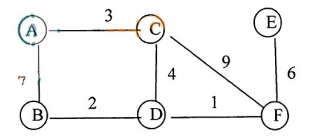

# DS-2014-43

## 1. 原题

使用 $Kruskal$ 算法求所给图（下图，同 $42$ 题图）的最小生成树，必须给出树的生成过程。



## 2. 答案

$|V|=6$、$|E|=7$，边集与权值：$(D,F)=1,\ (B,D)=2,\ (A,C)=3,\ (C,D)=4,\ (E,F)=6,\ (A,B)=7,\ (C,F)=9$。

$Kruskal$ 按权值升序选边的过程：

| 序 | 边（权） | 判定 | 结果 |
|---|---|---|---|
| 1 | $DF\ (1)$ | $D,F$ 分属不同分量 | **取** |
| 2 | $BD\ (2)$ | $B$ 与 $\{D,F\}$ 不同分量 | **取** |
| 3 | $AC\ (3)$ | $A,C$ 各自独立 | **取** |
| 4 | $CD\ (4)$ | 连接 $\{A,C\}$ 与 $\{B,D,F\}$ | **取** |
| 5 | $EF\ (6)$ | $E$ 独立，$F$ 在大分量中 | **取**（已达 $5$ 条边，结束） |
| 6 | $AB\ (7)$ | $A,B$ 已在同一分量 | 舍（成环） |
| 7 | $CF\ (9)$ | $C,F$ 已在同一分量 | 舍（成环） |

**最小生成树边集** $\{(D,F),(B,D),(A,C),(C,D),(E,F)\}$，$5=|V|-1$ 条边，**总权值 $W=1+2+3+4+6=16$**。

```
        A
        |  3
        C
        |  4
   2    |     1      6
  B ----D ----- F ---- E
```

## 3. 题目分析

- 已知：带权无向连通图（与第 42 题同一张图，题面已注明"同 42 题图"），$6$ 个顶点、$7$ 条边，权值 $1,2,3,4,6,7,9$ **互不相同**；
- 目标：用 $Kruskal$（加边法）求最小生成树，并**完整写出选边过程**（题面"必须给出树的生成过程"意味着不能只给最后的边集与权值和）；
- 关键约束：① $Kruskal$ 的规则是"把边按权值升序排序，依次考察，若该边两端点属于两个不同的连通分量则取入（合并分量），否则舍去（会成环）"；② 算法与起点无关（这是它与 $Prim$ 的根本区别）；③ 生成树恰有 $|V|-1=5$ 条边，取满 $5$ 条即可停止；④ 每一步都要说明"两端点当前各属于哪个连通分量"，这才是"生成过程"；
- 命题意图：考 $Kruskal$ 的机械执行与"不成环 ⟺ 两端点分属不同连通分量"这一判据；同时用"权值互异"隐含"最小生成树唯一"，使答案可被 $Prim$ 独立复算校验（本知识库 DS-2013-40 正是反向操作：$Prim$ 主解、$Kruskal$ 验证）。

## 4. 核心考点

核心考点：
DS04.04.01 最小（代价）生成树——$Kruskal$ 算法（全局按权升序加边、以"是否构成回路"决定取舍；生成树有 $n-1$ 条边；总代价）

辅助考点：
DS04.01 图的基本概念（连通分量/生成树的定义：$n$ 个顶点的生成树恰有 $n-1$ 条边且连通无环；本题 $|E|=7$ 比连通下界 $5$ 多 $2$，故必舍去 $2$ 条边）；DS04.02.01 邻接矩阵法（把图抄成边表/矩阵是排序与判环的前提，与第 42 题共用同一份边表）

解释：$Kruskal$ 的核心动作是"排序 + 判环"，判环靠的就是"连通分量"概念（DS04.01），实现上用并查集记录每个顶点所属分量；本题主考点是 DS04.04.01 的 $Kruskal$ 过程，$Prim$ 只作为第 6.4 节的交叉验证手段出现。

## 5. 解题思路

1. **抄边表并按权值升序排序**（$7$ 条边全排出来），排序是 $Kruskal$ 的第一步，必须显式写出；
2. **初始化**：每个顶点自成一个连通分量，$\{A\},\{B\},\{C\},\{D\},\{E\},\{F\}$，已选边数 $0$；
3. **逐边三问**：① 该边两端点现在各在哪个分量？② 若不同分量则取入并把两个分量合并（否则舍去并注明"成环"）；③ 取入后已选边数是否达到 $|V|-1=5$？达到即结束，剩余边可一并标注"舍（已连通）"；
4. 把三问的答案写成表格（第 6.2 节），这就是题面要求的"生成过程"；
5. **交叉验证**：用 $Prim$ 从 $A$ 出发独立求一次（第 6.4 节），两条算法路径必须得到同一边集与同一总权值；再用"图中最小的 $5$ 条边恰不构成环 ⟹ 权值和不可能更小"作下界验证；
6. 检查输出：$5$ 条边、连通 $6$ 个顶点、无环、总权值 $16$。

## 6. 详细解答

### 6.1 读图与边表排序

由图 5（= 图 4）抄出全部 $7$ 条边，按权值升序：

| 次序 | 1 | 2 | 3 | 4 | 5 | 6 | 7 |
|---|---|---|---|---|---|---|---|
| 边 | $DF$ | $BD$ | $AC$ | $CD$ | $EF$ | $AB$ | $CF$ |
| 权值 | $1$ | $2$ | $3$ | $4$ | $6$ | $7$ | $9$ |

核对：$\sum d(v)=2|E|=14$（$d(A)=2,d(B)=2,d(C)=3,d(D)=3,d(E)=1,d(F)=3$）✓，与第 42 题的边表完全一致。

### 6.2 Kruskal 逐步过程（$T$ = 已选边集，分量 = 当前连通块）

| 步 | 考察边（权） | 两端点所属分量 | 是否成环 | 动作 | 合并后的分量集合 | $|T|$ |
|---|---|---|---|---|---|---|
| 初 | — | — | — | 初始化 | $\{A\}\{B\}\{C\}\{D\}\{E\}\{F\}$ | $0$ |
| 1 | $DF\ (1)$ | $D$、$F$ 各自单点 | 否 | 取 $DF$ | $\{A\}\{B\}\{C\}\{D,F\}\{E\}$ | $1$ |
| 2 | $BD\ (2)$ | $B$、$\{D,F\}$ | 否 | 取 $BD$ | $\{A\}\{C\}\{B,D,F\}\{E\}$ | $2$ |
| 3 | $AC\ (3)$ | $A$、$C$ 各自单点 | 否 | 取 $AC$ | $\{A,C\}\{B,D,F\}\{E\}$ | $3$ |
| 4 | $CD\ (4)$ | $\{A,C\}$、$\{B,D,F\}$ | 否 | 取 $CD$（两分量合并） | $\{A,B,C,D,F\}\{E\}$ | $4$ |
| 5 | $EF\ (6)$ | $\{A,B,C,D,F\}$、$\{E\}$ | 否 | 取 $EF$ | $\{A,B,C,D,E,F\}$ | $5=|V|-1$ ⟹ 结束 |
| — | $AB\ (7)$ | $A,B$ 同属一个大分量 | 是（$A\!-\!C\!-\!D\!-\!B\!-\!A$） | 舍 | — | — |
| — | $CF\ (9)$ | $C,F$ 同属一个大分量 | 是（$C\!-\!D\!-\!F\!-\!C$） | 舍 | — | — |

第 6、7 两条边即使不考察也已被"取满 $5$ 条"终止，列出是为了说明"为什么它们不在生成树中"——这正是题面要求的"生成过程"的一部分。

### 6.3 结果

$$T=\{(D,F),(B,D),(A,C),(C,D),(E,F)\},\qquad W(T)=1+2+3+4+6=16$$

树的形态（$6$ 个顶点、$5$ 条边，从 $A$ 出发可达所有顶点，无环）：

```
        A
        |   (A,C)=3
        C
        |   (C,D)=4
   2    |     1       6
  B ----D ----- F ---- E
```

### 6.4 交叉验证一：用 Prim 算法独立求解

从 $A$ 出发（$U$ = 已并入生成树的顶点集），每步取跨 $(U,\,V-U)$ 的最小权边：

| 步 | $U$ | 候选边（一端在 $U$ 内、一端在 $U$ 外） | 选中最小 |
|---|---|---|---|
| 1 | $\{A\}$ | $AC\,3$、$AB\,7$ | $AC\ (3)$ |
| 2 | $\{A,C\}$ | $AB\,7$、$CD\,4$、$CF\,9$ | $CD\ (4)$ |
| 3 | $\{A,C,D\}$ | $AB\,7$、$BD\,2$、$DF\,1$、$CF\,9$ | $DF\ (1)$ |
| 4 | $\{A,C,D,F\}$ | $AB\,7$、$BD\,2$、$EF\,6$、$CF\,9$（$CF$ 两端已在 $U$，剔除） | $EF\ (6)$ |
| 5 | $\{A,C,D,F,E\}$ | $AB\,7$、$BD\,2$ | $BD\ (2)$ |

$Prim$ 边集 $\{AC,CD,DF,EF,BD\}$ 与 $Kruskal$ 结果**完全相同**，$W=3+4+1+6+2=16$ ✓（两条独立算法路径互证）。

### 6.5 交叉验证二：下界与唯一性

- **下界**：$6$ 个顶点的生成树必须用 $5$ 条边，而图中权值最小的 $5$ 条边之和为 $1+2+3+4+6=16$；这 $5$ 条边恰好不构成回路（第 6.2 节已验证），因此它们就是一棵最小生成树——不可能存在权值和小于 $16$ 的生成树；
- **唯一性**：图中 $7$ 条边的权值 $1,2,3,4,6,7,9$ **两两互异**，由 $MST$ 唯一性定理（所有权值互异 ⟹ 最小生成树唯一）知边集唯一，故 $16$ 与第 6.3 节的树形是唯一正确答案，不存在"另一组权值和也是 $16$ 但边集不同"的解；
- **被舍去的两条边**：$AB(7)$ 与 $CF(9)$ 恰是权值最大的两条，且分别落在回路 $A\!-\!C\!-\!D\!-\!B\!-\!A$ 与三角形 $C\!-\!D\!-\!F\!-\!C$ 上，作为各回路的最大边被舍去，符合"回路中最重边不在任何 $MST$ 中"的割/回路性质。

## 7. 选项分析

不适用（问答题）。

## 8. 考场标准答案

边按权值升序：$DF(1),\ BD(2),\ AC(3),\ CD(4),\ EF(6),\ AB(7),\ CF(9)$。$Kruskal$ 过程：

1. 取 $DF(1)$：$\{D,F\}$；
2. 取 $BD(2)$：$\{B,D,F\}$；
3. 取 $AC(3)$：$\{A,C\}$；
4. 取 $CD(4)$：合并为 $\{A,B,C,D,F\}$；
5. 取 $EF(6)$：并入 $E$，得 $\{A,B,C,D,E,F\}$，已选 $5=|V|-1$ 条边，结束；
6. $AB(7)$、$CF(9)$ 两端点已连通，舍去（否则成环）。

最小生成树边集 $\{(D,F),(B,D),(A,C),(C,D),(E,F)\}$，总权值 $W=1+2+3+4+6=16$。

## 9. 易错点

1. **忘记先排序**：$Kruskal$ 必须"全局按权值升序"考察边；按图上从左到右的视觉顺序（$AC,AB,BD,CD,CF,DF,EF$）取边会得到错误的树；
2. **判环只看"边是否已用过"而不看连通性**：第 6 步 $AB(7)$ 的端点 $A,B$ 早已通过 $A\!-\!C\!-\!D\!-\!B$ 连通，取它就成环——判据是"两端点是否属于同一连通分量"，不是"这条边是否被取过"；
3. **多取边**：$6$ 个顶点的生成树只能有 $5$ 条边，取满 $5$ 条即停；若把 $AB$ 也取入则 $6$ 条边必含回路；
4. **少取边（漏顶点）**：$E$ 只与 $F$ 相连（度为 $1$），若漏掉 $EF(6)$，$E$ 就不在生成树中——每步合并后应核对分量个数从 $6$ 递减到 $1$；
5. 与 $Prim$ 混淆：$Prim$ 是"从已选顶点集向外找最轻边（加点法）"，与起点有关；$Kruskal$ 是"全局排序加边"，与起点无关。若本题误用 $Prim$ 而未从 $A$ 之外的起点出发，中间步骤表会不同（虽然本题边集相同），答题要看清题目指定的算法；
6. 只写结果不写过程：题面明确"必须给出树的生成过程"，必须像第 6.2 节那样逐边列出"两端点分量 + 取舍理由"。

## 10. 一句话规律

$Kruskal$ 三步成表：**排序、逐边问"两端是否已连通"、取满 $n-1$ 条即停**；想确认答案，就用 $Prim$ 对同一张图再算一遍，边集与总权值必须一致——若全图边权互异，那棵最小生成树还是唯一的。

## 11. 关联知识

- 本卷 DS-2014-42（同一张图：写邻接矩阵 + 从 $A$ 出发的 $BFS$ 序列）：本题的边表即来自那一题的读图整理，两题共用 $\sum d(v)=2|E|$ 的自检；
- 本卷 DS-2014-31（填空：$n$ 个顶点的无向连通图至少 $n-1$ 条边）与 DS-2014-18（选择题：邻接表上 DFS 的复杂度 $O(n+e)$）：本题"取满 $n-1$ 条边即停"与"用边表排序"的根据；
- 本卷 DS-2014-20（选择题：邻接矩阵适合表示稠密图）：$Prim$ 用邻接矩阵实现为 $O(|V|^2)$、适合稠密图，$Kruskal$ 用边表 + 并查集实现为 $O(|E|\log|E|)$、适合稀疏图——本题 $|E|=7$ 接近 $|V|-1=5$，属稀疏图，故 $Kruskal$ 更简便；
- DS-2013-40（同型题：从 $F$ 出发用 $Prim$ 求最小生成树并要求写生成过程，其解析中用 $Kruskal$ 作交叉验证）：与本题恰好互为"主解/验证"的两个方向，两题的步骤表格式可直接互用；
- DS-2013-41（同一张 2013 年图的邻接矩阵与 BFS）：与本题配套出现，说明"一图两问（存储结构 + 生成树/遍历）"是本校问答题的固定出题模式；
- 最短路径与本节的区分：$Kruskal$ 保证"树的所有边权之和最小"，**不保证**任意两点间路径最短（本题 $A$ 到 $E$ 在生成树上的路径长为 $3+4+1+6=14$，恰为最短路径，但这是巧合；$A$ 到 $B$ 树上路径 $3+4+2=9$ 而原图直连边权为 $7$），带权最短路径须用 $Dijkstra$（本卷第 35 题那一类问法）。

## 12. 来源与可信度

- 原题来源：2014 回忆版题面篇 `真题/2014/2014重庆邮电大学802数据结构真题.md` 三、问答题第 43 题，本题无订正说明；配图 `真题/2014/imgs/fig5.png` 已放大核对，与第 42 题的 `fig4.png` 为同一张图（题面亦注明"同 42 题图"）：$6$ 个顶点、$7$ 条边、权值 $3,7,2,4,9,1,6$ 全部清晰可辨，无方向箭头；
- 答案来源：独立推导——$7$ 条边按权升序逐条以"两端点是否属于同一连通分量"判定（第 6.2 节），并用三种方式验证：① $Prim$ 从 $A$ 出发独立求解得同一边集与同一总权值 $16$（第 6.4 节）；② "最小的 $5$ 条边恰不构成环"给出 $16$ 为下界（第 6.5 节）；③ 边权互异 ⟹ 最小生成树唯一，排除其他答案；
- 教材依据：严蔚敏、吴伟民《数据结构（C 语言版）》第 7 章 图（7.5 数据结构在图上的运算：最小生成树——$Kruskal$ 算法：将边按权值从小到大排序，依次选取不构成回路的边，直至选出 $n-1$ 条边；$Prim$ 算法作为对照；生成树的定义与边数 $n-1$）；
- 多来源冲突：无；争议：无（本题图与第 42 题同图，边表已由两题共同核对；$Kruskal$ 与 $Prim$ 结果一致且边权互异，答案唯一）；
- 最终可信度：high。
