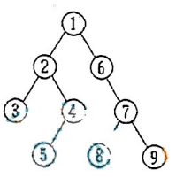

# DS-2015-11

## 1. 原题

已知二叉树如下图，下列序列中，（）是后序遍历后得到的序列。



A. $3,5,4,2,8,9,7,6,1$

B. $3,4,5,2,8,9,7,6,1$

C. $1,2,3,4,5,6,7,8,9$

D. $2,3,4,5,6,7,8,9,1$

> 读图转录（放大核对后）：根 $1$ 的左孩子为 $2$、右孩子为 $6$；$2$ 的左孩子为 $3$、右孩子为 $4$；$4$ 只有一个孩子 $5$（连线偏向左下）；$6$ 只有一个孩子 $7$（连线偏向右下）；$7$ 的左孩子为 $8$、右孩子为 $9$。叶子结点为 $3,5,8,9$，共 $9$ 个结点。
> 不确定性声明：结点 $4$ 与 $5$ 之间、$7$ 与 $8$ 之间的连线在扫描件中较淡（$8$ 上方仅存短笔痕），左右孩子的归属存在读错的可能。但 $4$、$6$ 均只有一个孩子，无论判为左孩子或右孩子，其后序结果都不变；$8$、$9$ 若互换则后序应为 $9,8,7$，而四个选项一律写作 $8,9,7$，与"读图取 $8$ 左 $9$ 右"完全自洽，故读图结论可靠。

## 2. 答案

**A**（$3,5,4,2,8,9,7,6,1$）。

## 3. 题目分析

- 已知：一棵含 $9$ 个结点（编号 $1\sim 9$）的二叉树的图形表示，父子与左右关系见上文的读图转录；
- 目标：判断四个候选序列中哪一个是该树的**后序**（左—右—根）遍历序列；
- 关键约束：后序遍历的三条可检验性质——① 每个子树的全部结点在序列中占据一段**连续区间**，且该区间的**最后一个**元素是该子树的根；② 整棵树的根 $1$ 必为序列末位；③ 任一父结点必出现在它的所有后代之后；
- 命题意图：图形化遍历题考查"按定义递归展开"的执行力，同时用"先序序列"（C 项）与"近似后序但局部颠倒"（B、D 项）设置陷阱；只要把树按后序定义走一遍并用性质②③快速核对，即可锁定答案。

## 4. 核心考点

核心考点：
DS03.02.03 二叉树的遍历（四种遍历及互推、由序列确定二叉树）

辅助考点：
DS03.02.03.03 后序遍历（左子树—右子树—根的递归次序及其"根在后"的结构特征）

解释：题面要求识别后序序列，本质是对给定树形执行后序遍历并与候选比对；判据（子树连续、末位为根、父在后）都来自后序的定义，故主节点取遍历总类 DS03.02.03，辅助节点取后序子节点 DS03.02.03.03。

## 5. 解题思路

1. 先把图翻译成父子表（见第 1 节读图转录），确认 $9$ 个结点各出现一次、根为 $1$；
2. 按后序定义递归展开：$\text{post}(t)=\text{post}(l_t),\ \text{post}(r_t),\ t$，自底向上写出每棵子树的后序片段；
3. 用分段核验复核：整树后序应写成"左子树片段 $|$ 右子树片段 $|\,1$"，检查每段末尾恰为该子树根；
4. 用两条硬约束快速排除：末位必须是根 $1$（排除 C）；父结点必须排在其孩子之后（B 中 $4$ 在其唯一孩子 $5$ 之前，D 中 $2,4,6,7$ 全部排在自己的孩子之前，均违反）；
5. 剩余 A 与逐段结果完全一致 ⟹ 选 A。

## 6. 详细解答

**（1）递归展开**

| 子树根 | 左子树 | 右子树 | 后序片段（左，右，根） |
|---|---|---|---|
| $3$ | 空 | 空 | $3$ |
| $5$ | 空 | 空 | $5$ |
| $4$ | $5$（独孩） | 空 | $5,4$ |
| $2$ | $3$ | $4$ 及其子 | $3,\;5,4,\;2$ |
| $8$ | 空 | 空 | $8$ |
| $9$ | 空 | 空 | $9$ |
| $7$ | $8$ | $9$ | $8,9,7$ |
| $6$ | 空 | $7$ 及其子（独孩） | $8,9,7,6$ |
| $1$ | $2$ 子树 | $6$ 子树 | $3,5,4,2,\;8,9,7,6,\;1$ |

即后序遍历序列为 $3,5,4,2,8,9,7,6,1$。

**（2）分段核验（独立复核）**

后序中每棵子树占连续区间且末位为该子树根，把 A 项切段：

$$\underbrace{3,5,4,2}_{\text{以 }2\text{ 为根的左子树}}\;\underbrace{8,9,7,6}_{\text{以 }6\text{ 为根的右子树}}\;\underbrace{1}_{\text{整树根}}$$

- 末位 $1$ 是根 ✓
- 左段末位 $2$ 正是左子树根，且 $4$ 在其子 $5$ 之后 ✓
- 右段末位 $6$ 正是右子树根，段内 $7$ 在 $8,9$ 之后 ✓
- 结点计数 $4+4+1=9$，$1\sim 9$ 各出现一次 ✓

**（3）遍历次序的算法描述（教材风格 C，用于验证"左—右—根"的机械执行）**

```c
void PostOrder(BiTree T)
{
    if (T == NULL)  return;                 /* 空树无输出 */
    PostOrder(T->lchild);                   /* 先遍历左子树 */
    PostOrder(T->rchild);                   /* 再遍历右子树 */
    visit(T);                               /* 最后访问根：输出 data */
}
```

对本图调用 `PostOrder(root)`，递归出栈顺序即第（1）步表格的自底向上顺序，打印结果为 `3 5 4 2 8 9 7 6 1`。

**（4）其余三种遍历序列（一并写出，用于识别干扰项）**

| 遍历方式 | 次序规则 | 本图结果 | 是否依赖"独孩算左还是右" |
|---|---|---|---|
| 先序 | 根—左—右 | $1,2,3,4,5,6,7,8,9$ | 否（恰为选项 C） |
| 中序 | 左—根—右 | $3,2,5,4,1,6,8,7,9$ | **是**（$5$ 挂在 $4$ 的左/右、$7$ 挂在 $6$ 的左/右会改变局部次序） |
| 后序 | 左—右—根 | $3,5,4,2,8,9,7,6,1$ | 否（单孩子子树的后序片段与左右归属无关） |
| 层序 | 逐层从左到右 | $1,2,6,3,4,7,5,8,9$ | 否 |

可见本题所求的后序恰好不受"独孩左右归属"这一读图模糊点影响（先序、层序亦然），只有中序会受影响——这也是本题答案比读图细节更稳健的原因。

**答案**：A。

## 7. 选项分析

- A. $3,5,4,2,8,9,7,6,1$：正确。与递归展开结果逐位相同，且满足"子树连续、末位为子树根"的分段结构；
- B. $3,4,5,2,8,9,7,6,1$：错。前段把 $4$ 排在其唯一孩子 $5$ 之前（$3,4,5,2$），违反后序"根在其全部后代之后"；该序列对应的是一棵 $5$ 为 $4$ 的**父**结点（或 $4$ 为叶、$5$ 为其兄）的树，与本图不符；
- C. $1,2,3,4,5,6,7,8,9$：错。末位是 $9$ 而不是根 $1$，一眼可排除；它正是本图的**先序**序列（根—左—右），属最高强度的形近干扰项；
- D. $2,3,4,5,6,7,8,9,1$：错。虽然末位是根 $1$，但序列中每个父结点都排在自己的孩子之前（$2$ 在 $3,4,5$ 前、$4$ 在 $5$ 前、$6$ 在 $7$ 前、$7$ 在 $8,9$ 前），整体方向恰好反了。

## 8. 考场标准答案

选 **A**。

后序遍历按"左子树—右子树—根"递归：根 $1$ 的左子树（根 $2$）给出 $3,5,4,2$，右子树（根 $6$）给出 $8,9,7,6$，最后访问根 $1$，拼得 $3,5,4,2,8,9,7,6,1$。

检验技巧：后序序列的最后一位必为整树根（排除 C），且任何父结点必在其孩子之后（B 中 $4$ 在 $5$ 前、D 中父结点全部在孩子前，均排除）。

## 9. 易错点

1. 把先序当后序：C 项 $1,2,3,4,5,6,7,8,9$ 是本题图形的先序序列，"编号正好递增"看起来最整齐，最容易顺手选；判据是**末位必须是根**；
2. 忽略单孩子结点 $4$、$6$：$4$ 只有一个孩子 $5$，后序中必须是"$5$ 在 $4$ 之前"；$6$ 只有一个孩子 $7$，必须"$7$ 在 $6$ 之前"。B 项正是抓住"孩子与父谁先谁后"设置的陷阱；
3. 误以为"独孩挂在左边还是右边会影响后序"：后序中单孩子子树的片段是"孩子的后序 $+$ 根"，与左右归属无关；会影响的是**中序**（见第 6 节第（4）步）；
4. 读图时把 $8$、$9$ 认作 $6$ 的孩子或把 $7$ 认作 $1$ 的右孩子：一旦父子关系读错，整段次序都会错位。稳妥做法是先用"结点各出现一次、共 $9$ 个"和"根为 $1$"核对图，再展开；
5. 只核对序列首尾不核对中间：D 项首尾都"像"后序（末位是 $1$），必须逐父结点检查"父在子后"才能排除。

## 10. 一句话规律

图形遍历选择题的通法：先写出"父子与左右"表，再按定义递归展开；然后用两条硬约束秒验答案——后序末位必为整树根、任何父结点必排在它的所有后代之后（先序则相反：父必在其所有后代之前）。

## 11. 关联知识

- DS-2017-08（同为读图题：由顺序存储的层序数组还原二叉树后求后序序列，答案 C）与本题方法完全相同，且同样在第 1 节声明了读图不确定性，可对照练习；
- DS-2013-25（先序 $ABCDEGF$、中序 $CBEGDFA$ 求后序 $CGEFDBA$）与 DS-2007-41（同两序列要求画出二叉树并给后序）：由"两序列定树"再求第三种遍历，是本题的逆向加强版；
- DS-2014-30（先序定根、中序分左右递归建树后重算三种遍历校验）给出"互推"的标准流程，与本题第（4）步"一次算出四种序列"的习惯一致；
- DS-2012-12（结点编号要求"每个结点的编号大于其左右孩子的编号、左孩子编号小于右孩子编号"——即后序编号）从编号规则角度刻画了本题"父在子后"这一特征；
- 本卷第 29 题（前序 $b,d,c,a,e,f$ 与中序 $c,d,e,a,b,f$ 求后序）与本题同为后序题，但需先由两序列还原树形，是本题的"无图版"；
- 本卷第 25 题（表达式二叉树先序为 $+a*+bcd$，代入求值）与 DS-2007-27、DS-2013-27（表达式树的先序/后序与求值）是"树形读图 $+$ 遍历"在表达式上的应用；
- DS-2005-15（判断"若某叶结点是中序序列的最后一个结点，则它也是前序序列的最后一个结点"——正确）与本题第（2）步同源：都是把遍历次序翻译成树形结构上的位置约束。

## 12. 来源与可信度

- 原题来源：2015 回忆版题面篇 `真题/2015/2015重庆邮电大学802数据结构真题.md` 一、选择题第 11 题，本题无订正说明；源文图片引用写作 `.\imgs\fig1.png`，本文件按知识库规范改写为 `../../真题/2015/imgs/fig1.png`；四个选项按源文原样转录；
- 读图与可信度：已读取 `真题/2015/imgs/fig1.png` 并放大核对父子与左右关系，$4\to5$、$7\to8$ 两处连线较淡，故 `ocr_confidence` 记为 `medium`，并在第 1 节给出读图转录与不确定性声明；由于后序不受单孩子结点左右归属影响，且 $8,9$ 的左右次序在四个选项中一致，读图偏差不改变本题答案；
- 答案来源：独立推导（递归展开 + 子树连续区间与末位为根的分段核验 + 递归代码验证 + 与先序/中序/层序三序列比对识别干扰项）；未实际抓取解析篇网页，仅按要求登记其地址备查；
- 教材依据：严蔚敏、吴伟民《数据结构（C 语言版）》第 5 章 5.4 二叉树的遍历（先序、中序、后序、层次遍历的递归定义与遍历过程示意）；
- 多来源冲突：无；争议：无（树形经放大核对且后序结果对读图模糊点不敏感）；
- 最终可信度：high（答案），读图口径为 medium 并已声明。
