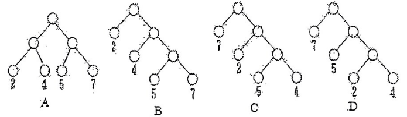

# DS-2015-16

## 1. 原题

下面四棵树中，数字表示相应叶子结点的权值，则（）是哈夫曼树。

A.

B.

C.

D.

> 读图转录（将 `fig2.png` 左右各放大 $5$ 倍后逐棵核对）：四棵树的叶子权值集合都是 $\{2,4,5,7\}$，内部结点未标权值，形状如下（根记为 $r$，"独子"不会出现——四棵均为每个内部结点恰有两个孩子）。
> - **A**：$r$ 的左、右孩子都是内部结点；左内部结点的孩子为叶 $2$（左）、叶 $4$（右）；右内部结点的孩子为叶 $5$（左）、叶 $7$（右）。四个叶子全在第 $3$ 层。
> - **B**：$r$ 的左孩子为叶 $2$、右孩子为内部结点 $x$；$x$ 的左孩子为叶 $4$、右孩子为内部结点 $y$；$y$ 的左孩子为叶 $5$、右孩子为叶 $7$。
> - **C**：$r$ 的左孩子为叶 $7$、右孩子为内部结点 $x$；$x$ 的左孩子为叶 $2$、右孩子为内部结点 $y$；$y$ 的左孩子为叶 $5$、右孩子为叶 $4$。
> - **D**：$r$ 的左孩子为叶 $7$、右孩子为内部结点 $x$；$x$ 的左孩子为叶 $5$、右孩子为内部结点 $y$；$y$ 的左孩子为叶 $2$、右孩子为叶 $4$。
>
> 不确定性声明：原图为低分辨率扫描件，权值数字 $2,4,5,7$ 的笔画有断裂（尤其 A 中的 $2$ 与 C、D 中的 $7$ 上方有噪点），左右孩子的归属在极端情形下可能读反。但**左右子树互换不改变任何一棵树的带权路径长度，也不改变"哪两个权值互为兄弟"**，而本题的判定只依赖这两类信息，故读图偏差不影响答案。

## 2. 答案

**D**。四棵树的带权路径长度分别为 $WPL(A)=36$、$WPL(B)=46$、$WPL(C)=38$、$WPL(D)=35$，而由权值集 $\{2,4,5,7\}$ 用哈夫曼算法构造出的最小值为 $35$，只有 D 达到该最小值且其合并次序与算法一致。

## 3. 题目分析

- 已知：四棵含 $4$ 个叶子（权值 $2,4,5,7$）的二叉树形状；
- 目标：判定哪一棵是**哈夫曼树**，即带权路径长度 $WPL=\sum_k w_k l_k$ 最小的那棵（$l_k$ 为叶子到根的边数）；
- 关键约束：
  1. 哈夫曼树是**最优二叉树**——定义为 WPL 最小的树，因此判定标准是"WPL 是否达到该权值集合的下界"，而不是"看起来像不像"；
  2. 由哈夫曼算法的必要性质可作快速筛：① 权值最小的两个叶子必为**最深的兄弟**；② 算法每步合并的都是"当前森林中根权值最小的两棵树"，把候选树自底向上还原成合并序列，任何一步合并的不是当时最小的两个 ⟹ 不是哈夫曼树；③ 权值大的叶子不得比权值小的叶子更深（否则交换可减小 WPL）；
  3. $4$ 个叶子的哈夫曼树只有"三层"与"四层斜梯"两类形状，故形状本身不能定胜负，必须算数；
- 命题意图：考查哈夫曼树的**定义（WPL 最小）**与**构造算法（每次取两个最小）**能否反过来用于判别，而不是只记"左小右大"之类的外形口诀。

## 4. 核心考点

核心考点：
DS03.04.01 哈夫曼树与哈夫曼编码（哈夫曼树的定义与 WPL 计算、构造步骤"每次选取两个最小权值的树合并"）

辅助考点：
DS03.01 树的基本概念（路径、路径长度、结点的层与"叶子到根的边数"之间的换算，是算 WPL 的基础）

解释：判别的唯一硬指标是 WPL 与构造过程，落在 DS03.04.01；而"第几层对应路径长度几"这一换算是 DS03.01 的基本概念，四棵树的层数读法（根在第 $1$ 层、路径长度为层号减 $1$）都依赖它，故列一项辅助。

## 5. 解题思路

1. 先按哈夫曼算法**独立构造**一次最优树：$\{2,4,5,7\}\to$ 合并 $2+4=6\to\{5,6,7\}\to$ 合并 $5+6=11\to\{7,11\}\to$ 合并 $7+11=18$，得到"叶 $7$ 在第 $2$ 层、叶 $5$ 在第 $3$ 层、叶 $2,4$ 在第 $4$ 层"的斜梯形，并算出最优 $WPL=35$；
2. 再逐棵读图算 WPL（各叶子路径长度 $=$ 层号 $-1$）；
3. 与 $35$ 比对：只有 D 相等 ⟹ D 是哈夫曼树；
4. 用**第二种方法**（还原合并序列）复核：把每棵树自底向上写成合并序列，检查每一步是否都在合并"当时最小的两个"，只有 D 全程满足；
5. 用**第三条硬约束**快速排除：A 中 $5$ 与 $7$ 互为兄弟（$5<7$ 却与更大的 $7$ 先合并），B 中 $2$ 单独挂在最浅层而最深的兄弟是 $5,7$（最小权值 $2,4$ 未成兄弟），C 中最深兄弟是 $5,4$（最小的 $2$ 反而在第 $3$ 层），均违反哈夫曼树性质。

## 6. 详细解答

**（1）先求该权值集合的 WPL 下界（哈夫曼算法正向构造）**

| 步骤 | 当前森林（按根权值列出） | 取出的两个最小 | 合并后 |
|---|---|---|---|
| 1 | $2,4,5,7$ | $2,4$ | $6$，森林变为 $5,6,7$ |
| 2 | $5,6,7$ | $5,6$ | $11$，森林变为 $7,11$ |
| 3 | $7,11$ | $7,11$ | $18$，结束 |

生成的树：根 $18$ 的左孩子为叶 $7$、右孩子为内部结点 $11$；$11$ 的左孩子为叶 $5$、右孩子为内部结点 $6$；$6$ 的孩子为叶 $2$、叶 $4$。各叶子路径长度：$l(7)=1$、$l(5)=2$、$l(2)=l(4)=3$。

$$WPL_{\min}=7\times1+5\times2+(2+4)\times3=7+10+18=35$$

（同一形状下左右子树互换、同层兄弟互换所得的树 WPL 相同，故哈夫曼树形状不唯一但 WPL 唯一为 $35$。）

**（2）逐棵计算四个选项的 WPL**

| 选项 | 各叶子路径长度（读图） | WPL 计算 | 与 $35$ 比较 |
|---|---|---|---|
| A | $l(2)=l(4)=l(5)=l(7)=2$ | $(2+4+5+7)\times2=18\times2=36$ | 大 $1$，不是 |
| B | $l(2)=1,\;l(4)=2,\;l(5)=l(7)=3$ | $2+8+36=46$ | 大 $11$，不是 |
| C | $l(7)=1,\;l(2)=2,\;l(5)=l(4)=3$ | $7+4+27=38$ | 大 $3$，不是 |
| D | $l(7)=1,\;l(5)=2,\;l(2)=l(4)=3$ | $7+10+18=35$ | **相等，是** |

D 的叶子层分布与第（1）步构造出的最优树完全一致（叶 $7$ 第 $2$ 层、叶 $5$ 第 $3$ 层、叶 $2,4$ 第 $4$ 层），故 **D 是哈夫曼树**。

**（3）第二方法：自底向上还原"合并序列"检验贪心性**

把每棵树的每个内部结点还原成"它的两棵子树的根权值之和"，自底向上写出合并次序：

| 选项 | 还原出的合并次序 | 每步是否取当时最小的两个 |
|---|---|---|
| A | $2+4=6$；$5+7=12$；$6+12=18$ | 第 $2$ 步森林为 $\{5,6,7,12\}$（应为 $\{5,6,7\}$），却合并 $5,7$，而当时最小两枚是 $5,6$ ⟹ **违反** |
| B | $5+7=12$；$4+12=16$；$2+16=18$ | 第 $1$ 步就合并 $5,7$，未取最小的 $2,4$ ⟹ **违反** |
| C | $5+4=9$；$2+9=11$；$7+11=18$ | 第 $1$ 步合并 $4,5$，而最小两枚是 $2,4$ ⟹ **违反** |
| D | $2+4=6$；$5+6=11$；$7+11=18$ | 三步分别为 $\{2,4,5,7\}\to\{5,6,7\}\to\{7,11\}$，每步恰取最小两个 ⟹ **符合** |

两条独立方法（WPL 下界比对、贪心序列还原）结论一致：D。

**（4）第三条判据：哈夫曼树的两条结构性必要条件（快检）**

- **性质①**（权值最小的两个叶子必为最深层的兄弟）：A 满足（$2,4$ 为兄弟且同处最深层）、B 不满足（最深兄弟是 $5,7$）、C 不满足（最深兄弟是 $5,4$）、D 满足；
- **性质②**（层序与权序相反：$w_i<w_j\Rightarrow l_i\ge l_j$）：A 四叶同层，不违反；B 中 $w=2$ 的 $l=1$ 最小、$w=7$ 的 $l=3$ 最大，**违反**（小权值反而最浅）；C 中 $w=2$ 的 $l=2$ 小于 $w=4$ 的 $l=3$，**违反**；D 中 $l(7)=1<l(5)=2<l(4)=l(2)=3$，与 $7>5>4=2$ 严格反向，不违反；
- 两条性质只能排除 B、C（C 另违反性质①），**A 两条均不违反**——所以 A 必须靠第（2）（3）步的硬计算排除：其 $WPL=36$，而 D 已给出 $35$ 的可行解，故 A 不是最优；其失败点在第 $2$ 步——A 把 $5$ 与 $7$ 先合并成 $12$，而哈夫曼算法要求把 $5$ 与子树根 $6$（即 $2+4$）合并成 $11$；按“WPL $=$ 各次合并所得新结点权值之和”计算，A 为 $6+12+18=36$、D 为 $6+11+18=35$，差值恰为那一步的 $12-11=1$。

**答案**：D。

## 7. 选项分析

- A. 四叶同层的"满"形树：错。$WPL=36$ 比最优值多 $1$；其失败点是第 $2$ 步合并了 $5$ 与 $7$（和 $12$），而哈夫曼算法要求合并 $5$ 与 $6$（和 $11$）。"叶子排得整整齐齐"正是本题最强的视觉干扰；
- B. 斜梯形但权值顺序错乱：错。$WPL=46$，四者中最大；它把最小的权值 $2$ 放在最浅处（$l=1$）、把较大的 $5,7$ 放在最深处，完全违反"小权值深、大权值浅"的原则；
- C. 斜梯形、权值次序部分正确：错。$WPL=38$；最深兄弟取了 $4,5$（和 $9$）而不是 $2,4$（和 $6$），且最小的 $2$ 被提到第 $3$ 层，违反性质①；
- D. 正确。$WPL=35$ 等于该权值集合的下界，且自底向上的合并序列 $2+4=6\to5+6=11\to7+11=18$ 与哈夫曼算法逐步吻合。

## 8. 考场标准答案

选 **D**。

先算最优值：合并次序 $(2,4)\to6$、$(5,6)\to11$、$(7,11)\to18$，故 $WPL_{\min}=7\times1+5\times2+2\times3+4\times3=35$。

再逐棵按"叶子层号 $-1=$ 路径长度"算 WPL：

$$A:(2+4+5+7)\times2=36;\quad B:2\times1+4\times2+(5+7)\times3=46$$
$$C:7\times1+2\times2+(5+4)\times3=38;\quad D:7\times1+5\times2+(2+4)\times3=35$$

只有 D 达到最小值 $35$，且其最深的兄弟结点恰为最小两个权值 $2,4$，向上依次与 $5$、$7$ 合并，符合哈夫曼算法，故选 D。

## 9. 易错点

1. **把"形状规整"当"最优"**：A 四叶同层、编号递增，最容易凭直觉选；但哈夫曼树恰恰要求"权值小的叶子更深"，四叶同层只在所有权值相等时才是最优；
2. **只比形状不比权值落在哪一层**：B、C、D 同为"右斜梯"形状，差别全在权值填在哪一层——必须逐叶算 $w\times l$，不能看形状就下结论；
3. **忘记路径长度 $=$ 层号 $-1$**：根在第 $1$ 层，其孩子路径长度为 $1$；把层号直接乘权值会把四棵树的 WPL 同时放大，虽不改变大小关系，但会算不出 $35$ 这个标准值而与自己的构造结果"对不上"；
4. **误认为哈夫曼树唯一**：左右子树互换、同层兄弟互换都得到新的合法哈夫曼树（WPL 相同），本题 D 只是其中一个画法；判别的依据是 WPL 与合并序列，不是"和课本插图一模一样"；
5. 读图时把 C 的最深兄弟 $5,4$ 看成 $2,4$：C 与 D 的差别正在"第 $3$ 层放 $2$ 还是放 $5$"，看错就误选 C。

## 10. 一句话规律

判别哈夫曼树的标准动作：先用算法正向构造一遍算出 $WPL_{\min}$，再逐棵按 $\sum w_k l_k$ 比对；辅以两条快检——"最小两个权值必为最深兄弟""每步自底向上还原的合并都必须是当时最小的两个"，形状再规整也不算数。

## 11. 关联知识

- DS-2013-14（$4$ 个叶子权值 $3,9,2,7$ 求该哈夫曼树的 WPL，答案 A）与本题同为"四叶哈夫曼树算 WPL"，可对照练习：先合并 $2+3=5$、再 $5+7=12$、再 $9+12=21$；
- DS-2013-35（$6$ 个权值构造的哈夫曼树共有 $11$ 个结点）与本卷第 31 题（$n$ 个叶子的哈夫曼树总结点数 $2n-1$）给出结点数侧的性质，本题四棵树的内部结点均为 $3$ 个、总结点 $7$ 个，正合 $2n-1$；
- DS-2007-42（以 $\{4,5,6,7,12\}$ 为权值构造哈夫曼树并求 WPL）、DS-2014-45（含 $5$ 个叶子的哈夫曼树构造与编码）、DS-2005-31（$12$ 个字符频率构造哈夫曼树并编码）都是"正向构造"的完整练习，本题是它们的逆向判别；
- DS-2006-08（下列编码中哪个不是前缀码）与本卷第 40 题（$7$ 个字符频率 $3,12,7,4,2,8,11$ 画哈夫曼树并给编码，约定"左大右小"）把哈夫曼树用于编码，注意那两题的"左/右"约定只影响编码字符串，不影响 WPL 与本题的判别方法；
- 本卷第 10 题（$12$ 个结点的二叉树高度至多 $12$）与第 23 题（完全二叉树的叶子计数）同属"按层数算量"的基本功，本题第（3）步"层号与路径长度的换算"与之共用；
- DS-2012-44（$8$ 种字符频率求前缀编码总位数最少值）体现"权值大的靠近根"这一交换论证，正是本题第（4）步排除 A、B 所用的原理。

## 12. 来源与可信度

- 原题来源：2015 回忆版题面篇 `真题/2015/2015重庆邮电大学802数据结构真题.md` 一、选择题第 16 题，本题无订正说明；源文图片引用写作 `.\imgs\fig2.png`，本文件按知识库规范改写为 `../../真题/2015/imgs/fig2.png`；四个选项在源文中只以 A、B、C、D 四个字母标出、无文字内容（图形即选项），故第 1 节按源文保留字母并把图形信息转写为读图说明；
- 读图与可信度：已读取 `真题/2015/imgs/fig2.png`，并另存左右两半各放大 $5$ 倍的副本（`tmp/_2015_fig2_p0.png`、`tmp/_2015_fig2_p1.png`）逐棵核对叶子权值与父子、左右关系；因扫描件笔画断裂，`ocr_confidence` 记为 `medium` 并在第 1 节声明不确定性；由于"兄弟左右互换"不改变 WPL 与合并序列，读图偏差不影响本题答案；
- 答案来源：独立推导（哈夫曼算法正向构造求 $WPL_{\min}=35$ + 四棵树逐一算 WPL $36/46/38/35$ + 自底向上还原合并序列的贪心性检验 + 最小两权必为最深兄弟的结构性质快检），两种以上方法一致；未实际抓取解析篇网页，仅按要求登记其地址备查；
- 教材依据：严蔚敏、吴伟民《数据结构（C 语言版）》第 5 章 5.7.3 哈夫曼树及其应用（哈夫曼树的定义"带权路径长度最小的二叉树"、构造算法、WPL 计算，及性质"哈夫曼树中无度为 $1$ 的结点、$n$ 个叶子共有 $2n-1$ 个结点、权值越大的叶子离根越近"）；
- 多来源冲突：无；争议：无（四棵树 WPL 互不相等且只有 D 等于算法下界）；
- 最终可信度：high（答案），读图口径为 medium 并已声明。
