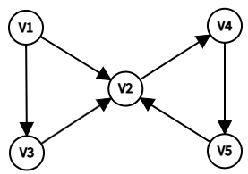

# DS-2015-18

## 1. 原题

给定下列有向图和初始结点 $V_1$ ，按深度优先遍历的结点序列为（）。

A. $V_1,V_3,V_4,V_5,V_2$

B. $V_1,V_2,V_3,V_4,V_5$

C. $V_1,V_2,V_5,V_3,V_4$

D. $V_1,V_2,V_4,V_5,V_3$

> 读图转录（将 `fig3.png` 放大后逐条弧核对箭头方向）：图含 $5$ 个顶点 $V_1\sim V_5$，位置为 $V_1$ 左上、$V_4$ 右上、$V_2$ 正中、$V_3$ 左下、$V_5$ 右下，共 $6$ 条弧：
>
> $$V_1\to V_2,\quad V_1\to V_3,\quad V_3\to V_2,\quad V_2\to V_4,\quad V_4\to V_5,\quad V_5\to V_2$$
>
> 各顶点的邻接点（出边表，按下标升序）：$V_1:\{V_2,V_3\}$、$V_2:\{V_4\}$、$V_3:\{V_2\}$、$V_4:\{V_5\}$、$V_5:\{V_2\}$。入度：$V_2$ 为 $3$（来自 $V_1,V_3,V_5$），其余为 $1$；$V_1$ 入度为 $0$。
>
> 不确定性声明：原图为低分辨率扫描件，$V_2$ 周围三条箭头（$V_1\to V_2$、$V_3\to V_2$、$V_5\to V_2$）的头部彼此靠近，方向在极端情形下可能读反。但**四个选项的第一步都是 $V_1$ 出发**，而 $V_1$ 只有两条出边（$V_1\to V_2$、$V_1\to V_3$），故"第二项必为 $V_2$ 或 $V_3$"这一判据不受读图歧义影响；选项 A、B、C 均因"相邻两项之间图中根本无线可连"而被排除，该结论只依赖边的**有无**、不依赖弧的**方向**（除 $V_5\to V_2$ 外无反向边），故读图偏差不影响本题答案。

## 2. 答案

**D**（$V_1,V_2,V_4,V_5,V_3$）。

## 3. 题目分析

- 已知：一个 $5$ 顶点 $6$ 弧的有向图（见上图转录）与遍历起始顶点 $V_1$；
- 目标：给出从 $V_1$ 出发的**深度优先遍历（DFS）**序列；
- 关键约束：
  1. DFS 的规则是"访问一个顶点后，立即沿它的**第一个尚未访问的邻接点**继续深入；无路可走时回溯到上一个顶点，继续检查它的下一个邻接点"——因此序列中**每一对相邻结点都必须是一条弧**（前项 $\to$ 后项），这是排除错误选项最快的判据；
  2. 邻接点的检查次序：题面未给邻接表，按惯例取**顶点下标升序**（本解析第（1）步）；该约定只影响"先走 $V_2$ 还是先走 $V_3$"这一岔路口；
  3. 有向图 DFS 只能沿弧的正方向前进，且**已访问结点不再重复进入**（$V_2$ 被 $V_1$ 访问后，后面 $V_5\to V_2$、$V_3\to V_2$ 都只能作为"已访问"跳过）；
  4. 从 $V_1$ 出发一次 DFS 即可访问全部 $5$ 个顶点（$V_1$ 可达 $V_2,V_3,V_4,V_5$），故序列长度为 $5$，与四个选项一致；
- 命题意图：考查 DFS"深入—回溯"的执行过程能否手工模拟，同时检验是否理解"遍历序列的相邻项之间必须有边相连"这一必要条件（三个干扰项正是靠"看起来像 DFS"的乱序来迷惑考生）。

## 4. 核心考点

核心考点：
DS04.03.01 深度优先搜索（从给定起点出发的手工模拟、访问标记与回溯、遍历序列的唯一性条件）

辅助考点：
DS04.01 图的基本概念（有向图的弧与方向性、邻接点、可达性——决定"哪些跳转合法"以及"一次 DFS 能否访问全部顶点"）

解释：题目直接要求写出 DFS 序列，落在 DS04.03.01；但执行每一步都要先回答"$u$ 到 $v$ 之间有没有一条从 $u$ 指向 $v$ 的弧"，这是 DS04.01 的基本概念，故列一项辅助。本题不涉及存储结构实现（邻接表/邻接矩阵只影响效率不影响序列），故不加 DS04.02.x。

## 5. 解题思路

1. 先把图**读成弧集**（第 1 节转录），并写出每个顶点的邻接点表；
2. 从 $V_1$ 起按"下标小的邻接点优先"逐步模拟，用一个已访问集合与一个回溯栈跟踪；
3. 得到 $V_1,V_2,V_4,V_5,V_3$ 后，与四个选项比对——恰为 D；
4. **换一种方法自验**：不模拟 DFS，只对四个选项各检查"相邻两项之间是否有弧"。凡出现无弧跳转者必不是任何遍历（更不可能是 DFS）；
5. 再补一步稳健性检查：即使把邻接点次序反过来（先 $V_3$ 后 $V_2$），得到的 $V_1,V_3,V_2,V_4,V_5$ 也不在选项中，说明本题答案对次序约定不敏感。

## 6. 详细解答

**（1）正向模拟 DFS**

约定：邻接点按顶点下标升序检查；`visited[]` 记录已访问顶点。

| 步 | 当前顶点 | 其邻接点检查情况 | 动作 | 序列（已访问） | 栈（递归路径） |
|---|---|---|---|---|---|
| 1 | $V_1$ | 首查 $V_2$：未访问 | 进入 $V_2$ | $V_1,V_2$ | $V_1,V_2$ |
| 2 | $V_2$ | 只有 $V_4$：未访问 | 进入 $V_4$ | $V_1,V_2,V_4$ | $V_1,V_2,V_4$ |
| 3 | $V_4$ | 只有 $V_5$：未访问 | 进入 $V_5$ | $V_1,V_2,V_4,V_5$ | $V_1,V_2,V_4,V_5$ |
| 4 | $V_5$ | 只有 $V_2$：**已访问** | 无路，回溯 | 不变 | $V_1,V_2,V_4$ |
| 5 | $V_4$ | 邻接点已查完 | 回溯 | 不变 | $V_1,V_2$ |
| 6 | $V_2$ | 邻接点已查完 | 回溯 | 不变 | $V_1$ |
| 7 | $V_1$ | 次查 $V_3$：未访问 | 进入 $V_3$ | $V_1,V_2,V_4,V_5,V_3$ | $V_1,V_3$ |
| 8 | $V_3$ | 只有 $V_2$：已访问 | 回溯，$V_1$ 亦查完，结束 | 不变 | 空 |

得到遍历序列 $V_1,V_2,V_4,V_5,V_3$。

**（2）反向验证：用"相邻项之间必须有弧"筛掉三个选项**

弧集共 $6$ 条：$(V_1,V_2),(V_1,V_3),(V_3,V_2),(V_2,V_4),(V_4,V_5),(V_5,V_2)$。

| 选项 | 相邻跳转逐条核对 | 判定 |
|---|---|---|
| A. $V_1,V_3,V_4,V_5,V_2$ | $V_1\to V_3$ ✓；$V_3\to V_4$ ✗（$V_3$ 只有出边 $V_3\to V_2$） | 不可能是遍历序列 |
| B. $V_1,V_2,V_3,V_4,V_5$ | $V_1\to V_2$ ✓；$V_2\to V_3$ ✗（$V_2$ 只有出边 $V_2\to V_4$） | 不可能是遍历序列 |
| C. $V_1,V_2,V_5,V_3,V_4$ | $V_1\to V_2$ ✓；$V_2\to V_5$ ✗（$V_2$ 与 $V_5$ 之间只有 $V_5\to V_2$，方向相反） | 不可能是遍历序列 |
| D. $V_1,V_2,V_4,V_5,V_3$ | $V_1\to V_2$ ✓、$V_2\to V_4$ ✓、$V_4\to V_5$ ✓、$V_5\to V_2$ 已访问故回溯、回溯至 $V_1$ 后 $V_1\to V_3$ ✓ | **合法且与第（1）步一致** |

注意 C 项的 $V_2\to V_5$ 恰好是"方向读反"的典型错误：图中 $V_2,V_5$ 之间的弧是 $V_5\to V_2$（由 $V_5$ 指向中间的 $V_2$），若把它当成 $V_2\to V_5$ 就会误选 C——这正是本题的主要陷阱。

**（3）次序约定的稳健性检查**

若约定"邻接点按下标降序检查"，则 $V_1$ 先走 $V_3$：$V_1\to V_3\to V_2\to V_4\to V_5$，得序列 $V_1,V_3,V_2,V_4,V_5$，不在四个选项之中。这说明本题在设计上只有一种次序约定能匹配选项，且 A、B、C 三个选项在**任何**次序约定下都不成立（它们都含无弧跳转）。因此无论考生采用哪种惯例，唯一可能正确的仍是 D。

**（4）补充：与 BFS 序列对照（选项 B 的真实身份）**

本图从 $V_1$ 出发的 **BFS** 序列：先访问 $V_1$ 的全部邻接点 $V_2,V_3$，再由 $V_2$ 带出 $V_4$、由 $V_4$ 带出 $V_5$（$V_3$ 的邻接点 $V_2$、$V_5$ 的邻接点 $V_2$ 均已访问），得 $V_1,V_2,V_3,V_4,V_5$——**恰与选项 B 逐字相同**。也就是说 B 不是乱序编造，而是把广度优先的结果冒充深度优先，这是它最具迷惑性的地方；

DFS 序列不具有"逐层铺开"的特征，而是"一条路走到黑再回头"，本题即 $V_1\to V_2\to V_4\to V_5$ 这条长链走完才回头补 $V_3$。

**答案**：D。

## 7. 选项分析

- A. $V_1,V_3,V_4,V_5,V_2$：错。$V_3$ 之后必须沿 $V_3\to V_2$ 走，不存在 $V_3\to V_4$ 的弧；且若真先走 $V_3$，DFS 会把 $V_3$ 的整条下游一次性走完，不会中途跳到 $V_4$；
- B. $V_1,V_2,V_3,V_4,V_5$：错。$V_2$ 与 $V_3$ 之间无弧（$V_2\to V_3$ 不存在，$V_3\to V_2$ 方向相反）。此项实为**从 $V_1$ 出发的广度优先（BFS）序列**，属"张冠李戴"型干扰；
- C. $V_1,V_2,V_5,V_3,V_4$：错。$V_2\to V_5$ 不存在，$V_2,V_5$ 之间的弧方向是 $V_5\to V_2$；把弧方向读反就会掉进此项；
- D. $V_1,V_2,V_4,V_5,V_3$：正确。每一步都沿真实弧前进，$V_5$ 处因 $V_2$ 已访问而回溯，回到 $V_1$ 后补上未访问的 $V_3$，完全符合 DFS 的"深入—回溯"规则。

## 8. 考场标准答案

选 **D**。

由图得弧集 $\{V_1\!\to\!V_2,\ V_1\!\to\!V_3,\ V_3\!\to\!V_2,\ V_2\!\to\!V_4,\ V_4\!\to\!V_5,\ V_5\!\to\!V_2\}$。

从 $V_1$ 出发（邻接点按编号升序检查）：访问 $V_1$ → $V_2$ → $V_4$ → $V_5$；$V_5$ 的邻接点 $V_2$ 已访问，依次回溯至 $V_4$、$V_2$、$V_1$；$V_1$ 的下一个邻接点 $V_3$ 未访问，访问 $V_3$（其邻接点 $V_2$ 已访问）。

故 DFS 序列为 $V_1,V_2,V_4,V_5,V_3$。

（快速排除法：DFS 序列中相邻两项之间必须有弧相连。A 缺 $V_3\!\to\!V_4$、B 缺 $V_2\!\to\!V_3$、C 缺 $V_2\!\to\!V_5$，只有 D 每一步都有弧。）

## 9. 易错点

1. **把 BFS 序列当 DFS 序列**（选 B）：$V_1,V_2,V_3,V_4,V_5$ 是逐层铺开的广度优先结果；DFS 必须先钻到底（$V_1\to V_2\to V_4\to V_5$）再回头；
2. **把弧的方向读反**（选 C）：$V_2$ 与 $V_5$ 之间的弧是 $V_5\to V_2$（指向中间的 $V_2$），$V_2$ 无法一步跳到 $V_5$；
3. 忽略"已访问结点不再重复进入"：$V_5\to V_2$ 这条弧在遍历中只起"探到已访问、触发回溯"的作用，不能把 $V_2$ 再写一次；
4. 忘记回溯后要**继续检查上层顶点剩余的邻接点**：$V_5$ 走不通后，$V_1$ 还剩 $V_3$ 未访问，漏掉这一步会写出长度为 $4$ 的序列；
5. 读图时漏掉 $V_1\to V_3$ 或 $V_3\to V_2$：前者决定 $V_3$ 何时被访问，后者决定 $V_3$ 不能排在 $V_2$ 之前（若把 $V_3\to V_2$ 看成 $V_2\to V_3$，就会误认为 B 成立）。

## 10. 一句话规律

判断"哪个序列是某图的 DFS/BFS 序列"，先做**合法性检验**：序列中每对相邻结点之间必须有边（有向图还必须是弧的正方向），不满足者一律排除；剩下的再用"DFS 一条路走到底再回溯、BFS 一层一层铺开"区分。

## 11. 关联知识

- 本卷第 19 题（邻接矩阵/邻接表所占存储空间）与本题第 20 题（邻接表中表结点出现次数）构成图章的一对基本概念题，本题则是"图上手工执行遍历"的过程题；
- 本卷第 42 题（同一张卷的图 $G$：画邻接矩阵、从 $V_1$ 出发做**广度优先**遍历、用 Kruskal 求最小生成树）与本题第（4）步正好互补——一题 DFS、一题 BFS，可对照两者序列差别；
- 本卷第 32 题（从无向图某顶点出发一次遍历即可访问所有顶点 ⟹ 该图一定是连通图）与本题"从 $V_1$ 出发一次 DFS 访问全部 $5$ 个顶点"是同一件事在有向图上的体现（$V_1$ 可到达其余各顶点）；
- DS-2007-39（由邻接表写出 DFS 与 BFS 序列：DFS $v5,v2,v1,v4,v3$；BFS $v5,v2,v3,v1,v4$）是同一题型的邻接表版本，可练习"按表内次序而非下标次序检查邻接点"；
- DS-2012-43（由邻接矩阵写出从 $V_1$ 出发的 DFS/BFS 序列并求 Prim 生成树）为"矩阵 + 遍历"的综合演练；
- DS-2026-01（图的 DFS 递归程序填空：`G.vertices[v].firstarc` 与 `DFSTree(G, p->adjvex)`）给出本题手工模拟所对应的代码骨架；
- DS-2007-33（DFS 的时间复杂度 $O(n+e)$）说明遍历"每条边至多检查一次"，与本题第（2）步"相邻项必须有边"的判据同源。

## 12. 来源与可信度

- 原题来源：2015 回忆版题面篇 `真题/2015/2015重庆邮电大学802数据结构真题.md` 一、选择题第 18 题，本题无订正说明；题面文字与四个选项按源文原样转录，配图 `fig3.png` 按第 1 节"读图转录"记录；
- 答案来源：独立推导（正向逐步模拟 DFS + 反向用"相邻项必须有弧"逐项排除 + 次序约定敏感性测试）；未实际抓取解析篇网页，仅按要求登记其地址备查；
- 教材依据：严蔚敏、吴伟民《数据结构（C 语言版）》第 7 章图——7.3 图的遍历（深度优先搜索 DFS，算法 7.6/7.7：访问顶点、对其每个未被访问的邻接点递归调用、回溯；明确"从某顶点出发的一次 DFS 所能到达的顶点构成该顶点的可达集/连通分量"）；7.1 图的定义（有向图弧的方向、邻接点、入度与出度）；
- 多来源冲突：无；
- 争议：**无实质争议，但存在两点需交代的约定**——① 题面未规定邻接点检查次序，本解析按顶点下标升序（教材与多数题解惯例）执行；由于降序所得序列不在选项中、且 A、B、C 在任何次序下均因无弧跳转而不成立，答案唯一性不受影响；② 图为低分辨率扫描件，$V_2$ 附近三条弧的箭头方向若整体读反，则 C 项 $V_1,V_2,V_5,V_3,V_4$ 会变成合法 DFS 序列——但那样 $V_1\to V_2$ 亦须反向，与"$V_1$ 是初始结点且存在 $V_1$ 出发的遍历"这一题面自相矛盾，故不采纳该读法。两点均已在第 1、3、6 节显式声明，未登记为争议题；
- 最终可信度：答案 D 为 high，推导过程可信度 high，读图可信度 medium（已作方向性风险论证）。
