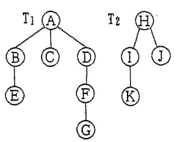

# DS-2015-38

## 1. 原题

现有 $2$ 棵树的森林如下图所示，请画出对应的二叉树。



> 读图转录：森林由两棵树组成。$T_1$ 的根为 $A$，$A$ 的三个孩子自左向右为 $B,C,D$；$B$ 的孩子为 $E$；$D$ 的孩子为 $F$；$F$ 的孩子为 $G$（即 $E$ 挂 $B$、$F$ 挂 $D$、$G$ 挂 $F$）。$T_2$ 的根为 $H$，$H$ 的两个孩子自左向右为 $I,J$；$I$ 的孩子为 $K$。共 $11$ 个结点。

## 2. 答案

对应的二叉树（$n$ 左 $m$ 表示 $m$ 是 $n$ 的左孩子，$n$ 右 $m$ 表示 $m$ 是 $n$ 的右孩子）：

| 结点 | 左孩子 | 右孩子 |
|---|---|---|
| A | B | H |
| B | E | C |
| C | — | D |
| D | F | — |
| E | — | — |
| F | G | — |
| G | — | — |
| H | I | — |
| I | K | J |
| J | — | — |
| K | — | — |

图形（“左/右”以上表指针语义为准）：

```
          A
        /   \
      B       H
     / \     /
    E   C   I
         \ / \
          D K  J
         /
        F
       /
      G
```

等价的缩进写法（“左→”为左孩子指针，“右→”为右孩子指针）：

```
A
├─左→ B
│    ├─左→ E
│    └─右→ C ─右→ D ─左→ F ─左→ G
└─右→ H
     └─左→ I
          ├─左→ K
          └─右→ J
```

## 3. 题目分析

- 已知：含两棵树的森林 $F=\{T_1,T_2\}$，$T_1$ 有 7 个结点（$A\sim G$）、$T_2$ 有 4 个结点（$H\sim K$），各结点孩子次序已在读图转录中给出；
- 目标：画出与 $F$ 一一对应的二叉树（即树的**孩子兄弟表示法**所对应的二叉链表形态）；
- 关键约束：转换规则唯一——"每个结点的**左指针**指向它在树中的**第一个孩子**，**右指针**指向它在树中的**下一个兄弟**"；森林中第 $2$、第 $3$…棵树的根依次挂在第 $1$ 棵树根的**右链**上；
- 命题意图：考"左孩子右兄弟"这一存储结构（DS03.03.01）与转换规则（DS03.03.02）的机械执行，尤其是**根结点无兄弟但被森林中下一棵树的根占据右链**这一易漏点。

## 4. 核心考点

核心考点：
DS03.03.02 森林与二叉树的转换（本卷 2023-18 同型）

辅助考点：
DS03.03.01 树的存储结构——孩子兄弟表示法（转换结果正是该表示法的二叉链表形态）；DS03.02.03 二叉树的遍历——用"森林先根遍历＝二叉树先序、森林后根遍历＝二叉树中序"校验画出的结果

解释：题目只要求"画图"，但画对的前提是把"孩子/兄弟"两类关系分别落到左/右指针上；判卷时最常用的自检手段就是两条遍历序列的对应关系，故把遍历列为辅助考点。

## 5. 解题思路

1. 先给森林中每个结点列出"第一个孩子"与"直接右兄弟"两张关系表（这是唯一需要动脑的一步，之后全是照表连线）；
2. 二叉树根取 $T_1$ 的根 $A$；因森林还有第二棵树，$A$ 的右孩子取 $T_2$ 的根 $H$（把各树根视作"兄弟"）；
3. 对每个结点：左孩子＝原树中第一个孩子，右孩子＝原树中下一个兄弟；无孩子/无兄弟则相应链为空；
4. 校验：结点总数应仍为 $11$；写出二叉树的先序应得 $A,B,E,C,D,F,G,H,I,K,J$（＝森林先根遍历），写出中序应得 $E,B,C,G,F,D,A,K,I,J,H$（＝森林后根遍历）。

## 6. 详细解答

**（1）整理森林中的孩子—兄弟关系**

| 结点 | 在原森林中的孩子（自左向右） | 第一个孩子 | 直接右兄弟 |
|---|---|---|---|
| A | B, C, D | B | 无（但作为 $T_1$ 根，右邻为 $T_2$ 根 H） |
| B | E | E | C |
| C | 无 | — | D |
| D | F | F | 无 |
| E | 无 | — | 无 |
| F | G | G | 无 |
| G | 无 | — | 无 |
| H | I, J | I | 无（$T_2$ 是最后一棵树） |
| I | K | K | J |
| J | 无 | — | 无 |
| K | 无 | — | 无 |

**（2）按"左孩子—右兄弟"连线**

- $A$：左 $\to B$（第一个孩子），右 $\to H$（森林中下一棵树的根）；
- $B$：左 $\to E$，右 $\to C$；
- $C$：左为空（无孩子），右 $\to D$；
- $D$：左 $\to F$，右为空（$D$ 是 $A$ 的最后一个孩子）；
- $E$：左右皆空（叶）；
- $F$：左 $\to G$，右为空；
- $G$：左右皆空；
- $H$：左 $\to I$，右为空（$H$ 无右邻的树）；
- $I$：左 $\to K$，右 $\to J$；
- $J$、$K$：左右皆空。

得第 2 节表与图所示二叉树。注意 $C$ 只有右链、$D,F$ 只有左链，$A$ 的右链只挂一个 $H$——这些都是"左孩子右兄弟"的正常形态，不必强求二叉树"饱满"。

**（3）校验一：先序＝森林先根遍历**

森林先根遍历（先访问各树根，再依次先根遍历其各子树）：
$T_1$：$A\to B\to E\to C\to D\to F\to G$；$T_2$：$H\to I\to K\to J$ ⟹ $A,B,E,C,D,F,G,H,I,K,J$。

二叉树先序（根—左—右）：$A$，进入左子树 $B$：$B,E$，回到 $B$ 的右链 $C$：$C$，$C$ 的右链 $D$：$D,F,G$；再访问 $A$ 的右孩子 $H$：$H,I,K,J$ ⟹ $A,B,E,C,D,F,G,H,I,K,J$ ✓ 一致。

**（4）校验二：中序＝森林后根遍历**

森林后根遍历（先依次后根遍历各子树，再访问根）：
$T_1$：子树 $B(E)$ 后根得 $E,B$；$C$ 得 $C$；子树 $D(F(G))$ 得 $G,F,D$；最后 $A$ ⟹ $E,B,C,G,F,D,A$。
$T_2$：子树 $I(K)$ 得 $K,I$；$J$ 得 $J$；最后 $H$ ⟹ $K,I,J,H$。
合计 $E,B,C,G,F,D,A,K,I,J,H$。

二叉树中序（左—根—右）：对 $A$ 先走左子树 $B$：$B$ 的左 $E$ ⟹ $E$，根 $B$，右 $C$（$C$ 无左）⟹ $C$，再走 $C$ 的右 $D$：$D$ 的左 $F$：$F$ 的左 $G$ ⟹ $G,F$，根 $D$ ⟹ $G,F,D$；故左子树给出 $E,B,C,G,F,D$，根 $A$，右子树 $H$：先 $H$ 的左 $I$：$I$ 的左 $K$ ⟹ $K$，根 $I$，$I$ 的右 $J$ ⟹ $K,I,J$，再根 $H$ ⟹ $K,I,J,H$。
合计 $E,B,C,G,F,D,A,K,I,J,H$ ✓ 与后根遍历一致。

**（5）校验三：结点数、度数与空链数**

二叉树结点 $11$ 个＝森林结点总数 ✓；边数 $10$ 条（原森林边数 $11-2=9$，加上把 $T_2$ 的根串到 $A$ 右链的那条 $A\to H$，共 $10$ 条）✓。
按度统计：$n_2=3$（$A,B,I$ 各有左右两链）、$n_1=4$（$C,D,F,H$）、$n_0=4$（$E,G,J,K$），满足 $n_0=n_2+1$ ✓；空链域数 $2\times11-10=12$，与 $2n_0+n_1=8+4=12$ 一致 ✓。

**结论**：所求二叉树见第 2 节的表与图。

## 7. 选项分析

不适用（问答题）。

## 8. 考场标准答案

按"左孩子—右兄弟"连线，画出（左孩子见下、右孩子见右）：

```
          A
        /   \
      B       H
     / \     /
    E   C   I
         \ / \
          D K  J
         /
        F
       /
      G
```

即：$A$ 左 $B$ 右 $H$；$B$ 左 $E$ 右 $C$；$C$ 右 $D$；$D$ 左 $F$；$F$ 左 $G$；$H$ 左 $I$；$I$ 左 $K$ 右 $J$；$E,G,J,K$ 为叶。

自检：二叉树先序 $A,B,E,C,D,F,G,H,I,K,J$ ＝森林先根遍历；中序 $E,B,C,G,F,D,A,K,I,J,H$ ＝森林后根遍历。

## 9. 易错点

1. **漏掉 $A$ 的右孩子 $H$**：把森林当单棵树转换，只画 $T_1$ 或把 $H$ 另起一棵，都是错的——森林转换后是一棵**完整**的二叉树，第 $2$ 棵树的根必须挂在第 $1$ 棵树根的右链上；
2. 左右规则记反（"左兄弟右孩子"）：那是在画"双亲/孩子"的另一套约定，教材的孩子兄弟表示法固定为**左孩子、右兄弟**；
3. 把 $D$ 的孩子 $F$ 误挂到 $C$ 下（读图错父子）：$C$ 无孩子，其右链 $D$ 是**兄弟**不是孩子；转换后 $C$ 的左链必须为空；
4. $G$ 的位置：$G$ 是 $F$ 的孩子（不是 $D$ 的第二个孩子），故 $G$ 在 $F$ 的**左**边；若误认为 $F,G$ 是兄弟，则会画成 $F$ 右链挂 $G$；
5. 兄弟链方向画反（把 $B\to C\to D$ 画成 $D\to C\to B$）：右兄弟只能指向原树中**右边**的兄弟，先序序列会因此变成 $A,D,F,G,C,B,E$ 之类，用第（3）步校验即可发现。

## 10. 一句话规律

森林（树）转二叉树只需两张表——"每个结点的第一个孩子"填左链、"每个结点的直接右兄弟"填右链，再把各棵树的根串成一条右链挂在第一棵根之下；画完用"先序＝先根、中序＝后根"两条序列对号入座即可自检。

## 11. 关联知识

- DS-2023-18：三棵树的森林转二叉树（并要求再画后序线索树、写先序/中序序列），是本题的加强版；
- DS-2026-16(3)、DS-2022-29(4)、DS-2025-15(4)：逆向问题——由二叉树还原对应的树或森林，规则同样是"左孩子、右兄弟"的反向解读；
- DS-2024-13：由"森林中三棵树的结点数 $M_1,M_2,M_3$"求转换后二叉树根左子树的结点数，考的是同一规则的计数形式；
- DS03.03.01 孩子兄弟表示法：本题画出的二叉树就是该存储结构的物理形态，任一 $m$ 叉树都能唯一地用二叉链表存储；
- 本卷第 23、24、29 题（完全二叉树结点数、顺序存储下标关系、由前序中序求后序）为同一章的其它考法，可与本题的"遍历序列对应"关系互补练习。

## 12. 来源与可信度

- 原题来源：2015 回忆版题面篇 `真题/2015/2015重庆邮电大学802数据结构真题.md` 三、问答题第 38 题，本题无订正说明；源文图片引用写作 `.\imgs\fig4.png`，本文件按知识库规范改写为 `../../真题/2015/imgs/fig4.png`；
- 读图与可信度：已读取 `真题/2015/imgs/fig4.png` 并放大核对，$A$ 的三个孩子 $B,C,D$、$B\to E$、$D\to F\to G$、$H$ 的两孩子 $I,J$、$I\to K$ 均清晰可辨，无歧义连线，故 `ocr_confidence` 记为 `high`；
- 答案来源：独立推导（孩子—兄弟关系表逐点连线），并用"森林先根遍历＝二叉树先序""森林后根遍历＝二叉树中序"两条序列双向校验一致；未实际抓取解析篇网页，仅按要求登记其地址备查；
- 教材依据：严蔚敏、吴伟民《数据结构（C 语言版）》第 5 章 5.2.4 树的存储结构（双亲表示法、孩子链表、孩子兄弟表示法）与 5.6 树和森林与二叉树的转换；
- 多来源冲突：无；争议：无（转换规则唯一，且图形清晰）；
- 最终可信度：high。
