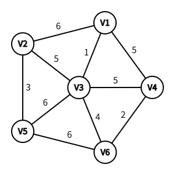

# DS-2015-42

## 1. 原题

图 $G$ 各顶点的连接关系及相应权值如下图所示。

（1）画出该图的邻接矩阵；

（2）从顶点 $V_1$ 开始对图进行广度优先遍历，写成遍历结果；

（3）使用 $Kruskal$ 算法求该图的最小生成树，画出其生成过程。



> 读图转录：$G$ 为无向带权图，顶点集 $\{V_1,V_2,V_3,V_4,V_5,V_6\}$，边集与权值共 $10$ 条：$(V_1,V_2)=6$、$(V_1,V_3)=1$、$(V_1,V_4)=5$、$(V_2,V_3)=5$、$(V_2,V_5)=3$、$(V_3,V_4)=5$、$(V_3,V_5)=6$、$(V_3,V_6)=4$、$(V_4,V_6)=2$、$(V_5,V_6)=6$。图中各边均为直线段、无箭头，故按无向图处理。
>
> 不确定性声明：权值标注与线段端点的对应关系已放大复核（$V_3$ 处引出 $5$ 条边，是读图最密集处）；$(V_3,V_4)=5$ 的标注位于 $V_3$–$V_4$ 水平线上方，$(V_2,V_3)=5$ 的标注位于 $V_2$–$V_3$ 斜线下方，两者不混淆。

## 2. 答案

**（1）邻接矩阵**（$A[i][j]$ 为边的权值，无边记 $\infty$，对角线记 $0$；矩阵关于主对角线对称）

$$
A=\begin{bmatrix}
0 & 6 & 1 & 5 & \infty & \infty\\
6 & 0 & 5 & \infty & 3 & \infty\\
1 & 5 & 0 & 5 & 6 & 4\\
5 & \infty & 5 & 0 & \infty & 2\\
\infty & 3 & 6 & \infty & 0 & 6\\
\infty & \infty & 4 & 2 & 6 & 0
\end{bmatrix}
$$

**（2）从 $V_1$ 出发的广度优先遍历序列**

$$V_1,\;V_2,\;V_3,\;V_4,\;V_5,\;V_6$$

**（3）Kruskal 最小生成树**：依次选入 $5$ 条边

$$(V_1,V_3)_{1},\;(V_4,V_6)_{2},\;(V_2,V_5)_{3},\;(V_3,V_6)_{4},\;(V_2,V_3)_{5}$$

其中权值 $5$ 的 $(V_1,V_4)$、$(V_3,V_4)$ 因成回路被舍去。**最小生成树的权值之和 $=1+2+3+4+5=15$**。

```
以 V3 为根看生成树（括号内为该结点与父结点之间边的权值）：

    V3
    ├── V1 (1)
    ├── V2 (5)
    │   └── V5 (3)
    └── V6 (4)
        └── V4 (2)
```

## 3. 题目分析

- 已知：$6$ 个顶点、$10$ 条边的无向带权图（权值均为正）；
- 目标：① 写出邻接矩阵；② 从 $V_1$ 出发做 BFS 并写出序列；③ 用 Kruskal 求最小生成树并**画出过程**；
- 关键约束：
  - 无向图的邻接矩阵必对称，第 $i$ 行非 $\infty$ 元素个数（不含对角）等于 $V_i$ 的度；
  - BFS 必须"逐层"访问，同层多个邻接点按**下标从小到大**入队（本题未指定邻接点访问次序，取下标升序为默认约定）；
  - Kruskal 按**边**的权值升序选取，判据是"所选边的两个端点是否属于同一连通分量"（即是否成回路），最终必须恰好选 $n-1=5$ 条边；
- 命题意图：一题三问覆盖图的三种基本操作——存储（DS04.02.01）、遍历（DS04.03.02）、应用之最小生成树（DS04.04.01）。本问的图与第 45 题（Dijkstra）不同：本题是无向图，第 45 题是有向图，两者算法不可混用。

## 4. 核心考点

核心考点：
DS04.02.01 邻接矩阵法——带权无向图的矩阵表示（$\infty$ 与 $0$ 的约定、对称性、由行求度）

辅助考点：
DS04.03.02 图的广度优先遍历——队列驱动的"逐层"访问与访问序列唯一性依赖邻接点次序
DS04.04.01 最小生成树——Kruskal"选边判回路"的贪心策略，$n-1$ 条边即终止
DS04.01 图的基本概念——顶点度数与边数的关系 $\sum_{i}\deg(V_i)=2e$（本题 $3+3+5+3+3+3=20=2\times10$）

解释：三问分别考查"表示—遍历—应用"三个层次，属构造（CONSTRUCTION）与走查（TRACE）复合题，最后一步求权值和需基本计算（CALCULATION）。

## 5. 解题思路

1. **建表**：先把图中 $10$ 条边抄成"边表"（端点、权值），再按 $i<j$ 填入 $6\times6$ 矩阵的下三角，最后对称到上三角——先抄边表可避免漏边；
2. **BFS**：用队列，访问 $V_1$ 入队；每次出队一个顶点，把它**所有未访问的邻接点**按编号升序标记并入队；
3. **Kruskal**：把 $10$ 条边按权值升序排队 → 从最小开始逐条试选 → 每选一条就把它的两个端点所在连通分量合并 → 若两端点已同属一个分量则舍（会成回路）→ 选满 $5$ 条即停；
4. **自检**：① 矩阵每行非 $\infty$ 个数与图中该点度数一致；② BFS 序列长度等于顶点数 $6$ 且无重复；③ 生成树恰有 $5$ 条边、连通且无回路。

## 6. 详细解答

**（1）由图抄出边表并建邻接矩阵**

| 边 | 权值 | 边 | 权值 |
|---|---|---|---|
| $(V_1,V_2)$ | 6 | $(V_3,V_4)$ | 5 |
| $(V_1,V_3)$ | 1 | $(V_3,V_5)$ | 6 |
| $(V_1,V_4)$ | 5 | $(V_3,V_6)$ | 4 |
| $(V_2,V_3)$ | 5 | $(V_4,V_6)$ | 2 |
| $(V_2,V_5)$ | 3 | $(V_5,V_6)$ | 6 |

共 $10$ 条边。令 $A[i][j]=w(V_i,V_j)$（有边）、$\infty$（无边，$i\ne j$）、$0$（$i=j$），得第 2 节矩阵。

**度数校验**：各行非 $\infty$（且非对角）元素个数为 $3,3,5,3,3,3$，和为 $20=2\times10$ ✓（与"所有顶点度数之和等于边数的两倍"一致，即本卷第 33 题结论）。其中 $V_3$ 度为 $5$（与其余所有顶点均相邻），是图中唯一的"枢纽点"。

**（2）BFS 逐层执行**（邻接点按编号升序考察）

| 步骤 | 出队顶点 | 其邻接点（升序） | 新访问并入队 | 队列状态 | 已访问序列 |
|---|---|---|---|---|---|
| 初 | — | — | $V_1$ | $[V_1]$ | $V_1$ |
| 1 | $V_1$ | $V_2,V_3,V_4$ | $V_2,V_3,V_4$ | $[V_2,V_3,V_4]$ | $V_1,V_2,V_3,V_4$ |
| 2 | $V_2$ | $V_1,V_3,V_5$ | $V_5$ | $[V_3,V_4,V_5]$ | $\dots,V_5$ |
| 3 | $V_3$ | $V_1,V_2,V_4,V_5,V_6$ | $V_6$ | $[V_4,V_5,V_6]$ | $\dots,V_6$ |
| 4 | $V_4$ | $V_1,V_3,V_6$ | 无（均访问过） | $[V_5,V_6]$ | 不变 |
| 5 | $V_5$ | $V_2,V_3,V_6$ | 无 | $[V_6]$ | 不变 |
| 6 | $V_6$ | $V_3,V_4,V_5$ | 无 | $[]$ | 不变 |

**遍历结果**：$V_1\to V_2\to V_3\to V_4\to V_5\to V_6$。

层次结构：第 $1$ 层 $\{V_1\}$、第 $2$ 层 $\{V_2,V_3,V_4\}$、第 $3$ 层 $\{V_5,V_6\}$。序列长度为 $6$ 且无重复，说明图连通（本卷第 32 题的判据）。

> 说明：BFS 序列并不唯一——它依赖同一顶点的邻接点考察次序。若约定"先访问编号小的邻接点"（教材默认），结果即上式；若改变次序，第 $2$ 层内部与第 $3$ 层内部的相对位置会变，但**分层结果不变**（$V_2,V_3,V_4$ 必在第 $2$ 层，$V_5,V_6$ 必在第 $3$ 层）。

**（3）Kruskal 生成过程**（按权值升序逐条试选）

排序后的边表：

$$1(V_1V_3),\;2(V_4V_6),\;3(V_2V_5),\;4(V_3V_6),\;5(V_1V_4),\;5(V_2V_3),\;5(V_3V_4),\;6(V_1V_2),\;6(V_3V_5),\;6(V_5V_6)$$

| 序 | 考察边（权） | 两端点所属分量 | 判定 | 选定边数 | 连通分量划分 |
|---|---|---|---|---|---|
| 1 | $(V_1,V_3)$，1 | $\{V_1\},\{V_3\}$ | 不同分量 → **选** | 1 | $\{V_1,V_3\}$；其余各成单点 |
| 2 | $(V_4,V_6)$，2 | $\{V_4\},\{V_6\}$ | 不同分量 → **选** | 2 | $\{V_1,V_3\},\{V_4,V_6\}$ |
| 3 | $(V_2,V_5)$，3 | $\{V_2\},\{V_5\}$ | 不同分量 → **选** | 3 | $\{V_1,V_3\},\{V_4,V_6\},\{V_2,V_5\}$ |
| 4 | $(V_3,V_6)$，4 | $\{V_1,V_3\},\{V_4,V_6\}$ | 不同分量 → **选** | 4 | $\{V_1,V_3,V_4,V_6\},\{V_2,V_5\}$ |
| 5 | $(V_1,V_4)$，5 | 同在 $\{V_1,V_3,V_4,V_6\}$ | 成回路 $V_1V_3V_4V_1$ → **舍** | 4 | 不变 |
| 6 | $(V_2,V_3)$，5 | $\{V_2,V_5\},\{V_1,V_3,V_4,V_6\}$ | 不同分量 → **选** | 5 | 全部连通，结束 |

已选满 $n-1=5$ 条边，算法终止，权值 $5$ 的 $(V_3,V_4)$ 与三条权值 $6$ 的边不再考察。

**生成的最小生成树**：

```
以 V3 为根看生成树（括号内为该结点与父结点之间边的权值）：

    V3
    ├── V1 (1)
    ├── V2 (5)
    │   └── V5 (3)
    └── V6 (4)
        └── V4 (2)
```

按"边 + 权"清单书写更清晰：

$$E_{MST}=\{(V_1,V_3,1),\;(V_4,V_6,2),\;(V_2,V_5,3),\;(V_3,V_6,4),\;(V_2,V_3,5)\}$$

**权值之和**：$1+2+3+4+5=15$。

**生成树性质校验**：$6$ 个顶点、$5$ 条边、连通且无回路 ✓（$e=n-1$ 且连通即为树）。

**唯一性说明**：本题最小生成树唯一。理由是第 $6$ 步中连接两个分量 $\{V_2,V_5\}$ 与 $\{V_1,V_3,V_4,V_6\}$ 的候选边只有 $(V_2,V_3)=5$、$(V_1,V_2)=6$、$(V_3,V_5)=6$、$(V_5,V_6)=6$ 四条，最小者唯一；而权值 $5$ 的另两条边 $(V_1,V_4)$、$(V_3,V_4)$ 都落在已连通的分量内部，无论先后都会被舍去，故"并列权值"不影响结果。

**（4）与 Prim 算法的对照（题目未问，供检查用）**

从 $V_1$ 出发用 Prim：选 $1(V_1V_3)\to 4(V_3V_6)\to 2(V_6V_4)\to 5(V_3V_2)\to 3(V_2V_5)$，边集与 Kruskal 完全相同，总权 $15$ ✓。两算法结果一致可作为交叉验证。

## 7. 选项分析

不适用（问答题）。

## 8. 考场标准答案

**（1）邻接矩阵**

$$\begin{bmatrix}0&6&1&5&\infty&\infty\\6&0&5&\infty&3&\infty\\1&5&0&5&6&4\\5&\infty&5&0&\infty&2\\\infty&3&6&\infty&0&6\\\infty&\infty&4&2&6&0\end{bmatrix}$$

（矩阵对称；无边写 $\infty$，对角写 $0$。）

**（2）BFS**：$V_1,\,V_2,\,V_3,\,V_4,\,V_5,\,V_6$（邻接点按编号升序访问）。

**（3）Kruskal 过程**（按权值升序试选，标出舍去原因）：

$$(V_1V_3,1)\checkmark\to(V_4V_6,2)\checkmark\to(V_2V_5,3)\checkmark\to(V_3V_6,4)\checkmark\to(V_1V_4,5)\times\text{回路}\to(V_2V_3,5)\checkmark\ (\text{满 }n-1=5\text{ 条，停})$$

最小生成树为 $\{(V_1,V_3),(V_2,V_3),(V_2,V_5),(V_3,V_6),(V_4,V_6)\}$，权值之和 $=15$。

## 9. 易错点

1. **邻接矩阵的"无边"写成 $0$**：带权图的无边必须写 $\infty$，否则"权值为 $0$ 的边"与"无边"无法区分；只有对角线（顶点到自身）写 $0$；
2. 把无向图画成有向图：矩阵必须对称。若漏掉上三角，就成了第 45 题那类有向图的弧矩阵；
3. **BFS 写成 DFS**：$V_1,V_2,V_5,V_6,V_3,V_4$ 这类"一条路走到底再回溯"的序列是深度优先的结果，本题明确要求广度优先；判据是"第 $2$ 层三个点 $V_2,V_3,V_4$ 必须连续出现在序列前四位"；
4. **Kruskal 与 Prim 混用**：Kruskal 是"全局按边权升序 + 判回路"，Prim 是"从已选顶点集合出发按最小横切边扩张"。若按 Prim 的思路作答，选取顺序会变为 $1,4,2,5,3$，虽然边集相同，但"生成过程"的表述与题目要求不符；
5. 选边时**没有先整体排序**：例如先选了 $(V_3,V_5)=6$，会得到总权 $17$ 的非最小生成树；
6. 忘记"选满 $n-1$ 条即停"：继续考察后面的边不会出错，但卷面冗余；反之若只选了 $4$ 条就收手，图不连通；
7. 舍边时不写原因：$(V_1,V_4)$ 与 $(V_3,V_4)$ 被舍是因为两端点已连通（会成回路），必须标注，这是"画出其生成过程"的得分点。

## 10. 一句话规律

图的一题三问固定套路——**抄边表建对称矩阵（无边 ∞、对角 0）→ 队列逐层 BFS（同层按编号升序）→ Kruskal 全局排边、逐条判回路、选满 $n-1$ 停**；写完用 $\sum\deg=2e$ 与"生成树 $n-1$ 条边且连通"两处自检。

## 11. 关联知识

- 本卷第 32 题（一次遍历能访问所有顶点 ⇒ 连通图）、第 33 题（度数之和 $=2\times$ 边数）、第 34 题（由邻接矩阵求第 $j$ 个结点的度：第 $j$ 行非 $\infty$ 元素个数）正是本题三问的概念化考法；
- DS-2016-41、DS-2020-34、DS-2026-19、本卷第 45 题：同卷/同型的图算法表格题（Dijkstra），可与本题的"无向图 Kruskal"对照复习——**同一张图，最短路径与最小生成树的两个目标不可混用算法**；
- DS-2024-15(2)(3)、DS-2024-16：综合应用题的"多问并列"编排方式与本题相同；
- DS-2013-41（无向图：画出邻接矩阵 + 从顶点 $H$ 开始广度优先遍历）与 DS-2014-42（$6$ 个顶点 $A\sim F$：给出邻接矩阵 + 从顶点 $A$ 开始广度优先遍历）是本题第（1）（2）两问的同型真题，可对照其矩阵抄法与逐层队列过程；
- 教材依据：严蔚敏《数据结构（C 语言版）》7.2 图的存储（邻接矩阵）、7.4 图的遍历（BFS/DFS）、7.5 最小生成树（Kruskal/Prim）。

## 12. 来源与可信度

- 原题来源：2015 回忆版题面篇 `真题/2015/2015重庆邮电大学802数据结构真题.md` 三、问答题第 42 题，题面为文字 + 配图 `fig5.png`，本题**无订正说明**；
- 读图可信度：`fig5.png` 为清晰的重绘矢量图（非手写扫描），$6$ 个顶点、$10$ 条边与全部权值均可直接辨认，已放大复核 $V_3$ 周围的 $5$ 条边；读图结果已在第 1 节完整转录，读者可据此核对而不必依赖图片；
- 答案来源：独立推导（边表→矩阵→BFS 队列走查→Kruskal 逐条判回路，并用 Prim 与 $\sum\deg=2e$ 交叉验证）；未实际抓取解析篇网页，仅按要求登记其地址备查；
- 教材依据：严蔚敏、吴伟民《数据结构（C 语言版）》第 7 章；
- 多来源冲突：无；争议：无。唯一需要声明的口径是 **BFS 中邻接点的访问次序**（本题按编号升序，属通用约定，且分层结果与次序无关）；
- 最终可信度：high。
