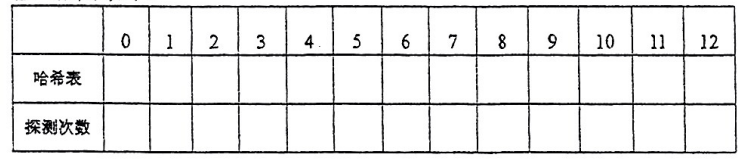

# DS-2015-44

## 1. 原题

已知一组 $Key$ ：（ $19,14,23,01,68,20,84,27,55,11,10,79$ ），按 $H(key)=key \ MOD \ 13$ 和线性探测再散列 $H_i=(H(key)+di)\ MOD\ 13$ 方法处理冲突，请画出最后得到的哈希表并填写相应的探测的次数（完整下列表格即可）。

答：哈希表如下：

> 读图转录：`fig6` 为待填写的空表，表头一行是表址 $0,1,2,\dots,12$（共 $13$ 个地址），下面两行分别是"哈希表"（填关键字）与"探测次数"（填该关键字插入时的探测次数），全部单元格为空。

## 2. 答案

| 表址 | 0 | 1 | 2 | 3 | 4 | 5 | 6 | 7 | 8 | 9 | 10 | 11 | 12 |
|---|---|---|---|---|---|---|---|---|---|---|---|---|---|
| 哈希表 | 空 | 14 | 01 | 68 | 27 | 55 | 19 | 20 | 84 | 79 | 23 | 11 | 10 |
| 探测次数 | — | 1 | 2 | 1 | 4 | 3 | 1 | 1 | 3 | 9 | 1 | 1 | 3 |

等概率查找成功时的平均探测长度：

$$ASL_{\text{成功}}=\frac{1+2+1+4+3+1+1+3+9+1+1+3}{12}=\frac{30}{12}=2.5$$

## 3. 题目分析

- 已知：$12$ 个关键字 $19,14,23,01,68,20,84,27,55,11,10,79$（**按此顺序依次插入**）；散列函数 $H(key)=key\bmod 13$；冲突处理为线性探测再散列 $H_i=(H(key)+d_i)\bmod 13$，其中 $d_i=1,2,3,\dots$；表长 $13$（地址 $0\sim12$）；
- 目标：填出最终的哈希表内容与每个关键字的探测次数；
- 关键约束：
  - 装填因子 $12/13\approx0.92$，表几乎装满，故后面的关键字（尤其 $79$）会被迫做长距离环绕探测；
  - "$d_i$"取 $1,2,3,\dots$ 与"$H_i$ 依次探查 $(H+1),(H+2),\dots$ 模 $13$"是**同一件事**——线性探测是逐格后移，不是 $d_i=1,4,9,\dots$（那是二次探测）；
  - **探测次数的口径**：本题表头写"探测次数"，按教材惯例记为该关键字**插入时探查过的表址个数**（含第一次命中的空址，也含最后一次成功入表的探查），即等于查找该记录所需的比较次数；
- 命题意图：考散列表的完整构造过程与 ASL 计算。本库 2024-16（$H=key\bmod 11$、表长 $11$）与 2026-17（同一键集但表长 $16$）为同型题，可对照体会"表长/装填因子对探测次数的影响"。

## 4. 核心考点

核心考点：
DS05.06.02 散列表构造与 ASL 计算——按插入顺序逐个定址、统计每记录的探测次数并求 $ASL_{\text{成功}}$

辅助考点：
DS05.06.01 散列函数与冲突处理方法——除留余数法 $H=key\bmod p$（此处 $p=13$ 恰为表长且为质数）与线性探测再散列的探查序列
DS05.01 查找的基本概念——平均查找长度（ASL）的定义、"探测次数＝比较次数"的对应关系

解释：本题先要"造表"（CONSTRUCTION），再要"数探测次数"（TRACE），最后要"算 ASL"（CALCULATION），是查找章最典型的综合小题。

## 5. 解题思路

1. 先算出 $12$ 个关键字的初定地址 $H=key\bmod 13$（列一张余数表，避免边插边算出错）；
2. 按**给定顺序**逐个插入：若初定址空 → 放入，探测次数 $=1$；否则依次探查 $(H+1)\bmod 13,(H+2)\bmod 13,\dots$ 直到遇空址，探查了几个地址，探测次数就是几；
3. 每插一个就把表更新一次，后一个基于新表继续；
4. 全部插完后做两项自检：① 表中恰有 $12$ 个关键字、只剩 $1$ 个空址（$0$ 号）；② 各记录探测次数之和 $=30$，且按"每个表址的探查链长度"重数一遍结果相同；
5. 求 $ASL_{\text{成功}}=\dfrac{\sum C_i}{n}$（除以**记录数** $12$，不是表长 $13$）。

## 6. 详细解答

**（1）初定地址表**

| key | 19 | 14 | 23 | 01 | 68 | 20 | 84 | 27 | 55 | 11 | 10 | 79 |
|---|---|---|---|---|---|---|---|---|---|---|---|---|
| $H=key\bmod 13$ | 6 | 1 | 10 | 1 | 3 | 7 | 6 | 1 | 3 | 11 | 10 | 1 |

（$19=13+6$、$23=13+10$、$68=5\times13+3$、$20=13+7$、$84=6\times13+6$、$27=2\times13+1$、$55=4\times13+3$、$79=6\times13+1$。）

可见 $1$ 号地址聚集了 $14,01,27,79$ 四个关键字，$3$ 号聚集 $68,55$，$6$ 号聚集 $19,84$，$10$ 号聚集 $23,10$——冲突非常密集。

**（2）逐个插入过程**

| 序 | key | $H$ | 探查序列（模 13） | 入表地址 | 探测次数 | 说明 |
|---|---|---|---|---|---|---|
| 1 | 19 | 6 | 6 | 6 | 1 | 直接命中空址 |
| 2 | 14 | 1 | 1 | 1 | 1 | 直接命中空址 |
| 3 | 23 | 10 | 10 | 10 | 1 | 直接命中空址 |
| 4 | 01 | 1 | 1→2 | 2 | 2 | $1$ 已被 $14$ 占，后移一格 |
| 5 | 68 | 3 | 3 | 3 | 1 | 直接命中空址 |
| 6 | 20 | 7 | 7 | 7 | 1 | 直接命中空址 |
| 7 | 84 | 6 | 6→7→8 | 8 | 3 | $6(19),7(20)$ 已占 |
| 8 | 27 | 1 | 1→2→3→4 | 4 | 4 | $1(14),2(01),3(68)$ 已占 |
| 9 | 55 | 3 | 3→4→5 | 5 | 3 | $3(68),4(27)$ 已占 |
| 10 | 11 | 11 | 11 | 11 | 1 | 直接命中空址 |
| 11 | 10 | 10 | 10→11→12 | 12 | 3 | $10(23),11(11)$ 已占 |
| 12 | 79 | 1 | 1→2→…→9 | 9 | 9 | $1\sim8$ 全被占，第 $9$ 次探查才遇空址 |

**（3）最终哈希表**（即第 2 节的表，重列以便誊写）

| 表址 | 0 | 1 | 2 | 3 | 4 | 5 | 6 | 7 | 8 | 9 | 10 | 11 | 12 |
|---|---|---|---|---|---|---|---|---|---|---|---|---|---|
| 哈希表 | 空 | 14 | 01 | 68 | 27 | 55 | 19 | 20 | 84 | 79 | 23 | 11 | 10 |
| 探测次数 | — | 1 | 2 | 1 | 4 | 3 | 1 | 1 | 3 | 9 | 1 | 1 | 3 |

**（4）交叉校验**

- 记录数：表中 $12$ 个关键字全部入表，仅 $0$ 号地址为空 ✓（$12$ 个记录占 $12$ 格）；
- 探测次数总和：$1+2+1+4+3+1+1+3+9+1+1+3=30$；
  按"每记录探查格数"重数：$19(1)+14(1)+23(1)+01(2)+68(1)+20(1)+84(3)+27(4)+55(3)+11(1)+10(3)+79(9)=30$ ✓ 两数一致；
- 每条探查链的连通性：$14,01,27,79$ 分别落在 $1,2,4,9$，其间的 $3,5,6,7,8$ 均被同一条链上的其他关键字（$68,55,19,20,84$）填满，符合线性探测"一次冲突、后继成段"的特征 ✓；
- $ASL_{\text{成功}}=30/12=2.5$（分母是**记录数** $12$）。

**（5）补充：查找失败的 $ASL$（题目未要求，列出以便与 2024-16 对照）**

线性探测下"查找失败"= 从某个散列地址出发，一直探查到空址为止。本题空址只有 $0$ 号，故从地址 $j$ 出发的比较次数为 $(13-j)\bmod 13$ 再补 $1$（$j=0$ 时为 $1$），即

| $j$ | 0 | 1 | 2 | 3 | 4 | 5 | 6 | 7 | 8 | 9 | 10 | 11 | 12 |
|---|---|---|---|---|---|---|---|---|---|---|---|---|---|
| 比较次数 | 1 | 13 | 12 | 11 | 10 | 9 | 8 | 7 | 6 | 5 | 4 | 3 | 2 |

$$ASL_{\text{失败}}=\frac{1+13+12+\dots+2}{13}=\frac{91}{13}=7$$

（口径：以 $H$ 值 $0\sim12$ 共 $13$ 个散列地址等概率。装填因子接近 $1$ 时 $ASL_{\text{失败}}$ 会急剧增大，这正是散列表"装太满"的代价。）

## 7. 选项分析

不适用（问答题）。

## 8. 考场标准答案

按 $H(key)=key\bmod 13$、线性探测 $d_i=1,2,3,\dots$ 依次插入，填表如下：

| 表址 | 0 | 1 | 2 | 3 | 4 | 5 | 6 | 7 | 8 | 9 | 10 | 11 | 12 |
|---|---|---|---|---|---|---|---|---|---|---|---|---|---|
| 哈希表 | 空 | 14 | 01 | 68 | 27 | 55 | 19 | 20 | 84 | 79 | 23 | 11 | 10 |
| 探测次数 | — | 1 | 2 | 1 | 4 | 3 | 1 | 1 | 3 | 9 | 1 | 1 | 3 |

$$ASL_{\text{成功}}=\frac{30}{12}=2.5$$

卷面须附冲突说明：$01$ 因 $1$ 号被占探到 $2$；$84$ 探 $6,7$ 后入 $8$；$27$ 探 $1,2,3$ 后入 $4$；$55$ 探 $3,4$ 后入 $5$；$10$ 探 $10,11$ 后入 $12$；$79$ 探 $1\sim8$ 后入 $9$（共 $9$ 次）。

## 9. 易错点

1. **插入顺序被打乱**：必须按题面 $19,14,23,01,\dots$ 的顺序插入。若先按关键字大小排序再插，$27,55,79$ 等的落位会完全不同；
2. **线性探测的增量记错**：$d_i$ 取 $1,2,3,\dots$，故探查地址是 $H+1,H+2,H+3$（模 $13$）逐格后移；若误用 $d_i=i^2$（那是二次探测）或改用链地址法，结果全错；
3. **忘记取模回绕**：$79$ 从地址 $1$ 往后探，若表更满需要越过 $12$ 回到 $0$；本题恰好在 $9$ 号停下，但 $10$ 号关键字 $10$ 的探查链 $10\to11\to12$ 已接近回绕边界，要养成"探到 $12$ 的下一个是 $0$"的习惯；
4. **探测次数少算一次**：探测次数应包含"第一次算出的 $H$"那一次探查。例如 $01$ 探查 $1,2$ 两个地址，答案是 $2$，不是 $1$；$79$ 探查 $1\sim9$ 共 $9$ 个地址，答案是 $9$；
5. **$ASL_{\text{成功}}$ 的分母误用表长 $13$**：查找成功只对 $12$ 个记录等概率，分母必须是记录数 $12$；（分母用 $13$ 的是"查找失败"，见第 6 节第（5）步）；
6. 把 $01$ 写成 $1$、丢掉前导零：题面关键字是两位写法，应照抄 $01$；
7. 冲突链的**传递性**漏算：$79$ 的 $9$ 次探测里有 $8$ 次是在比较**别人的**关键字（$14,01,68,27,55,19,20,84$），这是"一次冲突、连累一片"的聚集现象（primary clustering），不要以为只有与自己同余的关键字才算探测。

## 10. 一句话规律

线性探测造表三步——**先列 $H=key\bmod p$ 的余数表 → 按给定顺序逐个"探到空址为止、探几格记几" → 回填表格并用"总探测次数 ÷ 记录数"求 $ASL_{\text{成功}}$**；查失败时改用"从每个地址探到空址的比较次数 ÷ 地址个数"，两个口径的分母千万别混。

## 11. 关联知识

- DS-2024-16：同型题（$H=key\bmod 11$、表长 $11$、线性探测，要求同时给出 $ASL_{\text{成功}}$ 与 $ASL_{\text{失败}}$），可与本题第 6 节第（5）步对照练习失败口径；
- 本卷第 35 题（"两个不同关键字映射到同一表位置"——答案为**冲突/聚集 collision**）正是本题 $1$ 号地址聚集 $14,01,27,79$ 的概念化考法；
- 本卷第 14 题（"不会发生冲突的哈希函数"）与本题同属 DS05.06.01；
- DS-2016-42：同型题（$H(K)=3K\bmod 11$、线性探测再散列、也要填写探测次数），可对照练习不同散列函数下的探查链；
- DS-2026-17：与本题**同一组关键字、同一个散列函数**，但表长为 $16$（$HT[0\cdots15]$），且额外要求链地址法与 $ASL_{\text{失败}}$——对照可见"表长增大→装填因子下降→探测次数显著减少"，以及开放定址法与链地址法在 ASL 口径上的差异；
- 教材依据：严蔚敏《数据结构（C 语言版）》9.4 散列表（散列函数、线性探测再散列、装填因子与 ASL）。

## 12. 来源与可信度

- 原题来源：2015 回忆版题面篇 `真题/2015/2015重庆邮电大学802数据结构真题.md` 三、问答题第 44 题，题面为文字 + 待填空表 `fig6.png`，本题**无订正说明**；
- 读图可信度：`fig6` 只是**空白表格模板**（表址 $0\sim12$ 共 $13$ 列、"哈希表"与"探测次数"两行），不含任何答案信息，故读图结果仅用于确定"要填哪些字段"，不存在歧义；
- 答案来源：独立推导（余数表 → 逐记录探查链 → 回填 → 总探测次数两种口径交叉核对）；未实际抓取解析篇网页，仅按要求登记其地址备查；
- 教材依据：严蔚敏、吴伟民《数据结构（C 语言版）》第 9 章 9.4 散列表；
- 多来源冲突：无；争议：无。需要声明的口径是**"探测次数"是否包含首次探查**——本题按教材"探查过的地址个数（＝查找该记录的比较次数）"填写，故 $H$ 值直接命中的记录记 $1$ 而非 $0$；若个别辅导书把"冲突后退避的格数"记为探测次数，则每个数都会小 $1$（总和变 $18$、$ASL=1.5$），但那与"平均查找长度＝比较次数之和/记录数"的教材定义不自洽，本库不采；
- 最终可信度：high。
