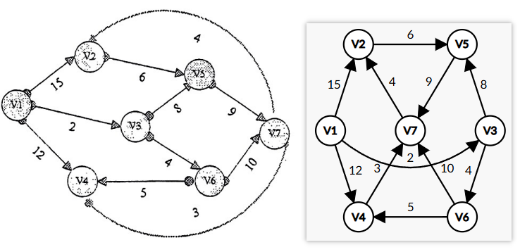
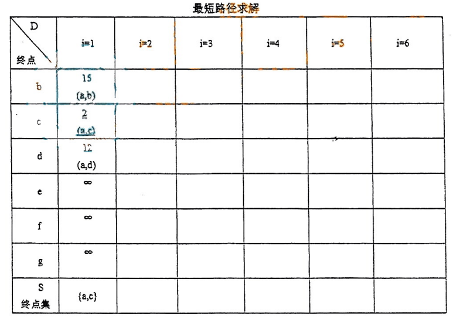

# DS-2015-45

## 1. 原题

利用 $Dijkstra$ 算法求下图中从顶点 $V_1$ 到其他各顶点间的最短路径，完成下表（最短路径有下划线标出）：

> 订正说明转录：源文同一题干重复表述（"从顶点 $V_1$ ……"与"从顶点 $a$ ……"），题图为 $V_1 \sim V_7$ 命名，无顶点 $a$（题干中的 $a\sim g$ 与题图 $V_1\sim V_7$ 一一对应），据图删去多余句。

**标号对应**（依订正说明）：$a\!=\!V_1,\;b\!=\!V_2,\;c\!=\!V_3,\;d\!=\!V_4,\;e\!=\!V_5,\;f\!=\!V_6,\;g\!=\!V_7$。下表按题干（表格 `fig8`）所用的 $a\sim g$ 记号书写。

> 读图转录（以 `fig7` 左半"手写原卷扫描"为准，右半为整理者重绘版）：有向带权图，$7$ 个顶点、$11$ 条弧。
>
> | 弧 | 权 | 弧 | 权 |
> |---|---|---|---|
> | $a\to b$ | 15 | $e\to g$ | 9 |
> | $a\to c$ | 2 | $f\to g$ | 10 |
> | $a\to d$ | 12 | $f\to d$ | 5 |
> | $b\to e$ | 6 | $g\to b$ | 4（图上弧，箭头指向 $b$） |
> | $c\to e$ | 8 | $g\to d$ | 3（图下弧，箭头指向 $d$） |
> | $c\to f$ | 4 | | |
>
> 顶点 $d\,(V_4)$ 无出弧（汇点）。
>
> 不确定性声明：`fig7` 内部并列了两版同一张图，两版在**三处**不同：① $a\to c$ 与 $f\to g$ 的权值在两版中互换（扫描版 $2/10$，重绘版 $10/2$）；② 权 $3$ 的弧方向相反（扫描版 $g\to d$，重绘版 $d\to g$）；③ 其余各弧（含 $c\to e=8$）两版一致。第 ① 处已由 `fig8` 表格预先填好的 $i=1$ 列（"$2$，$(a,c)$"且加下划线、$S=\{a,c\}$）**唯一判定扫描版正确**；第 ② 处无任何文字信息可交叉验证，故本题按扫描版求解、并在第 12 节并列另一口径的结果。

## 2. 答案

完成后的表（下划线表示该轮被选定的终点，"—"表示该终点已在上表轮次入 $S$）：

| 终点 $D$/ 轮次 | i=1 | i=2 | i=3 | i=4 | i=5 | i=6 |
|---|---|---|---|---|---|---|
| $b$ | $15\;(a,b)$ | $15\;(a,b)$ | $15\;(a,b)$ | $15\;(a,b)$ | $\underline{15\;(a,b)}$ | — |
| $c$ | $\underline{2\;(a,c)}$ | — | — | — | — | — |
| $d$ | $12\;(a,d)$ | $12\;(a,d)$ | $11\;(a,c,f,d)$ | $\underline{11\;(a,c,f,d)}$ | — | — |
| $e$ | $\infty$ | $10\;(a,c,e)$ | $\underline{10\;(a,c,e)}$ | — | — | — |
| $f$ | $\infty$ | $\underline{6\;(a,c,f)}$ | — | — | — | — |
| $g$ | $\infty$ | $\infty$ | $16\;(a,c,f,g)$ | $16\;(a,c,f,g)$ | $16\;(a,c,f,g)$ | $\underline{16\;(a,c,f,g)}$ |
| $S$ 终点集 | $\{a,c\}$ | $\{a,c,f\}$ | $\{a,c,f,e\}$ | $\{a,c,f,e,d\}$ | $\{a,c,f,e,d,b\}$ | $\{a,c,f,e,d,b,g\}$ |

**结论**：

| 终点 | 最短距离 | 最短路径 |
|---|---|---|
| $c$ | 2 | $a\to c$ |
| $f$ | 6 | $a\to c\to f$ |
| $e$ | 10 | $a\to c\to e$ |
| $d$ | 11 | $a\to c\to f\to d$ |
| $b$ | 15 | $a\to b$ |
| $g$ | 16 | $a\to c\to f\to g$ |

## 3. 题目分析

- 已知：$7$ 顶点、$11$ 弧的有向带权图（权值均为正，满足 Dijkstra 的适用条件）；源点为 $a\,(V_1)$；`fig8` 给出了表格框架并已填好 $i=1$ 列；
- 目标：按教材表 7-2 的格式逐轮填表，求出 $a$ 到其余各顶点的最短距离与路径；
- 关键约束：
  - 每轮**只允许**做两件事——① 在 $V\setminus S$ 中取 $D$ 最小者入 $S$；② 用该顶点的全部**出弧**松弛其余 $D$ 值（改 $D$ 必须同步改 $path$）；
  - 表格列数 $i=1\sim6$ 对应"确定 $6$ 个终点"的 $6$ 轮（源点 $a$ 自始已定，故 $n-1=6$ 轮）；
  - $i=1$ 列已给定：$b=15(a,b)$、$c=2(a,c)$（下划线，即第 1 轮选定者）、$d=12(a,d)$、$e=f=g=\infty$、$S=\{a,c\}$——这正是"用源点 $a$ 的三条出弧做完初始化、并选定第一个终点 $c$"之后的状态，据此可反推表格各列的语义；
- 命题意图：考 Dijkstra 的**表格化执行过程**（本库 DS-2026-19、DS-2016-41、DS-2020-34 为同型题）。本题弧多（$11$ 条）、且含"绕远更优"的陷阱（$a\to d$ 直连 $12$，但经 $c,f$ 只要 $11$），能真正区分"会背步骤"与"不会松弛"。

## 4. 核心考点

核心考点：
DS04.04.02 最短路径——Dijkstra 单源最短路径的逐轮执行（$D$ 数组、$path$ 数组、$S$ 集合三者同步维护）

辅助考点：
DS04.02.01 邻接矩阵法——从图中正确读出每条弧及其权值（读错一条弧会连锁影响后面所有列）
DS04.01 图的基本概念——有向图中"出弧/入弧"的区分：松弛只看**出弧**，$d$ 无出弧故选中它之后不产生任何更新

解释：本题不写代码，核心是 TRACE（模拟每轮状态）与 CALCULATION（加法取小），并要求把过程规范地"成表"（CONSTRUCTION）。

## 5. 解题思路

1. **抄弧表**：先把 $11$ 条弧连同权值列成表（第 1 节的读图转录），标出每个顶点的出弧清单，避免边算边找图；
2. **写初始列**：$D[a]=0$，$a$ 的出弧终点取弧权、其余取 $\infty$，$path$ 记为 $(a,x)$；
3. **逐轮循环**：未定集合中取最小 $D$ → 入 $S$（表中加下划线）→ 遍历它的出弧 $(u,w)$，若 $D[u]+cost(u,w)<D[w]$ 则同时改 $D[w]$ 与 $path[w]$；
4. 每轮写一列，$S$ 行累加顶点，直到 $6$ 轮填满；
5. **复核**：从源点枚举全部简单路径（本题无负权、且 $d$ 为汇点，路径总数有限），检查每个终点的最小路径长度与表格一致。

## 6. 详细解答

**（1）出弧清单**

| 顶点 | 出弧（终点, 权） |
|---|---|
| $a$ | $(b,15),(c,2),(d,12)$ |
| $b$ | $(e,6)$ |
| $c$ | $(e,8),(f,4)$ |
| $d$ | 无（汇点） |
| $e$ | $(g,9)$ |
| $f$ | $(g,10),(d,5)$ |
| $g$ | $(b,4),(d,3)$ |

**（2）逐轮执行**

**初始（$S=\{a\}$）**：$D[b]=15(a,b)$、$D[c]=2(a,c)$、$D[d]=12(a,d)$、$D[e]=D[f]=D[g]=\infty$。

**i=1**：$\min\{15,2,12,\infty,\infty,\infty\}=2$ → 选 $c$，$S=\{a,c\}$。
 松弛 $c$ 的出弧：$c\to e:\;2+8=10<\infty$ → $D[e]=10(a,c,e)$；$c\to f:\;2+4=6<\infty$ → $D[f]=6(a,c,f)$。
 → 表内 $i=1$ 列即题面已给的 $\{15,2,12,\infty,\infty,\infty\}$。

**i=2**：候选 $\{b\!:\!15,\;d\!:\!12,\;e\!:\!10,\;f\!:\!6\}$，最小 $6$ → 选 $f$，$S=\{a,c,f\}$。
 （$i=2$ 列填 $\{15,-,12,10,6,\infty\}$）

**i=3**：先用 $f$ 松弛：$f\to d:\;6+5=11<12$ → $D[d]=11(a,c,f,d)$（**直连 12 被改判**）；$f\to g:\;6+10=16<\infty$ → $D[g]=16(a,c,f,g)$。
 候选 $\{b\!:\!15,\;d\!:\!11,\;e\!:\!10,\;g\!:\!16\}$，最小 $10$ → 选 $e$，$S=\{a,c,f,e\}$。
 （$i=3$ 列填 $\{15,-,11,10,-,16\}$）

**i=4**：用 $e$ 松弛：$e\to g:\;10+9=19>16$ → **不改**（这是本题最容易算错的一格，必须写出"19 不优"的判断）。
 候选 $\{b\!:\!15,\;d\!:\!11,\;g\!:\!16\}$，最小 $11$ → 选 $d$，$S=\{a,c,f,e,d\}$。
 （$i=4$ 列填 $\{15,-,11,-,-,16\}$）

**i=5**：$d$ 无出弧 → 本轮无松弛。候选 $\{b\!:\!15,\;g\!:\!16\}$，最小 $15$ → 选 $b$，$S=\{a,c,f,e,d,b\}$。
 （$i=5$ 列填 $\{15,-,-,-,-,16\}$）

**i=6**：用 $b$ 松弛：$b\to e:\;15+6=21>10$ → 不改。候选 $\{g\!:\!16\}$ → 选 $g$，$S$ 满。
 用 $g$ 松弛（收尾检查）：$g\to b:\;16+4=20>15$ 不改；$g\to d:\;16+3=19>11$ 不改。
 （$i=6$ 列填 $\{-,-,-,-,-,16\}$）

**（3）路径回溯**

由 $path$ 数组自终点逆向往回追：

| 终点 | $path$ 链 | 路径 | 长度 |
|---|---|---|---|
| $c$ | $a$ | $a\to c$ | 2 |
| $f$ | $c\leftarrow a$ | $a\to c\to f$ | $2+4=6$ |
| $e$ | $c\leftarrow a$ | $a\to c\to e$ | $2+8=10$ |
| $d$ | $f\leftarrow c\leftarrow a$ | $a\to c\to f\to d$ | $2+4+5=11$ |
| $b$ | $a$ | $a\to b$ | 15 |
| $g$ | $f\leftarrow c\leftarrow a$ | $a\to c\to f\to g$ | $2+4+10=16$ |

**（4）枚举全部路径复核**（$d$ 为汇点，故路径不会无限延伸）

| 从 $a$ 出发的路径 | 长度 |
|---|---|
| $a\to b$ | 15 |
| $a\to c$ | 2 |
| $a\to d$ | 12 |
| $a\to b\to e$ | 21 |
| $a\to c\to e$ | 10 |
| $a\to c\to f$ | 6 |
| $a\to b\to e\to g$ | 30 |
| $a\to c\to e\to g$ | 19 |
| $a\to c\to f\to d$ | 11 |
| $a\to c\to f\to g$ | 16 |
| $a\to c\to e\to g\to b$ | 23 |
| $a\to c\to f\to g\to b$ | 20 |
| $a\to c\to e\to g\to d$ | 22 |
| $a\to c\to f\to g\to d$ | 19 |

各终点取最小：$b:\min(15,23,20)=15$ ✓；$c:2$ ✓；$d:\min(12,11,22,19)=11$ ✓；$e:\min(21,10)=10$ ✓；$f:6$ ✓；$g:\min(30,19,16)=16$ ✓。与表格完全一致。

**（5）另一读图口径的结果（供对照）**

若把权 $3$ 的弧读作 $d\to g$（重绘版方向），则 $i=4$ 选中 $d$ 之后可再松弛 $d\to g:\;11+3=14<16$ → $D[g]=14(a,c,f,d,g)$，第 $5$ 轮候选变为 $\{b\!:\!15,\,g\!:\!14\}$，选取次序改为 $c,f,e,d,g,b$，最终 $d(g)=14$，其余五个终点结果不变。

## 7. 选项分析

不适用（问答题）。

## 8. 考场标准答案

按第 2 节的表格逐列誊写（$6$ 列 $\times\,7$ 行，含 $S$ 行），每列在选定的终点下加下划线，并在表旁写出松弛算式：

$$\begin{aligned}
&\text{i=1 选 } c(2):\quad D[e]=2+8=10,\;D[f]=2+4=6\\
&\text{i=2 选 } f(6):\quad D[d]=\min(12,\,6+5)=11,\;D[g]=6+10=16\\
&\text{i=3 选 } e(10):\quad D[g]=\min(16,\,10+9=19)=16\ \text{（不改）}\\
&\text{i=4 选 } d(11):\quad d\ \text{无出弧}\\
&\text{i=5 选 } b(15):\quad D[e]=\min(10,\,15+6=21)=10\ \text{（不改）}\\
&\text{i=6 选 } g(16):\quad D[b]=\min(15,20)=15,\;D[d]=\min(11,19)=11\ \text{（均不改）}
\end{aligned}$$

结论：$d(c)=2$、$d(f)=6$、$d(e)=10$、$d(d)=11$、$d(b)=15$、$d(g)=16$；路径依次为 $ac$、$acf$、$ace$、$acfd$、$ab$、$acfg$。

## 9. 易错点

1. **有向图当无向图做**：$c\to e=8$ 不能反向用于松弛（例如不能由 $e$ 去更新 $c$）；判据是"只看弧头指向的顶点"；
2. **只改 $D$ 不改 $path$**：$d$ 由 $12(a,d)$ 改成 $11(a,c,f,d)$ 时，路径必须同步改写，否则最后路径列全错；
3. **"不优"也要写判断**：$e\to g$ 得 $19$、$b\to e$ 得 $21$、$g\to b/g\to d$ 得 $20/19$，这四格都要显式写"与现值比较后不改"，这是"完成下表"的过程分；
4. **选中汇点 $d$ 后继续"松弛"**：$d$ 没有出弧，本轮只更新 $S$，不产生任何改动——不要为了填格而硬编一条更新；
5. **选取次序按顶点号而非 $D$ 值**：第 $3$ 轮候选 $\{b15,d11,e10,g16\}$，最小是 $e$（$10$）而不是 $d$（$11$）；若按 $b,d,e,f,g$ 的顺序扫过去就会错选 $d$，导致 $D[g]$ 少一次 $16$ 的更新机会；
6. 忘记 $g\to b$、$g\to d$ 这两条**回边**：它们不改变结果，但必须检查过才能确认算法终止（否则会被质疑"是否漏松弛"）；
7. 表格列语义弄错：本题 `fig8` 的 $i=1$ 列是"初始化 + 第 1 次选取"，不是"第 1 次选取后再松弛"；因此 $e=10,f=6$ 应出现在 $i=2$ 列而不是 $i=1$ 列；
8. 读图漏弧：$11$ 条弧若漏掉 $f\to d=5$，$d$ 就停在 $12$，$g$ 也会算错。

## 10. 一句话规律

Dijkstra 表格题固定套路——**每轮"一选（未定中 $D$ 最小）二松弛（改 $D$ 必改 $path$，不优也写判断）三入 $S$"**，$n-1$ 轮 $n-1$ 列填完，最后沿 $path$ 反向回溯写路径，并用"枚举全部路径取最小"独立复核一遍。

## 11. 关联知识

- DS-2026-19：同型题（$5$ 顶点 $6$ 弧、$V_1$ 为源点、按教材表格式成表），其表格列语义与本题一致，可对照；
- DS-2016-41：同型题（源点 $V_0$，表中已给"完成寻找第 $1$ 个最短路径顶点"的提示），编排方式与本题的 $i=1$ 列预填完全相同；
- DS-2020-34：同型题；
- 本卷第 42 题：同一张卷上的**无向图**题（邻接矩阵 + BFS + Kruskal），可与本题对照记忆——"无向图求生成树用 Kruskal/Prim，有向图求单源最短路用 Dijkstra，二者不可混用"；
- 教材依据：严蔚敏《数据结构（C 语言版）》7.5.3 最短路径——Dijkstra 算法（教材表 7-2 即本题表格的格式来源）；
- Dijkstra 的适用前提是**弧权非负**；若出现负权弧须改用 Floyd（本卷未涉及，DS-2024-18 为 Floyd 同型题）或 Bellman 思想；
- 所有顶点对最短路径用 Floyd，单源用 Dijkstra，两者结论在本题图中可互相印证（$a$ 行与 $D$ 数组一致）。

## 12. 来源与可信度

- 原题来源：2015 回忆版题面篇 `真题/2015/2015重庆邮电大学802数据结构真题.md` 三、问答题第 45 题；题面含**订正说明**（已在第 1 节以"订正说明转录："原样转写），并配两图：`fig7`（图）、`fig8`（待完成表格）；
- **争议（本题唯一实质不确定点）**：`fig7` 在同一张图里并列了"手写原卷扫描（左）"与"整理者清晰重绘（右）"两版，两版存在两处冲突：
  1. $a\to c$ 与 $f\to g$ 的权值互换（扫描 $2/10$；重绘 $10/2$）。**已判定扫描版正确**，依据有三：① `fig8` 预填的 $i=1$ 列写着"$2$、$(a,c)$"并加下划线，与 $S=\{a,c\}$ 共同要求 $a\to c=2$；② 扫描版中 $2$ 标注在 $V_1\!\to\!V_3$ 的直线上、$10$ 标注在 $V_6\!\to\!V_7$ 的直线上，箭头端点清晰；③ 若按重绘版，$i=1$ 列应写 $10$ 而非 $2$，与题面自相矛盾。此项不构成最终争议；
  2. 权 $3$ 的弧方向：扫描版底部图内弧的**箭头落在 $V_4$**（放大复核：$V_4$ 圆框右下方有斜线填充的三角箭头，$V_7$ 端仅为弧线出发点、无箭头），故读作 $g\to d$；重绘版则把箭头画在 $V_7$，读作 $d\to g$。此项**无法用题面其他信息交叉验证**，属真实分歧：
     - 采扫描版（本文件主解）：$d(g)=16$，路径 $a\to c\to f\to g$，选取次序 $c,f,e,d,b,g$；
     - 采重绘版：$d(g)=14$，路径 $a\to c\to f\to d\to g$，选取次序 $c,f,e,d,g,b$；其余五个终点的 $d$ 值与路径两版相同。
- 采信理由：原卷扫描为第一手材料，重绘版为他人转绘（且已证实在第 1 处冲突上转绘有误），故箭头方向的证据以扫描版为强；推荐答案取 $d(g)=16$。
- 推荐答案可信度：$d(c),d(f),d(e),d(d),d(b)$ 五项 **high**（两版一致，且经全路径枚举复核）；$d(g)$ 一项 **medium**（依赖上述弧向判断）。
- 答案来源：独立推导（弧表 → 逐轮选点松弛 → $path$ 回溯 → 枚举全部简单路径复核）；未实际抓取解析篇网页，仅按要求登记其地址备查；
- 教材依据：严蔚敏、吴伟民《数据结构（C 语言版）》第 7 章 7.5.3（表 7-2 格式）；
- 因第 12 节第 2 项的读图分歧，本文件 `solution_status` 标为 **disputed**（推荐答案已给出，另一口径完整并列于第 6 节第（5）步与本节）；未编辑共享登记文件。
