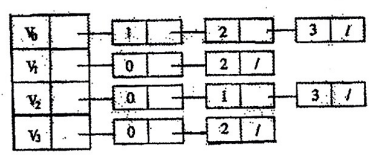

# DS-2016-16

## 1. 原题

已知无向图的邻接表如下图所示，根据算法，则从顶点 $V_0$ 出发按深度优先遍历的顶点序列是（）。

A. $V_1,V_3,V_2,V_0$

B. $V_0,V_2,V_3,V_1$

C. $V_0,V_3,V_2,V_1$

D. $V_0,V_1,V_2,V_3$

> 图读法转录：源图为扫描插图，顶点下标笔迹粘连，按无向图邻接表"边表必成对出现"的约束复核后确认读法为——
> $V_0\to[1]\to[2]\to[3]$；$V_1\to[0]\to[2]$；$V_2\to[0]\to[1]\to[3]$；$V_3\to[0]\to[2]$（方框内为邻接顶点在表头向量中的下标，`/` 表示链尾）。
> 对应边集 $\{(0,1),(0,2),(0,3),(1,2),(2,3)\}$，$4$ 顶点 $5$ 条边，各表长度之和 $3+2+3+2=10=2\times 5$，与握手定理一致，说明读图无漏边、多边。

## 2. 答案

**D**（$V_0,V_1,V_2,V_3$）。

## 3. 题目分析

- 已知：无向图的**邻接表存储**（表头向量顺序 $V_0,V_1,V_2,V_3$，每条边表的结点次序已在图中给定）；
- 目标：从 $V_0$ 出发做深度优先遍历（DFS），写出访问序列；
- 关键约束：**邻接表已经给出，边表结点的先后次序就是算法扫描邻接点的次序**，不得按顶点号重新排序，也不能任意挑选——这是本题"根据算法"四字的含义，也是四个选项只在访问次序上不同的原因；
- 命题意图：考"DFS 的序列由存储结构（邻接表次序）唯一决定"这一认识，同时检验是否会与 BFS 的层次序列、或"每次都取最大号邻点"的逆序 DFS 混淆。

## 4. 核心考点

核心考点：
DS04.03.01 深度优先搜索（DFS 的递归过程：访问→取第一个未访问邻点递归→回溯；深度优先生成树）

辅助考点：
DS04.02.02 邻接表法（表头向量 + 边表；无向图边表结点成对出现；边表次序即邻接点扫描次序）

解释：解题必须先正确读出邻接表的四条边表（DS04.02.02），再按 DFS 定义逐步推进（DS04.03.01）。两节点缺一不可：读错边表则序列全错，次序约定弄错则会误选 B 或 C。

## 5. 解题思路

1. 读图 → 写边集，并用"无向图邻接表必对称 + 度数和 $=2e$"自查（第 1 节括注）；
2. 明确 DFS 规则：`visited[v]=true` 后**从该顶点边表的表头开始**逐个看邻接点，遇到第一个未访问的就立刻递归进去（深度优先），该邻点的所有可达分支走完才回来继续看下一个；
3. 用"栈/递归层次"记录过程：$V_0$（查边表 $1,2,3$）→ $V_1$（查 $0,2$）→ $V_2$（查 $0,1,3$）→ $V_3$（查 $0,2$ 全已访问）→ 逐层回溯；
4. 得序列 $V_0,V_1,V_2,V_3$；
5. 交叉核对：把本图另画成邻接矩阵做同一 DFS（矩阵按列号升序扫描），结果同为 $V_0V_1V_2V_3$；再确认 BFS 序列在本图恰好也是 $V_0,V_1,V_2,V_3$（见第 6 节（4）），说明"答案与 BFS 相同"不代表方法用错。

## 6. 详细解答

**（1）由邻接表写出各顶点的邻接点次序**

| 顶点 | 边表（给定次序） | 邻接点扫描次序 |
|---|---|---|
| $V_0$ | $1\to 2\to 3$ | $V_1,V_2,V_3$ |
| $V_1$ | $0\to 2$ | $V_0,V_2$ |
| $V_2$ | $0\to 1\to 3$ | $V_0,V_1,V_3$ |
| $V_3$ | $0\to 2$ | $V_0,V_2$ |

**（2）DFS 逐步模拟**（`visited` 初值全假）

| 步 | 当前顶点 | 扫描其边表的过程 | 动作 | 访问序列 | 递归栈 |
|---|---|---|---|---|---|
| 1 | $V_0$ | 表头 $1$：$V_1$ 未访问 | 访问 $V_1$，递归进入 | $V_0,V_1$ | $V_0\to V_1$ |
| 2 | $V_1$ | $0$：$V_0$ 已访问；$2$：$V_2$ 未访问 | 访问 $V_2$，递归进入 | $V_0,V_1,V_2$ | $V_0\to V_1\to V_2$ |
| 3 | $V_2$ | $0$ 已访问；$1$ 已访问；$3$：$V_3$ 未访问 | 访问 $V_3$，递归进入 | $V_0,V_1,V_2,V_3$ | $\cdots\to V_3$ |
| 4 | $V_3$ | $0$ 已访问；$2$ 已访问；表尾 | 回溯到 $V_2$ | — | 弹出 $V_3$ |
| 5 | $V_2$ | 边表已扫完 | 回溯到 $V_1$ | — | 弹出 $V_2$ |
| 6 | $V_1$ | 边表已扫完 | 回溯到 $V_0$ | — | 弹出 $V_1$ |
| 7 | $V_0$ | 继续扫 $2$（$V_2$ 已访问）、$3$（$V_3$ 已访问）→ 表尾 | 遍历结束 | $V_0,V_1,V_2,V_3$ | 空 |

$4$ 个顶点全部访问，遍历完成。序列为 $V_0,V_1,V_2,V_3$。

**（3）邻接矩阵法交叉验证**

同一图的邻接矩阵（按行标 $0..3$、列标升序扫描）：

$$
\begin{pmatrix}
0&1&1&1\\
1&0&1&0\\
1&1&0&1\\
1&0&1&0
\end{pmatrix}
$$

$V_0$ 行第一个 $1$ 在第 $1$ 列 → $V_1$；$V_1$ 行跳过第 $0$ 列，第一个未访问的 $1$ 在第 $2$ 列 → $V_2$；$V_2$ 行第一个未访问的 $1$ 在第 $3$ 列 → $V_3$。得 $V_0,V_1,V_2,V_3$ ✓ 与邻接表结果一致（本图中邻接表次序恰好与顶点号升序一致，故两种存储给出同一序列）。

**（4）对照：BFS 序列**

按层扩展：$V_0$（第 $0$ 层）→ $V_1,V_2,V_3$（$V_0$ 的三个邻点，第 $1$ 层）。BFS 序列 $V_0,V_1,V_2,V_3$，与 DFS 相同。这说明"本题两种遍历恰好同序"，判分时应看过程而非只看结果。

**（5）深度优先生成树**

树边为首次发现各点时经过的边：$(V_0,V_1),(V_1,V_2),(V_2,V_3)$，是一条长为 $3$ 的链（本图 $5$ 条边、生成树 $3$ 条边，剩余 $(V_0,V_2),(V_0,V_3)$ 为回边），与 DS-2016-14 中"DFS 树易成瘦高链"的描述一致。

**答案**：D。

## 7. 选项分析

- A. $V_1,V_3,V_2,V_0$：**错**。起点不是题干的 $V_0$；DFS 序列必须从指定顶点开始，首元素即根，此项连起始条件都不满足；
- B. $V_0,V_2,V_3,V_1$：**错**。第二步访问 $V_2$ 意味着在 $V_0$ 的边表中先扫到 $2$，与图中给定的 $1\to 2\to 3$ 次序矛盾（若把邻接表读成 $V_0$ 的边表为 $2,3,1$ 才会得到该序列）；
- C. $V_0,V_3,V_2,V_1$：**错**。这是把每条边表**逆序**扫描的结果：$V_0$ 取表尾邻点 $V_3$，$V_3$ 的边表逆序（$2,0$）取 $V_2$，$V_2$ 的边表逆序（$3,1,0$）跳过已访问的 $V_3$ 取 $V_1$，恰得 $V_0,V_3,V_2,V_1$，属"遍历方向弄反"的典型错误；
- D. $V_0,V_1,V_2,V_3$：**正确**。按边表给定次序（$V_0$ 先取 $V_1$、$V_1$ 再取 $V_2$、$V_2$ 再取 $V_3$）逐层深入，与第 6 节模拟一致。

## 8. 考场标准答案

邻接表给出各边表次序：$V_0:(1,2,3)$、$V_1:(0,2)$、$V_2:(0,1,3)$、$V_3:(0,2)$。

从 $V_0$ 出发按 DFS（访问一个顶点后立即深入其**边表中第一个未访问**邻点）：

$$V_0\xrightarrow{1}V_1\xrightarrow{2}V_2\xrightarrow{3}V_3$$

$V_3$ 的邻点 $V_0,V_2$ 均已访问，依次回溯，遍历结束。序列 $V_0,V_1,V_2,V_3$，选 **D**。

（复杂度：邻接表 DFS 为 $O(n+e)=O(4+5)$；空间为递归栈与 `visited` 数组 $O(n)$。）

## 9. 易错点

1. **无视邻接表给定的次序**，按"顶点号小者优先"或"大者优先"随意选邻点：本题恰好三者一致，不易暴露问题，但如本卷 DS-2016-20 那类"邻接点次序可任选"的题就必须枚举全部分支，两类的判据不同，务必先确认题目给的是哪种次序约定；
2. 把 DFS 写成 BFS：本题两法同序，容易"蒙对"，换图（如 $V_0$ 邻 $V_1,V_2$，$V_1$ 邻 $V_3$）时就会暴露——DFS 是"一条路走到黑再回溯"，BFS 是"一层一层铺"；
3. 忘记"已访问"判断：$V_1$ 的边表首项是 $V_0$（已访问），必须跳过，若回头访问 $V_0$ 会陷入死循环；
4. 读图漏边或多边：无向图每条边在两个边表中各出现一次，用"各表长度之和 $=2e$"自查最省事（见第 1 节括注）。

## 10. 一句话规律

给存储结构写遍历序列的题：**序列由"存储结构中邻接点的存放次序"决定**，DFS 就照"边表从头扫、见未访问立刻深入、走不动才回溯"逐字执行，并把每步的递归栈写出来，答案不会错。

## 11. 关联知识

- 本卷 DS-2016-20（有向图 DFS 序列的可能／不可能判定）与本题同为 DS04.03.01，但那里"邻接点次序可任选"，需枚举全部分支，可与本题"次序已固定"形成对照；
- 本卷 DS-2016-14（BFS 求高度最小生成树）：本题的深度优先生成树是链（高 $3$），而 BFS 生成树是 $V_0$ 挂 $V_1,V_2,V_3$（高 $1$），正是该题结论的一个具体实例；
- 本卷 DS-2016-13／DS-2016-28（度数和 $=2e$）：用于校验邻接表读图是否完整；
- 本卷 DS-2016-33（稀疏图用邻接表省空间）、DS-2016-39（由有向图画邻接表并写 DFS 序列）：邻接表与遍历的组合在问答题中继续考查，其中 DS-2016-39 是有向图版，边表不再对称，需按弧的起终点读；
- 教材 7.4.2 深度优先搜索、7.3.2 邻接表表示法。

## 12. 来源与可信度

- 原题来源：2016 回忆版题面篇 `真题/2016/2016重庆邮电大学802数据结构真题.md` 一、选择题第 16 题，题干无订正说明；题面图片按源文位置转录为 ``；
- 答案来源：独立推导（读邻接表 → 建边集 → 按边表次序模拟 DFS 递归栈 → 邻接矩阵同法复核），两种存储结构结果一致；未抓取解析篇网页，仅按要求登记其地址备查；
- 教材依据：严蔚敏、吴伟民《数据结构（C 语言版）》第 7 章 7.3.2 邻接表法（表头向量与边表、无向图边表结点成对）、7.4.2 深度优先搜索（遍历步骤、深度优先生成树）；
- 多来源冲突：无；争议：无；
- 读图可信度说明：源图为低分辨率扫描插图，表头向量下标 $0,1$ 与数字 $1$ 的笔迹粘连，本解析以"无向图邻接表的对称性 + 度数和 $=2\times$ 边数"双重约束确认了唯一读法（该读法下四条边表两两互为验证，不存在其他自洽解释），故 $ocr\_confidence$ 记 medium，答案可信度仍为 high；
- 最终可信度：high。
