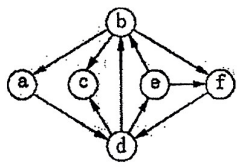

# DS-2016-20

## 1. 原题

已知一个有向图如下图所示，则从顶点 $a$ 出发进行深度优先遍历，不可能得到的深度优先遍历序列为（）。

A. $a,d,b,e,f,c$

B. $a,d,c,e,f,b$

C. $a,d,c,b,f,e$

D. $a,d,e,f,c,b$

> 图读法转录（**源图清晰度有限，须先声明读法**）：原图为网络来源的扫描插图，仅 $238\times167$ 像素，线条与箭头存在粘连、边缘有噪点。本解析把图放大到 $6$ 倍整图、$10$ 倍局部（$b\!-\!e$、$b\!-\!d$、$a\!-\!b$、$a\!-\!d$、$c\!-\!d$、$d\!-\!e$、$e\!-\!f$、$f\!-\!d$ 各区）逐弧核对，读得 $6$ 个顶点、$10$ 条弧：
> $$b\to a,\quad b\to c,\quad b\to f,\quad a\to d,\quad d\to b,\quad d\to c,\quad d\to e,\quad e\to b,\quad e\to f,\quad f\to d$$
> 顶点位置：$b$ 上、$d$ 下、$a$ 左、$f$ 右、$c,e$ 居中偏左右。各弧箭头位置核对结果：$a$ 端、$c$ 端（两条）、$f$ 端（两条）、$d$ 端（两条：$a\to d$、$f\to d$）、$e$ 端（一条：$d\to e$）、$b$ 端（两条：$d\to b$、$e\to b$）均可辨认。
> **不确定处**：$b$ 与 $e$ 之间只画出**一条线段**，且只在 $b$ 端见到箭头（读作 $e\to b$）；扫描件无法排除原图此处是"双向弧（两个箭头）"或"$b\to e$"。该一处不确定正是本题争议的来源，见第 6 节（4）与第 12 节。

## 2. 答案

**推荐 D**（$a,d,e,f,c,b$ 是不可能得到的序列），**可信度 low；本题判为争议题**。

- 按卷面图的确切读法（$b,e$ 间只有 $e\to b$）：A 与 D **都不可能**得到，题目出现双解、失拟；
- 若 $b,e$ 间为双向弧（$b\to e$ 与 $e\to b$ 并存，扫描件丢失 $e$ 端箭头）：A、B、C 都可得到，**只有 D 不可能** ⟹ 唯一答案 D；
- 若 $b,e$ 间只有 $b\to e$：四个选项都能得到，题目无解。

三种读法中只有"双向弧"能给出唯一解，且该唯一解为 D，故推荐 D 并如实标注争议。

## 3. 题目分析

- 已知：一个 $6$ 顶点有向图（顶点 $a,b,c,d,e,f$），从 $a$ 出发做 DFS；
- 目标：四个候选序列中挑出**不可能**是 DFS 序列的那一个；
- 关键约束一（起点固定）：$a$ 的唯一出弧是 $a\to d$，故任何合法序列必以 $a,d$ 开头——四个选项都满足，命题人刻意把干扰放在后续次序上；
- 关键约束二（DFS 的栈性质）：设当前位于顶点 $u$，则下一个被访问的顶点必须是 $u$ 的某个**未访问**邻点（沿出弧）；$u$ 的所有未访问邻点处理完之前**不允许**回溯到 $u$ 的祖先。判"不可能"就靠这条：**要么"下一步"没有对应的弧，要么回溯时机不对（祖先处仍有未访问邻点却先访问了别处的顶点）**；
- 关键约束三（邻接点次序任选）：题面只给图不给邻接表，故同一张图对应**多个**合法 DFS 序列，正确做法是枚举全部分支再与选项比对（与 DS-2016-16"次序由邻接表固定"的情形不同）；
- 命题意图：考 DFS"深入优先、回溯必须等子树处理完"这一执行细节，尤其考"某顶点仍有未访问邻点时不能提前回溯"（选项 D 正卡在这里）。

## 4. 核心考点

核心考点：
DS04.03.01 深度优先搜索（DFS 的递归语义、有向图遍历序列的多解性、由序列反推遍历过程是否合法）

辅助考点：
DS04.01 图的基本概念（有向图中"邻接点"由出弧决定，$e\to b$ 不代表 $b$ 能到 $e$）
DS04.02.02 邻接表法（DFS 序列等价于"给定某一种邻接表次序"下的执行结果，可用邻接表枚举组织解题）

解释：本题的核心是"按 DFS 定义模拟/枚举"（DS04.03.01）；而判 A 是否合法必须先把有向弧的方向读对（DS04.01），$b,e$ 之间的方向之争即本题全部不确定性所在，故列辅助。

## 5. 解题思路

1. 读图写**出弧表**（每个顶点能一步去哪些点），这是判一切的根据；
2. 由 $a$ 的出弧唯一 ⟹ 前两步固定为 $a,d$；
3. 在 $d$ 处分支：$d$ 的未访问邻点为 $\{b,c,e\}$，按"第一步选谁"分三类，逐类把 DFS 的所有可能次序枚举出来（枚举时始终遵守"当前点还有未访问邻点就不许回溯"）；
4. 拿四个选项去比对枚举表：在表中的为"可能得到"，不在表中的为"不可能得到"；
5. 对结果做**敏感性检查**：本题图有不确定处，于是把 $b\!-\!e$ 段的三种可能读法（仅 $e\to b$／仅 $b\to e$／双向）分别重做第 3~4 步，看哪种读法能给出唯一答案——以此判断"命题人最可能的图"，并把不确定性如实写进第 12 节。

## 6. 详细解答

**（1）出弧表（按卷面读法）**

| 顶点 | 出弧（邻接点） | 说明 |
|---|---|---|
| $a$ | $d$ | 唯一出弧 ⟹ 序列必以 $a,d$ 开头 |
| $b$ | $a,c,f$ | 注意：**无** $b\to e$ |
| $c$ | 无 | 汇点，访问 $c$ 后必然回溯 |
| $d$ | $b,c,e$ | 三个分支 |
| $e$ | $b,f$ | 有 $e\to b$ |
| $f$ | $d$ | 回指 $d$ |

**（2）枚举从 $a$ 出发的全部 DFS 序列**

$a\to d$ 固定，按 $d$ 的第一个邻点分类：

- **① $d\to b$**：$b$ 的未访问邻点 $\{c,f\}$
  - $b\to c$：$c$ 无出弧 ⟹ 回溯 $b$ ⟹ $b\to f$ ⟹ $f\to d$（已访问）⟹ 回溯 $b$、回溯 $d$ ⟹ $d\to e$：得 $a,d,b,c,f,e$
  - $b\to f$：$f\to d$ 已访问 ⟹ 回溯 $b$ ⟹ $b\to c$ ⟹ 回溯 $b$、$d$ ⟹ $d\to e$：得 $a,d,b,f,c,e$
- **② $d\to c$**：$c$ 无出弧 ⟹ 回溯 $d$，$d$ 的未访问邻点 $\{b,e\}$
  - $d\to b$：$b$ 只有 $f$ 未访问（$a,c$ 已访问）⟹ $b\to f$ ⟹ $f\to d$ 已访问 ⟹ 回溯 $b$、$d$ ⟹ $d\to e$：得 $a,d,c,b,f,e$ ＝**选项 C** ✓
  - $d\to e$：$e$ 的未访问邻点 $\{b,f\}$
    - $e\to b$：$b\to f$（$a,c$ 已访问）：得 $a,d,c,e,b,f$
    - $e\to f$：$f\to d$ 已访问 ⟹ 回溯 $e$ ⟹ $e\to b$：得 $a,d,c,e,f,b$ ＝**选项 B** ✓
- **③ $d\to e$**：$e$ 的未访问邻点 $\{b,f\}$
  - $e\to b$：$b$ 的未访问邻点 $\{c,f\}$：$b\to c$ 再 $b\to f$ ⟹ $a,d,e,b,c,f$；$b\to f$ 再 $b\to c$ ⟹ $a,d,e,b,f,c$
  - $e\to f$：$f\to d$ 已访问 ⟹ 回溯 $e$ ⟹ $e\to b$（$b$ 仍有未访问邻点 $c$）⟹ $b\to c$：得 $a,d,e,f,b,c$

合计 $8$ 个合法序列：

$$a,d,b,c,f,e;\ a,d,b,f,c,e;\ a,d,c,b,f,e;\ a,d,c,e,b,f;\ a,d,c,e,f,b;\ a,d,e,b,c,f;\ a,d,e,b,f,c;\ a,d,e,f,b,c$$

**（3）比对选项**

- **B** $a,d,c,e,f,b$ ＝ 枚举第 5 个 ⟹ **可能**；
- **C** $a,d,c,b,f,e$ ＝ 枚举第 3 个 ⟹ **可能**；
- **A** $a,d,b,e,f,c$：第三步在 $b$，第四步要访问 $e$，但 $b$ 没有出弧到 $e$（卷面读法只有 $e\to b$），且此时 $b$ 仍有未访问邻点 $c,f$，不允许回溯到 $d$ 再转 $e$ ⟹ **不可能**；
- **D** $a,d,e,f,c,b$：第四步回到 $e$（$f$ 只有 $f\to d$，$d$ 已访问），此时 $e$ 仍有未访问邻点 $b$，DFS 必须立刻访问 $b$，故第五步只能是 $b$ 而不能是 $c$（合法序列应为 $a,d,e,f,\mathbf{b},\mathbf{c}$，D 把 $b,c$ 顺序写反）⟹ **不可能**。

即：**按卷面图，A、D 两个选项都"不可能得到"，题目存在双解。**

**（4）对 $b\!-\!e$ 段读法的敏感性分析（争议的技术核心）**

| $b,e$ 之间的弧 | A 是否可能 | B | C | D 是否可能 | 本题是否有唯一答案 |
|---|---|---|---|---|---|
| 仅 $e\to b$（卷面所见） | ✗ | ✓ | ✓ | ✗ | 否（A、D 双解） |
| 仅 $b\to e$ | ✓（$a,d,b,e,f,c$：$d\to b\to e\to f$，回溯 $b$ 后 $b\to c$） | ✓ | ✓ | ✓（$a,d,e,f$ 后 $e$ 无未访问邻点 ⟹ 回溯 $d$，$d\to c$，再 $d\to b$） | 否（四项全可能，无解） |
| 双向 $b\leftrightarrow e$ | ✓ | ✓ | ✓ | ✗（$e$ 仍有未访问邻点 $b$，不能提前回溯） | **是，唯一答案 D** |
| 该段无线 | ✗（$b$ 无法到 $e$） | ✓ | ✓ | ✓ | 是，唯一答案 A |

结论：**只有"双向弧"或"该段无线"两种读法能使题目有唯一解**，分别得 D 与 A。而图中确实画出了 $b$ 与 $e$ 之间的连线（"无线"读法与图面明显矛盾），故"双向弧 ⟹ 答案 D"是与图面最相容、且能解释命题人设计出 A、B、C 三个合法序列这一事实的读法：在双向弧下，A、B、C 恰好都是真实可达的 DFS 序列，D 恰是"合法序列 $a,d,e,f,b,c$ 的相邻两项对调"，是典型的"回溯时机"陷阱设计。

**（5）D 的违规点单独说明（便于考场复述）**

取前缀 $a,d,e,f$：$f$ 只有 $f\to d$ 且 $d$ 已访问，故 $f$ 处理完回溯到 $e$；**DFS 规定"顶点 $u$ 的邻接表未扫完不得返回 $u$ 的父层"**，而 $e$ 的邻接点 $b$ 尚未访问，因此第五步必须是 $b$。选项 D 第五步写 $c$，而 $c$ 此时只能经 $d$ 或 $b$ 到达，二者都不在递归栈顶 ⟹ 违反 DFS 语义。

**答案**：推荐 D（卷面图读法下 A 同样不可能，详见第 12 节）。

## 7. 选项分析

- A. $a,d,b,e,f,c$：按卷面读法（$b,e$ 间只有 $e\to b$）**不可能**——$b$ 无出弧到 $e$，且 $b$ 尚有未访问邻点 $c,f$ 时不能回溯；若 $b\to e$ 存在（双向弧读法）则**可能**（$a\to d\to b\to e\to f$，回溯至 $b$ 后 $b\to c$）。本解析倾向认为命题人视此项为"可能"，故不取 A 为答案；
- B. $a,d,c,e,f,b$：**可能**。$a\to d\to c$（$c$ 为汇点，回溯 $d$）$\to e\to f$（$f\to d$ 已访问，回溯 $e$）$\to e\to b$，对应枚举第 5 个序列；
- C. $a,d,c,b,f,e$：**可能**。$a\to d\to c$（回溯）$\to b\to f$（回溯 $b$、回溯 $d$）$\to d\to e$，对应枚举第 3 个序列；
- D. $a,d,e,f,c,b$：**不可能**（在全部三种含 $b\!-\!e$ 连线的读法中，只有"仅 $b\to e$"时它才可能）。$f$ 回溯到 $e$ 时 $e$ 的邻点 $b$ 未访问，第五步必须是 $b$；正确写法应为 $a,d,e,f,b,c$。此项是"把合法序列末尾两项对调"的标准干扰设计。

## 8. 考场标准答案

推荐选 **D**。

判据（可书写版）：$a$ 的出弧唯一（$a\to d$），故序列以 $a,d$ 开头；$d$ 的邻点为 $b,c,e$。
考察 D：$a\to d\to e\to f$ 后，$f$ 只有 $f\to d$（$d$ 已访问），回溯到 $e$；此时 $e$ 仍有未访问邻点 $b$，DFS 必须立即访问 $b$，第五步不可能是 $c$（$c$ 只能由 $d$ 或 $b$ 到达，二者均不在栈顶）。故 $a,d,e,f,c,b$ 不是 DFS 序列，而 $a,d,e,f,b,c$ 才是。
其余三项均可给出遍历过程：A 需 $b\to e$（$a,d,b,e,f,c$）、B（$a,d,c,e,f,b$）、C（$a,d,c,b,f,e$）在卷面图上即成立。

（答卷时若担心图意，可附一句"若 $b,e$ 间仅有 $e\to b$，则 A 亦不可得到"。）

## 9. 易错点

1. **把有向弧看成无向边**：$e\to b$ 存在不代表 $b\to e$ 存在，A 项的对错完全悬在这条弧的方向上——这是本题最大的坑，也是本题争议所在；
2. 忽略"回溯时机"：只要当前顶点还有未访问邻点，就必须先把它们处理完，不能提前回到上层（D 项正是靠"过早回溯到 $d$ 去访问 $c$"来制造非法序列）；
3. 只找"一个可行遍历"就下结论：题面未给邻接表次序，必须**枚举全部**分支（本题 $8$ 个序列）才能判定"不可能"，漏枚举会把合法项误判为非法；
4. 忘记 $c$ 是汇点：$c$ 无出弧，访问 $c$ 的下一步必然是回溯，凡"…，c，非 $c$ 的邻点后继…"的写法都要检查回溯后栈顶是谁；
5. 读图不声明约定：源图不清，答题/复核时应先写出自己读到的弧集，否则同一选项会有两种合理判定。

## 10. 一句话规律

判断"某序列能否是 DFS 序列"，只需盯两件事：**每一步是否有对应的有向弧**、**回溯是否发生在"该顶点邻接表已扫完"之后**；把起点固定的分支全部枚举成表，再与选项逐一比对，比凭直觉画一条路径可靠得多。

## 11. 关联知识

- 本卷 DS-2016-16（无向图邻接表上的 DFS 序列）：那里"邻接点次序由邻接表固定"，序列唯一；本题"次序任选"，需枚举多解——两题对照可分清两类 DFS 序列题；
- 本卷 DS-2016-14（BFS 求高度最小生成树）：同一图的两种遍历生成树形态，DFS 的"深入—回溯"特性在本题判非法序列时被反复使用；
- 本卷 DS-2016-15（拓扑排序判环）：本图含环（$b\to f\to d\to b$、$d\to e\to b\to f\to d$ 等），故不存在拓扑序列，也说明"有向图 DFS"与"无环前提"是两件独立的事；
- 本卷 DS-2016-39（由有向图画邻接表并写 DFS 序列）：本题的问答版，需先正确读弧集（同样受图清晰度影响），再按邻接表次序写序列；
- 校验读图完整性的方法见 DS-2016-13：有向图 $\sum$ 出弧 $=\sum$ 入弧 $=e$，本读法下出弧 $1+3+0+3+2+1=10$、入弧（$b$:2、$c$:2、$d$:2、$e$:1、$f$:2、$a$:1）$=10$ ✓ 自洽。

## 12. 来源与可信度

- 原题来源：2016 回忆版题面篇 `真题/2016/2016重庆邮电大学802数据结构真题.md` 一、选择题第 20 题，题干与四个选项无订正说明；题面图片按源文位置转录为 ``；
- **读图可信度声明（源图质量有限）**：`真题/2016/imgs/fig2.png` 为 $238\times167$ 像素的网络扫描插图，笔画粘连、边缘噪点较多。本解析放大至 $6$ 倍（整图）与 $10$ 倍（各弧局部）逐条核对，$10$ 条弧中 $9$ 条方向明确（$b\to a$、$b\to c$、$b\to f$、$a\to d$、$d\to b$、$d\to c$、$d\to e$、$e\to f$、$f\to d$ 的箭头均唯一可辨），且出入弧总数自洽；唯一不可靠处是 **$b$ 与 $e$ 之间的连线**：只画出一条线段，箭头只在 $b$ 端可见（读作 $e\to b$），无法排除原图为双向弧（$e$ 端箭头在扫描中丢失）或 $b\to e$。故 $ocr\_confidence$ 记 low；
- 答案来源：独立推导（出弧表 → 枚举全部 $8$ 个 DFS 序列 → 逐项比对 → 对 $b\!-\!e$ 读法做四情形敏感性分析）。未抓取解析篇网页，仅按要求登记其地址备查；本解析**未采信**任何外部答案；
- 教材依据：严蔚敏、吴伟民《数据结构（C 语言版）》第 7 章 7.4.2 深度优先搜索（有向图 DFS 过程、邻接点次序不同导致序列不唯一）、7.1 图的定义（有向图的弧与邻接、出度入度）；
- 多来源冲突：**无外部来源可比，冲突来自题图本身的两可读法**；
- **争议（未决，须报告）**：
  1. 按卷面读法（$b,e$ 间仅 $e\to b$），A（$a,d,b,e,f,c$）与 D（$a,d,e,f,c,b$）**都不是**可能的 DFS 序列，"不可能得到的序列"有两个，题目失拟；
  2. 若 $b,e$ 间为双向弧，则 A、B、C 均可得到，唯一答案是 **D**；若该处只有 $b\to e$，则四项全可得到（无解）；若该处无线，则唯一答案是 A（但与图面明显矛盾）；
  3. 综合"题目应有唯一解"与"图上确有 $b\!-\!e$ 连线"两点，本解析推荐 **D**，`answer.confidence` 记 low，`solution_status: disputed`；
  4. 按本次任务约定不改动共享文件 `reports/disputed_questions.md`，该争议改在最终汇报中列出。
- 最终可信度：推荐答案 D 的"违规点分析"（回溯时机）可信度 high；"D 为唯一答案"依赖 $b\!-\!e$ 段为双向弧这一假设，可信度 low。
