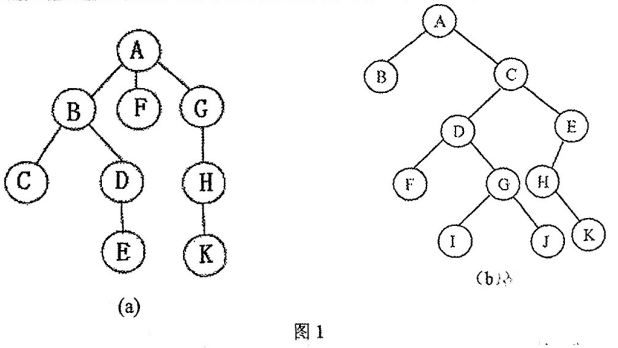

# DS-2016-36

## 1. 原题

将如题图1（a）所示的一棵树转化为对应的二叉树，并画出二叉树；将图 $1$ （b）所示的一棵二叉树转换成森林。



> 读图转录（`fig3` 即卷面"题图 1／图 1"，含 (a)(b) 两小题）：
>
> **图 (a) 是一棵树**，共 $9$ 个结点（字母 $A\sim H$ 加 $K$，不含 $I$、$J$）。按连线自上而下、子女自左向右的通用约定读作：
> 根 $A$ 的三个子女依次为 $B$、$F$、$G$；$B$ 的两个子女为 $C$、$D$；$D$ 的子女为 $E$；$G$ 的子女为 $H$；$H$ 的子女为 $K$；$C$、$E$、$F$、$K$ 为叶子。
> 广义表形式即 $A(B(C,D(E)),F,G(H(K)))$。
>
> **图 (b) 是一棵二叉树**，共 $11$ 个结点 $A\sim K$。按"结点位于父结点左下方即左孩子、右下方即右孩子"读作：
> $A$ 左孩子 $B$、右孩子 $C$；$C$ 左孩子 $D$、右孩子 $E$；$D$ 左孩子 $F$、右孩子 $G$；$E$ 左孩子 $H$、**无右孩子**；$G$ 左孩子 $I$、右孩子 $J$；$H$ **无左孩子**、右孩子 $K$；$B$、$F$、$I$、$J$、$K$ 为叶子。
>
> 本题无订正说明。读图说明：(b) 中 $G$ 与 $H$ 画在同一水平行且彼此紧邻，$G$ 由 $D$ 的右下连线决定（$D$ 的右孩子），$H$ 由 $E$ 的左下连线决定（$E$ 的左孩子），$K$ 由 $H$ 的右下连线决定（$H$ 的右孩子）；这三处已放大图像逐条连线复核，第 6 节末的双向遍历校验亦表明该读法内部自洽。

## 2. 答案

**(1) 图 (a) 的树 → 对应的二叉树**

| 结点 | 左孩子 | 右孩子 |
|---|---|---|
| $A$ | $B$ | $\varnothing$ |
| $B$ | $C$ | $F$ |
| $C$ | $\varnothing$ | $D$ |
| $D$ | $E$ | $\varnothing$ |
| $E$ | $\varnothing$ | $\varnothing$ |
| $F$ | $\varnothing$ | $G$ |
| $G$ | $H$ | $\varnothing$ |
| $H$ | $K$ | $\varnothing$ |
| $K$ | $\varnothing$ | $\varnothing$ |

```
        A
       /
      B
     / \
    C   F
     \   \
      D   G
     /   /
    E   H
       /
      K
```

**(2) 图 (b) 的二叉树 → 对应的森林**（$3$ 棵树）

- $T_1=A(B)$
- $T_2=C(D(F),\;G(I),\;J)$
- $T_3=E(H,\;K)$

```
T1:        T2:              T3:
 A           C               E
 |        /  |  \          /   \
 B       D   G   J        H     K
        /    |
       F     I
```

## 3. 题目分析

- 已知：(a) 一棵**一般树**（存在度大于 $2$ 的结点，如 $A$ 有 $3$ 个子女、$B$ 有 $2$ 个子女）；(b) 一棵**已给出形态的二叉树**；
- 目标：(a) 按"左孩子—右兄弟"规则画出等价二叉树；(b) 按同一规则的**逆过程**拆回森林；
- 关键约束：
  1. 转换是**结点到结点的一一对应**，两小题的结点数必须与原图相同（$9$ 与 $11$），只是指针含义改变；
  2. 子女的**左右次序**必须保持（$A$ 的子女顺序 $B,F,G$ 一旦调换，所得二叉树形态不同）；
  3. (b) 的根 $A$ 存在右链 $A\to C\to E$，右链长度决定森林中树的**棵数**（$3$ 棵）；
- 命题意图：考 DS03.03.02 的正反两个方向。正向（树→二叉树）易在"把右兄弟画成右孩子时漏掉其下方子树"；反向（二叉树→森林）易在"把某结点的右孩子误当成它的孩子"——本题 (b) 中 $J$ 是 $G$ 的右孩子，故 $J$ 是 $C$ 的子女（$G$ 的弟弟）而不是 $G$ 的子女，这是全题最容易失分的一处；
- 表面问题背后的数据结构问题：一般树的**孩子兄弟表示法**（二叉链表）本身就用二叉链表作存储结构，"转换"实为同一份存储的两种**画法**，因此遍历序列必然保持对应（先根↔前序、后根↔中序），这也是本题唯一可靠的自检手段。

## 4. 核心考点

核心考点：
DS03.03.02 森林与二叉树的转换（左孩子—右兄弟规则及其逆用；树/森林与遍历序列的对应）

解释：两问分别是该规则的正向构造与逆向拆解，答案完全由该规则决定，属本节点最直接的双向考查。

辅助考点：
DS03.03.01 树的存储结构（双亲/孩子/孩子兄弟表示法）

解释：转换的合理性正来自"孩子兄弟表示法"用二叉链表存储一般树这一事实；不理解该存储结构就只能背画法，无法处理 (b) 中"右孩子即弟弟"的判断。

DS03.03.03 树和森林的遍历（先根/后根）

解释：本解析第（5）步用"树的先根＝二叉树前序、树的后根＝二叉树中序"作双向校验，属该节点的对应结论。

## 5. 解题思路

1. **先把图抄成表**，不要对着图直接画：(a) 抄成"每个结点的子女有序列表"，(b) 抄成"每个结点的（左孩子，右孩子）对"。抄表能避免读图时左右方位的误判；
2. 记住唯一一条规则并双向使用：
   - 正向（树/森林 → 二叉树）：$p$ 的**左**指针 $\leftarrow$ $p$ 的**第一个孩子**；$p$ 的**右**指针 $\leftarrow$ $p$ 的**下一个亲兄弟**；
   - 反向（二叉树 → 森林）：$p$ 的左孩子 $\Rightarrow$ $p$ 在树中的**大孩子**；沿"左孩子的右链"依次展开 $\Rightarrow$ $p$ 的其余孩子；$p$ 的右孩子 $\Rightarrow$ $p$ 的**弟弟**（同属 $p$ 的父亲）；
3. 定森林的树数：从二叉树根出发沿右链走到底，链上有几个结点就有几棵树（本题 $A\to C\to E$，$3$ 棵）；
4. 逐结点填指针／逐结点拆链，填完立即统计结点数是否与原图一致；
5. **双向校验**：分别写出原树（森林）的先根、后根序列与所得二叉树的前序、中序序列，两对应相等才说明形态没画错——因为"先根＋后根"或"前序＋中序"都能唯一确定形态。

## 6. 详细解答

**（1）规则的形式化**

设 $F$ 为树（或森林）形态，$B$ 为其对应的二叉树，则对每个结点 $p$：

$$p.\mathit{lc}=\mathit{firstchild}_F(p),\qquad p.\mathit{rc}=\mathit{nextsibling}_F(p)$$

反之，由 $B$ 还原 $F$：

$$\mathit{children}_F(p)=\{\,q_0=p.\mathit{lc},\;q_{i+1}=q_i.\mathit{rc}\;\mid\;q_i\ne\varnothing\,\},\qquad \mathit{parent}_F(p.\mathit{rc})=\mathit{parent}_F(p)$$

即"孩子的孩子要串成一条右链"，"右链上的结点全是兄弟、同属一个父亲"。

**（2）(a) 树 → 二叉树：逐结点填指针**

$A$ 的子女表 $[B,F,G]$、$B$ 的 $[C,D]$、$D$ 的 $[E]$、$G$ 的 $[H]$、$H$ 的 $[K]$，其余为叶。

| 结点 | 第一个孩子 ⟹ 左指针 | 下一个兄弟 ⟹ 右指针 |
|---|---|---|
| $A$ | $B$ | 无（$A$ 是根，无兄弟）$\Rightarrow\varnothing$ |
| $B$ | $C$ | $F$（$A$ 的第二个子女） |
| $C$ | 无 $\Rightarrow\varnothing$ | $D$ |
| $D$ | $E$ | 无（$D$ 是 $B$ 的末子女）$\Rightarrow\varnothing$ |
| $E$ | 无 | 无 |
| $F$ | 无 $\Rightarrow\varnothing$ | $G$（$A$ 的第三个子女） |
| $G$ | $H$ | 无 $\Rightarrow\varnothing$ |
| $H$ | $K$ | 无（$H$ 是 $G$ 的独子）$\Rightarrow\varnothing$ |
| $K$ | 无 | 无 |

所得二叉树形态即第 2 节图：根 $A$ **只有左子树**（因为树中根无兄弟，故 $A$ 的右指针必为空——这是“树转二叉树”的形态特征）。其内部结构可直接读作三条“兄弟右链”：$B\to F\to G$（$A$ 的三个子女）、$C\to D$（$B$ 的两个子女）、以及单结点链 $H$、$E$、$K$；每条右链的链头由上一层结点的左指针挂住。

结点数校验：$9=9$ ✓；边数 $8$ ✓。

**（3）(b) 二叉树 → 森林：先定树数**

沿右链自根展开：$A\xrightarrow{\mathit{rc}}C\xrightarrow{\mathit{rc}}E\xrightarrow{\mathit{rc}}\varnothing$

⟹ 森林含 **3 棵树**，根分别为 $A$、$C$、$E$（$C$ 是 $A$ 的"弟弟"、$E$ 是 $C$ 的"弟弟"，在森林中它们互为同级的树根）。

**（4）(b) 逐棵树拆孩子**

- **$T_1$（根 $A$）**：$A.\mathit{lc}=B$ ⟹ $B$ 是 $A$ 的子女；$B.\mathit{rc}=\varnothing$ ⟹ $B$ 无弟弟，$A$ 只有这一个孩子。$B.\mathit{lc}=\varnothing$ ⟹ $B$ 是叶。
 $$T_1=A(B)$$
- **$T_2$（根 $C$）**：$C.\mathit{lc}=D$ ⟹ 大孩子 $D$；沿右链 $D.\mathit{rc}=G$、$G.\mathit{rc}=J$、$J.\mathit{rc}=\varnothing$ ⟹ $C$ 的子女依次为 $D$、$G$、$J$（**注意 $G$、$J$ 是 $D$ 的弟弟，故仍是 $C$ 的孩子**）。再拆第二代：
  - $D.\mathit{lc}=F$，$F.\mathit{rc}=\varnothing$ ⟹ $D$ 只有孩子 $F$；
  - $G.\mathit{lc}=I$，$I.\mathit{rc}=\varnothing$ ⟹ $G$ 只有孩子 $I$（$J$ 已在上一轮被划为 $G$ 的弟弟，不能重复计入）；
  - $J.\mathit{lc}=\varnothing$ ⟹ $J$ 是叶。
 $$T_2=C(D(F),\,G(I),\,J)$$
- **$T_3$（根 $E$）**：$E.\mathit{lc}=H$ ⟹ 大孩子 $H$；$H.\mathit{rc}=K$、$K.\mathit{rc}=\varnothing$ ⟹ $K$ 是 $H$ 的弟弟，即 $E$ 的第二个孩子。$H.\mathit{lc}=\varnothing$、$K.\mathit{lc}=\varnothing$ ⟹ 两者皆叶。
 $$T_3=E(H,\,K)$$

结点总数校验：$|T_1|+|T_2|+|T_3|=2+6+3=11$ ✓（与原图一致，无重无漏）。

**（5）双向遍历校验（本题的"程序验证"）**

*校验 (a)*：原树先根（访问根后依次先根遍历各子树）与后根（依次后根遍历各子树后访问根）：

$$\begin{aligned}
\text{先根}&: A\,B\,C\,D\,E\,F\,G\,H\,K\\
\text{后根}&: C\,E\,D\,B\,F\,K\,H\,G\,A
\end{aligned}$$

所得二叉树的前序（根左右）与中序（左根右），按第（2）步指针表展开：

$$\begin{aligned}
Pre(A)&=A+Pre(B)=A+B+Pre(C)+Pre(F)\\
&=A\,B\,(C+Pre(D))\,(F+Pre(G))=A\,B\,C\,D\,E\,F\,G\,H\,K\\
In(A)&=In(B)+A=(In(C)+B+In(F))\\
&=(C+In(D))+B+(F+In(G))=(C+E\,D)+B+(F+(K\,H)+G)=C\,E\,D\,B\,F\,K\,H\,G\,A
\end{aligned}$$

先根 $=$ 前序 ✓、后根 $=$ 中序 ✓ ⟹ (a) 的指针表无误。

*校验 (b)*：二叉树 (b) 的前序与中序：

$$\begin{aligned}
Pre&: A\,B\,C\,D\,F\,G\,I\,J\,E\,H\,K\\
In&: B\,A\,F\,D\,I\,G\,J\,C\,H\,K\,E
\end{aligned}$$

森林的先根（逐棵树先根后拼接）与后根（逐棵树后根后拼接），按第（3）(4) 步结果：

$$\begin{aligned}
\text{先根}&:\underbrace{A\,B}_{T_1}\;\underbrace{C\,D\,F\,G\,I\,J}_{T_2}\;\underbrace{E\,H\,K}_{T_3}=A\,B\,C\,D\,F\,G\,I\,J\,E\,H\,K\\
\text{后根}&:\underbrace{B\,A}_{T_1}\;\underbrace{F\,D\;I\,G\;J\,C}_{T_2}\;\underbrace{H\,K\,E}_{T_3}=B\,A\,F\,D\,I\,G\,J\,C\,H\,K\,E
\end{aligned}$$

两序列与二叉树前序、中序**逐位相同** ✓ ⟹ (b) 拆出的森林形态唯一正确。

（若把 $J$ 错划为 $G$ 的子女——即“见右孩子就当孩子”——则森林先根仍为 $A\,B\,C\,D\,F\,G\,I\,J\,E\,H\,K$（看不出问题），但后根中 $T_2$ 部分变为 $F\,D\,I\,J\,G\,C$，与二叉树中序的 $F\,D\,I\,G\,J\,C$ 不符，错误立即暴露——这正是“后根对中序”校验的价值。）

## 7. 选项分析

不适用（问答题／作图题）。

## 8. 考场标准答案

**规则一句**：转换采用"左孩子—右兄弟"表示法，即 $p.\mathit{lc}=$ $p$ 的第一个孩子、$p.\mathit{rc}=$ $p$ 的下一个亲兄弟；反向时"左孩子是大孩子、右链上的都是弟弟"。

**(1) 树 $A(B(C,D(E)),F,G(H(K)))$ 对应的二叉树**：

```
        A
       /
      B
     / \
    C   F
     \   \
      D   G
     /   /
    E   H
       /
      K
```

（指针表：$A(B,\varnothing)$、$B(C,F)$、$C(\varnothing,D)$、$D(E,\varnothing)$、$F(\varnothing,G)$、$G(H,\varnothing)$、$H(K,\varnothing)$，$E$、$K$ 为叶；共 $9$ 结点，根无右子树。）

**(2) 二叉树 (b) 对应的森林（3 棵树）**：

```
T1:        T2:              T3:
 A           C               E
 |        /  |  \          /   \
 B       D   G   J        H     K
        /    |
       F     I
```

即 $T_1=A(B)$，$T_2=C(D(F),G(I),J)$，$T_3=E(H,K)$，共 $2+6+3=11$ 结点。

**验算一句**（可附在答卷上）：(a) 树先根 $A\,B\,C\,D\,E\,F\,G\,H\,K$ ＝二叉树前序，树后根 $C\,E\,D\,B\,F\,K\,H\,G\,A$ ＝二叉树中序；(b) 森林先根 $A\,B\,C\,D\,F\,G\,I\,J\,E\,H\,K$ ＝二叉树前序，后根 $B\,A\,F\,D\,I\,G\,J\,C\,H\,K\,E$ ＝二叉树中序，均逐位一致。

## 9. 易错点

1. **把"右孩子"当成"自己的孩子"**（(b) 的 $J$）：$J$ 是 $G$ 的右孩子 ⟹ $J$ 是 $G$ 的**弟弟**，与 $D$、$G$ 同属 $C$ 的子女。错答成 $T_2=C(D(F),G(I,J))$ 是最常见的失分写法，结点总数仍为 $11$，靠计数查不出来，必须靠"后根＝中序"校验；
2. **把"右兄弟"画成"右孩子"时丢掉其子树**（(a) 的 $F$、$G$）：$F$ 是 $B$ 的弟弟，应挂在 $B$ 的右指针上；$G$ 又是 $F$ 的弟弟，挂在 $F$ 的右指针上，形成右链 $B\to F\to G$。若把 $G$ 直接画成 $B$ 的右孩子，$F$ 就"消失"或变成孤立结点；
3. **以为根也要挂右孩子**：树的根无兄弟，故转换后 $A.\mathit{rc}=\varnothing$，整棵二叉树只有左子树。若给 $A$ 配上右孩子，说明把"子女"和"兄弟"混了；
4. **森林树数数错**：树数 $=$ 二叉树中"从根出发的右链长度"，本题右链 $A\to C\to E$ 为 $3$，不是 $C$ 的子女个数、也不是叶子数；
5. **子女次序被改动**：(a) 中 $A$ 的子女顺序是 $B,F,G$（图中自左向右），若按字母序写成 $B,G,F$，得到的二叉树形态不同（$F$、$G$ 的右链互换），阅卷按图判错；
6. **漏空指针造成结点丢失**：(b) 中 $E$ 无右孩子、$H$ 无左孩子，这两处空指针正是"$H$ 是 $E$ 的独子、$K$ 是 $H$ 的弟弟"的依据，读图时若把它们补成非空，就会凭空多出树或错并孩子；
7. 交卷前必做两件事：**数结点**（$9$、$11$）与**对序列**（先根＝前序、后根＝中序），两项都过基本不会错。

## 10. 一句话规律

树/森林与二叉树是**同一份孩子兄弟链表的两张画**：左指针指大孩子、右指针指弟弟；正向"孩子串成右链、链头挂左指针"，反向"沿左指针下树、沿右链收兄弟"，根结点的右链长度就是森林的树数；写完必用"先根＝前序、后根＝中序"对一遍，$10$ 秒即可查出错画的孩子与兄弟。

## 11. 关联知识

- DS-2024-12（$2011$ 个结点、$116$ 个叶子的树，求对应二叉树中右子树为空的结点数）：同一转换规则的**计数**考法——“右子树为空”即“无弟弟”，而有弟弟的结点数为 $\sum\max(0,\deg(v)-1)=(n-1)-$非叶结点数，故所求为 $1+$非叶结点数为 $1+(2011-116)=1896$，与本题的“右指针＝兄弟”是同一句话的两种用法；
- DS-2013-39（$8$ 个结点的森林，其孩子—兄弟存储结构恰为完全二叉树，反向画出森林）：本题第（3）(4) 步"由二叉树拆森林"的同型题，且同样要用右链定树数；
- 本卷 DS-2016-25（广义表 $A(C,D(E,F,G),H(I,J))$ 求树的深度）：广义表与本题 (a) 都是"树的孩子次序"的记法，先会把图抄成子女表，再谈转换；
- 本卷 DS-2016-37（由二叉树图写先序、中序序列）：本题第（5）步校验所需的遍历基本功，两题共用"按左右方位读孩子"这一读图约定；
- DS03.03.01 孩子兄弟表示法：转换之所以不改变结点个数、且使"先根↔前序、后根↔中序"严格对应，根源在于两种画法共用同一二叉链表结构。

## 12. 来源与可信度

- 原题来源：2016 回忆版题面篇 `真题/2016/2016重庆邮电大学802数据结构真题.md` 三、问答题第 36 题，题面为文字 $+$ 配图 `fig3.png`（卷面编号"题图 1／图 1"），**无订正说明**，图按规范以 `` 引用；
- 读图可信度：**medium**。`fig3.png` 为扫描重绘图，(a) 的父子连线与子女左右次序清晰可辨；(b) 中 $G$、$H$ 处于同一水平行且紧邻，$G$ 归属 $D$ 的右孩子、$H$ 归属 $E$ 的左孩子、$K$ 归属 $H$ 的右孩子三处已放大图像逐条连线复核（放大图另存于 `tmp/f3_left.png`、`tmp/f3_right.png`）。为免依赖图片，第 1 节已把两图完整转录为"子女表／左右孩子表"，读者可脱离图片核对；
- 答案来源：独立推导（左孩子—右兄弟规则逐结点填指针、反向拆兄弟链）$+$ 自我验证（双向遍历序列逐位相等、结点数守恒 $9/11$、树数 $=$ 根右链长度三项校验均通过）；未抓取解析篇网页，仅按要求登记其地址备查，未采用任何外部答案；
- 教材依据：严蔚敏、吴伟民《数据结构（C 语言版）》6.3.4 树的存储结构（双亲表示法、孩子表示法、**孩子兄弟表示法**）与 6.3.5 森林与二叉树的转换（转换规则一／转换规则二及作图示例）、6.4.1 树的遍历（先根／后根遍历与二叉树前序／中序的对应关系）；
- 多来源冲突：无；争议：无。**口径说明**：本题按图示通用约定读图——"结点在父结点左下方即左孩子、右下方即右孩子"，(a) 中子女自左向右即为长幼次序；该口径下第（5）步双向遍历校验完全自洽，若改用其他读法（如把 $H$ 读作 $E$ 的右孩子）则校验立即失败，故可认为读图唯一；
- 最终可信度：high（在图示通用读法约定下）。
