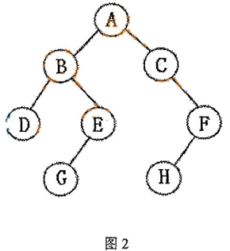

# DS-2016-37

## 1. 原题

如题图 $2$ 所示有一棵二叉树，写出该二叉树的先根遍历（先序遍历）序列和中根遍历（中序遍历）序列。

> 读图转录（`fig4` 即卷面"题图 2／图 2"）：二叉树共 $8$ 个结点 $A\sim H$。按结点在图中的**左右方位**判定孩子归属：
> $A$ 为根，左孩子 $B$、右孩子 $C$；$B$ 的左孩子 $D$、右孩子 $E$；$C$ 无左孩子，右孩子 $F$；$E$ 的左孩子 $G$、无右孩子；$F$ 的左孩子 $H$、无右孩子；$D$、$G$、$H$ 为叶子。
> 本题无订正说明。

## 2. 答案

- **先根遍历（先序遍历，根—左—右）**：$A,\;B,\;D,\;E,\;G,\;C,\;F,\;H$
- **中根遍历（中序遍历，左—根—右）**：$D,\;B,\;G,\;E,\;A,\;C,\;H,\;F$

（附：后序遍历为 $D,\;G,\;E,\;B,\;H,\;F,\;C,\;A$，层序遍历为 $A,\;B,\;C,\;D,\;E,\;F,\;G,\;H$，供自检使用。）

## 3. 题目分析

- 已知：一棵**已画出形态**的二叉树（含"只有右子树""只有左子树"两类非满分支结点）；
- 目标：写出先序与中序两个遍历序列；
- 关键约束：二叉树的左、右子树**不可交换**，图中位于结点左下方者即左孩子、右下方者即右孩子。$C$ 的下方偏右挂着 $F$，$F$ 的下方偏左挂着 $H$——这两处是本题唯一需要小心的读图点；
- 命题意图：考"给定形态 → 手写遍历序列"的基本功（DS03.02.03），重点检查两处空子树（$C$ 的左子树为空、$E$ 的右子树为空）是否被正确处理，而不是把树当成一般树来"从上到下从左到右"读；
- 表面问题背后的数据结构问题：遍历序列是二叉树形态的**线性化编码**，先序定"访问次序"、中序定"左右分界"，两者合起来可唯一还原形态——这正是第 6 节反向验证的依据。

## 4. 核心考点

核心考点：
DS03.02.03 二叉树的遍历——由已给形态写出先序、中序序列，并要求正确处理空子树

辅助考点：
DS03.02.03.01 前序遍历（根先于左右子树访问）
DS03.02.03.02 中序遍历（根夹在左、右子树之间，空左子树时根即为其子树区间的首元素）

解释：本题不涉及遍历互推或构造，只考"按定义走一遍"，但中序里 $C$ 的左子树为空导致 $C$ 紧跟在 $A$ 之后、$E$ 的右子树为空导致 $G$ 之后直接回溯，这两处最能区分"背口诀"与"真会走"，故两个子节点都列出。

## 5. 解题思路

1. **先把树抄成"孩子表"**（第 1 节读图转录），每个结点写清左、右孩子，空则记 $\varnothing$。这样遍历时不必来回看图，也不会把"右孩子"看成"左孩子"；
2. **套递归定义**：先序 $=$ 根 $+$ 先序(左) $+$ 先序(右)；中序 $=$ 中序(左) $+$ 根 $+$ 中序(右)。自顶向下展开，空子树直接跳过；
3. 若习惯用"游标走图"，则先序＝**第一次**经过结点时写下它，中序＝**第二次**（沿左边回到该结点时）写下它，两种方法应得同一结果；
4. **反向验证**：用所得先序与中序重建树（先序首元素为根 → 在中序中定位根 → 左右两侧即左、右子树结点集 → 递归），若还原出的孩子表与第 1 节抄的一致，则两序列必正确（先序 $+$ 中序可唯一确定二叉树）。

## 6. 详细解答

**（1）孩子表**

| 结点 | 左孩子 | 右孩子 | 说明 |
|---|---|---|---|
| $A$ | $B$ | $C$ | 根 |
| $B$ | $D$ | $E$ | |
| $C$ | $\varnothing$ | $F$ | **左子树为空** |
| $D$ | $\varnothing$ | $\varnothing$ | 叶 |
| $E$ | $G$ | $\varnothing$ | **右子树为空** |
| $F$ | $H$ | $\varnothing$ | 左孩子 |
| $G$ | $\varnothing$ | $\varnothing$ | 叶 |
| $H$ | $\varnothing$ | $\varnothing$ | 叶 |

结点数 $n=8$，叶子 $D,G,H$ 共 $n_0=3$，度为 $1$ 的结点 $C,E,F$ 共 $n_1=3$，度为 $2$ 的结点 $A,B$ 共 $n_2=2$。校验 $n_0=n_2+1$（$3=2+1$）✓，且 $n_0+n_1+n_2=8$ ✓——说明孩子表内部自洽（若把 $F$ 误读成 $C$ 的左孩子，$n_1$ 分布会变但仍满足该式，故此校验只能查漏、不能定形，仍需以图为准）。

**（2）先序遍历**（根 → 左 → 右）

$$
\begin{aligned}
Pre(A)&=A + Pre(B) + Pre(C)\\
Pre(B)&=B + Pre(D) + Pre(E)=B + D + (E + G)=B\,D\,E\,G\\
Pre(C)&=C + Pre(\varnothing) + Pre(F)=C + (F + H)=C\,F\,H\\[2pt]
\Rightarrow Pre(A)&=A,\;B,\;D,\;E,\;G,\;C,\;F,\;H
\end{aligned}
$$

**（3）中序遍历**（左 → 根 → 右）

$$
\begin{aligned}
In(A)&=In(B) + A + In(C)\\
In(B)&=In(D) + B + In(E)=D + B + (G + E + \varnothing)=D\,B\,G\,E\\
In(C)&=In(\varnothing) + C + In(F)=\varnothing + C + (H + F)=C\,H\,F\\[2pt]
\Rightarrow In(A)&=D,\;B,\;G,\;E,\;A,\;C,\;H,\;F
\end{aligned}
$$

两处空子树的结果：$C$ 无左孩子，故中序里 $C$ 紧接在 $A$ 之后（$A$ 的左子树走完后访问 $A$，随即进入 $C$）；$E$ 无右孩子，故 $G$（$E$ 的左孩子）之后直接访问 $E$。

**（4）反向验证：由先序 $+$ 中序重建树**

| 步骤 | 先序片段（首元素＝根） | 中序中根的位置 | 结论 |
|---|---|---|---|
| 1 | $A,B,D,E,G,C,F,H$ | $In=\underbrace{D,B,G,E}_{4}\;A\;\underbrace{C,H,F}_{3}$ | 根 $A$；左子树 $4$ 结点、右子树 $3$ 结点 |
| 2 | 左子树先序 $B,D,E,G$ | $D\;\underbrace{B}_{根}\;G,E$ | $B$ 的左子树 $=\{D\}$、右子树 $=\{G,E\}$ |
| 3 | $D$ 单独 | — | $D$ 为 $B$ 的左孩子（叶） |
| 4 | 右子树先序余 $E,G$ | $G\;\underbrace{E}_{根}\;\varnothing$ | $E$ 为 $B$ 的右孩子，$G$ 是 $E$ 的**左**孩子，右孩子空 |
| 5 | 右子树先序 $C,F,H$ | $\varnothing\;\underbrace{C}_{根}\;H,F$ | $C$ 为 $A$ 的右孩子，**左子树空**，右子树 $=\{F,H\}$ |
| 6 | 余 $F,H$ | $H\;\underbrace{F}_{根}\;\varnothing$ | $F$ 为 $C$ 的右孩子，$H$ 是 $F$ 的**左**孩子 |

还原的孩子表与第（1）步完全一致 ✓，故两序列正确。

**（5）遍历次序合理性检查**

- 先序与中序长度均为 $8$、元素集合相同、无重复 ✓；
- 先序首元素必为根 $A$ ✓；中序中 $A$ 把序列分成 $4/3$ 两段，与先序中 $A$ 之后 $B,D,E,G$（$4$ 个）再 $C,F,H$（$3$ 个）的分段一致 ✓；
- 先序中 $C$ 之后紧跟 $F$，说明 $C$ 无左孩子（若有左孩子，其结点应插在 $C$ 与 $F$ 之间）✓。

## 7. 选项分析

不适用（问答题）。

## 8. 考场标准答案

**先根（先序）遍历序列**：$A\;B\;D\;E\;G\;C\;F\;H$

**中根（中序）遍历序列**：$D\;B\;G\;E\;A\;C\;H\;F$

书写时可附一句依据：先序按"根—左—右"，中序按"左—根—右"；其中 $C$ 只有右子树 $F$，$E$ 只有左子树 $G$，$F$ 只有左子树 $H$。

## 9. 易错点

1. **把"只有右子树"的结点读成左子树**：$C\to F$、$E\to G$、$F\to H$ 三处方向不同（$F$ 在 $C$ 的右下、$G$ 在 $E$ 的左下、$H$ 在 $F$ 的左下）。若把 $F$ 当成 $C$ 的左孩子，中序会变成 $D,B,G,E,A,F,H,C$ 一类的错解；
2. **中序写成 $D,B,E,G$**：$E$ 的左孩子是 $G$，中序必须先 $G$ 后 $E$，把 $G$ 排到 $E$ 之后等于把它当成了 $E$ 的右孩子；
3. **先序里把 $H$ 放到 $G$ 前面**：先序是"深度优先、先根"，$A$ 的整棵左子树 $B$ 未走完时不会跳到右子树 $C$，$H$ 属 $C$ 的子孙，必须排在 $C,F$ 之后；
4. 用"从上到下、从左到右"读图（那是**层序**遍历 $A,B,C,D,E,F,G,H$），本题恰好层序就是字母序，容易让人误以为"按字母写"也对——先序、中序都不是层序；
5. 漏写结点：$8$ 个结点一个都不能少，交卷前数一下序列长度是否等于结点数。

## 10. 一句话规律

给定形态写遍历序列，先把树抄成"左孩子—右孩子"表再套递归定义（先序＝根左右、中序＝左根右），空子树直接跳过；写完用"先序 $+$ 中序重建树与原图比对"自检，$10$ 秒即可确认无误。

## 11. 关联知识

- DS03.02.03 的核心结论：**先序 $+$ 中序**或**后序 $+$ 中序**可唯一确定二叉树，先序 $+$ 后序不能——本解析第（4）步正是前半句的应用；
- 本卷 DS-2016-31（由前序 $b,d,c,a,e,f$ 与中序 $c,d,e,a,b,f$ 求后序）是本题的**反向**考法：本题"形态 → 序列"，该题"序列 → 序列"；
- 本卷 DS-2016-36（树转二叉树、二叉树转森林）：转换后"左孩子—右兄弟"的方位判定与本题读图的左右判定是同一套基本功；
- 本卷 DS-2016-11（$n_0=n_2+1$）、DS-2016-27（$257$ 结点完全二叉树的深度）与本题同属 DS03 章，前者是结点计数、本题是遍历；
- 本卷 DS-2016-25（广义表 $A(C,D(E,F,G),H(I,J))$ 求深度）考的是**一般树**，其"先根/后根"遍历与二叉树"先序/中序"不是一回事：一般树没有"中根"概念，这也是本题题干特意在"先根""中根"后括注"先序""中序"的原因。

## 12. 来源与可信度

- 原题来源：2016 回忆版题面篇 `真题/2016/2016重庆邮电大学802数据结构真题.md` 三、问答题第 37 题，题面为文字 $+$ 配图 `fig4.png`（卷面编号"题图 2／图 2"），**无订正说明**；
- 读图可信度：`fig4.png` 为清晰重绘图，$8$ 个结点圆圈、$7$ 条父子连线及每条线相对父结点的左右方位均可辨认，已放大复核 $C\!-\!F$、$E\!-\!G$、$F\!-\!H$ 三处；读图结果已在第 1 节以孩子表形式完整转录，读者可脱离图片核对；
- 答案来源：独立推导（递归定义走查）$+$ 自我验证（先序 $+$ 中序重建树与原图逐边一致、$n_0=n_2+1$ 校验、序列长度与分段校验）；未抓取解析篇网页，仅按要求登记其地址备查，未采用任何外部答案；
- 教材依据：严蔚敏、吴伟民《数据结构（C 语言版）》6.2.3 二叉树的遍历（先序／中序／后序／层序遍历的定义与递归算法）；
- 多来源冲突：无；争议：无。唯一需要声明的口径是"结点在图中的左右方位即左／右孩子"，这是二叉树图示的通用约定，且第（4）步反向验证已表明该口径下形态与序列自洽；
- 最终可信度：high。
