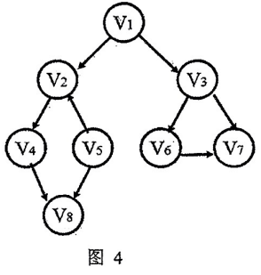

# DS-2016-39

## 1. 原题

如题图 $4$ 是带权的有向图 $G$，画出其邻接表（要求：邻接表中）并根据邻接表写出其深度优先遍历序列。

> 订正说明转录：源文括号内"（要求：邻接表中）"句子残缺（要求内容缺失），无法核实补全，保留原文；另题干称"带权的有向图"而题图无权值标注，作答时请按无权图处理。



> 读图转录（`fig5` 即卷面"题图 4／图 4"）：有向图 $G$，顶点集 $\{V_1,V_2,V_3,V_4,V_5,V_6,V_7,V_8\}$，共 $8$ 个顶点、$9$ 条弧，**图中无任何权值标注**（按订正说明作无权图处理）。全部弧及其在图中的方位：
>
> | 弧 | 图中方位 | 弧 | 图中方位 |
> |---|---|---|---|
> | $V_1\to V_2$ | 顶部 $V_1$ 左下，箭头落 $V_2$ | $V_3\to V_7$ | $V_3$ 右下，箭头落 $V_7$ |
> | $V_1\to V_3$ | 顶部 $V_1$ 右下，箭头落 $V_3$ | $V_6\to V_7$ | 中部水平向右，箭头落 $V_7$ |
> | $V_2\to V_4$ | $V_2$ 左下，箭头落 $V_4$ | $V_4\to V_8$ | $V_4$ 右下，箭头落 $V_8$ |
> | $V_5\to V_2$ | $V_5$ 右上，**箭头落 $V_2$**（方向向上） | $V_5\to V_8$ | $V_5$ 左下，箭头落 $V_8$ |
> | $V_3\to V_6$ | $V_3$ 左下，箭头落 $V_6$ | | |
>
> 两处易读错的箭头方向已放大复核：① $V_2$ 与 $V_5$ 之间的连线，三角箭头在 $V_2$ 端，故为 $V_5\to V_2$ 而非 $V_2\to V_5$；② $V_6$ 与 $V_7$ 之间为水平线，箭头在 $V_7$ 端。

## 2. 答案

**（1）邻接表**（顶点表 $V_1\sim V_8$ 按下标排列；各顶点边表中的邻接点**按编号升序**链接；`∧` 表示空指针）

```
顶点表            边表（出弧）
V1  ──→ [2] ──→ [3] ──→ ∧
V2  ──→ [4] ──→ ∧
V3  ──→ [6] ──→ [7] ──→ ∧
V4  ──→ [8] ──→ ∧
V5  ──→ [2] ──→ [8] ──→ ∧
V6  ──→ [7] ──→ ∧
V7  ──→ ∧
V8  ──→ ∧
```

**（2）深度优先遍历序列**

$$V_1,\;V_2,\;V_4,\;V_8,\;V_3,\;V_6,\;V_7,\;V_5$$

其中前 $7$ 个顶点由 $V_1$ 出发的这一次 DFS 得到；$V_5$ 从 $V_1$ 不可达，须由外层循环第二次调用（从 $V_5$ 起）补访问——$V_5$ 的两条出弧 $V_5\to V_2$、$V_5\to V_8$ 的终点均已访问，故 $V_5$ 是序列末位。

> 本题存在**题面残缺**（见第 12 节）：卷面"要求：邻接表中……"的具体要求文字丢失，而该要求最可能规定的正是边表的链接次序。若按降序（头插法形成的逆序）链接，邻接表与 DFS 序列都会改变，故本题标 `disputed`，两口径并列。

## 3. 题目分析

- 已知：$8$ 顶点、$9$ 弧的有向图（无权，按订正说明处理）；
- 目标：① 画出邻接表；② **根据所画的邻接表**写出深度优先遍历序列；
- 关键约束：
  - 邻接表是**有向图的出弧表**：弧 $(i,j)$ 只在 $V_i$ 的边表中挂一个结点 $j$，$V_j$ 的边表不含 $i$（这是与无向图邻接表最本质的差别，无向图每条边要挂两次）；
  - 第二问明确要求"根据邻接表"写序列，因此 DFS 的分支次序**必须与所画边表的链接次序一致**，不能一边画升序表、一边按别的样子遍历；
  - 图的遍历定义要求访问到**全部** $8$ 个顶点，故从 $V_1$ 一次 DFS 不够，必须补第二次调用（本题 $V_5$ 入度为 $0$ 且不是 $V_1$，从 $V_1$ 不可达）；
- 命题意图：考 DS04.02.02 邻接表的构造（出弧归属、表头指针数组、边结点内容）与 DS04.03.01 DFS 的"沿边表深入、回溯、外层补遍历"三段结构；两问串起来还考"存储结构决定遍历序列"这一因果链；
- 表面问题背后的数据结构问题：同一张图，边表次序不同会得到**不同的** DFS 序列——DFS 序列不是图的固有属性，而是"图 $+$ 存储细节"的属性，这正是残缺的"要求"二字之所以要紧的原因。

## 4. 核心考点

核心考点：
DS04.02.02 邻接表法——有向图邻接表的建表规则（弧只挂在弧尾顶点的边表上）、表头结点数组与边结点的链接结构

辅助考点：
DS04.03.01 深度优先搜索——以邻接表为准的递归下降与回溯、`visited` 数组、外层循环补遍历不可达分量
DS04.01 图的基本概念——有向图中以"出弧／入弧"区分顶点的度（$V_5$ 出度 $2$、入度 $0$，故它是另一个搜索起点）

解释：第一问是纯构造（CONSTRUCTION），第二问是严格按所建结构做执行模拟（TRACE）；而"为什么必须补第二次调用"依赖对有向图可达性、出入度的概念辨析（CONCEPT），故三标签并列。主节点取邻接表法，因为它是两问的共同载体、且第二问被明令"根据邻接表"作答。

## 5. 解题思路

1. **先抄弧表，不直接画图**：把 $9$ 条弧逐条写成"弧尾 → 弧头"清单（第 1 节读图转录），并给每条弧记下图中箭头落点，防止把 $V_5\to V_2$ 看成 $V_2\to V_5$；
2. **用度数校验弧表**：出度之和 $=9$、入度之和 $=9$，两者都必须等于弧数；若把 $V_5\to V_2$ 方向读反，出度和仍为 $9$（不变），但 $V_2$ 的出度会变成 $2$、$V_5$ 的入度会变成 $1$，与图中"$V_5$ 处只有两条指出的箭头、$V_2$ 处有两条指入的箭头"矛盾——故方向须以箭头落点为准，度数校验只作辅助；
3. **按弧尾分组建边表**：把弧表按第一列分组，组内按弧头编号升序串成链表，即得邻接表；
4. **DFS 用递归栈走查**：访问 $V_1$ 并标记 → 顺边表取第一个未访问邻接点递归 → 该邻接点的边表走空后回溯 → 换下一个邻接点；`visited` 数组保证不重复；
5. **收尾检查**：序列长度是否等于 $8$？不足则从下标最小未访问顶点再起一次 DFS；
6. **反向自检**：把所得序列按边表重放一遍，验证每一步"从谁到谁"确实是邻接表里的一条边结点、每次回溯都对应边表走到 `∧`。

## 6. 详细解答

**（1）弧表与度数校验**

| 顶点 | 出弧（弧头） | 出度 | 入弧（弧尾） | 入度 |
|---|---|---|---|---|
| $V_1$ | $V_2,V_3$ | 2 | — | 0 |
| $V_2$ | $V_4$ | 1 | $V_1,V_5$ | 2 |
| $V_3$ | $V_6,V_7$ | 2 | $V_1$ | 1 |
| $V_4$ | $V_8$ | 1 | $V_2$ | 1 |
| $V_5$ | $V_2,V_8$ | 2 | — | 0 |
| $V_6$ | $V_7$ | 1 | $V_3$ | 1 |
| $V_7$ | — | 0 | $V_3,V_6$ | 2 |
| $V_8$ | — | 0 | $V_4,V_5$ | 2 |

$$\sum \text{出度}=2+1+2+1+2+1+0+0=9,\qquad \sum \text{入度}=0+2+1+1+0+1+2+2=9$$

两者相等且等于弧数 $9$ ✓（有向图中"出度之和 $=$ 入度之和 $=$ 弧数"）。$V_1,V_5$ 入度为 $0$（源点型顶点），$V_7,V_8$ 出度为 $0$（汇点型顶点）。

**（2）建邻接表**

有向图邻接表的建表规则：为每个顶点设一个表头结点（`firstadj` 指针），弧 $(V_i,V_j)$ 生成一个边结点 `j` 并插入 $V_i$ 的边表；$V_j$ 的边表**不**因此增加结点。按组内编号升序链接即得第 2 节的图。

若采用教材的边结点形式（含邻接点序号与下一条弧的指针）：

| 表头 | 边结点 1 | 边结点 2 |
|---|---|---|
| $V_1$ | $adjvex=2,\;next\to$ | $adjvex=3,\;next=\wedge$ |
| $V_2$ | $adjvex=4,\;next=\wedge$ | |
| $V_3$ | $adjvex=6,\;next\to$ | $adjvex=7,\;next=\wedge$ |
| $V_4$ | $adjvex=8,\;next=\wedge$ | |
| $V_5$ | $adjvex=2,\;next\to$ | $adjvex=8,\;next=\wedge$ |
| $V_6$ | $adjvex=7,\;next=\wedge$ | |
| $V_7$ | $\wedge$（无边表） | |
| $V_8$ | $\wedge$（无边表） | |

边结点总数 $=9$，等于弧数 ✓（无向图应为 $2e$，有向图为 $e$，这是判"是否误按无向图建表"的硬指标）。

**（3）DFS 逐层走查**（从 $V_1$ 起，边表按升序）

| 步 | 当前顶点 | 正在考察的边表位置 | 动作 | 递归栈（栈顶在右） | `visited` 为真的顶点 |
|---|---|---|---|---|---|
| 1 | $V_1$ | — | 访问 $V_1$ | $[V_1]$ | $V_1$ |
| 2 | $V_1$ | $adjvex=2$ | $V_2$ 未访问 → 访问并递归 | $[V_1,V_2]$ | $V_1,V_2$ |
| 3 | $V_2$ | $adjvex=4$ | $V_4$ 未访问 → 访问并递归 | $[V_1,V_2,V_4]$ | $V_1,V_2,V_4$ |
| 4 | $V_4$ | $adjvex=8$ | $V_8$ 未访问 → 访问并递归 | $[V_1,V_2,V_4,V_8]$ | $V_1,V_2,V_4,V_8$ |
| 5 | $V_8$ | $\wedge$ | 边表空 → **回溯**到 $V_4$ | $[V_1,V_2,V_4]$ | 不变 |
| 6 | $V_4$ | 已到 $\wedge$ | **回溯**到 $V_2$ | $[V_1,V_2]$ | 不变 |
| 7 | $V_2$ | 已到 $\wedge$ | **回溯**到 $V_1$ | $[V_1]$ | 不变 |
| 8 | $V_1$ | $adjvex=3$ | $V_3$ 未访问 → 访问并递归 | $[V_1,V_3]$ | $\dots,V_3$ |
| 9 | $V_3$ | $adjvex=6$ | $V_6$ 未访问 → 访问并递归 | $[V_1,V_3,V_6]$ | $\dots,V_6$ |
| 10 | $V_6$ | $adjvex=7$ | $V_7$ 未访问 → 访问并递归 | $[V_1,V_3,V_6,V_7]$ | $\dots,V_7$ |
| 11 | $V_7$ | $\wedge$ | 回溯到 $V_6$；$V_6$ 亦到 $\wedge$ → 回溯到 $V_3$ | $[V_1,V_3]$ | 不变 |
| 12 | $V_3$ | $adjvex=7$ | $V_7$ 已访问 → **跳过**，继续到 $\wedge$ → 回溯到 $V_1$ | $[V_1]$ | 不变 |
| 13 | $V_1$ | 已到 $\wedge$ | 第一次 DFS 结束 | $[]$ | $V_1,V_2,V_3,V_4,V_6,V_7,V_8$（共 $7$ 个） |
| 14 | — | 外层循环 | 找最小下标未访问顶点 $=V_5$ → 第二次 DFS：访问 $V_5$；其边表 $adjvex=2$ 已访问、$adjvex=8$ 已访问 → 结束 | $[V_5]\to[]$ | 全部 $8$ 个 |

**第一次 DFS 序列**：$V_1,V_2,V_4,V_8,V_3,V_6,V_7$
**完整遍历序列**：$V_1,V_2,V_4,V_8,V_3,V_6,V_7,V_5$

**（4）结果校验**

- 序列长度 $8$ 等于顶点数、无重复 ✓；
- 每一步"父子跳转"都对应邻接表中的一个边结点：$V_1\to V_2$（$V_1$ 表第 $1$ 个）、$V_2\to V_4$ ✓、$V_4\to V_8$ ✓、$V_1\to V_3$（$V_1$ 表第 $2$ 个）、$V_3\to V_6$ ✓、$V_6\to V_7$ ✓、$V_5$（外层补）✓；
- DFS 树（生成森林）的父子关系：$V_1\{V_2\{V_4\{V_8\}\}\},\,V_3\{V_6\{V_7\}\}\}$ 加孤立根 $V_5$——共 $2$ 棵 DFS 树，对应有向图以"弱连通分量 $+$ 不可达顶点"计的两个搜索起点；
- 反向核对：$V_5$ 的入度为 $0$，任何从别的顶点出发的搜索都不可能到达它，故它**必定**出现在某次单独调用的起点位置——这从结构上确认了"必须补第二次调用"，不是遗漏。

**（5）另一口径：边表按邻接点编号降序链接**

若残缺的"要求"规定的是降序（或按"头插法"依次读入 $V_1\to V_2,V_1\to V_3$ 等弧而自然形成的逆序），邻接表变为：

```
V1 ──→ [3] ──→ [2] ──→ ∧      V5 ──→ [8] ──→ [2] ──→ ∧
V2 ──→ [4] ──→ ∧              V6 ──→ [7] ──→ ∧
V3 ──→ [7] ──→ [6] ──→ ∧      V7 ──→ ∧
V4 ──→ [8] ──→ ∧              V8 ──→ ∧
```

DFS 走查：$V_1\to V_3\to V_7$（回溯）$\to V_6$（$V_7$ 已访问，跳过）（回溯）（回溯）$\to V_2\to V_4\to V_8$，第一次得 $V_1,V_3,V_7,V_6,V_2,V_4,V_8$；再补 $V_5$。

**降序口径的完整序列**：$V_1,\;V_3,\;V_7,\;V_6,\;V_2,\;V_4,\;V_8,\;V_5$

两口径的邻接表与 DFS 序列都不同，但**弧集、度数表、"必须补访问 $V_5$"三点完全一致**——差异只源于边表次序这一卷面未规定项。

## 7. 选项分析

不适用（问答题）。

## 8. 考场标准答案

**(1) 邻接表**（先写规则一句："有向图的邻接表中，弧 $(V_i,V_j)$ 只作为边结点 $j$ 挂在 $V_i$ 的边表上"，再画图）

```
V1 → [2] → [3] ∧        V5 → [2] → [8] ∧
V2 → [4] ∧              V6 → [7] ∧
V3 → [6] → [7] ∧        V7 → ∧
V4 → [8] ∧              V8 → ∧
```

（边表按邻接点编号升序；边结点共 $9$ 个，等于弧数。）

**(2) 深度优先遍历序列**（从 $V_1$ 起，沿边表顺序取未访问邻接点）

$$V_1\to V_2\to V_4\to V_8\to V_3\to V_6\to V_7,\qquad V_1\ \text{不可达}\ V_5,\ \text{第二次调用访问}\ V_5$$

$$\boxed{\,V_1,\;V_2,\;V_4,\;V_8,\;V_3,\;V_6,\;V_7,\;V_5\,}$$

答题时务必注明"$V_5$ 入度为 $0$，从 $V_1$ 出发不可达，需由遍历外层循环再起一次 DFS"，这是本题的采分点。

## 9. 易错点

1. **把有向图的邻接表按无向图画**：给 $V_2$ 的边表也挂上 $1$ 和 $5$（即"入弧也挂"），边结点变成 $18$ 个。有向图若要把入弧也组织起来须另建**逆邻接表**，本题只要求邻接表；
2. **把 $V_5\to V_2$ 读成 $V_2\to V_5$**：这样 $V_2$ 的边表多出 $5$，DFS 会变成 $V_1,V_2,V_4,V_8,V_5,V_3,V_6,V_7$ 一类的错解，且 $V_5$ 不再需要第二次调用——一个箭头读错，两问全错。判据是"看三角箭头落在哪个圆框上"；
3. **漏掉 $V_5$**：只写 $7$ 个顶点就交卷。"图的遍历"定义要求访问全部顶点，$V_5$ 入度为 $0$ 决定了它必须单独起一次搜索；
4. **回溯次序搞错**：从 $V_8$ 回溯时应回到 $V_4$，$V_4$ 边表已空再回到 $V_2$、$V_2$ 也空再回到 $V_1$，然后才轮到 $V_1$ 的第二个邻接点 $V_3$。若写成"$V_8$ 之后直接访问 $V_3$"，等于把 DFS 做成了"栈里还留着 $V_2,V_4$ 就跳去别的分支"；
5. **边表次序与遍历次序不一致**：画的是升序表、走的是降序路（或反过来）。第二问被明令"根据邻接表写出"，两问必须互洽；
6. 忘了 $V_6\to V_7$ 这条**水平弧**（图中 $V_6$、$V_7$ 并排在同一高度，视觉上更像同一层的兄弟而非有弧相连），漏掉它会使 $V_7$ 改由 $V_3$ 直接访问，序列变为 $V_1,V_2,V_4,V_8,V_3,V_7,V_6,V_5$。

## 10. 一句话规律

有向图邻接表三句话——**弧只挂在弧尾上（边结点数 $=e$）、入度为 $0$ 的点别人到不了、遍历必须靠外层循环把没访问到的点逐个再起一次 DFS**；DFS 序列由"图 $+$ 边表链接次序"共同决定，换了边表次序序列就变，所以画表和走查一定要用同一份表。

## 11. 关联知识

- DS04.02.02 与 DS04.02.03：邻接表（出弧）／逆邻接表（入弧）／十字链表（出入弧兼顾）的分工——本题若还要求"求任一顶点的入度"，邻接表就得整表扫描，那正是逆邻接表或十字链表的用武之地（本卷 DS-2016-33 讨论稀疏图省空间即取邻接表）；
- DS-2016-16（无向图邻接表 → 从 $V_0$ 出发的 DFS 序列）、DS-2016-20（有向图 → 从 $a$ 出发不可能的 DFS 序列）：本卷选择题中同一考点的两种考法，与本题互为"选择版／解答版"；
- DS-2015-42（无向带权图：邻接矩阵 $+$ BFS $+$ Kruskal）：与本题构成"同一份图，两种存储、两种遍历、两种应用"的对照组；
- DS-2016-38（同卷上一题）：该题题图缺失不可作答，本题的"读图抄弧表 → 度数校验"流程正是那类题的第一手方法，可移用；
- DS-2016-41（同卷下一题）：同一张卷上"按图逐轮成表"的 Dijkstra 题，其"读图必须逐条核对箭头与权值"的要求与本题第 9 节第 2 条同源；
- 教材依据：严蔚敏《数据结构（C 语言版）》7.2.2 邻接表法、7.4.1 深度优先搜索（含"一次 DFS 只能访问一个连通分量，故需外层循环"的结论）。

## 12. 来源与可信度

- 原题来源：2016 回忆版题面篇 `真题/2016/2016重庆邮电大学802数据结构真题.md` 三、问答题第 39 题，题面为文字 $+$ 配图 `fig5.png`（卷面编号"题图 4／图 4"），**含订正说明**（已在第 1 节以"订正说明转录："原样转写）；
- 读图可信度：`fig5.png` 为清晰重绘图，$8$ 个顶点圆圈与 $9$ 条带箭头弧线均可辨认，已放大复核 $V_2\!-\!V_5$、$V_6\!-\!V_7$ 两处箭头落点；弧表与度数表已在第 1、6 节完整转录，可脱离图片核对。读图部分可信度 **high**；
- **争议（未决，须报告）**：题干"画出其邻接表（要求：邻接表中）"括号内句子残缺，"要求"的具体内容丢失。按此类题的常见命题写法，该处最可能是对**边表链接次序**的规定（"邻接表中各边结点按邻接点序号从小到大／从大到小链接"），也可能是对建表方法（头插／尾插）的规定；无论哪一种，都直接改变邻接表形态与 DFS 序列。故：
  - 主口径（本文件第 2、6 节）：边表按邻接点编号**升序**，DFS 为 $V_1,V_2,V_4,V_8,V_3,V_6,V_7,V_5$；
  - 备口径（第 6 节第（5）步）：边表按**降序**（等价于头插法依次插入 $V_1\to V_2$、$V_1\to V_3$ 等弧），DFS 为 $V_1,V_3,V_7,V_6,V_2,V_4,V_8,V_5$。
  两口径均完整给出，未静默择一。
- **第二处题面缺陷（已由订正说明给出处理，不构成新争议）**：题干称"带权的有向图"，而 `fig5` 无任何权值标注。按订正说明以**无权图**处理，邻接表的边结点因此只有 `adjvex` 与 `next` 两项、不含 `weight` 域。若原卷确为带权图，则权值数据已随图丢失，本题的"带权"部分同样不可作答——此点亦计入 `disputed` 的理由；
- 答案来源：独立推导（弧表 → 出入度校验 → 建表 → 递归栈走查 → 逐边反向核对）；未抓取解析篇网页，仅按要求登记其地址备查，未采用任何外部答案；
- 不受争议影响、可信度 high 的结论：弧集与度数表、边结点总数 $=9$、"$V_5$ 从 $V_1$ 不可达因而必须补第二次 DFS"；
- 教材依据：严蔚敏、吴伟民《数据结构（C 语言版）》7.2.2、7.4.1；
- 最终可信度：**medium**（结构与校验过程 high；因"要求"残缺导致的口径选择为 medium），`solution_status: disputed`。按本次任务约定不改动共享文件 `reports/disputed_questions.md`，该争议改在最终汇报中列出。
