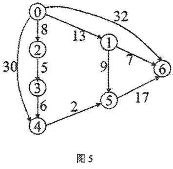
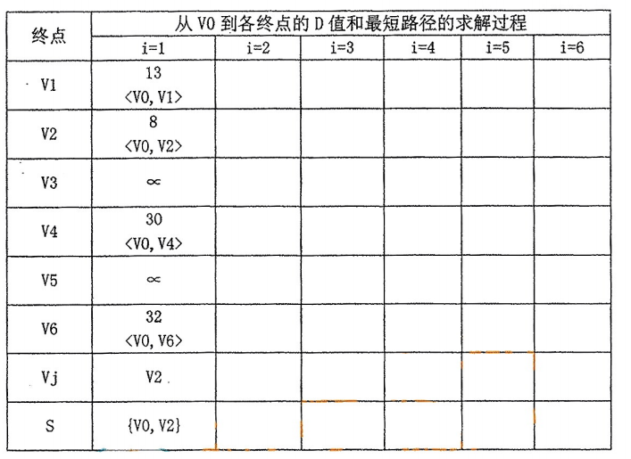

# DS-2016-41

## 1. 原题

请用迪杰斯特拉（$Dijkstra$）算法求出图 $5$ 中从顶点 $V_0$（标号为 $0$ 的顶点）到其他各顶点间的最短路径，请根据表中已经完成的寻找第 $1$ 个最短路径的点提示完成下表。

> 读图转录（`fig6` 即卷面"图 5"）：有向带权图，顶点 $\{0,1,2,3,4,5,6\}$，共 $10$ 条弧（下表用题表记号 $V_k$ 表示标号 $k$ 的顶点）：
>
> | 弧 | 权 | 弧 | 权 |
> |---|---|---|---|
> | $V_0\to V_1$ | 13 | $V_3\to V_4$ | 6 |
> | $V_0\to V_2$ | 8 | $V_4\to V_5$ | 2 |
> | $V_0\to V_4$ | 30（图左侧外圈弧） | $V_1\to V_5$ | 9 |
> | $V_0\to V_6$ | 32（图顶部外圈弧） | $V_1\to V_6$ | 7 |
> | $V_2\to V_3$ | 5 | $V_5\to V_6$ | 17 |
>
> 各顶点出弧清单：$V_0\{V_1,V_2,V_4,V_6\}$、$V_1\{V_5,V_6\}$、$V_2\{V_3\}$、$V_3\{V_4\}$、$V_4\{V_5\}$、$V_5\{V_6\}$、$V_6\varnothing$（$V_6$ 为汇点）。全部权值为正，且图为有向无环图（拓扑序 $V_0,V_2,V_3,V_1,V_4,V_5,V_6$），故路径总数有限，可用枚举法独立复核。
>
> **表格语义转录**（`fig7`，卷面已填 $i=1$ 列）：行依次为终点 $V_1\sim V_6$、本轮选定的终点 $V_j$、已定集合 $S$；列依次为 $i=1\sim 6$。$i=1$ 列给出 $V_1:13\ ⟨V_0,V_1⟩$、$V_2:8\ ⟨V_0,V_2⟩$、$V_3:\infty$、$V_4:30\ ⟨V_0,V_4⟩$、$V_5:\infty$、$V_6:32\ ⟨V_0,V_6⟩$、$V_j=V_2$、$S=\{V_0,V_2\}$。据此确定每列的含义是"**先由上一轮选中的顶点完成松弛，写出当前各终点的 $D$ 与 $path$；再在本列末标出本轮新选定的 $V_j$ 与更新后的 $S$**"，$i=1$ 列即"用源点 $V_0$ 的出弧做初始化 $+$ 第 $1$ 次选定 $V_2$"。
>
> 本题无订正说明。

## 2. 答案

**完成后的表**（加粗者为该列新选定的终点；"已定"表示该终点已在更早轮次入 $S$，本列不再重复填写）：

| 终点 | i=1 | i=2 | i=3 | i=4 | i=5 | i=6 |
|---|---|---|---|---|---|---|
| $V_1$ | $13\ ⟨V_0,V_1⟩$ | $\mathbf{13\ ⟨V_0,V_1⟩}$ | 已定 | 已定 | 已定 | 已定 |
| $V_2$ | $\mathbf{8\ ⟨V_0,V_2⟩}$ | 已定 | 已定 | 已定 | 已定 | 已定 |
| $V_3$ | $\infty$ | $13\ ⟨V_0,V_2,V_3⟩$ | $\mathbf{13\ ⟨V_0,V_2,V_3⟩}$ | 已定 | 已定 | 已定 |
| $V_4$ | $30\ ⟨V_0,V_4⟩$ | $30\ ⟨V_0,V_4⟩$ | $30\ ⟨V_0,V_4⟩$ | $\mathbf{19\ ⟨V_0,V_2,V_3,V_4⟩}$ | 已定 | 已定 |
| $V_5$ | $\infty$ | $\infty$ | $22\ ⟨V_0,V_1,V_5⟩$ | $22\ ⟨V_0,V_1,V_5⟩$ | $21\ ⟨V_0,V_2,V_3,V_4,V_5⟩$ | $\mathbf{21\ ⟨V_0,V_2,V_3,V_4,V_5⟩}$ |
| $V_6$ | $32\ ⟨V_0,V_6⟩$ | $32\ ⟨V_0,V_6⟩$ | $20\ ⟨V_0,V_1,V_6⟩$ | $20\ ⟨V_0,V_1,V_6⟩$ | $\mathbf{20\ ⟨V_0,V_1,V_6⟩}$ | 已定 |
| $V_j$ | $V_2$ | $V_1$ | $V_3$ | $V_4$ | $V_6$ | $V_5$ |
| $S$ | $\{V_0,V_2\}$ | $\{V_0,V_2,V_1\}$ | $+V_3$ | $+V_4$ | $+V_6$ | $+V_5$（满） |

**结论（最短路径表）**：

| 终点 | 最短距离 | 最短路径 | 弧权累加校验 |
|---|---|---|---|
| $V_1$ | 13 | $V_0\to V_1$ | $13$ |
| $V_2$ | 8 | $V_0\to V_2$ | $8$ |
| $V_3$ | 13 | $V_0\to V_2\to V_3$ | $8+5=13$ |
| $V_4$ | 19 | $V_0\to V_2\to V_3\to V_4$ | $8+5+6=19$ |
| $V_5$ | 21 | $V_0\to V_2\to V_3\to V_4\to V_5$ | $8+5+6+2=21$ |
| $V_6$ | 20 | $V_0\to V_1\to V_6$ | $13+7=20$ |

## 3. 题目分析

- 已知：$7$ 顶点、$10$ 弧的有向带权图（权值全为正，满足 Dijkstra 适用条件）；源点 $V_0$；`fig7` 已给表格框架并填好 $i=1$ 列；
- 目标：按卷面表格格式逐列填完 $i=2\sim6$，并给出 $V_0$ 到其余 $6$ 个顶点的最短距离与路径；
- 关键约束：
  - 每轮**只允许**两件事——① 在 $V\setminus S$ 中取 $D$ 最小者入 $S$（写入 $V_j$ 行、$S$ 行累加）；② 用该顶点的**全部出弧**松弛其余 $D$，改 $D$ 必须同步改 $path$；
  - 列数 $6=n-1$，源点 $V_0$ 自始已定，故需 $6$ 轮把其余 $6$ 个顶点逐个定下来；
  - 卷面 $i=1$ 列已把"初始化"与"第 $1$ 次选定"合并在同一列，后续列必须沿用同一语义，不能整体错开一列；
- 命题意图：考 Dijkstra 的**表格化执行过程**（本库 DS-2026-19、DS-2015-45、DS-2020-34 为同型题）。本题的区分点集中在三处"改判"：$V_4$ 由直连 $30$ 改判为经 $V_2,V_3$ 的 $19$；$V_6$ 由直连 $32$ 改判为经 $V_1$ 的 $20$；$V_5$ 先由 $V_1$ 得 $22$、后又由 $V_4$ 改判为 $21$（**已被更新过的值再次被改判**，是最能暴露"只会算一遍"的一格）；
- 表面问题背后的数据结构问题：贪心选择的正确性依赖"已定集合外的最小 $D$ 不可能再被改进"这一不变式（要求权值非负），因此"未定中的最小者"必须每轮重新比较，而不能按顶点编号顺序扫过去。

## 4. 核心考点

核心考点：
DS04.04.02 最短路径——Dijkstra 单源最短路径的逐轮执行（$D$ 数组、$path$ 数组、$S$ 集合三者同步维护），以及"改 $D$ 必改 $path$、不优也要写判断"的过程规范

辅助考点：
DS04.02.01 邻接矩阵法——从图中逐条读出弧与权值并列出各顶点的出弧清单（读漏一条会连锁影响后面所有列）
DS04.01 图的基本概念——有向图"出弧／入弧"之分：松弛只看**出弧**，$V_6$ 出弧为空故选中它之后本轮不产生任何更新

解释：本题不写代码，核心是 TRACE（模拟每轮 $D$／$path$／$S$ 的状态）与 CALCULATION（加法取小），并要求把过程规范地"成表"（CONSTRUCTION）。

## 5. 解题思路

1. **先抄弧表并列"出弧清单"**（第 1 节读图转录），把 $10$ 条弧固定下来，避免边算边找图；
2. **用卷面 $i=1$ 列反推表格语义并校验读图**：$i=1$ 列的 $D$ 值恰是 $V_0$ 的四条出弧权值 $\{13,8,30,32\}$、其余 $\infty$，$V_j=V_2$ 恰是其中最小者——读图与表格互证一致，说明弧表无误、每列含义为"松弛结果 $+$ 本轮选点"；
3. **逐轮循环**：取 $V\setminus S$ 中 $D$ 最小者 $u$ 入 $S$ → 遍历 $u$ 的出弧 $(u,w)$，若 $D[u]+cost(u,w)<D[w]$ 则同时改 $D[w]$ 与 $path[w]=u$，否则显式写"不优，不改"；
4. **并列时的约定**：某轮若有多个未定顶点 $D$ 值并列最小（本题 $i=2$ 列 $V_1$ 与 $V_3$ 同为 $13$），按**顶点编号小者优先**选取；并在第 6 节第（5）步验证另一种选取次序得到同样的最终结果；
5. **收尾复核**：因图为有向无环图，可枚举 $V_0$ 出发的全部 $13$ 条路径并取各终点最小值，与表格逐项比对。

## 6. 详细解答

**（1）初始化（$S=\{V_0\}$，$D[V_0]=0$）**

$D=(0,\,13,\,8,\,\infty,\,30,\,\infty,\,32)$，$path=( -,\,V_0,\,V_0,\,-,\,V_0,\,-,\,V_0)$。此即卷面已给的 $i=1$ 列。

**（2）逐轮执行**

**i=1**：候选 $\{V_1\!:\!13,\,V_2\!:\!8,\,V_3\!:\!\infty,\,V_4\!:\!30,\,V_5\!:\!\infty,\,V_6\!:\!32\}$，最小 $8$ → 选 $V_j=V_2$，$S=\{V_0,V_2\}$。
 用 $V_2$ 松弛：$V_2\to V_3:\;8+5=13<\infty$ → $D[V_3]=13$，$path[V_3]=V_2$。（$V_2$ 仅此一条出弧）

**i=2**：候选 $\{V_1\!:\!13,\,V_3\!:\!13,\,V_4\!:\!30,\,V_5\!:\!\infty,\,V_6\!:\!32\}$，最小 $13$，$V_1$ 与 $V_3$ **并列** → 按编号小者选 $V_j=V_1$，$S=\{V_0,V_2,V_1\}$。
 用 $V_1$ 松弛：$V_1\to V_5:\;13+9=22<\infty$ → $D[V_5]=22$，$path[V_5]=V_1$；$V_1\to V_6:\;13+7=20<32$ → $D[V_6]=20$，$path[V_6]=V_1$（**直连 32 被改判**）。

**i=3**：候选 $\{V_3\!:\!13,\,V_4\!:\!30,\,V_5\!:\!22,\,V_6\!:\!20\}$，最小 $13$ → 选 $V_j=V_3$，$S=\{V_0,V_2,V_1,V_3\}$。
 用 $V_3$ 松弛：$V_3\to V_4:\;13+6=19<30$ → $D[V_4]=19$，$path[V_4]=V_3$（**直连 30 被改判**）。

**i=4**：候选 $\{V_4\!:\!19,\,V_5\!:\!22,\,V_6\!:\!20\}$，最小 $19$ → 选 $V_j=V_4$，$S=\{V_0,V_2,V_1,V_3,V_4\}$。
 用 $V_4$ 松弛：$V_4\to V_5:\;19+2=21<22$ → $D[V_5]=21$，$path[V_5]=V_4$（**上一轮刚由 $V_1$ 得到的 22 再次被改判**，本题最关键的一格）。

**i=5**：候选 $\{V_5\!:\!21,\,V_6\!:\!20\}$，最小 $20$ → 选 $V_j=V_6$，$S=\{V_0,V_2,V_1,V_3,V_4,V_6\}$。
 $V_6$ 出弧为空（汇点）→ **本轮无松弛**，$D[V_5]$ 保持 $21$。

**i=6**：候选 $\{V_5\!:\!21\}$ → 选 $V_j=V_5$，$S$ 满，算法终止。
 用 $V_5$ 松弛（收尾检查）：$V_5\to V_6:\;21+17=38>20$ → **不改**。

**（3）path 回溯写路径**

| 终点 | $path$ 链（自终点逆推） | 路径 | 长度 |
|---|---|---|---|
| $V_1$ | $V_0$ | $V_0\to V_1$ | $13$ |
| $V_2$ | $V_0$ | $V_0\to V_2$ | $8$ |
| $V_3$ | $V_2\leftarrow V_0$ | $V_0\to V_2\to V_3$ | $8+5=13$ |
| $V_4$ | $V_3\leftarrow V_2\leftarrow V_0$ | $V_0\to V_2\to V_3\to V_4$ | $8+5+6=19$ |
| $V_5$ | $V_4\leftarrow V_3\leftarrow V_2\leftarrow V_0$ | $V_0\to V_2\to V_3\to V_4\to V_5$ | $8+5+6+2=21$ |
| $V_6$ | $V_1\leftarrow V_0$ | $V_0\to V_1\to V_6$ | $13+7=20$ |

注意 $V_5$ 与 $V_6$ 的 $path$ 来自**不同**的前驱（$V_4$ 与 $V_1$），两条路径互不为前缀，这正是"改 $D$ 必改 $path$"造成的一致性要求：若 $i=4$ 轮只把 $D[V_5]$ 改成 $21$ 而忘了把 $path[V_5]$ 从 $V_1$ 改成 $V_4$，回溯就会写出 $V_0\to V_1\to V_5$（长度 $22$）这种与 $D$ 值矛盾的路径。

**（4）枚举全部路径复核**（图为 DAG，$V_0$ 出发的简单路径共 $13$ 条）

| 路径 | 长度 | | 路径 | 长度 |
|---|---|---|---|---|
| $V_0V_1$ | 13 | | $V_0V_4$ | 30 |
| $V_0V_1V_5$ | 22 | | $V_0V_4V_5$ | 32 |
| $V_0V_1V_5V_6$ | 39 | | $V_0V_4V_5V_6$ | 49 |
| $V_0V_1V_6$ | 20 | | $V_0V_6$ | 32 |
| $V_0V_2$ | 8 | | $V_0V_2V_3V_4V_5$ | 21 |
| $V_0V_2V_3$ | 13 | | $V_0V_2V_3V_4V_5V_6$ | 38 |
| $V_0V_2V_3V_4$ | 19 | | | |

各终点取最小：$V_1:13$ ✓；$V_2:8$ ✓；$V_3:13$ ✓；$V_4:\min(19,30)=19$ ✓；$V_5:\min(22,32,21)=21$ ✓；$V_6:\min(39,20,49,32,38)=20$ ✓。与表格逐格一致。

**（5）并列选取的稳健性检验**（$i=2$ 轮若改选 $V_3$）

若 $i=2$ 轮在 $V_1,V_3$ 并列 $13$ 时选 $V_3$，则：$i=3$ 轮 $V_4$ 被改为 $19$，候选 $\{V_1\!:\!13,V_4\!:\!19,V_6\!:\!32\}$ → 选 $V_1$；$i=4$ 轮 $V_5=22$、$V_6=20$，候选 $\{V_4\!:\!19,V_5\!:\!22,V_6\!:\!20\}$ → 选 $V_4$；$i=5$ 轮 $V_5=21$，候选 $\{V_5\!:\!21,V_6\!:\!20\}$ → 选 $V_6$；$i=6$ 轮选 $V_5$。
即选点次序变为 $V_2,V_3,V_1,V_4,V_6,V_5$（仅中间两项互换），**六个终点的最短距离与路径完全不变**。原因是 $V_1$ 与 $V_3$ 互不可达（无 $V_1\to V_3$ 或 $V_3\to V_1$ 的弧），二者谁先入 $S$ 都不影响对方的 $D$ 值。故并列约定不构成本题的答案分歧。

## 7. 选项分析

不适用（问答题）。

## 8. 考场标准答案

按第 2 节表格逐列誊写（$6$ 列，每列含 $V_1\sim V_6$ 的 $D$ 与 $path$、$V_j$ 行、$S$ 行），并在表旁写出每轮的松弛算式：

$$
\begin{aligned}
&\text{i=1 选 } V_2(8):\quad D[V_3]=8+5=13\\
&\text{i=2 选 } V_1(13):\quad D[V_5]=13+9=22,\;D[V_6]=\min(32,\,13+7=20)=20\\
&\text{i=3 选 } V_3(13):\quad D[V_4]=\min(30,\,13+6=19)=19\\
&\text{i=4 选 } V_4(19):\quad D[V_5]=\min(22,\,19+2=21)=21\\
&\text{i=5 选 } V_6(20):\quad V_6\ \text{无出弧，本轮无更新}\\
&\text{i=6 选 } V_5(21):\quad D[V_6]=\min(20,\,21+17=38)=20\ \text{（不改）}
\end{aligned}
$$

结论：

$$d(V_1){=}13,\;d(V_2){=}8,\;d(V_3){=}13,\;d(V_4){=}19,\;d(V_5){=}21,\;d(V_6){=}20$$

路径依次为 $V_0V_1$；$V_0V_2$；$V_0V_2V_3$；$V_0V_2V_3V_4$；$V_0V_2V_3V_4V_5$；$V_0V_1V_6$。

## 9. 易错点

1. **列语义整体错开一列**：卷面 $i=1$ 列是"初始化 $+$ 第 $1$ 次选点"，$V_3=13$ 应出现在 $i=2$ 列而不是 $i=1$ 列（$i=1$ 列已由卷面写死 $\infty$，填成 $13$ 就自相矛盾）；
2. **只改 $D$ 不改 $path$**：三处改判（$V_6:32\to20$、$V_4:30\to19$、$V_5:22\to21$）都必须同步改前驱，否则最后路径写不出或与距离不符；
3. **漏掉"已被更新者再被更新"**：$V_5$ 在 $i=2$ 由 $V_1$ 得 $22$、$i=4$ 由 $V_4$ 改 $21$。若以为"进过表的值不再变"就会漏掉这一格，最终 $d(V_5)$ 错为 $22$；
4. **选点按顶点号而非 $D$ 值**：$i=5$ 轮候选 $\{V_5\!:\!21,V_6\!:\!20\}$，最小是 $V_6$（$20$）而不是 $V_5$；按 $V_1..V_6$ 顺序扫过去会错选 $V_5$，导致 $V_6$ 的 $20$ 被推迟到最后一轮（终值虽不变，但表格过程分丢失，且 $i=6$ 轮还要多一次松弛检查）；
5. **把有向图当无向图松弛**：例如由 $V_3$ 去更新 $V_2$、由 $V_6$ 去更新 $V_1$。$V_6$ 出弧为空，选中它那一轮**什么都不用改**，不要为填格硬编一次更新；
6. **"不优"不写判断**：$V_5\to V_6$ 得 $38>20$ 这一格必须显式写"不改"，这是"完成下表"的过程分；
7. 读图漏弧：$V_0\to V_4=30$ 与 $V_0\to V_6=32$ 是绕外圈画的弧，最易漏看。漏掉 $V_0\to V_4$ 会使 $V_4$ 的初值变 $\infty$（最终答案仍是 $19$，但 $i=1$ 列与卷面预填的 $30$ 对不上，可据此自查）；
8. 忘记 $S$ 行要**累加**：$S$ 从 $\{V_0\}$ 起每轮加一个，最后一列应含全部 $7$ 个顶点。

## 10. 一句话规律

Dijkstra 表格题固定套路——**每轮"一选（未定中 $D$ 最小）二松弛（改 $D$ 必改 $path$，不优也写判断）三入 $S$"**，$n-1$ 轮 $n-1$ 列填完，最后沿 $path$ 反向回溯写路径；先用卷面预填列反推"每列到底记到哪一步"，再动笔；做完用"枚举全部路径取最小"独立复核一遍。

## 11. 关联知识

- **DS-2026-19**：同型题（$5$ 顶点 $6$ 弧、源点 $V_1$、按教材表 7-2 格式成表），其表格列语义与本题完全一致，可对照；
- **DS-2015-45**：同型题（$7$ 顶点 $11$ 弧、源点 $a$、$i=1$ 列预填），其"用预填列反推表格语义"的手法与本题第 5 节第 2 步同源；
- **DS-2020-34**：同型题；
- **DS-2016-38**：同卷上一题（矩阵 → 连通网 → 最小生成树，因题图缺失不可作答）。本题与它是"**同一张带权图上的两类贪心问题**"的最佳对照：最短路径按"未定 $D$ 最小"选点、只关心源点到单点；最小生成树按"横切边／全局边权最小"选边、关心整体连通与总权最小，二者算法不可混用；
- **DS-2016-15**（本卷选择题：判断有向图是否有环可用拓扑排序）：本题图为有向无环图，故第 6 节第（4）步的路径枚举有限、可作为复核手段——这一条正是该选择题结论在计算题里的实际用途；
- Dijkstra 要求**权值非负**；若出现负权弧须改用 Floyd（DS-2024-18 为 Floyd 同型题）或 Bellman 思想；
- 教材依据：严蔚敏《数据结构（C 语言版）》7.5.3 最短路径——Dijkstra 算法（教材表 7-2 即本题表格的格式来源：三数组 $Dist$／$Path$／$Set$ 逐轮成表）。

## 12. 来源与可信度

- 原题来源：2016 回忆版题面篇 `真题/2016/2016重庆邮电大学802数据结构真题.md` 三、问答题第 41 题，题面为文字 $+$ 两图：`fig6.png`（卷面"图 5"，有向带权图）与 `fig7.png`（待完成的表格），**无订正说明**；
- 读图可信度：`fig6.png` 已放大复核，$7$ 个顶点圆圈、$10$ 条带箭头弧线与 $10$ 个权值数字均可辨认，绕外圈的两条弧（$30$、$32$）的箭头分别落在 $V_4$、$V_6$；`fig7.png` 为手写表格，$i=1$ 列的六个 $D$ 值、$V_j=V_2$、$S=\{V_0,V_2\}$ 均可读。弧表与表格语义已在第 1 节完整转录，读者可脱离图片核对；
- **交叉验证（本题可信度的主要来源）**：由 `fig6` 独立读出的 $V_0$ 出弧集 $\{V_1\!:\!13,V_2\!:\!8,V_4\!:\!30,V_6\!:\!32\}$ 与 `fig7` 预填的 $i=1$ 列**逐格吻合**，且预填的 $V_j=V_2$ 恰为该集合中的最小者——两图互证，读图错误的可能性已被排除；
- 答案来源：独立推导（弧表 → 逐轮选点松弛 → $path$ 回溯）$+$ 自我验证（枚举 $V_0$ 出发的全部 $13$ 条路径取各终点最小，与表格逐项一致；另验证 $i=2$ 轮并列时改用另一选取次序，最终六项结果不变）；未抓取解析篇网页，仅按要求登记其地址备查，未采用任何外部答案；
- 需要声明的口径（不构成争议）：$V\setminus S$ 中 $D$ 值并列时的选点次序（采"顶点编号小者优先"）。第 6 节第（5）步已证明该约定只改变 $i=2,i=3$ 两列的中间过程与 $V_j$ 行的写法，不改变任何终点的最短距离与路径；
- 多来源冲突：无；争议：无；
- 最终可信度：high。
