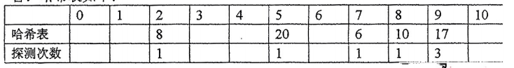

# DS-2016-42

## 1. 原题

已知哈希函数为 $H(K)=(3\times K)\ mod\ 11$，采用线性探测再散列解决冲突 $H_i=(H(K)+d_i)\ mod\ 11$，对下列线性表（ $6,8,10,17,20,23,53,41,54,57$ ）求其哈希表。要求将关键字 $23,53,41,54$ 和 $57$ 依次存入到下面的哈希表中，并填写相应的探测次数。

答：哈希表如下：

> 卷面已给片段转录（`fig8`）：哈希表地址 $0\sim 10$ 共 $11$ 格，"哈希表"行与"探测次数"行；整理者**已填好前 $5$ 个关键字** $6,8,10,17,20$ 的结果：
>
> | 地址 | 0 | 1 | 2 | 3 | 4 | 5 | 6 | 7 | 8 | 9 | 10 |
> |---|---|---|---|---|---|---|---|---|---|---|---|
> | 哈希表 | | | $8$ | | | $20$ | | $6$ | $10$ | $17$ | |
> | 探测次数 | | | $1$ | | | $1$ | | $1$ | $1$ | $3$ | |
>
> 即本题要求补全的是 $23,53,41,54,57$ 五个关键字所在地址及其探测次数。
>
> 本题无订正说明。

## 2. 答案

**（1）五个待填关键字的入表过程**

| 关键字 | $H(K)=3K\bmod 11$ | 探测序列（地址） | 落入地址 | 探测次数 |
|---|---|---|---|---|
| $23$ | $69\bmod 11=3$ | $3$（空） | **3** | **1** |
| $53$ | $159\bmod 11=5$ | $5$（占）→ $6$（空） | **6** | **2** |
| $41$ | $123\bmod 11=2$ | $2$（占）→ $3$（占）→ $4$（空） | **4** | **3** |
| $54$ | $162\bmod 11=8$ | $8$（占）→ $9$（占）→ $10$（空） | **10** | **3** |
| $57$ | $171\bmod 11=6$ | $6$（占）→ $7$（占）→ $8$（占）→ $9$（占）→ $10$（占）→ $0$（空） | **0** | **6** |

**（2）完整哈希表**

| 地址 | 0 | 1 | 2 | 3 | 4 | 5 | 6 | 7 | 8 | 9 | 10 |
|---|---|---|---|---|---|---|---|---|---|---|---|
| 哈希表 | $57$ | （空） | $8$ | $23$ | $41$ | $20$ | $53$ | $6$ | $10$ | $17$ | $54$ |
| 探测次数 | $6$ | — | $1$ | $1$ | $3$ | $1$ | $2$ | $1$ | $1$ | $3$ | $3$ |

**（3）平均查找长度**（题目未要求，附此供自检）

$$ASL_{\text{成功}}=\frac{6+1+1+3+1+1+2+1+3+3}{10}=\frac{22}{10}=2.2,\qquad ASL_{\text{失败}}=\frac{66}{11}=6$$

## 3. 题目分析

- 已知：散列函数 $H(K)=(3K)\bmod 11$（除留余数法，表长 $m=11$，$11$ 为素数）；冲突处理为**线性探测再散列** $H_i=(H(K)+d_i)\bmod 11$，其中 $d_i=i$（$d_i$ 取 $1,2,3,\cdots$，即依次探查 $H(K)+1,H(K)+2,\cdots$，超出 $10$ 后回绕到 $0$）；关键字共 $10$ 个，前 $5$ 个已入表；
- 目标：把 $23,53,41,54,57$ **按此顺序**依次插入，填出各自地址与探测次数；
- 关键约束：
  - **插入顺序固定**为 $23,53,41,54,57$，后一个关键字的冲突情况依赖前面已插入的结果（例如 $54$ 之所以探到 $10$，是因为 $8,9$ 已被 $10,17$ 占；$57$ 之所以要探 $6$ 次，是因为 $6,7,8,9,10$ 恰好被 $53,6,10,17,54$ 连成一片）；
  - 探测次数的计数口径：**"探测次数"＝为安置该关键字而进行的位置探查次数，首次落在 $H(K)$ 的那一次算第 $1$ 次**。此口径由卷面已填的 $17\to$ 地址 $9$、探测次数 $3$ 唯一确定（$H(17)=51\bmod 11=7$ 撞 $6$，$+1\to8$ 撞 $10$，$+2\to9$ 空，共探查 $3$ 次）；
  - 表长 $11$、关键字 $10$ 个，装填因子 $10/11\approx 0.91$，接近饱和，故末尾关键字的探测次数会急剧增大——这是本题的计算量所在；
- 命题意图：考 DS05.06.01 除留余数散列函数 $+$ 线性探测再散列的**逐步执行**，以及 DS05.06.02 散列表构造结果与探测次数（$ASL$ 元素）的记录；"回绕"（$57$ 从地址 $10$ 探到地址 $0$）是本题专门设的检查点；
- 表面问题背后的数据结构问题：线性探测的**一次聚集**（primary clustering）——相邻占用段会不断吸附新的冲突关键字，使探测长度线性增长，$57$ 的 $6$ 次探测就是聚集的直观体现。

## 4. 核心考点

核心考点：
DS05.06.02 散列表构造与 ASL 计算——按固定次序逐个构造表体、逐关键字登记探测次数，并汇总 $ASL$

辅助考点：
DS05.06.01 散列函数与冲突处理方法——$H(K)=(3K)\bmod 11$ 的取模计算、线性探测 $d_i=i$ 的地址推进与回绕
DS05.01 查找的基本概念——"探测次数＝关键字比较次数"这一 $ASL$ 计数口径（成功与失败的差别）

解释：本题既要"算"（$3K\bmod 11$ 的十次取模、加法与回绕），又要"造"（把表填出来），还要按固定次序模拟冲突链的演化（TRACE），三标签并列。主节点取散列表构造，因为题目的落点是"填表 $+$ 填探测次数"。

## 5. 解题思路

1. **先把 $10$ 个关键字的 $H(K)$ 一次算完列成表**，别边插边算——$3K$ 容易算错，且 $H(K)$ 与最终地址是否相同正是判断"是否发生冲突"的依据；
2. **确认计数口径**：用卷面已给的 $17\to$ 地址 $9$、探测次数 $3$ 反推（见第 3 节），确认"首次探查 $H(K)$ 计为第 $1$ 次"，然后全程沿用；
3. **按题目指定次序逐个插入**：对每个关键字，从 $H(K)$ 起依次检查 $(H(K)+1-1),(H(K)+1),\cdots$ 即 $H(K),H(K)+1,H(K)+2,\cdots$ 对 $11$ 取模，直到遇到空格，记录探查次数与落点；
4. **每插一个就更新表**，下一个关键字的冲突判断必须以更新后的表为准（这是与"独立计算各关键字"最本质的区别）；
5. **收尾三重自检**：① 表内关键字个数 $=$ 已插入个数（$10$），空槽数 $=11-10=1$；② 逐地址反查——对每个已占地址 $a$，验证"从 $H(K)$ 到 $a$ 之间的所有槽在插入时确已被占、且 $a$ 当时为空"；③ 探测次数总和除以关键字数应等于所写 $ASL_{\text{成功}}$。

## 6. 详细解答

**（1）全部关键字的散列地址（一次算完）**

| $K$ | $6$ | $8$ | $10$ | $17$ | $20$ | $23$ | $53$ | $41$ | $54$ | $57$ |
|---|---|---|---|---|---|---|---|---|---|---|
| $3K$ | 18 | 24 | 30 | 51 | 60 | 69 | 159 | 123 | 162 | 171 |
| $H(K)=3K\bmod 11$ | 7 | 2 | 8 | 7 | 5 | 3 | 5 | 2 | 8 | 6 |

取模核算（以 $11$ 的倍数为准）：$18-11=7$；$24-22=2$；$30-22=8$；$51-44=7$；$60-55=5$；$69-66=3$；$159-154=5$；$123-121=2$；$162-154=8$；$171-165=6$。

由该表已可预判冲突：$6$ 与 $17$ 同象 $7$；$8$ 与 $41$ 同象 $2$；$10$ 与 $54$ 同象 $8$；$20$ 与 $53$ 同象 $5$；$57$ 的象 $6$ 将被 $53$ 占据。

**（2）前 5 个关键字（卷面已填，用于校验口径）**

| 次序 | $K$ | $H(K)$ | 探测过程 | 落点 | 探测次数 |
|---|---|---|---|---|---|
| 1 | $6$ | 7 | 地址 7 空 | 7 | 1 |
| 2 | $8$ | 2 | 地址 2 空 | 2 | 1 |
| 3 | $10$ | 8 | 地址 8 空 | 8 | 1 |
| 4 | $17$ | 7 | 地址 7 有 $6$ → 地址 8 有 $10$ → 地址 9 空 | 9 | **3** |
| 5 | $20$ | 5 | 地址 5 空 | 5 | 1 |

与 `fig8` 已填内容（地址 $2:8/1$、$5:20/1$、$7:6/1$、$8:10/1$、$9:17/3$）**完全一致** ✓，确认口径与散列函数理解无误。此步是本题最有力的自校验：$17$ 的探测次数为 $3$ 而非 $2$，说明"首次探查 $H(K)$ 计入探测次数"。

插入后表状态：

| 地址 | 0 | 1 | 2 | 3 | 4 | 5 | 6 | 7 | 8 | 9 | 10 |
|---|---|---|---|---|---|---|---|---|---|---|---|
| 内容 | | | $8$ | | | $20$ | | $6$ | $10$ | $17$ | |

**（3）第 6 个关键字 23**

$H(23)=69\bmod 11=3$。地址 $3$ 为空 → 直接落入。
**落点 $3$，探测次数 $1$。**

**（4）第 7 个关键字 53**

$H(53)=159\bmod 11=5$。地址 $5$ 已有 $20$（第 1 次探查，冲突）→ $H_1=(5+1)\bmod 11=6$，地址 $6$ 为空（第 2 次探查，成功）。
**落点 $6$，探测次数 $2$。**

**（5）第 8 个关键字 41**

$H(41)=123\bmod 11=2$。地址 $2$ 有 $8$（1 次）→ $3$ 有 $23$（2 次，$23$ 刚在上一步占此位）→ $H_2=(2+2)\bmod 11=4$，地址 $4$ 空（3 次）。
**落点 $4$，探测次数 $3$。**

**（6）第 9 个关键字 54**

$H(54)=162\bmod 11=8$。地址 $8$ 有 $10$（1 次）→ $9$ 有 $17$（2 次）→ $H_2=(8+2)\bmod 11=10$，地址 $10$ 空（3 次）。
**落点 $10$，探测次数 $3$。**

**（7）第 10 个关键字 57（含回绕，本题最重的一步）**

$H(57)=171\bmod 11=6$。

| 探查序号 | $d_i$ | 地址 $(6+d_i)\bmod 11$ | 该地址内容 | 判定 |
|---|---|---|---|---|
| 1 | $0$ | $6$ | $53$ | 冲突 |
| 2 | $1$ | $7$ | $6$ | 冲突 |
| 3 | $2$ | $8$ | $10$ | 冲突 |
| 4 | $3$ | $9$ | $17$ | 冲突 |
| 5 | $4$ | $10$ | $54$ | 冲突 |
| 6 | $5$ | $(6+5)\bmod 11=11\bmod 11=0$ | 空 | **落入地址 0** |

**落点 $0$，探测次数 $6$。** 注意第 5 次探查到地址 $10$ 后，下一次必须**回绕**到地址 $0$（$(10+1)\bmod 11=0$），不能停在"$10$ 之后没有地址了"。

**（8）终表与校验**

| 地址 | 0 | 1 | 2 | 3 | 4 | 5 | 6 | 7 | 8 | 9 | 10 |
|---|---|---|---|---|---|---|---|---|---|---|---|
| 哈希表 | $57$ | （空） | $8$ | $23$ | $41$ | $20$ | $53$ | $6$ | $10$ | $17$ | $54$ |
| 探测次数 | $6$ | — | $1$ | $1$ | $3$ | $1$ | $2$ | $1$ | $1$ | $3$ | $3$ |

**校验①（占用数）**：非空槽 $=10$ 个，恰等于关键字个数，仅地址 $1$ 空 ✓（若某关键字被算成两个地址或有地址被覆盖，此处即暴露）。

**校验②（逐地址反查）**：
$H(6)=7$ 落 $7$（原位）✓；$H(8)=2$ 落 $2$ ✓；$H(10)=8$ 落 $8$ ✓；$H(20)=5$ 落 $5$ ✓；$H(23)=3$ 落 $3$ ✓；
$H(17)=7$，$7,8$ 被占、$9$ 空 → 落 $9$ ✓；$H(53)=5$，$5$ 被占、$6$ 空 → 落 $6$ ✓；$H(41)=2$，$2,3$ 被占、$4$ 空 → 落 $4$ ✓；$H(54)=8$，$8,9$ 被占、$10$ 空 → 落 $10$ ✓；$H(57)=6$，$6\sim10$ 全被占、回绕后 $0$ 空 → 落 $0$ ✓。

**校验③（ASL）**：探测次数合计 $1{+}1{+}1{+}3{+}1{+}1{+}2{+}3{+}3{+}6=22$，$ASL_{\text{成功}}=22/10=2.2$ ✓。

**校验④（失败 ASL）**：因 $\gcd(3,11)=1$，$H(K)$ 可取遍 $0\sim 10$，查找失败时 $11$ 个起始地址等概率。从地址 $i$ 出发"查到空槽为止"的比较次数（含命中空槽那次）：

| 起始地址 | 0 | 1 | 2 | 3 | 4 | 5 | 6 | 7 | 8 | 9 | 10 |
|---|---|---|---|---|---|---|---|---|---|---|---|
| 比较次数 | 2 | 1 | 11 | 10 | 9 | 8 | 7 | 6 | 5 | 4 | 3 |

（唯一空槽在地址 $1$，故从 $2$ 出发要一路查过 $2,3,\cdots,10,0$ 才在 $1$ 处停，共 $11$ 次。）
合计 $2+1+11+10+9+8+7+6+5+4+3=66$，$ASL_{\text{失败}}=66/11=6$。

**聚集现象说明**：地址 $2\sim10$ 与 $0$ 连成 $10$ 格长的占用段（仅地址 $1$ 断开），这是线性探测"一次聚集"的典型结果——也是 $ASL_{\text{失败}}=6$ 远大于表长一半量级的原因。若改用二次探测再散列或链地址法，聚集可显著缓解（题目未要求，仅作概念定位）。

## 7. 选项分析

不适用（问答题）。

## 8. 考场标准答案

**逐个入表（在已含 $6,8,10,17,20$ 的表上按序补入）**：

$$
\begin{aligned}
&H(23)=69\bmod 11=3\ (\text{空}) &&\Rightarrow \text{地址 }3,\ \text{探测 }1\\
&H(53)=159\bmod 11=5(\text{占})\to 6(\text{空}) &&\Rightarrow \text{地址 }6,\ \text{探测 }2\\
&H(41)=123\bmod 11=2(\text{占})\to 3(\text{占})\to 4(\text{空}) &&\Rightarrow \text{地址 }4,\ \text{探测 }3\\
&H(54)=162\bmod 11=8(\text{占})\to 9(\text{占})\to 10(\text{空}) &&\Rightarrow \text{地址 }10,\ \text{探测 }3\\
&H(57)=171\bmod 11=6\to 7\to 8\to 9\to 10\ (\text{均占})\to 0(\text{空}) &&\Rightarrow \text{地址 }0,\ \text{探测 }6\ (\text{回绕})
\end{aligned}
$$

**哈希表**：

| 地址 | 0 | 1 | 2 | 3 | 4 | 5 | 6 | 7 | 8 | 9 | 10 |
|---|---|---|---|---|---|---|---|---|---|---|---|
| 哈希表 | $57$ | | $8$ | $23$ | $41$ | $20$ | $53$ | $6$ | $10$ | $17$ | $54$ |
| 探测次数 | $6$ | | $1$ | $1$ | $3$ | $1$ | $2$ | $1$ | $1$ | $3$ | $3$ |

$ASL_{\text{成功}}=22/10=2.2$。

## 9. 易错点

1. **探测次数的计数口径**：把"冲突次数"当成"探测次数"（少算 $1$）。判据在卷面已给的 $17$ 上：$H(17)=7$、经 $8$、落 $9$，冲突 $2$ 次而探测次数写的是 $3$ ——故**首次探查 $H(K)$ 必须计入**；
2. **$57$ 忘记回绕**：探到地址 $10$ 就以为"没地方放了"，或写成"表满插入失败"。$(10+1)\bmod 11=0$，地址 $0$ 一直是空的；
3. **没有按题目指定次序插入**：若把 $57$ 放在 $53$ 之前插入，$53$ 就会被挤到别的地址。题目明写"将 $23,53,41,54$ 和 $57$ **依次**存入"，次序一变结果全变；
4. **用新表状态判旧关键字**：$41$ 探测时地址 $3$ 已被**本趟刚插入的** $23$ 占据，若以为"$23$ 还没插"就会把 $41$ 放进地址 $3$，导致两格皆错；
5. 取模算错：$3\times 57=171$，$171-165=6$（不是 $171-154=17$，$17$ 已超范围）；$3\times 53=159$，$159-154=5$。建议每个 $3K$ 都写出具体的减法过程；
6. 把 $d_i$ 理解成"$2i-1$ 的再散列"或"平方探测"：本题明写 $H_i=(H(K)+d_i)\bmod 11$ 且称"线性探测"，$d_i$ 取 $1,2,3,\cdots$；
7. 求 $ASL_{\text{失败}}$ 时误用"关键字个数 $10$"作分母：失败地址数等于**散列函数的取值个数**（此处 $H(K)$ 可取遍 $0\sim10$，分母为 $11$），不是关键字个数；
8. 抄表时把"地址"与"关键字"两行错位：$57$ 在地址 $0$、$54$ 在地址 $10$，两端各一个，最易看串行。

## 10. 一句话规律

线性探测填表题三步——**先把所有 $H(K)$ 一次算完列成表（同值者即潜在冲突对）→ 按题目给定次序逐个"探查—后移—落位"，每次探查都计数（含第一次）→ 地址越界一律 $\bmod m$ 回绕**；填完用"非空槽数 $=$ 关键字数"和"逐地址反查冲突链"两件事自检，$ASL$ 成功看关键字数、失败看散列函数取值数。

## 11. 关联知识

- DS05.06.01 中三种探测再散列的对比：线性探测 $d_i=i$（简单但有一次聚集）、二次探测 $d_i=1^2,-1^2,2^2,-2^2\cdots$（缓解聚集，要求表长为 $\le 4k+3$ 的素数）、链地址法（不产生聚集，表长不受限）——本题取第一种，故必须容忍 $57$ 的 $6$ 次探测；
- 除留余数法取模数 $p$ 一般选**素数**（此处 $p=11$ 等于表长 $m$）：若 $p$ 选得不当（如 $p=10$），$3K\bmod 10$ 的取值分布不均会造成大量同义词；本题 $\gcd(3,11)=1$ 保证 $H$ 是 $0\sim10$ 上的双射，$10$ 个关键字的 $H$ 值互不相同（只有 $6/17$、$8/41$、$10/54$、$20/53$ 四对同义词，见第（1）步表格）；
- **DS-2015-42** 第（3）问与本卷 DS-2016-41：同一张卷上"按固定次序逐步构造并记录过程量"的另两个考法（Kruskal 选边、Dijkstra 逐轮成表），与本题"逐个入表并记录探测次数"在答题规范上同族；
- 本卷 DS-2016-32（$100$ 个元素二分查找最多比较 $\lceil\log_2(100{+}1)\rceil=7$ 次）、DS-2016-21（顺序查找 $ASL$）：与本题共同构成 DS05.01"以比较次数衡量查找效率"的口径体系——本题的"探测次数"就是"关键字比较次数"；
- 教材依据：严蔚敏《数据结构（C 语言版）》9.4 散列表（散列函数、处理冲突的方法、散列表的查找与平均查找长度）。

## 12. 来源与可信度

- 原题来源：2016 回忆版题面篇 `真题/2016/2016重庆邮电大学802数据结构真题.md` 三、问答题第 42 题，题面为文字 $+$ 配图 `fig8.png`（卷面"哈希表如下"的部分填好表格），**无订正说明**；
- 读图可信度：`fig8.png` 为表格截图，地址标头 $0\sim10$、已填的关键字 $8,20,6,10,17$ 与其探测次数 $1,1,1,1,3$ 均可辨认，已在第 1 节完整转录为表格，读者可脱离图片核对；
- **口径自校验（本题可信度的主要来源）**：卷面已给的"$17\to$ 地址 $9$、探测次数 $3$"是唯一的官方样例，用它反推出"首次探查计入探测次数"与"线性探测 $d_i=i$、越界回绕"两条规则；本解析对 $6,8,10,17,20$ 五个关键字重算的结果与卷面**逐格一致**，说明规则理解正确，此后五个关键字的答案与官方口径同源；
- 答案来源：独立推导（逐关键字取模 → 按序探查落位 → 登记探测次数）$+$ 自我验证（非空槽数 $=10$ 仅余地址 $1$、逐地址反查冲突链、$ASL_{\text{成功}}=22/10$ 与 $ASL_{\text{失败}}=66/11$ 双口径统计）；未抓取解析篇网页，仅按要求登记其地址备查，未采用任何外部答案；
- 教材依据：严蔚敏、吴伟民《数据结构（C 语言版）》9.4 散列查找；
- 多来源冲突：无；争议：无。需要声明的口径仅一条——"探测次数"含首次探查，而该口径已由卷面预填的 $17\to3$ 锁定，不属自由选择；
- 最终可信度：high。
