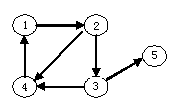

# DS-2018-14

## 1. 原题

关于下面的图形，哪个说法正确（）。

A. 路径 $<1,2>,<2,4>,<4,1>$ 是一条回路

B. 顶点 $2$ 的入度是 $2$

C. 顶点 $4$ 的出度是 $2$

D. 以上皆非

> 读图转录（`fig1.png`，$183\times111$ 小图，已放大 5 倍逐条核对箭头落点）：图为**有向图**，顶点集 $V=\{1,2,3,4,5\}$，弧集按箭头方向读作
> $$E=\{\,<1,2>,\ <2,3>,\ <2,4>,\ <3,4>,\ <3,5>,\ <4,1>\,\}$$
> 即：$1\to2$ 为上方的粗横箭头；$2$ 与 $4$ 之间的斜线箭头落在 $4$（读作 $2\to4$）；$2\to3$ 为竖直向下箭头；$3\to4$ 为水平向左箭头；$3\to5$ 为斜向右上箭头；$4\to1$ 为竖直向上箭头。共 $6$ 条弧。

## 2. 答案

**A**（$<1,2>,<2,4>,<4,1>$ 构成一条回路）。

## 3. 题目分析

- 已知：一张有向图（$5$ 个顶点、$6$ 条弧），以及四个关于"路径／回路""入度""出度"的断言；
- 目标：判定哪个断言成立；
- 关键约束：
  1. **弧的方向**必须由箭头读准——同一条连线读反，B、C 两选项的结论就会翻转；
  2. 回路的定义：起点与终点相同的路径（本库按"除起点=终点外顶点不重复"的简单回路口径），且每一段都必须是**图中真实存在的弧**且方向一致；
  3. 有向图中 $\sum$ 入度 $=\sum$ 出度 $=$ 弧数，可用来校验读图；
- 命题意图：考有向图术语（弧、入度、出度、路径、回路）的读图落地能力，并用 D 项"以上皆非"检验考生是否敢在确认 A 正确后排除它。

## 4. 核心考点

核心考点：
DS04.01 图的基本概念（有向图的弧与方向、顶点的入度／出度、路径与回路（环）的定义、$\sum$ 入度 $=\sum$ 出度 $=e$）

解释：本题不需要邻接矩阵／邻接表等存储结构，也不需要遍历算法，四个选项全部落在"图的基本术语能否对着图逐项核对"这一层，故单一主考点。

## 5. 解题思路

1. 先把图**抄成弧集**（第 1 节读图转录），并用"每个顶点的入度、出度之和都等于 $6$"自查读图有无漏读／反读；
2. 列出各顶点入度、出度表，直接判 B、C；
3. 对 A：逐条检查 $1\to2$、$2\to4$、$4\to1$ 三条弧是否都存在、方向是否首尾相接，再看起点 $=$ 终点 $=1$ 且中间顶点不重复 ⟹ 是（简单）回路；
4. A 成立即 D（以上皆非）不成立。

## 6. 详细解答

**（1）由读图结果列度表**

| 顶点 | 入度 $TD(v)$（以该点为头的弧） | 出度 $TD'(v)$（以该点为尾的弧） |
|---|---|---|
| $1$ | $1$（$<4,1>$） | $1$（$<1,2>$） |
| $2$ | $1$（$<1,2>$） | $2$（$<2,3>,<2,4>$） |
| $3$ | $1$（$<2,3>$） | $2$（$<3,4>,<3,5>$） |
| $4$ | $2$（$<2,4>,<3,4>$） | $1$（$<4,1>$） |
| $5$ | $1$（$<3,5>$） | $0$ |

校验：$\sum TD(v)=1+1+1+2+1=6$，$\sum TD'(v)=1+2+2+1+0=6$，均等于弧数 $6$ ✓（读图自洽，无漏弧、无方向冲突）。

**（2）判定选项 A**

路径 $<1,2>,<2,4>,<4,1>$ 即顶点序列 $1,2,4,1$：
- $<1,2>\in E$ ✓、$<2,4>\in E$ ✓、$<4,1>\in E$ ✓，三条弧方向首尾相接；
- 起点 $=$ 终点 $=1$，且路径长度 $3\ge 1$、除首尾外顶点 $\{2,4\}$ 互不相同 ⟹ 按定义这是一条**回路**（有向环）。

故 A 正确。

**（3）判定选项 B、C**

- B：顶点 $2$ 的入度 $=1$（只有 $1\to2$ 一条弧指向它），不是 $2$；其**出度**才是 $2$（$2\to3$、$2\to4$）。B 错；
- C：顶点 $4$ 的出度 $=1$（只有 $4\to1$），其**入度**才是 $2$（$2\to4$、$3\to4$）。C 错。

**（4）判定选项 D**

D 断言 A、B、C 全错。因 A 已成立，D 错。

**答案**：A。

## 7. 选项分析

- A. 路径 $<1,2>,<2,4>,<4,1>$ 是一条回路：**正确**。三条弧均存在且方向衔接，起点与终点同为 $1$，符合回路定义；
- B. 顶点 $2$ 的入度是 $2$：错。把出度当成入度——$2$ 有 $2$ 条**出**弧、只有 $1$ 条**入**弧（来自 $1$）。此项专门检验箭头方向是否读对；
- C. 顶点 $4$ 的出度是 $2$：错。与 B 同类的方向混淆，且更易上当：$4$ 确实"连着两条线"（$2\to4$、$3\to4$），但那是两条入弧，出弧只有 $4\to1$ 一条；
- D. 以上皆非：错。A 成立，故"皆非"不成立。若把 $2\to4$ 误读成 $4\to2$，则 A 中的 $<2,4>$ 不存在（回路断裂）、B 变成入度 $2$（成立）、C 变成出度 $2$（成立），三项判定全部翻转——可见本题的唯一关键就是读准斜线那条弧的方向。

## 8. 考场标准答案

弧集 $E=\{<1,2>,<2,3>,<2,4>,<3,4>,<3,5>,<4,1>\}$。

- 顶点 $2$：入度 $1$、出度 $2$ ⟹ B 错；
- 顶点 $4$：入度 $2$、出度 $1$ ⟹ C 错；
- $1\to2\to4\to1$ 三条弧均在图中、首尾相接且回到起点 ⟹ 是回路，A 对；
- A 对 ⟹ D 错。

选 **A**。

## 9. 易错点

1. **把无向图的"度"套到有向图上**：有向图必须分入度（指向该点的弧数）与出度（从该点出发的弧数），只看"连着几条线"会同时误判 B、C；
2. 斜线 $2\!-\!4$ 的方向读反：该弧箭头落在 $4$，是 $2\to4$；若读成 $4\to2$，则 A 的回路 $1\to2\to4\to1$ 断裂，会连带把 A 判错、并"验证"出 B、C 正确，最终误选 D；
3. 认为"回路必须包含所有顶点"或"回路长度必须 $\ge 3$"：回路只要求起点与终点相同、且各段弧方向衔接（本图 $1,2,4,1$ 长度为 $3$，即为合法回路；若图中存在 $u\to v\to u$ 这样的二元环，同样构成回路）；
4. 忘记用 $\sum$ 入度 $=\sum$ 出度 $=$ 弧数校验读图结果——这是发现漏读／多读弧的最快手段。

## 10. 一句话规律

有向图读图题三步：**先把弧集抄成有序对，再列每点入度／出度表并用 $\sum$ 入度 $=\sum$ 出度 = 弧数自检，最后按定义逐字判回路（方向首尾相接 + 起点=终点）**。

## 11. 关联知识

- 本库 DS-2005-07、DS-2018-12（$n$ 顶点 $e$ 边无向图邻接表结点总数 $2e$）与本题同属"度数与边数的计数关系"，只是那边是无向图的度、这边拆成入度／出度；
- 本库 DS-2006-09（有向图邻接矩阵中零元素个数 $n^2-e$）：有向图的弧数在矩阵中只占 $e$ 个非零元素，与无向图占 $2e$ 个的差别正来自"方向"；
- 本图的拓扑特征：存在有向环 $1\to2\to4\to1$ ⟹ 该图**不是**有向无环图，故不能做拓扑排序（对照本卷第 29 题的 AOV 网拓扑排序）；顶点 $5$ 出度为 $0$，是汇点；
- 若把本题的图改画成邻接表／邻接矩阵，即转入 DS04.02.01、DS04.02.02 的考查范围（本卷第 27、29 题正是这两种存储的作图题）。

## 12. 来源与可信度

- 原题来源：2018 回忆版题面篇 `真题/2018/2018重庆邮电大学802数据结构真题.md` 一、选择题第 14 题，题干与选项无订正说明；源文图片引用写作 `.\imgs\fig1.png`，本文件按知识库规范改写为 `../../真题/2018/imgs/fig1.png`；
- 读图可信度说明：`fig1.png` 为 $183\times111$ 的小尺寸插图，已放大 5 倍复核每条弧的箭头落点（特别是 $2\!-\!4$ 斜线与 $3\!-\!4$ 横线）；读出的弧集满足 $\sum$ 入度 $=\sum$ 出度 $=6$，且在该读法下 A 真、B 假、C 假、D 假，四个选项真值互不冲突（存在唯一自洽解释），故 `ocr_confidence: high`；
- 答案来源：独立推导（弧集 → 度表 → 回路定义判定），并以"若把 $2\to4$ 读反则结论整体翻转"作反向敏感性检查；未抓取解析篇网页，仅按要求登记其地址备查；
- 教材依据：严蔚敏、吴伟民《数据结构（C 语言版）》第 7 章 7.1 图的定义与术语（有向图／弧／头尾顶点、入度与出度、路径与回路、完全图与强连通）；
- 多来源冲突：无；争议：无；
- 最终可信度：high。
