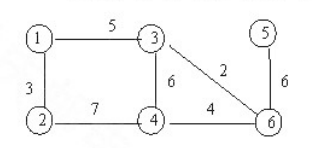

# DS-2018-27

## 1. 原题

图 $G$ 各顶点的连接关系及相应权值如下图所示：

（1）画出图的邻接矩阵存储图示；

（2）从顶点 $1$ 开始对图进行广度优先遍历，写出遍历结果；

（3）使用 $Kruskal$ 算法求该图的最小生成树，给出形成过程。



> 读图转录（`fig2.png`，已放大逐条核对）：图为**无向带权图**（连通），顶点集 $V=\{1,2,3,4,5,6\}$，边集与权值读作
> $$E=\{\,(1,2)_{\!3},\ (1,3)_{\!5},\ (2,4)_{\!7},\ (3,4)_{\!6},\ (3,6)_{\!2},\ (4,6)_{\!4},\ (5,6)_{\!6}\,\}$$
> 版面位置：$1$ 左上、$3$ 上中、$5$ 右上；$2$ 左下、$4$ 下中、$6$ 右下。$(3,6)$ 是 $3$ 到 $6$ 的斜边（权 $2$），$(5,6)$ 是右侧竖边（权 $6$），$(3,4)$ 是中间竖边（权 $6$）。共 $7$ 条边。
> 校验：各顶点度为 $\deg(1)=2,\deg(2)=2,\deg(3)=3,\deg(4)=3,\deg(5)=1,\deg(6)=3$，和为 $14=2\times 7$ ✓，边集读录无误。

## 2. 答案

**（1）邻接矩阵**（$\infty$ 表示无边，对角线为 $0$）

| | $1$ | $2$ | $3$ | $4$ | $5$ | $6$ |
|---|---|---|---|---|---|---|
| $1$ | $0$ | $3$ | $5$ | $\infty$ | $\infty$ | $\infty$ |
| $2$ | $3$ | $0$ | $\infty$ | $7$ | $\infty$ | $\infty$ |
| $3$ | $5$ | $\infty$ | $0$ | $6$ | $\infty$ | $2$ |
| $4$ | $\infty$ | $7$ | $6$ | $0$ | $\infty$ | $4$ |
| $5$ | $\infty$ | $\infty$ | $\infty$ | $\infty$ | $0$ | $6$ |
| $6$ | $\infty$ | $\infty$ | $2$ | $4$ | $6$ | $0$ |

**（2）BFS 遍历结果**：$1\ \ 2\ \ 3\ \ 4\ \ 6\ \ 5$

**（3）Kruskal 最小生成树**：选中边 $\{(3,6),(1,2),(4,6),(1,3),(5,6)\}$，权值和 $=2+3+4+5+6=20$（第 $5$ 步弃 $(3,4)$，因成环）。

## 3. 题目分析

- 已知：一张 $6$ 顶点、$7$ 边的无向带权连通图（以图形方式给出）；
- 目标：(1) 写出其邻接矩阵存储图示；(2) 从顶点 $1$ 出发的广度优先遍历序列；(3) 用 Kruskal 算法求最小生成树并给出**形成过程**（即按边考察顺序写出"选/弃"）；
- 关键约束：
  1. 邻接矩阵对**带权图**的约定：$A[i][j]=$ 边 $(i,j)$ 的权，无边记 $\infty$（工程上取一个大于所有权的常数，如 `MAXINT`），$A[i][i]=0$；无向图 ⟹ 矩阵**关于主对角线对称**，只需存上（下）三角；
  2. BFS 必须用**队列**、按"先被发现的顶点先扩展"，同一顶点的邻接点按**编号升序**访问（卷面邻接表/矩阵的默认次序约定，本题按此约定）；
  3. Kruskal 的规则是"把边按权**从小到大**排序，依次选取不与已选边构成回路的边"，选满 $n-1=5$ 条即止；它判环看的是"两端点是否已属于同一连通分量"，与 Prim 的"从已选顶点集向外找最短边"完全不同，两者过程不同但结果权值和相同；
- 命题意图：一题三问覆盖"图的存储 + 图的遍历 + 图的应用（生成树）"三个层次，考查同一张图在不同算法视角下的机械执行能力，并检验"无向图矩阵对称""BFS 用队列""Kruskal 判环"三条基本功。

## 4. 核心考点

核心考点：
DS04.02.01 邻接矩阵法——带权无向图的矩阵表示（$\infty$ 与 $0$ 的约定、对称性、由图形到二维数组的翻译）

辅助考点：
DS04.03.02 广度优先搜索——队列驱动的层次访问，及"邻接点按编号升序"这一约定对序列的影响
DS04.04.01 最小生成树（Kruskal）——边按权升序 + 并查集式判环 + $n-1$ 条边终止

解释：第 (1) 问是本题的存储基础（DS04.02.01），第 (2)(3) 问在该图上执行两个经典算法；由于三问平权，主考点取承载"图 → 数据结构"翻译的邻接矩阵，后两者列辅助。

## 5. 解题思路

1. **先把图读成边集**（第 1 节的转录），并用"度数之和 $=2\times$ 边数"校验有没有漏读斜边 $(3,6)$ 或把 $(3,4)$ 看成 $(4,5)$ 之类；
2. 第 (1) 问：按边集逐条填矩阵，$(i,j)$ 与 $(j,i)$ 同值，未填的位置写 $\infty$；填完检查对称性与非 $\infty$ 非零元素个数应为 $2\times 7=14$；
3. 第 (2) 问：画一个队列演算表——每出队一个顶点，就把它的**未访问**邻接点按编号升序入队并输出；BFS 序列的正确性用"层次划分"复核（第 $k$ 层顶点必须连续出现在第 $k-1$ 层之后）；
4. 第 (3) 问：先把 $7$ 条边按权升序列出（权值相同的 $(3,4)_6$ 与 $(5,6)_6$ 需按编号定序），逐条判断"两端点是否已在同一连通分量"，不同则选、相同则弃，凑满 $5$ 条停止；
5. 生成树结果用两条独立性质自检：① 恰有 $n-1=5$ 条边且连通（无孤立顶点）；② 换用 Prim 从顶点 $1$ 出发再求一次，权和应同为 $20$。

## 6. 详细解答

### 6.1 第 (1) 问：邻接矩阵存储图示

按约定 $A[i][j]=\begin{cases} w_{ij}, & (i,j)\in E\\ 0, & i=j\\ \infty, & \text{无边}\end{cases}$，由边集逐条填入：

| $A$ | $1$ | $2$ | $3$ | $4$ | $5$ | $6$ |
|---|---|---|---|---|---|---|
| **$1$** | $0$ | $3$ | $5$ | $\infty$ | $\infty$ | $\infty$ |
| **$2$** | $3$ | $0$ | $\infty$ | $7$ | $\infty$ | $\infty$ |
| **$3$** | $5$ | $\infty$ | $0$ | $6$ | $\infty$ | $2$ |
| **$4$** | $\infty$ | $7$ | $6$ | $0$ | $\infty$ | $4$ |
| **$5$** | $\infty$ | $\infty$ | $\infty$ | $\infty$ | $0$ | $6$ |
| **$6$** | $\infty$ | $\infty$ | $2$ | $4$ | $6$ | $0$ |

**自查**：① 矩阵关于主对角线对称（无向图必备）；② 有限非零元素个数 $=14=2|E|$ ✓；③ 第 $i$ 行非 $\infty$ 非零元素个数 $=\deg(i)$，即 $2,2,3,3,1,3$，与第 1 节读图校验一致 ✓。

（考场书写形式：画一个 $6\times 6$ 方格表，行、列均标注 $1\sim 6$，格内填权值或 $\infty$，并另起一行注明"$\infty$ 表示两顶点间无直接边，对角线 $0$ 表示自己到自己"。）

对应的 C 类型说明（教材风格，仅作存储图示的补充）：

```c
#define MVNum 6
#define MAXINT 32767          /* 代表 ∞ */
typedef struct {
    int no;                   /* 顶点编号 1..6 */
} VerTexType;
typedef struct {
    VerTexType vexs[MVNum];   /* 顶点表 */
    int arcs[MVNum][MVNum];   /* 邻接矩阵：无边处存 MAXINT */
    int vexnum, arcnum;
} MGraph;
```

### 6.2 第 (2) 问：从顶点 1 出发的广度优先遍历

队列演算（邻接点按编号升序考察）：

| 步骤 | 出队顶点 | 其邻接点（升序） | 新访问并入队 | 已访问集合 | 输出序列 |
|---|---|---|---|---|---|
| 1 | — | — | $1$ | $\{1\}$ | $1$ |
| 2 | $1$ | $2,3$ | $2,3$ | $\{1,2,3\}$ | $1,2,3$ |
| 3 | $2$ | $1,4$ | $4$ | $\{1,2,3,4\}$ | $1,2,3,4$ |
| 4 | $3$ | $1,4,6$ | $6$（$4$ 已访问） | $\{1,2,3,4,6\}$ | $1,2,3,4,6$ |
| 5 | $4$ | $2,3,6$ | 无（均已访问） | 不变 | $1,2,3,4,6$ |
| 6 | $6$ | $3,4,5$ | $5$ | $\{1,\dots,6\}$ | $1,2,3,4,6,5$ |
| 7 | $5$ | $6$ | 无 | 全部已访问 | 结束 |

$$\text{BFS 序列}=\boxed{1\ \ 2\ \ 3\ \ 4\ \ 6\ \ 5}$$

**分层校验**：以 $1$ 为第 $0$ 层，距 $1$ 一跳的顶点为 $\{2,3\}$（第 $1$ 层），二跳新达 $\{4,6\}$（第 $2$ 层），三跳新达 $\{5\}$（第 $3$ 层）——序列按层非降 ✓，且每层内部按编号升序 ✓。

（若邻接点考察次序不约定为升序，第 $1$ 层可写成 $3,2$、第 $2$ 层可写成 $6,4$ 等，序列不唯一；本库统一采用"按编号升序"这一卷面默认约定，答卷时最好在卷面上注明该约定。）

### 6.3 第 (3) 问：Kruskal 算法求最小生成树

**准备**：把全部 $7$ 条边按权值升序排列（等权边按第一端点编号定序，此处 $(3,4)_6$ 先于 $(5,6)_6$）：

$$(3,6)_{2},\ (1,2)_{3},\ (4,6)_{4},\ (1,3)_{5},\ (3,4)_{6},\ (5,6)_{6},\ (2,4)_{7}$$

**逐个考察**（"$T$" 为已选边集，连通分量用集合表示）：

| 步 | 考察边（权） | 两端点所属分量 | 是否成环 | 判定 | 选定后的连通分量 | $|T|$ |
|---|---|---|---|---|---|---|
| 1 | $(3,6)_{2}$ | $\{3\}$、$\{6\}$ | 否 | **选** | $\{3,6\}$，其余单点 | $1$ |
| 2 | $(1,2)_{3}$ | $\{1\}$、$\{2\}$ | 否 | **选** | $\{1,2\},\{3,6\}$ | $2$ |
| 3 | $(4,6)_{4}$ | $\{4\}$、$\{3,6\}$ | 否 | **选** | $\{1,2\},\{3,4,6\}$ | $3$ |
| 4 | $(1,3)_{5}$ | $\{1,2\}$、$\{3,4,6\}$ | 否（合并两分量） | **选** | $\{1,2,3,4,6\}$ | $4$ |
| 5 | $(3,4)_{6}$ | 同在 $\{1,2,3,4,6\}$ | **是**（$3\!-\!6\!-\!4\!-\!3$） | 弃 | 不变 | $4$ |
| 6 | $(5,6)_{6}$ | $\{5\}$、$\{1,2,3,4,6\}$ | 否 | **选** | 全部 $6$ 点连通 | $5=n-1$ |
| 7 | $(2,4)_{7}$ | — | — | 已选满 $5$ 条，**终止**（不再考察） | — | $5$ |

**结果**

$$T=\{\,(3,6)_{2},\ (1,2)_{3},\ (4,6)_{4},\ (1,3)_{5},\ (5,6)_{6}\,\},\qquad W(T)=2+3+4+5+6=\boxed{20}$$

生成树形态（恰好退化成一条链挂一个分支）：

```
 2 ——3—— 1 ——5—— 3 ——2—— 6 ——4—— 4
                              |
                              6
                              |
                              5
```

即树边为 $(1,2),(1,3),(3,6),(4,6),(5,6)$，$6$ 个顶点 $5$ 条边、无回路 ✓。

**独立复核（改用 Prim，从顶点 1 出发）**：
$U=\{1\}$ → 最短跨集边 $(1,2)_3$，$U=\{1,2\}$ → $(1,3)_5$，$U=\{1,2,3\}$ → $(3,6)_2$，$U=\{1,2,3,6\}$ → $(6,4)_4$，$U=\{1,2,3,4,6\}$ → $(6,5)_6$。
边集 $\{(1,2),(1,3),(3,6),(4,6),(5,6)\}$ 与 Kruskal 结果**完全相同**，权和 $=3+5+2+4+6=20$ ✓（本题边权互不相同者居多、且两处等权边不冲突，故最小生成树唯一）。

## 7. 选项分析

不适用（问答题）。三问均为作图/写序列/给过程，无备选支。

## 8. 考场标准答案

**(1)** 邻接矩阵（$\infty$ 表无边，对角线 $0$）：

| | $1$ | $2$ | $3$ | $4$ | $5$ | $6$ |
|---|---|---|---|---|---|---|
| $1$ | $0$ | $3$ | $5$ | $\infty$ | $\infty$ | $\infty$ |
| $2$ | $3$ | $0$ | $\infty$ | $7$ | $\infty$ | $\infty$ |
| $3$ | $5$ | $\infty$ | $0$ | $6$ | $\infty$ | $2$ |
| $4$ | $\infty$ | $7$ | $6$ | $0$ | $\infty$ | $4$ |
| $5$ | $\infty$ | $\infty$ | $\infty$ | $\infty$ | $0$ | $6$ |
| $6$ | $\infty$ | $\infty$ | $2$ | $4$ | $6$ | $0$ |

（无向图，矩阵对称；非 $\infty$ 非零元素共 $14=2\times 7$ 个。）

**(2)** 邻接点按编号升序访问，BFS 用队列：$1\to 2\to 3\to 4\to 6\to 5$，即遍历结果 $1\ 2\ 3\ 4\ 6\ 5$。

**(3)** Kruskal：边按权升序 $(3,6)_2,(1,2)_3,(4,6)_4,(1,3)_5,(3,4)_6,(5,6)_6,(2,4)_7$；
依次选取 $(3,6)$、$(1,2)$、$(4,6)$、$(1,3)$；$(3,4)$ 因与已选边构成回路 $3-6-4-3$ 被弃；再选 $(5,6)$，此时已有 $n-1=5$ 条边，算法结束（$(2,4)_7$ 无需考察）。
最小生成树 $T=\{(3,6),(1,2),(4,6),(1,3),(5,6)\}$，权值和 $=20$。

## 9. 易错点

1. **读图漏边**：$3$ 到 $6$ 的斜边（权 $2$）极易与 $3$ 到 $4$ 的竖边（权 $6$）混淆，一旦漏读，矩阵、BFS、Kruskal 三问全错——务必先用 $\sum\deg=2|E|$ 校验；
2. 邻接矩阵把"无边"写成 $0$：带网矩阵中 $0$ 只留给对角线，无边必须写 $\infty$（或 `MAXINT`），否则"边权为 0"与"无边"无法区分；
3. BFS 写成 DFS：把 $1,2,4,3,6,5$ 这类"一路走到底"的序列当作广度优先——记住 BFS 必须**分层**，同层顶点在序列中连续；
4. Kruskal 与 Prim 混用：Kruskal 全局按**边**排序判环，Prim 按**已选顶点集向外**选最短边；用 Prim 的过程去填"Kruskal 形成过程"这一问会丢过程分（虽然本题两法结果相同）；
5. 第 5 步 $(3,4)_6$ 未判环就选入，得到 $5$ 条边但含回路 $3-6-4-3$，不是生成树；
6. 忘记"选够 $n-1$ 条即停"：$(2,4)_7$ 不必再考察，写成"最后考察 $(2,4)$ 并弃之"虽不算错，但过程啰嗦且易被误读为选了 $6$ 条。

## 10. 一句话规律

图的三问套路固定：**先把图抄成边集并用 $\sum\deg=2|E|$ 校验，再"矩阵按边填、BFS 按队列分层走、Kruskal 按权升序判环选到 $n-1$ 条"**；生成树对不对，用 Prim 再算一遍权和即可定论。

## 11. 关联知识

- DS04.02.02 邻接表法：同一张图若改用邻接表，第 (2) 问的 BFS 次序由各边表的链接次序决定——本卷 DS-2018-29 正是"邻接表 + 边表按终点序号升序"的显式约定题，可与本题对照理解"存储结构决定遍历序列"；
- DS04.04.01 最小生成树：本题用 Kruskal，Prim 的逐步过程见第 6.3 节末的交叉验证；两法选择依据是"稀疏图用 Kruskal（按边）、稠密图用 Prim（按顶点）"，本题 $|E|=7$、$|V|=6$ 属稀疏；
- DS04.04.02 最短路径：注意"最小生成树"与"最短路径树"不同——例如树中 $1$ 到 $5$ 的路径 $1-3-6-5$ 长 $13$，而 $1-2-4-6-5$ 长 $18$，生成树不保证任意两点路径最短；
- 本卷 DS-2018-11（"无向连通图的最小生成树有一棵或多棵"）：本题恰好是**唯一**的情形（各步不存在可互换的等权边选择），可作该概念题的实例支撑；
- 本卷 DS-2018-18（非连通图 $28$ 条边求最少顶点数）、DS-2018-22（$n$ 顶点连通图邻接矩阵非零元素下界）：同属 DS04.01/DS04.02.01 的图计数基本功。

## 12. 来源与可信度

- 原题来源：2018 回忆版题面篇 `真题/2018/2018重庆邮电大学802数据结构真题.md` 三、问答题第 27 题，题面含配图 `真题/2018/imgs/fig2.png`，无订正说明；
- 读图可信度：图为清晰印刷体，$6$ 个顶点编号与 $7$ 个权值均可辨认；已在第 1 节把图完整转录为边集，并用度数握手定理（$\sum\deg=14=2\times 7$）交叉校验，读者可脱离图片核对全部数据；
- 答案来源：独立推导（矩阵按边集填写并检查对称性与元素计数；BFS 队列逐步演算并按分层复核；Kruskal 按权升序判环，另以 Prim 从顶点 $1$ 出发独立求得同一边集与同一权和 $20$）；未抓取解析篇网页，仅按要求登记其地址备查；
- 教材依据：严蔚敏、吴伟民《数据结构（C 语言版）》7.1 图的存储结构（数组表示法/邻接矩阵，网的对角线取 $0$、无边取 $\infty$）、7.3 图的遍历（广度优先搜索及其队列实现）、7.5 最小生成树（Kruskal 选边判环、Prim 选顶点）；
- 多来源冲突：无；争议：无。唯一的人为约定是"BFS 中同一顶点的邻接点按编号升序访问"，该约定已在第 6.2 节与第 8 节明示，不影响第 (1)(3) 问结果；
- 最终可信度：high。
