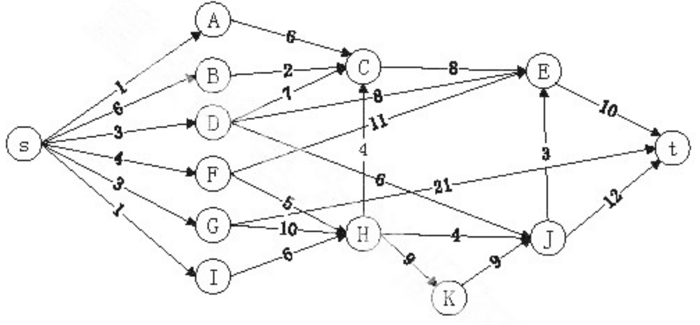

# DS-2018-31

## 1. 原题

对于如下图所示的 $AOE$ 网络，计算各活动弧的 $e(a_i)$ （活动 $a_i$ 的最早开始时间）和 $l(a_j)$ （活动 $a_j$ 的最迟开始时间）函数值、各事件（顶点）的 $ve(v_i)$ （事件 $v_i$ 的最早发生时间）和 $vl(v_j)$ （事件 $v_j$ 的最迟发生时间）函数值；列出各条关键路径。

> 订正说明转录：题图中弧存在交叉，部分弧的权值与顶点编号目视难以分辨，非图像采集问题；作答时请以图中可辨认数据为准并写明所设数据。

> **读图转录（本解析所设数据，全部计算均以此为准）**
> 图为 $AOE$ 网：$13$ 个事件（顶点）$S,A,B,C,D,E,F,G,H,I,J,K,T$，其中 $S$ 为源点（只有出弧）、$T$ 为汇点（只有入弧）；$24$ 条活动弧（权值为活动持续时间）：
> $$\begin{aligned}
> &\langle S,A\rangle_{1},\ \langle S,B\rangle_{6},\ \langle S,D\rangle_{3},\ \langle S,F\rangle_{4},\ \langle S,G\rangle_{3},\ \langle S,I\rangle_{7},\\
> &\langle A,C\rangle_{6},\ \langle B,C\rangle_{2},\ \langle D,C\rangle_{7},\ \langle D,E\rangle_{8},\ \langle D,J\rangle_{6},\\
> &\langle F,E\rangle_{11},\ \langle F,H\rangle_{5},\ \langle G,H\rangle_{10},\ \langle G,T\rangle_{21},\ \langle I,H\rangle_{6},\\
> &\langle H,C\rangle_{4},\ \langle H,J\rangle_{4},\ \langle H,K\rangle_{8},\ \langle K,J\rangle_{9},\\
> &\langle C,E\rangle_{8},\ \langle J,E\rangle_{3},\ \langle J,T\rangle_{12},\ \langle E,T\rangle_{10}
> \end{aligned}$$
> 版面位置：$S$ 最左；左列自上而下 $A,B,D,F,G,I$；中列 $C$（上）、$H$（下）、$K$（$H$ 右下）；右列 $E$（上）、$J$（下）；$T$ 最右。
>
> **不确定项声明（读图歧义点，逐条列出）**：
> ① 权值 $8$ 与 $11$ 所在的两条长弧在 $C$ 下方与竖弧 $\langle H,C\rangle_4$ 交叉，本解析读作 $\langle D,E\rangle_{8}$、$\langle F,E\rangle_{11}$（即自左下向右上汇聚到 $E$）；若两权值互换到 $\langle D,E\rangle_{11}$、$\langle F,E\rangle_{8}$，则 $ve(E)$ 仍由 $\langle J,E\rangle$ 一侧决定，关键路径不变；
> ② 权值 $6$ 所在的下降长弧，本解析读作 $\langle D,J\rangle_{6}$（越过 $H$ 上方直落 $J$）；另一读法是 $\langle D,H\rangle_{6}$；
> ③ 权值 $21$ 所在的上升长弧，本解析读作 $\langle G,T\rangle_{21}$；另一读法是 $\langle F,T\rangle_{21}$；
> ④ $\langle H,K\rangle$ 的权值字形在 $8$ 与 $9$ 之间难以确证，本解析取 $8$；
> ⑤ $\langle D,C\rangle$ 的权值字形在 $1$ 与 $7$ 之间难以确证，本解析取 $7$。
> 上述五处歧义**均不改变关键路径的形状与条数**（第 6.5 节做敏感性分析），只影响个别非关键活动的 $e/l$ 数值与工程工期（若 ④ 取 $9$，工期由 $43$ 变 $44$）。

## 2. 答案

**事件表**（$ve$ 按拓扑序求、$vl$ 按逆拓扑序求；$\Delta=vl-ve$）

| 事件 | $S$ | $A$ | $B$ | $C$ | $D$ | $E$ | $F$ | $G$ | $H$ | $I$ | $J$ | $K$ | $T$ |
|---|---|---|---|---|---|---|---|---|---|---|---|---|---|
| $ve$ | $0$ | $1$ | $6$ | $17$ | $3$ | $33$ | $4$ | $3$ | $13$ | $7$ | $30$ | $21$ | $43$ |
| $vl$ | $0$ | $19$ | $23$ | $25$ | $18$ | $33$ | $8$ | $3$ | $13$ | $7$ | $30$ | $21$ | $43$ |
| $\Delta$ | $0$ | $18$ | $17$ | $8$ | $15$ | $0$ | $4$ | $0$ | $0$ | $0$ | $0$ | $0$ | $0$ |

**工程工期**：$ve(T)=vl(T)=43$。

**关键事件**（$\Delta=0$）：$S,G,I,H,K,J,E,T$。

**活动表**（$e(a)=ve(\text{尾})$，$l(a)=vl(\text{头})-w(a)$，余量 $=l-e$）

| 活动弧 | 权 $w$ | $e$ | $l$ | $l-e$ | 活动弧 | 权 $w$ | $e$ | $l$ | $l-e$ |
|---|---|---|---|---|---|---|---|---|---|
| $a_1\langle S,A\rangle$ | $1$ | $0$ | $18$ | $18$ | $a_{13}\langle F,H\rangle$ | $5$ | $4$ | $8$ | $4$ |
| $a_2\langle S,B\rangle$ | $6$ | $0$ | $17$ | $17$ | $a_{14}\langle G,H\rangle$ | $10$ | $3$ | $13$ | $\mathbf{0}$ |
| $a_3\langle S,D\rangle$ | $3$ | $0$ | $15$ | $15$ | $a_{15}\langle G,T\rangle$ | $21$ | $3$ | $22$ | $19$ |
| $a_4\langle S,F\rangle$ | $4$ | $0$ | $4$ | $4$ | $a_{16}\langle I,H\rangle$ | $6$ | $7$ | $13$ | $\mathbf{0}$ |
| $a_5\langle S,G\rangle$ | $3$ | $0$ | $3$ | $\mathbf{0}$ | $a_{17}\langle H,C\rangle$ | $4$ | $13$ | $21$ | $8$ |
| $a_6\langle S,I\rangle$ | $7$ | $0$ | $7$ | $\mathbf{0}$ | $a_{18}\langle H,J\rangle$ | $4$ | $13$ | $26$ | $13$ |
| $a_7\langle A,C\rangle$ | $6$ | $1$ | $19$ | $18$ | $a_{19}\langle H,K\rangle$ | $8$ | $13$ | $21$ | $\mathbf{0}$ |
| $a_8\langle B,C\rangle$ | $2$ | $6$ | $23$ | $17$ | $a_{20}\langle K,J\rangle$ | $9$ | $21$ | $30$ | $\mathbf{0}$ |
| $a_9\langle D,C\rangle$ | $7$ | $3$ | $18$ | $15$ | $a_{21}\langle C,E\rangle$ | $8$ | $17$ | $25$ | $8$ |
| $a_{10}\langle D,E\rangle$ | $8$ | $3$ | $25$ | $22$ | $a_{22}\langle J,E\rangle$ | $3$ | $30$ | $33$ | $\mathbf{0}$ |
| $a_{11}\langle D,J\rangle$ | $6$ | $3$ | $24$ | $21$ | $a_{23}\langle J,T\rangle$ | $12$ | $30$ | $31$ | $1$ |
| $a_{12}\langle F,E\rangle$ | $11$ | $4$ | $22$ | $18$ | $a_{24}\langle E,T\rangle$ | $10$ | $33$ | $43$ | $\mathbf{0}$ |

**关键路径（两条，长度均为 $43$）**

$$P_1:\ S\to G\to H\to K\to J\to E\to T\quad(3+10+8+9+3+10=43)$$
$$P_2:\ S\to I\to H\to K\to J\to E\to T\quad(7+6+8+9+3+10=43)$$

两条关键路径在事件 $H$ 处汇合，此后 $\langle H,K\rangle,\langle K,J\rangle,\langle J,E\rangle,\langle E,T\rangle$ 为公共关键活动。

## 3. 题目分析

- 已知：一张带 $13$ 个事件、$24$ 条活动弧的 $AOE$ 网（Edge On Activity，弧表示活动、顶点表示事件），权值为活动持续时间；
- 目标：求全部 $24$ 个活动的 $e/l$、全部 $13$ 个事件的 $ve/vl$，并列出**所有**关键路径；
- 关键约束：
  1. $AOE$ 网必须是**无环有向网**，有唯一源点 $S$（工程开始）与唯一汇点 $T$（工程结束）；本题 $S$ 只有出弧、$T$ 只有入弧，符合约定；
  2. 计算次序有严格依赖：$ve$ 必须**按拓扑序**（从 $S$ 向 $T$）递推 $ve(\text{头})=\max\{ve(\text{尾})+w\}$；$vl$ 必须**按逆拓扑序**（从 $T$ 向 $S$）递推 $vl(\text{尾})=\min\{vl(\text{头})-w\}$；$e,l$ 只能在两表都完成后逐弧套用；
  3. 关键活动判据 $e(a)=l(a)$；关键路径是**从 $S$ 到 $T$ 全程由关键活动串成的路径**，不能只把关键活动罗列了事（本题 $8$ 条关键活动恰好构成两条共享后缀的路径）；
  4. 题面订正说明已承认读图不确定，故本解析的首要任务是**写明所设数据**（第 1 节），在此前提下给出完整、可人工复现的计算，并检验结论对歧义读法的稳健性；
- 命题意图：$AOE$ 网是图章计算量最大的一类题，考查"拓扑序/逆拓扑序两次遍历 + 最大最小递推"的机械执行，以及"关键路径可以有多条"这一概念；读图歧义额外考查作答者声明假设、并在假设下自洽完成的能力。

## 4. 核心考点

核心考点：
DS04.04.04 关键路径（AOE）——$ve/vl$ 的递推方向与 $\max/\min$ 取法、$e(a)=ve(\text{尾})$ 与 $l(a)=vl(\text{头})-w(a)$ 的换算、$e=l$ 判关键活动、由源到汇串关键活动得关键路径、工期 $=ve(T)$

辅助考点：
DS04.04.03 拓扑排序（AOV）——$ve$ 的递推必须按拓扑序进行，实际操作时"划掉一个零入度顶点再更新后继"就是拓扑排序的骨架
DS04.02.01 邻接矩阵法——$24$ 条弧的入度/出度统计与"逐弧不遗漏"检查依赖一张清晰的弧表（考场可用邻接表式列表代替矩阵）

解释：本题主体是 AOE 网的参数计算（DS04.04.04）；拓扑序只是求 $ve$ 的执行顺序（DS04.04.03 作辅助），而弧表管理（DS04.02.01）是防漏算的手段。

## 5. 解题思路

1. **先把图抄成弧表**（第 1 节），并做两项自检：① $\sum$ 入度 $=\sum$ 出度 $=$ 弧数 $24$；② 每个顶点都能在表里找到自己的出弧或入弧，没有孤立点；
2. 定拓扑序：从 $S$ 出发"每次取入度为 $0$ 的顶点"划掉，得到 $S,A,B,D,F,G,I,H,C,K,J,E,T$ 一类的合法拓扑序（不唯一，只要满足弧方向即可）；
3. 沿拓扑序求 $ve$：$ve(S)=0$，$ve(v)=\max_{\langle u,v\rangle\in A}\{ve(u)+w\}$——**每个顶点要把所有入弧都算一遍再取最大**，漏一条入弧是本题最常见的计算错误；
4. 逆拓扑序求 $vl$：$vl(T)=ve(T)$，$vl(u)=\min_{\langle u,v\rangle\in A}\{vl(v)-w\}$——**每个顶点要把所有出弧都算一遍再取最小**；
5. 逐弧套 $e,l$，并把 $l-e$（活动余量）一并写出：余量为 $0$ 的即关键活动；
6. **用关键活动反构关键路径**：从 $S$ 出发只沿余量 $0$ 的弧走，走到 $T$ 得一条；若某事件有两条入弧都余量 $0$（本题 $H$ 有 $\langle G,H\rangle$ 与 $\langle I,H\rangle$），说明关键路径在此分叉，须分别回溯到源点，逐条列全；
7. 三重校验：① 关键路径长度应等于 $ve(T)$；② 非关键活动余量应为正、且 $e\le l$ 恒成立；③ 关键事件（$ve=vl$）应恰好是路径上的事件。

## 6. 详细解答

### 6.1 拓扑序与 $ve$（事件最早发生时间）

一条拓扑序：$S\to A,B,D,F,G,I\to H\to C\to K\to J\to E\to T$（注意 $\langle H,C\rangle$ 使 $C$ 必须排在 $H$ 之后，$\langle J,E\rangle$ 使 $E$ 排在 $J$ 之后）。

| 事件 | 递推式（各入弧 $ve(\text{尾})+w$） | $ve$ |
|---|---|---|
| $S$ | 源点 | $0$ |
| $A$ | $0+1$ | $1$ |
| $B$ | $0+6$ | $6$ |
| $D$ | $0+3$ | $3$ |
| $F$ | $0+4$ | $4$ |
| $G$ | $0+3$ | $3$ |
| $I$ | $0+7$ | $7$ |
| $H$ | $\max\{\underbrace{4+5}_{F},\ \underbrace{3+10}_{G},\ \underbrace{7+6}_{I}\}$ | $13$ |
| $C$ | $\max\{\underbrace{1+6}_{A},\ \underbrace{6+2}_{B},\ \underbrace{3+7}_{D},\ \underbrace{13+4}_{H}\}$ | $17$ |
| $K$ | $13+8$ | $21$ |
| $J$ | $\max\{\underbrace{3+6}_{D},\ \underbrace{13+4}_{H},\ \underbrace{21+9}_{K}\}$ | $30$ |
| $E$ | $\max\{\underbrace{17+8}_{C},\ \underbrace{3+8}_{D},\ \underbrace{4+11}_{F},\ \underbrace{30+3}_{J}\}$ | $33$ |
| $T$ | $\max\{\underbrace{33+10}_{E},\ \underbrace{30+12}_{J},\ \underbrace{3+21}_{G}\}$ | $43$ |

**工程工期 $=ve(T)=43$。**

（观察：$ve(C)$ 由 $\langle H,C\rangle$ 决定而非 $\langle D,C\rangle$；$ve(E)$ 由 $\langle J,E\rangle$ 决定；$ve(T)$ 由 $\langle E,T\rangle$ 决定——"取最大值"意味着每个事件由**最长**的那条入路卡住，这正是关键路径的来源。）

### 6.2 逆拓扑序与 $vl$（事件最迟发生时间）

$vl(T)=ve(T)=43$，逆拓扑序回推（每个顶点取其**全部出弧**的 $\min$）：

| 事件 | 递推式（各出弧 $vl(\text{头})-w$） | $vl$ |
|---|---|---|
| $E$ | $43-10$ | $33$ |
| $J$ | $\min\{\underbrace{33-3}_{E},\ \underbrace{43-12}_{T}\}=\min\{30,31\}$ | $30$ |
| $K$ | $30-9$ | $21$ |
| $C$ | $33-8$ | $25$ |
| $H$ | $\min\{\underbrace{25-4}_{C},\ \underbrace{30-4}_{J},\ \underbrace{21-8}_{K}\}=\min\{21,26,13\}$ | $13$ |
| $G$ | $\min\{\underbrace{13-10}_{H},\ \underbrace{43-21}_{T}\}=\min\{3,22\}$ | $3$ |
| $I$ | $13-6$ | $7$ |
| $F$ | $\min\{\underbrace{33-11}_{E},\ \underbrace{13-5}_{H}\}=\min\{22,8\}$ | $8$ |
| $D$ | $\min\{\underbrace{25-7}_{C},\ \underbrace{33-8}_{E},\ \underbrace{30-6}_{J}\}=\min\{18,25,24\}$ | $18$ |
| $B$ | $25-2$ | $23$ |
| $A$ | $25-6$ | $19$ |
| $S$ | $\min\{\underbrace{19-1}_{A},\ \underbrace{23-6}_{B},\ \underbrace{18-3}_{D},\ \underbrace{8-4}_{F},\ \underbrace{3-3}_{G},\ \underbrace{7-7}_{I}\}$ | $0$ |

**闭合校验**：$vl(S)=0=ve(S)$ ✓（若算出的 $vl(S)>0$，说明某处 $\min$ 取错或漏了出弧）。

### 6.3 各活动的 $e$ 与 $l$

公式：$e(a)=ve(\text{弧尾})$，$l(a)=vl(\text{弧头})-w(a)$，余量 $l(a)-e(a)$。全部 $24$ 条结果已汇总在第 2 节的活动表中，此处示范三类：

- **关键活动** $a_{19}\langle H,K\rangle$：$e=ve(H)=13$，$l=vl(K)-8=21-8=13$，余量 $0$ ⟹ 关键活动；
- **非关键活动** $a_{23}\langle J,T\rangle$：$e=ve(J)=30$，$l=vl(T)-12=43-12=31$，余量 $1$ ⟹ 非关键，但**只差 $1$ 个单位**，是本题最危险的"准关键活动"；
- **被最长路完全掩盖的活动** $a_{15}\langle G,T\rangle$：$e=ve(G)=3$，$l=43-21=22$，余量 $19$ ⟹ 即使权值 $21$ 读错为 $2$ 或 $12$，只要 $3+21$ 仍不大于 $43$ 就不影响结论（$3+19=22<43$）。

### 6.4 列关键路径

把余量 $0$ 的 $8$ 条活动按顶点连接：$S\xrightarrow{0}\{G,I\}$、$G\to H$、$I\to H$、$H\to K\to J\to E\to T$。从 $S$ 出发沿零余量弧搜索：

- 走 $S\to G$：$3+10=13=ve(H)$ ✓ 连续；
- 走 $S\to I$：$7+6=13=ve(H)$ ✓ 连续；
- 自 $H$ 起唯一：$H\to K\to J\to E\to T$，累加 $8+9+3+10=30$，$13+30=43=ve(T)$ ✓。

故关键路径**恰有两条**：

$$P_1:\ S\to G\to H\to K\to J\to E\to T\ (43),\qquad P_2:\ S\to I\to H\to K\to J\to E\to T\ (43)$$

（完备性检查：除 $P_1,P_2$ 外不存在第三条零余量通路——$S$ 的六条出弧中只有 $\langle S,G\rangle,\langle S,I\rangle$ 余量为 $0$，而 $H$ 的三条入弧中只有这两条为零余量，$H$ 之后的零余量出弧唯一，故分叉只发生在 $S\to H$ 段，两条即为全部。）

### 6.5 读图歧义的敏感性分析（本题可信度的关键）

| 歧义点 | 若改为另一种读法 | 对 $ve/vl$ 的影响 | 对关键路径的影响 |
|---|---|---|---|
| ① $8/11$ 两弧的归属 | $\langle D,E\rangle_{11},\langle F,E\rangle_{8}$ | $ve(E)$ 仍为 $\max\{25,14,12,33\}=33$ | **无**（$E$ 仍由 $\langle J,E\rangle$ 卡住） |
| ② 下降长弧 $6$ | 读作 $\langle D,H\rangle_{6}$ | $ve(H)=\max\{9,13,13,\underline{3+6=9}\}=13$ 不变；$ve(J)=\max\{17,30\}=30$ 不变 | **无**（仅 $a_{11}$ 的 $e/l$ 数值改变） |
| ③ 上升长弧 $21$ | 读作 $\langle F,T\rangle_{21}$ | $ve(T)=\max\{43,42,\underline{4+21=25}\}=43$ | **无** |
| ④ $\langle H,K\rangle$ 取 $9$ | $8\to9$ | $ve(K)=22,ve(J)=31,ve(E)=34,ve(T)=44$；$vl$ 同步平移 | 路径**形状与条数不变**，工期变 $44$ |
| ⑤ $\langle D,C\rangle$ 取 $1$ | $7\to1$ | $ve(C)$ 仍为 $17$（由 $H$ 决定） | **无** |

结论：**关键路径为"$S\to G\to H\to K\to J\to E\to T$ 与 $S\to I\to H\to K\to J\to E\to T$"这一结果对全部五处读图歧义都稳健**；随读法变化的只是个别非关键活动的 $e/l$ 数值，以及（仅当 ④ 取 $9$ 时）工程工期 $43\to44$。

## 7. 选项分析

不适用（问答题，要求列表计算并给出关键路径，无备选支）。

## 8. 考场标准答案

**设数据**：见第 1 节读图转录（$13$ 个事件、$24$ 条弧）。

**事件参数**

$$\begin{array}{c|ccccccccccccc}
v & S & A & B & C & D & E & F & G & H & I & J & K & T\\\hline
ve & 0 & 1 & 6 & 17 & 3 & 33 & 4 & 3 & 13 & 7 & 30 & 21 & 43\\
vl & 0 & 19 & 23 & 25 & 18 & 33 & 8 & 3 & 13 & 7 & 30 & 21 & 43
\end{array}$$

**活动参数**（$e/l$，余量 $0$ 者加粗）

$$\begin{array}{c|cccccccccccc}
a & \langle S,A\rangle & \langle S,B\rangle & \langle S,D\rangle & \langle S,F\rangle & \langle S,G\rangle & \langle S,I\rangle & \langle A,C\rangle & \langle B,C\rangle & \langle D,C\rangle & \langle D,E\rangle & \langle D,J\rangle & \langle F,E\rangle\\\hline
e & 0&0&0&0&0&0&1&6&3&3&3&4\\
l & 18&17&15&4&\mathbf{3}&\mathbf{7}&19&23&18&25&24&22
\end{array}$$

$$\begin{array}{c|cccccccc}
a & \langle F,H\rangle & \langle G,H\rangle & \langle G,T\rangle & \langle I,H\rangle & \langle H,C\rangle & \langle H,J\rangle & \langle H,K\rangle & \langle K,J\rangle\\\hline
e & 4&\mathbf{3}&3&\mathbf{7}&13&13&\mathbf{13}&\mathbf{21}\\
l & 8&\mathbf{13}&22&\mathbf{13}&21&26&\mathbf{21}&\mathbf{30}
\end{array}$$

$$\begin{array}{c|cccc}
a & \langle C,E\rangle & \langle J,E\rangle & \langle J,T\rangle & \langle E,T\rangle\\\hline
e & 17&\mathbf{30}&30&\mathbf{33}\\
l & 25&\mathbf{33}&31&\mathbf{43}
\end{array}$$

**工期** $43$；**关键路径两条**：

$$S\to G\to H\to K\to J\to E\to T\quad与\quad S\to I\to H\to K\to J\to E\to T$$

## 9. 易错点

1. **递推方向搞反**：$ve$ 用 $\max$ 且沿拓扑序（自源向汇），$vl$ 用 $\min$ 且沿逆拓扑序（自汇向源）；把 $vl$ 也写成 $\max$ 会让所有事件余量都变成 $0$，误判"全是关键活动"；
2. **漏入弧/漏出弧**：$ve(C)$ 有 $4$ 条入弧（含容易被忽略的 $\langle H,C\rangle$）、$ve(E)$ 有 $4$ 条入弧、$vl(S)$ 有 $6$ 条出弧——交叉的长弧最容易被漏，漏一条就整体偏小；
3. 把 $l(a)$ 误算成 $vl(\text{弧头})$（忘记减权值 $w$）或 $ve(\text{弧尾})$（用错顶点）：$e(a)=ve(\text{尾})$、$l(a)=vl(\text{头})-w$，两端各取一个；
4. 只列关键活动不连成路径，或只给一条关键路径：本题 $H$ 处**分叉**（$\langle S,G\rangle,\langle G,H\rangle$ 与 $\langle S,I\rangle,\langle I,H\rangle$ 均为零余量），必须写两条；
5. 忽视"准关键活动" $\langle J,T\rangle$（余量仅 $1$）：判断关键路径时若把 $l-e=1$ 误当 $0$，会多出一条错误路径 $S\to\cdots\to J\to T$（长度 $42\ne43$）；
6. 忘记声明读图所设数据：题面订正说明明确要求"写明所设数据"，直接给数字而不附弧表，卷面无法判分；
7. 把 $AOE$ 与 $AOV$ 混用：$AOV$ 顶点表示活动（拓扑排序），$AOE$ 弧表示活动（关键路径），本题求 $e/l$ 只能用 $AOE$ 定义。

## 10. 一句话规律

$AOE$ 三步固定：**拓扑序取 $\max$ 求 $ve$ → 逆拓扑序取 $\min$ 求 $vl$ → 逐弧 $e=ve(\text{尾})$、$l=vl(\text{头})-w$**；找关键路径就从源点出发只走零余量弧，遇到"某事件有两条零余量入弧"就分叉，最后用"路径长 $=ve(T)$、$vl(S)=0$"两把尺子收口。图读不清时，先把所设数据写成弧表，再做敏感性分析——**结论若对所有歧义读法都不变，答案就站得住**。

## 11. 关联知识

- DS04.04.03 拓扑排序：$ve$ 的递推顺序即拓扑序，本卷 DS-2018-29 已完整演练"零入度顶点入栈—删边—更新入度"的骨架，本题正是它的应用场景；
- DS04.01 图的基本概念：$\sum$ 入度 $=\sum$ 出度 $=$ 弧数（本题 $24$）是读图与弧表的第一道自检；
- DS04.04.02 最短路径：关键路径是**最长**路径（源到汇），与 Dijkstra 的最短路方向相反，且"关键路径不唯一"是 $AOE$ 的常态，而单源最短路唯一性另有一套判据，两者不可套用；
- 本卷 DS-2018-27（邻接矩阵 + BFS + Kruskal）：同为"一张图三问"的图章大题，可对照练习"先抄数据表、再套算法"的答题流程；
- 关键路径的性质应用：缩短工期必须压缩**所有**关键路径上的关键活动（本题两条路径共享 $H\to K\to J\to E\to T$ 段，故压缩该段活动对两条路径同时有效；只压缩 $\langle S,G\rangle$ 则 $P_2$ 仍是 $43$，工期不变）——这是"列出各条关键路径"一问的实际动机。

## 12. 来源与可信度

- 原题来源：2018 回忆版题面篇 `真题/2018/2018重庆邮电大学802数据结构真题.md` 三、问答题第 31 题，配图 `真题/2018/imgs/fig3.png`（$1310\times608$），**题面自带订正说明**："题图中弧存在交叉，部分弧的权值与顶点编号目视难以分辨，非图像采集问题；作答时请以图中可辨认数据为准并写明所设数据"；
- 读图过程与可信度：本解析对 `fig3.png` 做了 $3\sim6$ 倍分块放大（`tmp/_2018_f3_t1..t6.png`、`tmp/_2018_f3_a..p.png`）逐条追踪弧的端点与权值。可**确证**的部分：源点 $S$ 的 $6$ 条出弧及其权值 $1,6,3,4,3,7$；$\langle A,C\rangle_6$、$\langle B,C\rangle_2$、$\langle C,E\rangle_8$、$\langle G,H\rangle_{10}$、$\langle I,H\rangle_6$、$\langle H,J\rangle_4$、$\langle K,J\rangle_9$、$\langle J,E\rangle_3$、$\langle E,T\rangle_{10}$、$\langle J,T\rangle_{12}$、$\langle F,H\rangle_5$、$\langle H,C\rangle_4$。**不能确证**的部分即第 1 节列出的 ①~⑤ 五处歧义（集中在 $C/D/E/F/H/J$ 一带的交叉弧与 $8/9$、$1/7$ 的字形）；
- 答案来源：独立推导（弧表 → 拓扑序 $ve$ → 逆拓扑序 $vl$ → 逐弧 $e/l$ → 零余量弧构路径），并用 $vl(S)=ve(S)=0$、$\sum$ 入度 $=\sum$ 出度 $=24$、关键路径长 $=ve(T)=43$ 三项闭合校验；另做第 6.5 节敏感性分析；未抓取解析篇网页，仅按要求登记其地址备查；
- 教材依据：严蔚敏、吴伟民《数据结构（C 语言版）》7.6 图的应用——$AOE$ 网与关键路径：$ve(k)=\max\{ve(j)+w\langle j,k\rangle\}$、$vl(j)=\min\{vl(k)-w\langle j,k\rangle\}$、$e(a)=ve(\text{尾})$、$l(a)=vl(\text{头})-w$、$e(a)=l(a)$ 者为关键活动、从源点到汇点各关键活动组成的路径为关键路径、工程工期 $=ve(\text{汇})$；
- 多来源冲突：无外部来源可比对；**争议/不确定**：题面订正说明已声明读图不可靠，本解析在明确写出所设数据的前提下作答，属 `uncertain`（已登记 `reports/disputed_questions.md`，本文件不重复登记、不修改该共享表）；
- 最终可信度：**关键路径的条数与形状（两条，均经 $H,K,J,E$）——medium~high**（对全部五处歧义读法均成立，见第 6.5 节）；**工程工期 $43$——medium**（若 $\langle H,K\rangle$ 实为 $9$ 则为 $44$）；**个别非关键活动的 $e/l$ 数值——low~medium**（随 ①②③ 的读法而变）。答卷时务必连同第 1 节的弧表一起写出，使数据假设与计算结果互为依据。
