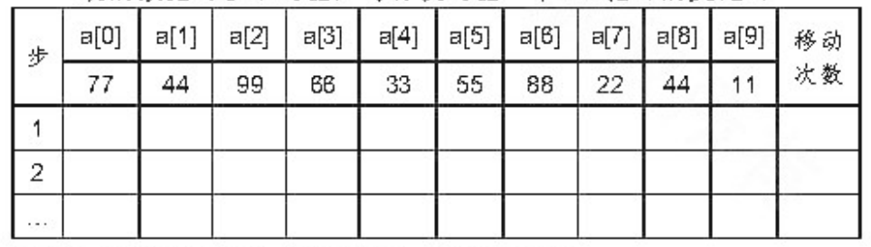

# DS-2018-33

## 1. 原题

下面给出一个排序算法，其中 $n$ 是数据类型为 $Type$ 的数组 $A[]$ 中元素总数。

```c
void unknown(Type a[],int n)
{
    int d=1,j;
    while(d<n/3)
        d=3*d+1;
    while(d>0)
    {
        for(int i=d;i<n;i++)
        {
            Type temp=a[i];
            j=i;
            while(j>=d&&a[j-d]>temp)
            {
                a[j]=a[j-d];
                j-=d;
            }
            a[j]=temp;
        }
        d/=3;
    }
}
```

（1）阅读此算法，说明它的功能；

（2）对于下面给出的整数数组，追踪第一趟 $while$（$d > 0$）内的每次 $for$ 循环结束时数组中数据的变化。（为清楚起见，本次循环未涉及的不移动的数据可以不写出，每行仅写出一个 $for$ 循环的变化）：

（3）以上各次循环的数据移动次数分别是多少。



卷面表 $33\text{-}1$（配图转录，需自行填写步 $1,2,\cdots$ 各行与"移动次数"列）：

| 步 | a[0] | a[1] | a[2] | a[3] | a[4] | a[5] | a[6] | a[7] | a[8] | a[9] | 移动次数 |
|---|---|---|---|---|---|---|---|---|---|---|---|
| 初态 | 77 | 44 | 99 | 66 | 33 | 55 | 88 | 22 | 44 | 11 | — |
| 1 | | | | | | | | | | | |
| 2 | | | | | | | | | | | |
| … | | | | | | | | | | | |

本题无订正说明。

## 2. 答案

**（1）功能**：这是**希尔（Shell）排序**——增量序列取 Knuth 序列 $1,4,13,40,\cdots\,(d=3d+1)$，起始增量取从 $d=1$ 起反复执行 $d\leftarrow 3d+1$ 后**第一个不小于 $n/3$ 的序列项**（本题 $n/3=3$，故 $d=4$），之后每趟 $d\leftarrow \lfloor d/3\rfloor$ 直到 $d=0$；每一趟对 $i=d\ldots n-1$ 逐个把 $a[i]$ 插入"下标相差 $d$ 的那一组"中的合适位置（即**分组直接插入排序**）。功能是把 $a[0..n-1]$ **原地按非递减次序排好**，附加空间 $O(1)$，**不稳定**，时间随增量序列而变（Knuth 序列最坏 $O(n^{3/2})$）。

**（2）$n=10$，第一趟 $d=4$**，六个 `for` 循环结束时的数组状态（只列发生变化/被处理的位置，未变者省略）：

| 步（$i$） | 处理元素 | 本行变化（下标:值） | 趟中该步结束后的完整数组 |
|---|---|---|---|
| 1（$i=4$） | $33$ | a[0]=33，a[4]=77 | `33 44 99 66 77 55 88 22 44 11` |
| 2（$i=5$） | $55$ | 无变化 | `33 44 99 66 77 55 88 22 44 11` |
| 3（$i=6$） | $88$ | a[2]=88，a[6]=99 | `33 44 88 66 77 55 99 22 44 11` |
| 4（$i=7$） | $22$ | a[3]=22，a[7]=66 | `33 44 88 22 77 55 99 66 44 11` |
| 5（$i=8$） | $44$ | a[4]=44，a[8]=77 | `33 44 88 22 44 55 99 66 77 11` |
| 6（$i=9$） | $11$ | a[1]=11，a[5]=44，a[9]=55 | `33 11 88 22 44 44 99 66 77 55` |

$d=4$ 趟结束时的数组为 $ (33,11,88,22,44,44,99,66,77,55) $。

**（3）各次循环的数据移动次数**：

| 步 | 1 | 2 | 3 | 4 | 5 | 6 | 合计 |
|---|---|---|---|---|---|---|---|
| 元素后移次数 | $1$ | $0$ | $1$ | $1$ | $1$ | $2$ | $6$ |
| 数组赋值语句执行次数（后移 $+$ 回写 $a[j]=temp$） | $2$ | $1$ | $2$ | $2$ | $2$ | $3$ | $12$ |

（两种口径都成立，答卷时须写明采用哪一种；步 2 的"1 次"只是把 $55$ 回写到原位置，并未真正挪动元素。）

## 3. 题目分析

- 已知：一段无注释的 C 函数与 $10$ 个整数 $ (77,44,99,66,33,55,88,22,44,11) $（$n=10$，含两个相等关键字 $44$）；
- 目标：(1) 识别算法并说明功能；(2) 按**语句级**追踪第一趟（$d=4$）内每个 `for` 迭代结束后的数组；(3) 统计各次循环的移动次数；
- 关键约束与识别线索：
  1. `while(d<n/3) d=3*d+1;` —— 这是**增量序列的生成**，不是排序过程；$d$ 只能取 $1,4,13,40,121,\cdots$；
  2. 内层 `while(j>=d && a[j-d]>temp)` 以 $d$ 为步长后移 —— "相距 $d$ 的元素属于同一组"，这是希尔排序的标志性写法（直接插入排序是它的 $d=1$ 特例）；
  3. `d/=3` 使增量逐趟缩小，最后一趟必为 $d=1$（$1/3=0$ 终止），从而保证结果有序；
  4. 用 `temp` 缓存而非 $a[0]$ 哨兵，所以必须显式判 `j>=d` 防下标越界；
- 命题意图：考 DS06.05 希尔排序的**过程可执行性**——能否从代码里读出增量序列、组划分、组内插入三件事，并机械地逐步追踪；两个 $44$ 的设置另含"稳定性"这一隐性考点（见第 6 节末）。

## 4. 核心考点

核心考点：
DS06.05 希尔排序——增量序列 $d=3d+1$（Knuth 建议序列）与"逐趟缩小增量、每趟分组插入"的过程定义

辅助考点：
DS06.02.01 直接插入排序——内层 `while` 就是"带步长 $d$ 的直接插入"，$d=1$ 时两者完全重合，读懂它才能正确追踪每次后移
DS06.11 排序算法应用——由代码/中间结果反推算法本质、比较次数与移动次数的统计口径、稳定性判断

解释：题目主体是"读代码→认算法→追过程→数移动"，全过程都在希尔排序的机制内，故主考点为 DS06.05；插入排序与算法识别是所用的方法与延伸结论。

## 5. 解题思路

1. **先算增量序列，再谈过程**：把 $n=10$ 代入 `while(d<n/3) d=3*d+1;`。C 语言整数除法 $10/3=3$；$d=1<3$ 成立 → $d=4$；$4<3$ 不成立 → 退出，起始增量 $d=4$。外层 `while(d>0)` 因此只有两趟：$d=4$ 与 $d=4/3=1$（再 $1/3=0$ 结束）。这一步算错，后面全错；
2. **列出分组**：$d=4$ 把下标按模 $4$ 同余分成 $4$ 组——$\{0,4,8\}$、$\{1,5,9\}$、$\{2,6\}$、$\{3,7\}$。`for` 的 $i$ 从 $4$ 到 $9$ 依次处理 $a[4]\ldots a[9]$，每处理一个 $i$，就是把它插入"它所在组中 $a[i]$ 之前已排好的那一段"；
3. **逐迭代走查**：对每个 $i$，取 $temp=a[i]$，从 $j=i$ 起比较 $a[j-d]$ 与 $temp$，只要 $a[j-d]>temp$ 就把 $a[j-d]$ 后移到 $a[j]$、$j\mathrel{-}=d$，否则停；最后 $a[j]=temp$。每步只改 $d$ 的整数倍距离上的位置，其余元素一律不动——这可以自我检查是否写错行；
4. **验证**：本题只要求追第一趟，但为确认"功能=升序排序"的判断，补做第二趟 $d=1$（普通直接插入）看能否得到全序——得到 $(11,22,33,44,44,55,66,77,88,99)$，说明算法与走查都正确；
5. **计数口径先定义再数**：一次"后移"是一次数组赋值，末尾回写 $a[j]=temp$ 又是一次；先说明口径，再给数字，避免与判卷者不一致；
6. **顺手查稳定性**：两个 $44$ 分别标记 $44_1=a[1]$、$44_2=a[8]$，看趟后相对次序——$d=4$ 趟后 $44_2$ 在 $a[4]$、$44_1$ 在 $a[5]$，相对次序颠倒 ⇒ 希尔排序不稳定（本例是活证据）。

## 6. 详细解答

### 6.1 算法识别（第 (1) 问）

**结构拆解**：

- 第一段 `int d=1; while(d<n/3) d=3*d+1;`：生成增量序列 $1,4,13,40,\cdots$（Knuth 建议序列）。注意循环是**先判后推**，故结束时的 $d$ 是该序列中**第一个不小于 $n/3$ 的项**（前一项必 $<n/3$，于是 $d=3d_{prev}+1\le n$），它作为起始增量；
- 第二段 `while(d>0){ … d/=3; }`：控制趟数，增量逐趟缩小到 $1$，$d=1$ 趟做完后 $d=0$ 退出；
- 第三段 `for(int i=d;i<n;i++){ … }`：本趟把 $a[d],a[d+1],\ldots,a[n-1]$ 依次插入各自所在组；
- 第四段 `while(j>=d && a[j-d]>temp){ a[j]=a[j-d]; j-=d; } a[j]=temp;`：组内的直接插入（后移 + 回写），条件为**严格大于**，故组内相等元素不会互相越过。

**功能表述**：该函数是**希尔（缩小增量）排序**，将数组 $a[0..n-1]$ 的 $n$ 个元素按**非递减（升序）**就地排好；每趟以增量 $d$ 将元素分成 $d$ 组分别做直接插入排序，增量按 $\lfloor d/3\rfloor$ 缩小，最后一趟 $d=1$ 为一次整体直接插入，保证有序。

**性质**：附加空间 $O(1)$；不稳定；时间复杂度依赖增量序列，此 $3d+1$ 序列最坏为 $O(n^{3/2})$（Knuth 上界），平均明显优于 $O(n^2)$；当 $n\le 5$ 时 $n/3\le 1$，第一条 `while` 一次都不进入，$d$ 保持 $1$，算法**退化为一次直接插入排序**（仍正确）。

### 6.2 增量与分组（第 (2) 问准备）

$n=10$：$n/3=3$（整数除法）。

$$d=1 \xrightarrow{\;1<3\;} d=3\times1+1=4 \xrightarrow{\;4<3\ \text{假}\;} \text{退出，起始 } d=4$$

趟数：$d=4 \to d=\lfloor 4/3\rfloor=1 \to d=\lfloor 1/3\rfloor=0$（结束），共**两趟**。

$d=4$ 时的 $4$ 个组（下标模 $4$ 同余）：

| 组 | 下标 | 初值 |
|---|---|---|
| 组 0 | $0,4,8$ | $77,33,44_2$ |
| 组 1 | $1,5,9$ | $44_1,55,11$ |
| 组 2 | $2,6$ | $99,88$ |
| 组 3 | $3,7$ | $66,22$ |

`for` 循环 $i=4,5,6,7,8,9$ 共 $6$ 次，恰对应卷面表的"步 $1\sim 6$"。

### 6.3 逐个 `for` 循环走查（第 (2) 问）

初态：$a=(77,\,44_1,\,99,\,66,\,33,\,55,\,88,\,22,\,44_2,\,11)$

**步 1，$i=4$（组 0）**：$temp=a[4]=33$，$j=4$。
$j\ge4$ 且 $a[0]=77>33$ ⇒ $a[4]\leftarrow a[0]=77$，$j=0$；$j=0<4$ 退出。$a[0]\leftarrow33$。
→ $a=(\mathbf{33},44_1,99,66,\mathbf{77},55,88,22,44_2,11)$　（后移 $1$ 次，赋值 $2$ 次）

**步 2，$i=5$（组 1）**：$temp=a[5]=55$，$j=5$。
$a[1]=44_1>55$？否 ⇒ 循环体一次都不执行，$a[5]\leftarrow55$（回写自身）。
→ $a$ 不变　（后移 $0$ 次，赋值 $1$ 次）

**步 3，$i=6$（组 2）**：$temp=a[6]=88$，$j=6$。
$a[2]=99>88$ ⇒ $a[6]\leftarrow99$，$j=2$；$j=2<4$ 退出。$a[2]\leftarrow88$。
→ $a=(33,44_1,\mathbf{88},66,77,55,\mathbf{99},22,44_2,11)$　（后移 $1$，赋值 $2$）

**步 4，$i=7$（组 3）**：$temp=a[7]=22$，$j=7$。
$a[3]=66>22$ ⇒ $a[7]\leftarrow66$，$j=3$；$j=3<4$ 退出。$a[3]\leftarrow22$。
→ $a=(33,44_1,88,\mathbf{22},77,55,99,\mathbf{66},44_2,11)$　（后移 $1$，赋值 $2$）

**步 5，$i=8$（组 0）**：$temp=a[8]=44_2$，$j=8$。
$a[4]=77>44$ ⇒ $a[8]\leftarrow77$，$j=4$；再判 $a[0]=33>44$？否 ⇒ 退出。$a[4]\leftarrow44_2$。
→ $a=(33,44_1,88,22,\mathbf{44_2},55,99,66,\mathbf{77},11)$　（后移 $1$，赋值 $2$）

**步 6，$i=9$（组 1）**：$temp=a[9]=11$，$j=9$。
$a[5]=55>11$ ⇒ $a[9]\leftarrow55$，$j=5$；$a[1]=44_1>11$ ⇒ $a[5]\leftarrow44_1$，$j=1$；$j=1<4$ 退出。$a[1]\leftarrow11$。
→ $a=(33,\mathbf{11},88,22,44_2,\mathbf{44_1},99,66,77,\mathbf{55})$　（后移 $2$，赋值 $3$）

**$d=4$ 趟结果**：

$$a=(33,\;11,\;88,\;22,\;44,\;44,\;99,\;66,\;77,\;55)$$

**逐组自检**：组 0 $=(33,44_2,77)$ 升序 ✓；组 1 $=(11,44_1,55)$ 升序 ✓；组 2 $=(88,99)$ ✓；组 3 $=(22,66)$ ✓。四组组内均已有序，正是希尔排序一趟应达到的效果（整体仍无序，如 $88$ 在 $22$ 之前）。

### 6.4 移动次数统计（第 (3) 问）

| 步（$i$） | 后移 $a[j]\leftarrow a[j-d]$ | 回写 $a[j]\leftarrow temp$ | 数组赋值合计 | 元素位置真正改变者 |
|---|---|---|---|---|
| 1（4） | $1$ | $1$ | $2$ | $2$ |
| 2（5） | $0$ | $1$（写回原处） | $1$ | $0$ |
| 3（6） | $1$ | $1$ | $2$ | $2$ |
| 4（7） | $1$ | $1$ | $2$ | $2$ |
| 5（8） | $1$ | $1$ | $2$ | $2$ |
| 6（9） | $2$ | $1$ | $3$ | $3$ |
| **合计** | $6$ | $6$ | $\mathbf{12}$ | $11$ |

答卷推荐写法：**各次循环的移动次数依次为 $2,1,2,2,2,3$，第一趟共 $12$ 次数组赋值**；若"移动"只指元素被挪动（不含把 $temp$ 回写原位的那一次），则为 $1,0,1,1,1,2$，共 $6$ 次后移。若还把 $temp=a[i]$ 的"取出"计为一次移动（部分教材对直接插入排序采用此口径），则各次为 $3,2,3,3,3,4$，共 $18$ 次——三种口径的相对大小关系一致，写明定义即可。

### 6.5 补充验证：第二趟 $d=1$

为确认第 (1) 问"升序排序"的结论，把 $d=4$ 趟结果 $(33,11,88,22,44,44,99,66,77,55)$ 再做一次 $d=1$ 的直接插入：

| $i$ | 1 | 2 | 3 | 4 | 5 | 6 | 7 | 8 | 9 |
|---|---|---|---|---|---|---|---|---|---|
| 后移次数 | 1 | 0 | 2 | 1 | 1 | 0 | 2 | 2 | 4 |

逐次插入后得 $a=(11,22,33,44,44,55,66,77,88,99)$ —— 完全有序，$10$ 个元素、含两个 $44$ 均无丢失或重复（元素个数与每个值的出现次数前后不变）✓（本趟后移合计 $13$ 次）。两趟总后移 $6+13=19$ 次；而若不先做 $d=4$ 趟、直接对初态做 $d=1$ 插入，后移次数等于逆序对数，本序列为 $32$ 次（$77$ 贡献 $7$、$99$ 贡献 $7$、$66$ 贡献 $5$、$44_1$ 与 $55$ 各 $3$、$88$ 贡献 $3$、$33$ 贡献 $2$、$22$ 与 $44_2$ 各 $1$），可见粗调趟只花 $6$ 次后移，就把精调趟的后移量从 $32$ 次压到 $13$ 次，体现"先大增量粗调、后小增量精调"的收益。

### 6.6 稳定性核查（隐性考点）

两个相等关键字 $44_1$（原 $a[1]$）与 $44_2$（原 $a[8]$）：$d=4$ 趟后 $44_2$ 位于 $a[4]$、$44_1$ 位于 $a[5]$，**相对次序已颠倒**，最终有序序列中仍是 $44_2$ 在前。可见希尔排序**不稳定**：一趟跨组插入会把同值元素分到不同组中相互越过，这与"组内条件 $a[j-d]>temp$ 为严格大于、组内不交换同值元素"并不矛盾。

## 7. 选项分析

不适用（程序阅读分析题，三问依次为算法识别、过程追踪、移动次数统计，无备选支）。

## 8. 考场标准答案

**(1)** 该算法是**希尔（缩小增量）排序**。`while(d<n/3) d=3*d+1;` 从 $d=1$ 起沿 Knuth 增量序列 $1,4,13,40,\cdots$ 推进，停在第一个不小于 $n/3$ 的项上作起始增量；外层 `while(d>0)` 逐趟令 $d\leftarrow\lfloor d/3\rfloor$ 直到 $0$；每趟用 `for(i=d;i<n;i++)` 把 $a[i]$ 插入"下标相差 $d$ 的同一组"中的合适位置（组内直接插入，用 $temp$ 缓存、$a[j-d]>temp$ 时后移）。功能：将 $a[0..n-1]$ 就地按**升序（非递减）**排序。附加空间 $O(1)$，**不稳定**，最坏时间 $O(n^{3/2})$（$n\le5$ 时退化为一次直接插入排序）。

**(2)** $n=10$，$10/3=3$，$d:1\to4$（$4<3$ 不成立）⇒ 起始 $d=4$，共两趟（$4,1$）。$d=4$ 趟分 $4$ 组：$\{0,4,8\},\{1,5,9\},\{2,6\},\{3,7\}$。每个 `for` 循环结束后的数组（只写变化位置）：

| 步 | $i$ | 变化的位置 | 该步后的数组 |
|---|---|---|---|
| 1 | 4 | a[0]=33，a[4]=77 | `33 44 99 66 77 55 88 22 44 11` |
| 2 | 5 | 无 | `33 44 99 66 77 55 88 22 44 11` |
| 3 | 6 | a[2]=88，a[6]=99 | `33 44 88 66 77 55 99 22 44 11` |
| 4 | 7 | a[3]=22，a[7]=66 | `33 44 88 22 77 55 99 66 44 11` |
| 5 | 8 | a[4]=44，a[8]=77 | `33 44 88 22 44 55 99 66 77 11` |
| 6 | 9 | a[1]=11，a[5]=44，a[9]=55 | `33 11 88 22 44 44 99 66 77 55` |

**(3)** 各次循环的移动次数（数组赋值次数）为 $2,1,2,2,2,3$，第一趟合计 $12$ 次；其中元素后移次数为 $1,0,1,1,1,2$，共 $6$ 次（步 2 仅把 $55$ 回写原位）。

## 9. 易错点

1. **起始增量算错**：把 $n/3$ 当实数除法（$3.33$）或把 `while(d<n/3)` 误读为"先生成所有增量再倒序使用"，得出 $d=13$ 或 $d=3$；正确值是 $d=4$（$10/3=3$，$1<3$ 使 $d$ 变 $4$，$4<3$ 假即停），且趟数为 $2$（$4,1$）；
2. **把"一趟"当成"一步"**：$d=4$ 这一趟包含 $6$ 次 `for` 循环，卷面要求**每行只写一个 `for` 循环**的结果，不是写组结果、也不是写趟末结果；
3. **误以为一趟处理一组**：`for` 按 $i$ 递增逐个处理，组是交叉进行的（$i=4$ 组 0、$i=5$ 组 1、…），但效果与"逐组插入"相同，追踪时以 $i$ 为准最不易错；
4. **忘记 $temp$ 回写**：每次 `for` 末尾必执行 $a[j]=temp$，若漏掉这一步，被后移覆盖的位置会留下重复值（如步 1 漏写 $a[0]=33$ 会得到两个 $77$）；
5. **边界条件 $j\ge d$ 与严格大于 $a[j-d]>temp$**：前者防下标越界（本题 $i=9$ 时 $j$ 会退到 $1$，再减 $d$ 即为负），后者决定同值不越过——把条件改成 $\ge$ 会破坏"组内不交换同值"的性质（对照 DS-2019-31 第 (3)(4) 问）；
6. **误判稳定性**：因"内层是插入排序"就答"稳定"，本例两个 $44$ 的相对次序在 $d=4$ 趟即被颠倒，是现成的反例；
7. **移动次数口径不写**：只给"6 次"或"12 次"而不说明是否把 $a[j]=temp$ 的回写计入，易被判不一致。

## 10. 一句话规律

读排序程序先"算增量、列分组、再逐元素插入"：$d$ 由代码里的生成循环唯一确定（注意 C 的整数除法），一趟 = 对 $i=d\ldots n-1$ 各做一次"跨 $d$ 的直接插入"；凡跨组交换的排序（希尔、快排、选择、堆）都不稳定，追踪时把相等关键字加下标标记即可当场验证。

## 11. 关联知识

- DS-2015-43（同一序列分别做直接插入与希尔排序各趟，并问稳定性）——本题的"正向"版本：那里给算法求各趟结果，这里给代码要你先认出算法；
- DS-2016-40、DS-2017-37（直接插入排序各趟结果）——希尔排序 $d=1$ 趟与之完全相同，本题内层 `while` 即其带步长版本；
- DS-2019-31（阅读排序程序回答"是否稳定、$r(0)$ 的作用、判据改成 $x\le r(j)$ 会怎样"）——同型"程序阅读 + 语义变体"题，可与本题第 9 节第 5 条对照；
- DS-2021-32（由中间结果反推算法，含希尔 $d=5$ 趟）与 DS-2018-15（快排第一趟结果）——"认算法"一族，方法都是先机械算出各算法的第一趟再对号；
- DS-2018-17、DS-2015-12（"每个元素距最终位置不远时插入类排序最省时间"）——希尔排序正是利用这一性质：大增量趟后序列已"基本有序"，故末趟 $d=1$ 的插入代价很小；
- DS-2014-12、DS-2017-17（希尔排序的比较次数与初始排列有关）——与本题 $n\le5$ 时退化为直接插入排序、最坏界 $O(n^{3/2})$ 等结论同属 DS06.05 的性质面。

## 12. 来源与可信度

- 原题来源：2018 回忆版题面篇 `真题/2018/2018重庆邮电大学802数据结构真题.md` 四、算法设计分析题第 33 题；待排序数据取自卷面配图 `真题/2018/imgs/fig4.png`（表头 $a[0]\ldots a[9]$ 与"移动次数"列，首行数据 $77,44,99,66,33,55,88,22,44,11$，步 $1,2,\ldots$ 行为空待填），图中数字清晰，转录无歧义；本题无订正说明；
- 答案来源：独立推导——(1) 按代码结构识别为 Knuth 增量序列的希尔排序；(2) 以 $n=10$ 逐步求 $d$、列分组、逐 `for` 迭代按语句走查，并用"趟末四组各自有序"作局部校验、补做 $d=1$ 趟得到全序 $(11,22,33,44,44,55,66,77,88,99)$ 作整体校验（元素个数与每个关键字的出现次数均未改变）；(3) 双口径计数并给出对应关系；另在后台执行题面代码复核，六个步的数组状态、$2,1,2,2,2,3$ 的移动计数与两趟终态均与上述手工推导逐行一致（程序仅作后台验证，正文全部可手工复现）；未抓取解析篇网页，仅按要求登记其地址备查；
- 教材依据：严蔚敏、吴伟民《数据结构（C 语言版）》10.4 希尔排序（增量分组、组内直接插入、增量序列对性能的影响、希尔排序不稳定）；$d=3d+1$ 序列及其最坏 $O(n^{3/2})$ 界为 Knuth（1973）关于该序列的经典结论，属教材 10.4 讨论增量序列时的常规引用；
- 多来源冲突：无；争议：无——追踪结果由代码语义唯一确定；仅"移动次数"存在统计口径差异（是否计入 $a[j]=temp$ 的回写、是否计入 $temp=a[i]$ 的取出），第 2、6.4 节已并列给出三种口径的数字，不属题面歧义；
- 最终可信度：high。
