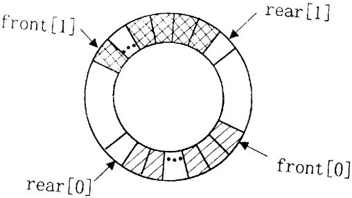

# DS-2019-20

## 1. 原题

假设两个队列共享一个循环向量空间（参见下图），其类型 $Queue2$ 定义如下：



```c
typedef struct{
    DateType data[MaxSize]; 
    int front[2],rear[2]; 
}Queue2;
```

对于 $i=0$ 或 $1$，$front[i]$ 和 $rear[i]$ 分别为第 $i$ 个队列的头指针和尾指针。请对以下算法填空，实现第 $i$ 个队列的入队操作。

```c
int EnQueue(Queue2 *Q,int i,DateType x) 
{
    //若第 i 个队列不满，则元素 x 入队列，并返回 1;否则返回 0
    if(i<0||i>1) 
        return 0;
    if(Q->rear[i]==Q->front[__________]) 
        return 0; 
    Q->data[__________]=x;
    Q->rear[i]=__________;
    return 1;
}
```

> 订正说明转录：源文作 `Q->rear[i]=[__________];`，赋值右侧不应有方括号，据题意去方括号，与其余空位写法保持一致。

## 2. 答案

| 空位 | 填写内容 | 含义 |
|---|---|---|
| 第 1 空（`Q->front[____]`） | `1-i` | 判"本队列队尾是否追上了**另一个**队列的队头"，即共享空间对本队列而言已满 |
| 第 2 空（`Q->data[____]=x`） | `Q->rear[i]` | 把 $x$ 存入队尾指针所指的（下一个空闲）单元 |
| 第 3 空（`Q->rear[i]=____`） | `(Q->rear[i]+1)%MaxSize` | 队尾指针沿下标增大方向循环前移一格 |

补全后的函数：

```c
int EnQueue(Queue2 *Q, int i, DateType x)
{
    if (i < 0 || i > 1) return 0;                 /* 队列号非法 */
    if (Q->rear[i] == Q->front[1 - i]) return 0;  /* 第 i 队列满：队尾追上另一队列的队头 */
    Q->data[Q->rear[i]] = x;                      /* 在队尾空闲单元放入 x */
    Q->rear[i] = (Q->rear[i] + 1) % MaxSize;      /* 队尾循环前移 */
    return 1;
}
```

（第 1 空写成 `i==0?1:0`、`!i`、`i^1` 语义等价，但 `1-i` 最简且与"数组下标"写法一致。）

## 3. 题目分析

- 已知：一个长度为 $MaxSize$ 的**循环**向量空间 `data[0..MaxSize-1]` 被两个队列共用；每个队列有自己的 `front[i]`（头指针）与 `rear[i]`（尾指针）；示意图显示队列 $1$ 占据圆环上方一段弧（`front[1]` 在左、`rear[1]` 在右），队列 $0$ 占据下方一段弧（`front[0]` 在右、`rear[0]` 在左），两段已占用区之间各隔着一段未占用区；
- 目标：填出第 $i$ 个队列**入队**操作的三个空缺，使"不满则插入并返回 $1$，否则返回 $0$"的注释语义成立；
- 关键约束：
  1. 由代码语句顺序可**反推指针约定**：先 `Q->data[____]=x` 再修改 `rear[i]` ⟹ `rear[i]` 在插入前指向的是"队尾元素的下一个空闲单元"（若 `rear[i]` 指向队尾元素本身，则必须先移指针再存数，与给出的语句顺序矛盾）；
  2. 由图可确定**增长方向**：两队列都沿"下标增大（顺时针）"方向扩张——队列 $1$ 的 `rear[1]` 向右下方（`front[0]` 方向）推进，队列 $0$ 的 `rear[0]` 向左上方（`front[1]` 方向）推进，两者最终都会"追上另一个队列的队头"；
  3. 因此"满"的定义不是"整个数组被占满"，而是"**本队列的下一个空闲格恰是另一队列的队头**"，即 `rear[i]==front[1-i]`；
  4. 循环移动必须取模，模数是数组长度 `MaxSize`（不是 `MaxSize-1`，也不是 `m+1` 之类，见 DS-2019-09 的同类取模判断）；
  5. `i` 的合法性已由第一句 `if(i<0||i>1)` 保证，故 `1-i` 一定是 $0/1$ 中的另一个；
- 命题意图：考"共享循环空间"这一变体的**边界条件设计**——学生习惯了一个循环队列的 `（rear+1)%MaxSize==front` 判满，这里要换成"两个队列互为边界"，判满对象从"自己的 front"变成"对方的 front"；同时考"由语句顺序反推指针约定"的程序阅读能力。

## 4. 核心考点

核心考点：
DS02.02 栈和队列的顺序存储结构（循环队列的下标取模、队满队空条件；两队列共享一个循环向量空间时以"对方的队头"为本队列的扩展边界）

解释：三空分别对应"队满判据""插入位置""队尾循环前移"，全是顺序队列实现的存储层细节；共享空间是本节点下"循环队列队满条件"的推广形态。

辅助考点：
DS02.01 栈和队列的基本概念（队列只在一端插入、另一端删除，故入队只动尾指针、不动头指针）

解释：理解"入队只修改 `rear[i]`、`front[i]` 保持不变"来自队列的抽象定义，这也是判满式中 `front[1-i]` 不会因入队而改变的原因。

## 5. 解题思路

1. **先定约定**：看代码里"存数"和"改 `rear`"的先后——本题先存后改 ⟹ `rear[i]` 指向下一个空闲单元，插入位置就是 `rear[i]` 本身（第 2 空）；
2. **再定方向**：读图确认两个队列在同一圆环上**同向**增长（都沿下标增大方向），各自的可扩展区是"自己队尾 → 对方队头"之间的那段空格；
3. **写判满式**：本队列下一个空闲格若正好是对方的队头，则无处可插 ⟹ `rear[i]==front[1-i]`（第 1 空填 `1-i`）；
4. **写循环前移**：插入后队尾要走到下一格，且要在 $0..MaxSize-1$ 内回绕 ⟹ `(Q->rear[i]+1)%MaxSize`（第 3 空）；
5. **数值模拟复核**：取 $MaxSize=12$ 造一个与图一致的快照，做"入队成功→入队判满→另一队列入队→出队让位"四步，检查每步返回值与指针变化是否符合注释语义（第 6 节（3））；
6. **公式复核**：用循环队列长度公式 $(rear[i]-front[i]+MaxSize)\%MaxSize$ 算出两队列长度，与模拟中的元素个数逐一对照。

想到这一点的线索：第 1 空的下标方括号里要填的是"另一个队列的编号"，而代码已经保证了 $i\in\{0,1\}$——$\{0,1\}$ 上"取另一个"的最简表达式就是 $1-i$。

## 6. 详细解答

**（1）由语句顺序确定指针约定（第 2 空）**

函数体给出的骨架是

```c
if(Q->rear[i]==Q->front[?]) return 0;
Q->data[?]=x;
Q->rear[i]=?;
```

`rear[i]` 的修改发生在存数**之后**，说明存数时 `rear[i]` 尚未移动，它当前所指的位置就是"可写的空闲单元"。故

$$Q\to data[\,\underbrace{Q\to rear[i]}_{\text{第 2 空}}\,]=x;\qquad Q\to rear[i]=\underbrace{(Q\to rear[i]+1)\%\,MaxSize}_{\text{第 3 空}}$$

反证：若约定"`rear[i]$ 指向队尾元素本身"，则入队必须先 `rear[i]=(rear[i]+1)%MaxSize` 再 `data[rear[i]]=x`，与骨架的语句顺序矛盾（且此时判满式应写成 `(rear[i]+1)%MaxSize==front[1-i]`，而骨架中 `if` 里**没有**取模运算，只有两个指针的直接比较 —— 这从侧面印证了"`rear[i]$ 即下一个空闲格"的约定）。

**（2）由图确定增长方向与判满边界（第 1 空）**

把圆环按"顺时针 $=$ 下标增大"展开成线性序列，图中四个指针的相对位置是

$$front[1]\ \underbrace{\cdots}_{\text{队列 1 已占}}\ rear[1]\ \underbrace{\cdots}_{\text{空闲}}\ front[0]\ \underbrace{\cdots}_{\text{队列 0 已占}}\ rear[0]\ \underbrace{\cdots}_{\text{空闲}}\ (\text{回到 } front[1])$$

- 队列 $1$ 的元素占据 $front[1],\dots,rear[1]-1$，向 $rear[1]$ 方向（顺时针、朝 $front[0]$）扩张；
- 队列 $0$ 的元素占据 $front[0],\dots,rear[0]-1$，向 $rear[0]$ 方向（顺时针、朝 $front[1]$）扩张；
- 于是队列 $i$ 的扩展边界是队列 $1-i$ 的队头，"满"当且仅当 $rear[i]=front[1-i]$。

故第 1 空填 `1-i`。

（读图说明：图中圆环被等分成若干格、箭头指向格边界，具体格数与箭头落在边界的确切位置不便精确判读；但"两队列各占一段弧、彼此相向夹住一段空闲区、增长方向一致"这三点是清楚的，三空只依赖这三点，不依赖格子总数。）

**（3）具体数值模拟验证（$MaxSize=12$，与图同构的快照）**

初始快照（与图一致：队列 1 占 $0\sim4$，队列 0 占 $6\sim10$，空闲 $\{5,11\}$）：

$$front[1]=0,\ rear[1]=5;\qquad front[0]=6,\ rear[0]=11$$

长度公式核对：$len_1=(5-0+12)\%12=5$ ✓（元素在 $0,1,2,3,4$）；$len_0=(11-6+12)\%12=5$ ✓（元素在 $6,7,8,9,10$）。

| 步 | 调用 | 判满检查 | 结果 | 指针变化 | 返回值 |
|---|---|---|---|---|---|
| ① | `EnQueue(Q,1,x)` | $rear[1]=5$ vs $front[0]=6$：不等 | $data[5]=x$ | $rear[1]=6$ | $1$ ✓ |
| ② | `EnQueue(Q,1,y)` | $rear[1]=6$ vs $front[0]=6$：**相等** | 不存数 | 无 | $0$（队列 1 满）✓ |
| ③ | `EnQueue(Q,0,z)` | $rear[0]=11$ vs $front[1]=0$：不等 | $data[11]=z$ | $rear[0]=(11+1)\%12=0$ | $1$ ✓ |
| ④ | `EnQueue(Q,0,w)` | $rear[0]=0$ vs $front[1]=0$：**相等** | 不存数 | 无 | $0$（队列 0 满）✓ |
| ⑤ | 队列 1 出队一次 | — | 弹出 $data[0]$ | $front[1]=1$ | — |
| ⑥ | `EnQueue(Q,0,w)` | $rear[0]=0$ vs $front[1]=1$：不等 | $data[0]=w$ | $rear[0]=1$ | $1$ ✓（④ 中腾出的空间被队列 0 用上了）|

六步全部符合注释语义，尤其第 ⑥ 步体现了"**共享**"：队列 $1$ 队头前移一格，队列 $0$ 立刻多出一格可用。

取模检验：第 ③ 步 $rear[0]=11$ 若写成 `rear[0]+1` 则越界（数组上界为 $11$），写成 `(rear[0]+1)%MaxSize` 才回绕到 $0$ ✓；若误用 `%MaxSize-1`（即先取模再减一）或 `%11`，第 ③ 步会得到 $0-1$ 或错误值，破坏与 $front[1]$ 的相等关系。

**（4）三空联立的自洽性检查**

- 空队列：$front[i]=rear[i]$，长度 $0$ ✓（判满式 $rear[i]==front[1-i]$ 与判空式 $rear[i]==front[i]$ 不冲突，因为 $front[i]\neq front[1-i]$）；
- 入队只改 $rear[i]$、不改任何 $front$ ⟹ 另一队列的队头位置不受影响，判满边界稳定 ✓；
- 两队列长度之和 $=\big((rear[1]-front[1]+M)\%M+(rear[0]-front[0]+M)\%M\big)\le M$（$M=MaxSize$），即"共享"不会超发空间 ✓（上表第 ④ 步时 $len_1=6$、$len_0=5$，和为 $11\le12$）。

**答案**：`1-i`、`Q->rear[i]`、`(Q->rear[i]+1)%MaxSize`。

## 7. 选项分析

不适用（程序填空题）。本题三个空各有唯一预期填法；常见错误填法与成因：

- 第 1 空填 `i`：变成 `rear[i]==front[i]`，这是**判空**条件（循环队列中"队尾==队头"表示空），填它会使"空队列第一次入队就被判满返回 0"，逻辑完全反掉；
- 第 1 空填 `1-i` 却把第 3 空写成 `(rear[i]+1)%MaxSize==front[1-i]` 之类的判断式：混淆"赋值空"与"判断空"，第三空在赋值号右侧，必须是一个下标表达式；
- 第 2 空填 `(Q->rear[i]+1)%MaxSize`：这对应"`rear[i]$ 指向队尾元素"的约定，但那样第 3 空就该写成 `Q->rear[i]=(Q->rear[i]+1)%MaxSize` 之前先存数、且判满式必须带 $+1$，与骨架语句顺序和"判满式无取模"两处都不合；
- 第 3 空漏取模写 `Q->rear[i]+1`：$rear[i]=MaxSize-1$ 时下一格越界，循环队列退化为普通顺序队列（"假溢出"），与题面"循环向量空间"矛盾；
- 第 3 空写成 `(Q->rear[i]+1)%(MaxSize-1)` 或 `%MaxSize+1`：模数／结合顺序错，回绕点不在 $0$，判满关系被打乱（对照本卷 DS-2019-09：数组 $A[0\cdots m]$ 的长度是 $m+1$，模数应等于**单元总数**）；
- 另加 `Q->front[i]` 的调整语句：入队不动头指针，多改反而错。

## 8. 考场标准答案

```c
int EnQueue(Queue2 *Q, int i, DateType x)
{
    if (i < 0 || i > 1) return 0;                  /* 队列号只能是 0 或 1 */
    if (Q->rear[i] == Q->front[1 - i]) return 0;   /* 空1：队尾追上另一队列的队头 → 满 */
    Q->data[Q->rear[i]] = x;                       /* 空2：存入队尾所指空闲单元 */
    Q->rear[i] = (Q->rear[i] + 1) % MaxSize;       /* 空3：队尾沿下标增大方向循环前移 */
    return 1;
}
```

要点三句话：① 两队列在同一循环空间上**同向**增长，各自以**对方的队头**为扩展边界，故判满为 `rear[i]==front[1-i]`；② `rear[i]` 指向下一个空闲单元，故先存后移；③ 前移必须对**单元总数** `MaxSize` 取模。时间复杂度 $O(1)$，不占用额外空间（仅改两个整型下标）。

## 9. 易错点

1. **把判满写成判空**：`rear[i]==front[i]` 是"第 $i$ 队列空"，共享空间的"满"必须引用**另一个**队列的 `front`；
2. **指针约定与语句顺序不匹配**：先存后移 ⟹ `rear` 指空位；先移后存 ⟹ `rear` 指队尾元素。两套约定的判满式差一个 $+1$，混用会差一格；
3. **模数取错**：`data[MaxSize]` 的下标范围是 $0\sim MaxSize-1$，回绕模数就是 `MaxSize`；若题面改成 `A[0..m]` 则模数是 $m+1$（本卷 DS-2019-09 正是考这一点）；
4. **误以为"满"是"整个数组满"**：本实现中一个队列满时另一个队列可能还空着（第 6 节（3）第 ② 步），这是共享循环空间的固有局限——只有对方出队、`front` 前移后空间才会让出（第 ⑥ 步）；
5. **`1-i` 写成 `!i` 或 `i-1`**：`i-1` 在 $i=0$ 时为 $-1$，越界访问；`!i` 虽值对但依赖布尔语义，写成 `1-i` 最稳妥；
6. **改动 `front`**：入队操作不得修改任何 `front[]`，否则另一队列的边界被破坏。

## 10. 一句话规律

程序填空先**读语句顺序定约定**（谁先谁后 ⟹ 指针指元素还是指空位），再**读图定方向与边界**（谁朝谁增长 ⟹ 判满拿谁的 `front` 比），最后**代一组小数值走四步**（成功、判满、另一队列、出队让位）来自洽验证——循环结构的取模数永远等于"单元总数"。

## 11. 关联知识

- 本卷 DS-2019-09（循环队列存储在 $A[0\cdots m]$ 中，入队 `rear=(rear+1)mod(m+1)`）：本题第 3 空的"单队列版"，两题合起来确认"模数 $=$ 单元总数"；
- 本库 DS-2012-24（循环队列求元素个数公式 $(r-f+n)\bmod n$）、DS-2007-12（同一公式的选择题）：本题第 6 节（3）用来复核长度的公式出处；
- 本库 DS-2016-23（顺序栈容量至少多大）、DS-2007-13（两栈共享数组相向增长使利用率最高）：**共享空间**的另一形态——两栈相向增长只需一个边界比较即可判满，而本题两队列同向增长，必须互为边界，两者对照可看清"方向决定判满条件"；
- 本库 DS-2019-14（顺序栈栈顶指针的地址计算）：同为"由操作顺序反推指针语义"的程序理解题；
- 延伸（DS02.02）：若把本题改成"两队列相向增长"（队列 0 沿下标增大、队列 1 沿下标减小），则判满条件变为 $(rear[0]+1)\%MaxSize==rear[1]$ 一类的"两尾相邻"式，可作本题的变式练习；
- 延伸（DS02.03）：链式队列不存在"满"的问题（除非内存耗尽），本题的判满逻辑在链队中整体消失，可作 DS02.02 与 DS02.03 的优劣对照。

## 12. 来源与可信度

- 原题来源：2019 回忆版题面篇 `真题/2019/2019重庆邮电大学802数据结构真题.md` 二、填空题第 20 题，附示意图 `真题/2019/imgs/fig1.png`（圆环 + `front[1]`/`rear[1]`/`rear[0]`/`front[0]` 四个箭头，上下两段阴影分别表示两个队列已占用的单元）；源文订正说明已在第 1 节以"订正说明转录"原样保留（第三空赋值右侧的多余方括号已按说明去除）；结构体与函数骨架按源文逐字符转录，类型名 `DateType` 源文全篇如此（疑为 `DataType` 之误），未作改动；
- 答案来源：独立推导（语句顺序反推指针约定 $+$ 依图确定增长方向与边界 $+$ $MaxSize=12$ 快照六步模拟 $+$ 循环队列长度公式与"总占用 $\le MaxSize$"自洽检查）；未抓取解析篇网页，仅按要求登记其地址备查；
- 教材依据：严蔚敏、吴伟民《数据结构（C 语言版）》第 3 章 3.4.2 队列的顺序表示和实现（`SqQueue`：`base`/`front`/`rear`、入队 `*S.rear++=e`、循环队列下标回绕 `(i+1)%MAXQSIZE`、队满与队空的判别）；"两队列共享一个循环向量空间、互为扩展边界"为题面给出的变体设计，教材未直接给出，故其判满式由图与代码骨架共同确定；
- 多来源冲突：无；争议：无。可信度说明：① 三空的答案由"代码语句顺序 + 判满式中不含取模"唯一锁定，不依赖图中格子的确切数量，故图像判读的不确定性（已在第 6 节（2）末声明）不影响答案；② 若图示两队列被理解为"相向增长"，则第 3 空会变为减一取模，但图中 `front[0]`/`rear[0]` 与 `front[1]`/`rear[1]` 的左右位置关系（队列 0 的 `front` 在右、`rear` 在左，队列 1 的 `front` 在左、`rear` 在右）与"同向顺时针"完全自洽，且判满式 `rear[i]==front[1-i]` 只在同向解释下成立，故取同向解释；
- 最终可信度：high（答案本身），题面图像为 medium（仅用于确定方向，不参与数值计算）。
