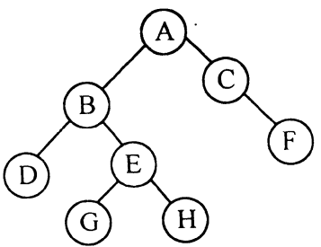

# DS-2019-27

## 1. 原题

已知二叉树的存储结构为二叉链表，阅读下面算法。

```c
typedef struct node
{ 
    DateType data;
    struct node *next; 
}ListNode;

typedef ListNode *LinkList; 
LinkList Leafhead=NULL;

void Inorder(BinTree T)
{
    LinkList s; 
    if(T)
    {
        Inorder(T->lchild);
        if((!T->lchild)&&(!T->rchild))
        {
            s=(ListNode*)malloc(sizeof(ListNode)); 
            s->data=T->data; 
            s->next=Leafhead;
            Leafhead=s;
        }
        Inorder(T->rchild); 
    }
}
```

> 订正说明转录：源文代码中 `Struct node *next;` 的 `Struct` 大写错误，据 C 语法修正为 `struct`；类型名 `DateType` 源文全篇如此（疑为 `DataType` 之误），无法确证，保留原文。

对于如下所示的二叉树：

（1）画出执行上述算法后所建立的结构；

（2）说明该算法的功能。



> 读图说明：fig2 为印刷体二叉树，已放大判读。树形为：$A$ 为根，左孩子 $B$、右孩子 $C$；$B$ 的左孩子 $D$、右孩子 $E$；$E$ 的左孩子 $G$、右孩子 $H$；$C$ **无左孩子**、右孩子为 $F$。共 $8$ 个结点，叶子为 $D,G,H,F$。

## 2. 答案

**（1）执行后建立的结构**（`Leafhead` 为全局头指针，指向一个 $4$ 个结点的单链表）：

```
Leafhead ──► [ F ] ──► [ H ] ──► [ G ] ──► [ D ] ──► NULL
              next      next      next      next
```

即链表各结点的数据域自头至尾依次为 $F,\ H,\ G,\ D$。原二叉树的二叉链表**未被改动**，新链表的结点是 `malloc` 出来的复制品（只复制了 `data`，不含孩子指针）。

**（2）算法功能**：按**中序遍历**（左→根→右）扫描二叉树，每遇到一个叶子结点（`lchild` 与 `rchild` 同时为空）就申请一个新结点，用**头插法**挂到全局单链表 `Leafhead` 上。因此该算法的作用是"把二叉树的所有叶子结点，按中序遍历序列的**逆序**链接成一个单链表"，链表中结点个数为叶子个数，表头是中序中最靠右（最后被访问）的叶子。

## 3. 题目分析

- 已知：一棵 $8$ 结点的二叉树（fig2），以二叉链表存储；一段递归遍历代码；
- 目标：① 给出算法执行后 `Leafhead` 链表的形态；② 用一句话概括功能；
- 关键约束：三处细节决定结果——(a) 判定条件 `(!T->lchild)&&(!T->rchild)` 只对**叶子**成立；(b) 处理语句位于两次递归调用**之间**，即中序位置；(c) `s->next=Leafhead; Leafhead=s;` 是**头插**，故链表顺序是中序访问顺序的**逆序**；
- 命题意图：考"遍历骨架 ＋ 访问结点时的操作"这一算法复用范式：把中序遍历的"访问"换成"收集叶子并建表"，同时考头插法对序列的逆序效应。

## 4. 核心考点

核心考点：
DS03.02.03.02 中序遍历（递归三段式：`Inorder(lchild)` → 处理根 → `Inorder(rchild)`；本题"处理"即判叶子并建结点）

辅助考点：
DS03.02.02 二叉树的存储结构（二叉链表下"叶子 ⟺ 左右孩子指针皆空"的判据；本题 `!lchild && !rchild` 正是该判据）
DS01.02.02 链式存储：单链表（`s->next=Leafhead; Leafhead=s;` 的头插法及其逆序效应、`NULL` 初值的作用）

解释：题目载体是遍历过程（DS03.02.03.02），但结果形态（链表顺序）由头插法决定（DS01.02.02），叶子判据来自二叉链表定义（DS03.02.02），三者缺一不可。

## 5. 解题思路

1. **先定遍历序**：照 fig2 写中序序列。递归式 $Inorder(T)=Inorder(l)\to T\to Inorder(r)$：
   $Inorder(A)=Inorder(B),\,A,\,Inorder(C)$；$Inorder(B)=D,B,Inorder(E)=D,B,G,E,H$；$Inorder(C)=Inorder(\varnothing),C,F=C,F$；
   合并得 $D\ B\ G\ E\ H\ A\ C\ F$；
2. **再筛叶子**：序列中满足"无左孩子且无右孩子"的是 $D,G,H,F$（$E$ 有两个孩子、$C$ 有右孩子，均不算叶子）；
3. **最后套头插**：按访问次序 $D\to G\to H\to F$ 逐个插表头：
   $[D]\to[G,D]\to[H,G,D]\to[F,H,G,D]$；
4. **独立复核**（第二条路）：头插的结果等价于"从最右叶子开始向左取叶子"，即直接按**反向中序**（右→根→左）读叶子：$F,H,G,D$ ✓ 与第 3 步一致。

## 6. 详细解答

**（1）逐结点执行追踪**（只记录满足叶子判定的结点）

| 步骤 | 当前访问结点 | 是否叶子 | 动作 | `Leafhead` 链表状态 |
|---|---|---|---|---|
| 1 | $D$ | 是（$l=r=\varnothing$） | 头插 $D$ | $D$ |
| 2 | $B$ | 否（有左、右孩子） | 无 | $D$ |
| 3 | $G$ | 是 | 头插 $G$ | $G\to D$ |
| 4 | $E$ | 否（有 $G,H$） | 无 | $G\to D$ |
| 5 | $H$ | 是 | 头插 $H$ | $H\to G\to D$ |
| 6 | $A$ | 否（有 $B,C$） | 无 | $H\to G\to D$ |
| 7 | $C$ | 否（有右孩子 $F$） | 无 | $H\to G\to D$ |
| 8 | $F$ | 是 | 头插 $F$ | $F\to H\to G\to D$ |

（表中最左列的访问次序即第 5 节第 1 步求得的中序序列 $D,B,G,E,H,A,C,F$。）

**（2）最终结构图**

```
        原二叉树（不变）                     新建单链表
              A                          Leafhead
            /   \                          │
           B     C                         ▼
          / \     \        ┌───┐   ┌───┐   ┌───┐   ┌───┐
         D   E     F       │ F │──►│ H │──►│ G │──►│ D │──► NULL
            / \            └───┘   └───┘   └───┘   └───┘
           G   H            data     data    data    data
```

链表结点类型为 `ListNode{DateType data; struct node *next;}`，只有两个域，**不含**孩子指针；结点值是原树结点数据的复制。

**（3）功能表述（含两个可写出的性质）**

- 一般性结论：对任意二叉树，执行后 `Leafhead` 链表中结点数 ＝ 叶子个数 $m$，且自表头到表尾的顺序是中序叶子序列的**逆序**（等价于"反向中序"顺序）；
- 边界情形：空树（$T=NULL$）或树中无叶子（不可能，非空二叉树必有叶子）之外，若只有 $1$ 个叶子，则链表为该叶子单结点，`Leafhead->next == NULL`（因为 `Leafhead` 初值为 `NULL`，第一个头插结点的 `next` 恰为 `NULL`，无需额外置尾）；
- 若把 `s->next=Leafhead; Leafhead=s;` 换成尾插（增设尾指针），链表即变成中序正序 $D\to G\to H\to F$ —— 这一对比是判"逆序"的最快检验法。

**（4）复杂度**：遍历整棵树 $n$ 个结点各访问一次，时间 $O(n)$；对 $m$ 个叶子各申请一个结点，附加空间 $O(m)$（$m\le n$），递归栈深 $O(h)$（$h$ 为树高）。

## 7. 选项分析

不适用（问答题）。

## 8. 考场标准答案

**(1)** 中序序列为 $D\,B\,G\,E\,H\,A\,C\,F$，其中叶子按中序出现次序为 $D,G,H,F$；算法对每个叶子作头插，故执行后

$$Leafhead \to \boxed{F} \to \boxed{H} \to \boxed{G} \to \boxed{D} \to NULL$$

共 $4$ 个结点，每个结点形如 `(data | next)`，原二叉树未被改变。

**(2)** 算法功能：**中序遍历给定二叉树（二叉链表），将树中所有叶子结点的值按中序遍历的逆序，用头插法链接成一个以全局指针 $Leafhead$ 为头的单链表**（表头为最右下的叶子，表尾为中序最先遇到的叶子）。

## 9. 易错点

1. **忘了头插导致逆序**，把链表写成 $D\to G\to H\to F$（这是中序正序，对应尾插）；
2. **把 $C$ 当叶子**：$C$ 无左孩子但有右孩子 $F$，判据是 `!lchild && !rchild`（"与"关系），只缺一边不算叶子；这是本题最主要的失分点；
3. 把 $E$ 误当叶子（$E$ 有 $G,H$ 两个孩子），或漏掉 $F$；
4. 以为算法会改变原树的孩子指针：新结点由 `malloc` 产生，只复制 `data`，二叉链表保持原样；
5. 误答功能为"按中序建立所有结点的链表"：漏了"叶子"这一筛选条件；
6. 与树的孩子兄弟表示法混淆：在**树**转成的二叉链表（左孩子右兄弟）中，叶子判据是 `lchild==NULL`（右指针是兄弟，须忽略），如本库 DS-2007-29；本题是普通二叉树，必须两边皆空。

## 10. 一句话规律

"遍历 ＋ 访问时做一件事"的读程序题，先照递归骨架写出**遍历序列**，再把"访问"那几行当函数套到序列上（这里是判叶子＋头插）；见到 `s->next=head; head=s;` 就要立刻反应出**逆序**。

## 11. 关联知识

- 本卷 DS-2019-30（由先序、中序序列还原二叉树并转森林）：与本题共用"中序＝左｜根｜右"这一骨架，可对照练习遍历序列的读写；
- DS-2018-32（二叉排序树构造 ＋ 写 `LeafCount` 求叶子个数）：同一"叶子判定"在算法实现题里的出现，判据 `!lchild && !rchild` 完全相同；
- DS-2007-29（树以二叉链表存储时叶子应满足的条件）：与本题易错点 6 对照，注意"树的二叉链表（孩子兄弟表示法）"与"二叉树的二叉链表"判据不同；
- DS-2016-31、DS-2015-29（先序＋中序求后序）：本库中"遍历序列互推"类题，是本题第 5 节第 1 步的基本功。

## 12. 来源与可信度

- 原题来源：2019 回忆版题面篇 `真题/2019/2019重庆邮电大学802数据结构真题.md` 三、问答题第 27 题；代码含订正说明（`Struct`→`struct`，`DateType` 保留原文），题图为 `真题/2019/imgs/fig2.png`，读图结果已在第 1 节声明；
- 答案来源：独立推导（中序序列 ＋ 逐结点执行追踪表 ＋ "反向中序"第二法复核，三者给出同一条链表 $F\to H\to G\to D$）；未抓取解析篇网页，仅按要求登记其地址备查；
- 教材依据：严蔚敏、吴伟民《数据结构（C 语言版）》6.3 二叉树的遍历（中序遍历递归算法）、2.3 线性表的链式表示与实现（头插法建表 `s->next=L; L=s;`）；
- 多来源冲突：无；争议：无（`Leafhead` 为全局变量，多次调用会在旧表上继续头插，本题只调用一次，不影响答案）；
- 最终可信度：high。
