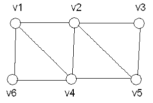

# DS-2019-29

## 1. 原题

已知一个连通图如下图所示，试给出图的邻接矩阵和邻接表存储示意图，若从顶点 $v1$ 出发对该图进行遍历，分别给出一个按深度优先遍历和广度优先遍历的顶点序列：

（1）图的邻接矩阵；

（2）邻接表存储示意图；

（3）从 $v1$ 开始的深度优先遍历的顶点序列、广度优先遍历的顶点序列；

（4）分析在深度遍历过程中，分别使用邻接矩阵和邻接表存储的算法复杂度；

（5）讨论在图遍历问题中，这两种存储方式的优劣。



> 读图说明：fig3 分辨率较低，已放大判读。该图为 **6 顶点 9 条边的无向连通图**，边集取为
> $\{v1v2,\ v1v4,\ v1v6,\ v2v3,\ v2v4,\ v2v5,\ v3v5,\ v4v5,\ v4v6\}$；
> 各顶点度数 $deg(v1)=3,\ deg(v2)=4,\ deg(v3)=2,\ deg(v4)=4,\ deg(v5)=3,\ deg(v6)=2$，其和为 $18=2\times9$，与边数自洽（握手定理校验通过）。
> 遍历序列一律按"同一顶点的邻接点按**下标升序**访问"的教材约定给出；该约定改变时序列不唯一，但同一约定下邻接矩阵与邻接表两种实现结果一致（见第 6 节）。

## 2. 答案

**（1）邻接矩阵**（行、列自上/左至下为 $v1\cdots v6$）：

$$A=\begin{bmatrix} 0&1&0&1&0&1\\ 1&0&1&1&1&0\\ 0&1&0&0&1&0\\ 1&1&0&0&1&1\\ 0&1&1&1&0&0\\ 1&0&0&1&0&0 \end{bmatrix}$$

**（2）邻接表**（头结点 $v_i$ 的边链表按邻接点序号升序链接，共 $18$ 个边结点）：

```
v1 → [2|next] → [4|next] → [6|^]
v2 → [1|next] → [3|next] → [4|next] → [5|^]
v3 → [2|next] → [5|^]
v4 → [1|next] → [2|next] → [5|next] → [6|^]
v5 → [2|next] → [3|next] → [4|^]
v6 → [1|next] → [4|^]
```

**（3）** 深度优先遍历序列：$v1\ v2\ v3\ v5\ v4\ v6$；广度优先遍历序列：$v1\ v2\ v4\ v6\ v3\ v5$。

**（4）**（$n$ 为顶点数、$e$ 为边数，本图 $n=6,e=9$）邻接矩阵 DFS：时间 $O(n^2)$；邻接表 DFS：时间 $O(n+e)$；两者空间均为 $O(n)$（访问标志数组＋递归栈）。

**（5）** 稠密图、需频繁判断"两点之间是否有边"、要求边的存取与顶点度均衡时宜用邻接矩阵；稀疏图、以遍历/求邻接点为主的运算、关心存储量时宜用邻接表（详见第 6 节（5）对照表）。

## 3. 题目分析

- 已知：一张无向连通图的**图形**（fig3），$6$ 个顶点 $9$ 条边；起点 $v1$；
- 目标：两套存储的图示、两套遍历序列、DFS 在两套存储下的复杂度、两种存储的优劣对比；
- 关键约束：①无向图 ⟹ 邻接矩阵对称、邻接表中每条边存 $2$ 个结点；②遍历序列**不唯一**，必须显式声明邻接点的访问次序约定（本题取序号升序），否则后续两问无法核对；③连通 ⟹ 一次遍历即可覆盖全部 $6$ 个顶点；
- 命题意图：一次考完"图存储＋遍历＋复杂度＋工程取舍"，其中（4）（5）是答题重心：复杂度必须能说到"每顶点扫一行 / 每边结点访问一次"这一层，优劣必须结合"遍历"这一具体运算。

## 4. 核心考点

核心考点：
DS04.02.01 邻接矩阵法（$A[i][j]=1$ 表示有边；无向图的矩阵对称、第 $i$ 行 $1$ 的个数即 $deg(v_i)$；空间 $n^2$）

辅助考点：
DS04.02.02 邻接表法（头结点＋边结点；无向图每边生成两个边结点，故边结点总数 $2e=18$；链表长度即 $deg(v_i)$）
DS04.03.01 深度优先搜索（"访问—取第一个未访问邻接点—递归—回溯"，序列由递归顺序决定）
DS04.03.02 广度优先搜索（队列控制的逐层扩展，序列即出队顺序）

解释：题目按"存储结构"设问两幅图，又在同一题内考遍历与复杂度，主体动作是"把图翻译成两种存储"，故 primary 取邻接矩阵（第（1）问、且（4）以其为对照基准），其余三项作 secondary。按 `docs/knowledge_taxonomy.md` 交叉横断说明，复杂度分析不立独立知识点，用 `COMPLEXITY_ANALYSIS` 能力标签体现。

## 5. 解题思路

1. **读图定边集**：逐条描出 9 条边，按顶点编号整理成表；用握手定理 $\sum deg=2e$ 复核读图无漏（$3+4+2+4+3+2=18=2\times9$ ✓）；
2. **填邻接矩阵**：$6\times6$ 全 $0$ 起步，对每条边在 $A[i][j]$ 与 $A[j][i]$ 各置 $1$（无向图的对称性），写完检查对角线全 $0$、每行 $1$ 的个数等于该点度数；
3. **画邻接表**：$6$ 个头结点，把每个顶点关联的边按序号升序挂入链表；同一顶点在**两个**链表里各出现一次，故边结点总数 $18$；
4. **跑 DFS**：按"取最小下标未访问邻接点"手动递归，得 $v1\!\to\!v2\!\to\!v3\!\to\!v5\!\to\!v4\!\to\!v6$，再回溯到顶，全部已访问，结束；
5. **跑 BFS**：队列逐层扩展，第一层 $\{v1\}$、第二层 $\{v2,v4,v6\}$、第三层 $\{v3,v5\}$，得 $v1\,v2\,v4\,v6\,v3\,v5$；
6. **复杂度按"基本操作次数"推**：矩阵版每个顶点要扫一整行（$n$ 次），共 $n$ 个顶点 ⟹ $n^2$；表版每个顶点入栈一次（$n$）＋每个边结点被检查一次（$2e$） ⟹ $O(n+e)$；
7. **优劣用"三量"比**：存储量、判边代价、遍历代价，并结合本题 $e$ 相对 $n^2$ 的稀疏程度给出取舍结论。

## 6. 详细解答

### （1）邻接矩阵

边集（$9$ 条）：$v1v2,\ v1v4,\ v1v6,\ v2v3,\ v2v4,\ v2v5,\ v3v5,\ v4v5,\ v4v6$。

|   | $v1$ | $v2$ | $v3$ | $v4$ | $v5$ | $v6$ | 行内 $1$ 数 |
|---|---|---|---|---|---|---|---|
| $v1$ | 0 | 1 | 0 | 1 | 0 | 1 | 3 |
| $v2$ | 1 | 0 | 1 | 1 | 1 | 0 | 4 |
| $v3$ | 0 | 1 | 0 | 0 | 1 | 0 | 2 |
| $v4$ | 1 | 1 | 0 | 0 | 1 | 1 | 4 |
| $v5$ | 0 | 1 | 1 | 1 | 0 | 0 | 3 |
| $v6$ | 1 | 0 | 0 | 1 | 0 | 0 | 2 |

核对：矩阵关于主对角线对称（无向图）✓；对角线全 $0$（无自环）✓；各行 $1$ 的个数 $3,4,2,4,3,2$ 与读图度数一致 ✓；$1$ 的总数 $18=2e$ ✓。

（若按邻接矩阵的带权写法，可把 $1$ 换成权值、无边处记 $\infty$；本题为无权图，用 $0/1$。）

### （2）邻接表存储示意图

```
   顶点表(头结点)                边表(邻接点域 adjvex | -next)
   ┌──────┐
L→ │  v1  │→ [2] → [4] → [6] → ^
   ├──────┤
   │  v2  │→ [1] → [3] → [4] → [5] → ^
   ├──────┤
   │  v3  │→ [2] → [5] → ^
   ├──────┤
   │  v4  │→ [1] → [2] → [5] → [6] → ^
   ├──────┤
   │  v5  │→ [2] → [3] → [4] → ^
   ├──────┤
   │  v6  │→ [1] → [4] → ^
   └──────┘
```

- 头结点数 $n=6$，边结点数 $2e=18$（如边 $v1v4$ 产生结点 $v1$ 表中的 $[4]$ 与 $v4$ 表中的 $[1]$ 各一个）；
- 每条边链表的长度等于对应顶点的度数：$3,4,2,4,3,2$，与（1）的行和完全一致 —— 这是邻接表与邻接矩阵互证的关键一步。

### （3）遍历序列（邻接点按下标升序取）

**DFS（深度优先，递归回溯）**

| 步 | 当前顶点 | 动作（取其未访问邻接点中最小下标者） | 已访问集合 |
|---|---|---|---|
| 1 | $v1$ | 起始，访问 $v1$；有邻 $v2,v4,v6$，取 $v2$ | $\{v1\}$ |
| 2 | $v2$ | 邻 $v1(\checkmark),v3,v4,v5$，取 $v3$ | $\{v1,v2\}$ |
| 3 | $v3$ | 邻 $v2(\checkmark),v5$，取 $v5$ | $\{v1,v2,v3\}$ |
| 4 | $v5$ | 邻 $v2(\checkmark),v3(\checkmark),v4$，取 $v4$ | $\{v1,v2,v3,v5\}$ |
| 5 | $v4$ | 邻 $v1,v2,v5$ 均已访问，取 $v6$ | $\{v1,v2,v3,v5,v4\}$ |
| 6 | $v6$ | 邻 $v1,v4$ 均已访问 ⟹ 回溯至 $v4\to v5\to v3\to v2\to v1$，各点邻点皆已访问 | 全 $6$ 点 |

$$\text{DFS}: \ v1\ \to v2\ \to v3\ \to v5\ \to v4\ \to v6$$

对应的 DFS 生成树（父子关系）：$v1\!-\!v2\!-\!v3\!-\!v5\!-\!v4\!-\!v6$（本题恰好是一条链）。

**BFS（广度优先，队列逐层）**

| 层 | 出队顺序 | 本层新访问的顶点 | 队列状态（出队后） |
|---|---|---|---|
| 0 | — | $v1$ | $v1$ |
| 1 | $v1$ | $v2,v4,v6$（$v1$ 的邻点升序） | $v2,v4,v6$ |
| 2 | $v2$ | $v3,v5$（$v1,v4$ 已访问） | $v4,v6,v3,v5$ |
| 2 | $v4$ | 无新点（$v1,v2,v5,v6$ 均已访问） | $v6,v3,v5$ |
| 3 | $v6$ | 无新点 | $v3,v5$ |
| 3 | $v3$ | 无新点 | $v5$ |
| 3 | $v5$ | 无新点 | 空，结束 |

$$\text{BFS}: \ v1\ \to v2\ \to v4\ \to v6\ \to v3\ \to v5$$

（BFS 生成树：$v1$ 的孩子 $v2,v4,v6$；$v2$ 的孩子 $v3,v5$ —— 比 DFS 的链状树更"矮"，正是逐层扩展的体现。）

**两种存储互证**：把（1）的矩阵行当作邻接点表，重跑上面两遍过程，得到完全相同的序列；用（2）的链表同样得到 $v1v2v3v5v4v6$ 与 $v1v2v4v6v3v5$。序列长度均为 $6$、无重复、无遗漏 ✓（连通图一次遍历应覆盖全部顶点）。

### （4）DFS 在两种存储下的复杂度

设 $n$ 为图中**顶点数**、$e$ 为**边数**（本图 $n=6$、$e=9$）。

**邻接矩阵版**（教材 `DFS(G,v)`：访问 $v$，再对 $w=1\cdots n$ 逐个判 `A[v][w]==1 && !visited[w]` 并递归）

- 每个顶点被访问一次 ⟹ 产生 $n$ 次"扫描整行"的操作，每次 $n$ 次判断 ⟹ $\boxed{O(n^2)}$；
- **与 $e$ 无关**：即使某顶点度数很小，也要把它的整行 $n$ 个元素看完才能确定没有新的邻接点（稀疏图上是纯浪费）；
- 空间：`visited[1..n]` 为 $O(n)$；递归栈最深 $n$（链状 DFS 树，如本题）⟹ $O(n)$。

**邻接表版**（对 $v$ 只沿它的边链表走：`for(p=AdjList[v].firstadj; p; p=p->next) w=p->adjvex;`）

- 顶点代价：$n$ 个头结点各被访问一次 ⟹ $O(n)$；
- 边代价：无向图的每条边存成 $2$ 个边结点，且每个边结点在整个 DFS 中至多被检查 $2$ 次（两端各一次） ⟹ $O(2e)=O(e)$；
- 合计 $\boxed{O(n+e)}$；
- 空间同样是 $O(n)$（`visited` ＋ 递归栈）。

**对比**：$O(n+e)$ 对 $O(n^2)$，邻接表版省掉的正是"扫空位"的开销；当 $e=\Theta(n^2)$（稠密图）时两者同阶，邻接表的常数（指针访问、随机内存跳转）反而可能更大；当 $e=O(n)$（稀疏图，含本题 $e=9\ll n^2=36$）时邻接表显著优。矩阵版每次判断是 $O(1)$ 的数组访问，顺序内存、缓存友好。

### （5）两种存储在图遍历问题中的优劣

| 比较项 | 邻接矩阵 | 邻接表 |
|---|---|---|
| 存储量 | $n^2$（无权图可按位压缩为 $n^2/8$） | $n+2e$（含指针域），稀疏图显著省空间 |
| 建表 | $O(n^2)$ 初始化＋$O(e)$ 填边 | $O(n+e)$，读一条边挂两个结点 |
| 判"$(v_i,v_j)$ 是否有边" | $O(1)$，直接取 $A[i][j]$ | $O(deg(v_i))$，须遍历链表 |
| 求度 $deg(v_i)$ | 无向图扫一行 $O(n)$；有向图需分别扫行列 | 无向图＝链表长度 $O(deg)$；有向图出度易、**入度难**（须扫全表或用逆邻接表） |
| DFS/BFS 时间 | $O(n^2)$ | $O(n+e)$ |
| 增删边 | 改两个元素，$O(1)$ | 链表插删，需先定位 $O(deg)$ |
| 适用 | 稠密图、以"边存在性判断"为主的运算（如判重边、求顶点对关系、Floyd 类算法） | 稀疏图、以"遍历/枚举邻接点"为主的运算（DFS、BFS、Prim/Kruskal 的找边、拓扑排序） |
| 主要缺陷 | 稀疏图浪费 $n^2-e$ 个单元；遍历被迫扫空位 | 边结点分散，指针开销大；不便于按矩阵方式快速定位；有向图求入度不便 |

**结论（结合本题）**：本题 $6$ 顶点 $9$ 边，$e/(n(n-1)/2)=9/15=0.6$，属**中等偏密**的图。就"从 $v1$ 出发遍历"这一运算而言，邻接表仍是首选（$O(n+e)=O(15)$，邻接矩阵 $O(n^2)=36$）；但两种存储在本题给出的遍历序列完全相同，差别只在时间代价上——若后续运算还要频繁问"$v_i,v_j$ 是否相邻"（如判环、构造生成树时验重），则保留一份邻接矩阵更划算，工程上也可两者并用（以表遍历、以矩阵验边）。

另需写明：**遍历序列不唯一**。本题序列是在"邻接点按编号升序"约定下得到的；若改为降序或按建表（输入）顺序，DFS 可得如 $v1\,v6\,v4\,v5\,v3\,v2$、BFS 可得 $v1\,v6\,v4\,v2\,v5\,v3$ 等合法结果，判卷时应以"符合遍历规则且覆盖全部顶点"为准，而非死记某一条序列。

## 7. 选项分析

不适用（问答题）。

## 8. 考场标准答案

**（1）** 邻接矩阵（$v1\cdots v6$ 为序）：

$$\begin{bmatrix} 0&1&0&1&0&1\\ 1&0&1&1&1&0\\ 0&1&0&0&1&0\\ 1&1&0&0&1&1\\ 0&1&1&1&0&0\\ 1&0&0&1&0&0 \end{bmatrix}\qquad(\text{对称阵，}1\text{ 的个数 }=18=2e)$$

**（2）** 邻接表：$6$ 个头结点，边表依次为

$v1\!\to\![2]\!\to\![4]\!\to\![6]$；$v2\!\to\![1]\!\to\![3]\!\to\![4]\!\to\![5]$；$v3\!\to\![2]\!\to\![5]$；$v4\!\to\![1]\!\to\![2]\!\to\![5]\!\to\![6]$；$v5\!\to\![2]\!\to\![3]\!\to\![4]$；$v6\!\to\![1]\!\to\![4]$（共 $2e=18$ 个边结点）。

**（3）** DFS：$v1,v2,v3,v5,v4,v6$；BFS：$v1,v2,v4,v6,v3,v5$（邻接点按序号升序访问）。

**（4）** 设顶点数 $n$、边数 $e$：邻接矩阵版每个顶点都要扫一行（$n$ 次判断），共 $n$ 个顶点，$T=O(n^2)$，与边数无关；邻接表版每个顶点访问一次、每个边结点至多被检查两次，$T=O(n+e)$。两者空间均为 $O(n)$（`visited` 数组＋递归栈）。

**（5）** 邻接矩阵：存储 $O(n^2)$、判边 $O(1)$、求度需扫行，宜用于稠密图或以边存在性判断为主的运算，稀疏图浪费空间且遍历被迫扫空位；邻接表：存储 $O(n+e)$、遍历效率 $O(n+e)$，宜用于稀疏图与以枚举邻接点为主的运算（DFS/BFS/拓扑排序），缺点是有向图求入度不便、指针开销大、判边需顺链查找。本题两种存储所得遍历序列相同，仅时间代价不同。

## 9. 易错点

1. **忘写读图/排序约定**就直接给序列：DFS、BFS 序列不唯一，不声明"邻接点按升序"就无法判对错；
2. 邻接矩阵**不对称**（画成有向图）：$A[i][j]=A[j][i]$，漏掉一半 $1$ 会使边数变成 $9$ 个 $1$、与握手定理不符；
3. 邻接表**只挂一个方向**的边结点：无向图每条边必须生成 $2$ 个边结点（$v_i$ 表中挂 $j$、$v_j$ 表中挂 $i$），否则 $v3\to v5$ 这类单向链会让 DFS 漏点；
4. DFS 写成"到 $v5$ 就回头"而不继续从 $v5$ 深入 $v4$：递归的规则是**当前点**还能走就走，不能提前回溯；
5. BFS 把第三层顺序写成 $v3,v5$ 之前又插入 $v4,v6$ 的邻点（层次混乱）：BFS 严格按"离 $v1$ 的跳数"分层，同层内按父结点出队次序；
6. 复杂度只写"$O(n^2)$"而不点明**与边数无关**这一矩阵实现特征；或把邻接表的 $O(n+2e)$ 误写成 $O(n\cdot e)$；
7. 把空间复杂度漏掉递归栈（只说 `visited` 数组）：链状 DFS 树的栈深可达 $n$，应写 $O(n)$；
8. 优劣讨论答成"邻接表就是比矩阵好"：稠密图（$e$ 接近 $n^2/2$）时两者同阶，而矩阵判边 $O(1)$、内存连续，反而更合适——必须分场景给结论。

## 10. 一句话规律

"看图答题"四步走：**列边集 → 用 $\sum deg=2e$ 自查 → 按"升序约定"跑 DFS（递归深入回溯）与 BFS（队列分层） → 复杂度记两条**：邻接矩阵遍历 $O(n^2)$ 与边数无关、邻接表遍历 $O(n+e)$；取舍口径永远是"图稠不稠、要不要频繁判边存在"。

## 11. 关联知识

- DS-2016-39（由题图画邻接表并按邻接表写 DFS 序列）：与本题（2）（3）两问同型，可对照"邻接表建表顺序决定遍历序列"这一点；
- 本卷 DS-2019-10（关键路径概念）、DS-2019-18（拓扑排序）、DS-2019-25（Dijkstra 复杂度 $O(n^2)$）：同章"图的存储 → 遍历 → 应用"链条，其中 DS-2019-25 的 $n^2$ 与本题（4）的矩阵版是同一量级来源（都要按行列扫描全部顶点）；
- 本卷 DS-2019-07（有向图以邻接表存储时，删除与顶点 $v_i$ 相关的所有弧的复杂度 $O(n+e)$）：与本题（4）同一量级口径，差别在于有向图还需到其余顶点的边表中删掉指向 $v_i$ 的弧，故必须扫全表；DS-2019-13（$n$ 个顶点的强连通图至少 $n$ 条弧）与本题读图时的“边数与顶点数关系”自查同源；
- DS-2017-35 与 DS-2007-38（散列建表）：同属"按给定规则逐步构造并核对"的作图型解答题，写法（列表＋反查复核）可迁移。

## 12. 来源与可信度

- 原题来源：2019 回忆版题面篇 `真题/2019/2019重庆邮电大学802数据结构真题.md` 三、问答题第 29 题，题面无订正说明；题图为 `真题/2019/imgs/fig3.png`；
- **读图口径声明**：fig3 原图较小（约 $300\times200$ 像素级），已放大判读；采用"6 顶点、9 条无向边"的边集，并用握手定理（度数和 $18=2\times9$）与"矩阵行和 ＝ 邻接表链长"两重自洽校验。若原卷另有第 $10$ 条边或存在自环，则邻接矩阵/邻接表需按同一流程（第 6 节（1）（2））重填，但（4）（5）两问的复杂度与优劣结论**不受边集细节影响**；
- 答案来源：独立推导（边集 → 两套存储互证 → DFS 与 BFS 分别用邻接矩阵和邻接表各跑一遍，四条路径结果两两一致）；未抓取解析篇网页，仅按要求登记其地址备查；
- 教材依据：严蔚敏、吴伟民《数据结构（C 语言版）》7.2 图的存储结构（7.2.1 邻接矩阵、7.2.2 邻接表，含"无向图的邻接矩阵是对称的""每条边对应两个边结点"）、7.5 图的遍历（算法 7-4/7-5 DFS 递归与 BFS 队列，及 7.5 末尾对两种遍历复杂度 $O(n+e)$/邻接矩阵 $O(n^2)$ 的讨论）；
- 多来源冲突：无；争议：无（唯一的不确定因素是题图边集，已如上声明）；
- 最终可信度：存储与序列部分 medium-high（依赖读图），复杂度与优劣部分 high。
