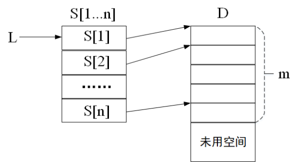

# DS-2019-32

## 1. 原题

设有大小不等的 $n$ 个数据组，其数据总量为 $m$，顺序存放在空间区 $D$ 内，每个数据占一个存储单元，数据组的首地址由数组 $S$ 给出，（如下图所示），试编写将新数据 $x$ 插入到第 $i$ 个数据组的末尾且属于第 $i$ 个数据组的算法，插入后，空间区 $D$ 和数据组 $S$ 的相互关系仍然保存正确。



> 读图说明：fig4 为清晰印刷体示意图。左侧是**组表** $S[1\cdots n]$，指针 $L$ 指向 $S[1]$（即 $S$ 为组表的首地址）；$S[i]$ 中存放第 $i$ 个数据组在右侧**空间区** $D$ 中的**首地址**（图中由 $S[1],S[2],S[n]$ 引出的箭头指向 $D$ 中相应单元）。$D$ 中自表头起连续存放全部 $n$ 个数据组，已被占用 $m$ 个单元（图中虚线括号标注 $m$），其后为"未用空间"。

## 2. 答案

**核心思路**：$n$ 个数据组在 $D$ 中**连续无缝**存放，故"第 $i$ 组的末尾"就是"第 $i+1$ 组的首地址之前"，即位置 $S[i+1]-1$；要在末尾插入一个新数据，必须先把 $D[S[i+1]\cdots m-1]$（第 $i+1$ 组到第 $n$ 组的全部数据）整体后移一个单元腾出 $D[S[i+1]]$，写入 $x$，再把 $S[i+1\cdots n]$ 各加 $1$、$m$ 加 $1$。若 $i=n$（最后一组），其后无数据，直接在 $D[m]$ 追加即可。

算法代码见第 6 节（3），复杂度为时间 $O(m+n)$（$m$ 为 $D$ 中已用单元数、$n$ 为组数；最好情形 $i=n$ 时 $O(1)$），空间 $O(1)$。

## 3. 题目分析

- 已知：$n$ 个大小不等的组、共 $m$ 个数据，全部**顺序**存放在空间区 $D$ 中；组表 $S[1\cdots n]$ 给出每组的首地址；$D$ 中 $m$ 之后是未用空间；
- 目标：写一个算法，把新数据 $x$ 插入到**第 $i$ 组的末尾**，且插入后"$D$ 与 $S$ 的相互关系仍正确"；
- 关键约束（三条不变量，缺一不可）：
  1. **有序性**：$S[1]<S[2]<\cdots<S[n]\le m$（组号大的组在 $D$ 中位置靠后）；
  2. **无缝性**：第 $k$ 组恰好占据 $D[S[k]\cdots S[k+1]-1]$（$k<n$），第 $n$ 组占据 $D[S[n]\cdots m-1]$，组与组之间不留空隙；
  3. **归属性**：$x$ 必须落在第 $i$ 组的区间内（成为该组最后一个元素），而不是落在组间空隙或 $D$ 的未用区；
- 命题意图：考"顺序表的插入"这一基本操作在**多段共享一块连续空间**场景下的推广——不仅要移动元素，还要**同步维护地址索引表 $S$**；"插入后关系仍正确"这一句就是要求考生自己写出并守住上面的不变量。

## 4. 核心考点

核心考点：
DS01.02.01 顺序存储（顺序表：插入/删除/查找与移动次数）——本题就是"在顺序表某个位置插入一个元素"，只是插入位置由组表 $S$ 算出，且插入后必须同步修正 $S$ 中受影响的地址

辅助考点：
DS01.01 线性表的基本概念（$D$ 是"一组数据的线性表"，$S$ 是"组的线性表"，两层线性表的对应关系即本题的存储模型）
DS01.03 线性表的应用（多个逻辑表共用一个存储空间、以辅助表记录各段起点，是顺序表在"多组/变长记录"场景下的典型应用写法）

解释：算法主体动作是"算出插入位置 → 后移腾位 → 写入 → 修正索引 → 更新长度"，全部属于顺序表插入操作（DS01.02.01）；"组间无缝、地址随移动同步变化"这一模型属线性表应用（DS01.03）。

## 5. 解题思路

1. **把图翻译成数学关系**：由 fig4 读出"$S[k]$ 是第 $k$ 组在 $D$ 中的首地址"，又因各组连续无缝存放，得
   $$\text{第 }k\text{ 组} = D[S[k]\cdots S[k+1]-1]\ (k<n),\qquad \text{第 }n\text{ 组} = D[S[n]\cdots m-1]$$
   由此立刻得到两个派生量：第 $k$ 组的长度 $=S[k+1]-S[k]$（末组 $=m-S[n]$），第 $k$ 组末尾的下一个位置 $=S[k+1]$（末组 $=m$）；
2. **定插入位置**：要"插入到第 $i$ 组末尾且属于第 $i$ 组"，$x$ 的新位置必须是原来"第 $i$ 组末尾之后"的那个单元，即
   $$pos=\begin{cases}S[i+1], & i<n\\ m, & i=n\end{cases}$$
3. **判断能否就地放**：$pos<m$（即 $i<n$）时该单元已被第 $i+1$ 组占用，必须**后移** $D[pos\cdots m-1]$ 这 $m-pos$ 个数据（自右向左逐个搬，避免覆盖）；$i=n$ 时 $pos=m$ 正落在未用空间，无需移动；
4. **写 $x$ 并同步元数据**：$D[pos]=x$；凡首地址 $>pos$ 的组（即 $S[i+1\cdots n]$）都要 $+1$；最后 $m+1$；
5. **补边界**：组号 $i$ 是否合法（$1\le i\le n$）、$D$ 是否已满（$m<MaxSize$）——两者任一不满足即返回失败，且**不可先移动再检查**；
6. **验证**：用具体小例（$n=4,m=12$）代入，逐单元核对插入前后各组内容（第 6 节（4）），并检查三条不变量是否仍成立。

## 6. 详细解答

### （1）存储模型与约定

```
   组表 S[1..n]                        空间区 D[0..MaxSize-1]
   ┌────────┐                          ┌──────┐ ← S[1] = 0     ┐
 L→│ S[1]   │ ───────────────────────►  │  a1  │              │ 第 1 组
   ├────────┤                          ├──────┤ ← S[2] = 3     ┘  (3 个)
   │ S[2]   │ ───────────────────────►  │  a2  │              ┐ 第 2 组
   ├────────┤                          ├──────┤              ┘  (2 个)
   │  ...   │                          │  a3  │ ← S[3] = 5   ┐
   ├────────┤                          ├──────┤              │ 第 3 组
   │ S[n]   │ ───────────────────────►  │ ...  │              ┘  (4 个)
   └────────┘                          ├──────┤ ← S[n+1]≡m     ┐
                                       ├──────┤                │ 未用空间
                                       │      │  ← 新数据可放处  ┘
                                       └──────┘
```

- 下标约定：$D$ 与 $S$ 均为 C 数组，$D$ 的下标从 $0$ 开始；$S$ 按题面用 $S[1\cdots n]$（$S[0]$ 不用）；
- 长度信息：$m$ 记录 $D$ 中**已被 $n$ 个组占用的单元数**，未用空间自 $D[m]$ 起（图中 $m$ 的括号右端正是"第 $n$ 组末尾的下一格"）；
- 因此本题模型是"**一块连续空间被 $n$ 个变长段无缝瓜分，段起点登记在 $S$ 中**"。

### （2）插入位置的推导（算法正确性的关键）

第 $i$ 组占据 $D[S[i]\cdots S[i+1]-1]$，所以"第 $i$ 组的末尾之后"这个位置是 $S[i+1]$。要把 $x$ 作为第 $i$ 组的**新末尾**，就必须让 $x$ 落在 $S[i+1]$ 这个下标上（$i=n$ 时是 $m$）：

$$pos=\begin{cases}S[i+1] & (1\le i<n)\\[2pt] m & (i=n)\end{cases}$$

插入后第 $i$ 组变为 $D[S[i]\cdots pos]$（长度 $+1$），第 $i+1$ 组起点后移到 $pos+1$，其后各组起点依次 $+1$。

**为什么必须"后移"而不能"前移"或直接追加**：$D$ 中 $m$ 之前无空隙，$pos$ 右边的数据只能往右搬；把 $D[0\cdots pos-1]$ 前移一位需要 $D$ 左端预留空位（图中 $L$ 指向 $S[1]$、$D$ 从 $0$ 起即无左端余量），故不可行；把 $x$ 直接放到 $D[m]$ 则它属于第 $n$ 组而非第 $i$ 组（违反"归属性"），除非 $i=n$。

### （3）教材风格 C 代码

```c
#define MaxSize 1000                 /* 空间区 D 的总容量 */
#define OK 1
#define ERROR 0
typedef int Status;
typedef int ElemType;                /* 每个数据占一个存储单元 */

typedef struct {
    ElemType D[MaxSize];             /* 空间区：n 个数据组连续存放，下标 0..m-1 */
    int      S[100];                 /* 组表：S[1..n] 为各数据组在 D 中的首地址 */
    int      n;                      /* 数据组个数 */
    int      m;                      /* 已占用单元总数（数据总量），未用空间自 D[m] 起 */
} GrpList;

/* 把新数据 x 插入第 i 个数据组的末尾（x 属于第 i 组），插入后保持 D 与 S 的关系正确 */
Status InsertToGroup(GrpList *G, int i, ElemType x)
{
    int k, pos;

    if (i < 1 || i > G->n)           /* 组号非法 */
        return ERROR;
    if (G->m >= MaxSize)             /* 空间区已满，无单元可用 */
        return ERROR;

    /* 插入位置：第 i 组末尾之后 = 第 i+1 组首地址；i 为最后一组时 = m（未用空间起点） */
    pos = (i < G->n) ? G->S[i + 1] : G->m;

    /* ① 把 pos 及其后的所有数据自右向左依次后移一个单元，腾出 D[pos] */
    for (k = G->m - 1; k >= pos; k--)
        G->D[k + 1] = G->D[k];

    /* ② 新数据落位，成为第 i 组的新末尾元素 */
    G->D[pos] = x;

    /* ③ 第 i+1..n 组各有一个元素被后移，其首地址同步加 1 */
    for (k = i + 1; k <= G->n; k++)
        G->S[k]++;

    /* ④ 已用单元总数加 1 */
    G->m++;

    return OK;
}
```

**代码要点说明**

- 步骤①的循环方向必须是**从右往左**（`k` 从 $m-1$ 递减到 $pos$）：若从左往右移，$D[k+1]=D[k]$ 会先把右边的数据覆盖掉；
- 步骤③只修正 $S[i+1\cdots n]$：第 $1\cdots i$ 组的数据一个也没动，首地址不变；第 $i$ 组本身首地址也不变，只是长度 $+1$；
- ①的顺序不能颠倒（先改 $S$ 就找不到移动起点了），④必须最后做（$m$ 是移动循环的边界）。

**等价的"哨兵"写法（可去掉 $i=n$ 的分支）**：若允许组表多留一格，令 $S[n+1]\equiv m$ 恒表示"未用空间起点"，则 $pos$ 统一为 $S[i+1]$，且每次只需把 $S[i+1\cdots n+1]$ 各加 $1$（含 $S[n+1]$，即 $m$ 也随之 $+1$）：

```c
Status InsertToGroup_Sentinel(GrpList *G, int i, ElemType x)   /* 需约定 S[n+1] == m */
{
    int k, pos;
    if (i < 1 || i > G->n || G->m >= MaxSize) return ERROR;
    pos = G->S[i + 1];                       /* 第 i 组末尾之后，统一表达 */
    for (k = G->m - 1; k >= pos; k--) G->D[k + 1] = G->D[k];
    G->D[pos] = x;
    for (k = i + 1; k <= G->n + 1; k++) G->S[k]++;   /* 含哨兵 S[n+1]，故不必再单独 m++ */
    return OK;
}
```

卷面作答时给出主写法即可，哨兵写法可作为"讨论改进"附注。

### （4）实例验证

取 $n=4$、$m=12$，$S=(S[1],S[2],S[3],S[4])=(0,3,5,9)$，即

| 组 | 区间 | 数据 | 长度 |
|---|---|---|---|
| 第 1 组 | $D[0\cdots2]$ | $a_1\,a_2\,a_3$ | $3=S[2]-S[1]$ |
| 第 2 组 | $D[3\cdots4]$ | $b_1\,b_2$ | $2=S[3]-S[2]$ |
| 第 3 组 | $D[5\cdots8]$ | $c_1\,c_2\,c_3\,c_4$ | $4=S[4]-S[3]$ |
| 第 4 组 | $D[9\cdots11]$ | $d_1\,d_2\,d_3$ | $3=m-S[4]$ |

**情形 A：插入 $x$ 到第 2 组末尾（$i=2<n$）**

1. $pos=S[3]=5$；
2. 后移 $D[5\cdots11]\to D[6\cdots12]$（共 $m-pos=12-5=7$ 次赋值）：

   | 下标 | 0 | 1 | 2 | 3 | 4 | 5 | 6 | 7 | 8 | 9 | 10 | 11 | 12 |
   |---|---|---|---|---|---|---|---|---|---|---|---|---|---|
   | 后移后 | $a_1$ | $a_2$ | $a_3$ | $b_1$ | $b_2$ | — | $c_1$ | $c_2$ | $c_3$ | $c_4$ | $d_1$ | $d_2$ | $d_3$ |

3. $D[5]=x$；$S[3],S[4]$ 各 $+1$ ⟹ $S=(0,3,6,10)$；$m=13$；

   | 下标 | 0 | 1 | 2 | 3 | 4 | 5 | 6 | 7 | 8 | 9 | 10 | 11 | 12 |
   |---|---|---|---|---|---|---|---|---|---|---|---|---|---|
   | 结果 | $a_1$ | $a_2$ | $a_3$ | $b_1$ | $b_2$ | $x$ | $c_1$ | $c_2$ | $c_3$ | $c_4$ | $d_1$ | $d_2$ | $d_3$ |

4. **核对不变量**：$S[1]{=}0<S[2]{=}3<S[3]{=}6<S[4]{=}10\le m{=}13$ ✓；第 2 组 $=D[3\cdots S[3]-1]=D[3\cdots5]=(b_1,b_2,x)$，$x$ 在末尾且属于第 2 组 ✓；第 3 组 $=D[6\cdots9]=(c_1\cdots c_4)$、第 4 组 $=D[10\cdots12]=(d_1,d_2,d_3)$，内容与插入前完全相同 ✓（其余组未被破坏）。

**情形 B：插入 $x$ 到第 4 组末尾（$i=n$）**

$pos=m=12$，移动循环 `for(k=11;k>=12;k--)` 一次也不执行（$11<12$ 条件即假），直接 $D[12]=x$，步骤③的循环也不执行，$m=13$，$S$ 不变 ⟹ 第 4 组变为 $(d_1,d_2,d_3,x)$ ✓（等价于"追加"，$O(1)$）。

**情形 C：插入 $x$ 到第 1 组末尾（$i=1$，移动量最大的一侧）**

$pos=S[2]=3$，后移 $D[3\cdots11]$ 共 $9$ 个单元，$S[2],S[3],S[4]$ 各 $+1$ ⟹ $S=(0,4,7,11)$，$m=13$ ✓。可见 $i$ 越小移动量越大，$i=1$ 时最坏。

**情形 D：非法输入**

$i=0$ 或 $i>n$（如 $i=5$）：第一条判断即返回 `ERROR`，$D$、$S$、$m$ 均未被改动 ✓；$m=MaxSize$：同样提前返回，不会出现 $D[m]$ 越界写 ✓。

### （5）复杂度分析

记 $n$ 为**数据组个数**、$m$ 为**空间区 $D$ 中已占用的单元总数（即全部数据个数）**，$pos$ 为插入位置：

- **时间**：步骤①移动 $m-pos$ 个元素（$i<n$ 时 $m-pos=m-S[i+1]$，即第 $i+1$ 组到第 $n$ 组的数据总量），步骤③修改 $n-i$ 个组表项，其余为常数量。故
  $$T=O\big((m-pos)+(n-i)\big)\subseteq O(m+n)$$
  最坏 $i=1$：移动 $m-S[2]$ 个单元、改 $n-1$ 个表项，$T=O(m+n)$；最好 $i=n$：$T=O(1)$。由于 $m\ge n$（每组至少一个数据，题面"大小不等的 $n$ 个数据组"），通常记作 $O(m)$；
- **空间**：只用 $k$、$pos$ 两个辅助变量，原地操作，$S_p=O(1)$；
- **与顺序表插入的对应**：这就是 DS01.02.01 中"在长度为 $m$ 的顺序表第 $pos$ 个位置插入一个元素需后移 $m-pos$ 个元素"的结论，只是插入位置由组表算出、并额外要求同步修正 $S$（多一个 $O(n-i)$ 项）。

## 7. 选项分析

不适用（程序设计题）。

## 8. 考场标准答案

**基本思想**：$n$ 个数据组在 $D$ 中连续存放，故第 $i$ 组占 $D[S[i]\cdots S[i+1]-1]$（$i<n$），第 $n$ 组占 $D[S[n]\cdots m-1]$。插入点 $pos$ 取 $S[i+1]$（$i=n$ 时取 $m$）；先把 $D[pos\cdots m-1]$ **自右向左**后移一格腾出 $D[pos]$，写入 $x$，再把 $S[i+1\cdots n]$ 各加 $1$、$m$ 加 $1$，即保持 $D$ 与 $S$ 关系正确。

```c
Status InsertToGroup(ElemType D[], int S[], int n, int *pm, int i, ElemType x)
{
    int k, pos, m = *pm;
    if (i < 1 || i > n || m >= MaxSize) return ERROR;      /* 组号非法 / 空间已满 */
    pos = (i < n) ? S[i + 1] : m;                          /* 第 i 组末尾之后 */
    for (k = m - 1; k >= pos; k--) D[k + 1] = D[k];        /* 后移第 i+1..n 组，腾出 D[pos] */
    D[pos] = x;                                            /* x 成为第 i 组的新末尾 */
    for (k = i + 1; k <= n; k++) S[k]++;                   /* 其后各组首地址加 1 */
    *pm = m + 1;                                           /* 已用单元数加 1 */
    return OK;
}
```

**复杂度**：$n$ 为组数、$m$ 为 $D$ 中数据总量；时间 $O(m+n)$（最坏 $i=1$ 时移动 $m-S[2]$ 个单元，最好 $i=n$ 时 $O(1)$），空间 $O(1)$。

## 9. 易错点

1. **插入位置算错**：写成 $pos=S[i]+1$（那是"第 $i$ 组第 2 个元素"的位置）或 $pos=S[i+1]-1$（那是第 $i$ 组**当前末尾**，写入会覆盖原数据）；正确是 $pos=S[i+1]$（$i=n$ 时为 $m$）；
2. **移动方向写反**：`for(k=pos;k<=m-1;k++) D[k+1]=D[k]` 会用已被覆盖的值去覆盖下一个单元，整段数据错乱；必须**自右向左**（$k$ 从 $m-1$ 递减到 $pos$）；
3. **忘记同步修正组表**：只移动 $D$ 而不改 $S[i+1\cdots n]$，则第 $i+1$ 组首地址仍指向 $x$ 所在单元，$x$ 会被误认为第 $i+1$ 组的第一个数据，违反"属于第 $i$ 组"；
4. 修正 $S$ 时**多改了 $S[i]$**：第 $i$ 组首地址不变（它前面的组也没动），只有 $k>i$ 的表项才 $+1$；
5. **忘记 $m$ 要加 $1$**：下次插入/遍历末组时会漏掉新元素；
6. 漏 $i=n$ 的分支：此时 $S[n+1]$ 不存在，若不特判而直接取 $S[i+1]$ 会读到无关键值（或数组越界）；
7. 漏边界检查：$i<1$、$i>n$、$m==MaxSize$（$D$ 已满）三种情况必须先判后做，否则 $D[m]$ 越界写；
8. 误答"把 $x$ 放到 $D[m]$ 即可"：那样 $x$ 属于第 $n$ 组而不是第 $i$ 组（仅当 $i=n$ 时成立）——这是本题最典型的错解；
9. 把 $L$ 当成"必须使用的指针"：$L$ 只是 $S$ 表首地址的图示，算法里用数组名 $S$ 即可，不必在代码中处理 $L$。

## 10. 一句话规律

"多段共用一块连续空间"的题，先写下**三条不变量**（$S$ 递增、组间无缝、第 $k$ 组区间 $[S[k],S[k{+}1})$），插入位置一律取"下一组的首地址"（末组取 $m$）；凡是后移了数据，就**必须同步把受影响的地址索引全部修正**——移动 $D$ 与改 $S$ 是一体的两步，只做其一必错。

## 11. 关联知识

- 本卷 DS-2019-23（单链表在已知结点 $*p$ 后插入 vs 按值插入的复杂度）：与本题同为"插入"，可对照"顺序存储插入要移动 $O(m)$ 个元素、链式存储插入只改指针"这一根本差异——本题正因为 $n$ 组数据无缝共享 $D$，才无法回避移动；
- DS-2018-02（$n$ 个元素的顺序表中插入或删除一个元素平均移动 $n/2$ 个元素）、DS-2017-25（等概率删除时的平均移动个数）：本题步骤①的移动次数 $m-pos$ 即该结论在“多组共表”场景下的具体化（插入点越靠前，移动越多）；
- DS-2016-40、DS-2017-37（直接插入排序中的"暂存—后移—落位"）：与本题步骤①②是同一个"自右向左后移"的写法模板，方向搞反即出错，两题可互为练习；
- DS-2019-20（循环队列/顺序存储的下标与边界条件）：同属"顺序存储＋下标同步维护"的考法，边界（满、空、越界）处理思路一致；
- 若允许"组间留空隙"，则可用"每组预留空间 $+\;S$ 记录长度"的方式把插入降为 $O(1)$（空隙用完再整体搬移），这是教材"顺序表插入平均需移动约 $n/2$ 个元素"结论在工程上的常见缓解手段。

## 12. 来源与可信度

- 原题来源：2019 回忆版题面篇 `真题/2019/2019重庆邮电大学802数据结构真题.md` 四、程序设计题第 32 题，题面无订正说明；题图为 `真题/2019/imgs/fig4.png`，读图结论（$L\to S[1]$、$S[i]$ 指向 $D$ 中各组首单元、$D$ 前 $m$ 个单元被 $n$ 组无缝占用、其后为未用空间）已在第 1 节声明；
- 答案来源：独立推导（由图导出三条不变量 → 推出 $pos=S[i+1]$ → 用 $n=4,m=12$ 实例对 $i=1,2,4$ 三种情形逐单元核对，并核对非法输入分支）；未抓取解析篇网页，仅按要求登记其地址备查；
- 教材依据：严蔚敏、吴伟民《数据结构（C 语言版）》2.1 线性表的顺序表示及实现（例 2-1/算法 2.3 `ListInsert`：插入需自最后一个元素起依次后移，并说明插入第 $i$ 个位置需移动 $n-i+1$ 个元素、平均移动量 $\frac{n-1}{2}$）；
- 多来源冲突：无；争议：无（唯一需要约定的量是"$D$ 中已用单元数 $m$ 是否含未用空间"与"$S$ 是否从 $1$ 开始编号"，本题按 fig4 取"$m$ 为已用单元数、未用空间自 $D[m]$ 起、$S[1\cdots n]$"，若按"$m$ 为 $D$ 总长度"或 $1$ 基下标改写，只需同步调整 $pos$ 与循环边界，算法结构不变）；
- 最终可信度：high。
