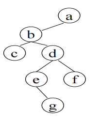

# DS-2020-07

## 1. 原题

将下图中二叉树按中序线索化，结点 $f$ 的右指针和结点 $g$ 的左指针分别指向结点（）。

A. $d,e$

B. $b,d$

C. $d,b$

D. $a,e$



## 2. 答案

**D**：$f$ 的右指针（原为空，改为线索）指向中序后继 $a$；$g$ 的左指针（原为空，改为线索）指向中序前驱 $e$。

## 3. 题目分析

- 已知（读图）：二叉树共 $7$ 个结点，$a$ 为根；$a$ 的左孩子 $b$（$a$ 无右孩子）；$b$ 的左孩子 $c$、右孩子 $d$；$d$ 的左孩子 $e$、右孩子 $f$；$e$ 的**右**孩子 $g$（$e$ 无左孩子）。$c,f,g$ 为叶结点；
- 目标：中序线索化后，读出两个**空指针域**被改写成线索后的指向——$f\to rchild$ 与 $g\to lchild$；
- 关键约束：
  1. 线索化规则：若 $p\to lchild$ 为空，则令其为 $p$ 的**中序前驱**；若 $p\to rchild$ 为空，则令其为 $p$ 的**中序后继**（并置 $ltag/rtag=1$）；
  2. 因此"指向谁"完全由中序遍历序列中该结点的**左右邻居**决定，与树的形状、孩子在哪一侧无关；
  3. 只有**空域**才变线索，非空域仍指孩子——$f$ 是叶结点，两域皆空，故两域都成为线索；
- 表面问题：填两个指针的落点；背后的数据结构问题：**线索二叉树用"空链域存前驱/后继"来消除遍历时的栈开销**——本质是考查"中序序列"与"空指针个数 $=n+1$"这两条基础的联合应用。

## 4. 核心考点

核心考点：
DS03.02.04 线索二叉树——中序线索化的定义（空左域存前驱、空右域存后继）、$ltag/rtag$ 标志的作用、叶结点两域均成为线索

解释：题目问的正是"某结点的空指针域线索化后指向哪个结点"，是线索化构造的直接读图题。

辅助考点：
1. DS03.02.03.02 中序遍历——线索落点等于中序序列中的相邻元素，必须先正确写出 $c,b,e,g,d,f,a$；
2. DS03.02.02 二叉树的存储结构——二叉链表有 $2$ 个指针域、$n$ 个结点共 $2n$ 域、其中 $n-1$ 个非空，故空域数 $=n+1=8$（本题 $n=7$），这解释了"为什么 $f$、$g$ 这些叶结点的指针域一定会变成线索"。

## 5. 解题思路

1. **读图定形状**：把图写成孩子表示 $a(\to l=b,\ r=\varnothing)$、$b(c,d)$、$d(e,f)$、$e(\varnothing,g)$、$c,f,g$ 为叶；
2. **写中序序列**：按"左—根—右"递归展开，得到
   $$c,\ b,\ e,\ g,\ d,\ f,\ a$$
3. **定位两个结点的邻居**：展开 $inorder(a)=inorder(b),\ a$，$inorder(b)=c,\ b,\ inorder(d)$，$inorder(d)=inorder(e),\ d,\ f$，$inorder(e)=e,\ g$，得
   $$c,\ b,\ e,\ g,\ d,\ f,\ a$$
   在此序列中：$f$ 的后一个是 $a$ ⟹ $f\to rchild=a$；$g$ 的前一个是 $e$ ⟹ $g\to lchild=e$；
4. **确认这两域确实是空域**：$f$ 无右孩子、$g$ 无左孩子（都是叶结点），符合"空域才放线索"的前提；
5. **按选项顺序作答**：题目问"先 $f$ 的右、后 $g$ 的左"，即 $(a,e)$ → 选 D；
6. **交叉验证**：用"中序线索化后沿线索可直接走到后继"检查——$g$ 的右域为空，其线索应指向 $g$ 的后继 $d$；$f$ 的左域为空，其线索应指向 $f$ 的前驱 $d$。若某选项把 $d$ 配给"$f$ 的右指针"，就是把"前驱"错当成"后继"（选项 A、C 的由来）。

想到这一点的线索：线索化题目里"某空指针指向谁"永远等价于"该结点在该种遍历序列中的前驱/后继是谁"，所以本题真正的计算量只有一个——写出中序序列。

## 6. 详细解答

**（1）树的结构（读图）**

```
        a
       /
      b
     / \
    c   d
       / \
      e   f
       \
        g
```

$A$ 的孩子：$lchild(a)=b$，$rchild(a)=\varnothing$；$lchild(b)=c$，$rchild(b)=d$；$lchild(c)=rchild(c)=\varnothing$；$lchild(d)=e$，$rchild(d)=f$；$lchild(e)=\varnothing$，$rchild(e)=g$；$lchild(f)=rchild(f)=\varnothing$；$lchild(g)=rchild(g)=\varnothing$。

（读图说明：$g$ 位于 $e$ 的右下方且连线自 $e$ 引出，故为 $e$ 的右孩子；$e$ 的左孩子为空。此判断已放大图像核对。）

**（2）中序遍历序列**

$$inorder(a)=inorder(b)\ \cup\{a\}\ \cup\ inorder(\varnothing)$$
$$inorder(b)=\{c\}\cup\{b\}\cup inorder(d),\qquad inorder(d)=inorder(e)\cup\{d\}\cup\{f\}$$
$$inorder(e)=\varnothing\cup\{e\}\cup\{g\}=\{e,g\}$$

回代：$inorder(d)=e,g,d,f$；$inorder(b)=c,b,e,g,d,f$；

$$\boxed{\text{中序序列} = c,\ b,\ e,\ g,\ d,\ f,\ a}$$

**（3）空指针域（线索化前的候选位置）**

$n=7$，二叉链表指针域共 $14$ 个，非空域 $=n-1=6$（边数），空域 $=8=n+1$：

| 结点 | 空左域 | 空右域 |
|---|---|---|
| $a$ | — | ✓（$a$ 无右孩子）|
| $b$ | — | — |
| $c$ | ✓ | ✓ |
| $d$ | — | — |
| $e$ | ✓ | — |
| $f$ | ✓ | ✓ |
| $g$ | ✓ | ✓ |

合计空域 $1+2+1+2+2=8=n+1$ ✓（与"空指针数 $=n+1$"性质一致，说明第（1）步读图未漏边）

**（4）填线索**

- $f$：左域空 ⟹ 指向中序前驱 $d$；右域空 ⟹ 指向中序后继 $a$。**所求"$f$ 的右指针" $=a$**；
- $g$：左域空 ⟹ 指向中序前驱 $e$；右域空 ⟹ 指向中序后继 $d$。**所求"$g$ 的左指针" $=e$**。

**（5）自我验证（沿线索双向走一遍）**

中序线索化后，从最左结点 $c$ 出发"若 $rtag=1$ 走线索，否则进右子树取最左结点"，应依次得到第（2）步的序列：

$c$（右线索）$\to b$（有右孩子 $d$，进 $d$ 的左子树最左结点）$\to e$（有右孩子）$\to g$（右线索）$\to d$（有右孩子 $f$）$\to f$（右线索）$\to a$（$rtag=1$ 且线索为空，结束）
得到 $c,b,e,g,d,f,a$ 与第（2）步完全一致 ⟹ $f\to rchild=a$、$g\to lchild=e$ 成立。

反向验证：$g$ 的左线索 $=e$，而 $e$ 的右孩子正是 $g$（非空域，不是线索），二者互逆关系符合"前驱的右孩子若是自己，则自己的左线索指向前驱"的结构 ✓。

**答案：D**

## 7. 选项分析

- A（$d,e$）：后半对、前半错。$d$ 是 $f$ 的中序**前驱**（应填在 $f$ 的**左**指针上），把它放到"右指针"是把前驱/后继方向弄反——本题最典型的错误；
- B（$b,d$）：$b$ 既非 $f$ 的前驱也非后继（$b$ 是中序第 2 个结点）；$d$ 是 $g$ 的后继而非前驱，两项都取错了方向/取错了邻居；
- C（$d,b$）：$d$ 是 $f$ 的前驱（方向错），$b$ 与 $g$ 的前驱 $e$ 无关；相当于把"$f$ 的左线索"与"$g$ 的右线索"以外的结点随意配对；
- D（$a,e$）：正确。$a$ 是 $f$ 的中序后继（$f$ 是根 $a$ 左子树中最先被"结束"的结点，其下一个即根 $a$），$e$ 是 $g$ 的中序前驱（$g$ 是 $e$ 的右孩子，$e$ 之后紧接 $g$）。

## 8. 考场标准答案

中序序列：$c,\ b,\ e,\ g,\ d,\ f,\ a$。

线索化规则：空左域 $\to$ 中序前驱，空右域 $\to$ 中序后继。

- $f$ 为叶结点，$rchild$ 空 $\Rightarrow$ 线索指向后继 $a$；
- $g$ 为叶结点，$lchild$ 空 $\Rightarrow$ 线索指向前驱 $e$。

故 $(f\to rchild,\ g\to lchild)=(a,\ e)$，选 **D**。

线索化后该树的结点标志（$0$ 指孩子、$1$ 指线索）：

| 结点 | $ltag$ / 左域 | $rtag$ / 右域 |
|---|---|---|
| $a$ | $0/b$ | $1/\text{NULL}$ |
| $c$ | $1/\text{NULL}$ | $1/b$ |
| $e$ | $1/b$ | $0/g$ |
| $g$ | $1/e$ | $1/d$ |
| $f$ | $1/d$ | $1/a$ |

（$b$、$d$ 两域均指孩子，无变化。）

## 9. 易错点

1. **前驱/后继与左/右域的对应搞反**：左域放**前驱**、右域放**后继**（选项 A 即此陷阱）；
2. **中序序列写错**：$e$ 只有右孩子 $g$，中序中 $e$ 在 $g$ **之前**（"左—根—右"，$e$ 的左子树为空，访问 $e$ 后才进右子树 $g$）；若把 $g$ 看成 $e$ 的左孩子会得到 $g,e,\dots$ 的错误顺序，进而把 $g$ 的前驱算成 $c$ 或 $b$；
3. **把"父结点"当成后继**：$f$ 的父亲是 $d$，而 $d$ 恰好也是 $f$ 的中序**前驱**，不是后继——$f$ 已是根 $a$ 左子树的最后一个结点，其后继是 $a$；这类"叶结点的后继要沿树向上跳到祖先"的情形最容易出错；
4. **忘了只有空域才变线索**：$e\to rchild$ 指向孩子 $g$（非空域），线索化后仍指 $g$，不会变成 $d$；
5. **读图错 $g$ 的归属**：$g$ 若被认作 $f$ 的左孩子，则中序变为 $c,b,e,d,g,f,a$，$g$ 的前驱成 $d$，会误选 B 的后半。

## 10. 一句话规律

线索二叉树的"某指针指向谁"一律三步解：**写出该种遍历的完整序列 → 空左域取前驱、空右域取后继 → 检查该域是否真的为空（非空域仍指孩子）**。

## 11. 关联知识

- 本卷第 32 题（按存储表画出二叉树、写三种遍历、并**画出后序线索树**）：与本题同族，只是把"中序"换成"后序"、把"读两个指针"换成"整棵线索化"，可作本题的完整练习；
- 本库 DS-2018-25（$n$ 结点二叉链表中空链域个数 $=n+1$）：本题第 6 节（3）用来核对读图是否漏边的性质；
- 本库 DS-2006-18（"中序遍历时某结点的直接后继是其右子树中第一个被访问的结点"的判断题）与 DS-2006-37：中序后继的求法，正是"$f$ 无右孩子 ⟹ 后继沿祖先向上"这一分支的理论出处；
- 延伸（DS03.02.04）：中序线索树上找后继分两种情况——$rtag=1$ 直接走线索；$rtag=0$ 则进右子树取最左 descendant；本题 $f$、$g$ 的右域都是 $rtag=1$ 的线索，属第一种；
- 延伸（DS03.02.03）：**后序**线索化时"$g$ 的左线索"会指向后序序列中 $g$ 的前驱（结果与中序不同），说明同一棵树在不同遍历下的线索落点不同，比较两者可加深对"线索 = 遍历序列邻居"的理解。

## 12. 来源与可信度

- 原题来源：2020 回忆版题面篇 `真题/2020/2020重庆邮电大学802数据结构真题.md` 一、选择题第 7 题，题干与四个选项按原文转录，源文无订正说明；题图为 `真题/2020/imgs/fig1.png`，按规范以 `` 引用；
- 图像判读声明：$g$ 与父结点的连线自 $e$ 引出、$g$ 位于 $e$ 右下方，已放大图像核对，判为 $e$ 的右孩子；$a$ 位于右上、$b$ 在其左下，判为 $a$ 的左孩子。若把 $g$ 误读为 $f$ 的左孩子，中序序列将变为 $c,b,e,d,g,f,a$，此时"$f$ 右、$g$ 左"为 $(a,d)$，而 $(a,d)$ 不在四个选项中，反证本题读图正确；
- 答案来源：独立推导（中序序列 $+$ 空域判定 $+$ 沿线索走一遍双向验证 $+$ 空域数 $=n+1$ 核对），三种方法一致；未抓取解析篇网页，仅按要求登记其地址备查；
- 教材依据：严蔚敏、吴伟民《数据结构（C 语言版）》第 6 章 6.4 二叉树的遍历之后的"线索类型定义与中序线索化"（`BiThrTree`：`lchild/ltag/data/rtag/rchild`，`InOrderThreading` 中序线索化算法）；
- 多来源冲突：无。四个选项中仅 D 与"中序后继 $a$、中序前驱 $e$"匹配；
- 争议：无；
- 最终可信度：high。
