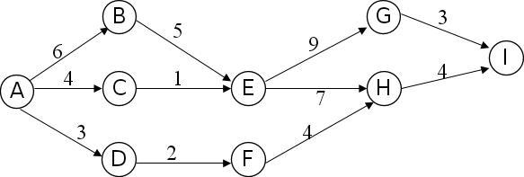

# DS-2020-11

## 1. 原题

在下图中所示的 $AOE$ （ `Activity On Edge` ）网中，关键路径长度为（）。

A. $23$

B. $22$

C. $16$

D. $13$

> **读图转录（本解析所设数据，全部计算均以此为准）**
>
> 顶点（事件）：$A$ 为源点，$I$ 为汇点，中间顶点 $B,C,D,E,F,G,H$。
> 弧（活动）及其权值（持续时间）共 $11$ 条：
>
> | 弧 | $A\to B$ | $A\to C$ | $A\to D$ | $B\to E$ | $C\to E$ | $D\to F$ | $E\to G$ | $E\to H$ | $F\to H$ | $G\to I$ | $H\to I$ |
> |---|---|---|---|---|---|---|---|---|---|---|---|
> | 权值 | $6$ | $4$ | $3$ | $5$ | $1$ | $2$ | $9$ | $7$ | $4$ | $3$ | $4$ |

## 2. 答案

**A**：关键路径长度为 $23$，对应路径 $A\to B\to E\to G\to I$（$6+5+9+3=23$）。

## 3. 题目分析

- 已知：一个 $9$ 顶点、$11$ 条弧的 AOE 网，弧上权值为活动持续时间；源点 $A$（入度 $0$）、汇点 $I$（出度 $0$）；
- 目标：求**关键路径长度**；
- 关键约束：
  1. AOE 网中"路径长度"指路径上**各弧权值之和**，不是弧的条数；
  2. 关键路径定义为**从源点到汇点的最长路径**，其长度即完成整个工程所需的最短工期；
  3. 求最长路径的规范做法：按拓扑序递推事件最早发生时间 $ve$（取 $\max$），$ve(\text{汇点})$ 即为关键路径长度；
  4. 本题规模小，还可以直接穷举 $A\to I$ 的所有路径——两条做法结果必须一致，否则说明读图漏弧；
- 表面问题：算一个数；背后的数据结构问题：**AOE 网与关键路径的计算流程**——$ve$ 的 $\max$ 递推、$vl$ 的 $\min$ 逆推、$e(a)=l(a)$ 的关键活动判定，三者共同构成"工程工期与关键活动"分析。

## 4. 核心考点

核心考点：
DS04.04.04 关键路径（AOE）——关键路径是源点到汇点路径长度（权值和）最长的路径，长度等于汇点事件的最早发生时间 $ve$；关键路径上的活动满足 $e(a)=l(a)$

解释：题目只问"关键路径长度"，即 $ve(I)$，属于关键路径计算流程中最核心的一步。

辅助考点：
1. DS04.04.03 拓扑排序——$ve$ 必须按拓扑序递推（$A,B,C,D,E,F,G,H,I$ 即一个合法拓扑序），否则前驱未定值就无法取 $\max$；
2. DS04.01 图的基本概念——识别源点（入度 $0$）与汇点（出度 $0$）、确认网中无环，是套用 AOE 公式的前提。

## 5. 解题思路

1. **确认网络类型**：边表示活动、顶点表示事件，且只有唯一入度 $0$ 的 $A$ 与唯一出度 $0$ 的 $I$ ⟹ 标准 AOE 网，求"最长路径"而非"最短路径"；
2. **列出所有 $A\to I$ 路径**：$A$ 分出三条支路 $B/C/D$；$B,C$ 汇于 $E$，$D$ 经 $F$ 汇入 $H$；$E$ 又分 $G,H$ 两支到 $I$。故路径共 $2(\text{经}E\text{的前驱})\times2(\text{经}G\text{或}H)+1(\text{经}D,F)=5$ 条；
3. **逐条求权值和**：$23,22,17,16,13$（第 6 节（1）），取最大 $23$；
4. **用 $ve/vl$ 复核**：按拓扑序递推 $ve$ 得 $ve(I)=23$；按逆拓扑序递推 $vl$，找出 $ve=vl$ 的顶点链 $A\to B\to E\to G\to I$，与第 3 步一致；
5. **对照选项**：$23$ 为 A；$22,16,13$ 分别是次长路径、$A\to C\to E\to H\to I$、最短路径，均为"算错方向或漏看分支"的干扰项。

想到这一点的线索：AOE 网求"关键路径长度"= 求"汇点的最早发生时间"= 求"源到汇的最长路径"，三句话是同一件事；小网直接枚举路径最快，大网才需要 $ve/vl$ 表格。

## 6. 详细解答

**（1）穷举 $A\to I$ 的全部路径（方法一）**

拓扑结构：$A\to\{B,C,D\}$，$B\to E$，$C\to E$，$D\to F$，$E\to\{G,H\}$，$F\to H$，$G\to I$，$H\to I$。

| 编号 | 路径 | 权值逐项相加 | 长度 |
|---|---|---|---|
| $p_1$ | $A\to B\to E\to G\to I$ | $6+5+9+3$ | $\mathbf{23}$ |
| $p_2$ | $A\to B\to E\to H\to I$ | $6+5+7+4$ | $22$ |
| $p_3$ | $A\to C\to E\to G\to I$ | $4+1+9+3$ | $17$ |
| $p_4$ | $A\to C\to E\to H\to I$ | $4+1+7+4$ | $16$ |
| $p_5$ | $A\to D\to F\to H\to I$ | $3+2+4+4$ | $13$ |

**路径条数核对**：进入 $I$ 只有 $G\to I$、$H\to I$ 两条弧；到 $G$ 只有 $1$ 条路径（$A\to C\to E\to G$、$A\to B\to E\to G$ 共 $2$ 条）；到 $H$ 有 $3$ 条（经 $E$ 的 $2$ 条 + 经 $F$ 的 $1$ 条）。故 $A\to I$ 路径数 $=2+3=5$，与上表一致，无遗漏 ✓。

最长者为 $p_1$，长度 $23$。

**（2）按拓扑序递推 $ve$（方法二）**

拓扑序取 $A,B,C,D,E,F,G,H,I$（每个顶点的弧尾都排在弧头之前 ✓）。$ve(A)=0$，$ve(j)=\max_{\langle i,j\rangle}\{ve(i)+w(i,j)\}$：

| 事件 | 递推式 | $ve$ |
|---|---|---|
| $A$ | 源点 | $0$ |
| $B$ | $0+6$ | $6$ |
| $C$ | $0+4$ | $4$ |
| $D$ | $0+3$ | $3$ |
| $E$ | $\max(6+5,\ 4+1)=\max(11,5)$ | $11$ |
| $F$ | $3+2$ | $5$ |
| $G$ | $11+9$ | $20$ |
| $H$ | $\max(11+7,\ 5+4)=\max(18,9)$ | $18$ |
| $I$ | $\max(20+3,\ 18+4)=\max(23,22)$ | $\mathbf{23}$ |

$ve(I)=23$ ⟹ 关键路径长度 $=23$ ✓（与方法一一致）。

**（3）逆推 $vl$ 并定位关键活动（自我验证）**

$vl(I)=ve(I)=23$，$vl(i)=\min_{\langle i,j\rangle}\{vl(j)-w(i,j)\}$：

| 事件 | 递推式 | $vl$ | $vl-ve$（事件松弛量） |
|---|---|---|---|
| $I$ | — | $23$ | $0$ |
| $G$ | $23-3$ | $20$ | $0$ |
| $H$ | $23-4$ | $19$ | $1$ |
| $E$ | $\min(20-9,\ 19-7)=\min(11,12)$ | $11$ | $0$ |
| $F$ | $19-4$ | $15$ | $10$ |
| $B$ | $11-5$ | $6$ | $0$ |
| $C$ | $11-1$ | $10$ | $6$ |
| $D$ | $15-2$ | $13$ | $10$ |
| $A$ | $\min(6-6,\ 10-4,\ 13-3)=\min(0,6,10)$ | $0$ | $0$ |

活动松弛量 $l(a)-e(a)=vl(\text{头})-ve(\text{尾})-w$：

| 弧 | $6$ | $4$ | $3$ | $5$ | $1$ | $2$ | $9$ | $7$ | $4$ | $3$ | $4$ |
|---|---|---|---|---|---|---|---|---|---|---|---|
| 弧 | $A\to B$ | $A\to C$ | $A\to D$ | $B\to E$ | $C\to E$ | $D\to F$ | $E\to G$ | $E\to H$ | $F\to H$ | $G\to I$ | $H\to I$ |
| 松弛量 | $0$ | $6$ | $10$ | $0$ | $6$ | $10$ | $0$ | $1$ | $10$ | $0$ | $1$ |

松弛量为 $0$ 的关键活动恰为 $A\to B,\ B\to E,\ E\to G,\ G\to I$，首尾相接成唯一关键路径 $A\to B\to E\to G\to I$，长度 $6+5+9+3=23$ ✓。

**（4）一致性检查**

- 关键路径必须连通源点与汇点：$A\xrightarrow{6}B\xrightarrow{5}E\xrightarrow{9}G\xrightarrow{3}I$ ✓；
- 次长路径 $p_2$ 与关键路径只差 $1$（$E\to H\to I$ 松弛量 $1$），故 $22$ 是"把 $E\to G\to I$ 的 $9+3=12$ 误作 $E\to H\to I$ 的 $7+4=11$"必然掉进的答案——选项 B 的存在反证读图 $E\to G=9$、$G\to I=3$ 无误；
- 各顶点入度/出度核对：$\sum$出度 $=11=\sum$入度 ✓（$A:3$，$B:1$，$C:1$，$D:1$，$E:2$，$F:1$，$G:1$，$H:1$，$I:0$）。

**答案：A**

## 7. 选项分析

- A（$23$）：正确。最长路径 $A\to B\to E\to G\to I$ 的权值和；
- B（$22$）：**最具迷惑性**。它是次长路径 $A\to B\to E\to H\to I$（$6+5+7+4$）的长度；若把 $E\to G$ 的权值 $9$ 与 $E\to H$ 的权值 $7$ 看反，或在 $G,H$ 两条分支中误取"弧数多的一条"，就会得 $22$；
- C（$16$）：错。它是 $A\to C\to E\to H\to I$ 的长度；来源于把"$B\to E$ 的 $5$"与"$C\to E$ 的 $1$"混用（只算了经 $C$ 的支路）；
- D（$13$）：错。它是**最短**路径 $A\to D\to F\to H\to I$ 的长度；把"关键路径"误解为"最省时的路径/最短路径"即落入此项（与 DS-2019-10 的干扰项设置同源）。

## 8. 考场标准答案

关键路径 = 源点 $A$ 到汇点 $I$ 的**最长**路径（权值和最大）。

按拓扑序 $A,B,C,D,E,F,G,H,I$ 求事件最早发生时间：

$$ve(A)=0,\ ve(B)=6,\ ve(C)=4,\ ve(D)=3$$
$$ve(E)=\max(6+5,4+1)=11,\quad ve(F)=3+2=5$$
$$ve(G)=11+9=20,\quad ve(H)=\max(11+7,5+4)=18$$
$$ve(I)=\max(20+3,18+4)=23$$

关键路径长度为 $23$（路径 $A\to B\to E\to G\to I$），选 **A**。

## 9. 易错点

1. **把"关键路径"当成"最短路径"**（选 D）：AOE 网中"关键"指工期瓶颈，取的是**最长**路径；"最短路径"是 Dijkstra 那套另一类问题；
2. **把路径长度数成弧的条数**：$A\to B\to E\to G\to I$ 有 $4$ 条弧，而不是 $23$；长度是权值之和；
3. **$ve$ 递推时用了 $\min$**：$ve$ 必须取 $\max$（所有先行活动都完成才能发生该事件），$vl$ 才取 $\min$；两者取反会得 $ve(I)=13$；
4. **不检查多入度顶点**：$E$ 有两条入弧（$5$ 与 $1$）、$H$ 有两条入弧（$7$ 与 $4$）、$I$ 有两条入弧（$3$ 与 $4$），漏掉任一条 $\max$ 分支就会算小；
5. **不按拓扑序计算**：若先算 $ve(H)$ 再算 $ve(E)$，$ve(H)$ 会因 $E$ 未定值而只能取 $5+4=9$，最终错得 $ve(I)=\max(23,13)=23$ 侥幸正确、但在别的数据下必然出错；
6. **误以为关键路径唯一**：本题恰唯一，但若出现 $ve=vl$ 的两条并列分支，则关键路径有若干条，工期不变。

## 10. 一句话规律

AOE 网"关键路径长度"三步走：**确认源点汇点 → 按拓扑序对每个多入度顶点取 $\max$ 递推 $ve$ → 汇点的 $ve$ 就是答案**；小网可直接穷举所有源到汇路径取最大，两法互验。

## 11. 关联知识

- 本库 DS-2019-10（"关键路径是事件结点网络中从源点到汇点的最长路径"概念题）：本题第 3 节所用的定义，两题一概念一计算，属同一知识点族的两个层次；
- 本库 DS-2018-31（给定 AOE 网求全部 $e/l$、$ve/vl$ 并列出关键路径的综合题）：本题第 6 节（3）那张松弛量表就是它的完整解法，建议按该题格式把本题的 $11$ 条弧全部列表练一遍；
- 本库 DS-2018-29（邻接表上执行拓扑排序）、DS-2021-11（判断哪个序列不是拓扑序）、DS-2014-19（读图选拓扑序）：本题第 6 节（2）"按拓扑序递推"的前置能力；
- 本库 DS-2016-15（判有向图是否有环可用拓扑排序）：AOE 网必须无环，否则 $ve$ 递推不收敛，该题给出判环手段；
- 本卷第 12 题（拓扑有序编号后的邻接矩阵为上三角）：本题拓扑序 $A\sim I$ 若作为顶点编号，其邻接矩阵必为上三角，$ve$ 递推恰好变成"从上往下逐行扫描"；
- 延伸（DS04.04.02）：若把本题的 $\max$ 换成 $\min$、把"最长"换成"最短"，就变成 Dijkstra 最短路径问题，同一张图上两种算法的对照练习价值很高。

## 12. 来源与可信度

- 原题来源：2020 回忆版题面篇 `真题/2020/2020重庆邮电大学802数据结构真题.md` 一、选择题第 11 题，题干与四个选项按原文转录，源文无订正说明；题图按规范以 `` 引用；
- 图像判读声明：$11$ 条弧的方向与权值逐一读自 `真题/2020/imgs/fig2.png`，结点字母 $A\sim I$ 与数字 $6,4,3,5,1,2,9,7,4,3,4$ 均清晰；弧 $E\to H$ 的权值 $7$ 标在弧的下方、弧 $F\to H$ 的权值 $4$ 标在弧的上方，两处已交叉确认不属于同一条弧。**判读正确性的强证据**：按此数据算出的 $5$ 条路径长度 $\{23,22,17,16,13\}$ 中，$23,22,16,13$ 恰为四个选项，说明命题人正是以这些路径（含最短路径与次长路径）设置干扰项；
- 答案来源：独立推导（穷举全部源到汇路径 + $ve$ 拓扑序递推 + $vl$ 逆拓扑序递推与关键活动松弛量），三种方法一致得 $23$；未抓取解析篇网页，仅按要求登记其地址备查；
- 教材依据：严蔚敏、吴伟民《数据结构（C 语言版）》第 7 章 7.5 有向无环图及其应用（AOV 网与拓扑排序、AOE 网与关键路径，$ve(k)$、$vl(k)$、$e(i)$、$l(i)$ 的定义与递推公式）；
- 多来源冲突：无。关键路径长度由图数据唯一确定；
- 争议：无；
- 最终可信度：high。
