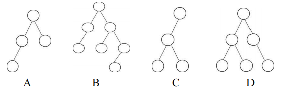

# DS-2020-15

## 1. 原题

下列（）不是 $AVL$ 树（平衡二叉树）。



> 图像读法说明（5× 放大后逐枝核对）：卷面四棵树 $A,B,C,D$ 的结点内**均未标注关键字**，只给出形态（每个圆点的连线落在其左下/右下位置，据此判定左、右孩子）。因此本题只能按 AVL 的**平衡性条件**判定，即"任一结点的左、右子树深度之差的绝对值不超过 $1$"。各选项形态读作：
> - A：根的左、右孩子都存在；左孩子只有左孩子（共 $4$ 个结点，左侧一条长为 $3$ 的左支链）；
> - B：根的左孩子有 $1$ 个左孩子；根的右孩子有左、右两个孩子，且其右孩子还有 $1$ 个左孩子（共 $7$ 个结点）；
> - C：根**只有左孩子**，该左孩子有左、右两个孩子（共 $4$ 个结点）；
> - D：根的左孩子有左、右两个孩子；根的右孩子只有 $1$ 个右孩子（共 $6$ 个结点）。

## 2. 答案

**C**。

## 3. 题目分析

- 已知：四棵二叉树的**形态**（无关键字）；
- 目标：找出不满足平衡二叉树定义的那一棵；
- 关键约束：AVL 树的两条定义性要求——①是二叉排序树；②每个结点的平衡因子 $BF(u)=h_L(u)-h_R(u)\in\{-1,0,+1\}$。卷面未给关键字，故第①条无从（也无需）检验，判据落在第②条；
- 命题意图：考"平衡因子必须**逐结点**检查、且以**子树深度**为度量"，尤其针对"根的一侧子树为空"这种最直观的失衡形态（空子树深度记 $0$，不是 $-1$）。

## 4. 核心考点

核心考点：
DS05.07.02 平衡二叉树（平衡因子定义、$|BF|\le1$ 的逐结点判定）

辅助考点：
DS03.02.01 二叉树的定义及主要特征（左、右子树的区分；空子树深度为 $0$；树的深度递推 $h=1+\max(h_L,h_R)$）

解释：本题不涉旋转、不涉及插入删除后的调整，只考 AVL 的**定义性判别**；而判别动作本身是"按递推式算各结点子树深度"，故需借助 DS03.02.01 的深度与左右子树概念。

## 5. 解题思路

1. 自底向上标出每个结点的子树深度 $h=1+\max(h_L,h_R)$（空子树 $h=0$）；
2. 对每个内部结点算 $BF=h_L-h_R$，一旦出现 $|BF|\ge2$ 立即判为"不是 AVL"；
3. 逐项核对：$A$、$B$、$D$ 全部结点 $|BF|\le1$；$C$ 的根 $BF=2-0=2$，失衡；
4. 用"深度 $h$ 的 AVL 树最少结点数"复核思路不偷工：$N(h)=N(h-1)+N(h-2)+1$，$N(1)=1,N(2)=2,N(3)=4$。$C$ 恰有 $4$ 个结点、深度 $3$，与 $N(3)$ 相等，但它的 $4$ 个结点是"根 $+$ 全挂在左边的 $3$ 个"，右子树深度为 $0$ ——说明**结点数达到下界不代表平衡**，必须逐结点看 $BF$。

## 6. 详细解答

记 $BF(u)=h_L(u)-h_R(u)$，合法 AVL 要求所有结点 $|BF(u)|\le 1$。

**A**（$4$ 结点）

```
      o            层深：叶子=1
     / \           根左孩子 L 带左孩子 LL
   L     R
   |
   LL
```

- $LL$、$R$：$BF=0$；
- $L$：$h_L=1,h_R=0\Rightarrow BF=+1$；
- 根：$h_L=2,h_R=1\Rightarrow BF=+1$。

全部 $|BF|\le1$ ⟹ **是 AVL**。

**B**（$7$ 结点）

```
        o
       / \
      L    R
      |   / \
      LL RL  RR
             |
            RRL
```

- $LL,RL,RRL$：$BF=0$；
- $RR$：$h_L=1,h_R=0\Rightarrow BF=+1$；
- $L$：$BF=+1$；
- $R$：$h_L=1,h_R=2\Rightarrow BF=-1$；
- 根：$h_L=2,h_R=3\Rightarrow BF=-1$。

全部 $|BF|\le1$ ⟹ **是 AVL**。

**C**（$4$ 结点）

```
   o                 根只有左孩子 X
   |                X 有左、右两个孩子
   X
  / \
 x1  x2
```

- $x_1,x_2$：$BF=0$；
- $X$：$h_L=1,h_R=1\Rightarrow BF=0$；
- **根**：$h_L=2$（左子树 $X$ 的深度），$h_R=0$（右子树为空）$\Rightarrow BF=+2$。

$|BF|=2>1$ ⟹ **不是 AVL**。

**D**（$6$ 结点）

```
      o
     / \
    L    R
   / \    \
  LL  LR   RR
```

- 四个叶子：$BF=0$；
- $L$：$h_L=1,h_R=1\Rightarrow BF=0$；
- $R$：$h_L=0,h_R=1\Rightarrow BF=-1$；
- 根：$h_L=2,h_R=2\Rightarrow BF=0$。

全部 $|BF|\le1$ ⟹ **是 AVL**。

**答案**：C。

## 7. 选项分析

- A. 是 AVL：根 $BF=+1$、左孩子 $BF=+1$，左侧虽是一条 $3$ 结点长链，但右侧深度 $1$ 使根的差值仍为 $1$；典型误区是"看到斜链就判失衡"——单看局部链形不够，必须比两侧深度；
- B. 是 AVL：最深的一支在右下的 $R\to RR\to RRL$，但根与 $R$ 处左右深度差都只有 $1$；
- C. **不是 AVL**：根只有左子树（深度 $2$）而右子树为空（深度 $0$），$BF=2$，违反定义；
- D. 是 AVL：根的左右子树深度同为 $2$，$R$ 的 $BF=-1$ 在允许范围内。

## 8. 考场标准答案

对每棵树自底向上求子树深度并算平衡因子 $BF=h_L-h_R$：

- A：根 $2-1=+1$，其余 $\in\{0,+1\}$ ⟹ 平衡；
- B：根 $2-3=-1$，$R:1-2=-1$，$RR:+1$，其余 $0$ ⟹ 平衡；
- C：根 $2-0=\mathbf{+2}$ ⟹ **失衡**；
- D：根 $2-2=0$，$R:0-1=-1$ ⟹ 平衡。

故选 **C**。

## 9. 易错点

1. **空子树深度取 $0$**：C 的根右子树为空，$h_R=0$，故 $BF=2$；若误把空子树深度记作 $-1$ 或"不计"，会漏判；
2. **只查根、不查其余结点**（或反之）：AVL 要求"任一结点"都满足，B、D 的失衡风险出现在中下层结点，必须逐结点算；
3. 把"完全二叉树"当成 AVL 的必要形态：$B$、$D$ 都不是完全二叉树却均平衡，$A$ 是完全二叉树也平衡——两者无必然联系，AVL 只约束子树深度差，不约束是否连续编号；
4. 卷面结点无关键字，**不要试图用"中序是否递增"去判**（无从判起），本题考的就是平衡性这一条形条件。

## 10. 一句话规律

判 AVL 一律自底向上标深度、逐结点算 $BF=h_L-h_R$，只要有一个结点 $|BF|\ge2$ 即出局；空子树深度按 $0$ 计，"只有一侧有子树且该侧深度 $\ge2$"就是最典型的失衡形。

## 11. 关联知识

- 平衡二叉树的插入调整（LL/RR/LR/RL 四类最小不平衡子树的旋转）是本知识点的下一层考法，本题只回到定义作形态判别；
- 结点数最少的 AVL 树满足 $N(h)=N(h-1)+N(h-2)+1$（斐波那契型），可用于"深度 $h$ 至少几个结点"类计算，与本题 C 项"4 结点却失衡"形成对照：该递推给出的是**存在性下界**，不是任意形态都平衡；
- 折半查找的判定树必为平衡二叉树（本卷第 26 题、第 13 题所用），这是 AVL 平衡性在查找效率上的意义。

## 12. 来源与可信度

- 原题来源：2020 回忆版题面篇 `真题/2020/2020重庆邮电大学802数据结构真题.md` 一、选择题第 15 题；题面文字与 `真题/2020/imgs/fig3.png` 按源文转录，本题无订正说明；
- 图像读取：`fig3.png`（$577\times177$）已放大 $5$ 倍分四块逐枝判读，各结点的左/右孩子归属清晰，未发现歧义枝；需说明的是**卷面结点内无关键字**，故解析按"仅判平衡性"的口径作答（已在第 1、3 节声明）；
- 答案来源：独立推导（四棵树逐结点平衡因子表）；未抓取解析篇网页，仅按要求登记其地址备查；
- 教材依据：严蔚敏、吴伟民《数据结构（C 语言版）》9.2.2 平衡二叉树（平衡因子 $|BF|\le1$、平衡二叉树定义）；
- 多来源冲突：无；争议：无（在"结点无关键字、只判平衡"这一唯一可行读法下，答案 $C$ 唯一）；
- 最终可信度：high。
