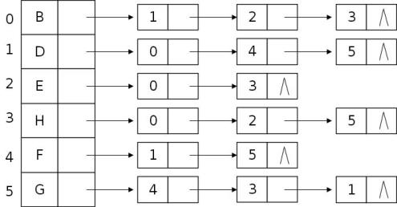

# DS-2020-24

## 1. 原题

一个有向图的邻接表存储如下图所示，现按深度优先搜索方式从顶点 $F$ 出发执行一次遍历，则得到的顶点序列是____________________。



> 读图说明（转录）：图左侧为表头结点数组，行号 $0\sim5$，表头数据域依次是 $B,D,E,H,F,G$；右侧单链表的边表结点内是**邻接顶点的编号**（不是字母），`∧` 表示表尾。逐行读出（保持链表中从左到右的链接次序）：
>
> | 编号 | 顶点 | 边表（链接次序） | 邻接顶点 |
> |---|---|---|---|
> | $0$ | $B$ | $1\to2\to3\to\wedge$ | $D,E,H$ |
> | $1$ | $D$ | $0\to4\to5\to\wedge$ | $B,F,G$ |
> | $2$ | $E$ | $0\to3\to\wedge$ | $B,H$ |
> | $3$ | $H$ | $0\to2\to5\to\wedge$ | $B,E,G$ |
> | $4$ | $F$ | $1\to5\to\wedge$ | $D,G$ |
> | $5$ | $G$ | $4\to3\to1\to\wedge$ | $F,H,D$ |
>
> 核对：$B\!\leftrightarrow\!D$、$B\!\leftrightarrow\!E$、$B\!\leftrightarrow\!H$、$D\!\leftrightarrow\!F$、$D\!\leftrightarrow\!G$、$E\!\leftrightarrow\!H$、$F\!\leftrightarrow\!G$、$H\!\leftrightarrow\!G$ 共 $8$ 条边，且每一对都在两侧表中互现（对称），边表结点总数 $16=2\times8$，符合本卷第 23 题"$\sum\deg=2|E|$"。题面称"有向图"，但表中登记关系对称（等价于每条边存了一对反向弧），故按无向图或按此有向图理解，从 $F$ 出发的 DFS 序列相同。

## 2. 答案

**$F,\ D,\ B,\ E,\ H,\ G$**。

## 3. 题目分析

- 已知：图的邻接表（$6$ 个表头结点、$8$ 条边、$16$ 个边表结点），起点 $F$（编号 $4$）；
- 目标：写出从 $F$ 出发的一次 DFS 顶点访问序列；
- 关键约束：
  1. 邻接表中**访问邻接点的次序由该顶点边表的链接次序决定**，与顶点编号、字母顺序都无关——这是本题的真正考点；
  2. DFS 是"一条路走到黑再回溯"：进入某顶点后立刻对其**第一个未访问邻接点**递归，而不是把当前层的所有邻接点先收集完（那是 BFS）；
  3. 已访问顶点要标记，避免沿无向边（或反向弧）走回；
  4. 一次遍历应从起点覆盖其所在连通分量的全部顶点（本题图连通，应输出 $6$ 个顶点，可作完整性自检）；
- 命题意图：考"邻接表 + DFS"的 trace 能力，重点检查是否会误按编号/字母顺序选邻接点，或误用 BFS 的逐层扩展。

## 4. 核心考点

核心考点：
DS04.02.02 邻接表法（表头数组 + 边表的结构；边表结点存邻接点编号；由邻接表确定访问次序）

辅助考点：
DS04.03.01 深度优先搜索（DFS 的递归过程、访问标记、回溯时机与遍历序列）

解释：结果序列同时由"存储结构给出的邻接点次序"和"DFS 的推进规则"决定，二者缺一不可；主考点取邻接表（因为它才是本题信息的载体，图若换成邻接矩阵且顶点同序，序列也一致——但题目特意以邻接表给图，意在考"链表中边的链接次序"）。

## 5. 解题思路

1. 先把邻接表**翻译成顶点名的邻接表**（第 1 节读图表），把编号换成字母，避免 trace 时反复换算出错；
2. 从 $F$ 开始，规则："看当前顶点边表，从左到右找**第一个未访问**的邻接点，立刻跳过去"；跳不动时回溯到上一层继续扫它的剩余链表；
3. 用一张跟踪表记录"当前顶点 / 正在扫描的边 / 动作 / 已访问集合 / 输出序列"，一步一格，不凭记忆跳步；
4. 走完检查两件事：输出是否恰含 $6$ 个互不相同的顶点（图连通 ⟹ 应全覆盖）；每一步的跳转是否都对应表中存在的一条边；
5. 最后再按"编号最小优先"这一常见变体走一遍作对照（本题两种规则结果巧合相同，见第 9 节第 3 条），确认答案稳定。

## 6. 详细解答

**（1）邻接表（换成顶点名，按链表次序）**

$$B\!:\!D,E,H\qquad D\!:\!B,F,G\qquad E\!:\!B,H\qquad H\!:\!B,E,G\qquad F\!:\!D,G\qquad G\!:\!F,H,D$$

**（2）DFS 逐步跟踪**

| 步 | 当前顶点 | 扫描其邻接表 | 判断 | 动作 | 输出序列 |
|---|---|---|---|---|---|
| 1 | $F$ | — | 起点 | 访问 $F$，标记 | $F$ |
| 2 | $F$ | $D$ | $D$ 未访问 | 深入 $D$ | $F,D$ |
| 3 | $D$ | $B$ | $B$ 未访问 | 深入 $B$ | $F,D,B$ |
| 4 | $B$ | $D$ | $D$ 已访问 | 跳过 | $F,D,B$ |
| 5 | $B$ | $E$ | $E$ 未访问 | 深入 $E$ | $F,D,B,E$ |
| 6 | $E$ | $B$ | $B$ 已访问 | 跳过 | $F,D,B,E$ |
| 7 | $E$ | $H$ | $H$ 未访问 | 深入 $H$ | $F,D,B,E,H$ |
| 8 | $H$ | $B$、$E$ | 均已访问 | 跳过 | $F,D,B,E,H$ |
| 9 | $H$ | $G$ | $G$ 未访问 | 深入 $G$ | $F,D,B,E,H,G$ |
| 10 | $G$ | $F$、$H$、$D$ | 均已访问 | 无未访问邻接点，回溯 | 不变 |
| 11 | 回溯 $H\to E\to B$ | $B$ 的 $H$ 已访问 | $B$ 表扫完 | 回溯 $D$ | 不变 |
| 12 | $D$ | $F$、$G$ | 均已访问 | $D$ 表扫完，回溯 $F$ | 不变 |
| 13 | $F$ | $G$ | 已访问 | $F$ 表扫完，遍历结束 | $F,D,B,E,H,G$ |

递归调用栈的变化（自底向上）：

$$(F)\to(F,D)\to(F,D,B)\to(F,D,B,E)\to(F,D,B,E,H)\to(F,D,B,E,H,G)\to\cdots\to(F)\to\varnothing$$

**（3）自检**

- 覆盖性：输出 $6$ 个顶点且互不重复，等于表头结点总数 $6$ ⟹ 图连通、无遗漏 ✓；
- 边的存在性：$(F,D)$、$(D,B)$、$(B,E)$、$(E,H)$、$(H,G)$ 五条树边都能在邻接表中查到（$F$ 表含 $D$；$D$ 表含 $B$；$B$ 表含 $E$；$E$ 表含 $H$；$H$ 表含 $G$）✓；
- 与 BFS 对照（防止混用）：若按广度优先，从 $F$ 出发是 $F,D,G,B,H,E$，与本题答案不同——本题要求 DFS；
- 与"起点取表头首行 $B$"对照：若误从 $B$ 出发是 $B,D,F,G,H,E$，可用来检查是否看清了起点 $F$。

**答案**：$F,\ D,\ B,\ E,\ H,\ G$。

## 7. 选项分析

不适用（填空题）。

## 8. 考场标准答案

邻接表转成"顶点名 + 边表次序"：$F\!:\!D,G$；$D\!:\!B,F,G$；$B\!:\!D,E,H$；$E\!:\!B,H$；$H\!:\!B,E,G$；$G\!:\!F,H,D$。

按"当前顶点边表从左到右取第一个未访问邻接点即深入，无路可走则回溯"：

$$F\xrightarrow{\;D\;}D\xrightarrow{\;B\;}B\xrightarrow{\;E\;}E\xrightarrow{\;H\;}H\xrightarrow{\;G\;}G,\quad G\text{ 的邻接点 }F,H,D\text{ 均已访问}\Rightarrow\text{回溯结束}$$

$$\boxed{\,F,\ D,\ B,\ E,\ H,\ G\,}$$

教材风格的邻接表 DFS（考场书写版）：

```c
Status visited[MAXV];                     /* 0 = 未访问 */
void DFSTraverse(ALGraph G, int start) {   /* start 为起点在表头数组中的下标 */
    for (int i = 0; i < G.vexnum; ++i) visited[i] = 0;
    DFS(G, start);
}
void DFS(ALGraph G, int v) {
    printf("%c ", G.vertices[v].data);     /* 访问：输出顶点信息 */
    visited[v] = 1;
    for (ArcNode *p = G.vertices[v].firstarc; p; p = p->nextarc)  /* 按边表链接次序 */
        if (!visited[p->adjvex]) DFS(G, p->adjvex);
}
```

时间复杂度 $O(|V|+|E|)$（邻接表中每条边至多被扫描一次）；空间复杂度 $O(|V|)$（访问数组与递归栈）。本题 $|V|=6$、$|E|=8$，共输出 $6$ 个顶点。

## 9. 易错点

1. **把边表结点里的编号当字母读**：图中链表存的是 $0\sim5$ 的**编号**，必须回到表头换算（$4\to F$、$1\to D$、$5\to G$）；直接把 $1,5$ 抄进序列是最典型的错；
2. **误用 BFS**：写成 $F,D,G,B,H,E$（先收集 $F$ 的全部邻接点）——DFS 是"见一个就深入"，BFS 才是"逐层铺开"；
3. **按编号/字母最小优先选邻接点**：本题各顶点边表除 $G\ (4\to3\to1)$ 外恰按编号升序链接，且访问到 $G$ 时其邻接点都已访问，故"按链表次序"与"按编号最小优先"两种规则**结果巧合相同**；但一般图中两者会给出不同序列，规范做法永远是**按边表的链接次序**（题给图中 $G$ 行的降序链表正是用来考验这一点的常见干扰设计）；
4. **看错起点**：起点是 $F$（题面指定），不是表头第一行的 $B$；
5. **忘记标记导致死循环**：$F\to D\to F\to D\cdots$ 的错误序列源于未维护 `visited`；无向边（或对称登记）必须靠标记来阻断回头；
6. 遍历结束前不核对顶点数：若序列长度小于 $6$，说明漏走了连通分量中的顶点（例如漏了 $G$，多半是把 $H$ 的边表 $0,2,5$ 只扫了前两个）。

## 10. 一句话规律

邻接表上的遍历，**次序由链表决定**：先把编号换成顶点名重写一遍邻接表，再"扫表→找第一个未访问→立刻深入→无路回溯"，最后用"输出顶点数 $=$ 表头结点数（连通图）"自检。

## 11. 关联知识

- DS04.02.02 中"无向图邻接表的边表结点总数 $=2|E|$"（本卷第 23 题的存储体现）：本题 $16=2\times8$ 正是该结论的实例，也可用来反向核对读图有无漏读；
- 同一张图若改用邻接矩阵（DS04.02.01）存储且顶点序仍为 $B,D,E,H,F,G$，DFS 序列不变——因为两种结构都是按数组/链表下标次序取邻接点；但**逆邻接表**或边表被逆序链接时序列会变，这是"存储结构影响遍历序列"的标准结论；
- 本卷第 25 题（最小生成树算法选择）与本题同属图章，但考的是算法复杂度比较而非 trace；本卷第 12 题（拓扑序与邻接矩阵三角形态）也依赖"顶点编号与存储结构次序的对应"这一同一思想；
- 若图非连通，一次 DFS 只能覆盖一个连通分量，需外层循环调用 `DFSTraverse`（教材 7.4 节）——本题图连通，一次即覆盖全部顶点。

## 12. 来源与可信度

- 原题来源：2020 回忆版题面篇 `真题/2020/2020重庆邮电大学802数据结构真题.md` 二、填空题第 24 题，附图 `真题/2020/imgs/fig4.png`；题面文字按源文原样转录（源文写作"一个有向图的邻接表存储如下图所示"）；
- 图像读取与不确定性声明：`fig4.png` 已直接读取判形，表头字母 $B,D,E,H,F,G$、各行边表结点数字与链尾 `∧` 均可辨；读图结果通过**对称性核对**（$8$ 条边两侧互现）与**边结点总数核对**（$16$ 个结点 $=2\times8$）自洽，故编号—字母对应关系与链表次序的判读可信；仍保留 `ocr_confidence: medium`，理由是回忆版扫描图中 $G$ 行的 $4,3,1$ 与 $H$ 行的 $0,2,5$ 数字较小，若原卷另有粘连/漏读，则只有"访问到 $G$ 之后的分支"会受影响（而该处已无未访问邻接点，不改变序列），因此本题答案对读图误差不敏感；
- 题面"有向图"与图对称登记的关系已在第 1 节声明：两种理解下从 $F$ 出发的 DFS 序列相同（对称登记即每对顶点之间存在方向相反的两条弧）；
- 答案来源：独立推导（读图还原 → 逐步跟踪表 → 覆盖性与边存在性双自检）；未抓取解析篇网页，仅按要求登记其地址备查；
- 教材依据：严蔚敏、吴伟民《数据结构（C 语言版）》第 7 章 7.3 图的存储结构（7.3.2 邻接表法 `ALGraph`/`ArcNode`）、7.4 图的遍历（`DFS`/`DFSTraverse`）；
- 多来源冲突：无；争议：无实质争议（读图口径已在上述声明中固定）；
- 最终可信度：high（答案序列本身），图像判读可信度 medium 已在字段与本节注明。
