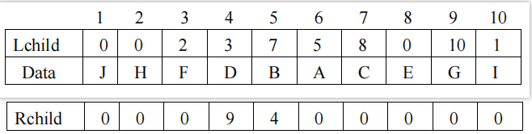

# DS-2020-32

## 1. 原题

一个二叉树 $BT$ 有 $10$ 个结点，$BT$ 为指向树根结点的指针，其值为 $6$，$Lchild, Rchild$ 分别为结点的左、右孩子指针域，$data$ 为结点的数据域。各结点的存储结构如下表所示：

请完成下列各题：

（1）画出二叉树 $BT$ 的逻辑结构；

（2）写出按前序、中序、后序遍历该二叉树所得到的结点序列；

（3）画出二叉树的后序线索树。



表（按图转录，"地址"即数组下标）：

| 地址 | 1 | 2 | 3 | 4 | 5 | 6 | 7 | 8 | 9 | 10 |
|---|---|---|---|---|---|---|---|---|---|---|
| Lchild | 0 | 0 | 2 | 3 | 7 | 5 | 8 | 0 | 10 | 1 |
| Data | J | H | F | D | B | A | C | E | G | I |
| Rchild | 0 | 0 | 0 | 9 | 4 | 0 | 0 | 0 | 0 | 0 |

## 2. 答案

**（1）逻辑结构**（括号内为数组地址）：

```
              A(6)
             /
           B(5)
          /    \
       C(7)    D(4)
       /       /    \
    E(8)    F(3)    G(9)
            /        /
         H(2)     I(10)
                  /
               J(1)
```

**（2）三种遍历序列**

- 前序：`A B C E D F H G I J`
- 中序：`E C B H F D J I G A`
- 后序：`E C H F J I G D B A`

**（3）后序线索树**：空指针改为线索（`→X` 表示线索指向结点 X，`^` 表示空），明细见第 6 节表格；线索共 $11$ 条（$=n+1$）。

## 3. 题目分析

- 已知：二叉树以**静态三数组（顺序/数组）方式**存储，`Lchild[i]`、`Rchild[i]` 给出结点 $i$ 的左右孩子的**地址**，$0$ 表示空；根指针 $BT=6$；
- 目标：由存储结构还原逻辑树 → 写三种遍历 → 再做后序线索化；
- 关键约束：地址不是数据（结点 $1$ 的数据是 `J`），孩子域存的是"下标"，必须用下标查表；$0$ 为空指针；
- 命题意图：三问层层递进——**DS03.02.02 数组存储的解读** → **DS03.02.03 三种遍历的机械执行** → **DS03.02.04 后序线索化（空指针改线索）**，其中第 (3) 问依赖第 (2) 问的后序序列，是"线索=前驱后继"的直译。

## 4. 核心考点

核心考点：
DS03.02.02 二叉树的存储结构（数组/孩子下标表示法：由 `Lchild`、`Rchild` 还原树形）

辅助考点：
DS03.02.03 二叉树的遍历（前/中/后序递归定义与执行）；DS03.02.04 线索二叉树（后序线索化、$n+1$ 个空指针、$ltag/rtag$ 标志）

解释：第 (1) 问的全部信息都在"下标即地址、0 即空"这一存储约定里；第 (2)(3) 问则分别落在遍历与线索化两个节点上，三问共用同一棵树，属"存储→逻辑→遍历→线索"的完整链条。

## 5. 解题思路

1. **建树**：从根 $BT=6$ 出发，按"结点 $i$ 的左孩子 $=Lchild[i]$、右孩子 $=Rchild[i]$"逐层展开：$6\to$（左 $5$，右 $0$）；$5\to$（左 $7$，右 $4$）；$7\to$（左 $8$，右 $0$）；$4\to$（左 $3$，右 $9$）；$3\to$（左 $2$，右 $0$）；$9\to$（左 $10$，右 $0$）；$10\to$（左 $1$，右 $0$）；$8,2,1$ 均为叶；
2. **完整性自检**：访问到的结点集合 $=\{6,5,7,4,3,9,10,8,2,1\}$ 恰为 $10$ 个、无重复、无遗漏，且除根外每个结点恰被引用一次 → 树形正确；
3. **遍历**：按"根左右/左根右/左右根"递归展开（第 6 节给出逐层展开过程，便于人工复现）；
4. **后序线索化**：先写出后序序列并编号，然后对每个结点检查两个指针域——**凡为空者，左域改指后序前驱、右域改指后序后继**；序列首元素无前驱、末元素（根）无后继，留空；
5. **验证线索条数**：二叉树 $n$ 个结点的空指针域数 $=n+1=11$（本题 $3$ 个叶结点贡献 $6$ 个、$5$ 个单孩子结点贡献 $5$ 个，合计 $11$ ✓）。

## 6. 详细解答

### (1) 由存储表还原树形

$BT=6$（数据 `A`）为根。逐结点展开（`L/R` 为左右孩子的地址）：

| 地址 | 数据 | Lchild | Rchild | 含义 |
|---|---|---|---|---|
| 6 | A | 5 | 0 | A 的左孩子为 B，无右孩子 |
| 5 | B | 7 | 4 | B 的左孩子 C、右孩子 D |
| 7 | C | 8 | 0 | C 的左孩子 E，无右孩子 |
| 4 | D | 3 | 9 | D 的左孩子 F、右孩子 G |
| 8 | E | 0 | 0 | E 为叶 |
| 3 | F | 2 | 0 | F 的左孩子 H，无右孩子 |
| 9 | G | 10 | 0 | G 的左孩子 I，无右孩子 |
| 2 | H | 0 | 0 | H 为叶 |
| 10 | I | 1 | 0 | I 的左孩子 J，无右孩子 |
| 1 | J | 0 | 0 | J 为叶 |

树形如第 2 节图；树高 $6$（$A\to B\to D\to G\to I\to J$），叶结点为 $E,H,J$，$n_0=3$、$n_2=2$（$B,D$）满足 $n_0=n_2+1$ ✓，单支结点 $A,C,F,G,I$ 共 $5$ 个，$3+2+5=10$ ✓。

### (2) 三种遍历（逐层展开）

**前序（根→左→右）**
```
A | 前(B子树)
B | 前(C) | 前(D)
C | 前(E) = C E
D | 前(F) | 前(G)
F | 前(H) = F H
G | 前(I) = G I ;  I | 前(J) = I J
```
合并：`A B C E D F H G I J`

**中序（左→根→右）**
```
中(A) = 中(B) A
中(B) = 中(C) B 中(D) = (E C) B 中(D)
中(D) = 中(F) D 中(G) = (H F) D (J I G)
```
（其中 中(G) = 中(I) G = (中(J) I) G = J I G）
合并：`E C B H F D J I G A`

**后序（左→右→根）**
```
后(A) = 后(B) A
后(B) = 后(C) 后(D) B = (E C) (H F J I G D) B
后(D) = 后(F) 后(G) D = (H F) (J I G) D
后(G) = 后(I) G = (J I) G
```
合并：`E C H F J I G D B A`

**互推验证**：由"前序第一个是根 A、中序 A 在最后 ⟹ A 无右孩子" ✓ 与表一致；由"后序最后一个是 A" ✓；前序中 `B C E` 连续、中序中 `E C B` 连续，正对应"B 只有左子树链"。三序列两两可唯一确定同一棵树，说明未抄错。

### (3) 后序线索化

后序序列及编号：

| 序号 | 1 | 2 | 3 | 4 | 5 | 6 | 7 | 8 | 9 | 10 |
|---|---|---|---|---|---|---|---|---|---|---|
| 结点 | E | C | H | F | J | I | G | D | B | A |

线索规则：`lchild` 为空则指**后序前驱**，`rchild` 为空则指**后序后继**。

| 结点 | 左域 | 右域 | 说明 |
|---|---|---|---|
| A | 孩子 B | 线索 `^` | A 是后序末结点，无后继 |
| B | 孩子 C | 孩子 D | 无空域，不产生线索 |
| C | 孩子 E | 线索 → **H** | C 的后继是 H |
| D | 孩子 F | 孩子 G | 无空域 |
| E | 线索 `^` | 线索 → **C** | E 是后序首结点，无前驱；后继为 C |
| F | 孩子 H | 线索 → **J** | F 的后继是 J |
| G | 孩子 I | 线索 → **D** | G 的后继是 D |
| H | 线索 → **C** | 线索 → **F** | H 的前驱 C、后继 F |
| I | 孩子 J | 线索 → **G** | I 的后继是 G |
| J | 线索 → **F** | 线索 → **I** | J 的前驱 F、后继 I |

线索图（实线为孩子，长虚线为线索；结点旁括号内为后序序号）：

```
        A  ─ ─ ─ ─ ─ ─ ─ ─ ─ ─ ─ ─ ─ ─ ┐(右线索 ^：无后继)
       /
    (9)B
     /    \
  (2)C    (8)D
   /       /   \
(1)E    (4)F   (7)G
        /        /
    (3)H      (6)I
               /
            (5)J

全部线索（空链域 → 前驱/后继）：
  E.lch ⇒ ^          E.rch ⇒ C
  C.rch ⇒ H
  H.lch ⇒ C          H.rch ⇒ F
  F.rch ⇒ J
  J.lch ⇒ F          J.rch ⇒ I
  I.rch ⇒ G
  G.rch ⇒ D
  A.rch ⇒ ^          （B、D 两域皆为孩子指针，不产生线索）
```
画法说明：只需在原二叉链表上，把每一个空链域换成指向前驱/后继的虚线箭头即可，具体对应关系即上表与上面的线索清单。

**线索条数验证**：$3$ 个叶结点（$E,H,J$）各贡献 $2$ 条 $=6$，$5$ 个单支结点（$A,C,F,G,I$）各贡献 $1$ 条 $=5$，合计 $11=n+1$ ✓。

**后序线索遍历验证**（后序线索树不能像中序那样直接顺线索走完全部结点，需从根逆向或用栈；此处只验证"前驱/后继"关系与后序序列一致）：沿 $E\xrightarrow{右}C\xrightarrow{右}H\xrightarrow{右}F\xrightarrow{右}J\xrightarrow{右}I\xrightarrow{右}G\xrightarrow{右}D$ 即后序前 $8$ 个结点 ✓。

## 7. 选项分析

不适用（综合应用题）。

## 8. 考场标准答案

**(1)** 依 $BT=6$ 为根、按 `Lchild/Rchild` 下标连线，得第 2 节图（树高 $6$，叶为 $E,H,J$）。

**(2)** 前序 `A B C E D F H G I J`；中序 `E C B H F D J I G A`；后序 `E C H F J I G D B A`。

**(3)** 后序线索：$E.lchild=\hat{}$，$A.rchild=\hat{}$；$E.rchild\to C$，$C.rchild\to H$，$H.lchild\to C$，$H.rchild\to F$，$F.rchild\to J$，$J.lchild\to F$，$J.rchild\to I$，$I.rchild\to G$，$G.rchild\to D$；其余非空链域保持孩子指针。共 $11$ 条线索（含 $2$ 个空标记）。

## 9. 易错点

1. 把"地址"当"数据"：$Lchild[3]=2$ 是"结点 3 的左孩子在下标 2"，即 F 的左孩子是 H，不是"左孩子为 2 号数据"；
2. 忘记根指针 $BT=6$ 而误把下标 $1$ 当根（那样会得到完全不同的树形）；
3. 中序、后序在单支链上易漏：$A,C,F,G,I$ 都只有一个孩子，"左根右"与"根左右"的结果差别明显，不能凭感觉；
4. 线索化时把**非空**的孩子指针也改掉——只有空链域才能放线索（否则需 $ltag/rtag$ 区分，本题 $B,D$ 两结点无线索）；
5. 后序线索方向弄反：左空域指**前驱**、右空域指**后继**；$H$ 的前驱是 $C$ 而不是 $E$（$E$ 是 $C$ 的前驱）；
6. 认为"后序线索树也能沿线索一次走完"：后序线索化后，若某结点只有右子树，其前驱在子树内，线索遍历不连续（这是后序/先序线索树的固有缺陷，教材由此推荐中序线索）。

## 10. 一句话规律

数组存二叉树就是"下标当指针"：先按 $0$=空、非 $0$=孩子地址把树画出来，再套三种遍历口诀；线索化只需"后序排好号，空左指前驱、空右指后继"，并用 $n+1$ 条线索自检。

## 11. 关联知识

- DS03.02.02 的顺序（数组）存储与二叉链表存储的对照：本题是"数组下标模拟指针"，与 $n_0=n_2+1$、$n+1$ 个空指针等计数性质直接相关；
- DS03.02.03：由"前序 + 中序"或"后序 + 中序"可唯一还原本题的树，是第 (1) 问的逆过程；
- DS03.02.04：中序线索化是更常见的考法（线索遍历可行），本题特意考后序，可与中序版本对照理解"为什么后序线索不便遍历"；
- 同型题：2020 年第 7 题（中序线索化后问指定结点的线索指向）与本题第 (3) 问同源，可互为练习。

## 12. 来源与可信度

- 原题来源：2020 回忆版题面篇，本题无订正说明；三个数组的 $30$ 个数值由 `真题/2020/imgs/fig5.png` 放大后逐格读图转录（$10$ 个地址、$10$ 个数据、$0$ 与非 $0$ 分布清晰，读图不确定性低）；
- 答案来源：独立推导（手工递归 + 程序复核三种遍历序列与线索表完全一致）；
- 教材依据：严蔚敏《数据结构（C 语言版）》6.2 二叉树的存储结构、6.3 二叉树的遍历、6.4 线索二叉树；
- 多来源冲突：无；争议：无；
- 最终可信度：high（树形与遍历序列经双重验证；线索表由后序序列直译，可人工复核）。
