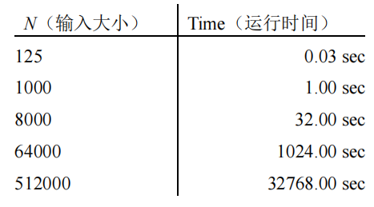

# DS-2020-33

## 1. 原题

当输入大小为 $N$ 时，您为一个程序收集其相应的运行时间。下表记录了在不同的输入 $N$ 情况下，该程序对应的运行时间。

请给出以 $N$ 作为输入的函数来估计该程序的运行时间(以秒为单位)。提示： $\log_b a = \frac{\lg a}{\lg b}$

表（按图转录）：

| $N$（输入大小） | Time（运行时间） |
|---|---|
| 125 | 0.03 sec |
| 1000 | 1.00 sec |
| 8000 | 32.00 sec |
| 64000 | 1024.00 sec |
| 512000 | 32768.00 sec |

## 2. 答案

$$T(N)=\frac{N^{5/3}}{10^{5}}\ \text{秒}\qquad\left(\text{等价写法： } T(N)=\left(\frac{N}{1000}\right)^{5/3}\ \text{秒},\; N \text{ 足够大时}\right)$$

即该程序的时间复杂度为 $T(N)=\Theta\!\left(N^{5/3}\right)\approx\Theta(N^{1.67})$。

## 3. 题目分析

- 已知：五组成对的 $(N,T)$ 数据，$N$ 依次为 $125,1000,8000,64000,512000$（后一个都是前一个的 $8$ 倍），$T$ 依次为 $0.03,1,32,1024,32768$ 秒；
- 目标：拟合出幂函数 $T(N)=c\,N^{k}$ 中的 $c$ 与 $k$；
- 关键约束：答案要"以秒为单位"，且必须能同时解释全部五组数据（不能只用其中两组）；
- 命题意图：考**由实验数据反推时间复杂度**——"规模等比放大、时间也等比放大，放大倍数的对数比就是指数"，这正是提示 $\log_b a=\lg a/\lg b$ 的用途；与 DS-2020-29（已知指数求时间）互为逆问题。

## 4. 核心考点

核心考点：
DS00.02 算法与算法分析（语句频度/时间复杂度的幂律形式 $T=cN^k$，由实测数据确定 $k$ 与 $c$）

解释：题面不涉及任何具体数据结构，纯粹是"运行时间的量级建模"，故只归绪论章 DS00.02；无第二考点。

## 5. 解题思路

1. 先找规律：$N$ 每次乘 $8$，$T$ 每次乘多少？算相邻比值 → $32/1=32$、$1024/32=32$、$32768/1024=32$，第一组 $1/0.03\approx 33.3$ 略偏大，怀疑 $0.03$ 是四舍五入值；
2. 比值恒定 ⟹ 幂律成立：设 $T=cN^k$，则 $\dfrac{T(8N)}{T(N)}=8^{k}=32$；
3. 用提示解指数：$k=\log_8 32=\dfrac{\lg 32}{\lg 8}=\dfrac{5\lg 2}{3\lg 2}=\dfrac{5}{3}$；
4. 代一组"整数友好"的数据定常数：$N=1000=10^{3}$ 时 $T=1$，$1000^{5/3}=(10^{3})^{5/3}=10^{5}$，故 $c=1/10^{5}=10^{-5}$；
5. **回代全部五组验证**（第 6 节），特别是 $N=125$ 应得 $0.03125$，与表中 $0.03$ 吻合（保留两位小数），从而确认第 1 组不是反例。

## 6. 详细解答

**第一步：确认幂律假设**

$$\frac{1024}{32}=32,\qquad \frac{32768}{1024}=32,\qquad \frac{32}{1.00}=32,\qquad \frac{1.00}{0.03}\approx 33.3$$

$N$ 的比值恒为 $8$，$T$ 的比值恒为 $32$（第一处偏差来自 $0.03$ 的舍入），故 $T$ 与 $N$ 的幂成正比，与"运行时间 $\approx cN^k$"的建模一致。

**第二步：求指数 $k$**

设 $T(N)=cN^{k}$，则
$$\frac{T(8N)}{T(N)}=\frac{c(8N)^{k}}{cN^{k}}=8^{k}=32$$
两边取常用对数并用题给提示：
$$k=\log_{8}32=\frac{\lg 32}{\lg 8}=\frac{\lg 2^{5}}{\lg 2^{3}}=\frac{5\lg 2}{3\lg 2}=\frac{5}{3}\approx 1.67$$

（排除法自检：若 $k=1$ 则比值应为 $8$；若 $k=2$ 应为 $64$；若 $k=3$ 应为 $512$——实测 $32$ 恰为 $8^{5/3}$，故 $k=5/3$ 唯一。）

**第三步：求常数 $c$**

取 $N=1000,\;T=1.00$：
$$1=c\cdot 1000^{5/3}=c\cdot\left(10^{3}\right)^{5/3}=c\cdot 10^{5}\ \Longrightarrow\ c=10^{-5}$$

**第四步：五组数据全量回代**

| $N$ | $N^{5/3}$ 的计算 | 预测 $T=N^{5/3}\times10^{-5}$ | 实测 | 判定 |
|---|---|---|---|---|
| 125 $=5^{3}$ | $5^{5}=3125$ | $0.03125$ s | 0.03 s | ✓（两位小数舍入） |
| 1000 $=10^{3}$ | $10^{5}=100000$ | $1.00000$ s | 1.00 s | ✓ |
| 8000 $=20^{3}$ | $20^{5}=3.2\times10^{6}$ | $32.0000$ s | 32.00 s | ✓ |
| 64000 $=40^{3}$ | $40^{5}=1.024\times10^{8}$ | $1024.00$ s | 1024.00 s | ✓ |
| 512000 $=80^{3}$ | $80^{5}=3.2768\times10^{9}$ | $32768.0$ s | 32768.00 s | ✓ |

五组全部吻合，模型成立。

**结论**：
$$\boxed{T(N)=\dfrac{N^{5/3}}{100000}\ \text{秒}}$$
时间复杂度 $T(N)=O\!\left(N^{5/3}\right)$。

**外推示例（说明模型用途）**：$N=27000=30^{3}$ 时 $T=30^{5}/10^{5}=243\times10^{5}/10^{5}=24.3$ 秒。

## 7. 选项分析

不适用（综合应用题）。

## 8. 考场标准答案

由表可见 $N$ 每增大为 $8$ 倍，$T$ 增大为 $32$ 倍。设 $T(N)=cN^{k}$，则
$$8^{k}=32\ \Rightarrow\ k=\log_{8}32=\frac{\lg 32}{\lg 8}=\frac{5}{3}$$
以 $N=1000,\,T=1$ 代入：$c=1/1000^{5/3}=10^{-5}$。
$$T(N)=10^{-5}N^{5/3}=\frac{N^{5/3}}{100000}\ \text{秒}，\quad T(N)=O(N^{5/3})$$
（回代 $N=125,8000,64000,512000$ 分别得 $0.03125,32,1024,32768$ 秒，与实测一致。）

## 9. 易错点

1. 用 $N=125$ 那一组定常数：$c=0.03/3125=9.6\times10^{-6}$，与真值 $10^{-5}$ 有 $4\%$ 偏差，因为表中 $0.03$ 是舍入值——定常数要挑"整数友好且未舍入"的那组（$N=1000,T=1.00$）；
2. 把 $k$ 解成 $\log_{32}8=3/5$（底数与真数写反）：$8^k=32$ 中 $8$ 是规模比、$32$ 是时间比，$k=\dfrac{\lg(\text{时间比})}{\lg(\text{规模比})}$；
3. 误按 $T=cN^2$ 或 $T=cN^3$ 拟合（$64$ 倍/$512$ 倍）而强行解释数据；
4. 忘记单位：题表已是秒，若题目给毫秒需换算（对照 DS-2020-29 的"毫秒→秒"陷阱）；
5. 只验证一两组就下结论：本题五组数据是"免费"的检验集，必须全用。

## 10. 一句话规律

由实测数据定复杂度就一句话：**规模比 $b$、时间比 $a$，则 $k=\log_b a=\dfrac{\lg a}{\lg b}$，再挑一组"干净"数据定系数 $c$，最后把所有数据回代验证。**

## 11. 关联知识

- DS-2020-29 是本演的逆问题（已知 $k=2$ 与一组数据，求另一规模的耗时）；两题合起来即"幂律三量（$n$ 比、$T$ 比、指数）知二求一"；
- DS-2020-01（2020 年第 1 题）与 DS-2020-16 考查 $O(\cdot)$ 的定义与增长率比较，本题的 $N^{5/3}$ 恰落在 $O(N\log N)$ 与 $O(N^{2})$ 之间，可用来训练增长率直觉；
- 若数据规模比不恒定（如本题若为 $2,3,5,\dots$），则需先取对数化为线性回归：$\lg T=\lg c+k\lg N$，斜率即 $k$。

## 12. 来源与可信度

- 原题来源：2020 回忆版题面篇，本题无订正说明；表格数值由 `真题/2020/imgs/fig6.png` 放大后逐格读图转录（$125/1000/8000/64000/512000$ 与 $0.03/1.00/32.00/1024.00/32768.00$ 均清晰，读图不确定性低）；
- 答案来源：独立推导（比值法定指数 + 五组数据全量回代验证）；
- 教材依据：严蔚敏《数据结构（C 语言版）》1.5 算法分析（时间复杂度与语句频度）；
- 多来源冲突：无；争议：无（$N=125$ 组的 $0.03$ 为舍入值，已在第 9 节说明，不影响模型）；
- 最终可信度：high。
