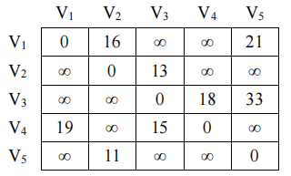

# DS-2020-34

## 1. 原题

一个有向图 $G$ 的带权邻接矩阵如下所示：

请采用单源点最短路径算法 $Dijkstra$ 求解图 $G$ 中 $V_1$ 点到其他各点的最短路径，要求给出计算过程。



表（按图转录，$\infty$ 表示两顶点间无直接弧）：

|  | $V_1$ | $V_2$ | $V_3$ | $V_4$ | $V_5$ |
|---|---|---|---|---|---|
| $V_1$ | 0 | 16 | $\infty$ | $\infty$ | 21 |
| $V_2$ | $\infty$ | 0 | 13 | $\infty$ | $\infty$ |
| $V_3$ | $\infty$ | $\infty$ | 0 | 18 | 33 |
| $V_4$ | 19 | $\infty$ | 15 | 0 | $\infty$ |
| $V_5$ | $\infty$ | 11 | $\infty$ | $\infty$ | 0 |

## 2. 答案

以 $V_1$ 为源点执行 Dijkstra，$5$ 个顶点共 $4$ 次"选点扩展"（源点自身第 $0$ 步入集），各顶点最终最短路径长度与路径为：

| 终点 | 最短路径长度 | 路径 |
|---|---|---|
| $V_2$ | 16 | $V_1\to V_2$ |
| $V_3$ | 29 | $V_1\to V_2\to V_3$ |
| $V_4$ | 47 | $V_1\to V_2\to V_3\to V_4$ |
| $V_5$ | 21 | $V_1\to V_5$ |

顶点的加入顺序（永久标号顺序）为 $V_1,\,V_2,\,V_5,\,V_3,\,V_4$。

## 3. 题目分析

- 已知：$5$ 顶点带权有向图的邻接矩阵，权值均为正（$11\sim 33$），$\infty$ 表示无直接弧；源点 $V_1$；
- 目标：求 $V_1$ 到其余 $4$ 个顶点的最短路径长度与路径本身，并**给出计算过程**（不能只写结果）；
- 关键约束：Dijkstra 的前提是"所有边权非负"，本题满足；每次只能从未入集顶点中挑 $dist$ 最小者加入，且加入后其标号即不再改变；
- 命题意图：考 **DS04.04.02 的机械执行**——"一次一个点、每次松弛其全部出边"，同时考"由邻接矩阵读弧的方向与权"（DS04.02.01，注意矩阵非对称，是有向图）。

## 4. 核心考点

核心考点：
DS04.04.02 最短路径（Dijkstra 的 $S$ 集 + $dist/path$ 双表逐步更新）

辅助考点：
DS04.02.01 邻接矩阵法（第 $i$ 行第 $j$ 列 $=A$ 到 $B$ 的弧权，$\infty$ 为无边；非对称 ⟹ 有向）；DS04.01 图的基本概念（路径长度 = 边上权之和）

解释：本题不需要写代码，考查的是"表格式过程"，即教材上 $dist[]$、$path[]$、$S$ 三列随趟变化的经典呈现方式。

## 5. 解题思路

1. 先由矩阵列出全部弧（第 6 节"弧集"），确认 $V_4\to V_1$、$V_5\to V_2$ 等**反向弧存在与否**，避免把有向图当无向图做；
2. 初始化：$S=\{V_1\}$，$dist[j]=A[V_1][j]$，$path[j]$ 记前驱；
3. 反复执行"选最小 → 入集 → 松弛"：从未入集顶点中取 $dist$ 最小者 $u$ 加入 $S$，然后对 $u$ 的每条出边 $(u,v)$ 检查 $dist[u]+w(u,v)<dist[v]$，成立则改 $dist[v]$ 并记 $path[v]=u$；
4. 每步都记录"本步加入了谁、改了哪几项、没改的原因"，这就是题目要求的"计算过程"；
5. 结束后用"反向顺着 $path$ 走到源点"复查每条路径，并把路径长度与 $dist$ 比对（第 6 节验证）。

## 6. 详细解答

### 弧集（由矩阵逐行读出）

$V_1\to V_2(16)$、$V_1\to V_5(21)$、$V_2\to V_3(13)$、$V_3\to V_4(18)$、$V_3\to V_5(33)$、$V_4\to V_1(19)$、$V_4\to V_3(15)$、$V_5\to V_2(11)$。

（注意：$V_2\to V_1$、$V_5\to V_1$、$V_3\to V_2$ 均无弧，故 $V_4\to V_1(19)$ 这条回边不会给 $V_1$ 带来更短路径，$V_5\to V_2(11)$ 也不能反向用于 $V_2\to V_5$。）

### 逐步过程表

初始化（第 0 步）：$S=\{V_1\}$，$dist=(0,16,\infty,\infty,21)$，$path=(\_,1,\_,\_,1)$。

| 步 | 从未入集顶点中选最小 | 加入 $S$ | 松弛该顶点的出边 | 更新后的 $dist$ $(V_1,V_2,V_3,V_4,V_5)$ | $path$ |
|---|---|---|---|---|---|
| 1 | $\min\{16,\infty,\infty,21\}=16$ | $V_2$ | $V_2\to V_3:16+13=29<\infty$ ✔ | $(0,16,\mathbf{29},\infty,21)$ | $(\_,1,\mathbf{2},\_,1)$ |
| 2 | $\min\{29,\infty,21\}=21$ | $V_5$ | $V_5\to V_2:21+11=32>16$ ✘ | $(0,16,29,\infty,21)$ | 不变 |
| 3 | $\min\{29,\infty\}=29$ | $V_3$ | $V_3\to V_4:29+18=47<\infty$ ✔；$V_3\to V_5:29+33=62>21$ ✘ | $(0,16,29,\mathbf{47},21)$ | $(\_,1,2,\mathbf{3},1)$ |
| 4 | 只剩 $47$ | $V_4$ | $V_4\to V_1:47+19>0$ ✘；$V_4\to V_3:47+15=62>29$ ✘ | $(0,16,29,47,21)$ | 不变 |

$V_1$ 已在初始 $S$ 中，$5$ 个顶点全部入集，算法终止。

### 结果与路径还原

- $V_2$：$dist=16$，$path[2]=1$ ⟹ $V_1\to V_2$，长 $16$；
- $V_5$：$dist=21$，$path[5]=1$ ⟹ $V_1\to V_5$，长 $21$；
- $V_3$：$dist=29$，$path[3]=2\to path[2]=1$ ⟹ $V_1\to V_2\to V_3$，长 $16+13=29$；
- $V_4$：$dist=47$，$path[4]=3\to 2\to 1$ ⟹ $V_1\to V_2\to V_3\to V_4$，长 $16+13+18=47$。

### 自我验证

1. **逐条枚举比对**：$V_1$ 到各点的所有简单路径（图中弧数有限，可穷举）
   - 到 $V_3$：$V_1V_2V_3=29$；$V_1V_5V_2V_3=21+11+13=45$；$V_1V_5V_2V_3$ 之外再无（$V_1$ 只有两条出边）→ 最短 $29$ ✔
   - 到 $V_4$：$V_1V_2V_3V_4=47$；$V_1V_5V_2V_3V_4=21+11+13+18=63$ → 最短 $47$ ✔
   - 到 $V_5$：直接边 $21$；$V_1V_2V_3V_5=16+13+33=62$；$V_1V_2V_3V_4$ 无到 $V_5$ 的弧 → 最短 $21$ ✔
   - 到 $V_2$：直接边 $16$；$V_1V_5V_2=32$ → 最短 $16$ ✔
2. **入集顺序单调性检查**：$0\le16\le21\le29\le47$，永久标号按非降序产生，符合 Dijkstra 的正确性条件（边权非负）✔
3. 程序按同一矩阵执行 Dijkstra，输出的 $dist$、前驱数组与上表完全一致。

## 7. 选项分析

不适用（综合应用题）。

## 8. 考场标准答案

```
初始：S={V1}，dist=(0,16,∞,∞,21)，path=(-,1,-,-,1)
① 取最小 dist 的 V2(16) 入 S：dist[V3]=16+13=29，path[V3]=2
   dist=(0,16,29,∞,21)
② 取 V5(21) 入 S：21+11=32 > 16，dist[V2] 不改
   dist=(0,16,29,∞,21)
③ 取 V3(29) 入 S：29+18=47 < ∞，dist[V4]=47，path[V4]=3；29+33=62 > 21，dist[V5] 不改
   dist=(0,16,29,47,21)
④ 取 V4(47) 入 S：47+19 > 0，47+15=62 > 29，均不修改
   dist=(0,16,29,47,21)
结论：V1→V2 = 16；V1→V5 = 21；V1→V2→V3 = 29；V1→V2→V3→V4 = 47
```

答题时必须写出每一步"加入了哪个顶点、修改了哪些 $dist/path$ 项"，只给最终数值按过程分不全。

## 9. 易错点

1. **把有向图当无向图**：矩阵非对称，$V_5\to V_2(11)$ 存在而 $V_2\to V_5$ 不存在；若误用无向图，会得 $V_1\to V_5\to V_2=32$（仍大于 16 不影响 $V_2$），但 $V_4\to V_1$、$V_4\to V_3$ 会被误当作 $V_1,V_3$ 的出边，导致 $V_3$ 被错误更新；
2. **选点顺序错**：第 2 步必须选 $V_5(21)$ 而不是 $V_3(29)$，因为 $21<29$；顺序错了会先松弛 $V_3$ 的出边，虽最终数值可能相同，但过程分丢失，且在有更复杂图时会算错；
3. 忘记"入集后不再更新"：$V_2$ 已是 $16$，$V_5\to V_2$ 的 $32$ 不能覆盖它（Dijkstra 的贪心正确性）；
4. 松弛时漏掉某条出边（尤其 $V_3\to V_5$、$V_4\to V_1$ 这类"不产生更新"的边，也要在过程中写明"不修改"，否则看不出你检查过）；
5. 把 $\infty$ 参与加法算成具体数值：应写作"$\infty$ 与任何有限数之和仍为 $\infty$"或直接跳过无边。

## 10. 一句话规律

Dijkstra 列表法就一句话：**每轮"未入集者取最小 → 入集 → 用它的出边逐个试松弛"**，并保证被加入顶点的 $dist$ 单调不减——这个单调性是检查自己做没错的免费工具。

## 11. 关联知识

- DS04.02.01：本题输入形态是邻接矩阵，Dijkstra 在邻接矩阵实现下每轮扫描需 $O(n)$ 求最小、$O(n)$ 松弛，总 $O(n^2)$，与顶点数无关而与边数关系弱；若改用邻接表 + 堆可降为 $O((n+e)\log n)$；
- 与 DS04.04.01 的 Prim/Kruskal 对照：Prim 也是"选最小 + 更新"，但 Prim 比较的是"到已选点集的最小边权"，Dijkstra 比较的是"源点出发的路径累加和"，两个过程的表格式写法形似而含义不同，易混；
- 若题目要求"任意两顶点"的最短路径，则用 Floyd（$n^3$ 三重循环、$D^{(k)}$ 矩阵迭代），与本题单源形态互补；
- 2020 年第 23、24、25 题（度数与边数关系、邻接表 DFS 序列、稀疏图选 Kruskal）与本题同属图的章节，可串成"存储 → 遍历 → 应用"的复习链。

## 12. 来源与可信度

- 原题来源：2020 回忆版题面篇，本题无订正说明；$5\times5$ 矩阵由 `真题/2020/imgs/fig7.png` 读图转录（数字 $16,21,13,18,33,19,15,11$ 与 $\infty$ 分布清晰，读图不确定性低）；
- 答案来源：独立推导（逐步 $dist/path$ 表 + 手工穷举全部简单路径比对 + 程序复核三者一致）；
- 教材依据：严蔚敏《数据结构（C 语言版）》7.4.2 最短路径（Dijkstra 算法与 $dist$、$path$、$final$ 三数组）；
- 多来源冲突：无；争议：无；
- 最终可信度：high。
