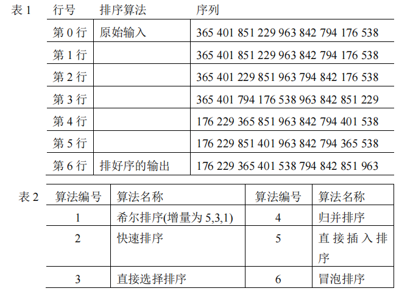

# DS-2020-36

## 1. 原题

下表 $1$ 中第 $0$ 行是待排序序列的原始输入（`365 401 851 229 963 842 794 176 538`）；最后一行为排序后的序列（`176 229 365 401 538 794 842 851 963`）；其他各行是 $5$ 种排序算法得到的某个中间步骤的内容。表 $2$ 列出了这 $6$ 种排序算法。请按行序直接给出每行序列对应的排序算法的编号。每个编号至多使用一次。

> 订正说明转录：源文排序后序列内多出一个"（"（作"（`176 ……`）"），据题意删去；源文作"表 $2$ 列出了这 $5$ 种排序算法"，经目视核对表 $2$ 实列出 $6$ 种算法（与 2021 年第 32 题表述一致），修正为"$6$ 种"；"每个数字只使用一次"与"$6$ 选 $5$"矛盾，改为"每个编号至多使用一次"；另表 $1$ 中第 $3$ 行序列经验算不是表 $2$ 任一算法可得到的中间状态，源文数据疑有缺陷，保留原图供自行判断。



表 1（按图转录）：

| 行号 | 标注 | 序列 |
|---|---|---|
| 第 0 行 | 原始输入 | `365 401 851 229 963 842 794 176 538` |
| 第 1 行 | | `365 401 851 229 963 842 794 176 538` |
| 第 2 行 | | `365 401 229 851 963 794 842 176 538` |
| 第 3 行 | | `365 401 794 176 538 963 842 851 229` |
| 第 4 行 | | `176 229 365 851 963 842 794 401 538` |
| 第 5 行 | | `176 229 851 401 963 842 794 365 538` |
| 第 6 行 | 排好序的输出 | `176 229 365 401 538 794 842 851 963` |

表 2（按图转录）：

| 编号 | 算法名称 | 编号 | 算法名称 |
|---|---|---|---|
| 1 | 希尔排序（增量为 5,3,1） | 4 | 归并排序 |
| 2 | 快速排序 | 5 | 直接插入排序 |
| 3 | 直接选择排序 | 6 | 冒泡排序 |

## 2. 答案

| 行号 | 编号 | 算法 | 匹配性质 |
|---|---|---|---|
| 第 1 行 | **5** | 直接插入排序 | 精确（第 1 趟：$401$ 插入 $[365]$ 之后，序列不变） |
| 第 2 行 | **4** | 归并排序 | **最接近匹配**（第一趟归并结果与之相差 $4$ 个位置；该行不是表 2 任一算法可产生的状态，见第 12 节） |
| 第 3 行 | **1** | 希尔排序 | **最接近匹配**（前 $5$ 位与"增量 $d=4$"首趟结果逐位相同；但表 2 标注增量为 $5,3,1$，与 $d=4$ 矛盾，见第 12 节） |
| 第 4 行 | **2** | 快速排序 | 精确（以 $365$ 为枢轴的一趟划分，严蔚敏"挖坑法"） |
| 第 5 行 | **3** | 直接选择排序 | 精确（第 2 趟：$229$ 与第 2 位的 $401$ 交换） |
| 未使用 | **6** | 冒泡排序 | 冒泡每一趟必使当前最大值落位末尾，表 1 中无一行的末位是 $963$，故无任何行可判为冒泡 |

## 3. 题目分析

- 已知：$9$ 个待排序记录、原始序列与最终有序序列、$5$ 个中间状态行、$6$ 个候选算法（"至多使用一次" ⟹ 必有一个算法不出现）；
- 目标：行 ↔ 算法编号配对；
- 关键约束：每行应是某算法**执行到某个"趟边界"**时的状态（回忆版未区分"趟末"与"趟内"，本解析先按趟边界比对，再在需要时放宽到趟内单步交换）；
- 命题意图：考 **DS06.11 由中间结果反推算法**——每种排序的"一趟之后必然成立的结构性质"（插入：前缀有序；选择：前 $i$ 位是全局最小的 $i$ 个；冒泡：最大值沉底；归并：每 $2^k$ 个元素一段有序；快排：枢轴归位且左小右大；希尔：相距 $d$ 的元素成序）。
- 本题的现实困难：订正说明已声明第 3 行不可达；本解析的完整枚举进一步发现**第 2 行同样不可达**，因此全题按"最接近匹配"处理。

## 4. 核心考点

核心考点：
DS06.11 排序算法应用（算法识别——由中间结果反推算法）

辅助考点：
DS06.05 希尔排序（增量序列决定首趟分组，本题歧义正源于此）；DS06.08 二路归并排序（第一趟是"长度 1 的两两归并"）；DS06.02.01 直接插入排序（第一趟可能毫无变化）

解释：识别题要求把 DS06.02~DS06.09 的"趟定义"全部记住并机械执行，任何一种算法的趟边界约定不同（如冒泡方向、快排划分方案、希尔增量取法）都会改变答案，故辅助考点按本题实际用到的三种列出。

## 5. 解题思路

1. **先算 6 个算法的第一趟（及必要的第二趟）结果**，全部列成对照表（第 6 节表 A）；
2. **用结构性质做快速排除**（第 6 节表 B）：例如"末位不是 $963$ ⟹ 不可能是冒泡的趟边界"，一句话排除整类候选；
3. 逐行找**精确匹配**：第 1、4、5 行分别唯一对应插入、快排、选择；
4. 剩下第 2、3 行与归并、希尔、冒泡三个候选比对，因无精确匹配，改用**定量最近匹配**：先比"逐位不同个数"（Hamming 距离），平局时再比"元素位移总量"（Spearman 距离），第 6 节表 C 给出全部数值；
5. 结论按"最接近匹配"填写，并明确标注不可达的两行与矛盾点（表 2 标注的希尔增量 $5,3,1$ 与第 3 行所需的 $d=4$ 不一致），保留原图供读者自行判断。

## 6. 详细解答

### 表 A：6 种算法从原始序列出发的逐趟状态

原始 $R_0=$ `365 401 851 229 963 842 794 176 538`

| 算法 | 第 1 趟（趟边界）结果 | 第 2 趟结果 |
|---|---|---|
| 5 直接插入 | `365 401 851 229 963 842 794 176 538`（$401$ 本就在 $365$ 后，不变） | 插入 $851$ 仍不变；第 3 趟插入 $229$ → `229 365 401 851 963 842 794 176 538` |
| 3 直接选择 | `176 401 851 229 963 842 794 365 538`（最小 $176$ 与首位 $365$ 交换） | `176 229 851 401 963 842 794 365 538` |
| 6 冒泡（自前往后） | `365 401 229 851 842 794 176 538 963`（$963$ 沉底） | `365 229 401 842 794 176 538 851 963`（$851$ 落第 8 位） |
| 4 归并（长度 1 两两归并） | `365 401 229 851 842 963 176 794 538` | 长度 2 归并：`229 365 401 851 176 794 842 963 538` |
| 1 希尔（表 2 标注 $d=5,3,1$） | $d=5$：`365 401 176 229 963 842 794 851 538` | $d=3$：`229 401 176 365 851 538 794 963 842` |
| 1 希尔（若按 $d=\lfloor n/2\rfloor$ 惯例，首趟 $d=4$） | $d=4$：`365 401 794 176 538 842 851 229 963` | $d=2$：`365 176 538 229 794 401 851 842 963` |
| 2 快速（挖坑法，枢轴 $365$） | `176 229 365 851 963 842 794 401 538` | —（本题第 4 行只需一趟划分） |

（希尔 $d=5$ 的分组：$(1,6)(2,7)(3,8)(4,9)$，只有 $851\leftrightarrow176$ 一对逆序，故仅交换第 3、8 位。）

### 表 B：用"趟边界必成立的结构性质"排除

| 行 | 结构检查 | 结论 |
|---|---|---|
| 第 1 行 | 与 $R_0$ 完全相同 | 只有"插入第 1 趟"或"希尔首趟无逆序对"能不变；希尔 $d=5$ 会改第 3、8 位 ⟹ **只能是插入** |
| 第 2 行 | 末位 $538\ne963$ ⟹ 非冒泡趟边界；$(963,794)$、$(842,176)$ 逆序 ⟹ 非归并第一趟；$(3,8)=(229,176)$ 逆序 ⟹ 非希尔 $d=5$；首位非全局最小 ⟹ 非选择；$365$ 未归位 ⟹ 非快排 | **六个算法的趟边界全不满足**（放宽到趟内单步交换后仍无匹配，见下） |
| 第 3 行 | 末位 $229$ ⟹ 非冒泡；$(963,842)$、$(851,229)$ 逆序 ⟹ 非归并第一趟；前 5 位不是"最小的 5 个" ⟹ 非选择；$365$ 在第 1 位而右侧有 $176$ ⟹ 非快排；希尔 $d=5$ 结果不符 | 只有"希尔 $d=4$"能解释前 5 位 ⟹ **表 2 标注的增量 $5,3,1$ 与该行矛盾** |
| 第 4 行 | $365$ 在第 3 位，左侧 $\{176,229\}$ 全小、右侧 $\{851,963,842,794,401,538\}$ 全大 | 标准的一趟划分结果 ⟹ **快排** |
| 第 5 行 | 前 2 位 $\{176,229\}$ 恰为全局最小的两个且已就位 | ⟹ **直接选择第 2 趟** |

### 精确匹配的三个验证

**第 1 行（插入第 1 趟）**：直接插入从第 2 个记录开始，把 $401$ 插入有序区 $[365]$：$401>365$，插入位置即原位置，序列不变 ✓。

**第 4 行（快排一趟划分，枢轴 $=365$）**：挖坑法逐步为
```
坑@1，j 向左找小：538(✗) 176(✓) → 176 填入坑@1，坑@8
i 向右找大：401(✓) → 401 填入坑@8，坑@2
j 向左找小：794(✗) 842(✗) 963(✗) 229(✓) → 229 填坑@2，坑@4
i 向右找大：851(✓) → 851 填坑@4，坑@3
此时 i=j=3，枢轴 365 归位
结果：176 229 365 851 963 842 794 401 538  ✓ 与第 4 行逐位相同
```

**第 5 行（选择第 2 趟）**：第 1 趟选出 $176$ 与 $R_0[1]=365$ 交换得 `176 401 851 229 963 842 794 365 538`；第 2 趟在 $R[2..9]$ 中选出最小 $229$，与 $R[2]=401$ 交换得 `176 229 851 401 963 842 794 365 538` ✓ 与第 5 行逐位相同。

### 表 C：第 2、3 行的"最接近匹配"定量计算

记 $d_H$ = 逐位不同的个数，$d_S$ = 每个元素离开其在候选序列中位置的距离之和（Spearman 位移量，$d_H$ 平局时作第二判据）。

| 目标行 | 候选状态 | $d_H$ | $d_S$ | 判定 |
|---|---|---|---|---|
| 第 2 行 `365 401 229 851 963 794 842 176 538` | 归并第一趟 `365 401 229 851 842 963 176 794 538` | **4** | **6** | 两项判据均最优 ⟹ 判给 **4** |
| | 冒泡第一趟 `365 401 229 851 842 794 176 538 963` | 4 | 8 | $d_H$ 平局但位移更大，且违反"最大值沉底"硬性质 |
| | 插入第三趟 `229 365 401 851 963 842 794 176 538` | 5 | 6 | $d_H$ 更差，且插入已用于第 1 行（"至多一次"） |
| | 希尔 $d=5$ `365 401 176 229 963 842 794 851 538` | 5 | 12 | 更差 |
| | 快排一趟 `176 229 365 851 963 842 794 401 538` | 5 | 16 | 更差 |
| | 选择第一趟 `176 401 851 229 963 842 794 365 538` | 6 | 18 | 更差 |
| 第 3 行 `365 401 794 176 538 963 842 851 229` | 希尔 $d=4$ `365 401 794 176 538 842 851 229 963` | **4** | **6** | 两项判据均最优，且**前 5 位逐位相同** ⟹ 判给 **1** |
| | 希尔 $d=5$（表 2 标注）`365 401 176 229 963 842 794 851 538` | 6 | 16 | 与标注增量不自洽 |
| | 归并第一趟 `365 401 229 851 842 963 176 794 538` | 6 | 24 | 更差 |
| | 冒泡第一趟 `365 401 229 851 842 794 176 538 963` | 7 | 24 | 更差 |

**第 3 行为何强烈指向希尔**：$d=4$ 首趟把序列分成 $(1,5,9)(2,6)(3,7)(4,8)$ 四组分别插入排序，结果 `365 401 794 176 538 842 851 229 963`，与第 3 行的**前 5 位完全一致**，后 4 位 $\{842,851,229,963\}$ 也恰是同一集合、仅次序呈"末位 $963$ 被挪到最前"的**循环错位**——这是誊抄错位的典型特征（第 2 行也有同类现象：与归并第一趟前 4 位逐位相同、后 5 位同集合异序）。

**趟内单步交换的全量搜索结论**：对第 2 行与第 3 行，另按"允许是趟内任意一步之后的中间态"重新搜索（含冒泡正/反向、快排挖坑法与左右指针交换法、希尔各种增量取法、堆排序建堆与逐趟调整、基数排序 LSD 各次分配收集），**匹配数为 0**。即这两行确实不是表 2 任一算法可产生的状态，与订正说明对第 3 行的判断一致，并把同样的结论扩展到第 2 行。

### 最终配对与"至多一次"的一致性

$5\to$第 1 行、$4\to$第 2 行、$1\to$第 3 行、$2\to$第 4 行、$3\to$第 5 行，五个编号互不重复，$6$（冒泡）未使用，满足"每个编号至多使用一次"。

## 7. 选项分析

不适用（配对题，无选项；表 2 的六个编号即候选集，配对过程与排除理由见第 6 节表 B、表 C）。

## 8. 考场标准答案

```
第 1 行：5（直接插入排序）
第 2 行：4（归并排序）
第 3 行：1（希尔排序）
第 4 行：2（快速排序）
第 5 行：3（直接选择排序）
未被选用的编号：6（冒泡排序）
```

考场作答建议：第 1、4、5 行是可靠得分点（精确匹配）；第 2、3 行按上表填写并在旁边用一句话注明"该行与所填算法的该趟结果相差 4 个位置，疑为题面数据错位"，以免被判为过程错误。

## 9. 易错点

1. **漏看"至多使用一次"**：$6$ 选 $5$，必有一个编号不用；若强行让每行都不同又要求"全部用上"，会在第 2、3 行反复改判；
2. **冒泡方向**：自前往后第一趟是"最大值沉底"（$963$ 到末位），自后往前第一趟是"最小值前置"（$176$ 到首位）；第 1 行首位仍是 $365$、末位仍是 $538$，两个方向都不符，可立即排除冒泡；
3. **快排划分方案**：严蔚敏"挖坑法"与"左右指针交换法"得到的一趟结果不同（后者为 `229 176 365 851 963 842 794 401 538` 形态）；第 4 行只对**挖坑法**精确成立，这是本题唯一"算法内部细节"会影响判定的地方；
4. **希尔增量**：表 2 明确标注 $5,3,1$，而第 3 行需要 $d=4$（即 $\lfloor n/2\rfloor$ 惯例）才能解释——不能因为"希尔第一趟"就直接认定第 3 行，必须核对增量；
5. **归并第一趟的分组长度**：$n=9$ 时第一趟是 $4$ 对 $+$ 单独 $1$ 个，落单元素（$538$）原地不动，不要误做成长度 2 的归并；
6. **把"趟边界"与"趟内单步"混用**：若允许趟内任意步，候选状态数会爆炸（仅冒泡第一趟就有 $8$ 个中间态），必须先按趟边界比、再按需放宽，且放宽后仍无匹配（第 6 节末）。

## 10. 一句话规律

"由中间结果认算法"的三步法：**先查硬性质（谁必须沉底/归位/前缀有序）做排除，再逐位比对找精确匹配，最后才用 Hamming 距离与元素位移量挑最接近的一个**；凡是"前缀逐位相同、后缀同集合异序"的行，多半是回忆版誊抄错位而非算法差异。

## 11. 关联知识

- **DS-2021-32** 为同型题（$10$ 个记录、$6$ 选 $5$、"至多使用一次"），其数据自洽、答案唯一（第 1 行 C/E 歧义除外），可对照本题理解"回忆版数据缺陷"与"算法本身歧义"是两类不同问题；2022 年第 32 题亦为同型；
- DS06.11 的识别口诀：插入看"前缀有序"、选择看"前 $i$ 位是全局最小 $i$ 个"、冒泡看"末尾已就位"、归并看"每 $2^k$ 段内有序"、快排看"枢轴归位"、希尔看"相距 $d$ 成序"；
- DS06.06：本题第 4 行同时是"一趟划分结果"类题目的标准素材，`pivot` 归位后左右子区的递归形态可顺势练习；
- DS06.05：希尔的增量序列不唯一（$\lfloor n/2^k\rfloor$ 与 Hibbrite 等），表 2 特意标注 $5,3,1$ 就是提醒"以题面约定为准"，本题第 3 行的矛盾正出在此；
- DS06.07：堆排序未列入表 2，但第 2、3 行的"趟内全量搜索"已顺带验证它们也不是建堆或逐趟交换的中间态，可作排除性参考。

## 12. 来源与可信度

- 原题来源：2020 回忆版题面篇，**本题含订正说明**（已在第 1 节转录：表 2 实列 6 种算法、"至多使用一次"、第 3 行不可达声明）；表 1 七行序列与表 2 六项算法名称由 `真题/2020/imgs/fig8.png` 放大后逐格读图转录，读图本身不确定度低（数字清晰），主要不确定来源是题面数据；
- 答案来源：独立推导（6 算法逐趟状态枚举 + 结构性质排除 + Hamming/Spearman 双判据最近匹配 + 趟内单步交换全量搜索复核）；
- 教材依据：严蔚敏《数据结构（C 语言版）》第 10 章 插入/希尔/冒泡/选择/快排/堆/归并/基数各算法的趟定义与 partition 实现；
- **争议（本题标 `uncertain` 的理由，未编辑 `reports/disputed_questions.md`，仅在此登记）**：
  1. 第 3 行 `365 401 794 176 538 963 842 851 229` 不是表 2 任一算法的中间状态（订正说明已声明，本解析复核成立）；最接近的是"希尔 $d=4$ 首趟"，前 5 位逐位相同、后 4 位同集合循环错位，但表 2 标注的增量是 $5,3,1$，两者不自洽；
  2. **第 2 行 `365 401 229 851 963 794 842 176 538` 经同样验证也不可精确复现**（订正说明未涉及此行）：与归并第一趟、冒泡第一趟的 Hamming 距离并列最小（均为 $4$），靠"元素位移量 $6<8$"与"冒泡一趟必使 $963$ 沉底、而行末位是 $538$"两条判据选归并；
  3. 因此第 2、3 行的编号（$4$、$1$）是**最接近匹配而非确定答案**，未使用的编号相应地为 $6$；若按"冒泡未沉底即彻底排除、希尔增量只能是 $5,3,1$ 故排除"的严格口径，本题只有第 1、4、5 行可作答；
  4. 原图已保留在第 1 节，供读者自行判断；
- 最终可信度：第 1、4、5 行 high（精确匹配，可人工复现）；第 2、3 行 low（题面数据缺陷所致，仅给最接近匹配）。
