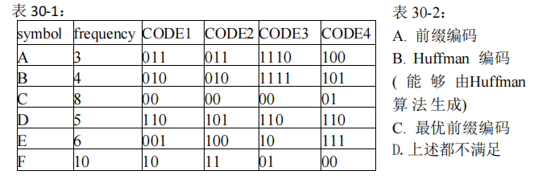

# DS-2021-30

## 1. 原题

考虑下列 $36$ 个字符($symbol$)的序列：`F C F C E C A C B D E D F E A B F B A F F C D C B E D F F F C C D E E F`

下面表 $30-1$ 给出了为上述字符序列编码的四种变长编码方式，即 $CODE1$、$CODE2$、$CODE3$、$CODE4$；表 $30-2$ 给出了编码特点，即 $A$、$B$、$C$、$D$，请给出这 $4$ 种编码方式所具有的编码特点。（填写该编码方式具有的编码特点编号即可，不用给出具体分析过程）。

$CODE1$ ：____________________

$CODE2$ ：____________________

$CODE3$ ：____________________

$CODE4$ ：____________________



（图注：表 $30-1$ 为 `symbol | frequency | CODE1 | CODE2 | CODE3 | CODE4` 六列、$A\sim F$ 六行的编码表；表 $30-2$ 为编码特点清单：$A.$ 前缀编码；$B.$ Huffman 编码（能够由 Huffman 算法生成）；$C.$ 最优前缀编码；$D.$ 上述都不满足。转录内容见第 6 节表 30-1、表 30-2。）

## 2. 答案

| 编码方式 | 具有的特点编号 |
|---|---|
| $CODE1$ | **$D$** |
| $CODE2$ | **$A、B、C$** |
| $CODE3$ | **$A$** |
| $CODE4$ | **$A、C$** |

## 3. 题目分析

- 已知：$36$ 个字符的序列（据此定出各字符频次）；表 $30-1$ 给出的四组码字；表 $30-2$ 给出的四个"特点"标签；
- 目标：为每组编码勾选它**具备**的全部特点（可多选，也可只选一个）；
- 关键约束（四个特点的判定口径，必须互相独立地检验）：
  1. $A$ **前缀编码**：任一码字都不是另一码字的前缀（充要条件，与是否最优无关）；
  2. $B$ **Huffman 编码**：表 $30-2$ 括号里已把它定义得很死——"**能够由 Huffman 算法生成**"，即存在一条自底向上的合并过程，每一步合并的都是当时的两个最小权值结点，且该树的带权路径长度等于给出的码长。**这是"算法可生成"，不是"长度最优"**；
  3. $C$ **最优前缀编码**：首先是前缀编码，其次其 WPL 达到该频次集上的最小值（$=$ Huffman 树的 WPL）。注意"$WPL$ 最小"与"能被 Huffman 生成"是两个不同的条件；
  4. $D$ **上述都不满足**：$A,B,C$ 全不成立时才选（与 $A/B/C$ 互斥）；
- 依赖关系：$B\Rightarrow C\Rightarrow A$（Huffman 生成的编码必是最优前缀编码，最优前缀编码必是前缀编码），逆命题均不成立——本题正是用 $CODE4$（$C$ 真而 $B$ 假）与 $CODE3$（$A$ 真而 $C$ 假）把这两个逆命题打穿；
- 命题意图：检验学生是否把"Huffman 编码"与"最优前缀编码"当成两个不同层次的概念。若二者混同，$CODE4$ 会被误标 $B$、$CODE3$ 会被误标 $C$；若连前缀性都没检查，$CODE1$ 会被误标 $A$；
- 隐藏前置工作：题面只给字符序列，频次需自行统计（表 $30-1$ 的 `frequency` 列可作核对）。

## 4. 核心考点

核心考点：
DS03.04.01 哈夫曼树与哈夫曼编码（由频次构造哈夫曼树、计算 WPL、判定一组码长是否可达最优）

辅助考点：
DS03.04.02 树与二叉树的其他应用（前缀编码的定义、"任何编码方案都对应一棵 $0/1$ 分支二叉树"这一翻译手段，以及前缀性保证唯一译码）

解释：本题不要求构造哈夫曼树并写出编码（那是 DS03.04.01 的常规考法），而是反过来**判定给定编码属于哪一类**，核心工具仍是哈夫曼算法与 WPL，故主标签不变；而"由码字集合反推二叉树""前缀 ⟺ 唯一可译"这些属于编码应用层面的内容，落在 DS03.04.02。

## 5. 解题思路

1. **先统计频次**：逐个数序列中 $A\sim F$ 的出现次数，得 $3,4,8,5,6,10$，合计 $36$ 与题面"36 个字符"吻合（这一核对能防止数错）；
2. **做一遍哈夫曼算法求基准最优值**：$3+4=7$、$5+6=11$、$7+8=15$、$10+11=21$、$15+21=36$，$WPL_{\min}=7+11+15+21+36=90$；同时记下"每一步合并的是谁"，这是判 $B$ 的模板；
3. **对每组编码做三项独立检验**：
   - 判 $A$：把码字按长度升序排，逐个检查是否为更长码字的前缀；
   - 判 $C$：算 $WPL=\sum f_i l_i$，与 $90$ 比较（相等且满足 $A$ 才是 $C$）；
   - 判 $B$：由码字**反画出 $0/1$ 分支树**（码长决定叶的层数，公共前缀决定同支），检查该树自底向上的合并次序是否每步都取当时最小两权；
4. **用 Kraft 和作旁证**：$\sum 2^{-l_i}=1$ 说明码长可构成一棵满分支树（互不为前缀且无浪费），$<1$ 说明还有压缩余地；四组码长都恰为 $1$，所以"是否最优"只能靠 WPL 与合并次序区分，不能靠 Kraft；
5. **最后按 $B\Rightarrow C\Rightarrow A$ 检查自洽**：若某组勾了 $B$ 却没勾 $C$ 或 $A$，必是出错。

## 6. 详细解答

### 第一步：统计频次（表 30-1 转录）

| $symbol$ | $frequency$ | $CODE1$ | $CODE2$ | $CODE3$ | $CODE4$ |
|---|---|---|---|---|---|
| $A$ | $3$ | $011$ | $011$ | $1110$ | $100$ |
| $B$ | $4$ | $010$ | $010$ | $1111$ | $101$ |
| $C$ | $8$ | $00$ | $00$ | $00$ | $01$ |
| $D$ | $5$ | $110$ | $101$ | $110$ | $110$ |
| $E$ | $6$ | $001$ | $100$ | $10$ | $111$ |
| $F$ | $10$ | $10$ | $11$ | $01$ | $00$ |

频次核对：$A:3$、$B:4$、$C:8$、$D:5$、$E:6$、$F:10$，合计 $36$ ✓（与题面"$36$ 个字符"一致）。

### 第二步：哈夫曼算法求最优基准

权值集合 $\{3,4,5,6,8,10\}$，每次取最小两个：

| 步 | 取出的两个最小 | 合并 | 剩余集合 |
|---|---|---|---|
| 1 | $3(A),\,4(B)$ | $7$ | $\{5,6,7,8,10\}$ |
| 2 | $5(D),\,6(E)$ | $11$ | $\{7,8,10,11\}$ |
| 3 | $7,\,8(C)$ | $15$ | $\{10,11,15\}$ |
| 4 | $10(F),\,11$ | $21$ | $\{15,21\}$ |
| 5 | $15,\,21$ | $36$ | $\{36\}$ |

$$WPL_{\min}=7+11+15+21+36=90$$

（等价算法：$WPL=\sum f_i l_i$，由该树得码长 $A\!:\!3,B\!:\!3,C\!:\!2,D\!:\!3,E\!:\!3,F\!:\!2$，$\sum=9+12+16+15+18+20=90$ ✓。）

**关键结构特征**：哈夫曼树中 $A,B$ 必为兄弟（第 1 步合并）、$D,E$ 必为兄弟（第 2 步合并）、$C$ 与"$AB$ 子树"为兄弟（第 3 步合并）、$F$ 与"$DE$ 子树"为兄弟（第 4 步合并）。**判 $B$ 时就查这四点。**

### 第三步：逐项判定

表 30-2（编码特点，转录）

| 编号 | 含义 |
|---|---|
| $A$ | 前缀编码 |
| $B$ | Huffman 编码（能够由 Huffman 算法生成） |
| $C$ | 最优前缀编码 |
| $D$ | 上述都不满足 |

#### $CODE1$：$\{A\!:\!011,\,B\!:\!010,\,C\!:\!00,\,D\!:\!110,\,E\!:\!001,\,F\!:\!10\}$

- **判 $A$**：$C=00$ 是 $E=001$ 的前缀 ⟹ **不满足** ✗；
- 进一步说明其危害：码串 `00110` 既可译作 $C,D$（$00\,|\,110$），也可译作 $E,F$（$001\,|\,10$），**存在二义，连唯一译码都做不到**；
- **判 $C$**：$C$ 的前提是"前缀编码"，$A$ 已不成立 ⟹ ✗（虽然它的码长 $3,3,2,3,3,2$ 与哈夫曼码完全相同、$WPL=90$，但码字分配错了，树形根本不存在）；
- **判 $B$**：哈夫曼编码必为前缀编码 ⟹ ✗；
- ⟹ 选 **$D$**。

（本项是本题的"陷阱反转"：**码长最优但码字冲突**——提醒"$WPL=90$"只是必要条件，不是充分条件。）

#### $CODE2$：$\{A\!:\!011,\,B\!:\!010,\,C\!:\!00,\,D\!:\!101,\,E\!:\!100,\,F\!:\!11\}$

- **判 $A$**：按长度分组，$2$ 位码为 $C\!=\!00,\,F\!=\!11$；$3$ 位码为 $A\!=\!011,\,B\!=\!010,\,D\!=\!101,\,E\!=\!100$。以 $00$ 开头的 $3$ 位码不存在（$3$ 位码中以 $0$ 开头者第二位均为 $1$）、以 $11$ 开头的 $3$ 位码也不存在（以 $1$ 开头者第二位均为 $0$）；$3$ 位码等长互不为前缀 ⟹ **满足** ✓；
- **判 $C$**：码长 $3,3,2,3,3,2$，$WPL=9+12+16+15+18+20=90=WPL_{\min}$，且已是前缀码 ⟹ **满足** ✓；
- **判 $B$**：由码字反画树——

```
             36
          /      \
       15         21
      /  \       /   \
  C:8   7      10   11
             (A,B) (D,E)
            /   \  /   \
          A:3  B:4 D:5 E:6
        （左支取 0、右支取 1：0→{00=C, 01→{011=A,010=B}}, 1→{11=F, 10→{101=D,100=E}}）
```

自底向上合并次序：$A{+}B=7$（第 1 步 ✓）、$D{+}E=11$（第 2 步 ✓）、$7{+}C=15$（第 3 步：当时 $\{7,8,10,11\}$ 中最小两个正是 $7,8$ ✓）、$F{+}11=21$（第 4 步：当时 $\{10,11,15\}$ 中最小两个正是 $10,11$ ✓）、$15{+}21=36$ ✓。**每一步都符合哈夫曼贪心** ⟹ **满足** ✓；
- ⟹ 选 **$A、B、C$**。

#### $CODE3$：$\{A\!:\!1110,\,B\!:\!1111,\,C\!:\!00,\,D\!:\!110,\,E\!:\!10,\,F\!:\!01\}$

- **判 $A$**：$2$ 位码 $00,10,01$；$3$ 位码 $110$（前两位 $11$，与 $00,10,01$ 均不同）；$4$ 位码 $1110,1111$（前三位 $111$，而唯一的 $3$ 位码 $110$ 前三位是 $110\neq111$）⟹ 无包含关系，**满足** ✓；
- **判 $C$**：码长 $4,4,2,3,2,2$，

$$WPL=3\!\times\!4+4\!\times\!4+8\!\times\!2+5\!\times\!3+6\!\times\!2+10\!\times\!2=12+16+16+15+12+20=91>90$$

$WPL=91$ 未达最优 ⟹ **不满足** ✗。（可指出成因：最优码长为 $A\!:\!3,B\!:\!3,C\!:\!2,D\!:\!3,E\!:\!3,F\!:\!2$，而本方案给最轻的 $A(3),B(4)$ 配了 $4$ 位码、给较重的 $E(6)$ 只配 $2$ 位码，权与长不再单调匹配，$+3+4-6=+1$ 恰为多出的那 $1$）。

- **判 $B$**：哈夫曼算法产生的树必为最优 ⟹ ✗；
- ⟹ 只选 **$A$**。

#### $CODE4$：$\{A\!:\!100,\,B\!:\!101,\,C\!:\!01,\,D\!:\!110,\,E\!:\!111,\,F\!:\!00\}$

- **判 $A$**：$2$ 位码 $01,00$；$3$ 位码 $100,101,110,111$ 全部以 $1$ 开头，与 $2$ 位码首字符即不同；$3$ 位码等长互不为前缀 ⟹ **满足** ✓；
- **判 $C$**：码长 $3,3,2,3,3,2$，$WPL=9+12+16+15+18+20=90=WPL_{\min}$，且为前缀码 ⟹ **是最优前缀编码** ✓；
- **判 $B$**：反画树——

```
             36
          /      \
       18         18
      /  \       /   \
  C:8   F:10   7      11
             (A,B)  (D,E)
             /  \   /   \
           A:3 B:4 D:5  E:6
   （0→{01=C, 00=F}, 1→{10→{100=A,101=B}, 11→{110=D,111=E}}）
```

自底向上看合并次序：$A{+}B=7$ ✓、$D{+}E=11$ ✓，但接下来该树把 $C(8)$ 与 $F(10)$ 合并成 $18$。而此刻森林是 $\{7,8,10,11\}$，哈夫曼贪心要求取**最小的两个** $7$ 与 $8$，此树却取了 $8$ 与 $10$，把权 $7$（$A,B$ 子树）留到了后面与 $11$ 合并 ⟹ **违反哈夫曼算法的贪心选择，该树不可能由 Huffman 算法生成** ⟹ ✗；
- ⟹ 选 **$A、C$**。

（这正是本题最有价值的一组：**$C$ 成立而 $B$ 不成立**，说明"最优前缀编码"严格大于"Huffman 可生成的编码"这个集合。原因是权值 $7,8,10,11$ 中存在并列可交换的结构，$18+18=36$ 的顶层合并同样给出 $WPL=90$，但它不是贪心序列。）

### 第四步：汇总与自洽检查

| 编码 | 码长 $A,B,C,D,E,F$ | 前缀？ | $WPL$ | 最优($90$)？ | Huffman 可生成？ | 特点 |
|---|---|---|---|---|---|---|
| $CODE1$ | $3,3,2,3,3,2$ | ✗（$00\prec001$） | $90$ | 前提不成立 | ✗ | $D$ |
| $CODE2$ | $3,3,2,3,3,2$ | ✓ | $90$ | ✓ | ✓ | $A,B,C$ |
| $CODE3$ | $4,4,2,3,2,2$ | ✓ | $91$ | ✗ |  | $A$ |
| $CODE4$ | $3,3,2,3,3,2$ | ✓ | $90$ | ✓ | ✗（贪心次序不合） | $A,C$ |

自洽检查：$B\Rightarrow C\Rightarrow A$ 在四行中均未被违反（没有"勾 $B$ 不勾 $C$"或"勾 $C$ 不勾 $A$"的行）✓；Kraft 和 $\sum 2^{-l_i}$ 四组均为 $1$（$CODE1,2,4$：$4\!\times\!\tfrac18+2\!\times\!\tfrac14=1$；$CODE3$：$2\!\times\!\tfrac1{16}+\tfrac18+3\!\times\!\tfrac14=1$），说明四组码长本身都"够格"构成一棵满分支树，差别全在**码字分配**与**权—长匹配**上。

## 7. 选项分析

本题为"配对/多选式填空"，对表 $30-2$ 的四个标签逐一说明其适用性：

- $A$（前缀编码）：$CODE2,CODE3,CODE4$ 满足，$CODE1$ 因 $C=00$ 是 $E=001$ 的前缀而不满足。这是唯一"纯语法"的判据，只需比较码字之间的前缀关系，与频次无关；
- $B$（Huffman 编码——能够由 Huffman 算法生成）：只有 $CODE2$ 满足。$CODE1$ 根本不成树；$CODE3$ 的树权—长不匹配（非最优）；$CODE4$ 的树虽最优但顶层合并违反"每次取最小两个"的贪心规则；
- $C$（最优前缀编码）：$CODE2$ 与 $CODE4$ 满足（二者 $WPL$ 均 $=90$）。$CODE3$ 的 $WPL=91$ 未达最优；$CODE1$ 不是前缀编码，谈不上"最优前缀"；
- $D$（上述都不满足）：只有 $CODE1$ 落入此项。$CODE1$ 的码长分布与哈夫曼码一模一样、$WPL$ 也等于 $90$，是本题最强的干扰——但只要动手做前缀检查就会发现 `00110` 有二义，说明"码长对、码字错"同样全盘皆输。

## 8. 考场标准答案

$CODE1$ ：$D$

$CODE2$ ：$A、B、C$

$CODE3$ ：$A$

$CODE4$ ：$A、C$

（若需附极简理由：频次 $3,4,8,5,6,10$，哈夫曼合并 $3{+}4{=}7,\,5{+}6{=}11,\,7{+}8{=}15,\,10{+}11{=}21,\,15{+}21{=}36$，$WPL_{\min}=90$。$CODE1$ 中 $00$ 是 $001$ 的前缀，非前缀码；$CODE2$ 前缀、$WPL=90$ 且合并次序与哈夫曼一致；$CODE3$ 前缀但 $WPL=91$；$CODE4$ 前缀、$WPL=90$ 最优，但其在 $\{7,8,10,11\}$ 上先并 $8{+}10$ 而非 $7{+}8$，不能由哈夫曼算法生成。）

## 9. 易错点

1. **把 $C$（最优前缀编码）与 $B$（Huffman 编码）混为一谈**：本题的核心陷阱。二者关系是 $B\Rightarrow C$ 而 $C\!\not\Rightarrow\!B$；$CODE4$ 就是"$C$ 真 $B$ 假"的反例。判 $B$ 必须回到"每一步是否合并当时最小的两个权"，而不是只看 $WPL$；
2. **只看码长不看码字**：$CODE1$ 的码长与哈夫曼码完全相同，若只按 $\sum f_i l_i=90$ 就勾 $B,C$ 会全错；前缀性必须由码字逐对检查；
3. **$CODE3$ 的 $WPL$ 算错**：$A,B$ 的码长是 $4$（不是 $3$），漏一位会得 $85$，误判为"比 $90$ 更优"（这显然不可能，因为 $90$ 已是理论下界——遇到"算出比哈夫曼更优"的结果时应立刻怀疑自己数错码长）；
4. **前缀检查只做单向**：只拿短码去比长码、忘了同长度码之间不可能互为前缀（可省时间，但要确认自己知道这一点）；$CODE1$ 的冲突恰好发生在 $2$ 位码 $00$ 与 $3$ 位码 $001$ 之间，说明**必须跨长度比较**；
5. **频次统计漏数**：$36$ 是题面给的校验值，统计完先加起来对一遍；
6. **忘了 $D$ 与 $A/B/C$ 互斥**：给 $CODE1$ 同时勾 $C,D$ 是逻辑错误——$D$ 的含义是"上述都不满足"。

## 10. 一句话规律

判编码"够不够格"要分三层、层层加严：**前缀性看码字之间有没有包含关系（与频次无关）→ 最优性看 $\sum f_i l_i$ 是否等于哈夫曼树的 WPL → 可生成性看反推出的树是否每一步都在合并当时最小的两个权**；三层各自独立，$WPL$ 相同的最优前缀码未必出自 Huffman 算法。

## 11. 关联知识

- DS03.04.01：$WPL=\sum_{i} f_i l_i$ 亦等于哈夫曼算法中**所有新生成结点权值之和**（本例 $7{+}11{+}15{+}21{+}36=90$），两种算法互为验算；
- DS03.04.01：哈夫曼树中权值相同的合并顺序可交换，故"Huffman 编码"本身不唯一（本例含分支 $0/1$ 交换共有 $32$ 种不同码表），但 $WPL$ 唯一——这说明 $B$ 判的是"某一条合法贪心路径"，而不是"某个码表长相"；
- DS03.04.02：前缀编码与二叉树一一对应（左支 $0$/右支 $1$，字符放叶结点），因此"判 $B$"本质是"判这棵树是不是哈夫曼树"；非前缀码可能连唯一译码都不成立（$CODE1$ 的 `00110`）；
- Kraft 不等式：一组码长能构成前缀码的充分条件是 $\sum 2^{-l_i}\le 1$，取等时树是"满"的（每个内部结点都有两个孩子），此时才谈得上最优；本题四组均取等，故区分度全部落在"权—长匹配"上——频次大的必须码长短（$CODE3$ 把最长的码给了最轻的 $A,B$、却把 $2$ 位短码给了中等权值的 $E$，权—长失配，故 $WPL$ 比最优多 $1$）；
- 本库同型题：DS-2021-32（同卷"表格式多方案配对"题，同样要求逐行按定义核对而非凭印象）、DS-2020-36（按中间状态反推算法，与本题"由结果反推构造过程是否合法"的解题方向一致）。

## 12. 来源与可信度

- 原题来源：2021 回忆版题面篇 `真题/2021/2021重庆邮电大学802数据结构真题.md` 三、综合应用题第 30 题；字符序列为纯文本，表 $30-1$ 与表 $30-2$ 以图像 `真题/2021/imgs/fig2.png` 给出，题面不含订正说明；
- 读图说明：`fig2.png` 已放大逐格读取，转录内容见第 6 节表 30-1、表 30-2。三处自洽证据支持读图无误——① 六行频次之和 $=36$，与题面"36 个字符"一致；② 四组码长均满足 Kraft 和 $=1$，说明每组的码长分配都是"完整树"的码长，不像残缺读数；③ 表 $30-2$ 的 $B$ 项括号注"能够由 Huffman 算法生成"、$C$ 项为"最优前缀编码"，二者语义可区分，与本题四个填空均有解的结果吻合。故 `ocr_confidence` 取 medium（图像来源一律不给 high）；
- 答案来源：独立推导——① 逐字符统计频次并与 $36$ 核对；② 执行哈夫曼算法得 $WPL_{\min}=90$ 及其合并序列；③ 对每组编码作前缀性逐对检查、计算 $\sum f_i l_i$、由码字反画 $0/1$ 分支树并核对合并次序是否满足贪心。后台另以程序穷举"哈夫曼树在该频次集合上可生成的全部 $32$ 种编码表"，结果为 $CODE2$ 在集合内、$CODE3,CODE4$ 不在集合内，与手工判定一致；又用穷举短码串验证 $CODE1$ 存在 `00110` 的二义译码（正文全部步骤均可人工复现，程序只作后台核对）；未抓取解析篇网页，仅按要求登记其地址备查；
- 教材依据：严蔚敏、吴伟民《数据结构（C 语言版）》第 6 章 树和二叉树——哈夫曼树与哈夫曼编码（WPL 定义、构造算法、前缀编码与唯一译码）；
- 多来源冲突：无。**一处需说明的口径**：$B$ 项的判定完全依赖表 $30-2$ 括号中的定义"能够由 Huffman 算法生成"——按此严格口径 $CODE4$ 不含 $B$（其树违反贪心次序）。若把"Huffman 编码"宽泛地理解为"任何最优前缀编码"，则 $CODE4$ 会同时含 $B,C$，与 $CODE2$ 无法区分，题目即失去区分度；本解析采用严格口径，且该口径由表 $30-2$ 的括注直接支持，故不判为争议；
- 最终可信度：high。
