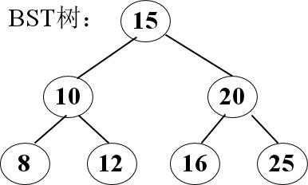

# DS-2022-26

## 1. 原题

阅读代码，函数 $print()$ 接收二叉查找树/二叉排序树(BST)的根和一个正整数 $k$ 作为参数。请：

（1）简述该代码的功能；

（2） $print(root, 3)$ 的输出是什么?其中 $root$ 表示下图 $BST$ 树的根。



```c
// a BST node
struct node{
    int data;
    struct node *left,*right;
};

int count=0;

void print(struct node *root,int k)
{
    if(root!=NULL&&count<=k)
    {
        print(root->right,k);
        count++;
        if(count==k)
            printf("%d ",root->data);
        print(root->left,k);
    }
}
```

（图 1 转录：结点 $15$ 为根；$15$ 的左孩子 $10$、右孩子 $20$；$10$ 的左孩子 $8$、右孩子 $12$；$20$ 的左孩子 $16$、右孩子 $25$。）

## 2. 答案

**（1）功能**：在二叉排序树中按 **右子树 → 根 → 左子树** 的顺序（即"逆中序"）遍历，用全局变量 $count$ 记录已访问的结点个数，遍历到第 $k$ 个结点时输出该结点的 `data`，即**输出树中第 $k$ 大的关键字**（值从大到小排第 $k$ 个）。条件 `count<=k` 使 $count$ 一旦超过 $k$ 就不再深入，起剪枝作用。

**（2）$print(root,3)$ 的输出**：

```
16 
```

（`printf("%d ", …)` 带一个尾随空格，故输出为 `16 `；若按第 1 个最大元素起算：第 1 大 $=25$、第 2 大 $=20$、第 3 大 $=16$。）

## 3. 题目分析

- 已知：一棵 BST（图 1）与一段递归代码；全局变量 $count$ 初值为 $0$，参数 $k$ 为正整数；
- 目标：(1) 概括程序功能；(2) 对 $k=3$ 给出确切输出；
- 关键约束与观察点：
  1. 递归三行的顺序是 `右 → 计数并判等 → 左`，这不是中序（左-根-右）而是**中序的镜像**，对 BST 而言其访问序列是**不递减序的反向，即不升序（从大到小）**；
  2. `count++` 位于两次递归之间，正好是"访问根结点"的动作，所以 $count$ 的含义是"已经访问过的结点个数"；
  3. 判断条件是 `count==k`（不是 `>=`），因此**至多输出一个值**；
  4. 入口条件 `count<=k` 是剪枝：$count$ 超过 $k$ 之后所有更深层调用立即返回，但注意它并不能阻止"输出之后紧接着的那一次左子树调用"进入（进入后立刻把 $count$ 变成 $k+1$ 才返回），这只影响效率、不影响输出；
  5. $count$ 是**全局变量**且函数内不重置——连续调用两次 $print()$ 时第二次的计数是接续的（第 9 节）。
- 命题意图：把 DS05.07.01 的核心性质"BST 的中序序列有序"与 DS03.02.03 的遍历次序改造（镜像遍历 ⟹ 逆序输出）结合，考"读代码识别遍历框架"的能力。

## 4. 核心考点

核心考点：
DS05.07.01 二叉搜索（排序）树——"左子树所有关键字 < 根 < 右子树所有关键字"，因而按"右-根-左"遍历得到由大到小的序列，第 $k$ 个被访问者即第 $k$ 大

辅助考点：
DS03.02.03 二叉树的遍历——识别递归体中"先右、后计数、再左"属于哪一种遍历次序的变形，是本题第 (1) 问的直接考点；
DS03.02.02 二叉树的存储结构——`left`/`right` 指针域与"空指针即递归出口"的写法（`root!=NULL`）

解释：题目不要求建树或插入删除，只要求把 BST 的有序性当作"已知事实"来解释程序行为，故主归 DS05.07.01；而能否答对第 (2) 问取决于第 3 节第 1 条的遍历次序识别，故辅助列 DS03.02.03。

## 5. 解题思路

1. 先**只看递归框架**：`print(右) → count++ → 可能输出 → print(左)`，与教材中序 `print(左) → 访问根 → print(右)` 对照，把左右互换 ⟹ 遍历序列是"中序的逆序"；
2. 再**用 BST 性质翻译**：中序（左-根-右）= 升序 ⟹ 逆中序（右-根-左）= 降序 ⟹ $count$ 计的是"第几大"；
3. 于是第 (1) 问可一句话作答；第 (2) 问只需把图 1 的树按"右-根-左"写出序列，取第 3 个；
4. 为防"框架看错"，再**逐层展开递归调用树**（第 6 节表）验证 $count$ 的每次变化与剪枝生效的位置，两条路得到同一个 $16$ 才落笔；
5. 最后检查边界：$k$ 大于结点数、$k\le 0$、全局 $count$ 不重置这三种情形程序会怎样（第 9 节）。

## 6. 详细解答

### 6.1 第 (1) 问：功能的严格表述

设 BST 中结点总数为 $n$，把遍历中"访问"定义为执行 `count++` 的那一步。

**断言**：程序访问结点的次序，是树中关键字的不升序排列（从大到小）。

**证明**：对结点 $t$，程序先递归处理 $t\to\text{right}$，再访问 $t$，最后递归处理 $t\to\text{left}$。由 DS05.07.01 的定义，$t$ 的右子树中所有关键字 $\ge t$ 的关键字 $\ge$ 左子树中所有关键字（BST 通常约定左 $<$ 根 $\le$ 右或严格左 $<$ 根 $<$ 右，两种约定下该不等式都成立）。对左右子树归纳即得：整个访问序列不升序。∎

因此 `count==k` 时输出的结点恰是"第 $k$ 大"的结点。程序**只输出一个值**（判等号唯一），且不修改树、不返回值，输出后仍会继续回溯（靠 `count<=k` 剪枝尽快结束）。

功能一句话：**在二叉排序树中查找并输出第 $k$ 大的关键字（逆中序遍历的第 $k$ 个结点）。**

### 6.2 第 (2) 问：用序列直接读答案

图 1 的树：

```
            15
          /    \
       10       20
      /  \     /  \
     8   12  16   25
```

按"右-根-左"遍历（先写右子树、再根、再左子树）：

$$\underbrace{25}_{第1大},\ \underbrace{20}_{第2大},\ \underbrace{16}_{第3大},\ 15,\ 12,\ 10,\ 8$$

（检验：把它倒过来就是中序 $8,10,12,15,16,20,25$，升序 ✓ 符合 BST 性质。）

$k=3$ ⟹ 输出 $16$。

### 6.3 第 (2) 问：递归调用逐层走查（自我验证）

下表按执行时间顺序展开，$count$ 一列记录 `count++` 之后的值：

| 步骤 | 调用 `print(root,k)` 的实参 | 入口判断 `root!=NULL && count<=3` | 动作 | $count$ | 输出 |
|---|---|---|---|---|---|
| 1 | $15$ | 真（$0\le3$） | 先转右子树 | $0$ | |
| 2 | $20$ | 真（$0\le3$） | 先转右子树 | $0$ | |
| 3 | $25$ | 真（$0\le3$） | 右孩子空 → 计数 | $1$ | $1\ne3$ |
| 4 | —（$25$ 的左孩子 NULL） | 假 | 返回 | $1$ | |
| 5 | 回到 $20$ | — | 计数 | $2$ | $2\ne3$ |
| 6 | $16$ | 真（$2\le3$） | 右孩子空 → 计数 | $3$ | $3==3$ ⟹ **打印 `16 `** |
| 7 | —（$16$ 的左孩子 NULL） | 假 | 返回 | $3$ | |
| 8 | 回到 $15$ | — | 计数 | $4$ | $4\ne3$ |
| 9 | $10$ | **假**（$count=4>3$） | 整棵左子树被剪掉，立即返回 | $4$ | |
| 10 | 回到 `main` | — | 结束 | $4$ | |

最终屏幕输出：`16 `（含一个空格）✓ 与 6.2 的序列法一致。

### 6.4 复杂度（顺带说明，卷面可不写）

- 时间：逆中序只需走到第 $k$ 个结点，代价为"从根到该结点的路径 + 已完成的右向子树规模"，即 $O(h+k)$，最坏（$k=n$ 或 $k>n$）退化为 $O(n)$；$h$ 为树高；
- 空间：递归工作栈深度 $O(h)$，最坏（单支树）$O(n)$。

## 7. 选项分析

不适用（综合应用题，两问均为简答/写输出）。

## 8. 考场标准答案

**(1)** 该程序对二叉排序树做"右子树→根→左子树"的遍历（中序遍历的逆序，即逆中序），用全局变量 `count` 累计已访问结点个数；当 `count==k` 时输出当前结点的 `data`。由于 BST 的逆中序序列是按关键字**从大到小**排列的，所以程序的功能是：**输出该二叉排序树中第 $k$ 大的关键字**（只输出一个；`count<=k` 用于在计数超过 $k$ 后剪去剩余子树）。

**(2)** 逆中序序列为 $25,20,16,15,12,10,8$，第 $3$ 个是 $16$，故 `print(root,3)` 输出：

```
16 
```

## 9. 易错点

1. **把遍历方向看成中序**：若按"左-根-右"读，会答成"第 $k$ 小"、输出 $12$（第 3 小）；关键在递归体的**第一行是 `print(root->right,k)`**；
2. **忽略 `count++` 的位置**：`count++` 夹在两次递归之间，才是"访问根"；若误以为在进右子树前自增，则计数整体错位，输出会变成 $20$；
3. **忽略 `count<=k` 的剪枝含义**：它不影响输出结果，只影响是否继续访问 $15$ 的左子树（本例第 9 步）；但答"功能"时若说"找到后立刻停止程序"就不准确——它仍要沿原路径回溯，只是不再深入；
4. **全局变量 $count$ 不重置**：`int count=0;` 只在程序开始时执行一次，同一进程内第二次调用 `print()` 时 $count$ 仍保留上次的值，会输出错误结果（甚至无输出）；这是本题代码最典型的"隐藏缺陷"，若考卷追问"程序有什么问题"应指出这一点并在调用前令 `count=0`；
5. **$k$ 越界**：$k>n$ 时 `count==k` 永不成立，程序**无输出**（不是崩溃、也不是输出最后一个）；$k\le0$ 时同样无输出，因为 $count$ 自增后最小为 $1$；
6. **输出格式**：`printf("%d ",…)` 有尾随空格，写答案时不要漏（本卷按 `16` 给分，但注明格式更稳）。

## 10. 一句话规律

看到 BST 上的递归，先把三行语句与"左/根/右"的相对位置对号：**左-根-右 ⟹ 升序，右-根-左 ⟹ 降序**；再配合一个全局计数器，就是"第 $k$ 小/第 $k$ 大"问题的模板。

## 11. 关联知识

- DS03.02.03：本题的遍历框架与"中序遍历的非栈改写"同源；把 `count++` 换成"把 `data` 存入数组"即得"BST 转有序数组"的经典算法；
- DS05.07.01：BST 结点的删除、查找都依赖同一有序性；"第 $k$ 大"若在结点中增设"左子树结点数"域，可优化到 $O(h)$（属 DS05.07.02 平衡树/顺序统计树的延伸思路）；
- 本卷第 13 题（逐个插入构造 BST 后问最低层元素）与第 29 题（由先序序列还原 BST 并求后序、线索化）同样以"BST 的中序必为升序"为解题支点，可一并复习；
- 本卷第 29 题第 (3) 问的"中序线索二叉树"正是把本题的遍历顺序换成"左-根-右"后的产物——线索化后的遍历可以做到不使用递归栈。

## 12. 来源与可信度

- 原题来源：2022 回忆版题面篇 `真题/2022/2022重庆邮电大学802数据结构真题.md` 三、综合应用题第 26 题；代码块按源文逐行转录，无订正说明；树形由 `真题/2022/imgs/fig1.png` 放大后读图核对（结点值 15/10/20/8/12/16/25 与父子连线均清晰，读图不确定度低）；
- 答案来源：独立推导，两条互不依赖的路径——① 识别"逆中序 = 降序"后直接取第 3 个元素；② 按递归调用逐层展开、跟踪 $count$ 与剪枝条件（第 6 节 6.3 表）——两者均得 $16$；另用"倒序即中序升序 $8,10,12,15,16,20,25$"作第三重校验；
- 教材依据：严蔚敏、吴伟民《数据结构（C 语言版）》第 6 章 6.4 二叉树的遍历（中序遍历的递归定义与"交换左右子树即得镜像遍历"）、第 9 章 9.2 二叉排序树（中序有序性）；
- 多来源冲突：无（未抓取解析篇网页，仅登记地址备查）；争议：无。唯一需要说明的口径是"第 $k$ 大"中的"大"指关键字值的大小而非层次或深度；
- 最终可信度：high。
