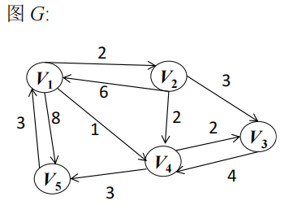

# DS-2022-30

## 1. 原题

已知图 $G$ 如下面所示：

（1）画出 $G$ 的邻接表表示图；

（2）根据你画的邻接表，以顶点 $V_1$ 为根，画出 $G$ 的深度优先生成树；

（3）利用弗洛伊德算法（ $Floyd$ ）求每一对顶点之间的最短路径，请给出带权长度矩阵 $D^{(0)},D^{(1)}$ 和 $D^{(2)}$ 。



（图 2 按读图转录：有向带权图，顶点 $V_1,V_2,V_3,V_4,V_5$；弧与权值为 $\langle V_1,V_2\rangle=2$、$\langle V_2,V_1\rangle=6$、$\langle V_2,V_3\rangle=3$、$\langle V_2,V_4\rangle=2$、$\langle V_1,V_4\rangle=1$、$\langle V_1,V_5\rangle=8$、$\langle V_5,V_1\rangle=3$、$\langle V_4,V_3\rangle=2$、$\langle V_4,V_5\rangle=3$、$\langle V_3,V_4\rangle=4$，共 $10$ 条弧。）

## 2. 答案

### （1）邻接表（同一顶点的边链按邻接点编号升序链接）

```
V1 → [2|2] → [4|1] → [5|8] → ^
V2 → [1|6] → [3|3] → [4|2] → ^
V3 → [4|4] → ^
V4 → [3|2] → [5|3] → ^
V5 → [1|3] → ^
```

（方括号内为 `邻接点序号|弧的权值`。）

### （2）以 $V_1$ 为根的深度优先生成树

$$V_1\to V_2\to V_3\to V_4\to V_5$$

树边集合 $\{\langle V_1,V_2\rangle,\langle V_2,V_3\rangle,\langle V_3,V_4\rangle,\langle V_4,V_5\rangle\}$，DFS 访问序列 $V_1,V_2,V_3,V_4,V_5$。

### （3）Floyd 的三个矩阵

$$D^{(0)}=\begin{pmatrix}0&2&\infty&1&8\\ 6&0&3&2&\infty\\ \infty&\infty&0&4&\infty\\ \infty&\infty&2&0&3\\ 3&\infty&\infty&\infty&0\end{pmatrix}\quad D^{(1)}=\begin{pmatrix}0&2&\infty&1&8\\ 6&0&3&2&14\\ \infty&\infty&0&4&\infty\\ \infty&\infty&2&0&3\\ 3&5&\infty&4&0\end{pmatrix}$$

$$D^{(2)}=\begin{pmatrix}0&2&5&1&8\\ 6&0&3&2&14\\ \infty&\infty&0&4&\infty\\ \infty&\infty&2&0&3\\ 3&5&8&4&0\end{pmatrix}$$

## 3. 题目分析

- 已知：$5$ 个顶点的**有向带权**图（$10$ 条弧），以图形方式给出；
- 目标：三种"读图能力"的考查——存储结构（邻接表）、遍历过程（DFS 生成树）、逐轮迭代的矩阵算法（Floyd 的 $D^{(0)},D^{(1)},D^{(2)}$）；
- 关键约束：
  1. 图是**有向**的：邻接表中一条弧只挂在**弧尾**顶点的链上（$V_1\to V_2$ 与 $V_2\to V_1$ 是两条不同的弧，权值 $2\ne6$，不能合并）；
  2. 邻接表**不唯一**（边链的链接次序随输入次序而变），第 (2) 问"根据你画的邻接表"因此是相对自己第 (1) 问的答案而言——必须先声明排序约定；
  3. 深度优先生成树：$5$ 个顶点都被访问到（$V_1$ 可达全部顶点），故生成树恰有 $4$ 条树边；
  4. Floyd 的下标约定：$D^{(k)}[i][j]=\min\{D^{(k-1)}[i][j],\ D^{(k-1)}[i][k]+D^{(k-1)}[k][j]\}$，$D^{(0)}$ 即邻接矩阵（对角线 $0$，无弧处 $\infty$）；题面只要求到 $D^{(2)}$（即用 $V_1,V_2$ 作中间顶点的两轮结果），**不必算完**；
  5. 每轮更新必须使用**上一轮**的矩阵值（不能在本轮内边改边用），本题 $k=1,2$ 两轮中不存在"同一轮内互相依赖"的元素，故手工计算不会因原地更新而出错。
- 命题意图：DS04.02.02（存储）、DS04.03.01（遍历）、DS04.04.02（最短路）三节的机械执行能力，其中第 (3) 问还考"是否知道 $D^{(k)}$ 的定义与迭代顺序"。

## 4. 核心考点

核心考点：
DS04.02.02 邻接表法——有向图的邻接表只存出边（弧尾 → 弧头），边结点含邻接点序号与权值；表头向量次序即顶点编号次序

辅助考点：
DS04.03.01 深度优先搜索——DFS 路径即生成树的"父子边"来源，且结果依赖邻接表的链接次序；
DS04.04.02 最短路径（Floyd）——$D^{(k)}$ 的递推式、$\infty$ 的运算约定、"允许中间顶点集合逐步扩大"的解释；
DS04.02.01 邻接矩阵法——$D^{(0)}$ 就是带权邻接矩阵，是 Floyd 的起点

解释：三问分别落在三个 ID 上，无法只用一个考点覆盖；邻接矩阵作为 $D^{(0)}$ 被直接使用，故列为辅助。

## 5. 解题思路

1. **先把图变成弧表**：读图逐条抄下 $\langle 尾,头\rangle$ 与权值（第 1 节括号内的 $10$ 条），并清点"每个顶点的出度"：$V_1:3,\ V_2:3,\ V_3:1,\ V_4:2,\ V_5:1$，合计 $10$ ✓ 与弧数一致——这是读图正确性的第一道自检；
2. **建邻接表**：按弧尾分组，组内按邻接点编号升序链接（并声明该约定，因为第 (2) 问依赖它）；
3. **DFS**：从 $V_1$ 出发，每次取"当前结点链上第一个未访问的邻接点"深入，无路可走则回溯；把走过的边记下来，$n-1=4$ 条即成树；
4. **Floyd**：先写 $D^{(0)}$（=邻接矩阵），再逐轮做"$D^{(k-1)}[i][k]+D^{(k-1)}[k][j]$ 是否更小"的检验。为省时间，**只看第 $k$ 列非 $\infty$ 的行**：$k=1$ 时只有 $i=2,5$（$V_1$ 的入边有限）值得检查；$k=2$ 时只有 $i=1,5$ 值得检查——第 6.3 节按此展开；
5. **反验**：每处改动都要能用一条具体路径解释（如 $D^{(1)}[2][5]=14$ 来自 $V_2\to V_1\to V_5=6+8$），解释不了的就是算错。

## 6. 详细解答

### 6.1 第 (1) 问：邻接表

弧表（按弧尾分组）：

| 弧尾 | 出边（弧头 : 权） | 出度 |
|---|---|---|
| $V_1$ | $V_2:2$，$V_4:1$，$V_5:8$ | 3 |
| $V_2$ | $V_1:6$，$V_3:3$，$V_4:2$ | 3 |
| $V_3$ | $V_4:4$ | 1 |
| $V_4$ | $V_3:2$，$V_5:3$ | 2 |
| $V_5$ | $V_1:3$ | 1 |

邻接表（边结点格式 `[adjvex|weight]`）：

```
      ┌────┬───────────┐
V1 →  │ 2  │ 2 │ 4  │ 1 │ 5  │ 8 │ ^
V2 →  │ 1  │ 6 │ 3  │ 3 │ 4  │ 2 │ ^
V3 →  │ 4  │ 4 │ ^
V4 →  │ 3  │ 2 │ 5  │ 3 │ ^
V5 →  │ 1  │ 3 │ ^
      └────┴───────────┘
```

说明：
- 有向图的邻接表**不含入边**，例如 $V_5\to V_1$ 只出现在 $V_5$ 的链上，$V_1$ 的链里没有 $V_5$ 的这条（$V_1$ 链中的 $V_5$ 是另一条弧 $\langle V_1,V_5\rangle=8$）；
- 若还要方便地求入度，需另建**逆邻接表**（本题不要求）；
- 边链次序约定为"邻接点编号升序"。若按教材建表算法（每读入一条弧就**头插**）且输入次序为题图从上到下的 $\langle V_1,V_2\rangle,\langle V_2,V_1\rangle,\langle V_2,V_3\rangle,\langle V_2,V_4\rangle,\langle V_1,V_4\rangle,\langle V_1,V_5\rangle,\langle V_5,V_1\rangle,\langle V_4,V_3\rangle,\langle V_4,V_5\rangle,\langle V_3,V_4\rangle$，则各链为 $V_1{:}\,5,4,2$；$V_2{:}\,4,3,1$；$V_4{:}\,5,3$；两种表都正确，但第 (2) 问的生成树会不同（见 6.2 末的对照）。

### 6.2 第 (2) 问：以 $V_1$ 为根的 DFS 生成树

约定邻接表边链按邻接点编号升序（6.1 主表），访问过程（栈式回溯）：

| 步 | 当前结点 | 其边链扫描 | 动作 | 已访问集 |
|---|---|---|---|---|
| 1 | $V_1$ | $V_2$ 未访问 | 走弧 $\langle V_1,V_2\rangle$（树边①） | $V_1,V_2$ |
| 2 | $V_2$ | $V_1$ 已访问 → $V_3$ 未访问 | 走弧 $\langle V_2,V_3\rangle$（树边②） | $V_1,V_2,V_3$ |
| 3 | $V_3$ | $V_4$ 未访问 | 走弧 $\langle V_3,V_4\rangle$（树边③） | $V_1,V_2,V_3,V_4$ |
| 4 | $V_4$ | $V_3$ 已访问 → $V_5$ 未访问 | 走弧 $\langle V_4,V_5\rangle$（树边④） | 全部 $5$ 个 |
| 5 | $V_5$ | $V_1$ 已访问 | 回溯 $V_4\to V_3\to V_2\to V_1$，各链余下元素（$V_4,V_5$ / $V_4$ / $V_4$）均已访问 | — |

$5$ 个顶点全部访问完毕，恰得 $4=n-1$ 条树边 ⟹ 生成树为一条链：

```
V1
 └─ V2
     └─ V3
         └─ V4
             └─ V5
```

非树边（回边/横边）：$\langle V_1,V_4\rangle$、$\langle V_1,V_5\rangle$、$\langle V_2,V_4\rangle$、$\langle V_2,V_1\rangle$、$\langle V_4,V_3\rangle$、$\langle V_5,V_1\rangle$ 共 $6$ 条，$4+6=10$ ✓ 与弧数吻合。

**对照**（若采用 6.1 提到的头插法逆序表 $V_1{:}5,4,2$）：$V_1\to V_5\to V_1(\text{已访问})$ 回溯，$V_1$ 再取 $V_4\to V_3\to V_4(\text{已访问})$，回溯后 $V_4$ 取 $V_5$（已访问），回到 $V_1$ 取 $V_2$。树边为 $\{\langle V_1,V_5\rangle,\langle V_1,V_4\rangle,\langle V_4,V_3\rangle,\langle V_1,V_2\rangle\}$，访问序列 $V_1,V_5,V_4,V_3,V_2$。两种答案都成立，考场上**以自己在第 (1) 问画的表为准**即可得分。

### 6.3 第 (3) 问：Floyd 逐轮计算

**第 0 轮：$D^{(0)}$ = 带权邻接矩阵**（$i=j$ 取 $0$，有弧取权，无弧取 $\infty$）：

$$D^{(0)}=\begin{pmatrix}0&2&\infty&1&8\\ 6&0&3&2&\infty\\ \infty&\infty&0&4&\infty\\ \infty&\infty&2&0&3\\ 3&\infty&\infty&\infty&0\end{pmatrix}$$

**第 1 轮：$D^{(1)}[i][j]=\min\{D^{(0)}[i][j],\ D^{(0)}[i][1]+D^{(0)}[1][j]\}$**，即允许以 $V_1$ 为中间顶点。

只有 $D^{(0)}[i][1]<\infty$ 的行才可能改动：$i=2$（值 $6$）、$i=5$（值 $3$）；$i=1$ 时 $D[1][1]=0$ 不产生变化，$i=3,4$ 的 $D[i][1]=\infty$ 直接排除。

- $i=2$，用 $6+$ 第 $1$ 行 $(0,2,\infty,1,8)$：$(6{+}0,\ 6{+}2,\ 6{+}\infty,\ 6{+}1,\ 6{+}8)=(6,8,\infty,7,14)$，与第 $2$ 行 $(6,0,3,2,\infty)$ 逐元素取小 ⟹ 仅 $j=5$ 由 $\infty$ 改为 $\mathbf{14}$（路径 $V_2\to V_1\to V_5=6+8$）；
- $i=5$，用 $3+$ 第 $1$ 行 $=(3,5,\infty,4,11)$，与第 $5$ 行 $(3,\infty,\infty,\infty,0)$ 取小 ⟹ $j=2$ 改为 $\mathbf{5}$（$V_5\to V_1\to V_2=3+2$）、$j=4$ 改为 $\mathbf{4}$（$V_5\to V_1\to V_4=3+1$）；$j=5$ 处 $11>0$，**对角线保持 $0$**（这是 Floyd 手算最常见的错误点）。

$$D^{(1)}=\begin{pmatrix}0&2&\infty&1&8\\ 6&0&3&2&14\\ \infty&\infty&0&4&\infty\\ \infty&\infty&2&0&3\\ 3&5&\infty&4&0\end{pmatrix}$$

**第 2 轮：$D^{(2)}[i][j]=\min\{D^{(1)}[i][j],\ D^{(1)}[i][2]+D^{(1)}[2][j]\}$**，允许中间顶点 $\{V_1,V_2\}$。

$D^{(1)}[\cdot][2]$ 列中非 $\infty$ 的只有 $i=1$（值 $2$）与 $i=5$（值 $5$）（$i=2$ 为对角线 $0$，不产生改动）。

- $i=1$，用 $2+$ 第 $2$ 行 $(6,0,3,2,14)=(8,2,5,4,16)$，与第 $1$ 行 $(0,2,\infty,1,8)$ 取小 ⟹ 仅 $j=3$ 由 $\infty$ 改为 $\mathbf{5}$（路径 $V_1\to V_2\to V_3=2+3$）；$j=2:2=2$ 不变、$j=4:4>1$ 不变、$j=5:16>8$ 不变；
- $i=5$，用 $5+$ 第 $2$  行 $=(11,5,8,7,19)$，与第 $5$ 行 $(3,5,\infty,4,0)$ 取小 ⟹ 仅 $j=3$ 由 $\infty$ 改为 $\mathbf{8}$（路径 $V_5\to V_1\to V_2\to V_3=3+2+3$）；$j=2:5=5$、$j=4:7>4$、$j=1:11>3$ 均不变。

$$D^{(2)}=\begin{pmatrix}0&2&5&1&8\\ 6&0&3&2&14\\ \infty&\infty&0&4&\infty\\ \infty&\infty&2&0&3\\ 3&5&8&4&0\end{pmatrix}$$

**改动汇总与路径解释**（反验）：

| 轮次 | 元素 | 旧值 → 新值 | 对应路径 |
|---|---|---|---|
| $k=1$ | $[2][5]$ | $\infty\to14$ | $V_2\to V_1\to V_5$ |
| $k=1$ | $[5][2]$ | $\infty\to5$ | $V_5\to V_1\to V_2$ |
| $k=1$ | $[5][4]$ | $\infty\to4$ | $V_5\to V_1\to V_4$ |
| $k=2$ | $[1][3]$ | $\infty\to5$ | $V_1\to V_2\to V_3$ |
| $k=2$ | $[5][3]$ | $\infty\to8$ | $V_5\to V_1\to V_2\to V_3$ |

**读图核对**：$V_3$ 那一行始终只有 $[3][4]=4$ 与 $[3][3]=0$，因为 $V_3$ 的出边只有 $\langle V_3,V_4\rangle$，而 $V_1,V_2$ 都不能作为到达 $V_2,V_1$ 的中间点（$D^{(1)}[3][1]=\infty$、$D^{(1)}[3][2]=\infty$）⟹ 前两轮 $V_3$ 行不变 ✓ 合理。

（若继续算完：$D^{(3)}$ 打开 $V_3$ 作中间点，$[1][5]$ 由 $8$ 改为 $1{+}3=4$（$V_1\to V_4\to V_5$）等；$D^{(5)}$ 为最终所有点对最短路矩阵，题面未要求，此处不展开。）

## 7. 选项分析

不适用（综合应用题，三问均为作图/填矩阵）。

## 8. 考场标准答案

**(1)** 邻接表（边链按邻接点编号升序，边结点 `[adjvex|weight]`）：

```
V1 → [2|2] → [4|1] → [5|8] → ^
V2 → [1|6] → [3|3] → [4|2] → ^
V3 → [4|4] → ^
V4 → [3|2] → [5|3] → ^
V5 → [1|3] → ^
```

**(2)** 按上述邻接表自 $V_1$ 出发：$V_1\to V_2\to V_3\to V_4\to V_5$，生成树为链状，树边 $\{\langle V_1,V_2\rangle,\langle V_2,V_3\rangle,\langle V_3,V_4\rangle,\langle V_4,V_5\rangle\}$（访问序列 $V_1,V_2,V_3,V_4,V_5$）。

**(3)**

$$D^{(0)}=\begin{pmatrix}0&2&\infty&1&8\\ 6&0&3&2&\infty\\ \infty&\infty&0&4&\infty\\ \infty&\infty&2&0&3\\ 3&\infty&\infty&\infty&0\end{pmatrix},\ D^{(1)}=\begin{pmatrix}0&2&\infty&1&8\\ 6&0&3&2&14\\ \infty&\infty&0&4&\infty\\ \infty&\infty&2&0&3\\ 3&5&\infty&4&0\end{pmatrix}$$

$$D^{(2)}=\begin{pmatrix}0&2&5&1&8\\ 6&0&3&2&14\\ \infty&\infty&0&4&\infty\\ \infty&\infty&2&0&3\\ 3&5&8&4&0\end{pmatrix}$$

每轮只检查"第 $k$ 列非 $\infty$"的那些行：$k=1$ 查 $i=2,5$；$k=2$ 查 $i=1,5$。

## 9. 易错点

1. **把有向图当无向图画邻接表**：$\langle V_1,V_2\rangle=2$ 与 $\langle V_2,V_1\rangle=6$ 是两条权值不同的弧，若合并成一条无向边，第 (1)(2)(3) 问全错；判据是图上的**箭头**；
2. **漏弧**：$V_1$ 与 $V_5$ 之间有两条方向相反的弧（$8$ 与 $3$），读图时最容易只抄一条；建表后务必用"出度之和 $=$ 弧数 $=10$"清点；
3. **邻接表与 DFS 不自洽**：第 (2) 问要求"根据你画的邻接表"，若表按升序画、DFS 却按逆序走，会被判过程矛盾；作答时先写一句"边链按邻接点编号升序"；
4. **DFS 中把已访问顶点的边也算进生成树**：例如 $V_4\to V_3$ 时 $V_3$ 已访问，$\langle V_4,V_3\rangle$ 不是树边；树边数必须恰为 $n-1=4$；
5. **Floyd 把对角线改掉**：$D^{(1)}[5][5]=\min(0,\ 3+8)=0$，**不是** $11$；同理 $[2][2]$、$[1][1]$ 恒为 $0$。这是本题最普遍的失分点；
6. **用本轮刚改过的值继续推本轮**：$D^{(k)}[i][j]$ 的两个加数都必须取自 $D^{(k-1)}$（教材采用两个矩阵交替或"按轮整体更新"的表述）；本题 $k=1,2$ 两轮恰好不产生依赖冲突，但写法上仍应显式用上一步的矩阵；
7. **$k$ 的含义弄错**：$D^{(1)}$ 是"中间顶点允许取自 $\{V_1\}$"，$D^{(2)}$ 是"$\{V_1,V_2\}$"；题面只要求到 $D^{(2)}$，多算不加分、少算（把 $D^{(1)}$ 当 $D^{(2)}$）则丢分；
8. **$\infty$ 的算术**：$\infty+$ 任何有限值仍为 $\infty$，取 $\min$ 时不改变原值；不要因"看到 $\infty$ 就跳过整行"而漏掉 $i=2,5$ 这类应改动的行。

## 10. 一句话规律

给图作题的第一步永远是**把图翻译成弧表并清点度数之和等于弧数**；此后邻接表是"按弧尾分组"、DFS 生成树是"沿表走的 $n-1$ 条边"、Floyd 是"每轮只查第 $k$ 列非 $\infty$ 的行、对角线恒为 $0$"——三问共用同一份弧表，读错图则三问连错。

## 11. 关联知识

- DS04.02.02：有向图邻接表的第 $i$ 行链长 $=$ 顶点 $V_i$ 的**出度**；求入度需逆邻接表或遍历全表，本题 $V_1$ 的入度为 $2$（来自 $V_2,V_5$）而链长为 $3$（出度），可作对照；
- DS04.03.01：同一张图的 DFS 生成树**不唯一**（依赖存储次序），而 BFS 生成树同样不唯一；这与"邻接矩阵唯一、邻接表不唯一"（DS04.02.01/DS04.02.02）是配套结论；
- DS04.04.02：Floyd 求的是**所有点对**最短路，时间 $O(n^3)$、原地更新只需一个 $n\times n$ 矩阵；与 Dijkstra（单源、$O(n^2)$）对比时，本题的 $D^{(0)}\to D^{(5)}$ 全过程即教材 7.7.2 的例式；
- 本卷第 10 题（求无向图所有连通分量的算法）、第 12 题（哪类图的邻接矩阵对称）与本题的"有向/无向"判断点相同：本题图有向且不对称，$D^{(0)}$ 也明显不对称（如 $[1][2]=2\ne[2][1]=6$）；
- 本卷第 34 题（半径最小的生成树）用的正是"生成树 + 逐源最短路"的思想，可与本题第 (2)(3) 问衔接复习。

## 12. 来源与可信度

- 原题来源：2022 回忆版题面篇 `真题/2022/2022重庆邮电大学802数据结构真题.md` 三、综合应用题第 30 题；图由 `真题/2022/imgs/fig2.png` 放大 3 倍后逐条读图转录（顶点 $V_1\sim V_5$、$10$ 条弧及其权值 $2,6,3,2,1,8,3,2,3,4$）；无订正说明；
- 读图说明与不确定处：① 所有箭头均在放大图上直接看到，$V_1$ 与 $V_5$ 之间的两条线各带一个箭头（$8$ 那条箭头指向 $V_5$、$3$ 那条箭头指向 $V_1$），这是本题唯一需要仔细辨认的区域；② 权值 $1$（$\langle V_1,V_4\rangle$）标在斜线中段、权值 $2$（$\langle V_2,V_4\rangle$）标在竖线右侧，归属清楚；③ 未发现其它候选读法（若把 $\langle V_5,V_1\rangle$ 误读为 $\langle V_1,V_5\rangle$ 的第二条，则 $V_1$ 出度变 $4$、$D^{(0)}$ 第 $1$ 行出现两个 $V_5$ 元素，与图形不符，可排除）；
- 答案来源：独立推导——弧表 → 邻接表 → DFS 走查（并用"树边数 $=n-1$、非树边 $6$ 条合计 $10$"清点）→ Floyd 三轮手工迭代，每处改动配一条具体路径反验；后台另以程序按同一递推式独立计算 $D^{(1)},D^{(2)}$ 核对（正文不依赖程序结果）；
- 教材依据：严蔚敏、吴伟民《数据结构（C 语言版）》第 7 章 7.2.2 邻接表法（有向图邻接表只存出边、边结点含 `adjvex` 与 `info`）、7.4.1 深度优先搜索与 7.4 生成树、7.7.2 弗洛伊德算法（$D^{(k)}$ 递推式与逐轮示例）；
- 多来源冲突：无（未抓取解析篇网页，仅登记地址备查）；
- 争议：无。需登记的两点口径：① 第 (1) 问邻接表的边链次序题面未规定，本文件以"邻接点编号升序"为主答案，并在 6.2 末给出"头插法逆序"的对照答案（两者都正确，但生成树不同）；② 第 (3) 问 $D^{(k)}$ 的下标约定按教材"$V_k$ 为新增中间顶点"，若某辅导书把 $D^{(1)}$ 定义为"已考虑完 $V_2$"（下标从 $0$ 起的编程习惯），矩阵会整体错一轮——作答时应显式写出"$D^{(k)}$ 表示允许以 $V_1..V_k$ 为中间顶点"以自保；
- 最终可信度：弧表与三问结果 high（有读图放大核对 + 度数清点 + 路径反验）；`ocr_confidence` 记为 medium 仅因图本身是回忆版扫描件。
