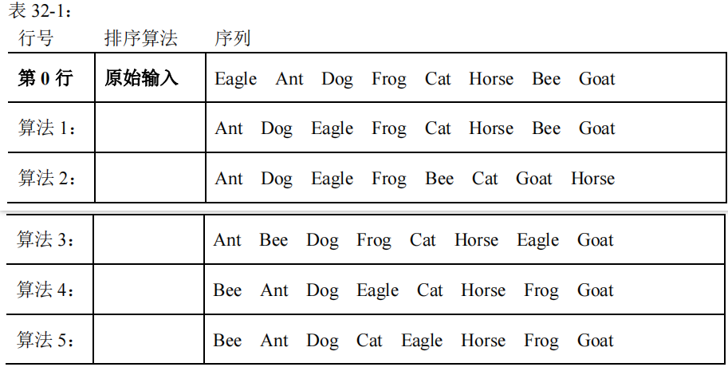
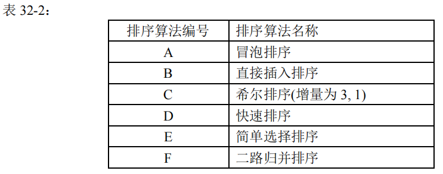

# DS-2022-32

## 1. 原题

下表 $32-1$ 中第 $0$ 行是待排序序列的原始输入( `Eagle Ant Dog Frog Cat Horse Bee Goat` ); 其他各行是 $5$ 种排序算法得到的某个中间步骤的内容。

表 $32-2$ 列出了 $6$ 种排序算法。

请按行序直接给出每行对应排序算法的编号。每个编号至多使用一次。

> 订正说明转录：源文作"每个编号只使用一次"，与"表 $32-2$ 列 $6$ 种算法、待配对行只有 $5$ 行"矛盾，据题意改为"至多使用一次"（与 2021 年第 32 题同型）。

表 32-1（按图转录）：

| 行号 | 序列 |
|---|---|
| 第 0 行（原始输入） | `Eagle Ant Dog Frog Cat Horse Bee Goat` |
| 算法 1 行 | `Ant Dog Eagle Frog Cat Horse Bee Goat` |
| 算法 2 行 | `Ant Dog Eagle Frog Bee Cat Goat Horse` |
| 算法 3 行 | `Ant Bee Dog Frog Cat Horse Eagle Goat` |
| 算法 4 行 | `Bee Ant Dog Eagle Cat Horse Frog Goat` |
| 算法 5 行 | `Bee Ant Dog Cat Eagle Horse Frog Goat` |

表 32-2（按图转录）：

| 编号 | 排序算法名称 |
|---|---|
| A | 冒泡排序 |
| B | 直接插入排序 |
| C | 希尔排序（增量为 3, 1） |
| D | 快速排序 |
| E | 简单选择排序 |
| F | 二路归并排序 |

## 2. 答案

| 表 32-1 行 | 对应算法编号 | 依据（该算法的哪一趟） |
|---|---|---|
| 算法 1 行 | **B** 直接插入排序 | 第 2 趟末（把 $Dog$ 插入 $Ant,Eagle$ 之后） |
| 算法 2 行 | **F** 二路归并排序 | 第一趟归并末（有序段长度 $1\to 2$） |
| 算法 3 行 | **E** 简单选择排序 | 第 2 趟末（第 2 小的 $Bee$ 换到第 2 位） |
| 算法 4 行 | **C** 希尔排序 | $d=3$ 趟末（三个分组各自组内有序） |
| 算法 5 行 | **D** 快速排序 | 以 $Eagle$ 为枢轴的一趟划分后（枢轴落定第 5 位） |

**未被使用的编号：A（冒泡排序）**。即 $1\to B,\ 2\to F,\ 3\to E,\ 4\to C,\ 5\to D$。

## 3. 题目分析

- 已知：$8$ 个英文单词的原始序列，以及 $5$ 个"中间步骤"状态；候选算法 $6$ 个；约束为"每个编号至多使用一次"；
- 目标：把每个状态反推回产生它的算法（DS06.11 的"由中间结果反推算法"）；
- 关键约束与前置约定：
  1. **比较规则**：按字典序（这里等价于按首字母 $A<B<C<D<E<F<G<H$）升序，最终序列为 `Ant Bee Cat Dog Eagle Frog Goat Horse`；为省事可把八个词记作 $E,A,D,F,C,H,B,G$；
  2. **"中间步骤"= 一趟结束后的状态**：这是本类题（同型题见 DS-2020-36、DS-2021-32）的标准口径。各算法"一趟"的定义必须写清楚：插入排序第 $i$ 趟 = 前 $i+1$ 个记录有序；冒泡第 $i$ 趟 = 一趟相邻交换使第 $i$ 大的记录沉底；简单选择第 $i$ 趟 = 选出第 $i$ 小的记录并换到第 $i$ 位；希尔一趟 = 一个增量 $d$ 的分组直插完成；快排一趟 = 一次划分使枢轴落定；归并一趟 = 把所有相邻有序段两两归并（段长 $1\to2\to4\to\cdots$）；
  3. **算法实现细节会影响结果**：快排取哪个枢轴、用挖坑法还是交换法；冒泡是自前往后（大者沉底）还是自后往前（小者冒前）；希尔的增量序列（题给 $3,1$）。本题必须按严蔚敏教材口径统一约定（第 6 节逐条写明），否则配对口径不可比；
  4. $5$ 行对 $6$ 个编号 ⟹ 必有一个编号用不上（与 2021 年第 32 题结构相同），故"某算法不匹配任何行"本身不是题目缺陷，需要区分的是"**某行不匹配任何算法**"（这才是数据缺陷）；
- 命题意图：六种内部排序的**过程特征**辨识，而非结果排序；同时隐含考查"趟"这一易混概念的精确定义。

## 4. 核心考点

核心考点：
DS06.11 排序算法应用（算法识别）——把 $5$ 个中间状态与 $6$ 种算法的过程特征逐一对号，要求"每行都能被某算法的某一趟精确产生"

辅助考点：
DS06.02.01 直接插入排序——"前 $i+1$ 个记录有序、其余保持原序"的趟末形态（算法 1 行）；
DS06.05 希尔排序——增量 $d$ 趟末"每组内部有序、整体无序"（算法 4 行，$d=3$）；
DS06.06 快速排序——一趟划分后"枢轴落定最终位置、左小右大"（算法 5 行）；
DS06.08 二路归并排序——一趟归并后"长度 $2^k$ 的段各自有序、段间无序"（算法 2 行）

解释：冒泡（DS06.03）与简单选择（DS06.04）也是候选，但冒泡在本题是"陪选项"（不匹配任何行），选择只对应算法 3 行；识别工作主要靠上述四个"段结构/枢轴/分组"特征，故列它们为辅助考点。

## 5. 解题思路

1. **先做符号化**：把单词换成首字母 $E\ A\ D\ F\ C\ H\ B\ G$，目标升序 $A\ B\ C\ D\ E\ F\ G\ H$，比对时不易被单词长度干扰；
2. **给每个算法列出"趟边界状态表"**：从第 0 行出发，按教材口径逐趟手工推演，把每个算法的所有趟末状态都写出来（第 6 节 6.1~6.6），而不是"看着像什么就算什么"——这是排除主观性的唯一办法；
3. **用结构特征快速定位候选**：
   - 前缀是"全局最小的 $k$ 个且已就位"，中段原封不动 ⟹ 选择排序；
   - 前 $m$ 个元素内部有序、其余原序 ⟹ 插入排序；
   - 存在某个 $d$ 使"同余位置类内部有序" ⟹ 希尔排序；
   - 某个元素落在它的最终位置上且左小右大 ⟹ 快排一趟划分；
   - 定长分段各自有序 ⟹ 归并；
   - 末尾若干个位置是"最大的若干个数" ⟹ 冒泡；
4. **交叉排除，做行×算法矩阵**：每个单元格只允许一个"精确相等"的 ✓（第 12 节矩阵）；
5. **检查唯一性与可达性**：确认没有"整行全 ✗"的不可达行，再确认"至多使用一次"约束下解唯一；
6. **对含歧义的单元格补做敏感性分析**：本题有两处依赖约定（快排的划分实现、冒泡的扫描方向），第 6.7 节单独说明。

## 6. 详细解答

以下把第 0 行记为 $R_0=E\ A\ D\ F\ C\ H\ B\ G$，五行待配对状态记为 $R_1\sim R_5$：

$$R_1=A\ D\ E\ F\ C\ H\ B\ G,\quad R_2=A\ D\ E\ F\ B\ C\ G\ H,\quad R_3=A\ B\ D\ F\ C\ H\ E\ G,\quad R_4=B\ A\ D\ E\ C\ H\ F\ G,\quad R_5=B\ A\ D\ C\ E\ H\ F\ G$$

### 6.1 A 冒泡排序（正向：每趟自前往后相邻交换，使本趟最大者沉底）

| 趟 | 状态 |
|---|---|
| 初始 | $E\ A\ D\ F\ C\ H\ B\ G$ |
| 第 1 趟末 | $A\ D\ E\ C\ F\ B\ G\ H$（交换次序：$(E,A),(E,D),(F,C),(H,B),(H,G)$） |
| 第 2 趟末 | $A\ D\ C\ E\ B\ F\ G\ H$ |
| 第 3 趟末 | $A\ C\ D\ B\ E\ F\ G\ H$ |
| 第 4 趟末 | $A\ C\ B\ D\ E\ F\ G\ H$ |
| 第 5 趟末 | $A\ B\ C\ D\ E\ F\ G\ H$（其后各趟无交换） |

$R_1\sim R_5$ **均不在**上表中。反向冒泡（自后往前扫描，使本趟最小者冒到前面）第 1 趟末为 $A\ E\ B\ D\ F\ C\ H\ G$，同样不匹配任何行 ⟹ 冒泡排序在本题**不对应任何一行**（它就是"至多使用一次"中被剩下的那个编号）。

### 6.2 B 直接插入排序（第 $i$ 趟：把第 $i+1$ 个记录插入前面有序段）

| 趟 | 插入元素 | 状态 |
|---|---|---|
| 1 | $A$ | $A\ E\ D\ F\ C\ H\ B\ G$ |
| 2 | $D$ | $\mathbf{A\ D\ E\ F\ C\ H\ B\ G}$ $=R_1$ ✓ |
| 3 | $F$ | $A\ D\ E\ F\ C\ H\ B\ G$（$F$ 原位不动，与第 2 趟同形） |
| 4 | $C$ | $A\ C\ D\ E\ F\ H\ B\ G$ |
| 5 | $H$ | $A\ C\ D\ E\ F\ H\ B\ G$ |
| 6 | $B$ | $A\ B\ C\ D\ E\ F\ H\ G$ |
| 7 | $G$ | $A\ B\ C\ D\ E\ F\ G\ H$ |

⟹ **算法 1 行 = B**，且 $R_1$ 只出现在第 2 趟末。

### 6.3 C 希尔排序（增量 $d=3$，再 $d=1$；每趟对每个同余组作直接插入）

$d=3$ 分成三组（按位置 $1\!-\!4\!-\!7$、$2\!-\!5\!-\!8$、$3\!-\!6$）：

- 组①位置 $1,4,7$：$E,F,B\to$ 组内有序 $B,E,F$；
- 组②位置 $2,5,8$：$A,C,G\to$ 已有序，不变；
- 组③位置 $3,6$：$D,H\to$ 已有序，不变。

合并得 $d=3$ 趟末：$\mathbf{B\ A\ D\ E\ C\ H\ F\ G}=R_4$ ✓（特征：位置 $1,4,7$ 为 $B,E,F$ 升序；位置 $2,5,8$ 为 $A,C,G$ 升序；位置 $3,6$ 为 $D,H$ 升序——"组内有序、整体无序"）。
$d=1$ 趟末即完全有序，不匹配任何中间行。

⟹ **算法 4 行 = C**。

### 6.4 D 快速排序（取首元素 $Eagle$ 为枢轴，挖坑法一趟划分）

$R_0$ 的枢轴 $p=E$，$i,j$ 从两端相向扫描：

| 步骤 | 动作 | 序列状态（`_` 为当前坑） |
|---|---|---|
| 0 | 枢轴 $E$ 取出，坑在位置 1 | `_ A D F C H B G` |
| 1 | $j$ 向左找小于 $E$ 者：$G,H$ 不小于，$B<E$ ⟹ $B$ 填入位置 1 | `B A D F C H _ G`，坑在 7 |
| 2 | $i$ 向右找大于 $E$ 者：$A,D$ 不大于，$F>E$ ⟹ $F$ 填入位置 7 | `B A D _ C H F G`，坑在 4 |
| 3 | $j$ 继续左找：$C<E$ ⟹ $C$ 填入位置 4 | `B A D C _ H F G`，坑在 5 |
| 4 | $i$ 右移到 $5$，$i=j$ ⟹ 枢轴落定位置 5 | `B A D C E H F G` |

一趟划分结果 $\mathbf{B\ A\ D\ C\ E\ H\ F\ G}=R_5$ ✓（特征：$E$ 恰在最终第 5 位，左侧 $B,A,D,C$ 全 $<E$，右侧 $H,F,G$ 全 $>E$）。

⟹ **算法 5 行 = D**。

### 6.5 E 简单选择排序（第 $i$ 趟：在 $i..n$ 中选最小，与位置 $i$ 交换）

| 趟 | 选中元素（与位置 $i$ 交换） | 状态 |
|---|---|---|
| 1 | $A$（位置 2）与位置 1 的 $E$ 交换 | $A\ E\ D\ F\ C\ H\ B\ G$ |
| 2 | 在位置 $2..8$ 中选 $B$（位置 7）与位置 2 的 $E$ 交换 | $\mathbf{A\ B\ D\ F\ C\ H\ E\ G}=R_3$ ✓ |
| 3 | 选 $C$（位置 5）与位置 3 的 $D$ 交换 | $A\ B\ C\ F\ D\ H\ E\ G$ |
| 4 | 选 $D$（位置 5）与位置 4 的 $F$ 交换 | $A\ B\ C\ D\ F\ H\ E\ G$ |
| 5 | 选 $E$（位置 7）与位置 5 的 $F$ 交换 | $A\ B\ C\ D\ E\ H\ F\ G$ |
| 6 | 选 $F$（位置 7）与位置 6 的 $H$ 交换 | $A\ B\ C\ D\ E\ F\ H\ G$ |
| 7 | 选 $G$（位置 8）与位置 7 的 $H$ 交换 | $A\ B\ C\ D\ E\ F\ G\ H$ |

$R_3$ 的特征：前 $2$ 位已是全局最小的 $A,B$，位置 $3..6$ 完全保持原序（$D,F,C,H$），只有被换走的 $E$ 出现在位置 7 ⟹ 只有"交换式选择"能产生这种形态（插入排序不可能让 $D,F,C,H$ 保持原序却把 $A,B$ 提前）。

⟹ **算法 3 行 = E**。

### 6.6 F 二路归并排序（一趟：把所有相邻的等长有序段两两归并，段长 $1\to2\to4\to8$）

- 初始：每段长 $1$：$(E)(A)(D)(F)(C)(H)(B)(G)$；
- $width=1$ 趟末：$(A\ E)(D\ F)(C\ H)(B\ G)\to A\ E\ D\ F\ C\ H\ B\ G$；
- $width=2$ 趟末：$(A\ D\ E\ F)(B\ C\ G\ H)\to \mathbf{A\ D\ E\ F\ B\ C\ G\ H}=R_2$ ✓；
- $width=4$ 趟末：$A\ B\ C\ D\ E\ F\ G\ H$。

$R_2$ 的特征：前 $4$ 个与后 $4$ 个**各自内部有序**、且恰好是"两两归并"的段结构（$A,D,E,F$ 与 $B,C,G,H$）；注意它与 $R_1$ 只差后 $4$ 个元素（$R_1$ 后段是原序 $C,H,B\ldots$），所以 $R_2$ 不可能是插入排序的任一趟末 ⟹ **算法 2 行 = F**。

### 6.7 两处口径敏感性（巡检时特别核对）

1. **快排的划分实现**：6.4 用严蔚敏教材的**挖坑法**（枢轴先取出、两端交替填坑），得 $R_5$。若改用"枢轴与 $i,j$ 相遇位置交换"的**交换式 partition**（$i,j$ 同向扫描、找到逆序对即交换），一趟划分结果为 $C\ A\ D\ B\ E\ H\ F\ G$，与 $R_1\sim R_5$ 都不相等。故算法 5 行的配对**以挖坑法为准**（本题其余各行不受该约定影响）。
2. **冒泡的扫描方向**：6.1 已同时核对正向与反向两种冒泡，两者各趟末均不匹配任何行 ⟹ 编号 A 被排除的结论与方向约定无关。
3. **"中间步骤"是否允许趟内瞬时状态**：若把口径放宽到"一趟进行到一半"，则 $R_1$ 还同时是冒泡第 1 趟内第 2 次交换后的状态（$E\ A\ D\cdots\to A\ E\ D\cdots\to A\ D\ E\ F\ C\ H\ B\ G$），此时 $R_1$ 有 $A/B$ 二义。本解析采用**趟边界**口径：一是同型题（DS-2020-36、DS-2021-32）均以此口径给出答案，二是只有该口径下"$5$ 行 $=5$ 种算法、$1$ 个编号空出"的命题结构才成立（放宽口径会使直接插入排序无对应行，与题面"其他各行是 $5$ 种排序算法得到的某个中间步骤"矛盾）。

## 7. 选项分析

不适用（综合应用题·排序算法配对题）。表 32-2 的六个编号即候选集，逐编号的匹配情况已在第 12 节比对矩阵中给出：B、F、E、C、D 各对应一行，A 不对应任何行。

## 8. 考场标准答案

按行序：

$$\boxed{1\to B,\quad 2\to F,\quad 3\to E,\quad 4\to C,\quad 5\to D}$$

（未使用的编号为 A 冒泡排序。）

一行一句的理由（考场可简写）：

1. $R_1$：前 $3$ 个 $A,D,E$ 已有序、其余保持原序 ⟹ 直接插入排序第 2 趟末（B）；
2. $R_2$：$(A\,D\,E\,F)$ 与 $(B\,C\,G\,H)$ 两段分别有序 ⟹ 归并第一趟（段长 $1\to2$）（F）；
3. $R_3$：前 $2$ 位是全局最小的 $A,B$，位置 $3..6$ 原封未动，被换出的 $E$ 落到位置 7 ⟹ 简单选择排序第 2 趟末（E）；
4. $R_4$：位置 $1,4,7$ 为 $B,E,F$、位置 $2,5,8$ 为 $A,C,G$、位置 $3,6$ 为 $D,H$，各组内部有序 ⟹ 希尔排序 $d=3$ 趟末（C）；
5. $R_5$：$Eagle$ 落在最终位置（第 5 位），左小右大 ⟹ 快速排序一趟划分（D）。

排除 A：冒泡正向第 1 趟末为 $A\,D\,E\,C\,F\,B\,G\,H$、反向第 1 趟末为 $A\,E\,B\,D\,F\,C\,H\,G$，其后各趟前缀只会更长，均与 $R_1\sim R_5$ 不等。

## 9. 易错点

1. **把"一趟"定义搞混**：插入排序的第 $i$ 趟是"前 $i+1$ 个有序"（趟末形态与希尔 $d=1$、归并段内形态极易互混），希尔的一趟是"一个增量的全部分组做完"，不是"一组做完"；把希尔 $d=3$ 只做完组①就当成一趟，会得到 $R_4$ 之外的错形。
2. **$R_1$ 与 $R_2$ 混淆**：两者前 $4$ 位相同（$A\,D\,E\,F$），差别全在后 $4$ 位——$R_1$ 后段 $C\,H\,B\,G$ 是**原序**（插入排序未触及），$R_2$ 后段 $B\,C\,G\,H$ 是**归并结果**。只看前缀会把两行配到同一算法。
3. **$R_3$ 误配插入排序**：插入排序第 2 趟末是 $R_1$，绝不可能出现"前两位是全局最小的 $A,B$ 而中间四个元素原封不动"；识别选择排序要看"被选走元素的原位置出现了什么"（这里是位置 2 的 $E$ 被换到位置 7）。
4. **快排枢轴位置判据用反**：一趟划分后**枢轴必在最终位置**（$Eagle$ 是第 5 小，恰在第 5 位），这是 $R_5$ 的"指纹"；若忘了这条，容易把 $R_5$ 错配给希尔或冒泡。
5. **划分实现不统一**：挖坑法与交换法结果不同（6.7 第 1 条），同一份答案里不能一半用挖坑一半用交换。
6. **见"某算法没行可配"就判题错**：本题是 $6$ 选 $5$，必有一个编号空出；真正需要核对的是"某行没有任何算法可配"（数据缺陷），二者方向相反。

## 10. 一句话规律

排序状态识别题的通用解法是**"符号化 + 逐趟全量枚举 + 结构指纹比对"**：先把记录换成单字母，再把每个算法的每一趟末状态全部推出来列成表，最后用"前缀有序（插入）/ 段内有序（归并、希尔）/ 前 $k$ 位是全局最小 $k$ 个（选择）/ 枢轴落定（快排）/ 末尾 $k$ 位是全局最大 $k$ 个（冒泡）"这些指纹逐行对号，并检查有无不可达行与是否唯一。

## 11. 关联知识

- 同型题：**DS-2020-36**（$9$ 个数字、$6$ 算法 $5$ 行，其第 2、3 行经验证不是任一算法的趟末状态，属数据缺陷，故该题记为 `uncertain`）、**DS-2021-32**（$10$ 个数字，其第 1 行在直接插入与简单选择之间不可区分，记为 `disputed`）。本题与之不同：**五行全部可达、判定唯一**，比对矩阵见第 12 节；
- DS06.01 的"趟"概念是四道同型题共同的判据来源；希尔增量序列（DS06.05）、划分后枢轴位置（DS06.06）、归并段长演进（DS06.08）三者的"趟末形态"是区分度最高的三条指纹；
- 各算法的稳定性与空间开销比较（DS06.11）不为本问所需，但同一套"趟末状态表"正是这类比较的原材料。

## 12. 来源与可信度

**原题来源**：2022 重庆邮电大学 802 数据结构真题（回忆版整理文本），第 32 题；表 32-1、表 32-2 以图片给出（`fig3.png`、`fig4.png`），第 1 节按图逐格转录；题面含订正说明（"每个编号只使用一次"→"至多使用一次"），已按格式转写。转录自检：五行序列与第 0 行都是同一多重集 $\{A,B,C,D,E,F,G,H\}$（$8$ 个词无增无减），若读错任一词该检验即失败。

**巡检任务结论（登记簿要求核对"是否存在不可达行 / 判定是否唯一"）**：

- **不存在不可达行**：$R_1\sim R_5$ 每一行都至少被一个算法的某一趟精确产生；
- **判定唯一**（在"趟边界"标准口径下）：$1\to B,\ 2\to F,\ 3\to E,\ 4\to C,\ 5\to D$，且五个编号互不相同，满足"每个编号至多使用一次"；
- **未使用的编号是 A（冒泡排序）**，这是 $6$ 选 $5$ 的正常结果，不构成缺陷；
- 两处口径敏感性（不改变上述结论，但必须声明）：① $R_5$ 依赖快排采用**挖坑法**划分（交换式 partition 的结果 $C\ A\ D\ B\ E\ H\ F\ G$ 不匹配任何行）；② 若把"中间步骤"放宽到**趟内瞬时状态**，$R_1$ 会与冒泡第 1 趟内第 2 次交换后的状态重合（$A/B$ 二义），但同时会使直接插入排序失去唯一对应行、破坏"$5$ 行配 $5$ 种算法"的题设，故不采放宽口径。

**比对矩阵（行 × 算法；✓ = 该算法某一趟末精确等于该行；"—" = 不匹配，括号内为该算法最接近的趟末状态）**

| 行 \ 算法 | A 冒泡 | B 直接插入 | C 希尔 | D 快排（挖坑） | E 简单选择 | F 二路归并 |
|---|---|---|---|---|---|---|
| $R_1$ `A D E F C H B G` | —（第1趟末 `A D E C F B G H`；行1 仅为其第1趟**内**第2次交换后的瞬时态） | ✓ 第2趟末（第3趟末同形） | —（$d=3$ 趟末 `B A D E C H F G`，$d=1$ 已有序） | —（一趟划分 `B A D C E H F G`） | —（第1趟末 `A E D F C H B G`，第2趟末 `A B D F C H E G`） | —（$width=1$ 趟末 `A E D F C H B G`，$width=2$ 趟末 `A D E F B C G H`） |
| $R_2$ `A D E F B C G H` | —（各趟末最大者逐位沉底，第2趟末 `A D C E B F G H`） | —（第4趟末 `A C D E F H B G`，第6趟末 `A B C D E F H G`，无一行等于 $R_2$） | — | — | —（第6趟末 `A B C D E F H G`） | ✓ $width=2$ 趟末 |
| $R_3$ `A B D F C H E G` | — | —（插入排序前缀必连续有序，$R_3$ 前 2 位有序但位置 3 起为原序，形态不可能出现） | — | — | ✓ 第2趟末 | — |
| $R_4$ `B A D E C H F G` | — | — | ✓ $d=3$ 趟末 | — | —（第1趟末 `A E D F C H B G`） | — |
| $R_5$ `B A D C E H F G` | — | — | — | ✓ 一趟划分后（枢轴 $E$ 落定第 5 位） | —（第5趟末 `A B C D E H F G`，与 $R_5$ 前 4 位不同） | — |
| **该行是否有算法可达** | — | 1 行 | 1 行 | 1 行 | 1 行 | 1 行 | **5 行全部可达** |
| **该算法是否有行可配** | **无（A 未使用）** | 有 | 有 | 有 | 有 | 有 | — |

**枚举规模核对**：六个算法（含冒泡正/反两个方向、快排挖坑/交换两种划分）的全部趟末与趟内单步状态合计 $59$ 个互异序列，$R_1\sim R_5$ 全部落在此集合内；上表"精确相等"关系在"每行一个算法、编号至多使用一次"的约束下只有唯一解。

**答案来源与验证**：独立推导（手工逐趟推演，第 6 节全部可复现）；后台用脚本对六种算法按趟边界与趟内单步两种口径做全量枚举，结果与手工推演逐条一致（程序只作后台核对，正文不依赖）。知乎解析篇仅登记 URL，未抓取比对。

**教材依据**：严蔚敏《数据结构》中直接插入排序、简单选择排序、冒泡排序、希尔排序（按给定增量序列逐趟）、快速排序（一趟划分算法，挖坑法）、二路归并排序（"两两归并"的趟定义）的算法描述。

**是否争议**：无争议。本题与 DS-2020-36（存在不可达行，`uncertain`）、DS-2021-32（两算法趟末重合，`disputed`）不同，不需要登记争议；仅需在第 6.7 节声明快排划分口径。

**最终可信度**：`solution_status: verified`，答案置信度 high（唯一性由比对矩阵穷举保证）；题面转录置信度 medium（图片表格 + 订正说明）。
