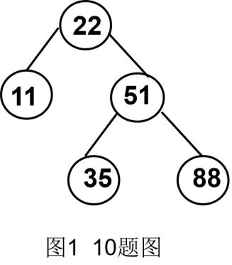

# DS-2023-10

## 1. 原题

在图 $1$ 所示的平衡二叉树中插入关键字 $46$ 后得到一棵新的平衡二叉树，在新的平衡二叉树中，关键字 35 所在结点的左孩子结点中保存的关键字是 ____________________。



（图 $1$ 注："图1 10题图"。图中结点自根起为：$22$ 为根，左孩子 $11$、右孩子 $51$；$51$ 的左孩子 $35$、右孩子 $88$；$11$、$35$、$88$ 均为叶子。）

## 2. 答案

**$22$**。

插入 $46$ 后需作一次 **RL 型双旋**，新平衡二叉树为

$$35\ (\text{左 }22,\ \text{右 }51),\quad 22\ (\text{左 }11,\ \text{右 }\varnothing),\quad 51\ (\text{左 }46,\ \text{右 }88)$$

故 $35$ 的左孩子保存的关键字是 $22$。

## 3. 题目分析

- 已知（读图）：原 AVL 树 $T$ 的形态为

$$22\to[\,11,\ 51\,],\qquad 51\to[\,35,\ 88\,],\qquad 11,\ 35,\ 88\ \text{为叶子}$$

  各结点平衡因子（左子树高 $-$ 右子树高）：$35:0$、$88:0$、$11:0$、$51:1-1=0$、$22:1-2=-1$，全部属于 $\{0,1,-1\}$，确为平衡二叉树 ✓；树高 $3$；
- 目标：插入 $46$ 后重新平衡，求新树中结点 $35$ 的**左孩子**的关键字；
- 关键约束：
  1. 插入位置由 BST 有序性唯一决定：$46>22$ 走右、$46<51$ 走左、$46>35$ 走右 ⟹ $46$ 成为 $35$ 的**右孩子**；
  2. AVL 性质要求任一结点左右子树高度差不超过 $1$，失衡后就地选择 LL/RR/LR/RL 四种旋转之一调整**最小子树**；
  3. 旋转只改变局部指针，不改变中序序列的有序性，也不影响被旋转子树之外的结构（$11$、$88$ 的归属变化必须严格按"中间子树重新挂接"规则处理）；
- 命题意图：AVL 的插入与旋转（DS05.07.02）。本题的判分点有三处：① 插入位置是否找对（$35$ 的右孩子）；② 失衡结点是否判定为 $22$（而不是 $51$）；③ RL 双旋后中间结点 $35$ 上升为子树根、其左孩子恰为原失衡点 $22$。

## 4. 核心考点

核心考点：
DS05.07.02 平衡二叉树——插入后自底向上检查平衡因子、定位最小失衡子树、按失衡路径类型（此处 RL）执行"先同向旋、再反向旋"的双旋调整

辅助考点：
DS05.07.01 二叉搜索（排序）树——插入位置由关键字比较路径唯一确定；旋转前后中序序列保持有序，是验证结果的主要手段

## 5. 解题思路

1. **读图建树**：把图 $1$ 写成"结点 → [左, 右]"形式，并标出每个结点的高度与平衡因子；
2. **确定插入位置**：沿 BST 比较路径 $22\to51\to35$ 下行，$46$ 挂在 $35$ 的右孩子；
3. **自底向上重算平衡因子**：$35:0-1=-1$、$51:2-1=+1$、$22:1-3=-2$ ⟹ 第一个（也是唯一一个）失衡结点是 $22$；
4. **判型**：从 $22$ 出发沿"较高（此处为右）子树"下行到 $51$，再到新结点所在方向"左"（$35$）⟹ 路径为 **右-左**，即 RL 型；
5. **执行双旋**：先以 $35$ 为枢轴对 $51$ 作**右旋**，再以 $35$ 为枢轴对 $22$ 作**左旋**；每次旋转都要显式写出"中间子树"（此处为 $46$ 及其子树）的重新挂接；
6. **读答案并复核**：新子树根 $35$，其左孩子 $22$；用"中序序列是否仍为 $11,22,35,46,51,88$"与"各结点平衡因子是否都 $\in\{0,1,-1\}$"两件事复核。

## 6. 详细解答

### 第一步：插入 $46$

$$46>22\ (\text{右})\ \to\ 46<51\ (\text{左})\ \to\ 46>35\ (\text{右})\ \to\ 35\ \text{无右孩子}$$

故 $46$ 成为 $35$ 的右孩子：

```
        22
       /  \
     11    51
           /  \
         35    88
           \
            46
```

### 第二步：自底向上算平衡因子（左高 $-$ 右高）

| 结点 | 左子树高 | 右子树高 | 平衡因子 | 是否失衡 |
|---|---|---|---|---|
| $11$ | $0$ | $0$ | $0$ | 否 |
| $46$ | $0$ | $0$ | $0$ | 否 |
| $35$ | $0$ | $1$ | $-1$ | 否 |
| $88$ | $0$ | $0$ | $0$ | 否 |
| $51$ | $2$ | $1$ | $+1$ | 否 |
| $22$ | $1$ | $3$ | $-2$ | **是（最小失衡子树根）** |

### 第三步：判定旋转类型

失衡点 $22$ 的较高一侧是**右**孩子 $51$；$51$ 的较高一侧是**左**孩子 $35$（其右挂着新结点 $46$）。路径 **右 → 左 ⟹ RL 型**，须作双旋：**先对右孩子 $51$ 右旋，再对失衡点 $22$ 左旋**。

### 第四步：第一次旋转——以 $35$ 为枢轴对 $51$ 右旋

规则：$35$ 的右子树（$46$）摘下，改挂为 $51$ 的左子树；$35$ 顶替 $51$ 的位置，$51$ 降为 $35$ 的右孩子。

```
        22
       /  \
     11    35
             \
              51
             /  \
           46    88
```

（$46$ 原为 $35$ 的右孩子，右旋后成为 $51$ 的左孩子——$46<51$ 且 $46>35$，挂接位置仍满足 BST 有序性 ✓）

### 第五步：第二次旋转——以 $35$ 为枢轴对 $22$ 左旋

规则：$35$ 的左子树（此处为空 $\varnothing$）摘下，改挂为 $22$ 的右子树；$35$ 顶替 $22$ 在原树中的位置（成为这一子树的新根），$22$ 降为 $35$ 的左孩子。

```
          35
        /    \
      22      51
     /  \    /  \
   11   ∅  46    88
```

### 第六步：结果复核

**（a）平衡因子全表**

| 结点 | 左高 | 右高 | 平衡因子 |
|---|---|---|---|
| $11$ | $0$ | $0$ | $0$ |
| $46$ | $0$ | $0$ | $0$ |
| $88$ | $0$ | $0$ | $0$ |
| $22$ | $1$ | $0$ | $+1$ |
| $51$ | $1$ | $1$ | $0$ |
| $35$ | $2$ | $2$ | $0$ |

全部 $\in\{0,1,-1\}$ ⟹ 确为平衡二叉树，树高 $3$ ✓

**（b）中序有序性**：中序遍历得 $11,\ 22,\ 35,\ 46,\ 51,\ 88$，严格递增 ✓（与原树中序 $11,22,35,51,88$ 相比只多了一个 $46$，旋转不改变中序次序）

**（c）直接读题**：新树中 $35$ 的左孩子为 $22$（右孩子为 $51$）。

（后台以 C 程序实现教材风格的 AVL 插入（`typedef struct AVLNode{ int key; int height; struct AVLNode *left,*right; }`，含 `Max`、`Height` 与 LL/RR/LR/RL 四种调整函数），按 $22,11,51,35,88$ 建树后插入 $46$，再逐结点打印"左、右孩子关键字与平衡因子"，输出为 `key=35 leftChild=22 rightChild=51`，且中序序列 $11,22,35,46,51,88$、失衡结点计数为 $0$；程序仅作验证，正文可手工复现。）

**答案：$22$。**

## 7. 选项分析

不适用（填空题）。

## 8. 考场标准答案

$46$ 沿 $22(\text{右})\to51(\text{左})\to35(\text{右})$ 插入为 $35$ 的右孩子；回溯平衡因子得 $35:-1$、$51:+1$、$22:-2$，最小失衡子树根为 $22$，失衡路径为"右孩子 $51$ 的左子树"，属 **RL 型**。

作 RL 双旋：先以 $35$ 为枢轴对 $51$ 右旋（$46$ 改挂为 $51$ 的左孩子），再以 $35$ 为枢轴对 $22$ 左旋（$35$ 的左子树 $\varnothing$ 改挂为 $22$ 的右孩子）。

所得新 AVL 树：根 $35$，左孩子 $22$（其左 $11$）、右孩子 $51$（其左 $46$、右 $88$）。

$$\boxed{22}$$

## 9. 易错点

1. **把失衡点认成 $51$**：$51$ 的左右子树高为 $2$ 与 $1$，差为 $1$，并未失衡；失衡点必须是 $|BF|>1$ 的**最深**结点，这里只有 $22$；
2. **判型反了（误作 LR）**：LR/RL 的字母顺序是"从失衡点向下的路径方向"。本题第一次偏右（$22\to51$）、第二次偏左（$51\to35$），故是 **RL**；若错判为 LR 会先对 $22$ 的左孩子 $11$ 旋转，得到完全错误的树形；
3. **只旋一次**：仅对 $22$ 作一次左旋（以 $51$ 为枢轴）会得到 $51$ 为根、$22$ 为其左孩子、$35$（带右孩子 $46$）为 $22$ 的右孩子的树。它仍是合法的二叉搜索树（旋转不改变中序次序），但根 $51$ 的左子树高 $3$、右子树高 $1$，平衡因子为 $2$ —— **失衡只是从 $22$ 转移到了 $51$，并未消除**。这正是 RL/LR 型必须做两次旋转的原因：先通过同向单旋把“中间结点” $35$ 提到失衡点的较高一侧，才能用第二次旋转把高度差均摊掉；
4. **丢掉"中间子树"**：$35$ 上升时，它原有的左子树（本题为空）必须挂到 $22$ 的右边；若插入的是 $33$（$35$ 的左孩子），则 $33$ 及其子树的归属是本题最容易出错的一格；
5. **读图出错**：把 $35$ 看成 $51$ 的右孩子、$88$ 看成 $51$ 的左孩子，会使 BST 有序性（$35<51<88$）不成立，后续推导全错。原图中 $35$ 在 $51$ 左下方、$88$ 在右下方，且 $35<51<88$ 与"左小右大"一致，可互相印证；
6. **问的是"35 的左孩子"而非"新树的根"**：新树的根也是 $35$，两个空位容易答串。

## 10. 一句话规律

AVL 插入了标题的固定四步：**按 BST 找插入位置 → 自底向上重算平衡因子找最深的 $|BF|>1$ 结点 → 用"从该结点向较高子树再向更高一侧"的两步方向定 LL/RR/LR/RL → 单旋（LL/RR）或双旋（LR/RL），双旋的结果永远是"中间那个结点上升为子树根"**；最后用中序递增与平衡因子全表双向验证。

## 11. 关联知识

- DS-2006-39（关键字序列 $17,31,13,11,20,35,25,8,4,11,24,40,27$ 依次插入生成 AVL，其中"插入 $24$ 时对结点 $20$ 作 RL 双旋"）：与本小题同型的 RL 双旋实例，可对照检查"中间结点上升"的挂接细节；
- DS-2012-42（序列 $45,15,20,35,25,60$ 构造 AVL，三次调整含 LR、LL、RR）：一题之内集齐四种旋转，适合与本题配对练习"判型"；
- DS-2020-15（判断哪个不是 AVL）：本题第二步"逐结点算平衡因子"正是该题的判定方法；
- DS-2019-21（高度 $8$ 的 AVL 最少 $54$ 个结点）、DS-2012-35（高度 $4$ 最少 $7$ 个）、DS-2014-34 / DS-2018-23 / DS-2007-28（高度 $5$ 最少 $12$ 个）：AVL 的另一大考法（$N_h=N_{h-1}+N_{h-2}+1$），与本题的旋转考法互补；
- DS-2016-30 / DS-2015-28（含 $12$ 个结点的 AVL 最大深度，答案 $5$）：与本题同样需要"按结点算子树高度"的基本功；
- 教材依据：严蔚敏、吴伟民《数据结构（C 语言版）》第 7 章 查找——平衡二叉树（AVL）的平衡因子定义、LL/RR/LR/RL 四种调整情形与旋转图示。

## 12. 来源与可信度

- 原题来源：2023 回忆版题面篇 `真题/2023/2023重庆邮电大学802数据结构真题.md` 二、填空题第 10 题；题面文字按源文转录（含"关键字 35 所在结点的左孩子结点中保存的关键字"这一问法），图片按源文位置以 `` 引用，源文中的图注"图1 10题图"已在第 1 节以文字复述；本题无订正说明；
- **读图说明**：`imgs/fig1.png` 为圆圈结点加连线的树形图，五个结点的关键字可清晰辨认为根 $22$、左子 $11$、右子 $51$、$51$ 的左子 $35$ 与右子 $88$，$11/35/88$ 无子女；图中无虚线、无未标注结点、无第二棵子树，故读图结果唯一。读图结论另经两处交叉验证：① 该形态的中序遍历 $11,22,35,51,88$ 严格递增，符合二叉搜索树；② 各结点平衡因子为 $11:0$、$35:0$、$88:0$、$51:0$、$22:-1$，符合题面"平衡二叉树"的自述——若把 $35$、$88$ 的左右位置看反，中序即不递增，与题面矛盾，故可排除误读；
- 答案来源：独立推导（BST 定位 + 逐结点平衡因子表 + RL 双旋的分步指针改写 + 旋转后"平衡因子全表 / 中序递增"双重复核）；后台以 C 程序（`tmp/_avl2023_10.c`，教材风格 `typedef struct AVLNode{ int key; int height; struct AVLNode *left,*right; }` 与 `DoubleWithRightChild` 的 RL 双旋）先按 $22,11,51,35,88$ 建树（与图 $1$ 形态一致、中序 $11\ 22\ 35\ 51\ 88$、失衡结点计数 $0$），再插入 $46$，输出根为 $35$、`key=35 leftChild=22 rightChild=51`、`key=22 leftChild=11 rightChild=NULL bf=1`、`key=51 leftChild=46 rightChild=88 bf=0`，树高 $3$、中序 $11\ 22\ 35\ 46\ 51\ 88$、失衡结点计数 $0$，与手工结果逐结点一致（程序仅作验证，正文可手工复现）；未抓取解析篇网页，仅按要求登记其地址备查；
- 教材依据：严蔚敏、吴伟民《数据结构（C 语言版）》第 7 章 平衡二叉树；
- 多来源冲突：无；争议：无。旋转类型（RL）与结果树形态在"左小右大"与"平衡因子 $\in\{0,\pm1\}$"两条标准约定下均唯一，不存在多种合法答案（若某教材把平衡因子定义为"右高 $-$ 左高"，只是符号取反，失衡点与旋转类型不变）；
- 最终可信度：high。
